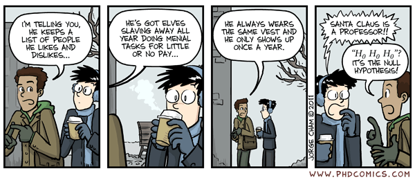

 

**Optional Lesson Video**

<iframe width="90%" align="right" src="https://www.youtube.com/embed/videoseries?list=PLaZryQtbPQC9m8e_GQgx8fVfP55cI0L9z" frameborder="1" allow="autoplay; encrypted-media" allowfullscreen></iframe>

 

## Lesson Outcomes

<a href="javascript:showhide('oc')">Show/Hide Solution</a>

By the end of this lesson, you should be able to:

* Distinguish between a categorical and a quantitative variable.
* Distinguish between an observational study and an experiment.
* Distinguish between a population and a sample.
* Distinguish and give an example of each of the following sampling schemes:
  + Simple random sampling
  + Systematic sampling
  + Cluster sampling
  + Stratified sampling
  + Convenience sampling
* Explain the significance of using a random sample.

 

## Introduction

Statistics are used in every aspect of society. Every statistical analysis follows a pattern we will call the Statistical Process. This process will be introduced in this lesson and will be used throughout the course.

 

### The Statistical Process and Daniel's Experiment

Stained-glass depiction of Daniel's deliverance from the lions' den. Found in the old Dominican priory church at Hawkesyard in Staffordshire, England.
(Photo credit: Fr Lawrence Lew, O.P. Used by permission.)

<!-- Used with written permission email 4/24/12 -->

The Old Testament prophet Daniel planned one of the earliest recorded scientific research studies. We will use his example to illustrate the following five steps of The Statistical Process.

The following icons can help you remember these steps. Notice that each icon has a letter and an image to help you remember the five steps of the Statistical Process.

 

| The Statistical Process | |
|:---------|:--------------------------------|
|  | **D**esign the Study |
|  | **C**ollect the Data |
|  | **D**escribe the Data|
|  | **M**ake Inference |
|  | **T**ake Action |

 

### Step 1: Design the Study 

An important step in scientific inquiry or problem solving can be to state a research question such as:

* Will internet advertising increase a company's revenue?
* Does expressing gratitude increase a person's satisfaction with life in general?
* Does a newly developed vaccine prevent the spread of disease?

Researchers also investigate the background of the situation. What have other people discovered about this situation?  How can we find the answer to the research question?  What do we need to do?  What is the **population** (or total collection of all individuals) under consideration?  What kind of data need to be collected?

Before collecting data, researchers make a hypothesis, or an educated guess about the outcome of their research. A hypothesis is a statement such as the following:

* Using internet advertising will increase the company's sales revenue.
* People who express gratitude will be more satisfied with life than those who do not.
* A newly-developed vaccine is effective at preventing tuberculosis.

 

#### Daniel's Experiment

After taking Israel captive, Babylon's King Nebuchadnezzar asked his chief officer to bring Israelite children who were well favoured, and skilful in all wisdom, and cunning in knowledge, and understanding science to stand in the king's palaces [(Daniel 1:4)](https://www.churchofjesuschrist.org/scriptures/ot/dan/1.4?lang=eng#3){target="_blank"}.  To aid their preparation, Nebuchadnezzar planned to feed them his meat and wine for three years [(Daniel 1:5)](https://www.churchofjesuschrist.org/scriptures/ot/dan/1.5?lang=eng#4){target="_blank"}.

Daniel did not want to defile himself by partaking of the king's meat and wine. He asked permission to eat pulse[^1] and drink water instead. His supervisor, Melzar, was afraid to displease the king. He thought that after eating pulse and water, the selected Israelites would look worse than their peers, and he would be punished [(Daniel 1:8-10)](https://www.churchofjesuschrist.org/scriptures/ot/dan/1.8-10?lang=eng#3){target="_blank"}.

With an understanding of the background of the situation, Daniel proposed an experiment. He said, Prove thy servants, I beseech thee, ten days; and let them give us pulse to eat, and water to drink. Then let our countenances be looked upon before thee, and the countenance of the children that eat of the portion of the king's meat: and as thou seest, deal with thy servants [(Daniel 1:12-13.)](https://www.churchofjesuschrist.org/scriptures/ot/dan/1.12-13?lang=eng#3){target="_blank"}.  In short, Daniel's implied research question can be stated as: Will those who eat pulse and drink water appear healthier than those who eat the king's meat and drink his wine? Melzar agreed to the experiment.

Answer the following question:

1. What is Daniel's hypothesis?

<a href="javascript:showhide('Q1')">Show/Hide Solution</a>

Daniel's hypothesis is that the Israelite children who eat pulse and drink water will appear healthier in just ten days, compared to those who eat the king's meat and drink his wine.

 

### Step 2: Collect Data

When designing a study, much attention is given to the process by which data are observed. When examining data, it is also important to understand the data collection procedures. A **sample** is a subset (a portion) of a population. How is this sample obtained?  How are the observations made?

Daniel's study design required that data be collected at the end of 10 days. Melzar would compare the appearances of two groups of people: (1) Israelites who ate pulse and drank water versus (2) Israelites who ate the king's meat and drank his wine.

 

### Step 3: Describe the Data

When we describe data, we use any tools appropriate to the situation. This can include creating graphs or calculating statistics to help understand or visualize the data.

For Daniel's experiment, the data are described in [Daniel 1:15](https://www.churchofjesuschrist.org/scriptures/ot/dan/1.15?lang=eng#3){target="_blank"}:  And at the end of ten days [the] countenances [of those who ate pulse] appeared fairer and fatter in flesh than all the children which did eat the portion of the king's meat.

 

### Step 4: Make Inferences

Inference is the process of using the information contained in a sample from a population to make a general statement (i.e. to infer something) about the entire population. Later in the course we will learn techniques that make this type of analysis possible.

Melzar made an inference. Based on the results of the sample, he determined that (in general) those who eat pulse and drink water will be healthier than those who eat the king's meat and drink his wine [Daniel 1:15-16](https://www.churchofjesuschrist.org/scriptures/ot/dan/1.15-16?lang=eng#3){target="_blank"}.

 

### Step 5: Take Action

The goal of a statistical analysis is to determine which action to take in a particular situation. Actions can include many things: launching an internet ad campaign (or not), expressing gratitude (or not), getting vaccinated (or not), etc.

Melzar took action as described in [Daniel 1:16](https://www.churchofjesuschrist.org/scriptures/ot/dan/1.16?lang=eng#3){target="_blank"}:  Thus Melzar took away the portion of their meat, and the wine that they should drink; and gave [all the Israelite children] pulse.

Was the experiment a success?  

"Now at the end of the days that the king had said he should bring them in the king communed with them; and among them all was found none like Daniel, Hananiah, Mishael, and Azariah And in all matters of wisdom and understanding, that the king enquired of them, he found them ten times better than all the magicians and astrologers that were in all his realm" [Daniel 1:18-20](https://www.churchofjesuschrist.org/scriptures/ot/dan/1.18-20?lang=eng#3){target="_blank"}.

 

### Summary of the Statistical Process

Daniel's experience can also help you learn the Statistical Process. Look at the first letter of each of the steps in the Statistical Process. You can use the phrase "Daniel Can Discern More Truth" to help you to help you remember the five steps in the Statistical Process.

**The Statistical Process**

| &nbsp;  | Pneumonic    | Actual Process Step    |
|---------|--------------|------------------------|
| Step 1: | **D**aniel   | **D**esign the study   |
| Step 2: | **C**an      | **C**ollect data       |
| Step 3: | **D**iscern  | **D**escribe the data  | 
| Step 4: | **M**ore     | **M**ake inferences    | 
| Step 5: | **T**ruth    | **T**ake action        |

The Statistical Process will be used throughout the course. Take time to memorize the five steps.

 

The study designed by the Old Testament prophet Daniel provides an ancient example of a designed experiment. Daniel's experiment included two groups of people: those who had the experimental treatment eating pulse and drinking water (called the **treatment** group) and those who ate the standard food the king's meat (called the **control** group.)  The treatment group receives the experimental procedure. The control group is used for comparison.

Answer the following question:

2. Why was it important that Daniel's experiment included a control group?

<a href="javascript:showhide('Q2')">Show/Hide Solution</a>

If there was no control group, then there would be no way to compare the effect of the diets (the treatments). Having a control group allows a researcher to see the effect of not taking any action. For Daniel, the control group (who ate the king's meat and drank his wine) provided a basis for comparing the effect of the new treatment (i.e. eating pulse and drinking water.)

&nbsp;

 

## Design of Studies

Most research projects can be classified into one of two basic categories: observational studies or designed experiments. In an **experiment**, researchers control (to some extent) the conditions under which measurements are made. In an **observational study**, researchers simply observe what happens, without controlling the conditions under which measurements are made. Both types of study follow the five steps of the Statistical Process.

 

### Designed Experiments

In a **designed experiment**, researchers manipulate the conditions that the participants experience. They often do this by randomly assigning subjects to one of two groups, a "treatment" group and a "control" group. The experiment is conducted by applying some kind of treatment to the subjects in the treatment group and observing the effect of the treatment. Those in the control group do not receive the treatment and are also observed. In this way researchers can determine the effects of the treatment. The following example illustrates the use of these two groups.

**Jonas Salk's First Polio Vaccine Trial**

Beginning around 1916 and through the 1950s, a mysterious plague attacked infants and children. Symptoms included excruciating muscle pain and a stiff neck. This illness, which became known as poliomyelitis or simply “polio,” left children disfigured, paralyzed, and sometimes even dead.

While working as a researcher at the University of Pittsburgh School of Medicine, Dr. Jonas E. Salk developed a vaccine that might help prevent the spread of this disease. He conducted what has become one of the most famous designed experiments in history.

This short video below  provides a compelling summary of the famous Jonas Salk vaccine experiment. As you watch, notice each of the 5 steps of a statistical study in this study.
 
<iframe id="kaltura_player_1579210457" src="https://cdnapisec.kaltura.com/p/1157612/sp/115761200/embedIframeJs/uiconf_id/9828732/partner_id/1157612?iframeembed=true&playerId=kaltura_player_1579210457&entry_id=0_49lsphky" width="400" height="285" allowfullscreen webkitallowfullscreen mozAllowFullScreen allow="autoplay *; fullscreen *; encrypted-media *" frameborder="0"></iframe>

As explained in the video, in the first Salk trial almost 1.1 million children participated in the study. Even though the sample size was large, flaws in the study design rendered the results useless. 

Undaunted, Dr. Salk fixed the problems with the design and enrolled hundreds of thousands of additional children for the second phase of his study. In all, over 1.8 million infants and children participated in this experiment, making it the largest drug trial to date.

**Step 1: Design the study.**

The participants in a study are commonly called subjects. Sometimes subjects are called experimental units or simply units. In the Salk trials, the children who participated were the subjects.

Subjects (the children) were randomly assigned to one of two groups. The first group was given the experimental vaccine, the treatment. The treatment is the new or experimental condition that is imposed on the subjects. The subjects who receive the treatment make up the treatment group.

The second group was given a control or placebo.  In this study, the control was an injection that looked just like the vaccine, but contained a harmless saline solution. The control group or placebo group is made up of the subjects assigned to receive the control.

This study was double blind. Neither the children’s parents nor their doctors knew whether a particular child received the treatment or the control. Both parties were blinded to this information.

Because the children were assigned to the groups randomly, the two groups should be similar. If the vaccine is not effective, the number of future cases of polio should be about the same in each group. However, if Salk’s vaccine helped to prevent the spread of polio, then fewer cases should occur in the vaccinated group.

Answer the following questions:

3. Some children can be identified as having a higher risk of developing polio. Would it have been better if they were assigned to the treatment group so they could get the vaccine?

<a href="javascript:showhide('Q3')">Show/Hide Solution</a>

- No. The two groups need to be as similar as possible. Specifically, the people in the treatment group need to have the same potential (on average) of contracting polio as the people in the control group. If we put the people who are at a higher risk of developing polio in the treatment group, we run the risk of having more people in the treatment group getting polio simply because they are more likely to get it, *whether they are vaccinated or not.* Likewise, we might have fewer people in the control group getting polio just because they are less likely to get it, *whether they are vaccinated or not.*

- These two effects would create a bias against the vaccine, by making the vaccine look like it doesn't work, or doesn't work as well as it does. It might also make it appear that people who aren't vaccinated stay healthy and the vaccine is not needed. There is even a chance that people will conclude that the vaccine actually gives people polio.

- Randomly assigning subjects to the two groups tends to yield groups with similar characteristics---in this example, similar potential for contracting polio. Randomly assigning subjects to groups therefore defends us against problems like those mentioned in the previous paragraph.

 

4. Why is it important for the subject and those who assess the health of the subject to be unaware of whether or not that child received the vaccine?

<a href="javascript:showhide('Q4')">Show/Hide Solution</a>

- **Subjects:** Suppose a subject in the study thinks they're being treated. It has been documented that subjects with such knowledge tend to show improvement whether they are receiving the treatment or not. To see why, consider how you might feel and act if you were told you had been vaccinated. You might have a more hopeful outlook, leading to healthier living habits such as better hygiene and nutrition. Such changes would tend to reduce your chance of contracting polio *whether you've received the vaccine or not.* This might make the vaccine look like it works better than it does. It also might make the vaccine look like it works, even if it doesn't.

- Now suppose subjects in the control group know they are not being treated. This can also change the way they feel and act, in ways that can make them more likely to contract polio than they would be if they weren't in the study. This could make it look like the incidence of polio among unvaccinated persons is higher than it is, again making the vaccine look like it works better than it does.

- To reduce bias caused by such errors, subjects should not know to which group they are assigned.

- **Researchers:** Suppose a researcher assessing the health of a subject is told that the subject is in the control group. It has been documented that in such a case, the researcher is more likely to record that the subject has symptoms *even if the subject is not actually in the control group.* This makes it look like unvaccinated persons are more likely to get polio than they really are, which makes it look like the vaccine works better than it does.

- There are other effects of knowing to which group the subject belongs, such as doctors treating or advising the patient differently than they would without such knowledge. Such differences can make it harder to tell whether the vaccine works, and how well.

- To reduce bias caused by such effects, those assessing the health of the subjects should not be told to which group the subject belongs.

&nbsp;

 

The null and alternative hypotheses for this study are:

$H_0$:  The proportion of children who develop polio will be the same for the treatment and control groups.

$H_a$:  The proportion of children in the *treatment group* who develop polio will be *lower* than the proportion of children in the *control group* who develop polio.

**Step 2: Collect data.**

The researchers followed up with each child to determine if they contracted polio. They recorded the number of children in each group that developed polio during the study period. Not all of Salk's experiments were double-blind. Here is a summary of the results from the regions where a double-blind study was conducted (Francis et al., 1955; Brownlee, 1955):

<table>
<caption>**Children Who Developed Polio**</caption>
<thead>
<tr class="header">
<th></th>
<th>
Yes
</th>
<th>
No
</th>
<th>
Total
</th>
</tr>
</thead>
<tbody>
<tr class="odd">
<td>
Treatment Group
</td>
<td>
57
</td>
<td>
200,688
</td>
<td>
200,745
</td>
</tr>
<tr class="even">
<td>
Placebo Group
</td>
<td>
142
</td>
<td>
201,087
</td>
<td>
201,229
</td>
</tr>
</tbody>
</table>

**Step 3: Describe the data.**

One way to summarize the data is to compute the proportion of children in each group that developed polio. The proportion of children in the treatment group that developed polio during the study period is:

$$ \frac{57}{200745} = 0.000~283~9 $$

Answer the following questions:

5. Calculate the proportion of children in the placebo group that developed polio during the study period.

<a href="javascript:showhide('Q5')">Show/Hide Solution</a>

$$ \displaystyle{\frac{142}{201229} = 0.000~705~7} $$

 

6. Compare the two proportions. What do you observe?

<a href="javascript:showhide('Q6')">Show/Hide Solution</a>

- The proportion of children in the placebo group that develop polio during the study period  was more than double the proportion of children in the treatment group that developed polio during the study period. That suggests that the treatment is effective in reducing the proportion of children that will develop polio.

 

 

**Step 4: Make inferences**

Careful statistical analysis of the records suggested that this difference was so great that it was attributable to the vaccine and not to chance. Assuming that the vaccine had no effect, the probability that the difference in the proportions between the two groups would be at least as extreme as the difference Dr. Salk observed was very low: 0.00000000093. Because this probability is so small, it is highly unlikely that these results are due to chance. This probability is called the P-value, and it will be discussed in Unit 2.

 

For now it is only important to *be aware* of the P-value. In Unit 2 students will learn how to compute and interpret this value.

 

 

**Step 5: Take action**

Once it was clear that the vaccine was effective, children who were unvaccinated or had received the placebo were given Salk's vaccine. Since 1954, there has been a marked decrease in the number of polio cases worldwide (Offit, 2005). Public health researchers are striving to eradicate this disease entirely.

 

### Observational Studies

In an **observational study** researchers observe the responses of the individuals, without controlling the conditions experienced by the individuals. Therefore, they do not assign the participants to treatment or control groups.

Observational studies commonly occur in business settings. One example is a financial audit. The purpose of a financial audit is to assess the accuracy of a company's financial business practices. ImmunAvance Ltd., a non-government health care organization, hired the Accounting Office at Global Optimization Unlimited to perform an independent audit of their financial practices. ImmunAvance provides inoculation and other preventative health care services in rural African communities.

### Sampling Methods

**Step 2: Collect data**

There are several procedures that can be used to select a random sample from a population, including: **simple random** sampling (SRS), **systematic** sampling, **cluster** sampling, **stratified** sampling, and **convenience** sampling (or, haphazard sampling). These are examples of **sampling methods**.

A **simple random sampling (SRS)** is the best method for obtaining a random sample. If there is a list of all items in the population and they are all accessible, a SRS can be collected. For example, suppose there are 2,000 accounts receivable items in the population. Auditors can use a random number generator to choose values between 1 and 2,000 to identify which items are to be audited. Software can be used to create a list of random numbers corresponding to items for the audit. In Excel, the command to obtain a random number between 1 and 2,000 is =*RANDBETWEEN(1,2000)*. Sometimes it is necessary for auditors to renumber the items (1 to 2000) to help create random sample. A simple random sample can be obtained any time there is a complete list of the items to be sampled and they are all assessible. All the statistical procedures in this course assume that simple random sampling has been used.

A **systematic sample** is where auditors select every $k^{\text{th}}$ item in the population, beginning at a random starting point. As an example, suppose there are 2,000 accounts receivable items to be audited, and the auditors want to get a sample of 40 items from this population. The auditors would sample every 2000/40 =50th item. The auditors will use a random starting point in the first 50 items. So, suppose a random number generator gave 41 as a random number between 1 and 50. The auditors select the 41st item. The next item chosen will be item number 41+50=91. After that, the auditors will choose item number 91+50=141, and so on. Systematic sampling works well when the items are in a random, sequential ordering. If the items are not arranged randomly, a systematic sample can miss important parts of the population.

A **cluster sample** (sometimes called a *block sample*) consists of taking all items in one or more randomly selected clusters, or blocks. For example, all the accounts receivable items in a few randomly selected months (the blocks) could be sampled. When the variation from one block to another is relatively low, compared to the variation within the block, cluster sampling is a reasonable way to get a sample. However, in many cases, the number of blocks that must be sampled must be large in order to draw a reasonable audit conclusion. For this reason, a cluster sample is usually not recommended for audits.

A **stratified sample** is when the items to be sampled are organized in groups of homogeneous (similar) items called strata, then a simple random sample is drawn from each of these strata. Stratified sampling works well when the items are similar within each stratum and tend to differ from one stratum to another. In an audit of accounts receivable items, auditors could define the strata as: (1) accounts under \$1,000, (2) accounts between \$1,000 and \$4,999, (3) accounts between \$5,000 and \$9,999, and (4) accounts of \$10,000 or more. A certain number of items could be randomly selected from each of these strata. Auditors may choose to include in their sample all items from some strata, such as very large accounts (\$10,000 or more), when there are few items in those strata.

A **convenience sample** involves selecting items that are relatively easy to obtain and does not use random selection to choose the sample. Even though the sample is chosen by convenience, it should be done without introducing any systematic bias if possible. As an example of a convenience sample, an auditor could haphazardly select items from a filing cabinet. This is frequently done when a quick and simple sample is needed, but may not yield a sample that represents the population well. When possible, convenience samples **should be avoided.**

 

### Types of Variables

Auditors meticulously record information on every item audited, thus generating data. There are two basic types of data: quantitative and categorical. 

**Quantitative variables** provide numerical information. They represent things that are numeric in nature; things that are measured. For a quantitative variable, it makes sense to apply arithmetic operations to the data (such as adding one to a value, doubling a value, or comparing two values). The net worth of a company or the number of people it employs are both examples of quantitative variables: If one company is worth \$1,000,000 and a second company is worth \$2,000,000 then the second company really is worth twice the value of the first.

**Categorical variables** yield data that can only be considered as categories. Categorical variables are labels, and it does not make sense to do arithmetic with them. The following are examples of categorical variables: gender, nationality, job title, telephone number, etc. Even though a telephone number is made of digits, it does not make sense to double someone's phone number, to add one to their number, or to say one phone number is smaller than another. In Unit 3 we will learn more about Categorical variables and proportions.

The sample accounts receivable record has information on both types of variables.

Answer the following question:

7. For each of the following variables taken from this accounts receivable record, indicate whether the variable is quantitative or categorical.

<!--:a. Customer

<a href="javascript:showhide('Q2')">Show/Hide Solution</a>

The variable "Customer" is categorical. It classifies the customer.

  -->
a. Terms

<a href="javascript:showhide('Q7')">Show/Hide Solution</a>

- The variable "Terms" is categorical. It classifies the invoice by the terms of payment for that invoice.

 

b. Account number

<a href="javascript:showhide('Q8')">Show/Hide Solution</a>

- The variable "Account number" is categorical. Even though the account number is given a number, it is actually functioning as a label. It is not something that is counted or measured. It does not make sense to do arithmetic operations (like adding 1 or multiplying by 2) to the account number.

 

c. Invoice amount

<a href="javascript:showhide('Q9')">Show/Hide Solution</a>

- The variable "Invoice amount" is quantitative. It makes sense to do arithmetic operations to this value. For example, the amount of Invoice 5745 (which is \$990.00) is somewhat more than twice as much as that of Invoice 2378 (which is \$478.00).

&nbsp;

 

**Step 3: Describe the data**

After auditors collect a sample and compile the data, they review the evidence. Auditors may use graphs or compute numbers (such as the mean) to summarize the evidence they found.

 

## Making Inferences: Hypothesis Testing

**Step 4: Make inferences**

Auditors use the information drawn from the sample to form an opinion about the population. Whenever sample data is used to infer a characteristic of a population, it is called making an inference. **Inferential statistics** represents a collection of methods that can be used to make inferences about a population. Based on the documents reviewed, the auditors assess if the company is conducting its business in a proper manner.

When conducting an audit, the implicit assumption is that transactions have been posted properly. This foundational assumption is called the null hypothesis. The **null hypothesis** is a statement about the population that represents the status quo, conventional wisdom, or what is generally accepted as true. In the audit we're considering, the null hypothesis is

$H_0$:  ImmunAvance's financial statements are materially correct.

Auditors sample the company's records to collect evidence against the null hypothesis. If there is sufficient evidence, we reject the null hypothesis. If the null hypothesis is rejected, it is rejected in favor of another statement about the population: the **alternative hypothesis**. In the case of this audit, the alternative hypothesis is

$H_a$:  ImmunAvance's financial statements are not materially correct.

Notice that both the null and alternative hypotheses are statements about the state of *all* of ImmunAvance's financial documents, not just the documents included in the sample.

"Piled Higher and Deeper" by Jorge Cham
 

There is a formal procedure for testing the null and alternative hypotheses, called a **hypothesis test**. In a hypothesis test, the null hypothesis is always assumed to be true. If there is sufficient evidence against the null hypothesis, it is rejected. The evidence against the null hypothesis is assessed using a number called the $P$-value. The **P-value** is the probability of obtaining a result (called a test statistic) at least as extreme as the one you calculated, assuming the null hypothesis is true. We reject the null hypothesis if the $P$-value is small, say less than 0.05. If we assume the company's financial statements are materially correct, the $P$-value is the probability of observing errors with a total value that is as large or larger than that which was observed in the audit.

For ImmunAvance's audit, the $P$-value was determined to be 0.79. Assuming the null hypothesis is true, the probability of observing inconsistencies that are at least as great as those observed in the audit was 0.79. This is a very large value. So, it is not surprising to have observed the total number of the errors in this case. The probability that these differences could occur due to chance is very high. The conclusion is that the null hypothesis should not be rejected.

If the $P$-value is low, the null hypothesis is rejected. If this probability is large, the null hypothesis is not rejected.

Hypothesis tests sometimes lead accidentally to incorrect conclusions because we use data from samples (as opposed to data from entire populations). When random samples are selected, some of the samples will contain disproportionately few or many documents with errors, just by chance.

Think about drawing marbles from a container in which most of the marbles are white and a few are red. Each marble represents a document, and the red marbles represent documents with errors.

If you choose a random sample of the marbles in the jar, you might get all the red marbles in your sample, just by chance. This might lead you to conclude that there are many red marbles in the container, which is false. This is like an auditor rejecting the null hypothesis when it is true, because their sample contains more documents with errors than it should---just due to chance.

Likewise, when drawing marbles from your container, you might select none of the red marbles. This may lead you to conclude that there are no red marbles in the container, or very few, which is false. This is like an auditor failing to reject the null hypothesis when it is false, because their sample contains fewer documents with errors than it should---again, just due to chance.

Notice that if you draw only one marble, it will be either white or red, and you will be in one of the situations discussed in the previous two paragraphs. On the other hand, if you draw a larger sample, say 40, the chances are you will get a pretty good idea of the proportion of red to white marbles. Certainly better than if you only draw one marble. This emphasizes the roll of sample size in making inference; in general, the larger the sample size the better we understand the population.

Such errors are no one's fault; they are an inherent part of hypothesis testing. They make it impossible for us to be certain of the conclusions we draw using the statistical process. The thing to remember is that if we carry out the process correctly, our results are correct often enough to be very useful.

**Step 5: Take Action**

The auditors prepare a report in which they give their opinion on the status of the company's current operations.

There is not enough evidence to suggest that ImmunAvance's financial statements are not materially correct. The auditor's conclusion is that no adjustment is necessary, since the observed discrepancies could be attributed to chance.

 

## Summary

Remember...

- The **Statistical Process** has five steps: **D**esign the study, **C**ollect the data, **D**escribe the data, **M**ake inferences, **T**ake action.

- In a **designed experiment**, researchers control the conditions of the study. In an **observational study**, researchers don't control the conditions but only observe what happens.

- There are many sampling methods used to obtain a **sample** from a **population**:
  + A **simple random sample (SRS)** is a random selection taken from a population
  + A **systematic sample** is every ***k***th item in the population, beginning at a random starting point
  + A **cluster sample** is all items in one or more randomly selected clusters, or blocks
  + A **stratified sample** divides data into similar groups and an **SRS** is taken from each group
  + A **convenience sample** is one easily obtained in a less-than-systematic way and should be avoided whenever possible 

- **Quantitative variables** represent things that are numeric in nature, such as the value of a car or the number of students in a classroom. **Categorical variables** represent nonnumerical data that can only be considered as labels, such as colors or brands of shoes.

- The **null hypothesis ($H_0$)** is the foundational assumption about a population and represents the status quo. The **alternative hypothesis ($H_a$)** is a different assumption about a population. Using a **hypothesis test**, we determine whether it is more likely that the null hypothesis or the alternative hypothesis is true.

 

## References

Bible Dictionary, “Pulse” at [http://churchofjesuschrist.org/scriptures/bd/pulse](http://churchofjesuschrist.org/scriptures/bd/pulse){target="_blank"}.

Brownlee, K. A. (1955). Statistics of the 1954 polio vaccine trials. Journal of the American Statistical Association, 50(272), pp. 1005-1013.

Francis, T., et. al. (1955). An evaluation of the 1954 poliomyletis vaccine trials. American Journal of Public Health and the Nation's Health, 45(5)

Offit, P. A. (2005). Why are pharmaceutical companies gradually abandoning vaccines? Health Affairs, 24(3), 622-630. doi:10.1377/hlthaff.24.3.622

 

## Additional Reading

[Sampling Chapter.pdf](Documents/Sampling_Chapter.pdf){target="_blank"}

<!-- 
[Lesson 3 >>](Lesson03.html)
 -->

<!--Note: This page needs some additional attention. Specifically, not all the lesson outcomes are covered.-->

 

## Navigation

| **Previous Reading** | **This Reading** | **Next Reading** |
| :------------------: | :--------------: | :--------------: |
| [Lesson 01:   Course Introduction](Lesson01.html) | Lesson 02:   The Statistical Process & Design of Studies | [Lesson 03:   Describing Quantitative Data: Shape, Center & Spread](Lesson03.html) |

[^1]: [churchofjesuschrist.org definition of pulse](http://www.churchofjesuschrist.org/scriptures/bd/pulse?lang=eng&query=pulse){target="_blank"}