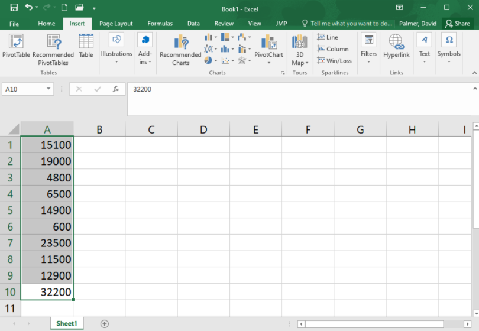
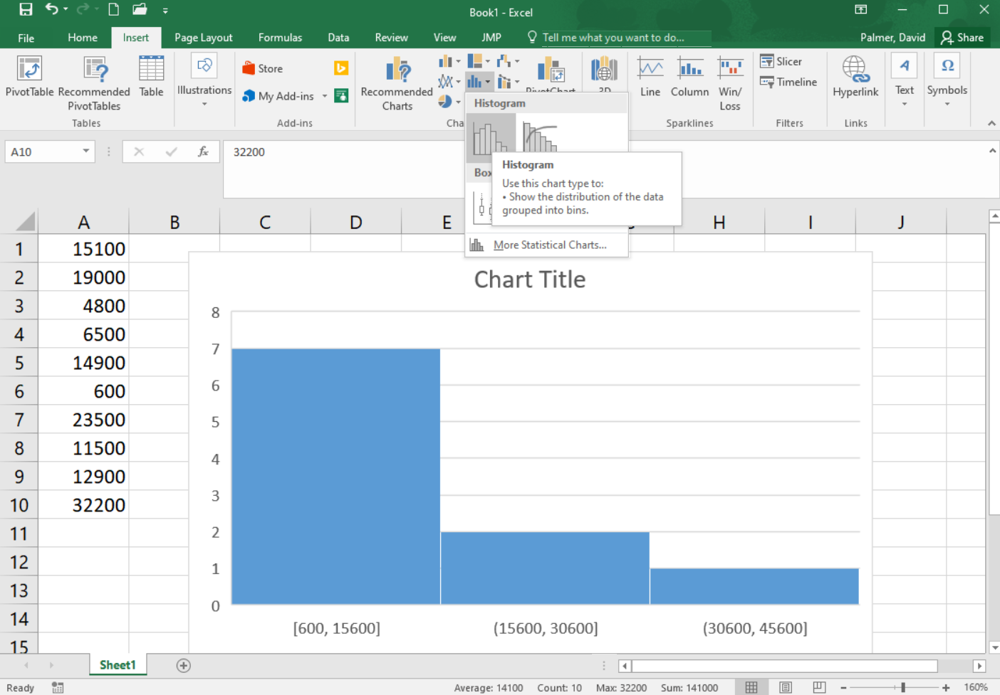
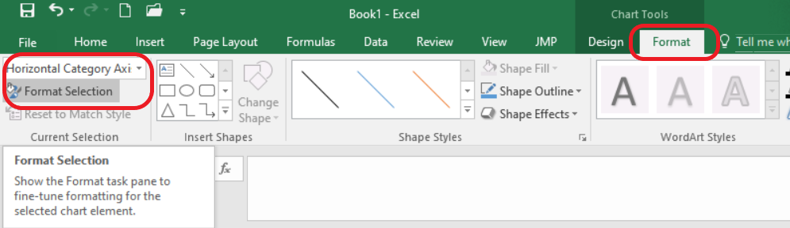
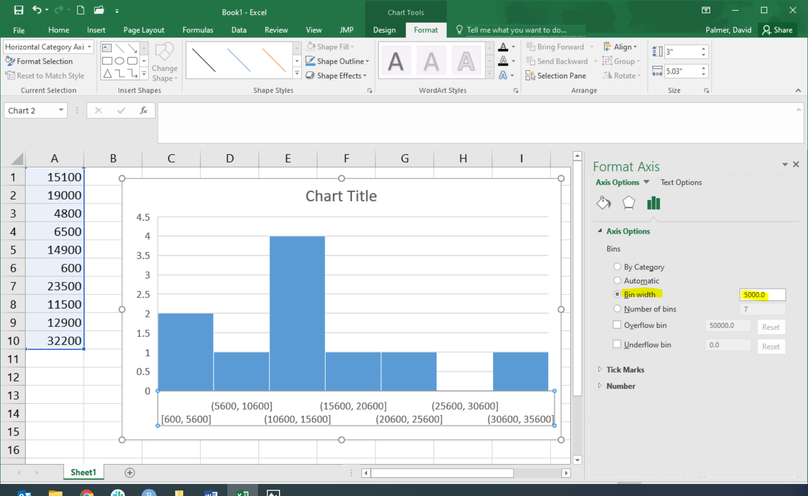

<!--

 

**Optional Lesson Video**

<iframe width="90%" align="right" src="https://www.youtube.com/embed/videoseries?list=PLaZryQtbPQC_w9Z1CWsBjtdmcQdJwuAay" frameborder="1" allow="autoplay; encrypted-media" allowfullscreen></iframe>

 

-->

## Lesson Outcomes

<a href="javascript:showhide('oc')">Show/Hide Outcomes</a>

By the end of this lesson, you should be able to:

* Determine the shape of a distribution using a histogram.
* Interpret the mean, median, and mode for quantitative data.
* Apply the Excel functions AVERAGE, MEDIAN, and MODE when working with quantitative data in Excel.
* Determine the location of the mean relative to the median of left-skewed, right-skewed, or bell-shaped distributions visually using a histogram.
* Interpret a histogram.  
* Distinguish between a parameter and a statistic.

 

## Review of the Five Steps of the Statistical Process

We will use the five steps in the Statistical Process throughout the course. Recall the five steps (and the mnemonic "Daniel Can Discern More Truth) before you begin this lesson.

<table>
<thead>
<tr class="header">
<th>
Step 1:
</th>
<th>
**D**aniel
</th>
<th>
**D**esign the study
</th>
</tr>
</thead>
<tbody>
<tr class="odd">
<td>
Step 2:
</td>
<td>
**C**an
</td>
<td>
**C**ollect data
</td>
</tr>
<tr class="even">
<td>
Step 3:
</td>
<td>
**D**iscern
</td>
<td>
**D**escribe the data
</td>
</tr>
<tr class="odd">
<td>
Step 4:
</td>
<td>
**M**ore
</td>
<td>
**M**ake inferences
</td>
</tr>
<tr class="even">
<td>
Step 5:
</td>
<td>
**T**ruth
</td>
<td>
**T**ake action
</td>
</tr>
</tbody>
</table>

 

## Shape of a Distribution

**Cost to Treat Tuberculosis in India**

 
**Step 1: Design the study.** 

Tuberculosis (TB) is the deadliest bacterial disease in the world. In 2009, nine million new cases of tuberculosis were diagnosed, leading to almost 2 million deaths worldwide. Currently, the principal vaccine used to prevent tuberculosis is Bacille Calmette Guerin (BCG). Unfortunately, BCG is only moderately effective at preventing tuberculosis. Historically, India has had a high number of tuberculosis cases. The Indian Government wants to reduce the prevalence of this disease.

In this activity, you will compare the average costs of treating a person who contracts tuberculosis to the costs of preventing a case of tuberculosis in India.

 
**Step 2: Collect data.** 

Health Care records of tuberculosis patients in India were surveyed to estimate the cost to treat patients with tuberculosis. The following data are representative of the total costs (in US dollars) incurred by society in the treatment of 10 randomly selected tuberculosis patients in India.

15,100 &nbsp; &nbsp; 19,000 &nbsp; &nbsp; 4,800 &nbsp; &nbsp; 6,500 &nbsp; &nbsp; 14,900 &nbsp; &nbsp; 600 &nbsp; &nbsp; 23,500 &nbsp; &nbsp; 11,500 &nbsp; &nbsp; 12,900 &nbsp; &nbsp; 32,200

These costs include health care treatment, time missed from work, and in some cases utility lost due to death.

 
**Step 3: Describe the data.**

### Visualizing Quantitative Data: Histograms {.tabset .tabset-fade}  

The following data are representative of the total costs (in US dollars) incurred by society in the treatment of 10 randomly selected tuberculosis patients in India.

15,100 &nbsp; &nbsp; 19,000 &nbsp; &nbsp; 4,800 &nbsp; &nbsp; 6,500 &nbsp; &nbsp; 14,900 &nbsp; &nbsp; 600 &nbsp; &nbsp; 23,500 &nbsp; &nbsp; 11,500 &nbsp; &nbsp; 12,900 &nbsp; &nbsp; 32,200

To help us visualize these data, we will create a graph called a histogram. To make a histogram, we will divide the number line from 0 to 35,000 in seven equal parts. We will then count the number of data points in each of these intervals:

<table>
<thead>
<tr class="header">
<th>
Interval
</th>
<th>
Number of Observations
</th>
</tr>
</thead>
<tbody>
<tr class="odd">
<td>
At least 0 and less than 5,000
</td>
<td>
2
</td>
</tr>
<tr class="even">
<td>
At least 5,000 and less than 10,000
</td>
<td>
1
</td>
</tr>
<tr class="odd">
<td>
At least 10,000 and less than 15,000
</td>
<td>
3
</td>
</tr>
<tr class="even">
<td>
At least 15,000 and less than 20,000
</td>
<td>
2
</td>
</tr>
<tr class="odd">
<td>
At least 20,000 and less than 25,000
</td>
<td>
1
</td>
</tr>
<tr class="even">
<td>
At least 25,000 and less than 30,000
</td>
<td>
0
</td>
</tr>
<tr class="odd">
<td>
At least 30,000 and less than 35,000
</td>
<td>
1
</td>
</tr>
</tbody>
</table>

For each of these intervals, we draw a bar on the histogram. The width of the bars is determined by the width of the interval (5000 in this example). The height of the bars is equal to the number of observations that fall in each interval. As we look at the histogram shown below, we see bars ranging from \$0 to \$35,000. We also see higher bars in the middle between \$10,000 to \$20,000 show that these values are more commonly occurring than the other values. If we computed the average of the values contained in our histogram, we would compute the number
$$
  \frac{15,100 + 19,000 + 4,800 + 6,500 + 14,900 + 600 + 23,500 + 11,500 + 12,900 + 32,200}{10} = 14,100
$$
showing that the *center* of the histogram (or average) is at \$14,100. 

**This is a histogram created in Excel:**
 

<!--

{| style="width:50%"
|- align="center" 
! This is a histogram created using statistical software:
|- align="center" 
| 
|}

-->

<!-- To access this content, scroll to the bottom of the editing page and click on the link "Software:(Excel or SPSS)-(PageName)" 
{{Software_Filter | PageName=Histogram }}
-->

You can watch this short video of how to [create a histogram in Excel](https://screencast-o-matic.com/watch/cYV1YdvU35){target="_blank"}, or follow these steps:  

 

#### Step 1 
Start by typing the data into a column of cells in Excel: each data point into its own cell, as shown below. Then highlight the data.

  

----

#### Step 2 
Go to the Insert ribbon in Excel and select the histogram icon from the "Charts" section of the ribbon. Then select the first option of histograms presented.

  

You will notice that the histogram does not look much like the histogram above yet. The number and size of bins in a histogram can drastically change the apparent shape of the distribution. It is worth experimenting with a different number of bins so the true shape of the distribution of data is revealed. To change the number of bins go on to the next steps.

----

#### Step 3  
Be sure the graph is selected, so that you can select the "Format" ribbon. In the upper left corner of the ribbon, select "Horizontal Category Axis" in the drop down box. Then click on "Format Selection"

 

----

#### Step 4  
A menu of options will open on the right side of the screen. You can adjust the bin width or number of bins. In this case, though we can't make it match, in order to make the histogram look as much as possible like the one shown above, we will choose a bin width of 5000.

 

Excel shows the starting and ending values for each bin. For example, the first bin goes from 600 up to 5,600. We see there are two data points contained in that bin, represented by the bin's bar height. The next bin contains only one of our data points, it includes any value greater than 5,600 up through, and including, 10,600. And so on.

This histogram does not look exactly like the histogram pictured above, but it is  close. To make it match exactly you can use the "Overflow bin" and "Underflow bin" options; but that is beyond what we will discuss here.

----

 
 

### Making Inference About the Population

After summarizing the data from our sample of the populations both numerically and graphically, we can use this information to make inference about the full population. 
 

 
**Step 4: Make inferences.** 

In the past, the total average cost to society to treat a case of tuberculosis in India was known to be \$13,800. As shown in our Step 3 calculations, the 10 randomly selected patients showed an average cost that was higher than the historic value at \$14,100. This might make us believe that the *actual* total average cost to society is also \$14,100. However, in depth statistical calculations (that you will be taught how to do later this semestr) show that there is a 46% chance that our sample had an average of \$14,100 just by random chance. This isn't too hard to believe since we only had a sample size of 10 people, and \$14,100 is only $300 above \$13,800, so it turns out to be fairly likely (46% chance) that because of random chance our sample had an average that was a little higher than the actual value from the population. So we will conclude that the total average cost to society is still essentially the same as it has been in the past.

 

 
**Step 5: Take action.** 

After making inferences, you take action. The motivation for conducting a study like this is usually to see if there is inflation in the costs.

Answer the following question:

1. Given our conclusion in Step 4 (that the results of our random sample being at an average \$14,100 had a 46% probability of just being caused by random chance) do you think the Government of India needs to take any special action to stop the increase in the cost to treat tuberculosis?

<a href="javascript:showhide('Q2')">Show/Hide Solution</a>

* Answers may vary.  -- However, we could not say that the true mean cost has really changed from $13,800.  So, there is not enough evidence of inflation.  There is no need for the Government of India to take action.

&nbsp;

 

One benefit of using a histogram is that it allows you to visualize the distribution of the data. A histogram illustrates the overall shape of the distribution of the data. The height of the bars show how many observations fall in that range.

Answer the following question:

2. Which bin of the histogram of tuberculosis costs contained the most data points?

<a href="javascript:showhide('Q1')">Show/Hide Solution</a>

* The bin going from \$10,000 to \$15,000 contained 3 observations (\$11,500, \$12,900, and \$14,900), which was the most of any of the bins in the histogram. This can be seen visually in the histogram by looking at the height of each bar and the starting and stopping points of the bar along the x-axis of the graph.

&nbsp;

We will describe the shape of the distribution of a data set using the following basic categories: symmetric, bell-shaped, skewed right, and skewed left. Additionally, we can label the shape of a distribution as uniform, unimodal, bimodal, or multimodal.

A distribution is symmetric if both the left and right side of the distribution appear to be roughly a mirror image of each other. A special symmetric distribution is a bell-shaped distribution. When data follow a bell-shaped distribution, the histogram looks like a bell. Bell-shaped distributions play an important role in Statistics and will play a role in most of the future lessons.

A distribution is right-skewed if a histogram of the distribution shows a long right tail. This can occur if there are some very large outliers on the right-hand side of the distribution. A distribution is left-skewed if a histogram shows that it has a long tail to the left.

If a distribution has only one peak, it is said to be **unimodal**. The three distributions illustrated above are all unimodal distributions. Some people might argue that there are several peaks in the GPA data, so it should not be considered unimodal. Even though there are jagged bumps in the histogram, it is important to visualize the overall shape in the data. When interpreting a histogram, it can be helpful to blur your eyes and imagine the overall shape after smoothing out the bumps. If the overall trend indicates that there is more than one bump, then we do not consider the distribution to be unimodal. We will usually only work with unimodal data sets in this course.

Some distributions have no distinct peak, others have more than one peak. When there is no distinct peak, and the histogram shows a relatively flat shape, we might say the data follow a **uniform** distribution. If there are two distinct peaks, a distribution is called bimodal. If there are more than two peaks, we refer to the distribution as **multimodal**.

 
 

## Center of a Distribution

**Step 3: Describe the data.** 

Sometimes people talk about the "typical" BYU-Idaho student or the average waiting time for a bus. But what does it mean for something or someone to be "average?" How can we quantify what it means to be typical or average? In the example below, we will explore one way to define what "average" means. 

When we talk about the "typical" or "average" value, we are essentially describing the center of a population. If we want to estimate the "average" costs to treat a tuberculosis patient, there are several ways we can do it.

 

### Measuring the Center of a Distribution

#### Mean

The sample mean or sample arithmetic mean is the most common tool to estimate the center of a distribution. It is referred to simply as the mean. It is computed by adding up the observed data and dividing by the number of observations in the data set.

In Statistics, important ideas are given a name. Very important ideas are given a symbol. The sample mean has both a name (mean) and a symbol ($\bar x$, called "x-bar").

$$
  \bar{x} \text{ is used to denote the sample mean}
$$

You may have heard people refer to the sample mean as the average. Technically, the word average refers to any number that is used to estimate the center of a distribution. The mean, median and mode are all examples of "averages." To avoid confusion, it is best to use the words mean, median, and mode instead of the word average, so that it is clear which "average" your are referencing.

Answer the following question:

3. Practice finding the mean, $\bar x$, for the tuberculosis treatment costs of the 10 patients in India by simplifying the following:
$$\bar x=\frac{15100 + 19000 + 4800 + 6500 + 14900 + 600 + 23500 + 11500 + 12900 + 32200}{10}=$$

<a href="javascript:showhide('Q3')">Show/Hide Solution</a>

* The mean cost to treat the 10 TB patients in India is:  $\bar x = \$14,100$. To see how to calculate the mean in Excel, see the "Excel Instructions" below.

&nbsp;

 

#### Median

The median is the middle value in a sorted data set. Half of the observations in the data set are below the median and half are above the median. To find the median, you:

* Sort the values from smallest to largest
  + Do one of the following:
    + If there are an odd number of values, the median is the middle value in the sorted list.
    + If there are an even number of values, the median is the mean of the two middle values in the sorted list.

Answer the following questions:

4. Practice finding the median of the tuberculosis treatment costs for the 10 patients in India. First, sort the data from smallest to largest.

<a href="javascript:showhide('Q4')">Show/Hide Solution</a>

* 600
* 4800
* 6500
* 11500
* 12900
* 14900
* 15100
* 19000
* 23500
* 32200

 

5. Since there are an even number of observations (n=10), the median is computed as the mean of the middle two values. Use your answer to the previous question to find the median of the data. What is the median?

<a href="javascript:showhide('Q5')">Show/Hide Solution</a>

* 600
* 4800
* 6500
* 11500
- **12900**
- **14900**
* 15100
* 19000
* 23500
* 32200

The middle two numbers are 12900 and 14900.  The mean of these two numbers is:

$\text{Median } = \frac{12900 + 14900}{2} = 13900$

The median cost to treat the ten TB patients in India is $13,900.

&nbsp;

 

#### Mode
The most frequently occurring value is called the mode. Sometimes there is more than one mode. For example, in the data set

$${1,~~2, ~~2, ~~2, ~~3, ~~4, ~~4, ~~5, ~~5, ~~5, ~~6}$$ 

the modes are 2 and 5. Both of these values occur three times, which is more times than any other value.

If no number occurs more than once in the data set, we say that there is no mode. For the data set representing the costs to treat tuberculosis in India, none of the values is repeated. So, there is no mode for these data.

Answer the following question:

6. For a particular data set, which of the following can occur?

a. There may be no mode.

b. There may be exactly one mode.

c. There may be several modes.

d. Only A and B can occur.

e. A, B, and C can all occur.

<a href="javascript:showhide('Q6')">Show/Hide Solution</a>

e. A, B, and C can all occur.

&nbsp;

 

#### Excel Instructions for Mean, Median, and Mode

Excel Instructions

**To calculate most numerical summaries** (such as the mean, median, and mode) in Excel, follow these general steps:

1. Open Excel.

2. Enter the data into Excel. There should only be one data value per cell.    
3. Next, in the cell where you would like to store the numerical summary type an "=", followed by the name of the function and then an open parenthesis, "(".  

4. Then, highlight the data (by clicking on it) to which you want to apply the function. The cell reference range will automatically be added to your formula. Then type a closed parenthesis, ")" and hit enter.

**Caculate a Mean**

For example, to calculate the mean of the sample of tuberculosis patient costs in India:
  
* put the data in Excel,
* in a blank cell type "**=AVERAGE(**", 
* highlight the data, 
* close the parenthesis with "**)**" before hitting enter:  

Notice that Excel calles the "mean" the "average."

 

**Calculate a Median**

Simply replace the word "AVERAGE" in the formula with the word "MEDIAN". Try it with the tuberculosis patient data, you should get the same value that was calculated by hand above.

 

**Calculate a Mode**

Similarly, to calculate a mode, replace the word "AVERAGE" in the formula with the word "MODE" or "MODE.SNGL". NOTE: If you try this on the tuberculosis patient data, you will get a result of "#N/A". This is Excel's way of saying that a mode does not exist because there are no repeated values in the dataset.

 

 
<!-- To access this content, scroll to the bottom of the editing page and click on the link "Software:(Excel or SPSS)-(PageName)" -->
<!-- {{Software_Filter|PageName=Mean_Median_Mode}} -->

### Parameters and Statistics

We only have data on the cost to treat ten randomly selected tuberculosis patients. This represents a random sample from the population. The sample obtained by the researchers depends on random chance. If the study was repeated and a new sample of ten patients was randomly drawn from all cases of tuberculosis in India, would we observe the same data values? Certainly not!

However, if we took a second random sample from the population, we would expect the mean of the new sample to be somewhat similar to the mean for our original sample. And if we took a third sample of data, we should expect the mean of this sample to be different than the means of the other two samples. In fact, every sample will give us a different sample mean, but all of these sample means will be fairly similar in value.

One of the primary purposes of collecting and analyzing data is to estimate the true mean of a population. Since collecting data on the entire population is usually not feasible, we usually never know what the true mean is. So we estimate the true population mean with the sample mean from a single sample of data from the population.

The sample mean is an example of a statistic. A statistic is a number that describes a sample. The true (usually unknown) population mean is an example of a parameter. A parameter is any number that describes a population. 

An easy way to distinguish between a parameter and a statistic is to note the repetition in the first letters:

- **P**opulation **P**arameter True (usually unknown) value describing a population
- **S**ample **S**tatistic Estimate of the population parameter obtained from a sample

In the example above, the sample mean $\bar x$ = \$14,100 is a statistic. Over the last few years, the total mean cost to treat tuberculosis in India has been \$13,800. This \$13,800 is considered a parameter because it is the "known" value for the full population.

Different symbols are used to distinguish between the sample mean (a statistic) and the population mean (a parameter). The symbol for the sample mean is $\bar x$. The symbol for the population mean is $\mu$.

**Perspective**

The mean cost to treat the ten tuberculosis patients in the sample was $\bar x$ = \$14,100. This number gives us some useful information. However, if this was all we were given, we would not be able to distinguish the data above from a situation where the cost for each of the ten patients was exactly \$14,100. Notice that if the cost for each patient was \$14,100, the mean would be:

$$\bar x=\frac{14100 + 14100 + 14100 + 14100 + 14100 + 14100 + 14100 + 14100 + 14100 + 14100}{10} =14,100$$

Even though measures of center are important, we need to consider the shape, center and spread of a distribution of data.  When evaluating data, it is sometimes tempting to compute a mean but to avoid creating a histogram.  This can lead to errant decisions based on a misunderstanding or incorrect transcription of data.  If there is a transcription error in the data, it is sometimes easiest to detect it as an outlier in a histogram.

 
 

## Summary

Remember...

- A **histogram** allows us to visually interpret data. Histograms can be left-skewed, right-skewed, or symmetrical and bell-shaped.

- The **mean**, **median**, and **mode** are measures of the center of a distribution. The mean is the most common measure of center and is computed by adding up the observed data and dividing by the number of observations in the data set.

- A **parameter** is a true (but usually unknown) number that describes a population. A **statistic** is an estimate of a parameter obtained from a sample of the population. 

 

## Navigation

| **Previous Reading** | **This Reading** | **Next Reading** |
| :------------------: | :--------------: | :--------------: |
| [Lesson 2: The Statistical Process & Design of Studies](Lesson02.html) | Lesson 3: Describing Quantitative Data (Shape & Center) | [Lesson 4: Describing Quantitative Data (Spread)](Lesson04.html) |

