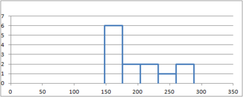
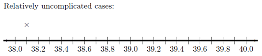

<iframe width="340" align="center" src="http://www.youtube.com/embed/videoseries?list=PLaZryQtbPQC9m8e_GQgx8fVfP55cI0L9z" frameborder="0" allow="autoplay; encrypted-media" allowfullscreen></iframe>

{{YouTubeLesson|url=http://www.youtube.com/embed/videoseries?list=PLaZryQtbPQC_w9Z1CWsBjtdmcQdJwuAay}}
## Lesson Outcomes

By the end of this lesson, you should be able to:
:* Determine the shape of a distribution using a histogram and/or box plot.
:* Determine the centers of a given histogram and/or box plot. 
:* Identify the mean, median and standard deviation in skewed or normal histograms.
:* Calculate the mean, median and standard deviation from quantitative data.
:* Distinguish between a parameter and a statistic.
:* Calculate a percentile from a quantitative data set.
:* Calculate a five-number summary from quantitative data with Excel, or by hand.
:* Create a histogram and a box-plot from quantitative data. 

 

## Review of the Five Steps of the Statistical Process

We will use the five steps in the Statistical Process throughout the course. Recall the five steps (and the mnemonic "Daniel Can Discern More Truth) before you begin this lesson.

{| class="basic"
|-
! Step 1: 
| **D**aniel
| **D**esign the study
|-
! Step 2:
| **C**an
| **C**ollect data
|-
! Step 3:
| **D**iscern
| **D**escribe the data
|-
! Step 4:
| **M**ore
| **M**ake inferences
|-
! Step 5:
| **T**ruth
| **T**ake action
|}

## Shape of a Distribution

**Cost to Treat Tuberculosis in India**

**Step 1: Design the study.** 

Tuberculosis (TB) is the most deadly bacterial disease in the world. In 2009, nine million new cases of tuberculosis were diagnosed, leading to almost 2 million deaths worldwide. Currently, the principal vaccine used to prevent tuberculosis is Bacille Calmette Guerin (BCG). Unfortunately, BCG is only moderately effective at preventing tuberculosis. Historically, India has had a high number of tuberculosis cases. The Indian Government wants to reduce the prevalence of this disease.

In this activity, you will compare the “average” costs of treating a person who contracts tuberculosis to the costs of preventing a case of tuberculosis in India.

**Step 2: Collect data.** 

Health Care records of tuberculosis patients in India were surveyed to estimate the cost to treat patients with tuberculosis. The following data are representative of the total costs (in US dollars) incurred by society in the treatment of 10 randomly selected tuberculosis patients in India.

15,100 &nbsp; &nbsp; 19,000 &nbsp; &nbsp; 4,800 &nbsp; &nbsp; 6,500 &nbsp; &nbsp; 14,900 &nbsp; &nbsp; 600 &nbsp; &nbsp; 23,500 &nbsp; &nbsp; 11,500 &nbsp; &nbsp; 12,900 &nbsp; &nbsp; 32,200

These costs include health care treatment, time missed from work, and in some cases utility lost due to death.

**Step 3: Describe the data.**

### Visualizing Quantitative Data: Histograms

The following data are representative of the total costs (in US dollars) incurred by society in the treatment of 10 randomly selected tuberculosis patients in India.

15,100 &nbsp; &nbsp; 19,000 &nbsp; &nbsp; 4,800 &nbsp; &nbsp; 6,500 &nbsp; &nbsp; 14,900 &nbsp; &nbsp; 600 &nbsp; &nbsp; 23,500 &nbsp; &nbsp; 11,500 &nbsp; &nbsp; 12,900 &nbsp; &nbsp; 32,200

To help us visualize these data, we will create a graph called a histogram. To make a histogram, we will divide the number line from 0 to 35,000 in seven equal parts. We will then count the number of data points in each of these intervals:

{| class="basic"
|-
! Interval
! Number of Observations
|-
| At least 0 and less than 5,000
| 2
|-
| At least 5,000 and less than 10,000
| 1
|-
| At least 10,000 and less than 15,000
| 3
|-
| At least 15,000 and less than 20,000
| 2
|-
| At least 20,000 and less than 25,000
| 1
|-
| At least 25,000 and less than 30,000
| 0
|-
| At least 30,000 and less than 35,000
| 1
|}

For each of these intervals, we draw a bar on the histogram. The width of the bars is determined by the width of the interval (5000 in this example). The height of the bars is equal to the number of observations that fall in each interval.

{| style="width:50%"
|- align="center" 
! This is a histogram created in Excel: 
|- align="center" 
| 
|} 

<!--

{| style="width:50%"
|- align="center" 
! This is a histogram created using statistical software:
|- align="center" 
| 
|}

-->

<!-- To access this content, scroll to the bottom of the editing page and click on the link "Software:(Excel or SPSS)-(PageName)" 
{{Software_Filter | PageName=Histogram }}
-->
{{Software|Type=Excel|PageName=Histogram}}

 
After summarizing the data numerically and graphically, we are ready to make inferences about the population.

**Step 4: Make inferences.** 

The historical total mean cost to society to treat a case of tuberculosis in India is known to be <nomathjax>$</nomathjax>13,800. To assess if the cost has increased, the null and alternative hypotheses are:

:$H_0$: The mean cost is equal to <nomathjax>$</nomathjax>13,800.

:$H_a$: The mean cost is greater than <nomathjax>$</nomathjax>13,800.

Using the symbol for the population mean, we can rewrite the null and alternative hypotheses more simply as:

:$H_0$: $\mu = \$13,800$
:$H_a$: $\mu > \$13,800$

Recall, that the $P$-value is the probability that the data would be as extreme or more extreme than we observed, assuming the null hypothesis is true. A small $P$-value indicates that there is a lot of evidence against the null hypothesis. If the $P$-value is low, say, less than 0.05, we reject the null hypothesis.

It can be shown that the $P$-value is 0.460. (Later in the course, you will have the tools to do this computation.)

Answer the following question:

:1. Based on the $P$-value, would you reject or fail to reject the null hypothesis? Explain how you made this determination.

::Fail to reject the null hypothesis.  Since the $P$-value is large, there is not a lot of evidence against the null hypothesis.  When the $P$-value is large, we fail to reject the null hypothesis.  There is not enough evidence to suggest that the mean cost is now greater than <nomathjax>$</nomathjax>13,800.

&nbsp;

**Step 5: Take action.** 

After making inferences, you take action. The motivation for conducting a study like this is usually to see if there is inflation in the costs.

Answer the following question:

:2. Given that you failed to reject the null hypothesis, do you think the Government of India needs to take any special action to stop the increase in the cost to treat tuberculosis?

::Answers may vary.  -- We fail to reject the null hypothesis.  That means that we could not say that the true mean cost is not equal to <nomathjax>$</nomathjax>13,800.  So, there is not enough evidence of inflation.  There is no need to for the Government of India to take action.

&nbsp;

One benefit of using a histogram is that it allows you to visualize the distribution of the data. A histogram illustrates the overall shape of the distribution of the data. The height of the bars show how many observations fall in that range.

We will describe the shape of the distribution of a data set using the following basic categories: symmetric, bell-shaped, skewed right, and skewed left. Additionally, we can label the shape of a distribution as uniform, unimodal, bimodal, or multimodal.

A distribution is symmetric if both the left and right side of the distribution appear to be roughly a mirror image of each other. A special symmetric distribution is a bell-shaped distribution. When data follow a Bell-shaped distribution, the histogram looks like a bell. Bell-shaped distributions play an important role in Statistics and will play a role in most of the future lessons.

A distribution is right-skewed if a histogram of the distribution shows a long right tail. This can occur if there are some very large outliers. A distribution is left-skewed if a histogram shows that it has a long tail to the left.

If a distribution has only one peak, it is said to be **unimodal**. The three distributions illustrated above are all unimodal distributions. Some people might argue that there are several peaks in the GPA data, so it should not be considered unimodal. Even though there are jagged bumps in the histogram, it is important to visualize the overall shape in the data. When interpreting a histogram, it can be helpful to blur your eyes and imagine the overall shape—after smoothing out the bumps. If the overall trend indicates that there is more than one bump, then we do not consider the distribution to be unimodal.

Some distributions have no distinct peak, others have more than one peak. When there is no distinct peak, and the histogram shows a relatively flat shape, we might say the data follow a **uniform** distribution. If there are two distinct peaks, a distribution is called bimodal. If there are more than two peaks, we refer to the distribution as **multimodal**.

## Center of a Distribution

**Step 3: Describe the data.** 

Sometimes people talk about the "typical" BYU-Idaho student or the “average” waiting time for a bus. But what does it mean for something or someone to be "average?" How can we quantify what it means to be “typical” or “average?” In the example below, we will explore one way to define what "average" means. 

When we talk about the "typical" or "average" value, we are essentially describing the center of a population. If we want to estimate the "average" costs to treat a tuberculosis patient, there are several ways we can do it.

### Measuring the Center of a Distribution

#### Mean

The sample mean or sample arithmetic mean is the most common tool to estimate the center of a distribution. It is referred to simply as the mean. It is computed by adding up the observed data and dividing by the number of observations in the data set.

In Statistics, important ideas are given a name. Very important ideas are given a symbol. The sample mean has both a name (mean) and a symbol ($\bar x$).

You may have heard people refer to the sample mean as the “average.” The word “average” refers to any number that is used to estimate the center of a distribution. The mean, median and mode are all examples of averages. To avoid confusion in this course, the word “average” will not be used to describe the mean.

Answer the following question:

:3. Practice finding the mean, $\bar x$, for the tuberculosis treatment costs of the 10 patients in India by simplifying the following:
$$\bar x=\frac{15100 + 19000 + 4800 + 6500 + 14900 + 600 + 23500 + 11500 + 12900 + 32200}{10}=$$

::The mean cost to treat the 10 TB patients in India is:  $\bar x = \$14,100$

&nbsp;

#### Median

The median is the “middle” value in a sorted data set. Half of the observations in the data set are below the median and half are above the median. To find the median, you:

* Sort the values from smallest to largest
  + Do one of the following:
    + If there are an odd number of values, the median is the middle value in the sorted list.
    + If there are an even number of values, the median is the mean of the two middle values in the sorted list.

Answer the following questions:

:4. Practice finding the median of the tuberculosis treatment costs for the 10 patients in India. First, sort the data from smallest to largest.

::600
::4800
::6500
::11500
::12900
::14900
::15100
::19000
::23500
::32200

:5. Since there are an even number of observations (n=10), the median is computed as the mean of the middle two values. Use your answer to the previous question to find the median of the data. What is the median?

::600
::4800
::6500
::11500
::**12900**
::**14900**
::15100
::19000
::23500
::32200

:The middle two numbers are 12900 and 14900.  The mean of these two numbers is:

$\text{Median } = \frac{12900 + 14900}{2} = 13900$

:The median cost to treat the ten TB patients in India is <nomathjax>$</nomathjax>13,900.

&nbsp;

#### Mode
The most frequently occurring value is called the mode. Sometimes there is more than one mode. For example, in the data set

$${1,~~2, ~~2, ~~2, ~~3, ~~4, ~~4, ~~5, ~~5, ~~5, ~~6}$$ 

the modes are 2 and 5. Both of these values occurs three times, which is more times than any other value.

If no number occurs more than once in the data set, we say that there is no mode. For the data set representing the costs to treat tuberculosis in India, none of the values is repeated. So, there is no mode for these data.

Answer the following question:

:6. For a particular data set, which of the following can occur?

::a. There may be no mode.

::b. There may be exactly one mode.

::c. There may be several modes.

::d. Only A and B can occur.

::e. A, B, and C can all occur.

<!-- To access this content, scroll to the bottom of the editing page and click on the link "Software:(Excel or SPSS)-(PageName)" -->
<!-- {{Software_Filter|PageName=Mean_Median_Mode}} -->
{{Software|Type=Excel|PageName=Mean_Median_Mode}}

### Parameters and Statistics

We only have data on the cost to treat ten randomly selected tuberculosis patients. This represents a random sample from the population. The sample obtained by the researchers depends on random chance. If the study was repeated and a new sample of ten patients was randomly drawn from all cases of tuberculosis in India, would we observe the same data values? Certainly not!

However, if we draw a random sample, we would expect the mean of the new sample to be somewhat close to the mean for our original sample. The sample mean, $\bar x$, is an estimate of the true mean of the population.

One of the primary purposes of collecting and analyzing data is to estimate the true mean of a population.Usually, we do not know what the true mean is, and we estimate it with the sample mean.

The sample mean is an example of a statistic. A statistic is a number that describes a sample. The true (usually unknown) population mean is an example of a parameter. A parameter is any number that describes a population.

An easy way to distinguish between a parameter and a statistic is to note the repetition in the first letters:

:***P**opulation **P**arameter – True (usually unknown) value describing a population
:***S**ample **S**tatistic – Estimate of the population parameter obtained from a sample

In the example above, the sample mean $\bar x$ = <nomathjax>$</nomathjax>14,100 is a statistic. Over the last few years, the total mean cost to treat tuberculosis in India has been <nomathjax>$</nomathjax>13,800. This is considered a parameter.

Different symbols are used to distinguish between the sample mean (a statistic) and the population mean (a parameter). The symbol for the sample mean is $\bar x$. The symbol for the population mean is $\mu$.

**Perspective**

The mean cost to treat the ten tuberculosis patients in the sample was $\bar x$ = <nomathjax>$</nomathjax>14,100. This number gives us some useful information. However, if this was all we were given, we would not be able to distinguish the data above from a situation where the cost for each of the ten patents was exactly <nomathjax>$</nomathjax>14,100. Notice that if the cost for each patient was <nomathjax>$</nomathjax>14,100, the mean would be:

$$\bar x=\frac{14100 + 14100 + 14100 + 14100 + 14100 + 14100 + 14100 + 14100 + 14100 + 14100}{10} =14,100$$

Even though measures of center are important, we need to consider the shape, center and spread of a distribution of data.  When evaluating data, it is sometimes tempting to compute a mean but to avoid creating a histogram.  This can lead to errant decisions based on a misunderstanding or incorrect transcription of data.  If there is a transcription error in the data, it is sometimes easiest to detect it as an outlier in a histogram.

## Spread of a Distribution

You have studied two important characteristics of a distribution: the **shape** and the **center**.  In this section, you will discover ways to summarize the **spread** of a distribution of data. The spread of a distribution of data describes how far the observations tend to be from each other.  There are many ways to describe the spread of a distribution.

### Standard Deviation and Variance

This activity introduces two measures of spread: the standard deviation and the variance.

**Diving Elephant Seals**

Researchers Jessica Meir and Paul Ponganis studied the characteristics of the northern elephant seal, *Mirounga angustirostris* (Meir, 2010).  These seals have the ability to dive deep into the ocean.  Researchers placed a thermistor (thermometer) and a backpack recorder on 13 different seals.  

Data were collected over several days for each seal.  The results are given in the file [[Data|DivingElephantSeals]].

Piedras Blancas, San Simeon, California  
Photo by Michael "Mike" L. Baird bairdphotos.com ]]

<!-- http://www.fotopedia.com/items/flickr-2237782585 -->

The following table summarizes some of the measurements collected on the seals:

{| class="basic"
! Seal's Name	
! Number   of Dives	
! Mass   (kg)	
! Length of   Deployment   (Days at Sea)	
! Thermistor   Location	
! Representative   Temperature   ($^\circ \text{C}$)
|-
| Chick	
| 267	
| 238	
| 3.5	
| Extradural	
| 36.70
|-
| Starburst	
| 33	
| 162	
| 3	
| Extradural	
| 37.19
|-
| Patty	
| 81	
| 191	
| 1	
| Extradural	
| 37.85
|-
| Bodil	
| 192	
| 160	
| 21	
| Hepatic Sinus	
| 37.91
|-
| Roberta	
| 480	
| 148	
| 15	
| Hepatic Sinus	
| 37.25
|-
| Larry	
| 218	
| 158	
| 9	
| Hepatic Sinus	
| 38.98
|-
| Per	
| 160	
| 163	
| 1.2	
| Hepatic Sinus	
| 38.16
|-
| Sir Richard	
| 312	
| 226	
| 2	
| Arterial (femoral)	
| 39.32
|-
| Jerry	
| 132	
| 180	
| 1.4	
| Arterial (brachial)	
| 39.70
|-
| Sammy	
| 70	
| 211	
| 1	
| Arterial (brachial)	
| 39.71
|-
| Knut	
| 242	
| 288	
| 2	
| Arterial (brachial)	
| 35.77
|-
| Jonesie	
| 401	
| 261	
| 3.5	
| Arterial (brachial)	
| 38.47
|-
| Butler	
| 621	
| 151	
| 8	
| Arterial (brachial)	
| 39.74
|}

**Mass**

The data file [[Data|DivingElephantSeals]] contains the mass in kilograms (kg) of the seals. How do we describe the distribution of the masses of the seals?  

Use the data in the column labeled "Mass (kg)" to create a histogram and calculate the descriptive statistics.  

**Your histogram should look like this (a title and axis label have been added here)**:

Mass (kg) of the Diving Elephant Seals in Excel:

**The descriptive statistics are summarized as follows**:

<!--

**Your histogram should look like this (a title and axis label have been added here)**:

Mass (kg) of the Diving Elephant Seals:

**The descriptive statistics are summarized as follows**:

-->

Some of these statistics, such as the mean and median, should be familiar to you by now. In this section, you will learn about the standard deviation and the variance.  Later in this reading assignment we will discuss the minimum, $Q_1$, median, $Q_3$, and the maximum.

The mean mass of the 13 seals is $ \bar x = 195.2$ kg.  (Note that this value was rounded with one more decimal place of accuracy compared to the raw data.) The mean is a measure of the *center* of the distribution.  

There is a fairly large difference in the masses of the different seals.  The smallest seal has a mass of 148 kg.  The largest has a mass of 288 kg.  

The **standard deviation** is a measure of the *spread* in the distribution.  If the standard deviation is relatively small, then the data tend to be close together.  If the standard deviation is relatively large, the data tend to be more spread out. 

The standard deviation of the seals' body mass is 45.8 kg.  This number contains information from all the seals.  If the seals' masses had been more diverse, the standard deviation would be larger.  If the seals were more uniform in their masses, then the standard deviation would have been smaller.  If all the seals somehow had the same mass, then the standard deviation would be zero.

We are working with a sample.  To be explicit, we call 45.8 kg the *sample standard deviation*.  The symbol for the sample standard standard deviation is $s$.  This is a statistic.  The parameter representing the population standard deviation is $ \sigma $ (pronounced /SIG-ma/).  In practice, we rarely know the value of the population standard deviation, so we use the sample standard deviation $ s $ as an approximation for the unknown population standard deviation $ \sigma $.

At this point, you probably do not have much intuition regarding the standard deviation. We will use this statistic frequently. By the end of the semester, you can expect to become very comfortable with this idea. For now, all you need to know is that if two variables are measured on the same scale, the variable with values that are further apart will have the larger standard deviation.

**Man Vs. Seal**

<!-- http://lib.stat.cmu.edu/datasets/bodyfat -->
Roger Johnson compiled a collection of measurements on 252 men. The mean mass of the men was $ \bar x = 81.2 $ kg.  The standard deviation of the weights was $ s = 13.3 $ kg.  

The mean and standard deviation of the masses are in both cases smaller for the men than the the seals. This says that seals are generally larger than men and vary more in their weights. We compare these two distributions in the following histogram:

Weights of Men Compared to Weights of Seals 

The mean mass of the men is less than the mean mass of the seals.  We can see this, because the bulk of the data in the histogram for the men's masses is to the left of the seals'. You will also note that the masses of the seals are more spread out than the masses of the men.

{| class="basic"
! 
! Men
! Seals
|-
| Mean (kg)
| 81.2
| 195.2
|-
| Standard Deviation (kg)
| 13.3
| 45.8
|-
| Sample Size
| 252
| 13
|}

**Length of Deployment (Days at Sea)**

The variable "Length of Deployment (Days at Sea)" indicates the the number of days researchers collected data from each subject. The next two questions ask you to use the file [[Data|DivingElephantSeals]] to create a histogram and compute the summary statistics for the "Length of Deployment (Days at Sea)."

Answer the following questions:

:7. Using {{Course_Filter|course=A B C|content=Excel}}<!--{{Course_Filter|course=B C|content=SPSS}}-->, create a histogram for the "Length of Deployment (Days at Sea)" data.

**Length of Time Data were Collected on each Seal**

**Length of Time Data were Collected on each Seal**

 

:8. Find the missing value in the following table:

{| class="basic"
|- 
! colspan="2" | Summary Statistics:
|- 
| Mean: 
| $ \bar x = 5.51 $
|-
| Standard Deviation:
| $ s = ? $ 
|-
| Sample Size: 
| $ n = 13 $
|}

::The sample standard deviation of the length of deployment is $s = 6.22 $ days.
::Note that this number was rounded to one more decimal place than is given in the original data.

&nbsp;

Photo by Michael "Mike" L. Baird bairdphotos.com ]]

**Representative Temperature**

Consider the last column in the table of data.  The "representative temperature" is the mean body temperature of the seal right before a new dive begins.  The researchers were very interested in this information.  One of the key things they studied was the change in the body temperature of the seals as they dove. They wanted to know if a decrease in their body temperature allows seals to dive for longer periods of time. It was important for them to establish a baseline temperature for each seal.

Answer the following questions:

:9. Create a <nowiki>*</nowiki>histogram to illustrate the "Representative Temperature" data. 

{| class="basic"
|- 
! Representative Body Temperature of Northern Elephant Seals before Diving
|- align="center"
|  Representative Temperature ($^\circ \text{C}$)
|}

:10. Using {{Course_Filter|course=A B C|content=Excel}}<!--{{Course_Filter|course=B C|content=SPSS}}-->, find the mean, standard deviation and sample size for the "Representative Temperature" data. 

{| class="basic"
|- 
! Summary Statistics:
|- 
| Mean: $ \bar x = 38.212\, ^\circ \text{C} $   Standard Deviation: $ s = 1.262\, ^\circ \text{C} $   Sample Size: $ n = 13 $
|}

::<nowiki>*</nowiki>Click the link at right for a review of how to create a histogram.

<!-- To access this content, scroll to the bottom of the editing page and click on the link "Software:(Excel or SPSS)-(PageName)" -->
{{Software_Filter|PageName=Histogram-Condensed}}

&nbsp;

The standard deviation of the representative temperatures is $ s = 1.262\, ^\circ \text{C} $.  When we consider body temperature measurements, this is a fairly small amount.  Note that in this case, the standard deviation ($ s = 1.262\, ^\circ \text{C} $) is much smaller than the mean ($ \bar x = 38.212\, ^\circ \text{C} $).

{{Tip|**Rounding:** As a general rule, when rounding your results, round to three decimal places unless otherwise specified.}}

#### Calculating the Standard Deviation by Hand

How is the standard deviation computed?  Where does this "magic" number come from?  How does one number include the information about the spread of all the points?

**Bird Flu Fever**

Avian Influenza A H5N1, commonly called the bird flu, is a deadly illness that is currently only passed to humans from infected birds. This illness is particularly dangerous because at some point it is likely to mutate to allow human-to-human transmission. Health officials worldwide are preparing for the possibility of a bird flu pandemic.

Dr. K. Y. Yuen led a team of researchers who reported the body temperatures of people admitted to Chinese hospitals with confirmed cases of Avian Influenza. 
Their research team collected data on the body temperature at the time that people with the bird flu were admitted to the hospital. In the article, they reported on two groups of people, those with relatively uncomplicated cases of the bird flu and those with severe cases.

The table below presents the data representative of the body temperatures for the two groups of bird flu patients:

{| class="basic"
! Relatively   Uncomplicated   Cases !! Severe&nbsp;Cases	
|- valign="top" align="center" 
|38.1 38.3 38.4 39.5 39.7
|39.1 39.5 38.9 39.2 39.9 39.7 39.0
|}

We will use these data to investigate some measures of the spread in a data set.  

Answer the following questions:

:11. Draw the number line below and illustrate the relatively uncomplicated cases by marking an “x” for each point. The first point has been plotted for you. 
:::

::Here is the completed plot:
:::

:12. What is the mean of the body temperatures for the relatively uncomplicated cases?  <!--Draw a vertical line on your number line to represent this point. -->

::The mean body temperature for the relatively uncomplicated cases is 38.8 degrees Centigrade.

:13. How spread out are the "relatively uncomplicated" cases of the bird flu?  Are the points relatively close together or spread apart?

::Answers will vary. The difference between the largest and the smallest degree is 1.6 degrees.  Most students will likely identify these observations as being relatively close together.  There is not a huge spread in the temperatures.

&nbsp;

Think about the points you marked in question 5 above.  On your sketch of the number line, draw a vertical line at 38.8 degrees, the sample mean.  Now, draw horizontal lines from the mean to each of your $\times$'s.  These horizontal line segments represent the spread of the data about the mean.  Your plot should look something like this:

The length of each of the line segments represents how far each observation is from the mean.  If the data are close together, these lines will be fairly short.  If the distribution has a large spread, the line segments will be longer. The standard deviation is a measure of how long these lines are, as a whole. It is a little tedious to compute the standard deviation by hand.  However, the process is very instructive.  As you work through the following steps, please remember the goal is to find a measure of the spread in a data set.  We want one number that describes how spread out the data are.  

The deviation of an observation from the mean is the directed distance from the observation to the mean. In other words, deviations are the lengths of the line segments you drew in the previous set of questions.

$$
\begin{array}{1cl}
\text{Deviation} & = & \text{Value} - \text{Mean} \\
\text{Deviation} & = & x - \bar x
\end{array}
$$

If the observed value is greater than the mean, the deviation is positive.  If the value is less than the mean, the deviation is negative. 

The standard deviation is a complicated sort of average of the deviations. Making a table like the one below will help you keep track of your calculations. Please participate fully in this exercise. Writing your answers at each step and to developing a table as instructed will greatly enhance the learning experience. By following these steps, you will be able to compute the standard deviation by hand.

**Step 01**: The first step in computing the standard deviation by hand is to create a table, like the following. Enter the observed data in the first column.

{| class="basic"
! Column 1
! Column 2
|-
! Observation   ($ x $)
! Deviation   from the Mean   ($ x-\bar x $)
|- align="center"
| $38.1$
| $38.1-38.8=-0.7$
|- align="center"
| $38.3$
| 
|- align="center"
| $38.4$
| 
|- align="center"
| $39.5$
| 
|- align="center"
| $39.7$
| 
|- align="center"
! $ \bar x = 38.8 $
! 
|}

**Step 02**: The second column of the table contains the deviations from the mean. Complete column 2 of the table above. 

:{| class="basic"
! Column 1
! Column 2
|-
! Observation   ($ x $)
! Deviation   from the Mean   ($ x-\bar x $)
|- align="center"
| $38.1$
| $38.1-38.8=-0.7$
|- align="center"
| $38.3$
| $38.3-38.8=-0.5$
|- align="center"
| $38.4$
| $ 38.4-38.8=-0.4 $
|- align="center"
| $39.5$
| $ 39.5-38.8=0.7 $
|- align="center"
| $39.7$
| $ 39.7-38.8=0.9 $
|- 
! $ \bar x = 38.8 $
! 
|}

Answer the following questions:

:14. How could we use this table to find the "typical" distance from each point to the mean? Think carefully about this, and then write down your answer before continuing.

::You may have suggested that we compute the mean of these values. This seems like a good idea.  If we compute the mean, it will tell us the average deviation from the mean.    Compute the mean of Column 2. What do you get?

:::You should have found that the mean of the deviations is zero.  This is true for *every* data set. If you add up the deviations from the mean, the positive values will cancel with the negative values. The sum of the deviations from the mean will be zero, so the mean also must equal zero.
:::The good news is that you can use this fact to check if you are on the right track.  If the deviations from the mean do not add up to zero, then you have made a mistake in the calculations. The bad news is that the deviations always add up to 0, making it look like the distance from the data to the mean is 0. Nonsense!
:::The mean of the deviations from the mean cannot be used to find a measure of the spread in a data set, but it does provide a guidepost that shows we are on the right track.  We must find another way to estimate the spread of a data set.

:15. We need a way to work with the negative deviations from the mean, so they do not cancel with the positive ones.  What could we do?  (Choose one of the four options below.)

::Option #1:

::This is an excellent suggestion.  This is probably one of the first things statisticians used to estimate the spread in the data.  

::If we take the absolute value of the deviations, then all the values are positive.  By taking the mean of these numbers, we do get a measure of spread.  This quantity is called the mean absolute deviation (MAD).

::There is good news and bad news.  The good news is, you discovered a way to estimate the spread in a data set. (In fact, the MAD is used as one estimate of the volatility of stocks.) The bad news is that the MAD does not have good theoretical properties. A proof of this claim requires calculus, and so will not be discussed here.  For most applications, there is a better choice.  Please select another option.

::Option #2:

::If we square the deviations from the mean, the values that were negative will become positive.  This leads to an estimator of the spread that has excellent theoretical properties.  This is the best of the four options.  You will apply this idea in Step 03.

::Option #3:

::Sorry, you can't make your troubles go away by deleting things you don't like.  Please try again.

::Option #4:

::You probably have an ingenious idea.  Surprisingly enough, there *is* a right answer to the question.  Please choose a different option.

:::Please do not go on to Step 03 until you have finished this exploration.

"Piled Higher and Deeper" by Jorge Cham 
 

**Step 03**:  Add a third column to your table. To get the values in this column, square the deviations from the mean that you found in Column 2.

:{| class="basic"
! Column 1
! Column 2
! Column 3
|-
! Observation   $ x $
! Deviation   from the Mean   $ x-\bar x $
! Squared Deviation   from the Mean   $ \left(x-\bar x\right)^2 $
|- align="center"
| $38.1$
| $38.1-38.8=-0.7$
| 
|- align="center"
| $38.3$
| $38.3-38.8=-0.5$
| 
|- align="center"
| $38.4$
| $ 38.4-38.8=-0.4 $
| 
|- align="center"
| $39.5$
| $ 39.5-38.8=0.7 $
| 
|- align="center"
| $39.7$
| $ 39.7-38.8=0.9 $
| 
|- 
! $ \bar x = 38.8 $
! Sum $ =0 $
|}

:{| class="basic"
! Column 1
! Column 2
! Column 3
|-
! Observation   $ x $
! Deviation   from the Mean   $ x-\bar x $
! Squared Deviation   from the Mean   $ \left(x-\bar x\right)^2 $
|- align="center"
| $38.1$
| $38.1-38.8=-0.7$
| $ (-0.7)^2=0.49 $
|- align="center"
| $38.3$
| $38.3-38.8=-0.5$
| $ (-0.5)^2=0.25 $
|- align="center"
| $38.4$
| $ 38.4-38.8=-0.4 $
| $ (-0.4)^2=0.16 $
|- align="center"
| $39.5$
| $ 39.5-38.8=0.7 $
| $ (0.7)^2=0.49 $
|- align="center"
| $39.7$
| $ 39.7-38.8=0.9 $
| $ (0.9)^2=0.81 $
|- 
! $ \bar x = 38.8 $
! Sum $ =0 $
|}

**Step 04**:  Now, add up the squared deviations from the mean.

:{| class="basic"
! Column 1
! Column 2
! Column 3
|-
! Observation   $ x $
! Deviation   from the Mean   $ x-\bar x $
! Squared Deviation   from the Mean   $ \left(x-\bar x\right)^2 $
|- align="center"
| $38.1$
| $38.1-38.8=-0.7$
| $ (-0.7)^2=0.49 $
|- align="center"
| $38.3$
| $38.3-38.8=-0.5$
| $ (-0.5)^2=0.25 $
|- align="center"
| $38.4$
| $ 38.4-38.8=-0.4 $
| $ (-0.4)^2=0.16 $
|- align="center"
| $39.5$
| $ 39.5-38.8=0.7 $
| $ (0.7)^2=0.49 $
|- align="center"
| $39.7$
| $ 39.7-38.8=0.9 $
| $ (0.9)^2=0.81 $
|- 
! $ \bar x = 38.8 $
! Sum $ =0 $
! Sum $ =2.20 $
|}
The sum of the squared deviations is 2.20.

Answer the following questions:

:16. Suppose, that the researchers had collected body temperature data on 500 bird flu patients instead of 5.  What would happen to the sum of the squared deviations, if the distribution of the data is the same for the 500 patients as the 5 patients?

::We would expect the sum of the squared deviations to be a lot larger than it is now.  We would be adding squared deviations for 500 observations instead of 5. So, the sum of the squared deviations would be about 100 times larger.  
::Remember, we are trying to find a measure of the spread of a data set.  Our final measure should not be dependent on the sample size.   We need to do something else.

:17. What could we do to make sure the sample size does not inflate our estimate of the spread of the data?

::Option #1:

::This is an excellent suggestion.  There are good reasons to choose this option.  Unfortunately, dividing by $n$ to estimate the spread of data gives estimates that are too low, on average. There is a surprising, yet simple fix: divide by $n-1$ instead of $n$.  Please examine Option #2.

::Option #2:

::This seems very odd, but it avoids the problem of underestimating the spread in the data, a problem that dividing by $n$ has. Ultimately, dividing by $n-1$ will lead us to the standard deviation you computed using {{Course_Filter|course=A|content=Excel}}<!--{{Course_Filter|course=B C|content=SPSS}}--> earlier. In Step 05, you will divide the sum of the squared deviations by $n-1$.  Here is how your table should look so far.
::{| class="basic"
! Column 1
! Column 2
! Column 3
|-
! Observation   $ x $
! Deviation   from the Mean   $ x-\bar x $
! Squared Deviation   from the Mean   $ \left(x-\bar x\right)^2 $
|- align="center"
| $38.1$
| $38.1-38.8=-0.7$
| $ (-0.7)^2=0.49 $
|- align="center"
| $38.3$
| $38.3-38.8=-0.5$
| $ (-0.5)^2=0.25 $
|- align="center"
| $38.4$
| $ 38.4-38.8=-0.4 $
| $ (-0.4)^2=0.16 $
|- align="center"
| $39.5$
| $ 39.5-38.8=0.7 $
| $ (0.7)^2=0.49 $
|- align="center"
| $39.7$
| $ 39.7-38.8=0.9 $
| $ (0.9)^2=0.81 $
|- 
! $ \bar x = 38.8 $
! Sum $ =0 $
! Sum $ =2.20 $
|- 
! colspan="2" |
! $\displaystyle{s^2=\frac{sum}{n-1}=\frac{2.20}{5-1}=0.55}$
|}

::Option #3:

::You probably have an ingenious idea.  Nevertheless, please choose a different option.

:::Please do not go on until you have finished this exercise.

**Step 05**: Divide the sum of the squared deviations by $n - 1$. Write this value at the bottom of Column 3 of your table.

The number you computed in Step 05 is called the **sample variance**. It is a measure of the spread in a data set. It has very nice theoretical properties.  The variance plays an important role in Statistics.  We denote the sample variance by the symbol $s^2$.  

It can be shown that the sample variance is an unbiased estimator of the true population variance (which is denoted $\sigma^2$.) This means that the sample variance can be considered a reasonable estimator of the population variance.  If the sample size is large, this estimator tends to be very good.

: The sum of the squared deviations is the sum of the values in Column 3.  This sum equals 2.20. We divide the sum of Column 3 ($2.20$) by $n-1=5-1=4$ to get the sample variance, $s^2$:

$$ s^2=\frac{sum}{n-1}=\frac{2.20}{5-1}=0.55 $$

This is the sample variance.  

:{| class="basic"
! Column 1
! Column 2
! Column 3
|-
! Observation   $ x $
! Deviation   from the Mean   $ x-\bar x $
! Squared Deviation   from the Mean   $ \left(x-\bar x\right)^2 $
|- align="center"
| $38.1$
| $38.1-38.8=-0.7$
| $ (-0.7)^2=0.49 $
|- align="center"
| $38.3$
| $38.3-38.8=-0.5$
| $ (-0.5)^2=0.25 $
|- align="center"
| $38.4$
| $ 38.4-38.8=-0.4 $
| $ (-0.4)^2=0.16 $
|- align="center"
| $39.5$
| $ 39.5-38.8=0.7 $
| $ (0.7)^2=0.49 $
|- align="center"
| $39.7$
| $ 39.7-38.8=0.9 $
| $ (0.9)^2=0.81 $
|- 
! $ \bar x = 38.8 $
! Sum $ =0 $
! Sum $ =2.20 $
|- 
! colspan="2" | Variance:
! $\displaystyle{s^2=\frac{sum}{n-1}=\frac{2.20}{5-1}=0.55}$
|}

Answer the following questions:

:18. The temperature data for the bird flu patients are in degrees Centigrade. What are the units of the variance? 

::The data in column 1 of the table is in degrees Centigrade.  The mean also is in degrees Centigrade.
::To get the numbers in Column 2, we subtracted the mean from each of the values in Column 1.
::We squared the values in Column 2 to get Column 3. The units for this column are degrees Centigrade squared.  
::The sum of the numbers in Column 3 will also be in units of degrees Centigrade squared.
::When we divided that sum by $n-1$, we obtained the sample variance.  The sample variance has units of degrees Centigrade squared. This is not easily interpretable. It would be much easier to think about it if our measure of spread was in the same units as the data.

:19. What operation can we do to the variance to get a quantity with units degrees Centigrade?

::If we take the square root of the variance, we get a quantity that has units of degrees Centigrade. This quantity is the standard deviation.

&nbsp;

**Step 06**: Take the square root of the sample variance to get the sample standard deviation.

The sample standard deviation is defined as the square root of the sample variance. 

$$ \text{Sample Standard Deviation} = s = \sqrt{ s^2 } = \sqrt{\strut\text{Sample Variance}} $$

The standard deviation has the same units as the original observations.  We use the standard deviation heavily in statistics.

The sample standard deviation ($s$) is an estimate of the true population standard deviation ($\sigma$).

Answer the following questions:

:20. What is the sample standard deviation, $s$, of the temperatures of the five patients with relatively uncomplicated cases of the bird flu?

::The sum of the squared deviations is the sum of the values in Column 3.  This sum equals 2.20. We divide the sum of Column 3 ($2.20$) by $n-1=5-1=4$ to get the sample variance, $s^2$:

$ s^2=\frac{sum}{n-1}=\frac{2.20}{5-1}=0.55 $

::This is the sample variance.  

::{| class="basic"
! Column 1
! Column 2
! Column 3
|-
! Observation   $ x $
! Deviation   from the Mean   $ x-\bar x $
! Squared Deviation   from the Mean   $ \left(x-\bar x\right)^2 $
|- align="center"
| $38.1$
| $38.1-38.8=-0.7$
| $ (-0.7)^2=0.49 $
|- align="center"
| $38.3$
| $38.3-38.8=-0.5$
| $ (-0.5)^2=0.25 $
|- align="center"
| $38.4$
| $ 38.4-38.8=-0.4 $
| $ (-0.4)^2=0.16 $
|- align="center"
| $39.5$
| $ 39.5-38.8=0.7 $
| $ (0.7)^2=0.49 $
|- align="center"
| $39.7$
| $ 39.7-38.8=0.9 $
| $ (0.9)^2=0.81 $
|- 
! $ \bar x = 38.8 $
! Sum $ =0 $
! Sum $ =2.20 $
|- 
! colspan="2" | Variance:
! $\displaystyle{s^2=\frac{sum}{n-1}=\frac{2.20}{5-1}=0.55}$
|- 
! colspan="2" | Standard Deviation:
! $\displaystyle{s = \sqrt{s^2}=\sqrt{0.55} \approx 0.742}$
|}

::The sample standard deviation is $s = 0.742$ degrees Centigrade.

::Take a few minutes to verify that you can recreate this table on your own.

&nbsp;

#### Summary

:**Standard Deviation**

:The **standard deviation** is one number that describes the spread in a set of data.  If the data points are close together, the standard deviation will be smaller than if they are spread out.

:At this point, it may be difficult to understand the meaning and usefulness of the standard deviation.  For now, it is enough for you to recognize the following points:
::* The standard deviation is a measure of how spread out the data are.
::* If the standard deviation is large, then the data are very spread out.
::* If the standard deviation is zero, then all the values are the identical--there is no spread in the data.
::* The standard deviation cannot be negative.

**Variance**

The variance is the square of the standard deviation.  The sample variance is denoted by the symbol $s^2$.  The sample standard deviation for the GPAs in the histogram above is $ s = 0.663 $.  So, the sample variance for this data set is $s^2 = 0.663^2 = 0.440 $.
<!-- [[NEED TO DISCUSS STATISTIC v. PARAMETER.]] -->

The standard deviation and variance are two commonly used measures of the spread in a data set.  Why is there more than one measure of the spread?  The standard deviation and the variance each have their own pros and cons.

The variance has excellent theoretical properties.  It is an unbiased estimator of the true population variance.  That means that if many, many samples of $n$ observations were drawn, the variances computed for all the samples would be centered nicely around the true population variance, $\sigma^2$.  Because of these benefits, the variance is regularly used in higher-level statistics applications.  One drawback of the variance is that the units for the variance are the square of the units for the original data.  In the bird flu example, the body temperatures were measured in degrees Centigrade.  So, the variance will have units of degrees Centigrade squared $(^\circ \text{C})^2$.  What does degrees Centigrade squared mean?  How do you interpret this?  It doesn't make any sense.  This is one of the major drawbacks of the sample variance.

Because we take the square root of the variance to get the standard deviation, the standard deviation is in the same units as the original data.  This is a great advantage, and is one of the reasons that the standard deviation is commonly used to describe the spread of data.

Neither the standard deviation nor the variance is **resistant** to outliers.  This means that when there are outliers in the data set, the standard deviation and the variance become artificially large.  It is worth noting that the mean is also not resistant.  When there are outliers, the mean will be "pulled" in the direction of the outliers.

The mean and standard deviation are used to describe the center and spread when the distribution of the data is symmetric and bell-shaped.  If a data are not symmetric and bell-shaped, we typically use the five-number summary (discussed below) to describe the spread, because this summary is resistant.

**Review of Parameters and Statistics**

We have now learned some statistics that can be used to estimate population parameters.  For example, we use $ \bar x $ to estimate the population mean $ \mu $.  The sample statistics $s$ estimates the true population standard deviation $\sigma$.  The following table summarizes what we have done so far:

{| class="basic"
! 
! Sample Statistic
! Population Parameter
|-
| Mean
| align="center" | $ \bar x $
| align="center" | $ \mu $
|-
| Standard Deviation
| align="center" | $ s $
| align="center" | $ \sigma $
|-
| Variance
| align="center" | $ s^2 $
| align="center" | $ \sigma^2 $
|-
| align="center" | $ \vdots $
| align="center" | $ \vdots $
| align="center" | $ \vdots $
|}

Unless otherwise specified, we will always use {{Course_Filter|course=A|content=Excel}}<!--{{Course_Filter|course=B C|content=SPSS}}--> to find the sample variance and sample mean.
In each case, the sample statistic estimates the population parameter.  The ellipses $ \vdots $ in this table hint that we will add rows in the future.

**Optional Reading: Formulas for $s$ and $s^2$ (Hidden)**

**Formulas**

For those who like formulas, the equation for the sample variance and sample standard deviation are given here.

**Sample variance**:

$$\displaystyle{ s^2=\frac{\sum\limits_{i=1}^n (x_i-\bar x)^2}{n-1} } $$

**Sample standard deviation**:

$$\displaystyle{ s=\sqrt{s^2}=\sqrt{\frac{\sum\limits_{i=1}^n (x_i-\bar x)^2}{n-1}} } $$

where $x_i$ is the $i^{th}$ observed data value, and  $i=1, 2, \ldots, n$.

Unless otherwise specified, we will always use {{Course_Filter|course=A|content=Excel}}<!--{{Course_Filter|course=B C|content=SPSS}}--> to find the sample variance and sample mean.

**Why do we divide by $n-1$?**

When computing the standard deviation or the variance, we are finding a value that describes the spread of data values. It is a measure of how far the data are from the mean.  Since we do not know the true mean ($\mu$,) we use the sample mean ($\bar x$,) to estimate it. Typically, the data will be closer to $\bar x$ than to $\mu$, since $\bar x$ was computed using the data.  To compensate for this, we divide by $n-1$ rather than $n$ when we find the "average" of the squared deviations from the mean.  It turns out, that subtracting 1 from $n$ inflates this average by the precise amount needed to compensate for the use of $\bar x$ as an estimate for $\mu$.  As a result, the sample variance ($s^2$) is a good estimator of the population variance ($\sigma^2$.)

 

## Tools to Describe the Data

Recall the five steps of the Statistical Process (and the mnemonic "Daniel Can Discern More Truth).

{| class="basic"
|-
| Step 1: 
| **D**aniel
| **D**esign the study
|-
| Step 2:
| **C**an
| **C**ollect data
|-
| Step 3:
| **D**iscern
| **D**escribe the data
|-
| Step 4:
| **M**ore
| **M**ake inferences
|-
| Step 5:
| **T**ruth
| **T**ake action
|}

**Step 3** of this process is "**Describe the data**." The following information on percentiles, quartiles, 5-number summaries, and boxplots will help you learn common ways to describe data.

**Wrong Site/Wrong Patient Lawsuits**

For symmetric, bell-shaped data, the mean and standard deviation provide a good description of the center and shape of the distribution.  The mean and standard deviation are not sufficient to describe a distribution that is skewed or has outliers. An **outlier** is any observation that is very far from the others.  The mean is “pulled” in the direction of the outlier.  Also, the standard deviation is inflated by points that are very far from the mean.

Percentiles can be used to describe the center and spread of any distribution and are particularly useful when the distribution is skewed or has outliers.  To explore this issue, you will use software to calculate percentiles of data on costs incurred by hospitals due to certain lawsuits. The lawsuits in question were about surgeries performed on the wrong patient, or on the right patient but the wrong part of the patient's body (the wrong site).

Now, you have probably had some experience with percentiles in the past—especially when you received a score on a standardized test such as the ACT.  Even though percentiles are commonly used, they are generally misunderstood.  Before examining the wrong site/wrong patient data, let's review percentiles. Even if you think you understand percentiles, please study this section carefully. 

### Percentiles and Quartiles

Imagine a very long street with houses on one side.  The houses increase in value from left to right.  At the left end of the street is a small cardboard box with a leaky roof.  Next door is a slightly larger cardboard box that does not leak.  The houses eventually get larger and more valuable.  The rightmost house on the street is a huge mansion. 

Answer the following question:

:21. There are 100 homes with increasing property values.  How many fences are needed to separate the 100 properties? 

::In order to separate the 100 homes, 99 fences are required.

&nbsp;

The home values are representative of data.  If we have a list of data, sorted in increasing order, and we want to divide it into 100 equal groups, we only need 99 dividers (like fences) to divide up the data.  The first divider is as large or larger than 1% of the data.  The second divider is as large or larger than 2% of the data, and so on.  The last divider, the 99th, is the value that is as large or larger than 99% of the data.  These “dividers” are called percentiles. A **percentile** is a number such that a specified percentage of the data are at or below this number.  For example, the 99th percentile is a number such that 99% of the data are at or below this value.  As another example, half (50%) of the data lie at or below the 50th percentile.  The word “percent” means “$\div 100$.”  This can help you remember that the percentiles divide the data into 100 equal groups. 

**Quartiles** are special percentiles. The word “quartile” is from the Latin *quartus*, which means "fourth." The quartiles divide the data into four equal groups. The quartiles correspond to specific percentiles.  The first quartile, Q1, is the 25th percentile. The second quartile, Q2, is the same as the 50th percentile or the median.  The third quartile, Q3, is equivalent to the 75th percentile.

Answer the following questions:

:22. How many quartiles are there?

::There are 3 quartiles!  To divide the data into 100 equal groups, we needed 99 percentiles.  To divide the data into 4 equal groups, we need 3 quartiles.

&nbsp;

{{Software_Filter|PageName=Percentiles/Quartiles}}

The first quartile ($Q_1$) or 25th percentile (calculated in Excel) of the wrong site data is: <nomathjax>$</nomathjax>29,496. (This result is illustrated in the figure below.)  This means that 25 percent of the time hospitals lost a wrong-site lawsuit, they had to pay <nomathjax>$</nomathjax>29,496 or less. The 25th percentile can be written symbolically as: P25 = <nomathjax>$</nomathjax>29,496.  Other percentiles can be written the same way.  The 99th percentile can be written as P99.

{| class="basic"
|+**Percentiles (Calculated in Excel)**
|-
| 1st percentile
| 0
|-
| 2nd percentile
| 0
|-
| 3rd percentile
| 0
|-
| ...
| ...
|-
| 24th percentile
| 28633.4
|-
| 25th percentile
| 29496
|-
| 26th percentile
| 31067
|}

Answer the following questions:

:23. What is the 13th percentile of the wrong site data?

::{{Course_Filter|course=A|content=<nomathjax>$</nomathjax>6343.40}}
<!--::{{Course_Filter|course=B C|content=<nomathjax>$</nomathjax>5946.72}}-->

:24. How would you interpret the 13th percentile (assuming the 13th percentile is <nomathjax>$</nomathjax>6343.40)?
::a. 100 of the lawsuits cost more than 13%.
::b. 13% of the lawsuits cost the hospital over <nomathjax>$</nomathjax>6343.40.
::c. In 13% of the wrong-site lawsuits, hospitals had to pay <nomathjax>$</nomathjax>6343.40 or less.
::d. For 13% of the wrong-site lawsuits, the hospitals had to pay <nomathjax>$</nomathjax>6343.40 to the patient.

::Correct Answer: C

:25. Find P90.

::{{Course_Filter|course=A|content=<nomathjax>$</nomathjax>149,963.00}}
<!--::{{Course_Filter|course=B C|content=<nomathjax>$</nomathjax>149,992.60}}-->

:26. The quartiles divide a sorted list of data into four equal groups. So, each group contains 25% of the data. The first quartile is the value that is greater than or equal to 25% of the data.  What is another name for this number?

::The 25th percentile.

:27. What is the value of the third quartile?

::{{Course_Filter|course=A|content=<nomathjax>$</nomathjax>124,280.00}}
<!--::{{Course_Filter|course=B C|content=<nomathjax>$</nomathjax>124,513.00}}-->

:28. Half of the wrong-site lawsuits judgments were less than or equal to what value?

::<nomathjax>$</nomathjax>68,552.00

:29. The median is the middle observation in a sorted list of data. What percentile is always equal to the median?

::The 50th percentile

&nbsp;

### The Five-Number Summary

Another way to summarize data is with the five-number summary.  **The five-number summary** is comprised of the minimum, the first quartile, the second quartile (or median), the third quartile and the maximum.  The values in the five-number summary are *always* presented in this order.  Since the order of the numbers in the five number summary is fixed, it is not necessary to label each of the values individually. 

Statistical packages can give different results for some computations.  This is because there are several reasonable ways to define certain quantities, such as the quartiles. As such, you may find that some of the values that are given in {{Course_Filter|course=A|content=Excel}}<!--{{Course_Filter|course=B C|content=SPSS}}--> are different than what other software may give. <!--Please be sure to use the values that you calculate using the software designated for your particular class ({{Course_Filter|course=A|content=Excel}}{{Course_Filter|course=B C|content=SPSS}}-->.

{{Software_Filter|PageName=FiveNumberSummary}}

Answer the following questions:

:30. Give the five-number summary for the Wrong Site data.

::{{Course_Filter|course=A|content=$ \displaystyle{\$0,~~\$29,496,~~\$68,552,~~\$124,280,~~\$780,575} $}}
<!--::{{Course_Filter|course=B C|content=$ \displaystyle{\$0,~~\$29,379,~~\$68,552,~~\$124,513,~~\$780,575} $}}-->

&nbsp;

{{Caution|Some students mistakenly include the mean in the five-number summary.  The third value in the five-number summary is the median.}}

### Boxplots

A **boxplot** is a graphical representation of the five-number summary. Unlike the mean or standard deviation, a boxplot is resistant to outliers. That means that it won't be "pulled" one way or the other by extraordinarily large or small values in the data as will a mean, for instance. We will illustrate the process of making a boxplot using the wrong-site data.

Follow the steps below to learn how to draw a boxplot.

:**Step 01:** To draw a boxplot, start with a number line.

:

:**Step 02:** Draw a vertical line segment above each of the quartiles.
:

:**Step 03:** Connect the tops and bottoms of the line segments, making a box. 
:

:**Step 04:** Make a smaller mark above the values corresponding to the minimum and the maximum.
:

:**Step 05:** Draw a line from the left side of the box to the minimum, and draw another line from the right side of the box the maximum. 
:

:**Step 06:** These last two lines look like whiskers, so this is sometimes called a box-and-whisker plot.

:

## Summary

<!-- To edit this page, paste "Summary-L(lesson number goes here)" into the url bar after "title=" -->
{{Summary|03}}

## Navigation

{| 
|- align="center"
| **Previous Reading**:   Lesson 02:    [[Lesson 2: The Statistical Process & Design of Studies|The Statistical Process & Design of Studies]]
| &nbsp;&nbsp;&nbsp;&nbsp;&nbsp;&nbsp;&nbsp;&nbsp;&nbsp;&nbsp;&nbsp;&nbsp;&nbsp;&nbsp;&nbsp;&nbsp;&nbsp;&nbsp;
| **This Reading**:   Lesson 03:    Describing Quantitative Data: Shape, Center & Spread
| &nbsp;&nbsp;&nbsp;&nbsp;&nbsp;&nbsp;&nbsp;&nbsp;&nbsp;&nbsp;&nbsp;&nbsp;&nbsp;&nbsp;&nbsp;&nbsp;&nbsp;&nbsp;
| **Next Reading**:   Lesson 04:    [[Lesson 4: Probability; Discrete Random Variables|Probability; Discrete Random Variables]]
|}

