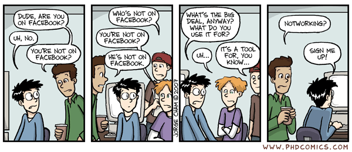
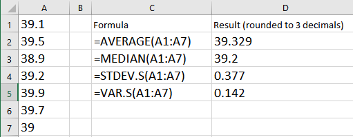
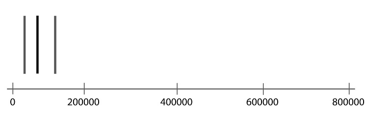
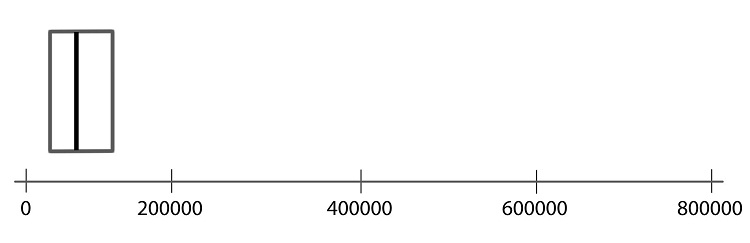
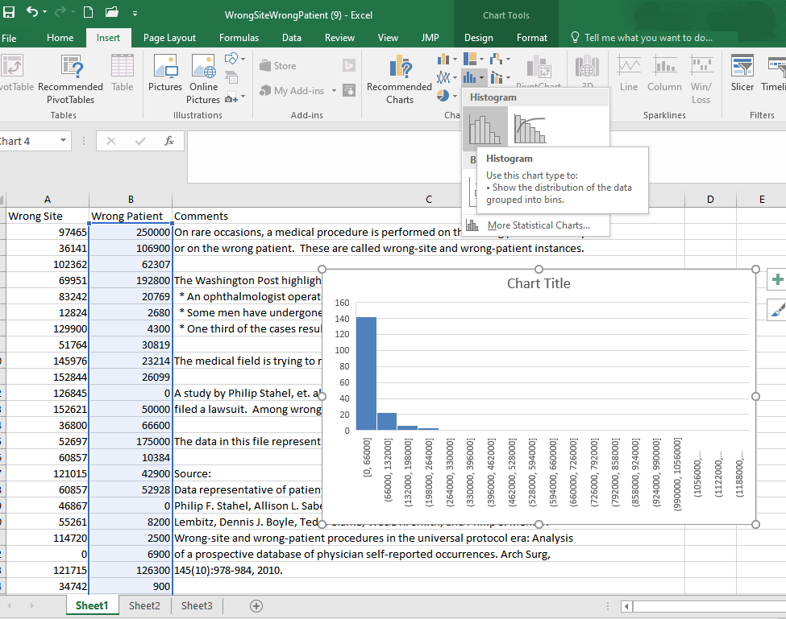
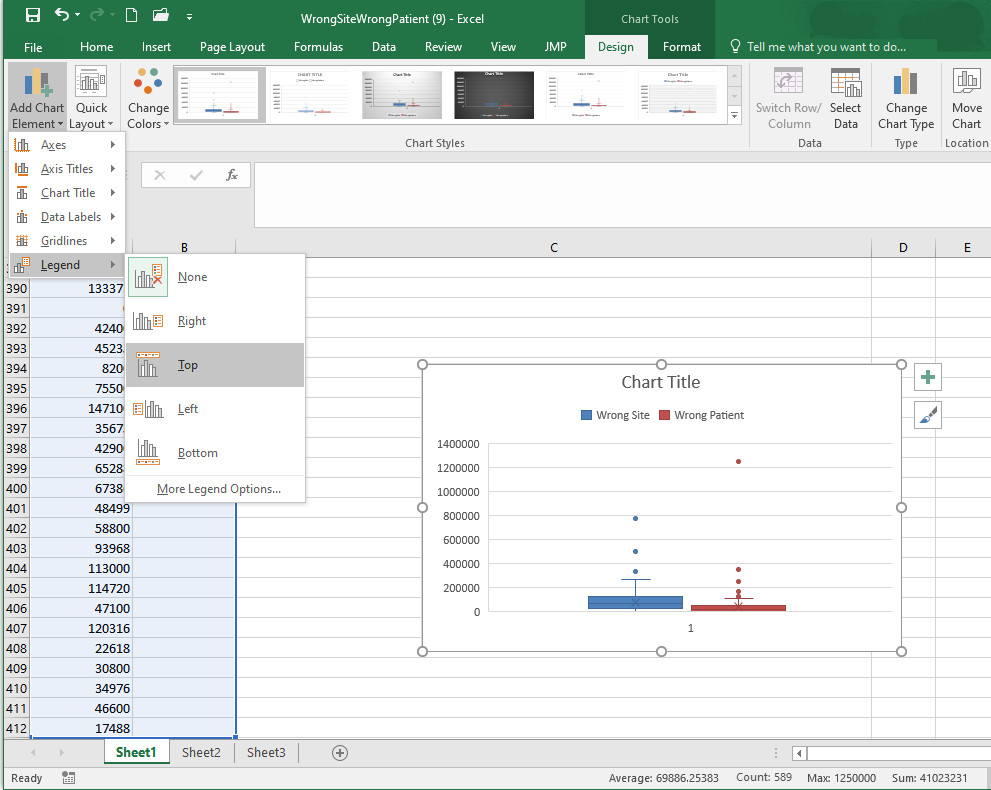

<!--

 

**Optional Lesson Video**

<iframe width="90%" align="right" src="https://www.youtube.com/embed/videoseries?list=PLaZryQtbPQC-a7rYECFUKhL6yMzvOIwCO" frameborder="1" allow="autoplay; encrypted-media" allowfullscreen></iframe>

-->

 

## Lesson Outcomes

<a href="javascript:showhide('oc')">Show/Hide Outcomes</a>

By the end of this lesson, you should be able to:

* Approximate the standard deviation of a distribution visually from a bell-shaped histogram.
* Calculate the standard deviation from quantitative data using Excel.
* Interpret the standard deviation for symmetric distributions.
* Properly apply the Excel functions STDEV.S, PERCENTILE.INC, QUARTILE.INC, MIN, and MAX to quantitative data.
* Interpret the five-number summary for quantitative data.
* Create a box-plot from quantitative data using Excel.
* Determine the five-number summary visually from a box plot. * Explain the relationship between probabilities, percentiles, and percentages.

 

## Spread of a Distribution

In the previous lesson, we introduced two important characteristics of a distribution: the **shape** and the **center**.  In this section, you will discover ways to summarize the **spread** of a distribution of data. The spread of a distribution of data describes how far the observations tend to be from each other.  There are many ways to describe the spread of a distribution, but one of the most popular measurements of spread is called the "standard deviation."
 

### Standard Deviation and Variance

This activity introduces two measures of spread: the standard deviation and the variance.

**Bird Flu Fever **

Avian Influenza A H5N1, commonly called the bird flu, is a deadly illness that is currently only passed to humans from infected birds. This illness is particularly dangerous because at some point it is likely to mutate to allow human-to-human transmission. Health officials worldwide are preparing for the possibility of a bird flu pandemic.

Dr. K. Y. Yuen led a team of researchers who reported the body temperatures of people admitted to Chinese hospitals with confirmed cases of Avian Influenza.
Their research team collected data on the body temperature at the time that people with the bird flu were admitted to the hospital. In the article, they reported on two groups of people, those with relatively uncomplicated cases of the bird flu and those with severe cases.

The table below presents the data representative of the body temperatures for the two groups of bird flu patients:

| Relatively Uncomplicated Cases | Severe Cases |
|--------------------------------|--------------|
| 38.1 | 39.1 |
| 38.3 | 39.5 |
| 38.4 | 38.9 |
| 39.5 | 39.2 |
| 39.7 | 39.9 |
|      | 39.7 |
|      | 39.0 |

Let us focus on the relatively uncomplicated cases. Creating a histogram of such a small dataset does not provide much benefit. With only a handful of values, there is not much shape to the distribution.

We can, however, use numerical summaries to give an indication of the center of the distribution.

Answer the following questions:

7. What is the median of the body temperatures for the relatively uncomplicated cases?  <!--Draw a vertical line on your number line to represent this point. -->

<a href="javascript:showhide('Q7')">Show/Hide Solution</a>

* The median body temperature for the relatively uncomplicated cases is 38.4 degrees Centigrade.

 

8. What is the mean of the body temperatures for the relatively uncomplicated cases?  <!--Draw a vertical line on your number line to represent this point. -->

<a href="javascript:showhide('Q8')">Show/Hide Solution</a>

* The mean body temperature for the relatively uncomplicated cases is 38.8 degrees Centigrade.

&nbsp;

 

We will use these data to investigate some measures of the spread in a data set.

There is relatively little difference in the temperatures of the uncomplicated patients. The lowest is $38.1 ^\circ \text{C}$, while the highest temperature is $39.7 ^\circ \text{C}$.

The **standard deviation** is a measure of the *spread* in the distribution. If the data tend to be close together, then the standard deviation is relatively small. If the data tend to be more spread out, then the standard deviation is relatively large.

The standard deviation of the body temperatures is $0.742 ^\circ \text{C}$. This number contains information from all the patients. If the patients' temperatures had been more diverse, the standard deviation would be larger. If the patients' temperatures were more uniform (i.e. closer together), then the standard deviation would have been smaller.  If all the patients somehow had the same temperature, then the standard deviation would be zero.

We are working with a sample. To be explicit, we call $0.742 ^\circ \text{C}$ the *sample* standard deviation. The symbol for the sample standard deviation is $s$.  This is a statistic.  The parameter representing the *population* standard deviation is $\sigma$ (pronounced /SIG-ma/).  In practice, we rarely know the value of the population standard deviation, so we use the sample standard deviation $s$ as an approximation for the unknown population standard deviation $\sigma$.

At this point, you probably do not have much intuition regarding the standard deviation. We will use this statistic frequently. By the end of the semester you can expect to become very comfortable with this idea. For now, all you need to know is that if two variables are measured on the same scale, the variable with values that are further apart will have the larger standard deviation.

Excel Instructions

&nbsp;&nbsp;**To calculate the sample standard deviation in Excel, follow these steps:**
&nbsp;&nbsp;

* In a blank cell, type "**=stdev.s(**"
* Highlight the data (the cell range reference will be added to your formula)
* Close the parenthesis with "**)**" and hit enter

 

 

**Rounding:** As a general rule, when reporting your answers in this class, round to three decimal places unless otherwise specified.

 
 

#### Calculating the Standard Deviation by Hand

How is the standard deviation computed?  Where does this "magic" number come from?  How does one number include the information about the spread of all the points?

It is a little tedious to compute the standard deviation by hand. You will usually compute standard deviation with a computer. However, the process is very instructive and will help you understand conceptually what the statistic represents. As you work through the following steps, please remember the goal is to find a measure of the spread in a data set. We want one number that describes how spread out the data are.

First, observe the number line below, where each x represents the temperature of a patient with a relatively uncomplicated case of bird flu. As mentioned earlier, there is not a huge spread in the temperatures.

On your sketch of the number line, we draw a vertical line at 38.8 degrees, the sample mean.  Now, draw horizontal lines from the mean to each of your $\times$'s.  These horizontal line segments represent the spread of the data about the mean.  Your plot should look something like this:

The length of each of the line segments represents how far each observation is from the mean.  If the data are close together, these lines will be fairly short.  If the distribution has a large spread, the line segments will be longer. The standard deviation is a measure of how long these lines are, as a whole.

The distance between the mean and an observation is referred to as a deviation. In other words, deviations are the lengths of the line segments drawn in the image above.

$$
\begin{array}{1cl}
\text{Deviation} & = & \text{Value} - \text{Mean} \\
\text{Deviation} & = & x - \bar x
\end{array}
$$

If the observed value is greater than the mean, the deviation is positive.  If the value is less than the mean, the deviation is negative.

The standard deviation is a complicated sort of average of the deviations. Making a table like the one below will help you keep track of your calculations. Please participate fully in this exercise. Writing your answers at each step and developing a table as instructed will greatly enhance the learning experience. By following these steps, you will be able to compute the standard deviation by hand, and more importantly, understand what it is telling you.

**Step 01**: The first step in computing the standard deviation by hand is to create a table, like the following. Enter the observed data in the first column.

<table>
<thead>
<tr class="header">
<th>
Observation ($x$)

</td>
</th>
<th>
Deviation from the Mean ($x-\bar x$)

</th>
</tr>
</thead>
<tbody>
<tr class="odd">
</tr>
<tr class="even">
<td>
$38.1$
</td>
<td>
$38.1-38.8=-0.7$
</td>
</tr>
<tr class="odd">
<td>
$38.3$
</td>
<td></td>
</tr>
<tr class="even">
<td>
$38.4$
</td>
<td></td>
</tr>
<tr class="odd">
<td>
$39.5$
</td>
<td></td>
</tr>
<tr class="even">
<td>
$39.7$
</td>
<td></td>
</tr>
<tr class="odd">
<td>
$\bar x = 38.8$
</td>
<td></td>
</tr>
</tbody>
</table>

**Step 02**: The second column of the table contains the deviations from the mean. Complete column 2 of the table above.

<a href="javascript:showhide('Step2')">Check Results for Step 2</a>

<table>
<thead>
<tr class="header">
<th>
Observation ($x$)
</th>
<th>
Deviation from the Mean ($x-\bar x$)

</th>
</tr>
</thead>
<tbody>
<tr class="even">
<td>
$38.1$
</td>
<td>
$38.1-38.8=-0.7$
</td>
</tr>
<tr class="odd">
<td>
$38.3$
</td>
<td>
$38.3-38.8=-0.5$
</td>
</tr>
<tr class="even">
<td>
$38.4$
</td>
<td>
$38.4-38.8=-0.4$
</td>
</tr>
<tr class="odd">
<td>
$39.5$
</td>
<td>
$39.5-38.8=0.7$
</td>
</tr>
<tr class="even">
<td>
$39.7$
</td>
<td>
$39.7-38.8=0.9$
</td>
</tr>
<tr class="odd">
<td>
$\bar x = 38.8$
</td>
<td></td>
</tr>
</tbody>
</table>

 

Answer the following questions:

9. How could we use this table to find the "typical" distance from each point to the mean? Think carefully about this, and then write down your answer before continuing.

<a href="javascript:showhide('Q9')">Show/Hide Solution</a>

* You may have suggested that we compute the mean of these values. This seems like a good idea.  If we compute the mean, it will tell us the average deviation from the mean.
 
 
9b. Compute the mean of Column 2. What do you get?

<a href="javascript:showhide('Q9b')">Click Here to Continue</a>

* You should have found that the mean of the deviations is zero.  This is true for *every* data set. If you add up the deviations from the mean, the positive values will cancel with the negative values. The sum of the deviations from the mean will be zero, so the mean also must equal zero.
* The good news is that you can use this fact to check if you are on the right track.  If the deviations from the mean do not add up to zero, then you have made a mistake in the calculations. The bad news is that the deviations always add up to 0, making it look like the distance from the data to the mean is 0. Nonsense!
* The mean of the deviations from the mean cannot be used to find a measure of the spread in a data set, but it does provide a guidepost that shows we are on the right track.  We must find another way to estimate the spread of a data set.

 

10. We need a way to work with the negative deviations from the mean, so they do not cancel with the positive ones.  What could we do?  (Choose one of the four options below.)

<a href="javascript:showhide('Q10a')">Option #1: Take the absolute value of the deviations</a>

* Option #1:

* This is an excellent suggestion.  This is probably one of the first things statisticians used to estimate the spread in the data.  

* If we take the absolute value of the deviations, then all the values are positive.  By taking the mean of these numbers, we do get a measure of spread.  This quantity is called the mean absolute deviation (MAD).

* There is good news and bad news.  The good news is, you discovered a way to estimate the spread in a data set. (In fact, the MAD is used as one estimate of the volatility of stocks.) The bad news is that the MAD does not have good theoretical properties. A proof of this claim requires calculus, and so will not be discussed here.  For most applications, there is a better choice.  Please select another option.

 

<a href="javascript:showhide('Q10b')">Option #2: Square the deviations from the mean</a>

* Option #2:

* If we square the deviations from the mean, the values that were negative will become positive.  This leads to an estimator of the spread that has excellent theoretical properties.  This is the best of the four options.  You will apply this idea in Step 03.

 

<a href="javascript:showhide('Q10c')">Option #3: Delete all the negative deviations</a>

* Option #3:

* Sorry, you can't make your troubles go away by deleting things you don't like.  Please try again.

 

<a href="javascript:showhide('Q10d')">Option #4: Do something entirely different</a>

* Option #4:

* You probably have an ingenious idea.  Surprisingly enough, there *is* a right answer to the question.  Please choose a different option.

 
 

* Please do not go on to Step 03 until you have finished this exploration.

 

"Piled Higher and Deeper" by Jorge Cham
 

**Step 03**:  Add a third column to your table. To get the values in this column, square the deviations from the mean that you found in Column 2.

<a href="javascript:showhide('Step3blank')">Click Here for a Blank Table</a>

<table>
<thead>
<tr class="header">
<th>
Observation $x$
</th>
<th>
Deviation 
from the Mean 
$x-\bar x$
</th>
<th>
Squared Deviation 
from the Mean 
$\left(x-\bar x\right)^2$
</th>
</tr>
</thead>
<tbody>
<tr class="even">
<td>
$38.1$
</td>
<td>
$38.1-38.8=-0.7$
</td>
<td></td>
</tr>
<tr class="odd">
<td>
$38.3$
</td>
<td>
$38.3-38.8=-0.5$
</td>
<td></td>
</tr>
<tr class="even">
<td>
$38.4$
</td>
<td>
$38.4-38.8=-0.4$
</td>
<td></td>
</tr>
<tr class="odd">
<td>
$39.5$
</td>
<td>
$39.5-38.8=0.7$
</td>
<td></td>
</tr>
<tr class="even">
<td>
$39.7$
</td>
<td>
$39.7-38.8=0.9$
</td>
<td></td>
</tr>
<tr class="odd">
<td>
$\bar x = 38.8$
</td>
<td>
Sum $=0$
</td>
<td></td>
</tr>
</tbody>
</table>

 

<a href="javascript:showhide('Step3filled')">Check Results for Step 03</a>

<table>
<thead>
<tr class="header">
<th>
Observation $x$
</th>
<th>
Deviation 
from the Mean 
$x-\bar x$
</th>
<th>
Squared Deviation 
from the Mean 
$\left(x-\bar x\right)^2$
</th>
</tr>
</thead>
<tbody>
<tr class="even">
<td>
$38.1$
</td>
<td>
$38.1-38.8=-0.7$
</td>
<td>
$(-0.7)^2=0.49$
</td>
</tr>
<tr class="odd">
<td>
$38.3$
</td>
<td>
$38.3-38.8=-0.5$
</td>
<td>
$(-0.5)^2=0.25$
</td>
</tr>
<tr class="even">
<td>
$38.4$
</td>
<td>
$38.4-38.8=-0.4$
</td>
<td>
$(-0.4)^2=0.16$
</td>
</tr>
<tr class="odd">
<td>
$9.5$
</td>
<td>
$39.5-38.8=0.7$
</td>
<td>
$(0.7)^2=0.49$
</td>
</tr>
<tr class="even">
<td>
$39.7$
</td>
<td>
$39.7-38.8=0.9$
</td>
<td>
$(0.9)^2=0.81$
</td>
</tr>
<tr class="odd">
<td>
$\bar x = 38.8$
</td>
<td>
Sum $=0$
</td>
<td></td>
</tr>
</tbody>
</table>

 

**Step 04**:  Now, add up the squared deviations from the mean.

<a href="javascript:showhide('Step4')">Check Results for Step 04</a>

<table>
<thead>
<tr class="header">
<th>
Observation $x$
</th>
<th>
Deviation 
from the Mean 
$x-\bar x$
</th>
<th>
Squared Deviation 
from the Mean 
$\left(x-\bar x\right)^2$
</th>
</tr>
</thead>
<tbody>
<tr class="even">
<td>
$38.1$
</td>
<td>
$38.1-38.8=-0.7$
</td>
<td>
$(-0.7)^2=0.49$
</td>
</tr>
<tr class="odd">
<td>
$38.3$
</td>
<td>
$38.3-38.8=-0.5$
</td>
<td>
$(-0.5)^2=0.25$
</td>
</tr>
<tr class="even">
<td>
$38.4$
</td>
<td>
$38.4-38.8=-0.4$
</td>
<td>
$(-0.4)^2=0.16$
</td>
</tr>
<tr class="odd">
<td>
$39.5$
</td>
<td>
$39.5-38.8=0.7$
</td>
<td>
$(0.7)^2=0.49$
</td>
</tr>
<tr class="even">
<td>
$39.7$
</td>
<td>
$39.7-38.8=0.9$
</td>
<td>
$(0.9)^2=0.81$
</td>
</tr>
<tr class="odd">
<td>
$\bar x = 38.8$
</td>
<td>
Sum $=0$
</td>
<td>
Sum $=2.20$
</td>
</tr>
</tbody>
</table>
The sum of the squared deviations is 2.20.

 

Answer the following questions:

11. Suppose that the researchers had collected body temperature data on 500 bird flu patients instead of 5.  What would happen to the sum of the squared deviations, if the distribution of the data is the same for the 500 patients as the 5 patients?

<a href="javascript:showhide('Q11')">Show/Hide Solution</a>

* We would expect the sum of the squared deviations to be a lot larger than it is now.  We would be adding squared deviations for 500 observations instead of 5. So, the sum of the squared deviations would be about 100 times larger.  
* Remember, we are trying to find a measure of the spread of a data set.  Our final measure should not be dependent on the sample size.   We need to do something else.

 

12. What could we do to make sure the sample size does not inflate our estimate of the spread of the data?

<a href="javascript:showhide('Q12a')">Option #1: Divide by n</a>

* Option #1:

* This is an excellent suggestion.  There are good reasons to choose this option.  Unfortunately, dividing by $n$ to estimate the spread of data gives estimates that are too low, on average. There is a surprising, yet simple fix: divide by $n-1$ instead of $n$.  Please examine Option #2.

 

<a href="javascript:showhide('Q12b')">Option #2: Divide by n-1</a>

* Option #2:

* This seems very odd, but it avoids the problem of underestimating the spread in the data, a problem that dividing by $n$ has. Ultimately, dividing by $n-1$ will lead us to the standard deviation you computed using
<!--{{Course_Filter|course=B C|content=SPSS}}-->
earlier. In Step 05, you will divide the sum of the squared deviations by $n-1$.  Here is how your table should look so far.

<table>
<thead>
<tr class="header">
<th>
Observation $x$
</th>
<th>
Deviation 
from the Mean 
$x-\bar x$
</th>
<th>
Squared Deviation 
from the Mean 
$\left(x-\bar x\right)^2$
</th>
</tr>
</thead>
<tbody>
<tr class="even">
<td>
$38.1$
</td>
<td>
$38.1-38.8=-0.7$
</td>
<td>
$(-0.7)^2=0.49$
</td>
</tr>
<tr class="odd">
<td>
$38.3$
</td>
<td>
$38.3-38.8=-0.5$
</td>
<td>
$(-0.5)^2=0.25$
</td>
</tr>
<tr class="even">
<td>
$38.4$
</td>
<td>
$38.4-38.8=-0.4$
</td>
<td>
$(-0.4)^2=0.16$
</td>
</tr>
<tr class="odd">
<td>
$39.5$
</td>
<td>
$39.5-38.8=0.7$
</td>
<td>
$(0.7)^2=0.49$
</td>
</tr>
<tr class="even">
<td>
$39.7$
</td>
<td>
$39.7-38.8=0.9$
</td>
<td>
$(0.9)^2=0.81$
</td>
</tr>
<tr class="odd">
<td>
$\bar x = 38.8$
</td>
<td>
Sum $=0$
</td>
<td>
Sum $=2.20$
</td>
</tr>
<tr class="even">
<td></td>
<td>
$\displaystyle{s^2=\frac{sum}{n-1}=\frac{2.20}{5-1}=0.55}$
</td>
<td></td>
</tr>
</tbody>
</table>

 

<a href="javascript:showhide('Q12c')">Option #3: Neither of these</a>

* Option #3:

* You probably have an ingenious idea.  Nevertheless, please choose a different option.

 

* Please do not go on until you have finished this exercise.

 

**Step 05**: Divide the sum of the squared deviations by $n - 1$. Write this value at the bottom of Column 3 of your table.

The number you computed in Step 05 is called the **sample variance**. It is a measure of the spread in a data set. It has very nice theoretical properties.  The variance plays an important role in Statistics.  We denote the sample variance by the symbol $s^2$.  

It can be shown that the sample variance is an unbiased estimator of the true population variance (which is denoted $\sigma^2$.) This means that the sample variance can be considered a reasonable estimator of the population variance.  If the sample size is large, this estimator tends to be very good.

<a href="javascript:showhide('Step5')">Check the Results for Step 05</a>

 The sum of the squared deviations is the sum of the values in Column 3.  This sum equals 2.20. We divide the sum of Column 3 ($2.20$) by $n-1=5-1=4$ to get the sample variance, $s^2$:

$$s^2=\frac{sum}{n-1}=\frac{2.20}{5-1}=0.55$$

This is the sample variance.  

<table>
<thead>
<tr class="header">
<th>
Observation $x$
</th>
<th>
Deviation 
from the Mean 
$x-\bar x$
</th>
<th>
Squared Deviation 
from the Mean 
$\left(x-\bar x\right)^2$
</th>
</tr>
</thead>
<tbody>
<tr class="even">
<td>
$38.1$
</td>
<td>
$38.1-38.8=-0.7$
</td>
<td>
$(-0.7)^2=0.49$
</td>
</tr>
<tr class="odd">
<td>
$38.3$
</td>
<td>
$38.3-38.8=-0.5$
</td>
<td>
$(-0.5)^2=0.25$
</td>
</tr>
<tr class="even">
<td>
$38.4$
</td>
<td>
$38.4-38.8=-0.4$
</td>
<td>
$(-0.4)^2=0.16$
</td>
</tr>
<tr class="odd">
<td>
$39.5$
</td>
<td>
$39.5-38.8=0.7$
</td>
<td>
$(0.7)^2=0.49$
</td>
</tr>
<tr class="even">
<td>
$39.7$
</td>
<td>
$39.7-38.8=0.9$
</td>
<td>
$(0.9)^2=0.81$
</td>
</tr>
<tr class="odd">
<td>
$\bar x = 38.8$
</td>
<td>
Sum $=0$
</td>
<td>
Sum $=2.20$
</td>
</tr>
<tr class="even">
<td>
Variance:
</td>
<td>
$\displaystyle{s^2=\frac{sum}{n-1}=\frac{2.20}{5-1}=0.55}$
</td>
<td></td>
</tr>
</tbody>
</table>

 

Answer the following questions:

13. The temperature data for the bird flu patients are in degrees Centigrade. What are the units of the variance?

<a href="javascript:showhide('Q13')">Show/Hide Solution</a>

* The data in Column 1 of the table is in degrees Centigrade.  The mean also is in degrees Centigrade.
* To get the numbers in Column 2, we subtracted the mean from each of the values in Column 1.
* We squared the values in Column 2 to get Column 3. The units for this column are degrees Centigrade squared.  
* The sum of the numbers in Column 3 will also be in units of degrees Centigrade squared.
* When we divided that sum by $n-1$, we obtained the sample variance.  The sample variance has units of degrees Centigrade squared. This is not easily interpretable. It would be much easier to think about it if our measure of spread was in the same units as the data.

 

14. What operation can we do to the variance to get a quantity with units degrees Centigrade?

<a href="javascript:showhide('Q14')">Show/Hide Solution</a>

* If we take the square root of the variance, we get a quantity that has units of degrees Centigrade. This quantity is the standard deviation.

&nbsp;

 

**Step 06**: Take the square root of the sample variance to get the sample standard deviation.

The sample standard deviation is defined as the square root of the sample variance.

$$\text{Sample Standard Deviation} = s = \sqrt{ s^2 } = \sqrt{\strut\text{Sample Variance}}$$

The standard deviation has the same units as the original observations.  We use the standard deviation heavily in statistics.

The sample standard deviation ($s$) is an estimate of the true population standard deviation ($\sigma$).

Answer the following questions:

15. What is the sample standard deviation, $s$, of the temperatures of the five patients with relatively uncomplicated cases of the bird flu?

<a href="javascript:showhide('Q15')">Show/Hide Solution</a>

* The sum of the squared deviations is the sum of the values in Column 3.  This sum equals 2.20. We divide the sum of Column 3 ($2.20$) by $n-1=5-1=4$ to get the sample variance, $s^2$:

$s^2=\frac{sum}{n-1}=\frac{2.20}{5-1}=0.55$

* This is the sample variance.  

<table>
<thead>
<tr class="header">
<th>
Observation $x$
</th>
<th>
Deviation 
from the Mean 
$x-\bar x$
</th>
<th>
Squared Deviation 
from the Mean 
$\left(x-\bar x\right)^2$
</th>
</tr>
</thead>
<tbody>
<tr class="even">
<td>
$38.1$
</td>
<td>
$38.1-38.8=-0.7$
</td>
<td>
$(-0.7)^2=0.49$
</td>
</tr>
<tr class="odd">
<td>
$38.3$
</td>
<td>
$38.3-38.8=-0.5$
</td>
<td>
$(-0.5)^2=0.25$
</td>
</tr>
<tr class="even">
<td>
$38.4$
</td>
<td>
$38.4-38.8=-0.4$
</td>
<td>
$(-0.4)^2=0.16$
</td>
</tr>
<tr class="odd">
<td>
$39.5$
</td>
<td>
$39.5-38.8=0.7$
</td>
<td>
$(0.7)^2=0.49$
</td>
</tr>
<tr class="even">
<td>
$39.7$
</td>
<td>
$39.7-38.8=0.9$
</td>
<td>
$(0.9)^2=0.81$
</td>
</tr>
<tr class="odd">
<td>
$\bar x = 38.8$
</td>
<td>
Sum $=0$
</td>
<td>
Sum $=2.20$
</td>
</tr>
<tr class="even">
<td>
Variance:
</td>
<td>
$\displaystyle{s^2=\frac{sum}{n-1}=\frac{2.20}{5-1}=0.55}$
</td>
<td></td>
</tr>
<tr class="odd">
<td>
Standard Deviation:
</td>
<td>
$\displaystyle{s = \sqrt{s^2}=\sqrt{0.55} \approx 0.742}$
</td>
<td></td>
</tr>
</tbody>
</table>

- The sample standard deviation is $s = 0.742$ degrees Centigrade.

* Take a few minutes to verify that you can recreate this table on your own.

&nbsp;

 

#### Summary

&nbsp;&nbsp;**Standard Deviation**

&nbsp;&nbsp;The **standard deviation** is one number that describes the spread in a set of data.  If the data points are close together the standard deviation will be smaller than if they are spread out.

&nbsp;&nbsp;At this point, it may be difficult to understand the meaning and usefulness of the standard deviation.  For now, it is enough for you to recognize the following points:

  +  The standard deviation is a measure of how spread out the data are.
  +  If the standard deviation is large, then the data are very spread out.
  +  If the standard deviation is zero, then all the values are the identical--there is no spread in the data.
  +  The standard deviation cannot be negative.
 

**Variance**

The variance is the square of the standard deviation.  The sample variance is denoted by the symbol $s^2$.  You found the sample standard deviation for  patient temperatures of uncomplicated cases of bird  in the bird  above is $s = 0.74162$.  So, the sample variance for this data set is $s^2 = 0.74162^2 = 0.550$. Be aware, if you had squared the rounded value of $s^2 = 0.742$ in the calculation, you would have gotten an answer of 0.551 instead. This would be considered incorrect!
<!-- [[NEED TO DISCUSS STATISTIC v. PARAMETER.]] -->

**Rounding:** Use **un**rounded values in interim calculations. Rounding too early in the process can lead to wrong answers.

 
 

Excel Instructions

&nbsp;&nbsp;**To calculate the sample variance in Excel:**
&nbsp;&nbsp;

* In a blank cell, type "**=var.s(**"
* Highlight the data (the cell range reference will be added to your formula)
* Close the parenthesis with "**)**" and hit enter

 

 

The standard deviation and variance are two commonly used measures of the spread in a data set.  Why is there more than one measure of the spread?  The standard deviation and the variance each have their own pros and cons.

The variance has excellent theoretical properties.  It is an unbiased estimator of the true population variance.  That means that if many, many samples of $n$ observations were drawn, the variances computed for all the samples would be centered nicely around the true population variance, $\sigma^2$.  Because of these benefits, the variance is regularly used in higher-level statistics applications.  One drawback of the variance is that the units for the variance are the square of the units for the original data.  In the bird flu example, the body temperatures were measured in degrees Centigrade.  So, the variance will have units of degrees Centigrade squared $(^\circ \text{C})^2$.  What does degrees Centigrade squared mean?  How do you interpret this?  It doesn't make any sense.  This is one of the major drawbacks of the sample variance.

Because we take the square root of the variance to get the standard deviation, the standard deviation is in the same units as the original data.  This is a great advantage, and is one of the reasons that the standard deviation is commonly used to describe the spread of data.

Answer the following questions:

Enter the patient temperature data for the severe cases of bird flu into Excel. Then use Excel to calculate the numerical summaries you have learned so far. As a reminder, the temperatures of patients with a severe case of bird flu are:

 39.1, 39.5, 38.9, 39.2, 39.9, 39.7, 39 

16. What is the mean, median, standard deviation and variance of the sample?

<a href="javascript:showhide('Q16')">Show/Hide Solution</a>

 

For the next two questions, consider the histograms below comparing weight (in kilograms) of men (top histogram) to elephant seals (bottom histogram).

 

Weight of Men Compared to Weight of Seals 

17. Based on the histograms, who has a greater sample mean weight, men or elephant seals?

<a href="javascript:showhide('Q17')">Show/Hide Solution</a>

* The mean is a measure of the center of a distribution. The mean weight of the men is less than the mean weight of the seals. We can see this because the bulk of the data in the histogram for the men’s weight is to the left of the seals'. The center of the distribution of elephant seals is about 195 kg. The center of the distribution of men's weight is located below 100 kg on the number line.

 

18. Based on the histograms, do the weights of men or elephant seals have a larger sample standard deviation?

<a href="javascript:showhide('Q18')">Show/Hide Solution</a>

* Standard deviation is a measure of spread. You will note that the weights of the seals are more spread out than the weights of the men. Therefore, we conclude that the sample standard deviation of elephant seal weights is larger than the sample standard deviation of men's weights.

&nbsp;

 

**Review of Parameters and Statistics**

We have now learned some statistics that can be used to estimate population parameters.  For example, we use $\bar x$ to estimate the population mean $\mu$.  The sample statistics $s$ estimates the true population standard deviation $\sigma$.  The following table summarizes what we have done so far:

<table>
<thead>
<tr class="header">
<th></th>
<th>
Sample Statistic
</th>
<th>
Population Parameter
</th>
</tr>
</thead>
<tbody>
<tr class="odd">
<td>
Mean
</td>
<td>
$\bar x$
</td>
<td>
$\mu$
</td>
</tr>
<tr class="even">
<td>
Standard Deviation
</td>
<td>
$s$
</td>
<td>
$\sigma$
</td>
</tr>
<tr class="odd">
<td>
Variance
</td>
<td>
$s^2$
</td>
<td>
$\sigma^2$
</td>
</tr>
<tr class="even">
<td>
$\vdots$
</td>
<td>
$\vdots$
</td>
<td>
$\vdots$
</td>
</tr>
</tbody>
</table>

Unless otherwise specified, we will always use Excel to find the sample variance and sample mean.
In each case, the sample statistic estimates the population parameter.  The ellipses $\vdots$ in this table hint that we will add rows in the future.

 

**Optional Reading: Formulas for $s$ and $s^2$ (Hidden)**

<a href="javascript:showhide('s2')">Click Here if you love Math</a>

**Formulas**

For those who like formulas, the equation for the sample variance and sample standard deviation are given here.

**Sample variance**:

$$\displaystyle{ s^2=\frac{\sum\limits_{i=1}^n (x_i-\bar x)^2}{n-1} }$$

**Sample standard deviation**:

$$\displaystyle{ s=\sqrt{s^2}=\sqrt{\frac{\sum\limits_{i=1}^n (x_i-\bar x)^2}{n-1}} }$$

where $x_i$ is the $i^{th}$ observed data value, and  $i=1, 2, \ldots, n$.

Unless otherwise specified, we will always use Excel<!--{{Course_Filter|course=B C|content=SPSS}}--> to find the sample variance and sample mean.

**Why do we divide by $n-1$?**

When computing the standard deviation or the variance, we are finding a value that describes the spread of data values. It is a measure of how far the data are from the mean.  Since we do not know the true mean ($\mu$,) we use the sample mean ($\bar x$,) to estimate it. Typically, the data will be closer to $\bar x$ than to $\mu$, since $\bar x$ was computed using the data.  To compensate for this, we divide by $n-1$ rather than $n$ when we find the "average" of the squared deviations from the mean.  It turns out, that subtracting 1 from $n$ inflates this average by the precise amount needed to compensate for the use of $\bar x$ as an estimate for $\mu$.  As a result, the sample variance ($s^2$) is a good estimator of the population variance ($\sigma^2$.)

 

Neither the standard deviation nor the variance is **resistant** to outliers.  This means that when there are outliers in the data set, the standard deviation and the variance become artificially large.  It is worth noting that the mean is also not resistant.  When there are outliers, the mean will be "pulled" in the direction of the outliers.

The mean and standard deviation are used to describe the center and spread when the distribution of the data is symmetric and bell-shaped.  If data are not symmetric and bell-shaped, we typically use the five-number summary (discussed below) to describe the spread, because this summary is resistant.

## Additional Tools to Describe the Data

Recall the five steps of the Statistical Process (and the mnemonic "Daniel Can Discern More Truth).

<table>
<tbody>
<tr class="odd">
<td>
Step 1:
</td>
<td>
**D**aniel
</td>
<td>
**D**esign the study
</td>
</tr>
<tr class="even">
<td>
Step 2:
</td>
<td>
**C**an
</td>
<td>
**C**ollect data
</td>
</tr>
<tr class="odd">
<td>
Step 3:
</td>
<td>
**D**iscern
</td>
<td>
**D**escribe the data
</td>
</tr>
<tr class="even">
<td>
Step 4:
</td>
<td>
**M**ore
</td>
<td>
**M**ake inferences
</td>
</tr>
<tr class="odd">
<td>
Step 5:
</td>
<td>
**T**ruth
</td>
<td>
**T**ake action
</td>
</tr>
</tbody>
</table>

**Step 3** of this process is "**Describe the data**." You have already learned about the mean, median, mode, standard deviation, variance and histograms. These can be good ways to describe the data. The following information on percentiles, quartiles, 5-number summaries, and boxplots will help you learn other common ways to describe data, especially if the data are skewed or contain outliers.

For symmetric, bell-shaped data, the mean and standard deviation provide a good description of the center and shape of the distribution.  The mean and standard deviation are not sufficient to describe a distribution that is skewed or has outliers. An **outlier** is any observation that is very far from the others.  The mean is pulled in the direction of the outlier.  Also, the standard deviation is inflated by points that are very far from the mean.

Now, you have probably had some experience with percentiles in the past especially when you received a score on a standardized test such as the ACT.  Even though percentiles are commonly used, they are generally misunderstood.  Before examining the wrong site/wrong patient data, let's review percentiles. Even if you think you understand percentiles, please study this section carefully.

 

### Percentiles and Quartiles

Imagine a very long street with houses on one side.  The houses increase in value from left to right.  At the left end of the street is a small cardboard box with a leaky roof.  Next door is a slightly larger cardboard box that does not leak.  The houses eventually get larger and more valuable.  The rightmost house on the street is a huge mansion.

Answer the following question:

19. There are 100 homes with increasing property values.  How many fences are needed to separate the 100 properties?

<a href="javascript:showhide('Q19')">Show/Hide Solution</a>

* In order to separate the 100 homes, 99 fences are required.

&nbsp;

 

The home values are representative of data.  If we have a list of data, sorted in increasing order, and we want to divide it into 100 equal groups, we only need 99 dividers (like fences) to divide up the data.  The first divider is as large or larger than 1% of the data.  The second divider is as large or larger than 2% of the data, and so on.  The last divider, the 99th, is the value that is as large or larger than 99% of the data.  These dividers are called percentiles. A **percentile** is a number such that a specified percentage of the data are at or below this number.  For example, the 99th percentile is a number such that 99% of the data are at or below this value.  As another example, half (50%) of the data lie at or below the 50th percentile.  The word percent means $\div 100$.  This can help you remember that the percentiles divide the data into 100 equal groups.

**Quartiles** are special percentiles. The word quartile is from the Latin *quartus*, which means "fourth." The quartiles divide the data into four equal groups. The quartiles correspond to specific percentiles.  The first quartile, Q1, is the 25th percentile. The second quartile, Q2, is the same as the 50th percentile or the median.  The third quartile, Q3, is equivalent to the 75th percentile.

Answer the following questions:

20. How many quartiles are there?

<a href="javascript:showhide('Q20')">Show/Hide Solution</a>

* There are 3 quartiles!  To divide the data into 100 equal groups, we needed 99 percentiles.  To divide the data into 4 equal groups, we need 3 quartiles.

&nbsp;

 

**Wrong Site/Wrong Patient Lawsuits**

Percentiles can be used to describe the center and spread of any distribution and are particularly useful when the distribution is skewed or has outliers.  To explore this issue, you will use software to calculate percentiles of data on costs incurred by hospitals due to certain lawsuits. The lawsuits in question were about surgeries performed on the wrong patient, or on the right patient but the wrong part of the patient's body (the wrong site).

Excel Instructions

&nbsp;&nbsp;**To calculate percentiles and quartiles in Excel, do the following**

- Open the data file you are using. For this example, open the file [WrongSiteWrongPatient.xlsx](./Data/WrongSiteWrongPatient.xlsx).

- You will use Excel's percentile (inclusive) function: **=percentile.inc()**

- This Excel function requires two inputs (or arguments), separated by a comma. The first input is the cell range reference. The second input is the desired percentile.

The wrong-site data in the file ranges from row 2 to row 412 in column A. So, to calculate the 25th percentile of the wrong site data you should enter the following formula in a blank cell somewhere in the file:

 =PERCENTILE.INC(A2:A412, 0.25) 

 

&nbsp;&nbsp;You may notice that some of the values for percentiles given in Excel are different from those given in other softwares. This is due to the slightly different ways in which percentiles can be calculated. In this course, be sure to use the percentiles that come from Excel's percentile.inc() function.
 

 

The first quartile ($Q_1$) or 25th percentile (calculated in Excel) of the wrong-site data is: \$29,496. (This result is illustrated in the figure below.)  This means that 25 percent of the time hospitals lost a wrong-site lawsuit, they had to pay \$29,496 or less. The 25th percentile can be written symbolically as: P25 = \$29,496.  Other percentiles can be written the same way.  The 99th percentile can be written as P99.

**Percentiles (Calculated in Excel)**

|        &nbsp;   |  &nbsp; |
| --------------- | ------- |
| 1st percentile  | 0       |
| 2nd percentile  | 0       |
| 3rd percentile  | 0       |
| ...             | ...     |
| 24th percentile | 28633.4 |
| 25th percentile | 29496   |
| 26th percentile | 31067   |

 

Answer the following questions:

21. What is the 13th percentile of the wrong site data?

<a href="javascript:showhide('Q21')">Show/Hide Solution</a>

* $6343.40
<!--::{{Course_Filter|course=B C|content=?5946.72}}-->

 

22. How would you interpret the 13th percentile (assuming the 13th percentile is $6343.40)?
* a. 100 of the lawsuits cost more than 13%.
* b. 13% of the lawsuits cost the hospital over $6343.40.
* c. In 13% of the wrong-site lawsuits, hospitals had to pay $6343.40 or less.
* d. For 13% of the wrong-site lawsuits, the hospitals had to pay $6343.40 to the patient.

<a href="javascript:showhide('Q22')">Show/Hide Solution</a>

* Correct Answer: C

 

23. Find P90.

<a href="javascript:showhide('Q23')">Show/Hide Solution</a>

* $149,963.00
<!--::{{Course_Filter|course=B C|content=?149,992.60}}-->

 

24. The quartiles divide a sorted list of data into four equal groups. So, each group contains 25% of the data. The first quartile is the value that is greater than or equal to 25% of the data.  What is another name for this number?

<a href="javascript:showhide('Q24')">Show/Hide Solution</a>

* The 25th percentile.

 

25. What is the value of the third quartile?

<a href="javascript:showhide('Q25')">Show/Hide Solution</a>

* $124,280.00
<!--::{{Course_Filter|course=B C|content=?124,513.00}}-->

 

26. Half of the wrong-site lawsuits judgments were less than or equal to what value?

<a href="javascript:showhide('Q26')">Show/Hide Solution</a>

* $68,552.00

 

27. The median is the middle observation in a sorted list of data. What percentile is always equal to the median?

<a href="javascript:showhide('Q27')">Show/Hide Solution</a>

* The 50th percentile

&nbsp;

 

### The Five-Number Summary

Another way to summarize data is with the five-number summary.  **The five-number summary** is comprised of the minimum, the first quartile, the second quartile (or median), the third quartile, and the maximum.  

Statistical packages can give different results for some computations.  This is because there are several reasonable ways to define certain quantities, such as the quartiles. As such, you may find that some of the values that are given in Excel<!--{{Course_Filter|course=B C|content=SPSS}}--> are different than what other software may give.

<!--Please be sure to use the values that you calculate using the software designated for your particular class ({{Course_Filter|course=A|content=Excel}}{{Course_Filter|course=B C|content=SPSS}}-->

Excel Instructions

&nbsp;&nbsp;**To find the values for a five-number summary in Excel, do the following**

- Open the data file you are using. For this example, open the file [WrongSiteWrongPatient.xlsx](./Data/WrongSiteWrongPatient.xlsx).

- You can use the function **=percentile.inc()** in Excel to find the 1st quartile, median and 3rd quartile (otherwise known as the 25th, 50th, and 75th percentiles respectively).

- Type the following into a blank cell of the WrongSiteWrongPatient.xlsx worksheet
    - to find the minimum wrong-site value: =min(A2:A412)
    - to find the maximum wrong-site value: =max(A2:A412)
 

 

Answer the following questions:

28. Give the five-number summary for the Wrong Site data.

<a href="javascript:showhide('Q28')">Show/Hide Solution</a>

$$\displaystyle{\$0,~~\$29,496;~~\$68,552;~~\$124,280;~~\$780,575}$$
<!--::{{Course_Filter|course=B C|content=$ \displaystyle{\$0,~~\$29,379,~~\$68,552,~~\$124,513,~~\$780,575} $}}-->

&nbsp;

 

 

Some students mistakenly include the mean in the five-number summary.  The third value in the five-number summary is the median.

 
 

### Boxplots

A **boxplot** is a graphical representation of the five-number summary. Unlike the mean or standard deviation, a boxplot is resistant to outliers. That means that it won't be "pulled" one way or the other by extraordinarily large or small values in the data as will a mean, for instance. We will illustrate the process of making a boxplot using the wrong-site data.

Follow the steps below to learn how a boxplot relates to the five-number summary. Learning what each part of the boxplot represents will enable you to interpret the plot correctly.

**Step 01:** To draw a boxplot, start with a number line.

**Step 02:** Draw a vertical line segment above each of the quartiles.

**Step 03:** Connect the tops and bottoms of the line segments, making a box.

**Step 04:** Make a smaller mark above the values corresponding to the minimum and the maximum.

**Step 05:** Draw a line from the left side of the box to the minimum, and draw another line from the right side of the box the maximum.

**Step 06:** These last two lines look like whiskers, so this is sometimes called a box-and-whisker plot.

 

Excel Instructions

**To create a boxplot in Excel, do the following**

- Open the data file you are using. For this example, open the file [WrongSiteWrongPatient.xlsx](./Data/WrongSiteWrongPatient.xlsx).

- Highlight the data you want to plot (in this case, cells A2 to A412 contain the wrong-site lawsuit data).  
- Go to the Insert ribbon in Excel and select the histogram icon from the "Charts" section of the ribbon. Then select the only option under the Box and Whisker category.

 

 

Answer the following questions:

29. Create a histogram of the **wrong-patient** lawsuit data, located in column B of  the file [WrongSiteWrongPatient.xlsx](./Data/WrongSiteWrongPatient.xlsx). What is the shape of the wrong-patient data?

a. Skewed left
b. Symmetric
c. Skewed right
d. Multi-modal
e. Uniform

<a href="javascript:showhide('Q29')">Show/Hide Solution</a>

To create the histogram, highlight the data. Then go to the Insert ribbon of Excel. Select the histogram icon and then choose the first option under the Histogram category.

From the histogram we clearly see most values bunched near the left and gradually fewer values as we move to the right along the numer line, so the correct answer is 'c. Skewed right'.

 

30. Create a boxplot of the **wrong-patient** lawsuit data.

<a href="javascript:showhide('Q30')">Show/Hide Solution</a>

&nbsp;

 

Side-by-side boxplots are a powerful way to compare data from different samples visually. For example, we may be interested in comparing the results of wrong-site lawsuits and wrong-patient lawsuits.

In the plot we can quickly see that a wrong-patient lawsuit resulted in the largest cost to the hospital, more than $1.2 million. However, in general, wrong-patient lawsuits tend to result in a lower cost to the hospital than wrong-site lawsuits.

Excel Instructions

**To create side-by-side boxplots in Excel, do the following**

Open the data file you are using. For this example, open the file [WrongSiteWrongPatient.xlsx](./Data/WrongSiteWrongPatient.xlsx). Since these two datasets are next to each other in the file, the easiest way to create side-by-side boxplots plots is to highlight both columns of data. Then follow the same steps as for a single boxplot.

To make a side-by-side boxplot plot easier to understand you can add a legend. This is most easily done by clicking the green '+' near the upper right corner of the plot that appears when the plot is selected. Then, in the menu that appears, ensure the "legend" box is checked.

Alternatively, if the green '+' is not visible to you, follow these steps shown in the image below. After selecting the plot go to the Design ribbon and select Add Chart Element. In the menu that appears select Legend, and then choose where you would like the legend to appear on the plot, as shown below.

Additional formatting can be applied to further improve the appearance of the chart.

 

 

 

## Summary

Remember...

- The **standard deviation** is a number that describes how spread out the data are. A larger standard deviation means the data are more spread out than data with a smaller standard deviation.

- **Quartiles/percentiles**, **Five-Number Summaries**, and **Boxplots** are tools that help us understand data. The five-number summary of a data set contains the minimum value, the first quartile, the median, the third quartile, and the maximum value. A boxplot is a graphical representation of the five-number summary.

 

## Navigation

| **Previous Reading** | **This Reading** | **Next Reading** |
| :------------------: | :--------------: | :--------------: |
| [Lesson 3:   Describing Quantitative Data (Shape and Center)](Lesson03.html) | Lesson 4:   Describing Quantitative Data (Spread) | [Lesson 5:   Normal Distributions](Lesson05.html) |

 

 
