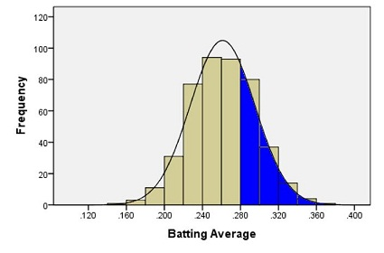
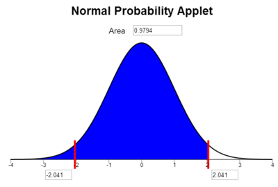
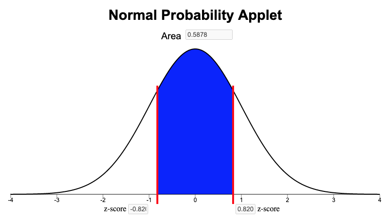
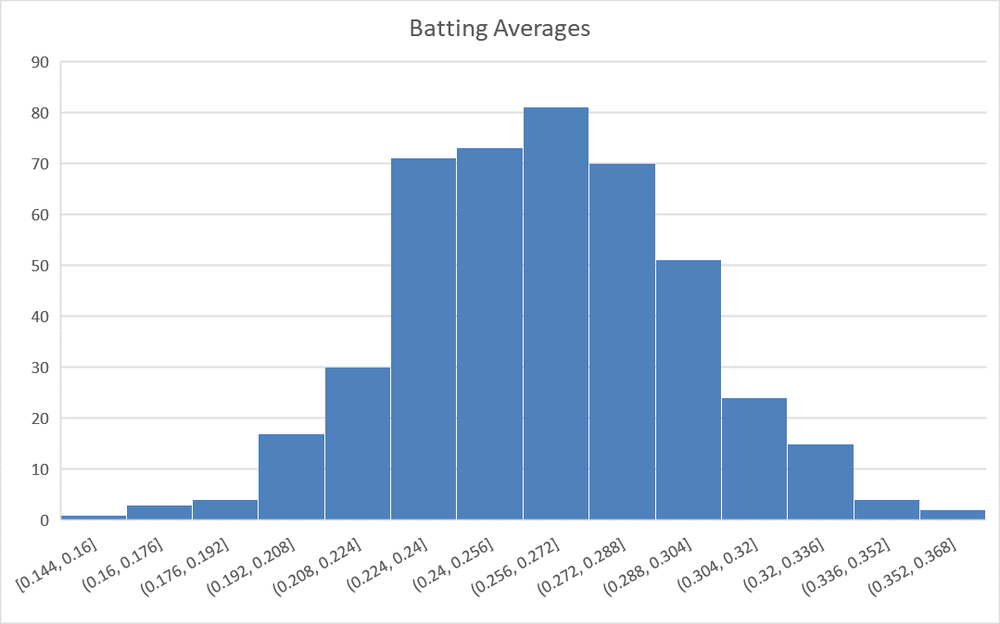
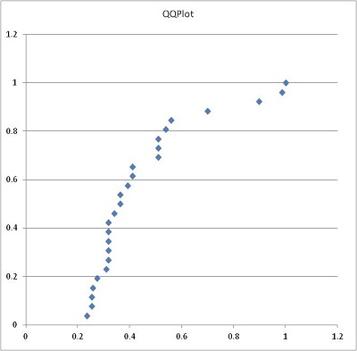
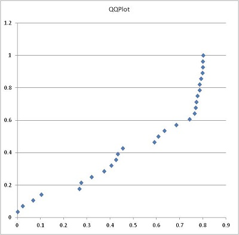

<script type="text/javascript">
 function showhide(id) {
    var e = document.getElementById(id);
    e.style.display = (e.style.display == 'block') ? 'none' : 'block';
 }
</script>

<!--

<div style="float:right;width=40%;">
<br/>
<div style="padding-left:10%;">**Optional Lesson Video**</div>
<iframe width="90%" align="right" src="https://www.youtube.com/embed/videoseries?list=PLaZryQtbPQC94-G9-36oCixDqF97LTx6S" frameborder="1" allow="autoplay; encrypted-media" allowfullscreen></iframe>
</div>

-->

<br>

## Lesson Outcomes

<a href="javascript:showhide('oc')"><span style="font-size:8pt;">Show/Hide Outcomes</span></a>
<div id="oc" style="display:none;">

By the end of this lesson, you should be able to:
* State the properties of a normal density curve.
* Calculate the z-score of an individual observation, given the mean and standard deviation.
* Interpret a z-score.
* Calculate probability as area under a normal density curve.
* Calculate a percentile using the normal distribution.

</div>
<br>

## Normal Distributions and Normal Computations

### Baseball Batting Averages


In baseball, a player called the "pitcher" throws a ball to a player called the "batter." The batter swings a wooden or metal bat and tries to hit the ball. A "hit" is made when the batter successfully hits the ball and runs to a point in the field called first base. A player's batting average is calculated as the ratio of the number of hits a player makes divided by the number of times the player has attempted to hit the ball or in other words, been "at bat." Sean Lahman reported the batting averages of several professional baseball players in the United States. (Lahman, 2010) The file [BattingAverages.xlsx](./Data/BattingAverages.xlsx) contains his data.

The following histogram summarizes the batting averages for these professional baseball players:


Notice the bell-shaped distribution of the data.

Suppose we want to estimate the probability that a randomly selected player will have a batting average that is greater than 0.280. One way to do this would be to find the proportion of players in the data set who have a batting average above 0.280. We can do this by finding the number of players who fall into each of the red-colored bins below and dividing this number by the total number of players.


In other words, we could find the proportion of the total area of the bars that is shaded red out of the combined area of all the bars. This gives us the proportion of players whose batting averages are greater than 0.280.

Out of the 446 players listed, there are a total of 133 players with batting averages over 0.280. This suggests that the proportion of players whose batting average exceeds 0.280 is:

$$\displaystyle{\frac{133}{446}} = 0.298$$

Alternatively, we can use the fact that the data follow a bell-shaped distribution to find the probability that a player has a batting average above 0.280.

### Density Curves

The bell-shaped curve superimposed on the histogram above is called a density curve. It is essentially a smooth histogram. Notice how closely this curve follows the observed data.

The density curve illustrated on the histogram of the batting average data is special. It is called a **normal density curve**. This density curve is symmetric and has a bell-shape.

The normal density curve is also referred to as a normal distribution or a "Gaussian" distribution (after Carl Friedrich Gauss.)

The normal density curve appears in many applications in business, nature, medicine, psychology, sociology, and more. We will use the normal density curve extensively in this course.

All density curves, including normal density curves, have two basic properties:

1. The total area under the curve equals 1.
2. The density curve always lies on or above the horizontal axis.

Because of these two properties, the area under the curve can be treated as a probability. If we want to find the probability that a randomly selected baseball player will have a batting average between some range of values, we only need to find the area under the curve in that range. This is illustrated by the region shaded in blue in the figure below.



A normal density curve is uniquely determined by its mean, $\mu$, and its standard deviation, $\sigma$. So, if random variables follow a normal distribution with a known mean and standard deviation, then we can calculate any probabilities related to that variable by finding the area under the curve.

When the mean of a normal distribution is 0 and its standard deviation is 1, we call it the **standard normal distribution**.

We will return to this example later, and we will find the area shaded in blue.

#### Characteristics of the Normal Curve

##### Introduction to $z$-scores

In Ghana, the mean height of young adult women is normally distributed with mean $159.0$ cm and standard deviation $4.9$ cm. (Monden & Smits, 2009) Serwa, a female BYU-Idaho student from Ghana, is $169.0$ cm tall. Her height is $169.0 - 159.0 = 10$ cm greater than the mean. When compared to the standard deviation, she is about two standard deviations ($\approx 2 \times 4.9$ cm) taller than the mean. <!-- Two standard deviations is only an approximate.  Since $10/4.9 = 2.041$, she is 2.04 standard deviations greater than the mean.-->

The heights of men are also normally distributed. The mean height of young adult men in Brazil is $173.0$ cm ("Oramento," 2010), and the standard deviation for the population is $6.3$ cm. (Castilho & Lahr, 2001) A Brazilian BYU-Idaho student, Gustavo, is $182.5$ cm tall. Compared to other Brazilians, he is taller than the mean height of Brazilian men.

<div class="QuestionsHeading">Answer the following question:</div>
<div class="Questions">
1. Approximately how many standard deviations above the mean is Gustavo's height?

<a href="javascript:showhide('Q1')"><span style="font-size:8pt;">Show/Hide Solution</span></a>
<div id="Q1" style="display:none;">
-  Gustavo's height is $182.5 - 173.0 = 9.5 \text{ cm  }$    above the mean. The standard deviation of the height of Brazilian men is 6.3 cm, so his height is   $\displaystyle{ \frac{9.5}{6.3} =1.508 }$  standard deviations above the mean.
</div>
&nbsp;
</div>
<br>

##### Computing $z$-scores

When we examined the heights of Serwa and Gustavo, we compared their height to the standard deviation. If we look carefully at the steps we did, we subtracted each individual's height from the mean height for people of the same gender and nationality.

This shows how much taller or shorter the person is than the mean height. In order to compare the height difference to the standard deviation, we divide the difference by the standard deviation. This gives the number of standard deviations the individual is above or below the mean.

For example, Serwa's height is 169.0 cm. If we subtract the mean and divide by the standard deviation, we get
$$z = \frac{169.0 - 159.0}{4.9} = 2.041$$
We call this number a $z$-score. The $z$-score for a data value tells how many standard deviations away from the mean the observation lies. If the $z$-score is positive, then the observed value lies above the mean. A negative $z$-score implies that the value was below the mean.

We compute the $z$-score for Gustavo's height similarly, and obtain
$$z = \frac{182.5 - 173.0}{6.3} = 1.508$$
Gustavo's $z$-score is 1.508. As noted above, this is about one-and-a-half standard deviations above the mean. In general, if an observation $x$ is taken from a random process with mean $\mu$ and standard deviation $\sigma$, then the $z$-score is
$$z = \frac{x -\mu }{\sigma}$$

The $z$-score can be computed for data from any distribution, but it is most commonly applied to normally distributed data.

##### 68-95-99.7% Rule for Bell-shaped Distributions

Heights of women (or men) in a particular population follow a normal distribution. Most people's heights are close to the mean. A few are very tall or very short. We would like to make a more precise statement than this.

<div class="Emphasis">
For any bell-shaped distribution,
- 68% of the data will lie within 1 standard deviation of the mean,
- 95% of the data will lie within 2 standard deviations of the mean, and
- 99.7% of the data will lie within 3 standard deviations of the mean.

This is called the 68-95-99.7% Rule for Bell-shaped Distributions. Some statistics books refer to this as the Empirical Rule.
<br>
</div>
<br>


Approximately 68% of the observations from a bell-shaped distribution will be between the values of $\mu -~\sigma~$and $\mu +~\sigma$. Consider the heights of young adult women in Ghana. We expect that about 68% of Ghanaian women have a height between the values of
$$\mu -~\sigma = 159.0 - 4.9 = 154.1~\text{cm}$$
and
$$\mu +~\sigma = 159.0 + 4.9 = 163.9~\text{cm}.$$

So, if a female is chosen at random from all the young adult women in Ghana, about 68% of those chosen will have a height between 154.1 and 163.9 cm. Similarly, 95% of the women’s heights will be between the values of
$$\mu - 2\sigma = 159.0 - 2(4.9) = 149.2~\text{cm}$$
and
$$\mu + 2\sigma = 159.0 + 2(4.9) = 168.8~\text{cm}.$$

Finally, 99.7% of the women's heights will be between
$$\mu - 3\sigma = 159.0 - 3(4.9) = 144.3~\text{cm}$$
and
$$\mu + 3\sigma = 159.0 + 3(4.9) = 173.7~\text{cm}.$$

#### Unusual Events

If a $z$-score is extreme (either a large positive number or a large negative number), then that suggests that that observed value is very far from the mean. The 68-95-99.7% rule states that 95% of the observed data values will be within two standard deviations of the mean. This means that 5% of the observations will be more than 2 standard deviations away from the mean (either to the left or to the right).

We define an **unusual observation** to be something that happens less than 5% of the time. For normally distributed data, we determine if an observation is unusual based on its $z$-score. We call an observation unusual if $z < -2$ or if $z > 2$.  In other words, we will call an event unusual if the absolute value of its $z$-score is greater than 2.

<div class="QuestionsHeading">Answer the following questions:</div>
<div class="Questions">
2. Out of Serwa and Gustavo, who is physically taller?
 
<a href="javascript:showhide('Q2')"><span style="font-size:8pt;">Show/Hide Solution</span></a>
<div id="Q2" style="display:none;">
-  Gustavo is taller.  He is 182.5 cm tall, and Serwa is 169.0 cm tall.
</div>
<br>

3. Relative to their own gender and nationality, who is relatively taller?

<a href="javascript:showhide('Q3')"><span style="font-size:8pt;">Show/Hide Solution</span></a>
<div id="Q3" style="display:none;">
-  Relative to other Ghanaian women, Serwa is very tall.  Gustavo is tall relative to Brazilian men, but relative to people of his gender and nationality, he is not relatively taller than Serwa.  Serwa has a higher $z$-score.
</div>
<br>

4. Are either of these heights unusual?

<a href="javascript:showhide('Q4')"><span style="font-size:8pt;">Show/Hide Solution</span></a>
<div id="Q4" style="display:none;">
-  Serwa's height is unusual.  Her $z$-score is: $z = 2.041$ This is more than two standard deviations away from the mean. Gustavo's height is not unusual.  His $z$-score is less than two standard deviations away from the mean.
</div>
&nbsp;
</div>
<br>

<center>"Piled Higher and Deeper" by Jorge Cham</center> 
<br>


## Normal Probability Computations

An important part of the practice of statistics is finding areas under a normal curve. The area under a normal curve, say, to the left of a value, gives the probability of obtaining an observation less than (or equal to) that value. This is an example of converting a value to an area. It is also important to convert an area to a value. For example, if you want to find the 40th percentile for data that follow a normal distribution, you find the value of the observation such that the area (under the curve) to the left of this value is 0.40.

### Introduction to the Normal Probability Applet

The Normal Probability Applet is a visualization program offering statistics students insights and computations for the relationship between $z$-scores and areas under the standard normal curve. You can find a link to this applet on I-learn, under the Course Resources module. This app is also compatible to use on your phone, iPad, and other mobile devices.  The app is stored at https://byuimath.com/apps/normprob.html.  If you want a copy you can open from your desktop, just right click the link and save it to your computer.

To use this applet, follow these instructions:

*Click on an area below the curved line to shade/unshade the region.
*Click and drag the red lines to adjust the $z$-scores and obtain the area.
*Type a $z$-score into one of the bottom input boxes and hit "Enter" to get an area.
*Type in an area and hit "Enter" to get a $z$-score.

<br>
<center>
<div width="90%">


```{r, echo=FALSE}
htmltools::includeHTML("https://byuimath.com/apps/normprob.html")
```
</div>
</center>
### Converting a $z$-score to a Probability

Using this applet we can calculate proportions and probabilities based on the area under the normal curve. For the following examples, please open the [Normal Probability Applet](https://byuimath.com/apps/normprob.html){target="_blank"} and practice using it to find areas under the curve.

#### Heights of Ghanaian Women

We will use the example of Serwa's height to find the proportion of young Ghanaian women who are shorter than Serwa. Recall that for the height of young Ghanaian women, the population mean is 159.0 cm and the population standard deviation is 4.9 cm. Serwa's height is 169.0 cm. We found the $z$-score of Serwa's height as:

$$z = \frac{x -\mu}{\sigma} = \frac{169.0- 159.0}{4.9} = 2.041$$

What proportion of young Ghanaian women reach a height that is at or below 169 cm? To answer this question, we need to find the area under a normal density curve (i.e. the probability) that is to the left of $z = 2.041$.

To find the area under a normal curve corresponding to a $z$-score of $2.041$, do the following:

- Type the $z$-score of $2.041$ into one of the two boxes along the horizontal axis of the graph.
- Click on the areas under the curve until only the areas left of the $z$-score are shaded blue.
- The total shaded area under the normal distribution, 0.979\*, is given above the graph. This is the proportion of young Ghanaian women who are shorter than Serwa.



The area to the left of our chosen $z$-score is also the probability that a randomly selected woman will be shorter than Serwa. The probability that a randomly selected Ghanaian woman will be shorter than Serwa is $0.979$, or $97.9\%$.

<nowiki>*</nowiki>Remember that in this course, unless otherwise specified, we round to three decimal places.

#### Baseball Averages

We now return to the example of the baseball batting averages. We want to find the probability that a randomly selected player will have a batting average that is above 0.280. The population mean is 0.261 and the population standard deviation is 0.034. We can use this information to find a $z$-score. Then we use the applet to find the area under the normal curve to the right of this $z$-score.

$$z = \frac{x -\mu}{\sigma} = \frac{0.280 - 0.261}{0.034} = 0.559$$

Type the $z$-score of $0.559$ in one of the boxes below the horizontal axis in the applet. Click on the areas under the curve until only the region on the right is highlighted in blue.


The area under the curve to the right of $z = 0.559$ is $0.288$. This is the probability that a randomly selected player will have a batting average that is greater than 0.280. (Note: It is a coincidence that the area, 0.288, is close to the batting average of 0.280. There is no significance in this.)

Notice that the area shaded in blue above 0.288 is very close to the area we found when we looked at the area represented by the bars of the histogram 0.298 that was shaded in red above.

### Finding the Probability of Being Between Two Values

The normal probability applet allows us to find the probability of being between two values as long as they are on opposite sides of the mean and equally distanced from the mean. By calculating two z-scores, one for each value, and then shading the area between them on the applet, we can find the probability.

#### Heights of Ghanaian Women

We illustrate the procedure for finding the probability that the height of a randomly selected young Ghanaian woman is between two values. For example, "What is the probability that a randomly selected young Ghanaian women will be between 155.0 cm and 163.0 cm tall?" Recall that for the height of young Ghanaian women, the population mean is $\mu=159.0$ cm and the population standard deviation is $\sigma=4.9$ cm. We want to find the probability that a randomly selected woman's height is between $155.0$ cm and $163.0$ cm. To do this we find the $z$-score for both values:

$$z_1 = \frac{x- \mu}{\sigma} = \frac{155.0 - 159.0}{4.9} = -0.82$$
$$z_2 = \frac{x - \mu}{\sigma} = \frac{163.0 -159.0}{4.9} = 0.82$$

Notice that both z-scores give the same value, just one is positive and one is negative. Had the two values given different z-scores, we would have to take a more complicated approach to finding the area between them. (See the link below if you are interested, but this is bonus knowledge, and is not required for the course.)

<div style="float:right;">
<a href="javascript:showhide('asymetric')"><span style="font-size:8pt;">Show/Hide Asymetric Probability Calculations</span></a>
<div id="asymetric" style="display:none;">

The applet does not allow us to find the probability of being between two asymetric values directly, but we can calculate these probabilities with the applet as follows.

We illustrate the procedure for finding the probability that the height of a randomly selected young Ghanaian woman is between two values. For example, "What is the probability that a randomly selected young Ghanaian women will be between 155.0 cm and 165.0 cm tall?" Recall that for the height of young Ghanaian women, the population mean is $159.0$ cm and the population standard deviation is $4.9$ cm. We want to find the probability that a randomly selected woman's height is between $155.0$ cm and $165.0$ cm. To do this we find the $z$-score for both values:

$$z_1 = \frac{x- \mu}{\sigma} = \frac{155.0 - 159.0}{4.9} = -0.82$$
$$z_2 = \frac{x - \mu}{\sigma} = \frac{165.0 -159.0}{4.9} = 1.22$$

We now answer the question by finding the area under the normal density curve (i.e. the probability) to the left of $z = 1.22$ which is $0.8888$ and also the area under the normal density curve to the left of $z = -0.82$ which is $0.2061$. To find the area between $z = 1.22$ and $z = -0.82$, we subtract the smaller area from the larger.

$$0.8888 - 0.2061 = 0.6827$$

So the probability that the height of a randomly selected young Ghanaian woman will be between 155.0 cm and 165.0 cm is $0.6827$. This is the same as the proportion of all young Ghanaian women who are between 155.0 and 165.0 cm tall.

</div>
</div>
<div style="clear:both;"></div>

<br/>

We now answer the question by finding the area under the normal density curve (i.e. the probability) between the z-scores of $z=-0.82$ and $z=0.82$. To find the area between $z = -0.82$ and $z = 0.82$, we simply type in our z-scores (or just one of them is all you need) and shade the middle area:

<a href="https://byuimath.com/apps/normprob.html?z=0.82&left=0&right=0&mid=1" target="_blank"></a>


So the probability that the height of a randomly selected young Ghanaian woman will be between 155.0 cm and 163.0 cm is 0.5878. We found this answer from the "Area" box in the Normal Probability Applet as shown above. Another way to word this is to say that the proportion of all young Ghanaian women who are between 155.0 and 163.0 cm tall is $0.5878$, or that 58.78\% of Ghanaian women are between 1550. and 163.0 cm tall.


### Calculating Percentiles using a Normal Distribution

A percentile is a number such that a specified percentage of the data are at or below this number. For example, the 25<sup>th</sup> percentile is the number in a data set that is greater than or equal to 25% of all the values in the data set. (For a more complete definition of percentiles, see 
<!-- Lesson_3#Percentiles_and_Quartiles| need to figure out how to link content between pages -->
[Lesson 3](Lesson03){target="_blank"}.) We can find the values of percentiles for a normal distribution by using the applet to calculate the $z$-score corresponding to a specified area and then plugging that $z$-score into our $z$-score equation and solving for $x$. The following instructions show how to find the 90<sup>th</sup> percentile of the distribution of batting averages.


First, we need to find the $z$-score that corresponds to the 90<sup>th</sup> percentile using the [Normal Probability Applet](https://byuimath.com/apps/normprob.html?area=0.9&left=1&right=0&mid=1){target="_blank"}.


- Click on the areas under the curve until only the areas *left* of the positive $z$-score are shaded blue.
- Type the desired area (or percentile) in the box at the top of the graph. (Type in a number between 0 and 1. A 90<sup>th</sup> percentile would be entered as "0.900".)
- The $z$-score corresponding to this area will be displayed in the bottom right box. 

For example, to find the $z$-score corresponding to the 90<sup>th</sup> percentile, click on the regions of the graph so that the area to the left of one of the bars is shaded and nothing is shaded to the right. Then, type the number 0.9 in the box at the top of the applet and press `Enter`. The value 1.282 is the $z$-score such that 90% of the area is to the left.


So, $z = 1.282$ is the $z$-score that corresponds to the 90th percentile of a normal distribution. How do we find the batting average that corresponds to the 90<sup>th</sup> percentile? We can solve for $x$ in the equation for the $z$-score.

$$\displaystyle{z=\frac{x - \mu}{\sigma}}$$

We know $z = 1.282$, $\mu = 0.261$, and $\sigma = 0.034$. Substituting these values into the equation for the $z$-score, we have:

$$1.282 = \frac{x -0.261}{0.034 }$$

<br>

Solve for $x$:

|                                          |                                             |     |                                                                |
|------------------------------------------|--------------------------------------------:|-----|----------------------------------------------------------------|
| Original Equation                        |            $\displaystyle{ 1.282 }\space$   | $=$ | $\displaystyle{ \frac{x - 0.261}{0.034 }}$                     |
| $~$                                      |                                             |     |                                                                |
| Multiply both sides by 0.034             |    $\displaystyle{ 1.282 (0.034) }\space$   | $=$ | $\displaystyle{ \frac{x -0.261}{0.034 } \cdot (0.034) }$      |
| $~$                                      |                                             |     |                                                                |
| Simplify the right-hand side             |    $\displaystyle{ 1.282 (0.034) }\space$   | $=$ | $\displaystyle{ x - 0.261 }$                                   |
| $~$                                      |                                             |     |                                                                |
| Add 0.261 to both sides                  |$\displaystyle{ 0.261 + 1.282(0.034)}\space$ | $=$ | $\displaystyle{ 0.261 + (x - 0.261) }$                         |
| $~$                                      |                                             |     |                                                                |
| Simplify the right-hand side             |$\displaystyle{ 0.261 + 1.282(0.034)}\space$ | $=$ | $\displaystyle{ x }$                                           |
| $~$                                      |                                             |     |                                                                |
| Simplify the left-hand side              |            $\displaystyle{ 0.305 }\space$   | $=$ | $\displaystyle{ x }$                                           |
| $~$                                      |                                             |     |                                                                |
| Swap the left- and right-hand sides      |                $\displaystyle{ x }\space$   | $=$ | $\displaystyle{ 0.305 }$                                       |
|                                          |                                             |     |                                                                |

<br>

The 90<sup>th</sup> percentile of the batting averages is 0.305. That means that 90% of the players have a batting average that is 0.305 or less.

The ability to use the Normal Probability Applet to find probabilities is very important in this course. Take some time to familiarize yourself with the applet and to practice using it.

<br>

## Assessing Normality Using a Histogram

### Baseball Batting Averages

Recall the data on the batting averages of Major League Baseball players. The histogram of the batting averages showed a distinct bell-shaped curve.


<!-- To help us visually assess if data are normally distributed, statisticians have developed Q-Q plots. A **Q-Q plot** is a graph that is used to assess if data are normally distributed. If the points in the Q-Q plot are essentially in a straight line, then we conclude that the data are normally distributed. -->

<!-- In a Q-Q plot, the $z$-scores for the observed values in the data set are plotted on the horizontal axis. The $z$-scores of the expected values (assuming the data are normally distributed) are plotted on the vertical axis. If the data follow a normal distribution, then we would expect these points to lie in a straight line. If the data are non-normal, we expect to see a distinct curve in the Q-Q plot. -->

<!--  -->

<!-- Notice that the points fall in a fairly straight line. These data appear to follow a normal distribution. -->

<!-- In any Q-Q plot, we expect little wiggles in the points. If the points in the Q-Q plot are essentially in a line, then we conclude that the data are normally distributed. -->

<div class="SoftwareHeading">Excel Instructions</div>
<div class="Summary">
<!-- To access this content, scroll to the bottom of the editing page and click on the link "Software:(Excel or SPSS)-(PageName)" -->
**Here is a refresher of how to make a Histogram in Excel**

For more detailed instructions revisit [Lesson 3](./docs/Lesson03.html#visualizing-quantitative-data-histograms).

1. Highlight the data you want to summarize with a histogram
2. Go to the Insert ribbon in Excel and select the histogram icon from the "Charts" section of the ribbon. Then select the first option of histograms presented.

The Excel default histogram for this dataset is pretty good. However, if your dataset is relatively small, skewed, or outliers are present, experimenting with different bin sizes can help you get a better idea of the shape of the distribution.



*Optional*: You can explore the shape of the distribution of data by adjusting the number of bins on the histogram with these steps:

3. Be sure the graph is selected, so that you can select the "Format" ribbon. In the upper left corner of the ribbon, select "Horizontal Category Axis" in the drop-down box. Then click on "Format Selection".

    * On many computers, a quicker method to access the same menu is to right click anywhere on the x-axis and select "Format Axis".
    
4. A menu of options will open on the right side of the screen. You can adjust the bin width or number of bins. Experiment with a few different values to see if the histogram changes much in shape.


<br>
</div>
<br>

<!-- Make sure you can create the Q-Q plot shown above on your own. -->

### Body Temperatures

A group of researchers led by Philip A. Mackowiak, MD, conducted a study to assess the true mean body temperatures of healthy adults. They selected n = 148 subjects between the ages of 18 and 40 years old, representative of the general population.

Each volunteer was given a physical to assure that they were not ill at the time of the data collection. Their axillary (under the arm) body temperature was measured and reported in a paper published in the Journal of the American Medical Association. [1] These data were extracted and are presented in the file [BodyTemp](./Data/BodyTemp.xlsx). The body temperatures are given in degrees Fahrenheit.

<div class="QuestionsHeading">Answer the following questions:</div>
<div class="Questions">
5. Make a histogram of the body temperature data. 

<a href="javascript:showhide('Q5')"><span style="font-size:8pt;">Show/Hide Solution</span></a>
<div id="Q5" style="display:none;">

<!--
{{Course_Filter_Two|A=[[File:BodyTemperatures-Histogram.png|link=|400 px]]|B=[[File:Histogram Example.jpg|link=|400px]]}}
-->
Use Excel's default histogram:


</div>
<br>

6. Based on your histogram, what is the shape of the distribution of these data?

<a href="javascript:showhide('Q6')"><span style="font-size:8pt;">Show/Hide Solution</span></a>
<div id="Q6" style="display:none;">
-  The data appear to be normally distributed. 
</div>
<br>

7. Calculate the following numerical summaries of the data: sample mean, sample standard deviation, and sample size.

<a href="javascript:showhide('Q7')"><span style="font-size:8pt;">Show/Hide Solution</span></a>
<div id="Q7" style="display:none;">

<!--
{{Course_Filter_Two|A=[[File:BodyTemperatures-QQ.png|link=|400 px]]|B=[[File:SPSS QQ-Plot Body Temp.jpg|link=|400 px]]}}
-->

The sample mean is 98.23, sample standard deviation is 0.738, and sample size is n = 148.

</div>
<br>
</div>
<br>

### Wages of BYU-Idaho Students

The [Survey Data](./Data/SurveyData.xlsx) file contains data on hourly wages of BYU-Idaho students. Use that data to answer the following questions.

<div class="QuestionsHeading">Answer the following questions:</div>
<div class="Questions">
8. Make a histogram of the data contained in the Wage column. *Note*: there are gaps in the dataset, be sure you highlight all the way down to the last value in that column

<a href="javascript:showhide('Q8')"><span style="font-size:8pt;">Show/Hide Solution</span></a>
<div id="Q8" style="display:none;">

<!--
{{Course_Filter_Two|A=[[File:BodyTemperatures-Histogram.png|link=|400 px]]|B=[[File:Histogram Example.jpg|link=|400px]]}}
-->
To recreate the graph below, start by creating the histogram of wage data in Excel. Then format the x-axis to  adjust the number of bins to 7. You can further format the axis by changing the category of the axis from "general" to "number" as seen in the image below.


One way to get the Format Axis menu to appear is to right-click anywhere on the x-axis and select "Format Axis". Alternatively, select the graph and go to the "Format" ribbon. In the upper left corner of the ribbon, select "Horizontal Category Axis" in the drop down box. Then click on "Format Selection" button directly underneath the drop down box.

</div>
<br>

9. Based on your histogram, what is the shape of the distribution of these data?

<a href="javascript:showhide('Q9')"><span style="font-size:8pt;">Show/Hide Solution</span></a>
<div id="Q9" style="display:none;">
-  The data appear to be skewed right.
</div>
<br>

<!-- The following Q-Q plot represents the wages of a random sample of BYU-Idaho students. -->
<!-- Here is the Q-Q plot for the wages data: -->

<!--  -->

<!-- Notice the distinct curvature in the data. This suggests that the data are not normal. Here is a histogram of the wage data: -->

<!--  -->

<!-- In this case, it is easy to spot the right-skewed shape of the histogram. Sometimes, especially when sample sizes are small, the histogram can be misleading. The Q-Q plot usually gives a better measure of whether or not the data are normally distributed. -->

<!-- <br> -->

<!-- ### Other Examples -->

<!-- We will consider additional Q-Q Plots that illustrate data that are not normal. -->

<!-- Notice the S-shape in the following plot. -->

<!--  -->

<!-- Here is an example of a plot representing data that are not normal. When the Q-Q plot curves in this manner, it suggests a left-skewed distribution. -->

<!--  -->

<!-- The following Q-Q plot represents right-skewed data. The data are not normal. -->

<!--  -->

<!-- When assessing a Q-Q plot, you should be a little forgiving of the points on the two ends. If there are some points that are slight outliers, you do not need to worry very much about them. If there is not a sustained curve either upward or downward or an S-shape in the data, then you can conclude the data are normally distributed. -->

<!-- The ability to determine if data follow a normal distribution will be important later in the course. -->

<!-- <br> -->

## Summary

<div class="SummaryHeading">Remember...</div>
<div class="Summary">

- A **normal density curve** is symmetric and bell-shaped. The curve lies above the horizontal axis and the total area under the curve is equal to 1. 

- A **standard normal distribution** has a mean of 0 and a standard deviation of 1. The **68-95-99.7% rule** states that when data are normally distributed, approximately 68% of the data lie within $z=1$ standard deviation ($\sigma$) from the mean, approximately 95% of the data lie within $z=2$ standard deviations from the mean, and approximately 99.7% of the data lie within $z=3$ standard deviations from the mean. 

- A **z-score** tells us how many standard deviations away from the mean a given value is. It is calculated as: $\displaystyle{z = \frac{\text{value}-\text{mean}}{\text{standard deviation}} = \frac{x-\mu}{\sigma}}$

- The [**Normal Probability Applet**](https://byuimath.com/apps/normprob.html) allows us to use z-scores to calculate proportions, probabilities, and percentiles of being "above," "below," or "between" certain values.

- Percentiles can be calculated using the [**Normal Probability Applet**](https://byuimath.com/apps/normprob.html) by (1) shading the left tail only, (2) entering the desired percentile in the "Area" box, and (3) using the z-score from where the blue shaded region ends solve for $x$ in the equation $z=\frac{x-\mu}{\sigma}$.

<br/>

<!-- - A **Q-Q plot** is used to assess whether or not a set of data is normally distributed. -->
</div>
<br>


## Alumni Spotlight: Adam Andersen

<center>

</center>
<!-- Adam has a copyright release for these photos -->

<div style="clear:both"></div>
<div class="mw-collapsible mw-collapsed" data-collapsetext="Hide this Optional Section" data-expandtext="Click Here to Learn How one BYU-Idaho Alumnus Uses Statistics Professionally">

Statistics have been useful in multiple aspects of my work in Human Resources and Diversity.  I created a dynamic spreadsheet model for analyzing workforce salaries, both company-wide and for discrete job functions within various levels of the organization.  This model utilizes averages and sets thresholds that trigger flags for anomalies in proposed salary offer decisions, including those beyond two standard deviations of the internal peer average.  These flags prompt review, discussion, and provide opportunities to vet offer decisions and to substantiate and document the basis for any outlier salary decisions.  This has proved to promote and maintain salary equity among women and minorities and their majority peers.

I also use statistics in developing metrics for our management team to assess the human-capital health of the organization.  With the looming retirement of the baby-boomer bubble, I analyzed the distribution of our current workforce by age.  Further, I broke out a subset of mission critical disciplines and compared it to the entire workforce.  This allowed a view into where we were, at least in terms of headcount, in developing a human capital pipeline to backfill these areas.  I then compared this to the weighted average historical percentage of retirements by age, all things equal, to predict approximately what percent of the current workforce, including these mission critical disciplines, would retire and by when.  This data has been presented to our management council, the corporate office, and will be utilized at an upcoming leadership strategy session.

Despite having studied statistics at BYU-Idaho several years ago (in fact, I nearly took the course twice), I have felt the Holy Ghost bring these basic concepts to my remembrance and teach me how to apply them at work.  And for that, I am grateful.

<div style="font-size:75%">
Biography:<br>
Adam D. Andersen is the Human Capital Management System Lead for Battelle Energy Alliance, LLC at the U.S. Department of Energy's Idaho National Laboratory in Idaho Falls, Idaho.  He is responsible for creating and revising employment policies and procedures; coordinating human capital assurance; leading measurement and reporting; managing contract and regulatory requirements; and assisting in-house legal counsel in employee disciplinary advisory groups and in representing the company in disputes involving its five labor unions.
<br>
Adam has served as a full-time missionary for The Church of Jesus Christ of Latter-Day Saints in the Philippines Tacloban Mission, twice as a counselor in Elders Quorum Presidencies, as a leader in the Cub and Boy Scouts, and as a counselor in a student-ward Bishopric at BYU-Idaho.  He currently serves as a counselor in the Bishopric in his home ward in Idaho Falls, Idaho.
<br>
Adam holds a Bachelor of Science in Accounting, Cum Laude, from BYU-Idaho, a Juris Doctor, Honors, from Washburn University School of Law, and is admitted to practice law in the state of Idaho.  He is married to Katarzyna Zamarlik of Bielsko-Biala, Poland.  They have three children, Spencer, Lea, and Scott.
</div>

</div>

<br>


## References

Castilho, L. V., & Lahr, M. M. (2001). Secular trends in growth among urban Brazilian children of European descent. Human Biology, 28, 564.

Lahman, S.Sean lahman's baseball archive. Retrieved November, 2010, from http://www.baseball1.com/

Monden, C. W. S., & Smits, J. (2009). Maternal height and child mortality in 42 developing countries. American Journal of Human Biology, 21(3), 305.

Or?amento e Gest?o Minist?rio do Planejamento. Pesquisa de or?amentos familiars 2008-2009: Antropometria e estado nutricional de crian?as, adolescentes e adultos no brasil. Technical report, Instituto Brasileiro de Geografi a e Estat?stica - IBGE, Rio de Janeiro, Brazil 2010.

<br>

## Navigation

<center>
| **Previous Reading** | **This Reading** | **Next Reading** |
| :------------------: | :--------------: | :--------------: |
| [Lesson 4: Describing Quantitative Data  (Spread)](Lesson04.html) | Lesson 05: <br> Normal Distributions | [Lesson 6: <br> Distribution of Sample Means & The Central Limit Theorem](Lesson06.html) |
</center>


