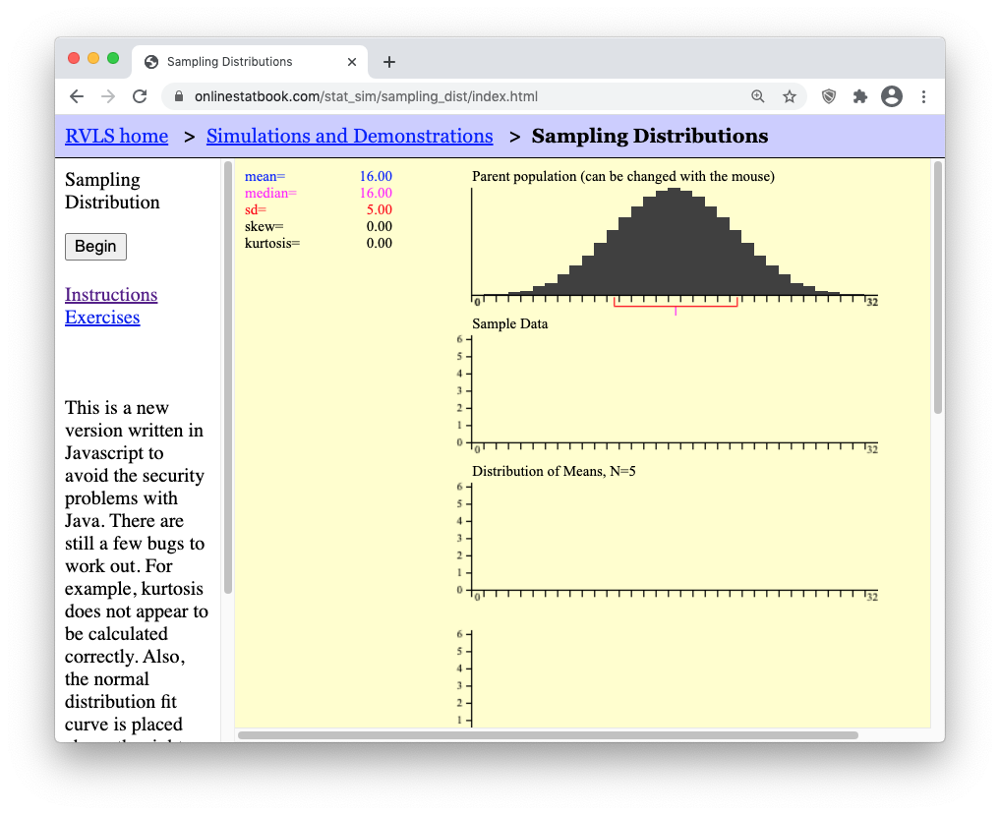
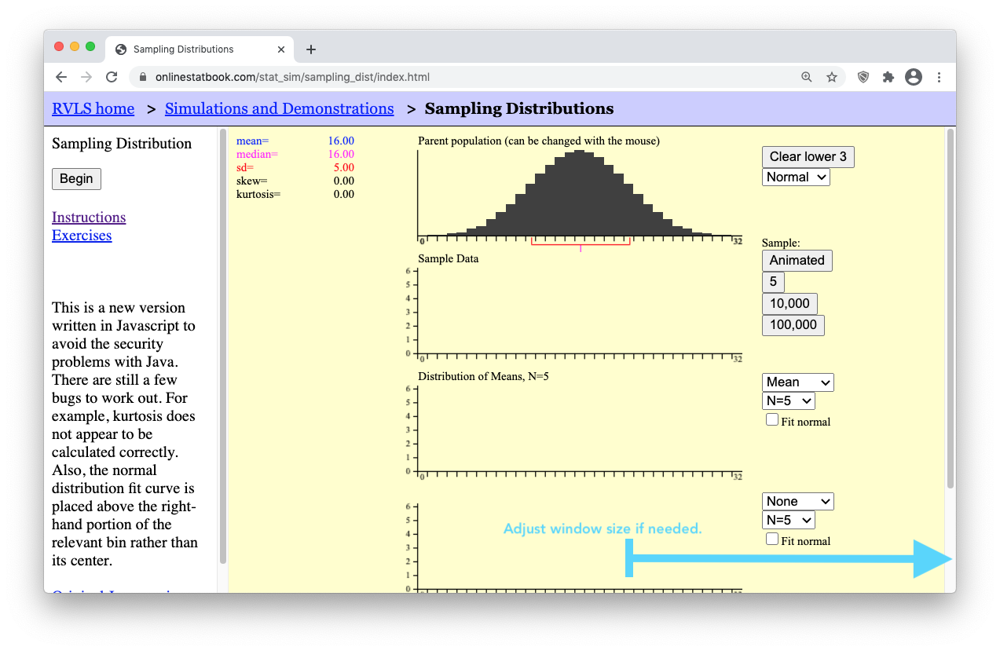
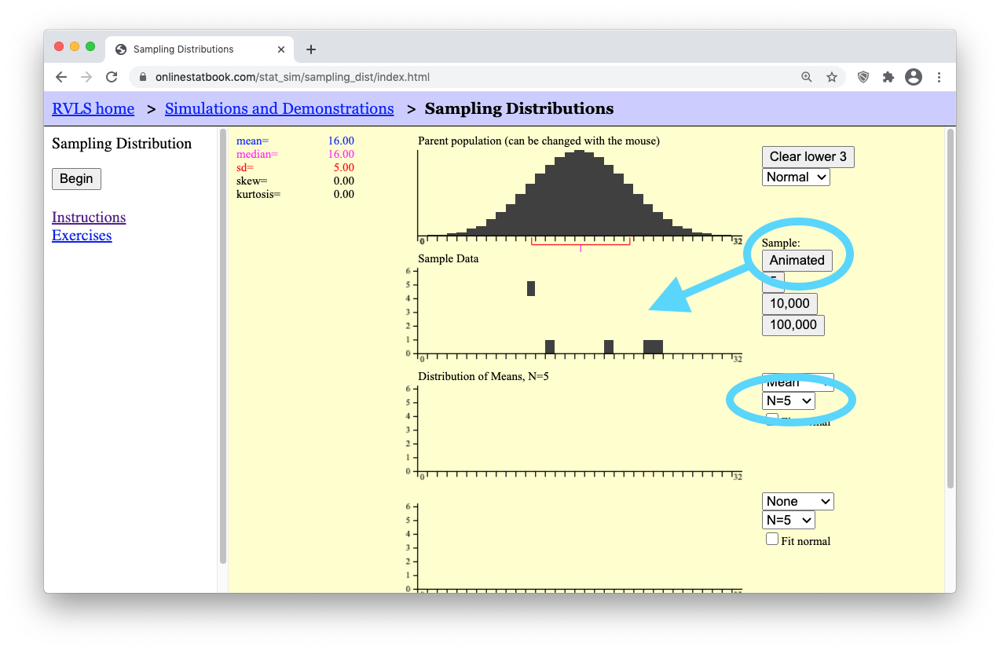
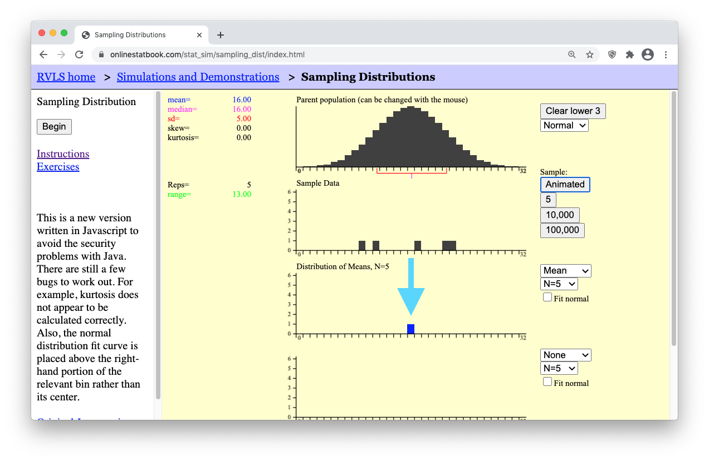
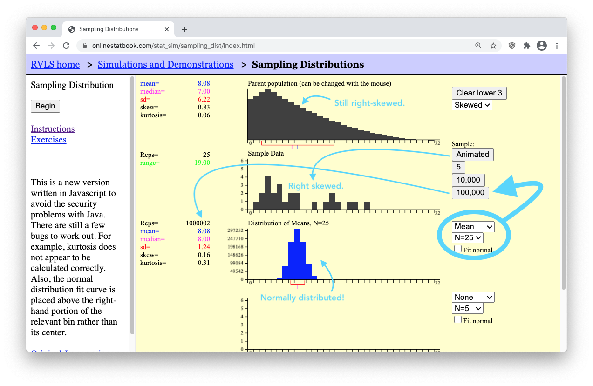

 

**Optional Lesson Video**

<iframe width="90%" align="right" src="https://www.youtube.com/embed/videoseries?list=PLaZryQtbPQC8iq1dEGYTJ7Fjt_osnDmJp" frameborder="1" allow="autoplay; encrypted-media" allowfullscreen></iframe>

 

## Lesson Outcomes

<a href="javascript:showhide('oc')">Show/Hide Outcomes</a>

By the end of this lesson, you should be able to:

*  Explain how a sampling distribution is created.
*  Determine the mean, standard deviation and shape of a distribution of sample means.
*  State and apply the Central Limit Theorem and the Law of Large Numbers.

 

 

## Introduction

This lesson introduces three important concepts of statistical theory:

1. The Sampling Distribution of the Sample Mean
2. The Central Limit Theorem
3. The Law of Large Numbers

In practice, a single sample of data is obtained from a population of interest in order to *make inference* about the entire population. However, even though only one sample is obtained, there are many, many random samples that are *possible* to obtain from a population. Understanding what *could happen* from a theoretical perspective is important in knowing how to use the single sample of data appropriately when making inference about a population. Let's look at an example.

## Case Study: DDT's Negative Impact on Pregnant Women

 

**Step 1: Design the Study**

Mosquitoes and other biting insects carry malaria.  In an attempt to curb the spread of malaria and save lives, the pesticide DDT was used for many years to control the insect population, even indoors.  Unfortunately, this pesticide does not break down quickly in nature and is very harmful to humans.  

A metabolite of DDT (called DDE) is also very dangerous.  A metabolite is the byproduct that occurs when our body breaks down a substance. When DDT is broken down in humans, DDE is one of the metabolites that remains from the original DDT.

Scientists have shown that DDT and its metabolites cause reproductive problems in humans and other animals.  When a pregnant woman has a contamination level as low as 10 mg/kg of DDE in her body, she is much more likely to give birth to an underweight baby or to deliver prematurely (Wells & Leonard, 2006).

A study of 45 pregnant women who have been exposed to DDT / DDE was conducted using a convenience sample (Bornman, MS. 2005).   Global Solutions Unlimited (GSU) will analyze the data from this study.  These data will be used to assess the prevalence of DDT in drinking water.
 

 

**Step 2: Collect Data**

After selecting specific women to be sampled, researchers measured the level of DDE contamination for each of these randomly selected women.

 

**Step 3: Describe the Data**

The researchers computed the mean and standard deviation of the observed levels of exposure for the 45 women.  They found the mean observed contamination level was 24.75 mg/kg, and the highest level of contamination was 419.91 mg/kg! (Bornman, MS. 2005)

 

**Step 4: Make Inferences**

The researchers only obtained one sample mean, $\bar x$.  They do not get to see any other data.  They only had enough time, funding, and other resources to survey the 45 women in their sample. An important question to ask at this point is whether or not the results of this sample show evidence that the mean DDE contamination in the full population of South American women was greater than 10 mg/kg. 

If the researchers had selected a different random sample of pregnant women, the mean contamination of the women in the sample would undoubtedly be different.  However, this did not happen.  The researchers do not get to see the contamination levels for any other women.  They only collected this one sample. 

This is how research is often conducted...repeated samples are not typically drawn, so we do not get to know what might have happened had we gathered data from a different sample. Were it not for statistical theory, the results from our single sample would essentially be worthless. But the good news is that statistical theory provides us with just the tools we need to be able to use our single sample in a meaningful way to make inference about the full population.
 

 

**Step 5: Take Action**

In this study, there was a lot of evidence that the mean DDE contamination in the pregnant women was greater than 10 mg/kg.  The probability of the DDE contamination in the women's bodies exceeding 10 mg/kg (if there were no contamination) is approximately 0.02. This probability is low enough that there is reason for concern. Statistically speaking, there is sufficient evidence to suggest that the levels of DDE contamination are too high among South African women.

 

## Introduction to Sampling Distributions

Now let's take a look behind the scenes to explore how statistical theory is used to create what is called a *sampling distribution of the sample mean.* This distribution becomes the key in making inference about a full population based on just the limited information in a single sample of data. To come to understand just what the phrase "sampling distribution of a sample mean" is describing, there are three items worth remembering.

* First, recall that a *distribution* is a graph (like a histogram) showing how data is spread out. In [Lesson 3](Lesson03.html) we considered three main types of distributions of data:

* Second, recall that the sample mean is denoted by the symbol $\bar{x}$. The mean is computed by adding up all of the values in the sample and dividing by the number of things in the sample. 

* Third, recall that the true mean of the full population is denoted by the symbol $\mu$ and that the standard deviation of the population is denoted by $\sigma$.

Now, with those reminders in place, you will need to **work through the following tutorial** to come to understand the idea of a "sampling distribution of a sample mean." 

### A Tutorial on Sampling Distributions

- **Step 1**:  Open [this applet](http://onlinestatbook.com/stat_sim/sampling_dist/index.html) and click on "Begin"    

- **Step 2**: Ensure your internet browser window is wide enough to show all of the applet controls.    

<table>
  <tr>
    <td style="color:red;">
     Internet browser window is too small. (Bad)
    </td>
    <td style="color:green;">
     Internet browser window large enough to see all controls. (Good)
    </td>
  </tr>
  <tr>
    <td>
      
    </td>
    <td>
      
    </td>
  </tr>
</table>

- **Step 3:** Press the "Animated" button on the right of the applet. It will drop down a single random sample of N=5 data points (i.e., black boxes) from the parent population. (Because the sample is random, your sample will possibly land in a different place than what is shown here.)

- **Step 4:** Notice that a little blue box dropped down from your "Sample Data" of N=5 black boxes (data points). This little blue box represents the mean, $\bar{x}$, of your single sample of N=5 boxes.

    

Now is where things get interesting. In real life, all we would use is the single sample of N=5 values and the sample mean, $\bar{x}$, to make inferece (make our guess) about the mean, $\mu$, of the full population. (The full population in this applet is shown in the top black graph.) However, the purpose of this applet is to allow us to explore how our answer would change if we used a different sample of N=5 data points. A different sample will result in a different sample mean $\bar{x}$. So the question is, what values are possible for the sample mean? Are some values of the sample mean more likely than others? 

- **Step 5:** **Click the Animated** button several more times. Each time, watch how a new random sample of N=5 data points is generated for the "Sample Data" graph, and then the mean of that sample is plotted in the bottom "Distribution of Means, N=5" graph. The following image shows the results after clicking the "Animated" button 10 times.

- **Step 6:** Now, let's get the number of sample means (blue boxes) up to a million! To save time, there are buttons below the "Animated" button labeled "5", "10,000", and "100,000". Clicking the "100,000" button 10 times will quickly get us up to one million sample means. Keep in mind that by doing this, you are essentially clicking the "Animated" button 1,000,000 times! (To actually click the "Animated" button one million times it would take you roughly 26 days of constantly clicking the "Animated" button over and over again!)    

Now study the arrows in the image below. As you do, you should notice that to the left of the "Distribution of Means, N=5" graph, the mean of the distribution of sample means (which is equal to 16) and standard deviation of the distribution of sample means (which is equal to 2.24) are given. Compare these values to the mean and standard deviation shown for the Parent Population graph.    

    

Hopefully you noticed that the "mean of the distribution of means" is equal to the "mean of the population." The mean of the means is the mean! Let's say that again. The *mean of all possible sample means is equal to the mean of the population.* In short, the mean of the means is the mean. As for the standard deviation though, notice that the "standard deviation of the sample means" is smaller than the "standard deviation of the population." It turns out that these two results hold true for any parent population and any sample size. There are two mathematical formulas that summarize these truths.

**The Mean of the Distribution of Sample Means**

$$
\underbrace{\mu_{\bar{x}}}_\text{The mean of the sample means} = \underbrace{\mu}_\text{The mean of the population}
$$

**The Standard Deviation of the Distribution of Sample Means**

$$
\underbrace{\sigma_{\bar{x}}}_\text{The st. dev. of the sample means} = \frac{\overbrace{\sigma}^\text{The st. dev. of the population}}{\underbrace{\sqrt{n}}_\text{sample size of each sample}}
$$

**The Shape of the Distribution of Sample Means**

Notice that the shape of the distribution of sample means is normal in the experiment we just performed in the above applet. This is an important result because (as you will see in [Lesson 7](Lesson07.html)) we will be able to use the Normal Probability Applet to make probability calculations about sample means whenever the distribution of sample means is normal. Unfortunately, there are some situations where the distribution of sample means is not normal. This ruins our ability to make inference about the parent population. Let's look at one such situation.

- **Step 7:** Press the [Clear Lower 3] button.  This will erase your data and reset the applet. Then, use the drop-down menu below the [Clear Lower 3] button to **change** the distribution from a **normal distribution** to a **skewed distribution**. The applet should now show a right-skewed distribution for the "Parent Population" data graph.

- **Step 8:** Change the sample size to a very small sample size by selecting "N=2". Then press the "Animated" button a few times to get a feel for what a sample of N=2 data points looks like from this right-skewed population. 

- **Step 9:** Then, get a million such samples by clicking the "100,000" button ten times. You should get something similar to what is shown below. (Notice that the mean of the "Distribution of Means" is still equal to the mean of the "Parent population." Also note that the standard deviation of the "Distribution of Means" is equal to $6.22/\sqrt(2) = 4.40$, which is $\sigma/\sqrt(n)$, as shown by our formula stated previously for the "Standard deviation of the Sample Means.")    

    

However, when it comes to the shape of the distribution of means, you should notice that the blue graph showing the "Distribution of Means, N=2" is not normally distributed. Like the distribution of the "Parent population" it is also right-skewed. This is problematic when it comes to trying to perform statistical analysis on a small sample (like N=2) from a population of skewed data because we can't use the normal probability applet for things that are skewed. But there is a beautiful promise in statistical theory called the **Central Limit Theorem** that solves this problem. All we need is a larger sample size and the skewed distribution of means will magically "go away." We will state this result formally in a moment. For now, see it happen yourself by doing the following.

- **Step 10:** Change the sample size from "N=2" (a small sample) to "N=25" (a much larger sample). Then, click the "Animated" button a few times to get a feel for what is happening. Finally, click the "100,000" button ten times to get a million sample means from a million different samples of "N=25" data points in each sample. Look at how beautifully normal the distribution of sample means (the blue graph) is becoming! The "Parent population" data is still skewed. Even the "Sample Data" is still skewed. But the "Distribution of Means" is becoming normal! This is the **Central Limit Theorem** in action.

 

### What is the Distribution of Sample Means?

The sampling distribution of the sample mean is the set of all possible values of $\bar x$ that could occur.  You have seen several examples of sampling distributions as you have plotted many means in the simulations and observed the approximately normal distribution that occurs.  In the real world, you only observe *your* sample mean.  You do not get to view the distribution.  However, the fact that you sample randomly means that you could easily have drawn a different sample and had a different sample mean, $\bar x$.  There are *many* possible sample means!

 

## The Central Limit Theorem

**The Central Limit Theorem** states that the sampling distribution of the sample mean will be *approximately normal* if the sample size $n$ of a sample is sufficiently large.

In the study of DDE levels in the South African women, we never saw the distribution of sample means.  We only observed one sample mean, $\bar x$.  Even though we do not get to see the distribution of all possible sample means, since the sample size ($n = 45$) was large, we can be assured that the sample mean $\bar x$ can be considered as one drawn from a normally distributed population of possible sample means. This allows us to make powerful statistical inference about the data as you will learn in [Lesson 7](Lesson07.html).

You have observed in the simulations that if the sample size is large, the random variable $\bar x$ will be approximately normally distributed.  In other words, the sampling distribution of the sample mean will be approximately normal if the sample size is sufficiently large.  This important result is called the **Central Limit Theorem**.  This is arguably the most important concept in all of Statistics.

The Central Limit Theorem works for every population where the standard deviation is defined (is not infinite).  In other words, it will work for any distribution you find in the real world.

 

### When is $\bar x$ Normal?

How many observations are required so that the Central Limit Theorem will assure that the distribution of sample means will be approximately normal?  The answer is, "it depends."

- If the parent population is normal, then the sampling distribution of $\bar x$ will always be normally distributed, no matter how many observations are selected.
- If the parent population is not normal, then the sampling distribution $\bar x$ will be approximately normally distributed, if the sample size is large enough.
  + If the parent population is almost normal (e.g. mound-shaped and nearly symmetrical), then a sample of size n = 5 will probably be sufficient to assure that $\bar x$ will be approximately normally distributed.
  + If the parent population is heavily skewed, then it will require a larger sample size to be assured that $\bar x$ will be normally distributed. For most moderately skewed distributions, a sample size of around 30 is traditionally thought to be sufficiently large to assure that $\bar x$ will be approximately normally distributed.  This is not a definitive number but is a rule of thumb.
  + For tremendously skewed distributions (e.g., the distribution of lottery payouts), a much larger sample will be required before the distribution of sample means is approximately normal. This may require billions of observations. Simulation can be used to determine if a particular sample size is sufficient. For this course, if the sample size is at least 30, we will conclude that the sampling distribution of $\bar x$ will be approximately normal.

Answer the following question:

1. There are two ways that $\bar x$ can be (approximately) normally distributed.  What are they?  

<a href="javascript:showhide('Q1')">Show/Hide Solution</a>

- $\bar x$ will be normally distributed if the data were drawn from a normal population.
- $\bar x$ will be approximately normally distributed if the sample size is sufficiently large.

&nbsp;

 

## Mean and Standard Deviation of the Distribution of Sample Means

The following facts are always true.  They do not depend on the Central Limit Theorem.  They do not depend on the sample size.  These facts hold for the sample mean $\bar x$ of any simple random sample of size $n$ drawn from a population with mean $\mu$ and standard deviation $\sigma$.

- The mean of the sample means is $\mu$
- The standard deviation of the sample means is $\sigma / \sqrt{n}$

Remember, these facts are always true.  They do not depend on normality or the sample size.  So, even though these facts are often used in conjunction with the Central Limit Theorem, they do not depend on it.

Think about the simulations you have observed.  The mean of the sample means was always aligned with $\mu$.  Also, if you took samples larger than $n = 1$, the standard deviation of sample means was always smaller than $\sigma$.

Answer the following questions:

2. The amount of time passengers spend waiting for a bus on a particular urban route follows a distribution that has a mean of 8.7 minutes with a standard deviation of 2.2 minutes.  Transportation officials observed the waiting times for a random sample of $n=121$ individual passengers and recorded the sample mean, $\bar x$.  We can think of this sample mean as one value observed out of all the possible sample means that could have been observed.  What is the mean of the distribution of all possible sample means?  

<a href="javascript:showhide('Q2')">Show/Hide Solution</a>

$$
\mu = 8.7~\text{minutes} 
$$

 

3. Use the information in the previous problem to answer this question: What is the standard deviation of the distribution of all possible sample means?

<a href="javascript:showhide('Q3')">Show/Hide Solution</a>

$$
\frac{\sigma}{\sqrt{n}} = \frac{2.2}{\sqrt{121}} = 0.2~\text{minutes} 
$$

&nbsp;

 

## The Law of Large Numbers

**The Law of Large Numbers** states that the spread of the sampling distribution of the sample mean will *get smaller* as the sample size $n$ gets larger. In other words, $\bar{x}$ will become closer to $\mu$ as the sample size $n$ becomes larger.

Answer the following questions:

4. We just learned that the standard deviation of sample means is $\displaystyle{ \sigma \over \sqrt{n} }$. What happens to the standard deviation of sample means when the sample size is increased? 

<a href="javascript:showhide('Q4')">Show/Hide Solution</a>

* If the sample size, $n$, is increased, then the standard deviation of the sample mean will decrease. The fraction will get smaller.

 

5. If the standard deviation of the sample mean gets smaller, what happens to the values of $\bar x$?

<a href="javascript:showhide('Q5')">Show/Hide Solution</a>

* The values that will be observed will be very close to each other and therefore close to $\mu$, if the sample size is large.

&nbsp;

 

The result you have discovered in the previous two questions is called the Law of Large Numbers.  The Law of Large Numbers states that if the sample size is large, then the sample mean will typically be close to the population mean, $\mu$.  This happens because the standard deviation $\sigma / \sqrt{n}$ will get smaller.  

Notice that this is very different from the Central Limit Theorem.  The Central Limit Theorem states that if the sample size is large that $\bar x$ will be approximately normal.  The Law of Large numbers states that the sample mean $\bar x$ will be close to $\mu$.

Take a moment to study the difference between the Central Limit Theorem and the Law of Large Numbers. They are very different, but students tend to confuse them.

 

## Review of Key Concepts

In order to "do statistics" we need to compute probabilities. This requires we know the distribution of the population of interest. The most important distributions in this course are the normal distributions, which were introduced in [Lesson 5](Lesson05.html). In this lesson, we are interested in another very important distribution: the distribution of all the sample means, $\bar{x}$. In order to do statistics with $\bar{x}$ we need the sampling distribution of $\bar{x}$ to be normal. There are two situations when the distribution of $\bar{x}$ is guaranteed to be normal (or at least very close to normal). They are: 

- If the parent population is normal, the distribution of the sample means $\bar{x}$ will be normal, for every sample size $n$.
- Even if the parent population is not normal, the Central Limit Theorem guarantees that the distribution of the sample mean $\bar{x}$ will be approximately normal if the sample size $n$ is large enough. **For this course, if** $n \geq 30$, **we will say the distribution of the sample means will be approximately normal** (even if the parent population is not normal).

The mean and standard deviation of $\bar{x}$ are:

- The mean $\mu_{\bar{x}}$ of the sample means is the population mean $\mu$.
- The standard deviation $\sigma_{\bar{x}}$ of the sample means is the population standard deviation $\sigma$ divided by the square root of $n$, $\sigma / \sqrt{n}$

 

## Summary

Remember...

- The **distribution of sample means** is a distribution of all possible sample means ($\bar x$) for a particular sample size. 

- The **mean** of the distribution of sample means is the mean $\mu$ of the population: $\mu_{\bar{x}} = \mu$.

- The **standard deviation** of the distribution of sample means is the standard deviation $\sigma$ of the population divided by the square root of $n$: $\sigma_{\bar{x}} = \sigma/\sqrt{n}$.

- The distribution of sample means is **normal** in either of two situations: (1) when the data is normally distributed **or** (2) when, thanks to the **Central Limit Theorem (CLT)**, our sample size ($n$) is large. 

- The **Law of Large Numbers** states that as the sample size ($n$) gets larger, the sample mean ($\bar x$) will get closer to the population mean ($\mu$). This can be seen in the equation for $\sigma_{\bar{x}} = \sigma/\sqrt{n}$. Notice as $n$ increases, then $\sigma_\bar{x}$ will get smaller.

 

## Navigation

| **Previous Reading** | **This Reading** | **Next Reading** |
| :------------------: | :--------------: | :--------------: |
| [Lesson 5:   Normal Distributions](Lesson05.html) | Lesson 06:   Distribution of Sample Means & The Central Limit Theorem | [Lesson 7:   Probability Calculations involving a Mean Response](Lesson07.html) |

