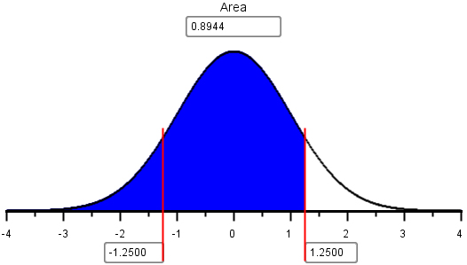
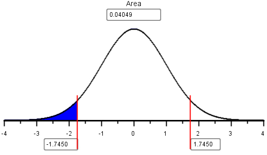
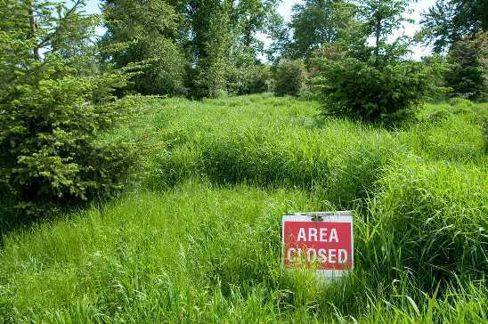
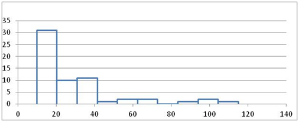

 

**Optional Lesson Video**

<iframe width="90%" align="right" src="https://www.youtube.com/embed/videoseries?list=PLaZryQtbPQC9Vm2oOb7MbspQvlvrkQba1" frameborder="1" allow="autoplay; encrypted-media" allowfullscreen></iframe>

 

## Lesson Outcomes

<a href="javascript:showhide('oc')">Show/Hide Outcomes</a>

By the end of this lesson, you should be able to:

*  Calculate probabilities using a distribution of sample means.

 

## Review of Sampling Distributions

When is the sample mean normally distributed (or approximately normally distributed)?  This happens when either of the two conditions are satisfied:

- The parent population is normally distributed, so the sample mean is automatically normally distributed.
- The sample size is large, and the Central Limit Theorem implies that the sample mean is normally distributed.

For the mean of draws from a random variable with mean $\mu$ and standard deviation $\sigma$, the following are true:

- The mean of the random variable  $\bar X$ is $\mu$.
- The standard deviation of the random variable $\bar X$ is $\displaystyle{\frac{\sigma}{\sqrt{n}}}$.

Previously, you learned how to use the normal probability applet to convert a $z$-score to a corresponding area under the curve.  These skills will be applied again in this activity.  The following questions will help you brush up on how to use the applet.

 

Answer the following questions:

1. Look at the output from the applet, given above. What is the probability that a standard normal random variable will be below 1.25?

<a href="javascript:showhide('Q1')">Show/Hide Solution</a>

$0.8944$

 

2. Look at the output from the applet, given above.  What is the probability that a standard normal random variable will be above 1.25?

<a href="javascript:showhide('Q2')">Show/Hide Solution</a>

$1 - 0.8944 = 0.1056$

 

3. Challenge problem:  Use the output from the applet above to determine the probability that a standard normal random variable will be between -1.25 and 1.25.

<a href="javascript:showhide('Q3')">Show/Hide Solution</a>

* Since the probability in the right tail above 1.25 is 0.106, the probability in the left tail is also 0.106.  So, the probability in the middle, between -1.25 and 1.25 must be $1 – 2(0.106) = 1 – 0.212 = 0.788$.

 

4. Use the normal probability applet to find the probability that a standard normal random variable will be greater than -0.75.

<a href="javascript:showhide('Q4')">Show/Hide Solution</a>

* Using the normal probability applet, we find that the area to the right of $z$ = -0.75 is $0.773$.

 

5. If the mean of a normally distributed random variable is -23 and the standard deviation is 7, what is the probability that the random variable will have a value that is less than -25?

<a href="javascript:showhide('Q5')">Show/Hide Solution</a>

* The $z$-score is:
 

$\displaystyle{z = \frac{-25 - (-23)}{7} = -0.2857}$

 
* Using the normal probability applet, we find that the area to the left of $z$ = -0.2857 is $0.3874$.

&nbsp;

 

## Probabilities Involving a Mean

If the sample mean is normally distributed, then we can consider the sample mean, $\bar x$, as one observation from a normal distribution with mean $\mu$ and standard deviation $\displaystyle{\frac{\sigma}{\sqrt{n}}}$. With this in mind, we can compute the $z$-score for any value of this random variable:

$$z = \frac{\text{value} - \text{mean}}{\text{standard deviation}}=\frac{\bar x-\mu}{\sigma / \sqrt{n} }$$

Notice that we just replaced the "value" with the normal random variable, the "mean" with its mean and "standard deviation" with its standard deviation.

The $z$-score follows a standard normal distribution. That is, it has a mean of 0 and a standard deviation of 1.  After we compute the $z$-score, we can use the applet to find the probability that a randomly selected mean will be above or below a given value of $\bar x$.

**Worked Example:  Finding the Area under a Normal Curve (Based on a Sample Mean)**

After finding the $z$-score, we can use the normal probability applet to find the area under the curve (i.e. the probability.)  Suppose that a sample of size $n = 4$ has been drawn from a normal population with mean $\mu = 7$ and standard deviation $\sigma = 3$. Since the parent population is normal, we know the sampling distribution of the sample mean $\bar x$ will be normal with mean $\mu = 7$ and standard deviation $\displaystyle{ \frac{\sigma}{\sqrt{n}} = \frac{3}{\sqrt{4}} = 1.5}$. We can use this information to find the probability that $\bar x$ will be greater than 10.

The $z$-score is

$$z=\frac{\bar x-\mu}{\sigma / \sqrt{n} } = \frac{10 - 7}{3 / \sqrt{4} }=2.0$$

The probability that $z$ will be greater than $2.00$ is the area under the standard normal distribution to the right of $2.00$.  We find this area using the normal probability applet.

The area to the right of $z = 2.00$ is $0.02275$.  This is the probability that the random sample of $n = 4$ items will have a mean that is greater than $10$.

In this example, the sample mean was automatically normally distributed because the parent population was normally distributed.  This will always be true, no matter what size sample is drawn.

**Worked Example:  Finding the Area under a Normal Curve (Based on a Sample Mean)**

What do we do if the parent population is not normally distributed?  If the sample size is large, then the Central Limit Theorem guarantees that the sample mean will be approximately normally distributed.  Based on this, we can still do normal probability calculations for the mean of a random sample.

The distribution of the weekly costs incurred by Global Solutions Unlimited is right skewed.  The population mean of the costs is \$26,400 and the standard deviation is \$23,200.  A random sample of $n = 40$ weeks is to be selected, what is the probability that the mean weekly costs will be less than \$20,000?

Since the number of observations  is large, the Central Limit Theorem assures that the sample mean will follow a normal distribution.  The $z$-score for $\bar x =$ \$20,000 is:

$$z = \frac{\bar x-\mu}{\sigma / \sqrt{n} } = \frac{20,000-26,400}{23,200 / \sqrt{40}} = -1.745 $$

Using the normal probability applet, we can find the area to the left of this $z$-score:

The area to the left of $z= -1.745$ is $0.04049$.  This is the probability that the mean costs for the $n = 40$ weeks will be less than \$20,000.

 

#### Example: Environmental Clean Up

<!-- This picture comes from http://happeningstock.deviantart.com/art/Grass-Hill-Area-Closed-Sign-255592183 and has an open license -->

We will now consider a complete example that shows how these probabilities are used in practice.

The United States Government decided to open some land near a uranium enrichment facility to public use.  After a few years of the public hiking, biking, and sometimes even hunting on this land, workers from the facility noticed that there were several unnatural-looking mounds in the earth near the area. Because this land was once used by the facility and nobody knew the origin of these piles, the government closed public access to the land until they could assess if the mounds were safe.

 

**Step 1: Design the study.**

Measurements were taken from the mounds to assess one of the contaminants, lead.  The tests involved are very expensive.  Each sample costs about \$600 to process.
The Environmental Protection Agency (EPA) has set a "No Action Level" (NAL) for lead. If the mean concentration in the soil of the contaminant is less than the NAL, then the area can be declared safe for public use.  If the concentration of the contaminant reaches or exceeds the NAL, the site must be cleaned additionally before it is declared safe.  The NAL for lead is 50 milligrams of lead per kilogram of soil (mg/kg).

The hypothesis for this test are:

$H_0:~~\mu = 50 \frac{\text{mg}}{\text{kg}}$

$H_a:~~\mu < 50 \frac{\text{mg}}{\text{kg}}$

In environmental testing, we always assume the site is dirty.  That is, our null hypothesis is that the mean level of contamination is at the NAL.  We gather data to determine if there is sufficient evidence to support rejecting the null hypothesis.

 

**Step 2: Collect Data**

Scientists collected $n = 61$ measurements of the lead concentration in the soil, measured in mg/kg.  The data are given in the file [Uranium Plant Data-Lead](http://statistics.byuimath.com/index.php?title=Data){target="_blank}.

 

**Step 3: Describe the Data**

Answer the following question:

6. Create a histogram of the lead contamination data.

<a href="javascript:showhide('Q6')">Show/Hide Solution</a>

 

7. What is the shape of the distribution of the data?

<a href="javascript:showhide('Q7')">Show/Hide Solution</a>

* The lead concentration data are right skewed.

 

8. Are any of the measured values above the NAL (50 mg/kg)?  What might this suggest?

<a href="javascript:showhide('Q8')">Show/Hide Solution</a>

* Yes, there are several observations that are above the NAL.  This may suggest that the lead concentrations are very high in some isolated soil samples.  It may also be an indication of variability in the test results.

 

9. Visually, does it look like the mean lead concentration is less than 50 mg/kg?

<a href="javascript:showhide('Q9')">Show/Hide Solution</a>

* Answers may vary.

 

10. What is the value of the sample mean?

<a href="javascript:showhide('Q10')">Show/Hide Solution</a>

* The sample mean is 29.13 mg/kg.

&nbsp;

 

**Step 4: Make Inferences**

We assume the null hypothesis is true and we gather evidence against this requirement.  We will find the probability that the mean lead concentration is less than $\bar x$ = 29.13 mg/kg, assuming that the true mean lead concentration is $\mu$ = 50 mg/kg.  This probability is called the $P$-value.

Since the sample size is large ($n = 61$), we can conclude that the sample mean is normally distributed.  So, we can use the normal probability applet to find the probability that the sample mean will be less than 29.13.  Historical analyses show that the population standard deviation is $\sigma$ = 24 mg/kg.

First, we compute the $z$-score.

$$z=\frac{\bar x-\mu}{\sigma / \sqrt{n} } = \frac{29.13 - 50}{24 / \sqrt{61} }=-6.79$$

Using the applet, we find the area to the left of $z = -6.79$.  This is the $P$-value.  It is not clear from the image of the applet, but the area to the left was shaded before the $z$-score was entered.

The $P$-value for this test is $5.6 \times 10^{-12} = 0.000~000~000~005~6$.  This is a very small probability.  Assuming the null hypothesis is true-that is, the site is unacceptably contaminated-it is very unlikely that we would find such a low mean contamination level among the $n = 61$ randomly selected soil samples.

Since the $P$-value is low, we reject the null hypothesis.

 

**Step 5: Take Action**

There is sufficient evidence to suggest that the mean lead level is less than 50 mg/kg.  We conclude that the lead concentration in the soil is low enough that it is not a danger to the public.  Based on the results of this and other similar test results, the government has reopened public access to this area.

 

## Review of Key Concepts

1. To compute probabilities involving the sample mean $\bar{x}$ we must first determine if $\bar{x}$ is normally distributed. If it is not, we cannot compute probabilities. There are two cases when $\bar{x}$ is guaranteed to be normally distributed. They are:

* The parent population is Normally distributed.

* The Central Limit Theorem guarantees the distribution of $\bar{x}$ is Normal if the sample size $n$ is large enough. For this course, we require $n \geq 30$.

2. The collection of all possible sample means $\bar{x}$ is also a population. The mean of the distribution of sample means is the population mean $\mu$. The standard deviation of the distribution of sample means is $\frac{\sigma}{\sqrt{n}}$, where $\sigma$ is the parent population  standard deviation and $n$ is the sample size.

3. Once we have determined that the sample mean is Normally distributed, we can compute probabilities with $\bar{x}$. We first compute $z = \frac{\bar{x} - \mu}{\sigma/\sqrt{n}}$ and then use the Normal Probability Applet to compute probabilities about $z$.

 

## Summary

Remember...

- When the distribution of sample means is normally distributed, we can use **z-scores** and the **probability applet** to calculate proportions and probabilities. A z-score is calculated as: $\displaystyle{z = \frac{\text{value}-\text{mean}}{\text{standard deviation}} = \frac{\bar x-\mu}{\sigma/\sqrt{n}}}$

- The **$P$-value** is the probability of getting a test statistic at least as extreme as the one you got, assuming $H_0$ is true. A $P$-value is calculated by finding the area under the normal distribution curve that is more extreme (farther away from the mean) than the z-score.

 

## Navigation

| **Previous Reading** | **This Reading** | **Next Reading** |
| :------------------: | :--------------: | :--------------: |
| [Lesson 6:   Distribution of Sample Means & The Central Limit Theorem](Lesson06.html) | Lesson 07:   Probability Calculations involving a Mean Response | [Lesson 8:   Review for Exam 1](Lesson08.html) |

