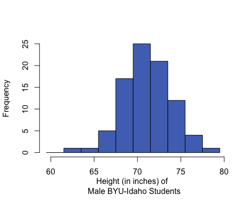

<script type="text/javascript">
 function showhide(id) {
    var e = document.getElementById(id);
    e.style.display = (e.style.display == 'block') ? 'none' : 'block';
 }
</script>

Unit 1 introduced you to some foundational ideas in statistical theory. A firm grasp of these concepts will allow you to connect deeply with the statistical tools that you will be presented with in Units 2, 3, and 4. Use this page to review the Lesson Outcomes and Summaries in preparation for the Unit 1 Exam. If there are any lesson outcomes that you are not confident with, return to that lesson and review those outcomes in detail.


<br>

## Lesson 1 {.tabset .tabset-pills}

### Outcomes

1. Explain the course policies
2. Access course resources (course outline, lesson schedule, preparation activities, reading quizzes, homework assignments, assessments, etc.)
3. Communicate with the instructor and group members
4. Access statistical analysis software tools for class quizzes, assignments, and exams
5. Apply principles of the gospel of Jesus Christ in this class
6. Apply the three rules of probability for different probability scenarios

### Summary

<div class="RecapHeading">Lesson 1 Summary</div>
<div class="Summary">

1. In this class you will use the online textbook that has been written for you by your statistics teachers. All of the assignments and quizzes, available in I-Learn, will be based on the readings, so study it well. Most weeks will cover two lessons.
2. You have successfully located the online textbook. Ensure you have also located the course in I-Learn and can access the quizzes and assignments that are there. 
3. Ensure you have located the contact information for your instructor in the I-Learn course. Recording the contact information of peers from class would also be a wise idea.
4. This course uses MS Excel for all statistical analysis. Check that you have access to the software on your computer. If not, see I-Learn for details on how to obtain it through the University for free.
5. By doing the work, staying on schedule, and living the Honor Code you *will* succeed in this class.
6. The three **rules of probability** are:
    1. A probability is a number between 0 and 1. 
$$0 \leq P(X) \leq 1$$
    2. If you list all the outcomes of a probability experiment (such as rolling a die) the probability that one of these outcomes will occur is 1. In other words, the sum of the probabilities in any probability is 1. 
$$\sum P(X) = 1$$
    3. The probability that an outcome will not occur is 1 minus the probability that it will occur. 
$$P(\text{not}~X) = 1 - P(X)$$

</div>
<br>


## Lesson 2 {.tabset .tabset-pills}

### Outcomes

1. Describe the five steps of the Statistical Process
2. Distinguish between an observational study and an experiment
3. Differentiate between a population and a sample
4. Describe each of the following sampling schemes:
    a. Simple random sampling
    b. Stratified sampling
    c. Systematic sampling
    d. Cluster sampling
    e. Convenience sampling
5. Explain the importance of using random sampling
6. Distinguish between a quantitative and a categorical variable

### Summary

<div class="RecapHeading">Lesson 2 Summary</div>
<div class="Summary">

1. The **Statistical Process** has five steps: **D**esign the study, **C**ollect the data, **D**escribe the data, **M**ake inference, **T**ake action. These can be remembered by the pneumonic "**D**aniel **C**an **D**iscern **M**ore **T**ruth."

2. In a **designed experiment**, researchers control the conditions of the study, typically with a treatment group and a control group, and then observe how the treatments impact the subjects. In a purely **observational study**, researchers don't control the conditions but only observe what happens.

3. The **population** is the entire group of all possible subjects that could be included in the study. The **sample** is the subset of the population that is actually selected to participate in the study. Statistics use information from the sample to make claims about what is true about the entire population.

4. There are many sampling methods used to obtain a **sample** from a **population**. The best methods use some sort of randomness (like pulling names out of a hat, rolling dice, flipping coins, or using a computer generated list of random numbers) to avoid bias. 
  a. A **simple random sample (SRS)** is a random sample taken from the full list of the population. This is the least biased (best) sampling method, but can only be implemented when a full list of the population is accessible.
  b. A **stratified sample** divides the population into similar groups and then takes an **SRS** from each group. The main reason to use this sampling method is when a study wants to compare and contrast certain groups within the population, say to compare freshman, sophomores, juniors, and seniors at a university.
  c. A **systematic sample** samples every ***k***<sup>th</sup> item in the population, beginning at a random starting point. This is best applied when subjects are lined up in some way, like at a fast food restaurant, an airport security line, or an assembly line in a factory.
  d. A **cluster sample** consists of taking all items in one or more randomly selected clusters, or blocks. For example, ecologists could draw grids on a map of a forest to create small sampling regions and then sample all trees they find in a few randomly selected regions. Note that this differs from a stratified sample in that only a few sub-groups (clusters) are selected and that all subjects within the selected clusters are included in the study.
  e. A **convenience sample** involves selecting items that are relatively easy to obtain and *does not use random selection* to choose the sample. This method of sampling can be assumed to *always bring bias* into the sample.

5. The best way to avoid bias when trying to make conclusions about a population from a single sample of that population is to use a random sampling method to obtain the sample. 

6. **Quantitative variables** represent things that are numeric in nature, such as the value of a car or the number of students in a classroom. **Categorical variables** represent non-numerical data that can only be considered as labels, such as colors or brands of shoes.

</div>
<br>


## Lesson 3 {.tabset .tabset-pills}

### Outcomes

1. Create a histogram from data
2. Interpret data presented in a histogram
3. Identify left-skewed, right-skewed, and symmetric distributions from histograms
4. Calculate the mean, median, and mode for quantitative data using software
5. Compare the centers of distributions using graphical and numerical summaries
6. Describe the effects that skewness or outliers have on the relationship between the mean and median
7. Distinguish between a parameter and a statistic 

### Summary

<div class="RecapHeading">Lesson 3 Summary</div>
<div class="Summary">


1. Histograms are created by dividing the number line into several equal parts, starting at or below the minimum value occurring in the data and ending at or above the maximum value in the data. The number of data points occurring in each interval (called a bin) are counted. A bar is then drawn for each bin so that the height of the bar shows the number of data points contained in that bin.

2. A **histogram** allows us to visually interpret data to quickly recognize which values are most common and which values are least common in the data.

3. Histograms can be **left-skewed** (the majority of the data is on the right of the histogram, less common values stretch to the left side), **right-skewed** (majority of the data is on the left side with less common values stretching to the right), or **symmetrical and bell-shaped** (most data is in the middle with less common values stretching out to either side). 

4. The **mean**, **median**, and **mode** are measures of the center of a distribution. The mean is the most common measure of center and is computed by adding up the observed data and dividing by the number of observations in the data set. The median represents the 50th percentile in the data. The mean can be calculated in Excel using `=AVERAGE(...)`, the median by using `=MEDIAN(...)`, and the mode by `=MODE(...)` where the `...` in each case consists of the cell references that highlight the data.

5. When comparing the centers of distributions using graphical and numerical summaries, the direction of the skew showing in the histogram will generally correspond with the mean being pulled in that direction.

<table id="fancytable">
<tr>
  <th>
    Right-skewed
  </th><th>
    Symmetric & Bell-shaped
  </th><th>
    Left-skewed
  </th>
</tr><tr>
  <td>
    
  </td><td>
    
  <td>
    
  </td>
</tr><tr>
  <td>
    Mean: \$10.45
    
    Median: \$9.04
    
    Mean is to the right of the median.
  </td><td>
    Mean: 71.1 inches
    
    Median: 71 inches
    
    Mean and median are roughly equal.
  </td><td>
    Mean: 3.42
    
    Median: 3.45
    
    Mean is to the left of the median.
  </td>
</tr>
</table>

<br/>

6. In a symmetrical and bell-shaped distribution of data, the mean, median, and mode are all roughly the same in value. However, in a skewed distribution, the mean is strongly influenced by outliers and tends to be pulled in the direction of the skew. In a left-skewed distribution, the mean will tend to be to the left of the median. In a right-skewed distribution, the mean will tend to be to the right of the median.

7. A **parameter** is a true (but usually unknown) number that describes a population. A **statistic** is an estimate of a parameter obtained from a sample of the population. 

</div>
<br>


## Lesson 4 {.tabset .tabset-pills}

### Outcomes

1. Calculate a percentile from data
2. Interpret a percentile
3. Calculate the standard deviation from data
4. Interpret the standard deviation
5. Calculate the five-number summary using software
6. Interpret the five-number summary
7. Create a box plot using software
8. Determine the five-number summary visually from a box plot

### Summary

<div class="RecapHeading">Lesson 4 Summary</div>
<div class="Summary">

1. A **percentile** is calculated in Excel using `=PERCENTILE(..., 0.#)` where the `0.#` is the percentile written as a decimal number. So the 20th percentile would be written as 0.2.

2. A **percentile** is a number such that a specified percentage of the data are at or below this number. For example, if say 80% of college students were shorter than (or equal to) 70 inches tall in height, then the 80th percentile of heights of college students would be 70 inches.

3. **Standard deviation** is calculated in Excel for a sample of data using `=STDEV.S(...)`.

4. The **standard deviation** is a number that describes how spread out the data typically are from the mean of that data. A larger standard deviation means the data are more spread out from their mean than data with a smaller standard deviation. The standard deviation is never negative. A standard deviation of zero implies all values in the data set are exactly the same.

5. To compute any of the **five-number summary** values in Excel, use the Excel function `=QUARTILE.INC(..., #)` where `#` is either a 0 (gives the minimum), 1 (gives the first quartile), 2 (gives the second quartile, i.e., median), 3 (gives the third quartile), or 4 (gives the maximum).

6. The **five-number summary** consists of (1) the minimum value in the data, (2) the first quartile (25th percentile) of the data, (3) the median of the data (50th percentile), (4) the third quartile (75th percentile) of the data, and (5) the maximum value occurring in the data.

7. To create a **boxplot** in Excel, highlight the data, go to *Insert* on the menu ribbon, choose the *histogram icon*, select the *Boxplot* option from the menu that appears.

8. **Boxplots** are a visualization of the five-number summary of a data set.

<div style="padding-left:30px;">

```{r, fig.height=1.5, echo=FALSE, fig.width=5}
par(mai=c(0,0,0,0))
boxplot(cars$dist, horizontal=TRUE, xaxt='n', xlim=c(.3,1.5))
values <- summary(cars$dist)
text(values[1], 0.75, "Min", cex=0.8)
text(values[2], 0.7, "First \n Quartile", cex=0.8, pos=1)
lines(c(values[2],values[2]), c(0.72,.77))
text(values[3], 1.5, "Median", pos=1, cex=0.8)
lines(c(values[3],values[3]), c(1.3,1.22))
text(values[5], 0.7, "Third \n Quartile", cex=0.8, pos=1)
lines(c(values[5],values[5]), c(0.72,.77))
text(values[6], 0.75, "Max", cex=0.8)
```

</div>

</div>
<br>


## Lesson 5 {.tabset .tabset-pills}

### Outcomes

1. State the properties of a normal distribution
2. Calculate the z-score for an individual observation, given the population mean and standard deviation
3. Interpret a z-score
4. Use the normal distribution to calculate probabilities for one observation
5. Approximate probabilities from a normal distribution using the 68-95-99.7 rule 
6. Calculate a percentile using the normal distribution

### Summary

<div class="RecapHeading">Lesson 5 Summary</div>
<div class="Summary">

1. A **normal density curve** is symmetric and bell-shaped with a mean of $\mu$ and a standard deviation of $\sigma$. The curve lies above the horizontal axis and the total area under the curve is equal to 1. A **standard normal distribution** has a mean of 0 and a standard deviation of 1. 

2. A **z-score** is calculated as: $\displaystyle{z = \frac{\text{value}-\text{mean}}{\text{standard deviation}} = \frac{x-\mu}{\sigma}}$

3. A **z-score** tells us how many standard deviations above ($+Z$) or below ($-Z$) the mean ($\mu$) a given value ($x$) is.

4. To calculate probabilities for an observation $x$, calculate the $z$-score using $\mu$, $\sigma$, and $x$ and then use the [Normal Probability Applet](https://byuimath.com/apps/normprob.html) to shade the appropriate area of the distribution for the desired probability. The area shaded depends on both the direction of interest (above, below, between) and the sign of the z-score as depicted in the images below. In every case, the **probability is** given by the **Area** box at the top of the applet.


5. The **68-95-99.7% rule** states that when data are normally distributed, approximately 68% of the data lie within $z=1$ standard deviation ($\sigma$) from the mean, approximately 95% of the data lie within $z=2$ standard deviations from the mean, and approximately 99.7% of the data lie within $z=3$ standard deviations from the mean. For example, this rule approximates that 2.5% of observations will be less than a z-score of $z=-2$.

6. Percentiles can be calculated using the [**Normal Probability Applet**](https://byuimath.com/apps/normprob.html) by (1) shading the left tail only, (2) entering the desired percentile in the "Area" box, and (3) using the z-score from where the blue shaded region ends solve for $x$ in the equation $z=\frac{x-\mu}{\sigma}$.

<br/>
</div>
<br>


## Lesson 6 {.tabset .tabset-pills}

### Outcomes

1. Describe the concept of a sampling distribution of the sample mean
2. State the Central Limit Theorem 
3. Determine the mean of the sampling distribution of the sample mean for a given parent population
4. Determine the standard deviation of the sampling distribution of the sample mean for a given parent population
5. Determine the shape of the sampling distribution of the sample mean for a given parent population
6. State the Law of Large Numbers

### Summary

<div class="RecapHeading">Lesson 6 Summary</div>
<div class="Summary">

1. The **distribution of sample means** is a distribution of all possible sample means ($\bar x$) for a particular sample size. 

2. The **Central Limit Theorem** states that the sampling distribution of the sample mean will be approximately normal if the sample size $n$ of a sample is sufficiently large. In this class, $n\ge 30$ is considered to be sufficiently large.

3. The **mean** of the distribution of sample means is the mean $\mu$ of the population: $\mu_{\bar{x}} = \mu$.

4. The **standard deviation** of the distribution of sample means is the standard deviation $\sigma$ of the population divided by the square root of $n$: $\sigma_{\bar{x}} = \sigma/\sqrt{n}$.

5. The distribution of sample means is **normal** in either of two situations: (1) when the data is normally distributed **or** (2) when, thanks to the **Central Limit Theorem (CLT)**, our sample size ($n$) is large. 

6. The **Law of Large Numbers** states that as the sample size ($n$) gets larger, the sample mean ($\bar x$) will get closer to the population mean ($\mu$). This can be seen in the equation for $\sigma_{\bar{x}} = \sigma/\sqrt{n}$. Notice as $n$ increases, then $\sigma_\bar{x}$ will get smaller.

</div>
<br>


## Lesson 7 {.tabset .tabset-pills}

### Outcomes

1. Calculate the z-score for a sample mean, given the population mean and standard deviation
2. Use the normal distribution to calculate probabilities for a sample mean

### Summary

<div class="RecapHeading">Lesson 7 Summary</div>
<div class="Summary">

1. A z-score for a sample mean is calculated as: $\displaystyle{z = \frac{\text{value}-\text{mean}}{\text{standard deviation}} = \frac{\bar x-\mu}{\sigma/\sqrt{n}}}$

2. When the distribution of sample means is normally distributed, we can use a **z-score** and the [Normal Probability Applet](https://byuimath.com/apps/normprob.html) to calculate the probability that a sample mean is above, below, between, or more extrem than some given value (or values). 

</div>
<br>


## Navigation

<center>
| **Previous Reading** | **This Reading** | **Next Reading** |
| :------------------: | :--------------: | :--------------: |
| [Lesson 7: <br> Probability Calculations involving a Mean Response](Lesson07.html) | Lesson 8: <br> Review for Exam 1 | [Lesson 9: <br> Inference for One Mean: Sigma Known (Hypothesis Test)](Lesson09.html) |
</center>
