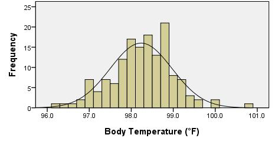
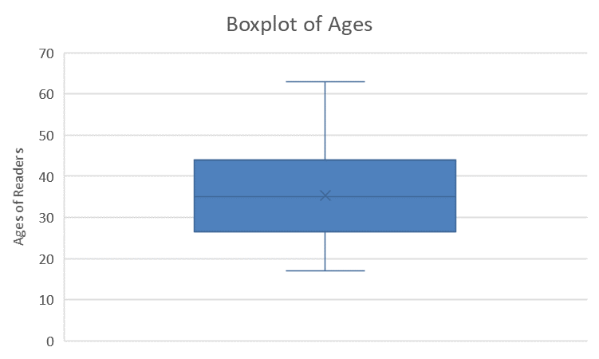
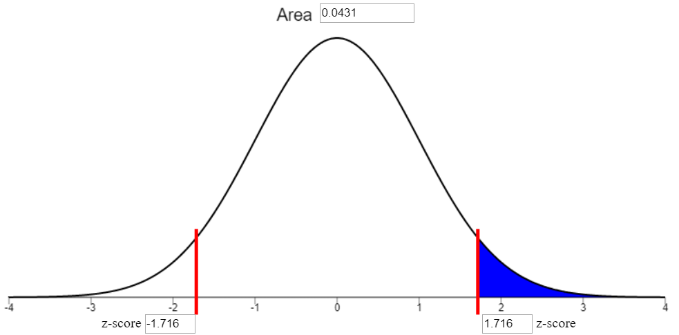

<script type="text/javascript">
 function showhide(id) {
    var e = document.getElementById(id);
    e.style.display = (e.style.display == 'block') ? 'none' : 'block';
 }
</script>

<div style="float:right;width=40%;">
<br/>
<div style="padding-left:10%;">**Optional Lesson Video**</div>
<iframe width="90%" align="right" src="https://www.youtube.com/embed/videoseries?list=PLaZryQtbPQC9C5z9NWEjdRaS7h--99Kwv" frameborder="1" allow="autoplay; encrypted-media" allowfullscreen></iframe>
</div>
<br>

## Lesson Outcomes

<a href="javascript:showhide('oc')"><span style="font-size:8pt;">Show/Hide Outcomes</span></a>
<div id="oc" style="display:none;">

By the end of this lesson, you should be able to:

- Conduct a Hypothesis Test for a single mean with σ known:
  + State the null and alternative hypothesis.
  + Calculate the test-statistic and p-value of the hypothesis test.
  + Assess the statistical significance by comparing the p-value to the α-level.
  + Check the requirements for the hypothesis test.
  + Show the appropriate connections between the numerical and graphical summaries that support this hypothesis test.
  + Draw a correct conclusion for the hypothesis test.
  + Interpret a Type I and II error.
</div>
<br>


<br>

## The Ethan Allen


<!--|From [http://commons.wikimedia.org/wiki/File:The_Judge_Ben_Wiles_(TJG).jpg commons.wikimedia.org]-->

A tragic accident on Lake George in New York, USA, called into question the safety regulations for commercial tour boats. On October 5, 2005, a full boat of 47 passengers and 1 crew member began a routine one-hour tour of Lake George. As the operator initiated a turn, the tour boat "Ethan Allen" listed (tipped) enough to take water aboard.  The force caused by dipping beneath the surface caused the vessel to list, shifting the passengers to one side of the boat.  After this shift in the weight distribution, the boat capsized killing 20 passengers and injuring 9 others.


We assume that at the time of the accident, the stability requirements were based on the Coast Guard criteria of a mean of 140 pounds per person.  So, the Ethan Allen was supposed to be able to safely transport passengers and crew with a mean weight of 140 pounds.  We want to investigate if 140 pounds is a reasonable value for the mean weight of tour boat passengers.  This leads to the research question: "Is the mean weight of tour boat passengers greater than 140 pounds?"

We can rewrite the research question in a declarative sentence to obtain a hypothesis, or a testable statement about a population.

The first hypothesis we will write is that the Coast Guard criteria is appropriate: "The mean weight of tour boat passengers is 140 pounds." We call this the null hypothesis.  The **null hypothesis** is a statement of the "status quo", or the value typically considered to be appropriate.  Notice that the null hypothesis is expressed with a statement involving equality ($=$).

$H_0:~~\mu = 140$ pounds

In contrast to the null hypothesis, we write the alternative hypothesis.  This is typically the statement that a researcher suspects is the actual truth.  In our case, we suspect that "The mean weight of tour boat passengers is greater than 140 pounds."

$H_a:~~\mu > 140$ pounds

We label the null hypothesis $H_0$ and the alternative hypothesis $H_a$.  In every hypothesis test in this class, the null hypothesis will be a statement involving equality.  The alternative hypothesis can include greater than ($>$), less than ($<$), or not equal ($\ne$).

When we test hypotheses, we assume the null hypothesis is true.  Because of this requirement, whenever we need to use μ in a calculation, we can use the value specified in the null hypothesis. When we conduct a hypothesis test, we gather evidence against the requirement that the null hypothesis is true.  If we get enough evidence against the null hypothesis, we reject it.  If we do not have sufficient evidence against the null hypothesis, we do not reject it.


How do we gather evidence against a null hypothesis?  We collect data.

The marine accident report gives the weight (in pounds) of each of the passengers and the crew member. These values are reproduced below. <!-- [Cite: "Capsizing of New York State-Certificated Vessel Ethan Allen, Lake George, New York October 2, 2005"] -->

```{r, echo = FALSE, message = FALSE, warning = FALSE, results = "asis"}
#library(knitr)
 w <- c(189,
 110,
 144,
 141,
 185,
 194,
 180,
 211,
 128,
 135 ,		
 141 ,		
 205 ,		
 200 ,		
 164 ,		
 150 ,		
 170,
 194 ,
 260 ,		
 165 ,		
 137 ,		
 198 ,		
 195 ,		
 158 ,		
 204,
 170 ,
 190, 		
 129 ,		
 146 ,		
 135 ,
 176 ,
 204 ,		
 170,
 142,
 210 ,		
 180 ,		
 155 ,		
 217 ,		
 198 ,		
 126 ,		
 247,
 173 ,
 155 ,		
 165 ,		
 175 ,		
 235 ,		
 230 ,		
 268 ,		
 170)


library(pander)
pander(matrix(data = w, nrow = 6, ncol=8, byrow=TRUE))

```


<!--
<center>
{| style="text-align: center; width: 35%"
| 189
| 110
| 144
| 141
| 185
| 194
| 180
| 211
|-
| 128 		
| 135 		
| 141 		
| 205 		
| 200 		
| 164 		
| 150 		
| 170
|-
| 194 		
| 260 		
| 165 		
| 137 		
| 198 		
| 195 		
| 158 		
| 204
|-
| 170 		
| 190 		
| 129 		
| 146 		
| 135 		
| 176 		
| 204 		
| 170
|-
| 142 		
| 210 		
| 180 		
| 155 		
| 217 		
| 198 		
| 126 		
| 247
|-
| 173 		
| 155 		
| 165 		
| 175 		
| 235 		
| 230 		
| 268 		
| 170
|-
|}
</center>
-->


To help us understand the data, we first create a graph summarizing the values.

<center>
**Weights of Passengers and Crew on the Ethan Allen**<br>

</center>

Next, we compute summary statistics. The sample size is $n=48$, and the sample mean is $\bar{x}=177.6$ pounds. According to the CDC, the standard deviation of the weights of individuals in the United States is $\sigma=26.7$ pounds. <!-- CITE: http://www.cdc.gov/growthcharts/2000growthchart-us.pdf, page 154-155.-->

Considering the data as a random sample of all possible tour boat passengers, it appears that the true mean weight of tour boat passengers might be greater than 140 pounds.  However, we need to check this with a formal test of our hypotheses.


It is not sufficient to gain an intuitive sense for the data.  We will test if there is sufficient evidence to reject the null hypothesis that the true mean weight of tour boat passengers is 140 pounds.

Assuming the null hypothesis is true, what is the probability that we would observe a sample mean as extreme or more extreme than the values we observed?  This probability is called the $P$-value.

To find the $P$-value, we first calculate the number of standard deviations that $\bar{x}$ is away from the assumed value of true mean $\mu=140$ pounds.  This is our $z$-score.  Then we use the applet to determine the probability of observing a value of $z$ that is as large or larger than the value we observed.

$$\displaystyle{ z= \frac{ \bar{x} − \mu}{\sigma/\sqrt{n}} = \frac{177.6−140}{26.7/\sqrt{48}}=9.757 }$$


We use the applet to determine the probability of observing a value of $z$ that is as large or larger than $9.757$.  This is the same as the probability of observing a value of $\bar{x} =177.6$ or more pounds, given that the true mean really is $\mu = 140$ pounds.

The area to the right of $z=9.757$ is so small, the normal probability applet gives the area as "8.6086e-23."  This is how a computer represents scientific notation.  This number is actually $8.6086ex10^{-23}$ or in other words, 0.000 000 000 000 000 000 000 086 086. This is the probability that a mean of $\bar x=177.6$ pounds or greater was observed just by chance assuming the true mean is $\mu = 140$ lbs.  This is very, very unlikely.  A more plausible explanation is that the true mean weight $\mu$ of individuals in the population is greater than 140 pounds.

Based on this analysis and the hypothesis test, the evidence against $H_0$ is strong enough to conclude that if every seat on the Ethan Allen was occupied, that the boat would be carrying a greater load than it was certified to handle.


As a result of this accident, the United States government took several actions.  The Coast Guard stability regulations were changed, and the assumed average weight per person was increased to 185 pounds. <!-- [[CITE: http://www.uscg.mil/hq/cg5/cg5212/docs/secg12142010.pdf]]--> As a result, the safety of public vessels has been improved.
<!--

[[FOLLOW-UP QUESTION:   FIND THE TRUE MEAN WEIGHT OF ADULTS IN THE US.  FIND THE PROBABILITY THAT A RANDOM SAMPLE OF n=48 WILL HAVE A MEAN GREATER THAN 185 POUNDS.]]

[[(AGES 20--74 YEARS) MU = 175.9 LBS, SIGMA = 64.9 LBS AS OF 2002. SOURCE: ADVANCE DATA FROM VITAL HEALTH STATISTICS, NUMBER 347, 27 OCTOBER 2994 (PUBLISHED BY THE CDC) http://www.cdc.gov/nchs/data/ad/ad347.pdf, ACCESSED ON 14 OCTOBER 2013]]

-->


<br>

## Body Temperatures of Healthy Adults

### Introduction

Have you ever wondered how it was determined that the true mean body temperature of healthy adults is 98.6&deg; ?

It is not exactly clear who first reported this value, but this temperature has been used since the 1800's. <!-- \cite{Mackowiak92,Horvath50} -->  One of the most influential researchers in this area is Carl Reinhold August Wunderlich.  He reported measuring over 1,000,000 body temperatures on over 20,000 patients.<!-- \cite{Mackowiak92,Wunderlich68} -->  When the temperature is measured in the arm pit, it is called an axillary temperature measurement.
Based on his research, Wunderlich stated, "The axillary temperature of 98.6&deg; F = 37&deg; C$\ldots$is considered the central thermic point of health". <!-- \cite{Wunderlich71}-->   In other words, the mean body temperature of healthy adults is 98.6&deg; F (or 37&deg; C.)

<div class="QuestionsHeading">Answer the following question:</div>
<div class="Questions">
1. How would you design a study to determine if the mean body temperature of healthy adults is 98.6&deg; ?

<a href="javascript:showhide('Q1')"><span style="font-size:8pt;">Show/Hide Solution</span></a>
<div id="Q1" style="display:none;">
* Take the temperature of a large number of healthy individuals in a clinical setting and compare your mean to the assumed mean body temperature of 98.6 degrees F.  
</div>
&nbsp;
</div>
<br>

### Data on Body Temperatures

A group of researchers led by Philip A. Mackowiak, MD, conducted a study to assess the true mean body temperatures of healthy adults.<!-- \cite{Mackowiak92}-->  They selected $n=148$ subjects between the ages of 18 and 40 years old, representative of the general population.  Each volunteer was given a physical to assure that they were not ill at the time of the data collection.  Their axillary body temperature was measured and reported in a paper published in the "Journal of the American Medical Association". <!-- \cite{Mackowiak92}--> These data were extracted and are presented in the file [BodyTemp](./Data/BodyTemp.xlsx).  The body temperatures in the file are given in degrees Fahrenheit. Based on historical data, the standard deviation of body temperatures is assumed to be $\sigma = 0.675$&deg; F.

<div class="QuestionsHeading">Answer the following questions:</div>
<div class="Questions">
2. How could you use the body temperature data collected by Dr. Mackowiak to determine if the mean body temperature is really 98.6&deg; F?

<a href="javascript:showhide('Q2')"><span style="font-size:8pt;">Show/Hide Solution</span></a>
<div id="Q2" style="display:none;">
* We can compare his sample results to the assumed population mean of 98.6&deg; F.
</div>
<br>

3. Find the mean of the $n=148$ body temperatures.

<a href="javascript:showhide('Q3')"><span style="font-size:8pt;">Show/Hide Solution</span></a>
<div id="Q3" style="display:none;">
- $\bar{x} = 98.23~^\circ\text{F}$.
</div>
<br>

4. Create a histogram illustrating the body temperatures of the individuals in the Mackowiak study.

<a href="javascript:showhide('Q4')"><span style="font-size:8pt;">Show/Hide Solution</span></a>
<div id="Q4" style="display:none;">

</div>
<br>

5. Based on the mean of the observations (Question 3) and the histogram of the data (Question 4,) does it appear that the mean body temperature of healthy adults is significantly different from 98.6&deg; F?

<a href="javascript:showhide('Q5')"><span style="font-size:8pt;">Show/Hide Solution</span></a>
<div id="Q5" style="display:none;">
* Answers may vary.  However, many students are likely to say that the sample mean and population mean are very close to each other.
</div>
<br>

6. What is the shape of the distribution of all possible sample means? How do we know?

<a href="javascript:showhide('Q6')"><span style="font-size:8pt;">Show/Hide Solution</span></a>
<div id="Q6" style="display:none;">
* The distribution of all possible sample means will be approximately normally distributed.  Since the sample size is large, the Central Limit Theorem guarantees this result.
</div>
<br>

7. Assuming that the true mean body temperature of healthy adults is $\mu=98.6$&deg; F, and the population standard deviation is $\sigma = 0.675$&deg; F,<!-- \cite{SundLevander02}--> find the mean and standard deviation of the random variable $\bar{x}$.

<a href="javascript:showhide('Q7')"><span style="font-size:8pt;">Show/Hide Solution</span></a>
<div id="Q7" style="display:none;">
* The random variable $\bar{x}$ will have a mean of $\mu = 98.6$ and a standard deviation of $\displaystyle{ \frac{\sigma}{\sqrt{n}} = \frac{0.675}{\sqrt{148}} = 0.05548 }$.
</div>
<br>

8. Use the information in Question 7 to find the $z$-score for the mean you calculated in Question 3.

<a href="javascript:showhide('Q8')"><span style="font-size:8pt;">Show/Hide Solution</span></a>
<div id="Q8" style="display:none;">
<center>$z = \frac{\bar{x} - \mu}{\sigma / \sqrt{n} } = \frac{98.23 - 98.6}{0.675 / \sqrt{148} } = -6.6685$</center>
</div>
<br>

9. What is the probability of observing a $z$-score that is as extreme or more extreme (further away from 0) than the $z$-score you calculated in Question 8?

<a href="javascript:showhide('Q9')"><span style="font-size:8pt;">Show/Hide Solution</span></a>
<div id="Q9" style="display:none;">
* This is a two-tailed test, so we need to shade both tails of the applet.  This gives a $P$-value of $2.5931\times 10^{-11}$.
</div>
<br>

10. Assuming the mean body temperature really is 98.6&deg; F, how likely would it be for a random sample of $n=148$ people in the population to have a mean body temperature that is as extreme as was observed in Question 3?

<a href="javascript:showhide('Q10')"><span style="font-size:8pt;">Show/Hide Solution</span></a>
<div id="Q10" style="display:none;">
* This is extremely unlikely.
</div>
<br>

11. Results as unlikely as this demand an explanation.  What do you think is the reason for a $z$-score as extreme as this?

* A. The group of volunteers included in the study had unusually low body temperatures.
* B. The researchers did not measure the temperature correctly.
* C. The true mean body temperature is different than 98.6&deg; F.
* D. The sample size of $n=148$ is not large enough.
* E. The data were collected on a cold day.
* F. The data are not normally distributed.

<a href="javascript:showhide('Q11')"><span style="font-size:8pt;">Show/Hide Solution</span></a>
<div id="Q11" style="display:none;">
* Correct answer: C. The true mean is different than 98.6&deg; F. The data were collected carefully with properly calibrated modern thermometers.  The sample was representative of the population and the size of the sample was not an issue.
</div>
&nbsp;
</div>
<br>

## Hypothesis Test for the True Mean Body Temperature

### Null and Alternative Hypotheses

It is commonly believed that the true mean body temperature is 98.6&deg; F (37&deg; C).  In science, a statement or claim such as this is called a **hypothesis**.  We can use data to test a hypothesis.  If there is enough evidence against a hypothesis, we reject it in favor of something else.

The claim representing the "status quo" or the commonly held belief or the usual value is called the **null hypothesis**.  In the case of body temperatures, our null hypothesis is defined by the belief that the true mean body temperature of healthy adults is 98.6&deg; F.

We present the null hypothesis in the following way:

$$H_0: \mu = 98.6$$

If we gather enough evidence against the null hypothesis and determine that it should be rejected, we need another hypothesis to propose in its place.  This is called the **alternative hypothesis**.  If 98.6&deg; F is not the correct body temperature, then it is logical to propose the following alternative hypothesis:

$$H_a: \mu \ne 98.6$$

To be brief in writing, we label the null hypothesis $H_0$. The zero in the subscript represents "null," "baseline," "default," "no effect," etc.  Similarly, we label the alternative hypothesis $H_a$.

Our alternative hypothesis could have been written as:

- $H_a: \mu \ne 98.6$  (two-sided hypothesis; two-tailed)
- $H_a: \mu < 98.6$    (one-sided hypothesis; left-tailed)
- $H_a: \mu > 98.6$    (one-sided hypothesis; right-tailed)

Notice that each of these is a viable alternative to the requirement that the mean is 98.6 degrees.  We would only use $<$ or $>$ if we had a belief in advance that the mean was less than or greater than 98.6.  If we do not have a strong reason to believe the mean is either smaller or larger than the stated value--before we collect our data--then, we use $\ne$ in our alternative hypothesis.

It is important that the null and alternative hypotheses be determined prior to collecting the data.  It is not appropriate to use the data from your study to choose the alternative hypothesis that will be used to test the same data!  This is an example of using data twice, once to choose the test and again to conduct the test.  It is okay to use data from a previous study to determine your null and alternative hypotheses, but it is an improper use of the statistical procedures to use the data to define *and* conduct a hypothesis test.

Notice that the null and alternative hypotheses are statements about a population parameter (e.g. $\mu$.)  They will never involve a sample statistic (e.g. $\bar{x}$.) Population parameters are unknown, and we are trying to make a judgement about whether or not they are equal to a particular value.  Sample statistics are calculated from our data, so there is no reason to do any test to assess what their value is.

<!--
{| class="wikitable"
|-
|
See Lesson \ref{Reading:SampDistOfXbar} to review the concept of the distribution of sample means, $\bar{x}$.
|}
-->

The null hypothesis will always be a statement involving equality.  This gives us a starting point in our analysis.  In the reading for [Normal Distributions](Lesson05.html){target="_blank"}, we assumed that the true mean body temperature was 98.6&deg; F.  This becomes the assumed value of the mean of the distribution of the random variable $\bar{x}$.

The scientific method demands that we make a hypothesis (a claim or an educated guess).  We assume that the null hypothesis is true and gather evidence against it.  In other words, we "do research" (e.g., collect data) to gather evidence against that hypothesis.  If we can gather enough evidence to discredit our initial hypothesis, we conclude that it was false, and begin the process again.
If we are unable to reject the original hypothesis, we do not conclude that it is correct.  For example, we do not know that Einstein's Theory of Relativity is correct.  We have simply not been able to disprove it$\ldots$yet.

In the same way, we never can prove a null hypothesis is true.  We can only gather evidence against it.  If we get enough evidence, we reject the null hypothesis.

### Test Statistic

Assuming the null hypothesis is true, we assume that the true mean body temperature of healthy adults actually is $\mu = 98.6^{\circ}$ F.  Wanting to test this claim, researchers collected data on the mean body temperatures of $n=148$ healthy adults.  The mean of the observed values was $\bar{x} = 98.23^{\circ}$ F.

A histogram of the body temperature data shows a nice bell-shaped distribution.  Also, the sample mean, $\bar{x}=98.23^\circ$ F, appears to be reasonably close to the assumed population mean, $\mu=98.6^\circ$ F.
However, it is important to remember that the standard deviation of $\bar{x}$ is $\frac{\sigma}{\sqrt{n}} = \frac{0.675}{\sqrt{148}}=0.055$.  We need to determine how far $\bar{x}$ is from $\mu$.  Since we know $\sigma$ in this case, we can use the $z$-score to determine if $\bar{x}$ is far from the assumed value.  This is called the **test statistic**:
$$
z = \frac{\bar{x} - \mu}{\sigma / \sqrt{n}} = \frac{98.23 - 98.6}{0.675 / \sqrt{148}} = -6.6685
$$
Where $z$ is the test statistic, $\bar{x}$ is the sample mean, $\mu$ is the population mean, $\sigma$ is the standard deviation and $n$ is the sample size.
Based on the results from the formula above, $\bar{x}$ is over 6 standard deviations below the mean!

### $P$-value

#### Definition

The **$P$-value** is the probability of obtaining a test statistic (such as $z$) at least as extreme as the one you calculated, assuming the null hypothesis is true. In other words, our $P$-value is the probability that we would get a $z$-score that is as extreme or more extreme than $z=-6.6685$, assuming the true mean is 98.6&deg; F.

In advance of collecting the data, we may have had no idea whether the true mean would be greater than 98.6 or less than 98.6, if 98.6&deg; F was not the right value.  This is why we used a two-sided alternative hypothesis ($H_a: \mu \ne 98.6$.) When computing the $P$-value, we need to continue this logic.  So, we would have considered a value of $z=-6.6685$ to be equally as extreme as $z=6.6685$.

In the case of a two-sided test for one mean with $\sigma$ known, the $P$-value is the area in the tails beyond $\pm z$, in both the left and right tails of the standard normal distribution.


Using the applet, we shade the area in both tails and then type in the value of $z=-6.669$.  The applet reports an area of "2.584E-11."  This is the way computers indicate scientific notation.  Expressed using more traditional notation, we get

$$ P\text{-value} = 2.584 \times 10^{-11} = 0.000~000~000~026 $$

You should always convert the computer's notation involving "E" to scientific notation or decimal notation.

<div class="Emphasis">
&nbsp;&nbsp;**Scientific Notation:**

- Scientific notation is a method used to write very large or very small numbers without a lot of extra zeros. Computers express scientific notation using the letter "E." For example, to write $7.8\times 10^3$, a computer would output the expression 7.8E3. For example, the number  $7.8\times 10^3$ is $7.8 \times 1000=7800$, since $10^3 = 10 \cdot 10 \cdot 10 = 1000$.  Another way to think of this is to move the decimal place in the number 7.8 three places to the right, which gives you
$$ 7~\underset{\rightarrow}{8} \underset{\rightarrow}{0} \underset{\rightarrow}{0}. $$  

- This is an example of how very large numbers can be represented.  To express small numbers (close to zero,) we use negative exponents.  The number $9.12 \times 10^{-5}$ is the same as $9.12 \times (10^5)^{-1} = 9.12 \times (10000)^{-1}$.  This can be written as $9.12 \times 0.00001 = 0.0000912$.  Since the exponent on the 10 is $-5$, you move the decimal place in the number 9.1 five places to the left:

$$0.\underset{\leftarrow}{0}\underset{\leftarrow}{0}\underset{\leftarrow}{0}\underset{\leftarrow}{0}\underset{\leftarrow}{9}~1~2$$


- Similarly, the value $2.57552 \times 10^{-11}$ can be written in regular notation as $0.000~000~000~025~755~2$.
</div>
<br>

If the $P$-value is small, that implies that the $z$-score was very large (far away from 0.)  In other words, $\bar{x}$ was far away from $\mu$.  In this case, our $z$-score was 6.669 standard deviations below the mean.  It is very unusual to get a value of $\bar{x}$ that is this far from the value of $\mu$ given in the null hypothesis.  This implies that it is not plausible that the mean is equal to 98.6&deg; F. We reject the null hypothesis and conclude that there is sufficient evidence that the true mean body temperature of healthy adults is not 98.6&deg; F.

If this conclusion is correct, you may wonder why so many people think the true mean body temperature of healthy adults is 98.6&deg; F (37&deg; C). Good question!

#### Relationship to the Alternative Hypothesis

The $P$-value is determined using the alternative hypothesis. If the alternative hypothesis is two-sided (i.e. if the alternative hypothesis involves $\ne$,) then the $P$-value is the area in the tails further than $\pm z$.  That is, it is the area to the left of $z=-6.669$ plus the area to the right of $z=+6.669$.

If the alternative hypothesis involves less than (such as $\mu<98.6$,) we call it a left-tailed test.  For a left-tailed test, the $P$-value is the area under the standard normal curve to the left of the test statistic, $z$.

In the case of a right-tailed test, the $P$-value is the area to the right of the test statistic, $z$.

In cases of very large or very small $z$ statistics sometimes the shaded area is so small it can't be seen. This is the case for $z=-6.669$. It is such an extreme value for $z$, it is hard to see the actual shading. However, shading is happening and the applet is calculating the right p-value. To help you visually see how the shading works, the three possibilities for alternative hypotheses are illustrated in the figures below, using a less extreme value of $z=-1.6$.


<center>
<table>
<thead>
<tr class="header">
<th><p>Two-tailed</p></th>
<th><p>Left-tailed</p></th>
<th><p>Right-tailed</p></th>
</tr>
</thead>
<tbody>
<tr class="odd">
<td><p>$H_0:~~\mu = 98.6$</p></td>
<td><p>$H_0:~~\mu = 98.6$</p></td>
<td><p>$H_0:~~\mu = 98.6$</p></td>
</tr>
<tr class="even">
<td><p>$H_a:~~\mu \ne 98.6$</p></td>
<td><p>$H_a:~~\mu \lt 98.6$</p></td>
<td><p>$H_a:~~\mu \gt 98.6$</p></td>
</tr>
<tr class="odd">
<td><p></p></td>
<td><p></p></td>
<td><p></p></td>
</tr>
</tbody>
</table>
</center>

<!-- Old table
<center>
{| class="wikitable"
! Two-tailed !! Left-tailed !! Right-tailed
|- align="center"
| $H_0:~~\mu = 98.6$ || $H_0:~~\mu = 98.6$ || $H_0:~~\mu = 98.6$
|- align="center"
| $H_a:~~\mu \ne 98.6$ || $H_a:~~\mu < 98.6$ || $H_a:~~\mu > 98.6$
|- align="center"
|  ||  || 
|}
</center>
-->

If $\bar{x}$ is close to $\mu$, then the $z$-score will be small.  If the $z$-score is small, then there will be a lot of area in the tails beyond $z$.  In other words, the $P$-value will be large.  These two possibilities are illustrated for a two-tailed test in the figure below.  Similar results hold for a one-tailed test.

<center>
<table>
<thead>
<tr class="header">
<th><p>Large $P$-value</p></th>
<th><p>Small $P$-value</p></th>
</tr>
</thead>
<tbody>
<tr class="odd">
<td><figure>

</figure></td>
<td><figure>

</figure></td>
</tr>
<tr class="even">
<td><p>Fail to reject $H_0$</p></td>
<td><p>Reject $H_0$</p></td>
</tr>
</tbody>
</table>
</center>

<!-- Old table
<center>
{| class="wikitable"
! Large $P$-value !! Small $P$-value
|- align="center"
| [[File:Applet-largeP-LoRes.png">
|- align="center"
| Fail to reject $H_0$ || Reject $H_0$
|}
</center>
-->

In the case of the body temperatures, a large $z$-score ($z=-6.669$) led to a small $P$-value (the area in the tails.)  We observed a value for $\bar{x}$ that was very far from $\mu=98.6$.  Strictly due to chance, it would be very unlikely to observe a mean of $\bar{x}=98.23^\circ$ F in a random sample of $n=148$ if the true mean is 98.6&deg; F.

### Level of Significance, $\alpha$

How do we decide if the $P$-value is small enough to reject the null hypothesis?  We need a way to determine if there is enough evidence to reject the null hypothesis that does not depend on the data.
We need a number that can be used to determine if the $P$-value is small enough to reject the null hypothesis. This number is called the **level of significance** and is often denoted by the symbol **$\alpha$** (pronounced "alpha".)

**Memory Aid:** Some students find it helpful to remember the decision rule using the couplet:<br />

**If the $P$ is low, reject the null.**


<!--
<center>
{| class="wikitable"
|-
| **Memory Aid:** <br>
Some students find it helpful to remember the decision rule using the couplet: <br>
|- align="center"
| "If the $P$ is low,<br> Reject the null."
|}
</center>
-->

We will use the same decision rule for all hypothesis tests.
If the $P$-value is less than $\alpha$, we reject the null hypothesis.  Conversely, if the $P$-value is greater than $\alpha$, we fail to reject the null hypothesis.
The level of significance, $\alpha$, must be chosen prior to collecting the data.
This is our standard for determining if the null hypothesis should be rejected.  It is important that the personal bias of the researcher is not imposed on the data.  So, we choose the $\alpha$ level prior to collecting the data.  If we wanted to reject the null hypothesis, we could compute the $P$-value and then unscrupulously choose the $\alpha$ level.  In every case, we could choose a value of $\alpha$ that is larger than the computed $P$-value, and therefore always reject the null hypothesis.  This practice would defeat the purpose of hypothesis testing.

### Type I and Type II Errors

If the null hypothesis is true, for example, if the true body temperature of healthy adults really is 98.6&deg; F, sometimes we will get a very large or very small value of $\bar{x}$.  This will lead to a very extreme $z$-score, strictly due to chance.  In this case, we would reject the null hypothesis, even though it is true!

Whenever we reject a true null hypothesis, we say that a **Type I error** was committed.  Assuming the null hypothesis is true, the level of significance ($\alpha$) is the probability of getting a value of the test statistic that is extreme enough that the null hypothesis will be rejected.  In other words, the level of significance ($\alpha$) is the probability of committing a Type I error.

We choose $\alpha$ to be some small number so that the probability of committing a Type I error is low.  The most common value for $\alpha$ is $\alpha=0.05$.  This is equal to $\frac{1}{20}$.  So, when the null hypothesis is true, there is a one-in-twenty chance that it will be rejected at the 0.05 level of significance.  Other common choices for $\alpha$ include $\alpha = 0.1$ and $\alpha=0.01$.

If committing a Type I error is undesirable, why can't we let $\alpha=0$?  This would make it impossible to commit a Type I error.  Actually, this would also make it impossible to reject "any" null hypothesis!  If $\alpha=0$, no matter what test we do, no matter what the data show, we always fail to reject the null hypothesis.  This would be pointless.


A Type I error is committed when we reject a true null hypothesis.  Another problem that can arise is to fail to reject a false null hypothesis. This is called a Type II error. The probability of a Type II error is represented by $\beta$.


<center></center>
<!-- <center> -->
<!-- <table border="1"> -->
<!-- <thead> -->
<!-- <tr class="header"> -->
<!-- <th>Decision</th> -->
<!-- <th colspan="2"><p>    Truth</p></th> -->
<!-- </tr> -->
<!-- </thead> -->
<!-- <tbody> -->
<!-- <tr class="odd"> -->
<!-- <td><p></p></td> -->
<!-- <td><p>$H_0$ is true</p></td> -->
<!-- <td><p>$H_0$ is false</p></td> -->
<!-- </tr> -->
<!-- <tr class="even"> -->
<!-- <td><p>Fail to<br /> -->
<!-- reject $H_0$</p></td> -->
<!-- <td><p>Correct<br /> -->
<!-- Decision</p></td> -->
<!-- <td><p>Type II <br /> -->
<!-- Error</p></td> -->
<!-- </tr> -->
<!-- <tr class="odd"> -->
<!-- <td><p>Reject $H_0$</p></td> -->
<!-- <td><p>Type I<br /> -->
<!-- Error</p></td> -->
<!-- <td><p>Correct<br /> -->
<!-- Decision</p></td> -->
<!-- </tr> -->
<!-- </tbody> -->
<!-- </table> -->
<!-- </center> -->


We do not want to commit Type I errors, so why not choose a very small value for $\alpha$?  If we choose $\alpha$ to be so small that we rarely commit a Type I error, what would happen to the probability of committing a Type II error?  (Think about it.)

If the $\alpha$ value (the probability of committing a Type I error) is very small, the probability of committing a Type II error will be large.  Conversely, if $\alpha$ is allowed to be very large, then the probability of committing a Type II error will be very small.
A level of significance of $\alpha=0.05$ seems to strike a good balance between the probabilities of committing a Type I versus a Type II error.  However, there may be instances where it will be important to choose a different value for $\alpha$.  The important thing is to choose $\alpha$ before you collect your data. Typical choices of $\alpha$ are $0.05$ (most common), $0.1$, and $0.01$.

Read each of the following scenarios and answer the questions.

**Scenario 1**:
The BYU-Idaho Honor Code specifically prohibits wearing flip-flops on campus.  
A student is seen on campus wearing shoes that look somewhat like flip-flops.  
Consider the following null and alternative hypotheses:
$$
\begin{align}
H_0: & \textrm{Shoes of this type are technically flip-flops}\\
H_a: & \textrm{Shoes of this type are not technically flip-flops}\\
\end{align}
$$
You are considering approaching this student to discuss their footwear.

<div class="QuestionsHeading">Answer the following questions:</div>
<div class="Questions">
12. What action would lead to a Type I error in this case?

<a href="javascript:showhide('Q12')"><span style="font-size:8pt;">Show/Hide Solution</span></a>
<div id="Q12" style="display:none;">
* A Type I Error would be committed if you decided that they were not flip flops, when in reality they were flip-flops.
</div>
<br>

13. What action corresponds to committing a Type II error?

<a href="javascript:showhide('Q13')"><span style="font-size:8pt;">Show/Hide Solution</span></a>
<div id="Q13" style="display:none;">
* A Type II Error would be committed if you concluded that they were technically flip flops, when in reality they were not flip-flops.
</div>
<br>

14. In this case, is a Type I error or a Type II error more serious?  Justify your response.

<a href="javascript:showhide('Q14')"><span style="font-size:8pt;">Show/Hide Solution</span></a>
<div id="Q14" style="display:none;">
* Answers may vary.
</div>
&nbsp;
</div>
<br>


**Scenario 2**:
The U. S. Food and Drug Administration (FDA) regulates all prescription medications dispensed in the United States.  
Part of their responsibility is to oversee the investigation of the safety and efficacy of new drugs.
A new drug is under consideration for approval.  
The following null and alternative hypotheses relate to the effectiveness of the proposed drug:
$$
\begin{align}
H_0: & \textrm{The drug does not improve patients' conditions}\\
H_a: & \textrm{The drug improves patients' conditions}\\
\end{align}
$$

<div class="QuestionsHeading">Answer the following questions:</div>
<div class="Questions">
15. What action by the FDA would lead to a Type I error in this case?

<a href="javascript:showhide('Q15')"><span style="font-size:8pt;">Show/Hide Solution</span></a>
<div id="Q15" style="display:none;">
* A Type I error would be committed if the FDA decided that the drug improves patient's conditions, when in actuality it does not.
</div>
<br>

16. What action by the FDA would be associated with committing a Type II error?

<a href="javascript:showhide('Q16')"><span style="font-size:8pt;">Show/Hide Solution</span></a>
<div id="Q16" style="display:none;">
* The FDA would commit a Type II error if they decided that the drug does not improve patients' conditions, when in reality it does.
</div>
<br>

17. In this case, is a Type I error or a Type II error more serious?  Justify your response.

<a href="javascript:showhide('Q17')"><span style="font-size:8pt;">Show/Hide Solution</span></a>
<div id="Q17" style="display:none;">
* Answers may vary.  However, a Type I error is probably more serious, since patients would be exposed to the negative side effects of the drug without any benefit.
</div>
&nbsp;
</div>
<br>

**Scenario 3**:
With regard to a new drug under consideration for approval by the FDA, the following null and alternative hypotheses address the safety of the drug:
$$
\begin{align}
H_0: & \textrm{The drug does not cause serious side effects}\\
H_a: & \textrm{The drug causes serious side effects}\\
\end{align}
$$

<div class="QuestionsHeading">Answer the following questions:</div>
<div class="Questions">
18. What action by the FDA would lead to a Type I error in this case?

<a href="javascript:showhide('Q18')"><span style="font-size:8pt;">Show/Hide Solution</span></a>
<div id="Q18" style="display:none;">
* A Type I error would be committed if the FDA decided that the drug causes serious side effects, when it does not.
</div>
<br>

19. What action by the FDA corresponds to committing a Type II error?

<a href="javascript:showhide('Q19')"><span style="font-size:8pt;">Show/Hide Solution</span></a>
<div id="Q19" style="display:none;">
* A Type II error would be committed if the FDA decided that the drug does not cause serious side effects, when in reality it does cause serious side effects.
</div>
<br>

20. In this case, is a Type I error or a Type II error more serious?  Justify your response.

<a href="javascript:showhide('Q20')"><span style="font-size:8pt;">Show/Hide Solution</span></a>
<div id="Q20" style="display:none;">
* A type II error would be more serious, because the FDA could release a drug that they say has no serious side effects, when it actually does.
</div>
&nbsp;
</div>
<br>

### Requirements

Certain requirements are required for us to conduct the hypothesis test for a single mean with $\sigma$ known.

First of all, we must assume that the data represent a simple random sample from a large population.  In practice, this requirement is rarely satisfied.  Frequently researchers working with humans rely on convenience samples, where the subjects volunteer to participate in a research project.  The researcher may advertise using television, radio, and flyers in a clinic.  If there is no relationship between the issue being studied and people's desire to participate, this method works fairly well.

A second requirement is that the data are drawn from a population that has a normal distribution with mean $\mu$ given in the null hypothesis (e.g. 98.6&deg; F) and a known standard deviation (e.g. $\sigma=0.675^\circ$ F.)

It turns out that the procedure actually works quite well--even if the data are not normally distributed--as long as $\bar{x}$ follows a normal distribution.  Under what conditions will $\bar{x}$ be normally distributed? (Think about it.)

In the reading for [Distribution of Sample Means & The Central Limit Theorem|Lesson 6](Lesson06.html){target="_blank"}, we learned that $\bar{x}$ will follow a normal distribution if the data are drawn from a normal distribution or if the sample size ($n$) is large.

Putting this all together, we can summarize the requirements for a test for a single mean with $\sigma$ known as:

- The data represent a simple random sample from a large population.
- The sample mean $\bar{x}$ is normally distributed.  This happens if either one of the following is true:
  + The population is normally distributed.
  + The sample size is large.


### Worked Example: Body Temperatures


**Summarize the relevant background information**

The following example illustrates how to conduct the hypothesis test for a single mean with $\sigma$ known.  We will conduct a hypothesis test to determine if the true mean body temperature of healthy adults is 98.6&deg; F, using the $\alpha=0.05$ level of significance. We will assume that the population standard deviation is known to be $\sigma=0.675^\circ$ F. This will summarize the work presented in the paragraphs above.

**State the null and alternative hypotheses and the level of significance**

$$
\begin{align}
H_0:& \mu = 98.6 \\
H_a:& \mu \ne 98.6
\end{align}
$$
$$ \alpha = 0.05 $$


**Describe the data collection procedures**

The body temperatures of $n = 148$ healthy adults were measured using calibrated thermometers in a clinical setting.


**Give the relevant summary statistics**

$$
\begin{array}{l}
\bar{x} = 98.23\\
\sigma = 0.675\\
n = 148
\end{array}
$$

**Make an appropriate graph (e.g. a histogram) to illustrate the data**




**Verify the requirements have been met**

- We assume that the individuals chosen to participate in the study represent a (simple) random sample from the population.
- $\bar{x}$ will be normally distributed because the sample size is large.  (Note: We could have also noticed that the body temperature data appears to be normally distributed, so even with a small sample size, $\bar{x}$ would be normal.)

**Give the test statistic and its value**

$$z=-6.669$$

**Mark the test statistic and $P$-value on a graph of the sampling distribution (i.e. the standard normal curve)**


**Find the $P$-value and compare it to the level of significance**

$$P\textrm{-value} = 2.57552 \times 10^{-11} = 0.000~000~000~026 < 0.05 = \alpha$$

**State your decision**

Since the $P$-value is less than $\alpha$, we reject the null hypothesis.


**Present your conclusion in an English sentence, relating the result to the context of the problem**

There is sufficient evidence to suggest that the true mean body temperature of healthy adults is different from 98.6&deg; F.


## Worked Example: Perceived Health after a Cardiac Arrest

A group of researchers led by Dr. Jared Bunch studied the long-term effects suffered by patients who experienced a cardiac arrest outside a hospital<!-- \cite{Bunch03} -->.  The long-term health of the patients was assessed using the Short-Form General Health Survey (SF-36)<!-- \cite{Ware92} --> at the time of their last follow up visit.  The SF-36 is normalized so the mean score in the general population is $\mu=50$ and the standard deviation is $\sigma=10$<!-- \cite{Jenkinson99} -->. The minimum score is 0 and the maximum score is 100.  Lower scores on the SF-36 indicate a poorer quality of health.

Using the 0.05 level of significance, we will conduct a hypothesis test to determine if the mean perceived general health level among cardiac arrest survivors is less than 50.  In other words, we want to know if the mean perceived overall health is lower among cardiac arrest survivors than in the general population.

Dr. Bunch summarized the responses in a figure, <!--\cite{Bunch03}--> from which the data were extracted.  These data are given in the file [CardiacArrestHealth](./Data/CardiacArrestHealth.xlsx).

<div class="QuestionsHeading">Answer the following question:</div>
<div class="Questions">


21. Summarize the relevant background information.

<a href="javascript:showhide('Q21')"><span style="font-size:8pt;">Show/Hide Solution</span></a>
<div id="Q21" style="display:none;">
* The long-term health of patients who had previously suffered a cardiac arrest were studied.  The researchers want to know if these patients will feel that their overall long-term health was worsened by the cardiac arrest.  
* After patients concluded their treatment for the cardiac arrest, they were given the SF-36 survey to assess their overall health.  In the general population, the mean score on the SF-36 is 50.  Lower scores indicate poorer health.  The researchers will test to see if the mean score of those who have had a cardiac arrest is less than 50.
</div>
<br>

22. State the null and alternative hypotheses and the level of significance.

<a href="javascript:showhide('Q22')"><span style="font-size:8pt;">Show/Hide Solution</span></a>
<div id="Q22" style="display:none;">
<center>
$$
\begin{array}{lcl}
H_0:~~\mu = 50\\
H_a:~~\mu < 50\\
\alpha = 0.05
\end{array}
$$
</center>
* Recall that we are testing to see if the mean is less than 50.
</div>
<br>


23. Describe the data collection procedures.

<a href="javascript:showhide('Q23')"><span style="font-size:8pt;">Show/Hide Solution</span></a>
<div id="Q23" style="display:none;">
* The researchers collected data from $n=50$ patients who had suffered a cardiac arrest outside a hospital.  The data were collected using the SF-36 survey instrument.
</div>
<br>


24. Give the relevant summary statistics.

<a href="javascript:showhide('Q24')"><span style="font-size:8pt;">Show/Hide Solution</span></a>
<div id="Q24" style="display:none;">
<center>
$$
\begin{array}{l}
\bar{x} = 47.82\\
\sigma = 10\\
n = 50
\end{array}
$$
</center>
</div>
<br>

25. Make an appropriate graph to illustrate the data.

<a href="javascript:showhide('Q25')"><span style="font-size:8pt;">Show/Hide Solution</span></a>
<div id="Q25" style="display:none;">

</div>
<br>


26. Verify the requirements have been met.

<a href="javascript:showhide('Q26')"><span style="font-size:8pt;">Show/Hide Solution</span></a>
<div id="Q26" style="display:none;">
  + We assume that the individuals chosen to participate in the study represent a (simple) random sample from the population.
  + $\bar{x}$ will be normally distributed, because the sample size is large.
</div>
<br>

27. Give the test statistic and its value.

<a href="javascript:showhide('Q27')"><span style="font-size:8pt;">Show/Hide Solution</span></a>
<div id="Q27" style="display:none;">
<center>
$\displaystyle{ z=\frac{\bar{x} - \mu}{\sigma / \sqrt{n}} = \frac{47.82 - 50}{10 / \sqrt{50}} = -1.5415 }$
</center>
</div>
<br>

28. Mark the test statistic and $P$-value on a graph of the sampling distribution.

<a href="javascript:showhide('Q28')"><span style="font-size:8pt;">Show/Hide Solution</span></a>
<div id="Q28" style="display:none;">

</div>
<br>

29. Find the $P$-value and compare it to the level of significance.

<a href="javascript:showhide('Q29')"><span style="font-size:8pt;">Show/Hide Solution</span></a>
<div id="Q29" style="display:none;">
<center>
$P\textrm{-value} = 0.0616 > 0.05 = \alpha$
</center>
</div>
<br>

30. State your decision.

<a href="javascript:showhide('Q30')"><span style="font-size:8pt;">Show/Hide Solution</span></a>
<div id="Q30" style="display:none;">
* Since the $P$-value is greater than $\alpha$, we fail to reject the null hypothesis.
</div>
<br>


31. Present your conclusion in an English sentence, relating the result to the context of the problem.

<a href="javascript:showhide('Q31')"><span style="font-size:8pt;">Show/Hide Solution</span></a>
<div id="Q31" style="display:none;">
* There is insufficient evidence to suggest that the mean perceived general health of patients after a cardiac arrest is worse than the general population. Patients who suffer from a cardiac arrest typically have the potential to return to full health
</div>
&nbsp;
</div>
<br>

## Structure

When $\sigma$ is known, we conduct the hypothesis test by hand. (Note that this is not realistic, since $\sigma$ is not known in most interesting real situations. However, this will help you learn how to do hypothesis tests.)

Be sure to always conduct a test using $P$-values. In this course, we will never compute or use critical values as part of a hypothesis test.

In the $P$-value method, you compare a computed $P$-value to your selected $\alpha$-level. If the $P$-value is less than $\alpha$, you will reject the null hypothesis. Otherwise, you fail to reject the null hypothesis. We never say we “accept” the null hypothesis.

Hypothesis tests follow the same basic pattern.


1. Summarize the relevant background information

2. State the null and alternative hypotheses


3. Describe the data collection procedures


4. Give the relevant summary statistics

5. Make an appropriate graph to illustrate the data


6. Verify the requirements have been met

7. Give the test statistic and its value

8. Mark the test statistic and $P$-value on a graph of the sampling distribution

9. Find the $P$-value and compare it to the level of significance

10. State your decision


11. Present your conclusion in an English sentence, relating the result to the context of the problem

## Requirements

There are three requirements that need to be checked when conducting a hypothesis test for a mean with $\sigma$ known:

1. A simple random sample was drawn from the population
2. $\bar{x}$ is normally distributed
3. $\sigma$ is assumed to be known

It is rare for the first requirement to be satisfied in practice.  If the results are to generalize to the population, the sample needs to be representative of the whole population.  This is accomplished through random sampling.

The second requirement is satisfied if (a) the raw data are normally distributed or (b) the sample size is large.  In practice, these tests tend to be fairly robust when the requirement of normality is violated. Even if the requirement of normality is not satisfied perfectly, it is usually okay to conduct the test.

In practice, we never really know $\sigma$.  This procedure is primarily used to help you understand how to conduct a hypothesis test. When we do not know $\sigma$, there is a slightly different procedure, which you will learn soon.

## Additional Worked Examples

Conducting a hypothesis test involves the application of all of the processes we have learned in this course.  Viewing additional examples can help your understanding.  Click on the link at right to see two more examples.

<a href="javascript:showhide('Q32')"><span style="font-size:8pt;">Show Additional Examples</span></a>
<div id="Q32" style="display:none;">

<br>


### Mean age of people who read the New York Times online


1. Summarize the relevant background information

* The New York Times is a large newspaper that is available both in the traditional print format and online. It is known that the mean age of readers of the print edition is $42$ years. The standard deviation of the age of readers is known to be $12$ years. The research question is: Is the mean age of readers of the online version of the Times less than $42$ years?

* The population is all people who read the Times online. The observational units are the individual customers. The age of each person who was selected and agreed to participate was measured. The customer’s age is a quantitative random variable.


2. State the null and alternative hypotheses and the level of significance

$$
\begin{align}
H_0:&~~\mu = 42 \\
H_a:&~~\mu < 42
\end{align}
$$

$$ \alpha = 0.05 $$


3. Describe the data collection procedures

* : Using a simple random sample, data were collected on $n = 25$ people who read the Times online. Their ages were recorded.

<!--
30
48
26
46
36
63
42
32
20
29
17
22
37
46
31
54
35
23
38
27
51
41
18
37
34
-->


5. Make an appropriate graph to illustrate the data

* A boxplot shows the mean age of the online customers (represented by the x on the graph) and the median both appear to be between 30 and 40, less than $42$ years.




4. Give the relevant summary statistics

* The mean age of the sampled subjects was $\bar{x} = 35.32$. There were $n = 25$ people included in the sample.


6. Verify the requirements have been met

* The data represent a simple random sample from the population.  A look at the histogram (not shown) would reveal that the data is not perfectly normal. However, the sample data is approximately normal. In other words, it is close enough to a normal shape to meet the requirement.

<!--  -->

7. Give the test statistic and its value

$$\displaystyle{ z = \frac{\bar{x} - \mu}{\sigma/\sqrt{n}} = \frac{35.32-42}{12/\sqrt{25}} = -2.7833 }$$


8. Mark the test statistic and $P$-value on a graph of the sampling distribution


9. Find the $P$-value and compare it to the level of significance

$$P\text{-value} = 0.0027 < 0.05 = \alpha$$


10. State your decision

* Since the $P$-value is less than the level of significance, we reject the null hypothesis.


11. Present your conclusion in an English sentence, relating the result to the context of the problem

* Reject Ho. There is sufficient evidence to suggest that the mean age of readers of the online edition of the Times is less than 42 years.

* It is reasonable to conclude that the mean age of those who read the Times online is less than 42. There does appear to be a difference in the ages of those who read the print ($\mu = 42$) years and the online editions of the paper.

<br>


### Mean GPA of early risers

In Doctrine and Covenants 88:124, the Lord commands, "…cease to sleep longer than is needful; retire to thy bed early, that ye may not be weary; arise early, that your bodies and your minds may be invigorated." Are there academic benefits from obeying this commandment? People who sleep late tend to be stereotyped as slackers. It is not fair to make these claims without any scientific evidence. The purpose of this study is used to address whether early risers earn better grades.

Researcher K. Clay and others presented a paper at the Associated Professional Sleep Societies meeting [4]. They suggested that the mean GPA of students who are early risers tends to be higher than average. The mean grade point average (GPA) of all students at BYU-Idaho is $\mu = 3.15$. The population standard deviation for the grades of students at BYU-Idaho is $\sigma= 0.68$.

A simple random sample of $n = 378$ early-rising BYU-Idaho students was collected.  The students were asked to report their BYU-Idaho GPA. The GPA of each person who was selected and signed the informed consent statement (to authorize the use of their data) was recorded.


1. Summarize the relevant background information

* The research question is: Is the true mean GPA of early risers greater than $3.15$?

* The population of interest is all students at BYU-Idaho who are early risers. They will be compared to the overall population of BYU-Idaho. The observational units are the individual students. GPA is a quantitative random variable.


2. State the null and alternative hypotheses and the level of significance

$$
\begin{align}
H_0:&~~\mu = 3.15 \\
H_a:&~~\mu > 3.15
\end{align}
$$

$$\alpha = 0.05$$


3. Describe the data collection procedures

* A simple random sample of BYU-Idaho students was selected.  Only those identified as early risers were included in the survey. Data were collected on $n = 378$ students who tend to be early risers.

<!--
3.89	2.55	3.4	3.3	3.87	3	2.74	3.86	4	3.81	2.37	2.89	2.55	3.54	2.37	3.8	3.07	3.63	3.85	2.81	3.51	3.54	3.64	3.04	3.21	3.36	3.2	4	3.97	2.81	3.89	3.25	2.74	3.18	3.3	3.23	3.72	3.18	3.2	3.33	2.81	3.87	3.07	3.09	2.15	3.15	3.18	2.89	4	2	3.8	3.39	3.83	2.2	3.97	3.17	2.99	4	2.65	3.74	3.06	2.69	3.59	3.88	3.3	3.25	2.58	3.12	3.07	2.63	4	2.94	2.78	3.82	2.85	3.27	3.95	3.48	4	3.05	3.95	2.78	2.2	3.54	3.12	2.71	2.2	2.56	2.65	3.89	3.5	4	3.47	2.67	3.71	3.18	2.58	4	3.03	3.82	4	2.81	3.78	2.81	3.89	2.81	3.31	3.82	3.13	3.04	2.15	3.49	3.56	3.58	3.66	3.54	3.89	3.74	2	3.35	2.6	3.35	2.7	3.12	3.1	2.72	3.73	3.18	3.91	2.48	3.49	3.13	3.75	3.13	2.58	2.6	3.5	4	3.57	3.48	3.06	3.7	2.63	3.85	2.57	2.93	3.35	3.05	3.93	1.96	3.2	2.58	3.03	2.48	3.16	3.83	3.18	2.28	3.54	2.51	2.37	3.44	1.66	2.93	3.53	0	4	3.88	3.03	2.78	3.08	2.69	3.95	2.58	2.77	2.6	3.97	3.71	3.49	3.31	3.53	4	3.88	3.51	2.49	2.72	3.54	3.16	3.71	3.12	3.66	2.57	2.57	2.58	3.2	3.54	3.52	0.94	2.69	3.2	3.97	3.04	2.99	3.8	2.6	3.44	1.97	3.03	1.49	3.81	3.73	3.39	3.16	3.5	2.03	0.49	3.18	3.32	3.48	3.89	3.05	3.31	2.55	4	3.3	3.7	2.9	3.2	2.63	2.8	4	3.39	4	3	3.36	3.57	2.74	2.48	3.97	2.88	3.08	3.56	3.95	2.96	3.1	3.71	4	2.49	3.73	3.21	3.01	3.09	3.7	3.57	2.81	3.7	2.76	3.95	4	3.95	3.71	3.23	2.72	2.94	4	3.36	3.12	2.77	3.88	3.42	2.74	2.89	3.71	3.75	3.93	0.57	2.49	3.36	3.25	3.25	3.36	3.12	2.71	3.32	3.05	2.89	3.08	3.35	3.66	2.78	2.78	3.81	3.56	3.82	3.48	3.66	3.61	1.52	3.05	3.51	2.15	3.32	3.89	3.57	3.53	2.6	3.94	3.35	2.58	2.57	2.82	3.52	3.82	3.75	2.64	3.89	3.78	3.05	3.16	2.51	3.18	3.36	3.34	3.36	3.52	3.15	3.73	4	3.13	3.7	3.21	2.94	3.1	3.13	3.8	3.78	3.47	3.42	3.12	3.53	2.74	1.96	3	3.97	3.51	3.37	3.3	3.71	2.99	2.77	2.48	2	3.8	3.35	3.78	3.89	1.52	3.09	4	3.49	3.18	3.85	2.6	3.7	3.82	3.35
-->


4. Give the relevant summary statistics

* The mean GPA of the subjects was $\bar{x} = 3.21$. The sample size is $n = 378$.


5. Make an appropriate graph to illustrate the data

The histogram shows that the data are left-skewed. That is, many of the sampled students have fairly high GPAs, but a few are very low.


6. Verify the requirements have been met

<!-- * Here is a Q-Q plot of the GPA data. -->

<!--  -->

* A simple random sample of $n = 378$ early-rising students at BYU-Idaho was collected. It is reasonable to conclude that the mean of the GPAs are approximately normally distributed, since the sample size is large, even though the GPA data are left-skewed.


7. Give the test statistic and its value

$$\displaystyle{ z = \frac{\bar{x} - \mu}{\sigma/\sqrt{n}} = \frac{3.21-3.15}{0.68/\sqrt{378}} = 1.7155 }$$

8. Mark the test statistic and $P$-value on a graph of the sampling distribution



9. Find the $P$-value and compare it to the level of significance

$$P\text{-value} = 0.0431 < 0.05 =  \alpha$$

10. State your decision

* Reject Ho. There is sufficient evidence to suggest that the mean GPA of early risers is greater than $3.15$.


11. Present your conclusion in an English sentence, relating the result to the context of the problem

* It is reasonable to conclude that the mean GPA of early risers is greater than $3.15$.  This suggests that there may be some benefit to getting out of bed early in the morning.

### Summary

The previous examples in this reading illustrate the three types of alternative hypotheses: two-tailed, left-tailed and right-tailed.  In each case, the structure of the hypothesis test is basically the same.  However, when the $z$-score is entered into the applet to compute the $P$-value, it is important to note whether to shade both tails, the left tail, or the right tail of the standard normal or ($z$) distribution.

</div>

<br>

## Connections

### U.S. Criminal Justice System

In the United States criminal justice system, when a person is accused of a crime, they are assumed innocent until proven guilty.  This is analogous to the requirement that the null hypothesis is true until we gather enough evidence to reject it.

A judge or a jury must plant in their mind the requirement of innocence.  At the end of the trial, they must determine if there is enough evidence to determine "beyond a reasonable doubt" that the person is guilty.  If this standard is met, the judge/jury rejects the requirement of innocence and declares the defendant "guilty."  However, if there is not enough evidence to conclude beyond a reasonable doubt that the defendant is guilty, the judge/jury fails to reject the requirement of innocence and returns a verdict of "not guilty."

The judge/jury originally assumed the defendant was innocent, so they cannot conclude that the person is "innocent" at the end of the trial.  It is not possible to start with the requirement of innocence and logically used that requirement in the proof of itself.

### Why Don't we Accept the Null Hypothesis?

It may be hard, but imagine for a moment that $1=2$.  Even though it goes against everything you thought was true in Mathematics, relax your mind and assume that $1=2$.

If $1=2$, then we can apply valid algebraic operations to both sides of this equation:

$$
\begin{array}{rcll}
1 &=& 2     & \leftarrow \textrm{Assumed true} \\
1(2) &=& 2(2)  & \leftarrow \textrm{Multiply both sides by 2} \\
2 &=& 4     & \leftarrow \textrm{Simplify} \\
2-3 &=& 4-3   & \leftarrow \textrm{Subtract 3 from both sides} \\
-1 &=& 1     & \leftarrow \textrm{Simplify} \\
(-1)^2 &=& (1)^2 & \leftarrow \textrm{Square both sides} \\
1 &=& 1     & \leftarrow \textrm{Simplify}
\end{array}
$$

We started with a requirement that $1=2$ is a true statement.  We applied valid algebraic operations at each step.  In the end, we found that $1=1$, which is certainly no contradiction.  Logically, have we shown that $1=2$?

<div class="QuestionsHeading">Answer the following question:</div>
<div class="Questions">
32. What is wrong with the logic in this "proof?"

<a href="javascript:showhide('Q33')"><span style="font-size:8pt;">Show/Hide Solution</span></a>
<div id="Q33" style="display:none;">
* The problem here is that we assumed that $1=2$, and then we attempted to use that requirement to prove itself.  We cannot use a requirement as evidence of itself.
* However, if we start with a requirement and then find a contradiction, then we know that our original requirement is not true. Since this did not happen, we say that we did not get enough evidence against the requirement that $1=2$.
</div>
&nbsp;
</div>
<br>

In science, we make a hypothesis (or a statement or claim) and then we gather evidence "against" that requirement. If we cannot reject the hypothesis, in the mathematical example above, we started with a requirement and did not find sufficient evidence against that requirement.  In the end, we arrived at no contradiction at all: $1=1$.  This did not mean that our original claim that $1=2$ was true; it only meant that we had not yet disproved it.  We could not reject the original claim.

We have to be careful when conducting hypothesis tests.  When we conduct a test, we assume the null hypothesis is true.  This provides a distribution for the test statistic, and allows us to calculate the $P$-value.  If we find that the $P$-value is large, that means that we did not find a contradiction in our requirement that the null hypothesis is true.  That does not mean that the null hypothesis is true, it only means that we cannot reject it. For this reason, we never say we "accept the null hypothesis."  When the $P$-value is large, we say that we "fail to reject the null hypothesis."

### Testimonies and Hypothesis Tests

The scientific method demands that we make a hypothesis (a claim or an educated guess).  We then "do research" (e.g., collect data) to gather evidence against that hypothesis.  If we can gather enough evidence to discredit our initial hypothesis, we conclude that it was false, and begin the process again.

If we are unable to reject the original hypothesis, we do not conclude that it is correct.  For example, just because apples have always been observed to fall downward out of apple trees, we do not conclude that the Law of Gravity is correct.  However, it has not been disproved either.

This philosophy is very different from the way one gains a testimony.  A testimony is a Gift of the Spirit, and it is given only by revelation.

>"Wherefore, beware lest ye are deceived; and that ye may not be deceived seek ye earnestly the best gifts, always remembering for what they are given;

>For verily I say unto you, they are given for the benefit of those who love me and keep all my commandments, and him that seeketh so to do; that all may be benefited that seek or that ask of me, that ask and not for a sign that they may consume it upon their lusts.
And again, verily I say unto you, I would that ye should always remember, and always retain in your minds what those gifts are, that are given unto the church.
For all have not every gift given unto them; for there are many gifts, and to every man is given a gift by the Spirit of God.
To some is given one, and to some is given another, that all may be profited thereby.
To some it is given by the Holy Ghost to know that Jesus Christ is the Son of God, and that he was crucified for the sins of the world.
To others it is given to believe on their words, that they also might have eternal life if they continue faithful."

<!--
<center>
{| width=80%
|-
|Wherefore, beware lest ye are deceived; and that ye may not be deceived seek ye earnestly the best gifts, always remembering for what they are given;
For verily I say unto you, they are given for the benefit of those who love me and keep all my commandments, and him that seeketh so to do; that all may be benefited that seek or that ask of me, that ask and not for a sign that they may consume it upon their lusts.
And again, verily I say unto you, I would that ye should always remember, and always retain in your minds what those gifts are, that are given unto the church.
For all have not every gift given unto them; for there are many gifts, and to every man is given a gift by the Spirit of God.
To some is given one, and to some is given another, that all may be profited thereby.
To some it is given by the Holy Ghost to know that Jesus Christ is the Son of God, and that he was crucified for the sins of the world.
To others it is given to believe on their words, that they also might have eternal life if they continue faithful.
<br>
(Doctrine and Covenants 46:8-14)
|}
</center>
-->

We cannot demand or try to force a gift of the Spirit, or we make ourselves susceptible to deception.  We can only obey, ask, exercise faith, and wait upon the Lord.

When the gift of a true testimony is given, it does not provide evidence against a hypothesis, rather it establishes the truth in the heart of the recipient.  A testimony does not follow the scientific method.  A testimony does not provide evidence against some claim, rather it is the (final) establishment of the truth.

Testimonies need to be nourished, and if neglected, they will perish.  They can be fragile.

When a testimony is given, the truth is planted in the heart.  The testimony from the Holy Ghost makes additional "scientific" inquiry unnecessary.  No additional information can be gained by "testing" a testimony using the scientific method.

## Summary

<div class="SummaryHeading">Remember...</div>
<div class="Summary">

- The **null hypothesis ($H_0$)** is the foundational assumption about a population and represents the status quo. It is a statement of equality ($=$). The **alternative hypothesis ($H_a$)** is a different assumption about a population and is a statement of inequality ($<$, $>$, or $\ne$). Using a **hypothesis test**, we determine whether it is more likely that the null hypothesis or the alternative hypothesis is true.

- The **$P$-value** is the probability of getting a test statistic at least as extreme as the one you got, assuming $H_0$ is true. A $P$-value is calculated by finding the area under the normal distribution curve that is more extreme (farther away from the mean) than the z-score. The alternative hypothesis tells us whether we look at both tails or only one.

- The **level of significance ($\alpha$)** controls the probability of committing a Type I Error. It is the standard for determining whether or not the null hypothesis should be rejected. Typical values for $\alpha$ are $0.05$, $0.10$, and $0.01$. If the $P$-value is less than $\alpha$ we reject the null. If the $P$-value is not less than $\alpha$ we fail to reject the null.

- A **Type I error** is committed when we reject a null hypothesis that is, in reality, true. A **Type II error** is committed when we fail to reject a null hypothesis that is, in reality, not true. The value of $\alpha$ is the probability of committing a Type I error.
</div>
<br>


## References

[1] R. A. Fisher. Statistical tests. Nature, 136, 1935.

[2] H. Kieler, O. Axelsson, Nilsson S., and U. Waldenstr. The length of human pregnancy as
calculated by ultrasonographic measurement of the fetal biparietal diameter. Ultrasound in
Obstetrics and Gynecology, 6(5):353–357, 1995.

[3] Timothy Harper. All the news that’s fit to BYTE. Delta Sky Magazine, 106:92–96, May 2007.

[4] K. Clay et. al. Morningness and eveningness relationship to college GPA. APSS Meeting, 2008.

<br>

## Navigation

<center>
| **Previous Reading** | **This Reading** | **Next Reading** |
| :------------------: | :--------------: | :--------------: |
| [Lesson 8: <br> Review for Exam 1](Lesson08.html) | Lesson 09: <br> Inference for One Mean: Sigma Known (Hypothesis Test) | [Lesson 10: <br> Inference for One Mean: Sigma Known (Confidence Interval)](Lesson10.html) |
</center>
