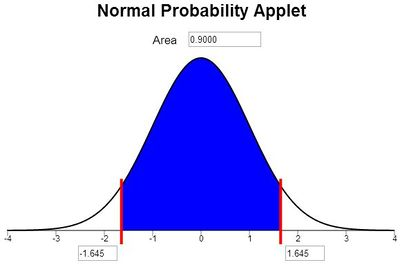

<script type="text/javascript">
 function showhide(id) {
    var e = document.getElementById(id);
    e.style.display = (e.style.display == 'block') ? 'none' : 'block';
 }
</script>


<div style="width:50%;float:right;">

#### Optional Videos for this Lesson {.tabset .tabset-pills}

##### Part 1

<iframe id="kaltura_player_1644542597" src="https://cdnapisec.kaltura.com/p/1157612/sp/115761200/embedIframeJs/uiconf_id/47306393/partner_id/1157612?iframeembed=true&playerId=kaltura_player_1644542597&entry_id=1_bmffh72n" width="480" height="270" allowfullscreen webkitallowfullscreen mozAllowFullScreen allow="autoplay *; fullscreen *; encrypted-media *" frameborder="0"></iframe>

##### Part 2

<iframe id="kaltura_player_1644542855" src="https://cdnapisec.kaltura.com/p/1157612/sp/115761200/embedIframeJs/uiconf_id/47306393/partner_id/1157612?iframeembed=true&playerId=kaltura_player_1644542855&entry_id=1_q22ujikq" width="480" height="270" allowfullscreen webkitallowfullscreen mozAllowFullScreen allow="autoplay *; fullscreen *; encrypted-media *" frameborder="0"></iframe>

##### Part 3

<iframe id="kaltura_player_1644543101" src="https://cdnapisec.kaltura.com/p/1157612/sp/115761200/embedIframeJs/uiconf_id/47306393/partner_id/1157612?iframeembed=true&playerId=kaltura_player_1644543101&entry_id=1_gyupa4ce" width="480" height="270" allowfullscreen webkitallowfullscreen mozAllowFullScreen allow="autoplay *; fullscreen *; encrypted-media *" frameborder="0"></iframe>

##### Part 4

<iframe id="kaltura_player_1644543358" src="https://cdnapisec.kaltura.com/p/1157612/sp/115761200/embedIframeJs/uiconf_id/47306393/partner_id/1157612?iframeembed=true&playerId=kaltura_player_1644543358&entry_id=1_ytcv298k" width="480" height="270" allowfullscreen webkitallowfullscreen mozAllowFullScreen allow="autoplay *; fullscreen *; encrypted-media *" frameborder="0"></iframe>

##### Part 5

<iframe id="kaltura_player_1644543549" src="https://cdnapisec.kaltura.com/p/1157612/sp/115761200/embedIframeJs/uiconf_id/47306393/partner_id/1157612?iframeembed=true&playerId=kaltura_player_1644543549&entry_id=1_7n4z1h2g" width="480" height="270" allowfullscreen webkitallowfullscreen mozAllowFullScreen allow="autoplay *; fullscreen *; encrypted-media *" frameborder="0"></iframe>

##### Part 6

<iframe id="kaltura_player_1644543853" src="https://cdnapisec.kaltura.com/p/1157612/sp/115761200/embedIframeJs/uiconf_id/47306393/partner_id/1157612?iframeembed=true&playerId=kaltura_player_1644543853&entry_id=1_x7e49tmb" width="480" height="270" allowfullscreen webkitallowfullscreen mozAllowFullScreen allow="autoplay *; fullscreen *; encrypted-media *" frameborder="0"></iframe>

####

</div><div style="clear:both;"></div>


## Lesson Outcomes

By the end of this lesson, you should be able to:

* Calculate and interpret a confidence interval for a population mean given a confidence level.
* Explain how the margin of error changes with the sample size and the level of confidence.
* Identify a point estimate and margin of error for the confidence interval.
* Show the appropriate connections between the numerical and graphical summaries that support this confidence interval.
* Check the requirements of the confidence interval.
* Calculate a desired sample size given a level of confidence and margin of error.

<br>

## Political Polls


During an election in the United States, many polls are conducted to determine the attitudes of likely voters.  Poll results are usually reported as percentages.  For example, a poll might state that 49% favor the Republican candidate and 51% favor the Democratic candidate.

Polls always include a **margin of error**.  The margin of error gives an estimate of the variability in the responses.  A common value for the margin of error in political polls is 3%.

When we consider the margin of error, we estimate that the true proportion of people who favor the Republican candidate is 49% &plusmn; 3%, or in other words, between 46% and 52%.  It is not obvious whether the Republican candidate is favored by more or less than 50% of the voters. In this case, the political race is too close to know who might win.

In this reading, we will explore the margin of error and its role in estimating a parameter.

<br>

## Background

### Point Estimators

We have learned about several statistics.  Remember, a statistic is any number computed based on data.  The sample statistics we have discussed are used to estimate population parameters.

<center>
<table>
<thead>
<tr class="header">
<th></th>
<th><p>Sample Statistic</p></th>
<th><p>Population Parameter</p></th>
</tr>
</thead>
<tbody>
<tr class="odd">
<td><p>Mean</p></td>
<td><p>$\bar x$</p></td>
<td><p>$\mu$</p></td>
</tr>
<tr class="even">
<td><p>Standard Deviation</p></td>
<td><p>$s$</p></td>
<td><p>$\sigma$</p></td>
</tr>
<tr class="odd">
<td><p>Variance</p></td>
<td><p>$s^2$</p></td>
<td><p>$\sigma^2$</p></td>
</tr>
<tr class="even">
<td><p>$\vdots$</p></td>
<td><p>$\vdots$</p></td>
<td><p>$\vdots$</p></td>
</tr>
</tbody>
</table>
</center>

<!--
<center>
{| class="wikitable"
!
! Sample Statistic
! Population Parameter
|-
| Mean
| align="center" | $\bar x$
| align="center" | $\mu$
|-
| Standard Deviation
| align="center" | $s$
| align="center" | $\sigma$
|-
| Variance
| align="center" | $s^2$
| align="center" | $\sigma^2$
|-
| align="center" | $\vdots$
| align="center" | $\vdots$
| align="center" | $\vdots$
|}
</center>
-->

The statistics above are called **point estimators** because they are just one number (one point on a number line) that is used to estimate a parameter.  Parameters are generally unknown values.  Think about the mean.  If $\mu$ is unknown, how do we know if $\bar x$ is close to it?

The short answer is that we will never know *for sure* if $\bar x$ is close to $\mu$.  This does not mean that we are helpless.  The laws of probability and the normal distribution provide a way for us to create a range of plausible values for a parameter (e.g. $\mu$) based on a statistic (e.g. $\bar x$).

### Interval Estimators

A point estimator gives one specific value as an estimate of a parameter.  An **interval estimator** is a range of plausible values for a parameter.  We can create an interval estimate by starting with a point estimate and adding or subtracting the margin of error.

In the political poll mentioned above, the point estimate for the support of the Republican candidate is 49%.  By adding and subtracting the margin of error, we get the interval estimate: 46% to 52%.

A **confidence interval** is a commonly used interval estimator.  In this reading, we will explore how to create a confidence interval for the mean when $\sigma$ is known.


### The Margin of Error

#### Properties of Bell-shaped Curves

The following questions will help you review your understanding of the normal distribution.

<div class="QuestionsHeading">Answer the following questions:</div>
<div class="Questions">
1. Fill in the blank in the following sentence.<br> "The 68-95-99.7% rule only applies for distributions that are _________."

<a href="javascript:showhide('Q1')"><span style="font-size:8pt;">Show/Hide Solution</span></a>
<div id="Q1" style="display:none;">
* The 68-95-99.7% rule only applies for distributions that are bell-shaped.
* In the past, some students have answered that the data must be normally distributed.  Actually, the 68-95-99.7% rule will work for any distribution that is mound-shaped and symmetrical.  As long as the data are unimodal and not skewed left or skewed right, this rule works well.
</div>
<br>

2. Approximately what percentage of data from a bell-shaped distribution will lie within two standard deviations of the mean?

<a href="javascript:showhide('Q2')"><span style="font-size:8pt;">Show/Hide Solution</span></a>
<div id="Q2" style="display:none;">
* Using the 68-95-99.7% rule, about 95% of the observations will lie within two standard deviations of the mean.
</div>
&nbsp;
</div>
<br>

#### The Distribution of the Sample Mean

We learned in the reading [Distribution of Sample Means & The Central Limit Theorem](Lesson06.html){target="_blank"} about the characteristics of the sample mean, $\bar x$.  Specifically, if the population from which the data are drawn is (i) approximately normal or (ii) if the sample size is large, then $\bar x$ will be approximately normally distributed.  Furthermore, if the original population has mean $\mu$ and standard deviation  $\sigma$, then the sampling distribution of $\bar x$ will have mean $\mu$ and standard deviation  $\sigma/\sqrt{n}$.

So, if either condition (i) or (ii) is met, then we can consider the sample mean $\bar x$ as a normal random variable with mean $\mu$ and standard deviation  $\sigma/\sqrt{n}$.  According to the 68-95-99.7% rule for symmetric bell-shaped distributions, about 95% of the time, the sample mean ($\bar x$) will lie within two standard deviations of the population mean ($\mu$).

This is an important concept.  Make sure that you understand the logic above before you continue reading.

#### How Far is $\bar x$ from $\mu$, or in other words, How Far is $\mu$ from $\bar x$?

Assuming that $\bar x$ is approximately normally distributed, about 95% of the time, it will be within two standard deviations of $\mu$.  


Remember, the standard deviation of $\bar x$ is $\frac{\sigma}{\sqrt{n}}$.  For the variable $\bar x$, two standard deviations would be equal to $2 \frac{\sigma}{\sqrt{n}}$.  

If we collect a random sample from a population and $\bar x$ is normally distributed, then about 95% of the time the sample mean $\bar x$ will be less than $2 \frac{\sigma}{\sqrt{n}}$ units away from the population mean $\mu$.  Notice that this is true, whether or not we know $\mu$.

We can express this as a probability statement:

$$
P\left( \mu - 2 \frac{\sigma}{\sqrt{n}} < \bar X < \mu + 2 \frac{\sigma}{\sqrt{n}} \right) \approx 0.95
$$

Here is the magic:  If $\bar x$ is within 2 standard deviations of $\mu$, then $\mu$ is within 2 standard deviations of $\bar x$.  It may seem silly to state it, but this is very important.

<a href="javascript:showhide('math')"><span style="font-size:8pt;">Click here if you love math</span></a>
<div id="math" style="display:none;">
<!--
{| width="100%" bgcolor="#000000" border="0" cellpadding="3px" cellspacing="2px" style="margin:auto;"
|- valign="top" align="left" style="background: #ffffff;"
-->

Starting with
$$\mu - 2 \frac{\sigma}{\sqrt{n}} < \bar X < \mu + 2 \frac{\sigma}{\sqrt{n}}$$
We subtract $\mu$ from all parts of the inequality:
$$\mu - 2 \frac{\sigma}{\sqrt{n}} - \mu < \bar X - \mu  < \mu + 2 \frac{\sigma}{\sqrt{n}} - \mu$$
Which reduces to
$$- 2 \frac{\sigma}{\sqrt{n}}  < \bar X - \mu  <  2 \frac{\sigma}{\sqrt{n}}$$
Now, subtract $\bar X$ from all the terms:
$$- 2 \frac{\sigma}{\sqrt{n}} - \bar X < \bar X - \mu -\bar X <  2 \frac{\sigma}{\sqrt{n}} -\bar X$$
And this simplifies to
$$- 2 \frac{\sigma}{\sqrt{n}}-\bar X < -\mu <  2 \frac{\sigma}{\sqrt{n}}-\bar X$$
Multiplying all the terms by $-1$, we get
$$2 \frac{\sigma}{\sqrt{n}}+\bar X > \mu >  -2 \frac{\sigma}{\sqrt{n}}+\bar X$$
Rewriting this reversing the order of the terms, we get
$$\bar X - 2 \frac{\sigma}{\sqrt{n}} < \mu <  \bar X + 2 \frac{\sigma}{\sqrt{n}}$$

</div>
<br>

So, the statement
$$
P\left( \mu - 2 \frac{\sigma}{\sqrt{n}} < \bar X < \mu + 2 \frac{\sigma}{\sqrt{n}} \right) \approx 0.95
$$
is equivalent to the statement
$$
P\left( \bar X - 2 \frac{\sigma}{\sqrt{n}} < \mu < \bar X + 2 \frac{\sigma}{\sqrt{n}} \right) \approx 0.95
$$

<br>

## Putting It All Together: Confidence Intervals for $\mu$ when $\sigma$ is Known

Notice that if we know $\sigma$, then with approximately 95% confidence, $\mu$ will be between the following two values:
$$\left( \bar X - 2 \frac{\sigma}{\sqrt{n}}, ~ \bar X + 2 \frac{\sigma}{\sqrt{n}} \right)$$
This equation gives a confidence interval for $\mu$.  

A confidence interval is actually a point estimate $\left( \bar x \right)$ plus or minus the margin of error $\left( 2 \frac{\sigma}{\sqrt{n}} \right)$.  

We use the letter $m$ to denote the margin of error:
$$m = 2 \frac{\sigma}{\sqrt{n}}$$
Using this definition for $m$, our confidence interval can be written as
$$( \bar x - m, ~ \bar x + m )$$
or
$$\bar x \pm m$$
This pattern will be repeated throughout the course as we create confidence intervals of the form:
$$
\left(
\begin{align}
point~ ~ ~ &      & margin~  &        & point~ ~ ~ &      & margin~  \\
estimate   & ~ ~- & of~error & ~ ~,   & estimate   & ~ ~+ & of~error
\end{align}
\right)
$$
or
$$(\text{point estimate}) \pm (\text{margin of error})$$
</br>
<a id="z"></a>


### A Little More Precision

#### What $z$ Corresponds to 95% of the Area?

The 68-95-99.7% Rule for bell-shaped distribution is just a quick approximation.  This is useful for estimation, but more precision is usually required.

<div class="QuestionsHeading">Answer the following question:</div>
<div class="Questions">
3. For a standard normal distribution, between what two $z$-scores will 95% of the data fall?  In other words, find the values $-z$ and $z$ such that the area between them is equal to 0.95.  Use the
[Normal Probability Applet](http://statistics.byuimath.com/index.php?title=Normal_Probability_Applet){target="_blank"}.

<a href="javascript:showhide('hint')"><span style="font-size:8pt;">Click here for a hint</span></a>
<div id="hint" style="display:none;">
- To find the value of $z^*$, given a specific confidence level, do the following:
  + *Open the applet at [Normal Probability Applet](http://statistics.byuimath.com/index.php?title=Normal_Probability_Applet){target="_blank"}
  + Shade the area between the two red lines (the middle portion of the graph) only and enter the decimal value for the desired percentage (e.g. 0.95 for 95%) in the *Area* box.
  + The value of $z^*$ will be displayed below. Two numbers will be given along the horizontal axis.  The only difference in these numbers is their sign: one is positive and one is negative. The positive value is the desired $z^*$.
</div>
<br>

<a href="javascript:showhide('Q3')"><span style="font-size:8pt;">Show/Hide Solution</span></a>
<div id="Q3" style="display:none;">
* 95% of the area under the standard normal curve is between $z=-1.96$ and $z=1.96$


* For normally distributed data, 95% of the observations will fall within 1.96 standard deviations of the mean.
</div>
&nbsp;
</div>
<br>

The actual formula for a 95% confidence interval for $\mu$ (when $\sigma$ is known) is:
$$
\left( \bar x - 1.96 \frac{\sigma}{\sqrt{n}}, \bar x + 1.96 \frac{\sigma}{\sqrt{n}} \right)
$$
Please notice that the number 2 was used as an approximation for the actual value of 1.96. When computing a 95% confidence interval for a mean with $\sigma$ known, please use 1.96 in the equation.

#### Worked Example: Rolling a Die 25 Times


We will compute a 95% confidence interval for the mean of $n=25$ rolls of a fair die.
A die was rolled 25 times.  The values rolled were:
$$
3 ~ ~ ~ 1 ~ ~ ~ 2 ~ ~ ~ 1 ~ ~ ~ 1 ~ ~ ~ 2 ~ ~ ~ 4 ~ ~ ~ 1 ~ ~ ~ 1 ~ ~ ~ 2 ~ ~ ~ 6 ~ ~ ~ 5 ~ ~ ~ 6 ~ ~ ~ 3 ~ ~ ~ 4 ~ ~ ~ 2 ~ ~ ~ 2 ~ ~ ~ 5 ~ ~ ~ 6 ~ ~ ~ 2 ~ ~ ~ 6 ~ ~ ~ 4 ~ ~ ~ 1 ~ ~ ~ 1 ~ ~ ~ 5
$$
The mean of these values is $\bar x = 3.04$.
It is a fact that for the outcome of a six-sided die, $\sigma=\sqrt{\frac{35}{12}} \approx 1.7078$.

Applying the formula for a 95% confidence interval,
$$
\left( \bar x - z^* \frac{\sigma}{\sqrt{n}}, ~ \bar x + z^* \frac{\sigma}{\sqrt{n}} \right)
$$
we get:
$$
\left( 3.04 - 1.96 \frac{1.7078}{\sqrt{25}}, ~ 3.04 + 1.96 \frac{1.7078}{\sqrt{25}} \right)
$$
or
$$
(2.37, ~ 3.71)
$$

#### <a id = "z*"></a>What about Other Confidence Levels?

Most of the time, researchers report 95% confidence intervals.  The number 95% is called the **confidence level**.  Sometimes it is desirable to use a level of confidence that is different than 95%.  In that case, we need to use a number besides 1.96 in the calculations.

Suppose we want to create a 90% confidence interval.  What value would we put in the blanks in the confidence interval formula below?
$$
\left( \bar x - \underline{~ ~ ~ ? ~ ~ ~} \frac{\sigma}{\sqrt{n}}, ~ \bar x + \underline{~ ~ ~ ? ~ ~ ~} \frac{\sigma}{\sqrt{n}} \right)
$$
Another way to state this question is to ask, between what two $z$-scores will 90% of the data in a standard normal distribution fall?  We need to find the values of $-z$ and $z$ such that the area between them is equal to 0.90.  Again, we use the [Normal Probability Applet](http://statistics.byuimath.com/index.php?title=Normal_Probability_Applet){target="_blank"}.



So, for a 90% confidence interval, the value of $z*$ would be 1.645.  Note: We use an asterisk ($*$) to indicate that $z$ was not computed from data, but was determined based on a *chosen* confidence level, 90%.

The formula for a 90% confidence interval for a mean when $\sigma$ is known is:
$$
\left( \bar x - 1.645 \frac{\sigma}{\sqrt{n}}, ~ \bar x + 1.645 \frac{\sigma}{\sqrt{n}} \right)
$$

When $\sigma$ is known, we use $z^* = 1.96$  to create 95% confidence intervals, and we use $z^* = 1.645$ to create 90% confidence intervals.

#### Formula for the Confidence Interval for $\mu$ ($\sigma$ Known)

With this notation, the confidence interval formula generalizes to:
$$
\left( \bar x - z^* \frac{\sigma}{\sqrt{n}}, ~ \bar x + z^* \frac{\sigma}{\sqrt{n}} \right)
$$

where $z^*$ is determined by the level of confidence.  If you want a 90% confidence interval, then $z^*$ is the number of standard deviations on either side of the mean that you must go to capture 90% of the data.


<div class="QuestionsHeading">Answer the following questions:</div>
<div class="Questions">

4. If $\bar x$ follows a normal distribution and $\sigma$ is known, what is the equation for a 99% confidence interval for the true population mean?

<a href="javascript:showhide('Q4')"><span style="font-size:8pt;">Show/Hide Solution</span></a>
<div id="Q4" style="display:none;">

- For a 99% confidence level, $z^* = 2.576$.  The equation for the 99% confidence interval becomes:

<center>
$$
\left( \bar x - 2.576 \frac{\sigma}{\sqrt{n}}, ~ \bar x + 2.576 \frac{\sigma}{\sqrt{n}} \right)
$$
</center>
</div>
<br>

5. Apply the equation from the previous problem to find a 99% confidence interval for the mean value rolled on the die.  Use the data given above.  For convenience, they are reproduced here:

$$
3 ~ ~ ~ 1 ~ ~ ~ 2 ~ ~ ~ 1 ~ ~ ~ 1 ~ ~ ~ 2 ~ ~ ~ 4 ~ ~ ~ 1 ~ ~ ~ 1 ~ ~ ~ 2 ~ ~ ~ 6 ~ ~ ~ 5 ~ ~ ~ 6 ~ ~ ~ 3 ~ ~ ~ 4 ~ ~ ~ 2 ~ ~ ~ 2 ~ ~ ~ 5 ~ ~ ~ 6 ~ ~ ~ 2 ~ ~ ~ 6 ~ ~ ~ 4 ~ ~ ~ 1 ~ ~ ~ 1 ~ ~ ~ 5
$$

<a href="javascript:showhide('Q5')"><span style="font-size:8pt;">Show/Hide Solution</span></a>
<div id="Q5" style="display:none;">
- If we were making a 99% confidence interval, we follow the same procedure as for a 95% confidence interval, only we use $z^*=2.576$.  The 99% confidence interval for the true mean is:

$$
\left( 3.04 - 2.576 \frac{1.7078}{\sqrt{25}}, ~ 3.04 + 2.576 \frac{1.7078}{\sqrt{25}} \right)
$$

which simplifies to:

$$
(2.16, ~ 3.92)
$$
</div>
&nbsp;
</div>
<br>

<!-- <span id="z"></span> -->
The most commonly used values for $z^*$ are:

<center>
<table>
<thead>
<tr class="header">
<th><p>Confidence<br />
Level</p></th>
<th><p>$z^*$</p></th>
</tr>
</thead>
<tbody>
<tr class="odd">
<td><p>90%</p></td>
<td><p>1.645</p></td>
</tr>
<tr class="even">
<td><p>95%</p></td>
<td><p>1.960</p></td>
</tr>
<tr class="odd">
<td><p>99%</p></td>
<td><p>2.576</p></td>
</tr>
<tr class="even">
<td></td>
<td></td>
</tr>
</tbody>
</table>
</center>

<!-- <center> -->
<!-- {| class="wikitable" style="text-align:center" -->
<!-- ! Confidence <br> Level || $z^*$ -->
<!-- |- -->
<!-- |90%        || 1.645 -->
<!-- |- -->
<!-- |95%        || 1.960 -->
<!-- |- -->
<!-- |99%        || 2.576 -->
<!-- |- -->
<!-- |} -->
<!-- </center> -->

Any other values that you need can be determined using the Normal Probability Applet.

<!--
#### Example: Confidence Interval for a Mean of Die Rolls


Roll a fair, six sided die 25 times.  Find the mean of the values you rolled. Record your results and find the mean $\bar x$.

<center>
{| class="wikitable"
|-
|
**Note:** ``die* is the singular form for ``dice.*
|}
</center>


The parameter $\mu$ is the mean of all the values you would roll with your die if you continued rolling it forever.  Usually, we do not know the value of $\mu$, so we estimate it by the value $\bar x$.

For the roll of a fair six-sided die, the standard deviation is $\sigma=\sqrt{\frac{35}{12}} \approx 1.7078$.  In order to do this computation, we must know $\sigma$, the population standard deviation.  This number will be given to you when needed.

SPSS does not have a built-in routine to compute a confidence interval for a mean when $\sigma$ is unknown.  This is not a flaw in SPSS, but it reflects the fact that in practice, we never know $\sigma$.
-->

### Factors Affecting the Width of the Confidence Interval

Recall that the formula to compute the confidence interval for a mean, where $\sigma$ is known is:

$$
\left( \bar x - z^* \frac{\sigma}{\sqrt{n}}, ~ \bar x + z^* \frac{\sigma}{\sqrt{n}} \right)
$$

<div class="QuestionsHeading">Answer the following questions:</div>
<div class="Questions">

6. What would happen to the confidence interval if the sample size $n$ was increased, but the other values were still the same?

<a href="javascript:showhide('Q6')"><span style="font-size:8pt;">Show/Hide Solution</span></a>
<div id="Q6" style="display:none;">
- Since the sample size $n$ is in the denominator, if $n$ is increased, $\sqrt{n}$ would increase, and the fraction $\frac{\sigma}{\sqrt{n}}$ would decrease, which would lead to a smaller margin of error.  In other words, if the sample size is increased, the width of a confidence interval will decrease--it will become narrower.
</div>
<br>

7. What would happen to the confidence interval if the confidence level were increased, say from 95% to 99%?

<a href="javascript:showhide('Q7')"><span style="font-size:8pt;">Show/Hide Solution</span></a>
<div id="Q7" style="display:none;">

- Increasing the confidence level will lead to larger values of $z^*$.  If $z^*$ is increased, then the margin of error $z^* \frac{\sigma}{\sqrt{n}}$ would increase.  This would lead to a wider confidence interval.
</div>
&nbsp;
</div>
<br>

### Interpretation of Confidence Intervals


How do we interpret confidence intervals?  What do they really mean?

<center>


(Image source: Flickr/ICMA Photos)
</center>
<br>

Consider a coin with two sides: one called "heads" and the other called "tails". Imagine that you flipped this coin, but you have not looked at it yet.  What is the probability that the coin shows heads?  

Strangely enough, the answer is, it depends! If the head is facing up, then the probability that the coin shows heads is 1.  If the head is facing down, then the probability that it shows heads is 0.  

The coin has been tossed.  There is no randomness left in the process.  So, either the head is facing up or it is facing down.  So, the probability that the coin shows heads is either 1 or 0.  (We just don't know which.)  The fact that we do not know the outcome does not change it or make it random.  

Before we toss the coin, the probability that the coin will show heads is $\frac{1}{2}=0.5$.  After we toss the coin, the probability that we get heads is 1 or 0.

Transferring this reasoning to confidence intervals, we get a similar result.  

Once we have collected data on something, there is no randomness in the system.  Any confidence interval that is created using that data will either contain the true parameter ($\mu$) or it will not.  After collecting data, the probability that a specific confidence interval will contain $\mu$ is either 1 or 0.

<br>
<div class="message Tip">The correct interpretation of a 95% confidence interval is to say, "We are 95% confident that the true mean lies within the lower and upper bounds of the confidence interval."</div>
<br>
<br>

Consider the 95% confidence interval for the true mean of 25 rolls of a fair die. We found the 95% confidence interval to be: $(2.37, 3.71)$.  
When we interpret this confidence interval, we say, "We are 95% *confident* that the true mean is between 2.37 and 3.71."

The word, "confident" implies that if we repeated this process many, many times, 95% of the confidence intervals we would get would contain the true mean $\mu$.  It does not imply anything about whether or not one specific confidence interval will contain the true mean.

We do not say that "there is a 95% probability (or chance) that the true mean is between 2.37 and 3.71."  The probability that the true mean $\mu$ is between 2.37 and 3.71 is either 1 or 0.

### Requirements

There are three requirements that need to be checked when computing a confidence interval for a mean with $\sigma$ known:

1. A simple random sample was drawn from the population
2. $\bar x$ is normally distributed
3. $\sigma$ is assumed to be known

The requirement of normality is satisfied if (a) the raw data are normally distributed or (b) the sample size is large.  This procedure is robust to moderate departures from normality.  Even if the requirement that $\bar x$ is normally distributed is not satisfied perfectly, it is usually okay to conduct the test.

In practice, we never really know $\sigma$.  This procedure is primarily used to help you understand the idea of confidence intervals. When $\sigma$ is unknown, we use a slightly different computation.

### Example: Costs of CABG Surgery

<center>


(Photo credit: Vanderbilt Photo/Neil Brake)
</center>
<br>

This reading focuses on an important aspect of designing a study: determining the sample size.


It is important for health care administrators to know the mean hospital costs for patients who have <u>c</u>oronary <u>a</u>rtery <u>b</u>ypass <u>g</u>raft (CABG) surgery.  A large hospital is planning a study to determine their mean costs for patients who have CABG surgery.

A study will be conducted in which the charts of patients who had CABG surgery will be sampled, and their hospital costs will be recorded.  For budgetary reasons, the hospital administrators do not want to collect a sample that is too large.  However, if the sample size is not large enough, the confidence interval will be too wide to be useful as a planning tool.

After a discussion among the senior administration, they have determined that they want to estimate the mean hospital costs of CABG surgery within $2000 (i.e., plus or minus \$2000.)  In other words, they want the confidence interval for the true mean to have a margin of error of \$2000 dollars.

Recall the equation for the confidence interval is:
$$
\left( \bar x - z^* \frac{\sigma}{\sqrt{n}}, \bar x + z^* \frac{\sigma}{\sqrt{n}} \right)
$$
The part of the equation that is added to and subtracted from $\bar x$ is called the **margin of error**.  We will denote the margin of error by the letter $m$.
$$
m=z^* \frac{\sigma}{\sqrt{n}}
$$
To use this formula, the parameter $\sigma$ must be given to us.  It is the true standard deviation of the data you are observing. If you do not know $\sigma$, you can estimate it using the standard deviation reported in a previous study or by conducting a pilot study.
A study published by another hospital reported that the standard deviation of the costs for CABG surgery was \$28,705. <!--<cite>Chu09</cite>-->

In the following questions, you will compute the margin of error, $m$, for a future study of the hospital costs for CABG surgery.  The hospital administrators want to use a 95% level of confidence. Assume the standard deviation can be estimated to be $\sigma = \$28,705$.

<div class="QuestionsHeading">Answer the following questions:</div>
<div class="Questions">
8. If the hospital administrators want to be 95% confident in the results, what should the value of $z^*$ be?

<a href="javascript:showhide('Q8')"><span style="font-size:8pt;">Show/Hide Solution</span></a>
<div id="Q8" style="display:none;">
<center>
$$
\begin{align}
z^*=1.96
\end{align}
$$
</center>
</div>
<br>

9. If the hospital collects a sample of $n=100$ patients' costs, what would the margin of error be?

<a href="javascript:showhide('Q9')"><span style="font-size:8pt;">Show/Hide Solution</span></a>
<div id="Q9" style="display:none;">
<center>
$$
\begin{array}{1cl}
m &= z^* \frac{\sigma}{\sqrt{n}} \\
&= 1.96 \cdot \frac{28705}{\sqrt{100}} \\
&= \$5626.18
\end{array}
$$
</center>
</div>
<br>

10. If the hospital collects a sample of $n=1000$ patients' costs, what would the margin of error be?

<a href="javascript:showhide('Q10')"><span style="font-size:8pt;">Show/Hide Solution</span></a>
<div id="Q10" style="display:none;">
<center>
$$
\begin{array}{1cl}
m &= z^* \frac{\sigma}{\sqrt{n}} \\
&= 1.96 \cdot \frac{28705}{\sqrt{1000}} \\
&= \$1779.15
\end{array}
$$
</center>
</div>
<br>

11. Choose any other value for the sample size, $n$. Find the margin of error for your sample size.

<a href="javascript:showhide('Q11')"><span style="font-size:8pt;">Show/Hide Solution</span></a>
<div id="Q11" style="display:none;">
* Answers will vary.
</div>
<br>

12. Repeat Question 11 until you find the sample size that will yield a margin of error as close to \$2000 as possible, without going over.

<a href="javascript:showhide('Q12')"><span style="font-size:8pt;">Show/Hide Solution</span></a>
<div id="Q12" style="display:none;">
<center>
$$
n = 792
$$
</center>
</div>
&nbsp;
</div>
<br>

## Sample Size Calculations

The process you followed in Questions 8 - 12 is effective, but tedious.  There must be an easier way!  The trick is to solve the margin of error equation $m = z^* \frac{\sigma}{\sqrt{n}}$ for $n$.

<a href="javascript:showhide('math2')"><span style="font-size:8pt;">Click here if you love math</span></a>
<div id="math2" style="display:none;">

$$m = z^* \frac{\sigma}{\sqrt{n}}$$
Multiply both sides of the equation by $\sqrt{n}$:
$$m \cdot \sqrt{n} = z^* \frac{\sigma}{\sqrt{n}} \cdot \sqrt{n}$$
Which reduces to:
$$m \cdot \sqrt{n} = z^* \cdot \sigma$$
Divide both sides of the equation by $m$.
Cancelling the $m$'s on the left hand side:
$$\sqrt{n} = \frac{z^* \cdot \sigma}{m}$$
Squaring both sides:
$$\left( \sqrt{n} \right)^2 = \left( \frac{z^* \cdot \sigma}{m} \right)^2$$
Which simplifies to the desired result:
$$n  = \left( \frac{z^* \cdot \sigma}{m} \right)^2$$
</div>


This gives us the **sample size formula**, which tells the number of observations required in order to obtain a specified margin of error:
$$
n = \left( \frac{z^*\sigma}{m} \right)^2
$$

Once the level of confidence is selected, $z^*$ is automatically determined. In practice, the most common level of confidence is 95%, which means that $z^*$ would equal 1.96.

<br>
<div class="message Note">If you need a reminder on finding the value of $z^*$, click [here](#z).</div>
<br>
<br>


<div class="QuestionsHeading">Answer the following question:</div>
<div class="Questions">
13. In Question 12, you used the process of guess-and-check to find the sample size. For this question, use the sample size formula to compute the sample size required to estimate the mean cost of CABG surgery, $\mu$, within \$2000 with 95% confidence. Recall that in a previous study, the standard deviation was found to be $\sigma = \$28,705$. <!--<cite>Chu09</cite>-->

<a href="javascript:showhide('Q13')"><span style="font-size:8pt;">Show/Hide Solution</span></a>
<div id="Q13" style="display:none;">
<center>
$$
\begin{align}
n &= \left( \frac{z^*\sigma}{m} \right)^2 \\
&= \left( \frac{1.96 \cdot 28705}{2000} \right)^2 \\
&= 791.3
\end{align}
$$
</center>
</div>
&nbsp;
</div>
<br>

### Rounding Up

In Question 13, you computed the sample size required to get a margin of error of \$2000.  Notice that the result was 791.3, which is not a whole number.  What does that mean?  Does that suggest that you will survey only a fraction of the last patient's costs?  Of course not!

When doing sample size calculations, if the answer is not a whole number, you *always round up to the next highest whole number*.  This will allow you to get a sample size that is large enough to attain your desired margin of error.  If you want to estimate the mean cost of CABG surgery within \$2000 with 95% confidence, you will need to survey the files of 792 patients.

<br>
<div class="message Tip">When doing sample size calculations, you *always* round *up*.</div>
<br>
<br>

<div class="QuestionsHeading">Answer the following questions:</div>
<div class="Questions">
14. Answer this question without doing any computations.  If the hospital administrators wanted to estimate the mean cost of CABG surgery with a margin of error of \$1000 at the 95% confidence level, should the sample size be larger or smaller than $n=792$?

<a href="javascript:showhide('Q14')"><span style="font-size:8pt;">Show/Hide Solution</span></a>
<div id="Q14" style="display:none;">
* In question 5, we determined that the sample size required to have a margin of error of $2000 is 792.  
The margin of error is in the denominator of the sample size formula.  If we want to reduce the margin of error, we need to increase the sample size.  The sample size should be larger than $n=792$.
</div>
<br>

15. Find the sample size required to estimate the mean cost of CABG surgery with a margin of error of \$1000 and with a 95% confidence level.

<a href="javascript:showhide('Q15')"><span style="font-size:8pt;">Show/Hide Solution</span></a>
<div id="Q15" style="display:none;">
<center>
$$
\begin{array}{1cl}
n &= \left( \frac{z^*\sigma}{m} \right)^2 \\
&= \left( \frac{1.96 \cdot 28705}{1000} \right)^2 \\
&= 3165.4
\end{array}
$$
</center>
 We always round up in sample size calculations, so the required sample size is $n=3166$.
</div>
<br>

16. What happened to the sample size required when the margin of error is cut in half from \$2000 to \$1000?

<a href="javascript:showhide('Q16')"><span style="font-size:8pt;">Show/Hide Solution</span></a>
<div id="Q16" style="display:none;">
* If we divide the two sample sizes, we get:
<center>

$$
\frac{3166}{792} \approx 4
$$
</center>
* In order to reduce the margin of error by half, we need to quadruple the sample size.
</div>
<br>

17. Remember the sample size required to have a margin of error of \$2000 at the 95% level of confidence is $n=792$.  If we wanted to estimate the mean cost with the same margin of error at the 99% level of confidence, would the sample size be larger or smaller?

<a href="javascript:showhide('Q17')"><span style="font-size:8pt;">Show/Hide Solution</span></a>
<div id="Q17" style="display:none;">
* The value of $z^*$ would increase from 1.96 to 2.576, which would increase the required sample size.
</div>
<br>

18. Find the sample size required to estimate the mean cost of CABG surgery with a margin of error of \$2000 and at the 99% confidence level.

<a href="javascript:showhide('Q18')"><span style="font-size:8pt;">Show/Hide Solution</span></a>
<div id="Q18" style="display:none;">
<center>
$$
\begin{array}{1cl}
n &= \left( \frac{z^*\sigma}{m} \right)^2 \\
&= \left( \frac{2.576 \cdot 28705}{2000} \right)^2 \\
&= 1366.9
\end{array}
$$
</center>
We always round up in sample size calculations, so the required sample size is $n=1367$.
</div>
<br>

19. If we increase the confidence level, what happens to the required sample size?

<a href="javascript:showhide('Q19')"><span style="font-size:8pt;">Show/Hide Solution</span></a>
<div id="Q19" style="display:none;">
* If we increase the confidence level the required sample size also increases.
</div>
&nbsp;
</div>
<br>

### Example: Grade Inflation

The administration at BYU-Idaho is concerned about the possibility of grade inflation in their courses. Grades in a course are coded on a scale from 0 to 4, as given in the following table:

<center>
```{r echo=FALSE, message=FALSE, warning = FALSE}
library(pander)

grd <- data.frame("A"  = 4.0,
                  "A-" = 3.7,
                  "B+" = 3.3,
                  "B"  = 3.0,
                  "B-" = 2.7,
                  "C+" = 2.3,
                  "C"  = 2.0,
                  "C-" = 1.7,
                  "D+" = 1.3,
                  "D"  = 1.0,
                  "D-" = 0.7,
                  "F"  = 0.0)
colnames(grd)<-c("A", "A-", "B+", "B", "B-", "C+", "C", "C-", "D+", "D", "D-", "F")
pander(grd)
```
</center>

<!-- <center> -->
<!-- {| class="wikitable" style="text-align:center" -->
<!-- |colspan="12" | Grade Point Scale at BYU-Idaho -->
<!-- |- -->
<!-- |A || A- || B+ || B || B- || C+ || C || C- || D+ || D || D- || F -->
<!-- |- -->
<!-- | 4.0 || 3.7 || 3.3 || 3.0 || 2.7 || 2.3 || 2.0 || 1.7 || 1.3 || 1.0 || 0.7 || 0.0 -->
<!-- |- -->
<!-- |} -->
<!-- </center> -->

Historical records indicate that the standard deviation of the numerical value for the grades students' receive in a course is $\sigma = 0.68$.

Due to the confidential nature of grades, the administration will not release the current value of the mean grade earned on campus.  An old reference indicates that the true mean value of the grades earned at BYU-Idaho students is 3.15.  It would be interesting to estimate the current mean grade point average at BYU-Idaho.

You have been asked to help study the issue of grade inflation at BYU-Idaho.  A certain number of individual grades will need to be sampled to estimate the mean grade earned at BYU-Idaho.  

<div class="QuestionsHeading">Answer the following questions:</div>
<div class="Questions">
20. What sample size would be required to estimate the true mean grade earned at BYU-Idaho with 95% confidence and a margin of error of 0.2 grade points?

<a href="javascript:showhide('Q20')"><span style="font-size:8pt;">Show/Hide Solution</span></a>
<div id="Q20" style="display:none;">
<center>
$$
\begin{array}{1cl}
n &= \left( \frac{z^*\sigma}{m} \right)^2 \\
&= \left( \frac{1.96 \cdot 0.68}{0.2} \right)^2 \\
&= 44.4
\end{array}
$$
</center>
* We always round up in sample size calculations, so the required sample size is $n=45$.
</div>
<br>

21. What sample size would be required to estimate the true mean grade earned at BYU-Idaho with 98% confidence and a margin of error of 0.2 grade points?

<a href="javascript:showhide('Q21')"><span style="font-size:8pt;">Show/Hide Solution</span></a>
<div id="Q21" style="display:none;">
* Using the Normal Probability Applet, we find that $z^* = 2.3263$ for a 98% confidence level.  
<center>

$$
\begin{array}{1cl}
n &= \left( \frac{z^*\sigma}{m} \right)^2 \\
&= \left( \frac{2.3263 \cdot 0.68}{0.2} \right)^2 \\
&= 62.6
\end{array}
$$
</center>
* We always round up in sample size calculations, so the required sample size is $n=63$.
</div>
<br>

22. What sample size would be required to estimate the true mean grade earned at BYU-Idaho with 95% confidence and a margin of error of 0.1 grade points?

<a href="javascript:showhide('Q22')"><span style="font-size:8pt;">Show/Hide Solution</span></a>
<div id="Q22" style="display:none;">
<center>

$$
\begin{array}{1cl}
n &= \left( \frac{z^*\sigma}{m} \right)^2 \\
&= \left( \frac{1.96 \cdot 0.68}{0.1} \right)^2 \\
&= 177.6
\end{array}
$$
</center>
We always round up in sample size calculations, so the required sample size is $n=178$.
</div>
<br>

23. What sample size would be required to estimate the true mean grade earned at BYU-Idaho with 98% confidence and a margin of error of 0.1 grade points?

<a href="javascript:showhide('Q23')"><span style="font-size:8pt;">Show/Hide Solution</span></a>
<div id="Q23" style="display:none;">
<center>
$$
\begin{array}{1cl}
n &= \left( \frac{z^*\sigma}{m} \right)^2 \\
&= \left( \frac{2.326 \cdot 0.68}{0.1} \right)^2 \\
&= 250.2
\end{array}
$$
</center>
We always round up in sample size calculations, so the required sample size is $n=251$.
</div>
&nbsp;
</div>
<br>
<br>

## Comments

What confidence level should be used?  The most common choice for the confidence level is 95%.  Other values are occasionally used, but this tends to meet the needs of most researchers.

How do we find the value of $\sigma$?  In a statistics class, this number will be given to you in the problem.  In real life, you will need to estimate this value based on either ($i$) a previous study, ($ii$) the results of a pilot study, or ($iii$) your best professional judgement (an educated guess).  Sometimes it is not possible to use data from a previous study or to easily conduct a pilot study.  In these cases, the only thing a researcher can do is to use their understanding of the process to make a good guess of the value of $\sigma$.
Ultimately, sample size calculations are nothing more than a good estimate of the actual sample size that will be required.

In many cases, budgets will limit the sample size that can be drawn.  A researcher must assess whether a smaller-than-ideal sample will suffice for their needs.  This is one of the difficult issues that arises in the actual practice of statistics.

<br>

## Summary

<div class="SummaryHeading">Remember...</div>
<div class="Summary">
- The **margin of error** gives an estimate of the variability of responses. It is calculated as $\displaystyle{m=z^*\frac{\sigma}{\sqrt{n}}}$ where $z^*$ represents a calculated z-score corresponding to a particular confidence level.

- A **confidence interval** is an interval estimator used to give a range of plausible values for a parameter. The width of a confidence interval depends on the chosen confidence level (and its corresponding value of $z^*$) as well as the sample size ($n$). This is the equation for calculating confidence intervals:
$$\displaystyle{\left(\bar x-z^*\frac{\sigma}{\sqrt{n}},~\bar x+z^*\frac{\sigma}{\sqrt{n}}\right)}$$

- The **sample size formula** allows us to estimate the number of observations required to obtain a specific margin of error. $\displaystyle{n=\left(\frac{z^*\sigma}{m}\right)^2}$
</div>
<br>


## Navigation

<center>
| **Previous Reading** | **This Reading** | **Next Reading** |
| :------------------: | :--------------: | :--------------: |
| [Lesson 9: <br> Inference for One Mean: Sigma Known (Hypothesis Test)](Lesson09.html) | Lesson 10: <br> Inference for One Mean: Sigma Known (Confidence Interval) | [Lesson 11: <br> Inference for One Mean: Sigma Unknown](Lesson11.html) |
</center>
