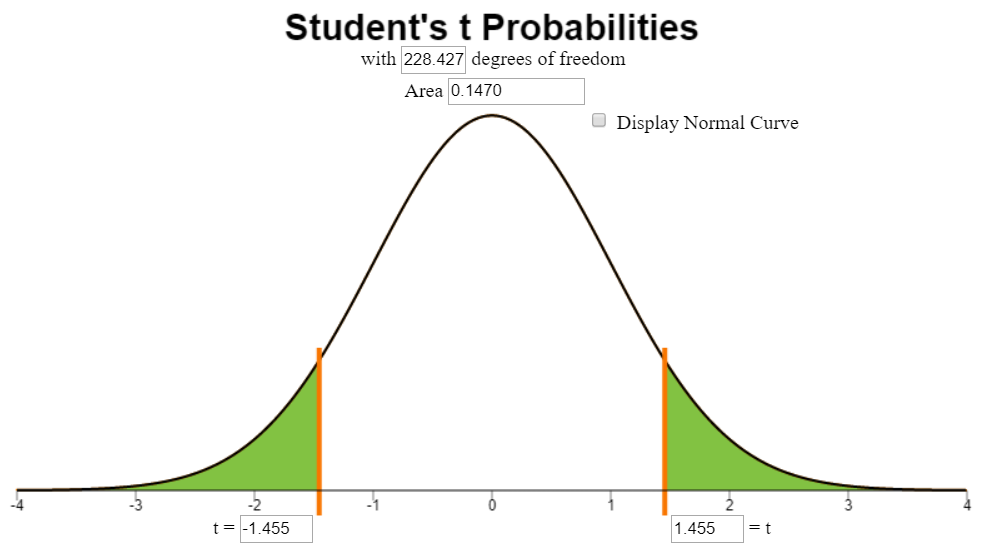
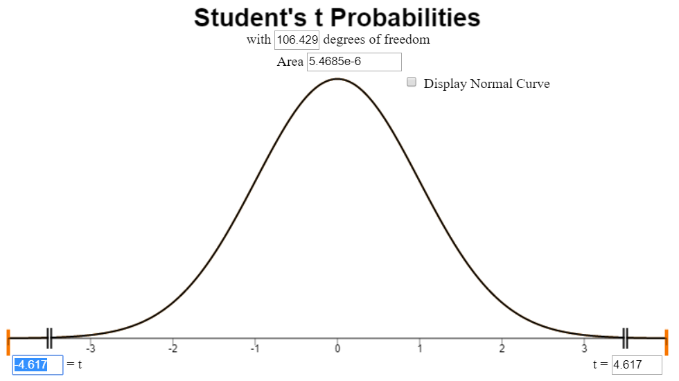
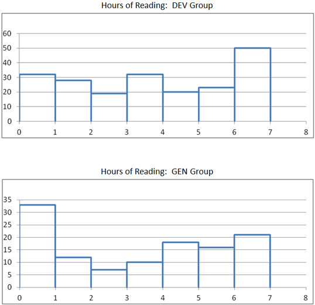

<iframe width="340" align="center" src="http://www.youtube.com/embed/videoseries?list=PLaZryQtbPQC9m8e_GQgx8fVfP55cI0L9z" frameborder="0" allow="autoplay; encrypted-media" allowfullscreen></iframe>

<a href="javascript:showhide('Q2')">Show/Hide Solution</a>

{{YouTubeLesson|url=http://www.youtube.com/embed/videoseries?list=PLaZryQtbPQC8q6v33gWLuWgiwoHSKRslw}}

## Lesson Outcomes

<a href="javascript:showhide('Q2')">Show/Hide Solution</a>

By the end of this lesson, you should be able to:
:* Confidence Intervals for difference of two means of independent samples: 
:** Calculate and interpret a confidence interval given a confidence level and a given parameter.
:** Identify a point estimate and margin of error for the confidence interval.
:** Show the appropriate connections between the numerical and graphical summaries that support the confidence interval. 
:** Check the requirements for the confidence interval.
	
:* Hypothesis Testing for difference of two means of independent samples:
:** State the null and alternative hypothesis. 
:** Calculate the test-statistic, degrees of freedom and p-value of the hypothesis test.
:** Assess the statistical significance by comparing the p-value to the α-level.
:** Check the requirements for the hypothesis test.
:** Show the appropriate connections between the numerical and graphical summaries that support the hypothesis test. 
:** Draw a correct conclusion for the hypothesis test.

 

## Independent Samples Versus Paired Data

<!--
{| class="basic"
|-
|
**Study Tip:**  Samples are dependent (or represent paired data) if knowing which subjects will be in the first group determines which will be in the second group.  If knowing which subjects are in the first group gives you no information about the second group, we say the samples are independent.
|}
-->
In the previous reading ([[Lesson 12: Inference for Two Means: Paired Data|Inference for Two Means: Paired Data]]), we studied confidence intervals and hypothesis tests for the difference of two means, where the data are paired.  One example of paired data is pre- and post-test scores, such as Mahon's weight loss study. <!--<cite>Mahon07</cite>-->  Another example is paired comparisons, like the nosocomial infection study. <!--<cite>Vegas93</cite>-->  How can you tell if data are paired?  The key characteristic of dependent samples (or matched pairs) is that knowing which subjects will be in Group 1 determines which subjects will be in Group 2.  The data for each subject in Group 1 is *paired* with the data for a corresponding subject in Group 2.  In the case of the weight loss study, the same subject provided weight data for both groups: once in the pre-test (group 1) and once in the post-test (group 2).

In contrast to dependent samples, two samples are independent if knowing which subjects are in Group 1 tells you nothing about which subjects will be in Group 2.  With **independent samples**, there is no pairing between the groups.  Suppose you want to compare the incomes of men and women in the general population.  A random sample of men would be collected, and each would be asked to report their income.  Similarly, a random sample of women would be drawn, and they would also be asked to report their income.  Notice that the groups are independent.  Knowing the names of the men who are selected tells you nothing about which women would be selected.  This is an example of independent samples.

We can compare the mean income of men to the mean income of women using the procedures of this section.  We will conduct hypothesis tests and compute confidence intervals for the difference in the true population means of two groups ($ \mu_1 - \mu_2 $).  

Some students make the association that samples are independent if they do not affect each other.  This is a false notion.  Instead, remember that *samples are independent if knowing who was selected for Group A tells you nothing about who will be selected for group B.*

## Hypothesis Tests

### Reading Practices of Children with Developmental or Behavioral Problems

Is there a difference in the amount of reading done by children with problematic behavior compared to other children?

**Summarize the relevant background information**

Researchers led by Arlene Butz published a study on the reading practices of children <!--<cite>Butz09</cite>-->.  They wanted to know if there was a difference in the reading practices of children with developmental or behavioral problems (the DEV group or Group 1) compared to children in the general population who do not have developmental problems (the GEN group or Group 2.) One of the factors they considered was the number of nights each week that the children participated in reading in the home.  Data representative of their results are given in the file [[Data|ReadingPractices]].

**State the null and alternative hypotheses and the level of significance**

The null hypothesis is that there is no difference in the mean number of nights each week in which the two groups of children participate in reading in the home.  The alternative hypothesis is that there is a difference in the mean number of nights that the children in the two groups participate in reading in the home.  These hypotheses are expressed mathematically as:
$$
\begin{align}
H_0: &~~ \mu_1 = \mu_2 \\
H_a: &~~ \mu_1 \ne \mu_2
\end{align}
$$

We will use the $ \alpha = 0.05 $ level of significance.

**Describe the data collection procedures**

A group of children were enrolled in the study.  Children who were identified to have developmental or behavioral problems were labeled as Group 1 (the DEV group).  Children who did not display developmental or behavioral problems were labeled as Group 2 (the GEN group).  A survey was administered to a parent of each of the children.  One of the questions on the survey asked the number of nights that either their child read or that they read to their child during the week. This data is found in the file [[Data|ReadingPractices]].

Answer the following questions:

:1. For which group do you think the mean number of nights of reading will be higher?

<a href="javascript:showhide('Q2')">Show/Hide Solution</a>

::Answers will vary. 
::Many students indicate they expect the group without behavioral problems will have a higher mean number of nights that they read in the home.

:2. Do the data published by Arlene Butz and her colleagues represent paired data or independent samples?  How can you tell?

<a href="javascript:showhide('Q2')">Show/Hide Solution</a>

::The data represent independent samples.  Knowing which children are in Group 1 tells you nothing about which children will be in Group 2.

&nbsp;

**Give the relevant summary statistics**

We will use $ \bar x_1 $ to denote the mean of Group 1. Similarly, we use $ s_1 $ and $ n_1 $ for the standard deviation and sample size of Group 1.  For Group 2, we indicate the mean, standard deviation and sample size with the symbols: $ \bar x_2 $, $ s_2 $, and $ n_2 $, respectively.

Answer the following questions:

:3. Find the mean, standard deviation and sample size for the two groups, separately.  In other words, find $ \bar x_1 $, $ s_1 $, $ n_1 $, $ \bar x_2 $, $ s_2 $, and $ n_2 $.

<a href="javascript:showhide('Q2')">Show/Hide Solution</a>

{| class="basic"
|+**Summary Statistics:**
|- 
!
! DEV Group
! GEN Group
|- 
| Mean: 
| $ \bar x_1 = 4.1 $ 
| $ \bar x_2 = 3.7 $ 
|-
| Standard Deviation:
| $ s_1 = 2.4 $ 
| $ s_2 = 2.5 $ 
|-
| Sample Size: 
| $ n_1 = 204$
| $ n_2 = 117 $
|}

:Were you surprised that the sample mean $ \bar x $ was higher for the group with behavioral problems?  Why might this be the case?

:4.Based on the summary statistics (means, standard deviations, and sample sizes) for the two groups, does the true mean number of nights each week that the children engage in reading seem to differ significantly between the DEV and GEN groups?

<a href="javascript:showhide('Q2')">Show/Hide Solution</a>

::Answers will vary.  We will conduct a hypothesis test to formally determine the answer to this question.  

&nbsp;

**Make an appropriate graph to illustrate the data**

There are two populations, and it is important to illustrate both of them separately. It is not sufficient to combine the groups and to produce a single graph.  This would obscure the differences in the groups.

<!-- To access this content, scroll to the bottom of the editing page and click on the link "Software:(Excel or SPSS)-(PageName)" -->
{{Software_Filter | PageName=SideBySideHistograms }}

**Verify the requirements have been met**

There are two requirements that need to be checked when conducting a hypothesis test for two means with independent samples:

:* A simple random sample was drawn from each of the populations
:* $ \bar x$ is normally distributed for each group

Remember, the second requirement will be satisfied if the original populations are normally distributed or if the sample sizes are large.

**Give the test statistic and its value**

The test statistic for a hypothesis test comparing two means with independent samples is a $t$.  We will use software tools to conduct the hypothesis test for two means with independent samples:

#### Hypothesis Test
<!-- To access this content, scroll to the bottom of the editing page and click on the link "Software:(Excel or SPSS)-(PageName)" -->
{{Software_Filter | PageName=TestTwoMeansIndependent }}

Now, we will apply these steps to the data from the study on the reading practices of children with developmental and behavioral problems.

If you assign the DEV group to be Group 1, and the GEN group as Group 2, then the test statistic will be:

$$
t = 1.455
$$

If the group labels are switched, then the $t$ statistic will have the opposite sign.

**State the degrees of freedom**

The degrees of freedom are given as:
$$ df = 228.427 $$

You will notice that this is not a whole number.  This is called the Satterthwaite approximation for the degrees of freedom.  Do not worry that this is not an whole number.  Just record the value as it is given to you in the software.

**Mark the test statistic and $P$-value on a graph of the sampling distribution** 

The image below represents the area under the curve.  The phrase "for illustrative purposes only" reminds us that this image, which was taken from the applet, shows a normal distribution, not a $t$-distribution.

**Find the $P$-value and compare it to the level of significance**

From the output, we find that the $P$-value is 0.147.  

$$
P\text{-value}=0.147 > 0.05 = \alpha
$$

**State your decision**

Since the $P$-value is greater than the level of significance, we fail to reject the null hypothesis. 

**Present your conclusion in an English sentence, relating the result to the context of the problem**

There is insufficient evidence to suggest that there is a difference in the mean number of nights children with developmental / behavioral disabilities read compared to children in the general population.

<!---
#### Pooled

Let the DEV group be called Group 1, and GEN group will be called Group 2.  So, $\mu_1$ is the true population mean of the DEV group, $\bar x_1$ is the sample mean for the DEV group, $n_1$ is the sample size for the DEV group, etc.  Similarly, $\mu_2$ is the true population mean of the GEN group, and so on.

We will do the hypothesis test by following these steps:
\begin{enumerate}
:*State the null and alternative hypotheses.
$$
\begin{align}
H_0: & \mu_1=\mu_2
H_a: & \mu_1 \ne \mu_2
\end{align}
$$
:*Give the relevant summary statistics.

We will use the variable, *GroupCode*, that was described above.
The output from the command the command \Menuuu{Analyze}{Compare Means}{Independent-Samples T Test} is summarized below:

Our summary statistics are:
$$
\begin{array}{|rl|c|rl|}

colspan="2" | \textrm{Group 1} && colspan="2" | \textrm{Group 2} \\
colspan="2" | \textrm{DEV} && colspan="2" | \textrm{GEN} \\

\bar x_1 &= 4.10    && \bar x_2 &= 3.68 \\
s_1 &= 2.377        && s_2 &= 2.545 \\
n_1 &= 204          && n_2 &= 117 \\

\end{array}
$$
Since the larger standard deviation is not double the smaller standard deviation, we can assume equal variances.
:*Present a graph illustrating the data.

:*Report the test statistic.
Since the larger standard deviation is not double the smaller standard deviation, we conclude that the variances can be treated as being equal.  So, our test statistic, $t$, is:
$$
t = 1.482$$
Note that if you reverse the assignment of the group names, then you would get a $t$ value of $-1.482$.
:*Give the degrees of freedom.
$$
df = 319$$
:*Sketch the sampling distribution, showing the test statistic and shading the $P$-value.

:*State the $P$-value.
$$
P\textrm{-value}=0.139$$
:*Give the decision rule for the test.
Since $P$-value$=0.139 > 0.05 = \alpha$, we fail to reject the null hypothesis.
:*Summarize your conclusion in an English sentence.
There is insufficient evidence to suggest that there is a difference in the mean number of nights children with developmental / behavioral disabilities read compared to children in the general population.
\end{enumerate}
-->

### World Cup Heart Attacks

Do intense sporting events increase the probability of a person having a heart attack?  We will consider this question in the next example.

**Summarize the relevant background information**

The FIFA Football (Soccer) World Cup is held every four years and is one of the biggest sporting events in the world.  In 2006, Germany hosted the World Cup.  A study was conducted by Dr. Wilbert-Lampen, et. al. to determine if the stress of viewing a soccer match would increase the risk of a heart attack or another cardiovascular event. <!--<cite>WilbertLampen08</cite>-->

We will use the data on cardiovascular problems during the World Cup to test the hypothesis that the mean number of cardiovascular events is greater during the World Cup than during the control period.

**State the null and alternative hypotheses and the level of significance**

Let Group 1 be days in the Control Period and let Group 2 represent days during the 2006 World Cup.  We are testing whether the mean number of cardiovascular events is greater during the World Cup than during the control period.  So, the alternative hypothesis will be one-sided.

$$
\begin{align}
H_0: & ~~ \mu_1=\mu_2 \\
H_a: & ~~ \mu_1 < \mu_2
\end{align}
$$

We will use the 0.01 level of significance.

**Describe the data collection procedures**

The 2006 World Cup was held from June 9, 2006 to July 9, 2006.  The number of patients suffering cardiovascular events (e.g. heart attacks) was obtained from medical records of patients in the Greater Munich (Germany) area during this time period.  To provide a control group, counts of patients suffering cardiovascular events was recorded from May 1 to June 8 and July 10 to July 30, 2006, as well as May 1 to July 30 in 2003 and 2005.  The year 2004 was avoided, due to the European Soccer Championships held in Portugal.  These data were extracted from Figure 1 in the article by Wilbert-Lampen, <!--<cite>WilbertLampen08</cite>--> and are given in the file [[Data|WorldCupHeartAttacks]].

Answer the following questions:

:5. **Give the relevant summary statistics**

<a href="javascript:showhide('Q2')">Show/Hide Solution</a>

::We need to find the the following: $ \bar x_1 $, $ s_1 $, $ n_1 $, $ \bar x_2 $, $ s_2 $, and $ n_2 $.

{| class="basic"
|+ **Summary Statistics:**
|- 
! Time Period !! Mean !! Std. Deviation !! Sample Size
|-
| Control || $\bar x_1 = 14$ || $s_1 = 4.2$ || $n_1 = 182$
|-
| World Cup || $\bar x_2 = 19$ || $s_2 = 9.8$ || $n_2 = 91$
|-
|}

:6. **Make an appropriate graph to illustrate the data**
<a href="javascript:showhide('Q2')">Show/Hide Solution</a>

::Side-by-side histograms are a great way to summarize the data:

&nbsp;

Answer the following questions:

:7. **Verify the requirements have been met**

<a href="javascript:showhide('Q2')">Show/Hide Solution</a>

::Even though a simple random sample of days was not taken, we can assume that the number of heart attacks on one day do not affect the number of heart attacks on other days.  
::The sample size is large for both groups, so we conclude that the sample means are normally distributed.

:8. **Give the test statistic and its value**
<a href="javascript:showhide('Q2')">Show/Hide Solution</a>

::The test statistic is a $t$ and its value is
$$ t = -4.617 $$

:9. **State the degrees of freedom**
<a href="javascript:showhide('Q2')">Show/Hide Solution</a>

::The degrees of freedom are: 
$$ df = 106.429 $$

:10. **Mark the test statistic and $P$-value on a graph of the sampling distribution**
<a href="javascript:showhide('Q2')">Show/Hide Solution</a>

**For Illustrative Purposes Only**

:11. **Find the $P$-value and compare it to the level of significance**
<a href="javascript:showhide('Q2')">Show/Hide Solution</a>

$
P\textrm{-value}=5.4636 \times 10^{-06}
$

:12. **State your decision**
<a href="javascript:showhide('Q2')">Show/Hide Solution</a>

::Since $P\textrm{-value}=5.4636 \times 10^{-06} < 0.01 = \alpha$, we reject the null hypothesis.  

&nbsp;

Answer the following question:

:13. **Present your conclusion in an English sentence, relating the result to the context of the problem**

<a href="javascript:showhide('Q2')">Show/Hide Solution</a>

::There is sufficient evidence to suggest that the mean number of heart attacks per day is greater during intense sporting events, such as the World Cup.

&nbsp;

### Theory of Statistics

In this course, we do not go very deep into statistical theory.  For those students who are interested, there is a lot of theory undergirding statistical practice.  

An important theoretical issue relates to this hypothesis test.  If the variances of the two groups are equal, then traditional statistical theory suggests that you combine or *pool* the information about the variance in the two groups.  If the variances are not equal, you do not combine the information about the spread.  These two techniques usually lead to slightly different values for the $t$-statistic, degrees of freedom, and $P$-value.

If the variances observed in the sample data are very different from each other, you assume unequal variances and do not pool the data.  However, if the variances are very similar to each other, the results of the two procedures will be nearly identical.  In this case, it does not really matter which you choose.  

So, if the variances differ significantly, we should not assume equal variances.  If the variances do not differ significantly, it doesn't really matter if you assume equal variances or not.  So, for this course, we will never assume the variances are equal.  Stated, differently, we always assume unequal variances in this course.  This provides a consistent framework for your learning.

## Confidence Intervals

### Reading Practices of Children with Developmental or Behavioral Problems

**Summarize the relevant background information**

Researchers led by Arlene Butz published a study on the reading practices of children [55]. They wanted to know if there was a difference in the reading practices of children with developmental or behavioral problems (the DEV group) compared to children in the general population who do not have developmental problems (the GEN group.) One of the factors they considered was the number of nights each week that the children participated in reading in the home. 

We can use a 95% confidence interval to compare the difference between the true mean number of nights children in the DEV group participated in reading compared to children in the GEN group.  We are trying to find an estimate for the difference in the true means of the two groups.  Using math symbols, we want to estimate the value of $ \mu_1 - \mu_2 $. The confidence interval gives a range of plausible values for the unknown parameter $ \mu_1 - \mu_2 $. 

Notice that if $ \mu_1 - \mu_2 = 0 $, if we add $ \mu_2 $ to both sides of the equation, we get: $ \mu_1 = \mu_2 $. Extending that idea, if zero is in the confidence interval, then it is plausible that $ \mu_1 = \mu_2 $.  If zero is in the confidence interval, we conclude that there is no significant difference between the mean number of nights the children in the two groups read at home.

Software can be used to compute the confidence interval for a difference of two means with independent samples.

**Describe the data collection procedures**

In the study by Arlene Butz, et.al., on the reading practices of children, the researchers wanted to determine if there was a difference in the mean number of nights children read in the two groups (DEV and GEN)<!--<cite>Butz09</cite>-->. A survey was given to the child's caretaker (usually a parent).  This survey included questions about the child's development and behavior. The survey also asked the number of nights each week that the child participated in reading in the home. Data representative of their results are given in the file [[Data|ReadingPractices]].

**Give the relevant summary statistics**

Using {{Name}}, we compute the following:

{| class="basic"
|+**Summary Statistics**
|- 
!
! DEV Group Group 1
! GEN Group Group 2
|- 
| Mean: 
| $ \bar x_1 = 4.1 $ 
| $ \bar x_2 = 3.7 $ 
|-
| Standard Deviation:
| $ s_1 = 2.4 $ 
| $ s_2 = 2.5 $ 
|-
| Sample Size: 
| $ n_1 = 204$
| $ n_2 = 117 $
|}

**Make an appropriate graph to illustrate the data**

**Verify the requirements have been met**

The sample size is large, so we can use these methods without much concern about normality.

**Find the confidence interval**

In this example, we compute the 95% confidence interval for the difference in the mean number of nights the children in the DEV and GEN groups are reading.  To obtain a confidence interval for the difference in two means with independent samples, follow these steps:

<!-- To access this content, scroll to the bottom of the editing page and click on the link "Software:(Excel or SPSS)-(PageName)" -->
{{Software_Filter | PageName=CITwoMeansIndependent }}

**Present your observations in an English sentence, relating the result to the context of the problem**

We are 95% confident that the true difference in the means is between $-0.149$ and $0.987$ days.
Note that this confidence interval contains zero, so it is plausible that there is no difference in the mean number of nights the children in the two groups participate in reading.

When defining the confidence interval in {{Name}}, if the two groups are reversed, the means are subtracted in the opposite order.  This results in a confidence interval with the opposite sign.  If we assign the GEN group as the first group and the DEV group as the second, we would get a confidence interval of $(-0.987, 0.149)$.

### Chronic Obstructive Pulmonary Disease (COPD)

**Summarize the relevant background information**

The National Heart Lung and Blood Institute gives the following explanation of COPD <!--<cite>NHLBI09</cite>-->:

:COPD, or chronic obstructive pulmonary (PULL-mun-ary) disease, is a progressive disease that makes it hard to breathe. "Progressive" means the disease gets worse over time.

:COPD can cause coughing that produces large amounts of mucus (a slimy substance), wheezing, shortness of breath, chest tightness, and other symptoms.

:Cigarette smoking is the leading cause of COPD. Most people who have COPD smoke or used to smoke. Long-term exposure to other lung irritants, such as air pollution, chemical fumes, or dust, also may contribute to COPD.

**Describe the data collection procedures**

A study was conducted in the United Kingdom to determine if there is a difference in the effectiveness of community-based rehabilitation program compared to hospital-based rehabilitation <!--<cite>Waterhouse10</cite>-->. Patients suffering from COPD were randomly assigned to either the community or hospital group. Twice a week for six weeks, they participated in two-hour educational and exercise sessions.  Patients were also encouraged to exercise between sessions.

The effectiveness of the program was measured based on the total distance patients could walk at one time at a particular pace. This is called the endurance shuttle walking test (ESWT).  This was measured at the beginning of the study and again at the end of the six week rehabilitation period.  Data representing the improvement of the patients in each group is given in the file [[Data|COPD-Rehab(stacked)]].  The data represent the increased distance (in meters) that each patient could walk.  Negative values indicate that the patient was not able to walk as far at the end of the rehabilitation treatment as at the beginning.

Because hospital-based rehabilitation tends to be more expensive, the researchers wanted to assess if there is a significant difference in the patients' improvement under the two programs.  If not, then it makes sense to refer patients to the less expensive treatment option.  The purpose of this study was to determine if pulmonary rehabilitation in a community setting is as effective as rehabilitation in a hospital setting.

Answer the following questions:

:15. **Give the relevant summary statistics**.

<a href="javascript:showhide('Q2')">Show/Hide Solution</a>

{| class="basic"
|+ **Location**
|-
! Community Group 1 !! Hospital Group 2
|- align="center"
| $ \bar x = 216.1 $ || $ \bar x_2 = 283.4 $
|-
| $  s = 339.9 $ || $ s = 359.9 $
|-
| $ n = 76 $ || $ n = 85 $
|}

:16. **Make an appropriate graph to illustrate the data**.

<a href="javascript:showhide('Q2')">Show/Hide Solution</a>

{{Course_Filter_Two|A=[[File:COPD-Histogram-Excel.png|link=|400px|center]]|B=[[File:COPD-Histogram-SPSS.png|link=|400px|center]]}}

:17. What do you *observe* in the graphs you made in the previous question?  Does there appear to be a difference in the mean responses of the two groups?

<a href="javascript:showhide('Q2')">Show/Hide Solution</a>

::The two histograms look similar, although based on the graphs it looks like the mean of the Hospital Group may be slightly higher than the community group.  This is just a visual observation.  We need to conduct a hypothesis test or create a confidence interval to verify it.

&nbsp;

Answer the following questions:

:18. **Verify the requirements have been met**

<a href="javascript:showhide('Q2')">Show/Hide Solution</a>

::The sample sizes are large, so the distribution of sample means from both groups are normal. Therefore, we can conclude the requirements are met.

:19. **Find the confidence interval**

<a href="javascript:showhide('Q2')">Show/Hide Solution</a>

::Remember, we will never assume equal variances in this course.

::Two different confidence intervals are possible, depending on how you defined the groups.  The order in which we subtract the means determines the sign of the results.

::* If we subtract **Community** - **Hospital**, we get:

$(-176.2,~41.7)$

::* If we subtract **Hospital** - **Community**, we get:

$(-41.7,~176.2)$

::If the problem does not specify the order in which we should subtract, either of these is acceptable.

&nbsp;

Answer the following questions:

:20. **Present your observations in an English sentence, relating the result to the context of the problem**

<a href="javascript:showhide('Q2')">Show/Hide Solution</a>

::We are 95% confident that the true mean difference in the improvement for the two groups is between -176.2 and 41.7.  

{{Note|If we had subtracted in the order **Hospital** - **Community**, we would say, we are 95% confident that the true mean difference in the improvement for the two groups is between -41.7 and 176.2.}}

:21. Does there appear to be a difference in the mean improvement observed between the two groups?  What does this suggest?

<a href="javascript:showhide('Q2')">Show/Hide Solution</a>

::Zero is contained in the confidence interval, so zero is a plausible value for the difference in the means.  In other words, we cannot conclude that there is a difference in the mean improvement of the two groups.  

::These results suggest that health care administrators should encourage community rehabilitation options for COPD whenever possible.  It is generally less expensive than the hospital experience and does not lead to significantly different patient improvement.

:22. Create a 90% confidence interval for the difference in the mean responses of the two groups.

<a href="javascript:showhide('Q2')">Show/Hide Solution</a>

::* If we subtract: $Community - Hospital$, we get:

$(-158.5,~24.0)$

::* If we subtract: $Hospital - Community$, we get:

$(-24.0,~158.5)$

:23. Interpret the confidence interval you computed in Question 22.

<a href="javascript:showhide('Q2')">Show/Hide Solution</a>

::We are 90% confident that the true mean difference in the improvement for the two groups is between $-158.5$ and $24.0$.  A similar statement holds for $24.0$ and $-158.5$.

:24. Why is the 95% confidence interval wider than the 90% confidence interval?

<a href="javascript:showhide('Q2')">Show/Hide Solution</a>

::In order to be more confident that the true mean is between two values, we have to make the confidence interval wider.  

&nbsp;

## Summary

<!-- To edit this page, paste "Summary-L(lesson number goes here)" into the url bar after "title=" -->
{{Summary|13}}

## Navigation

{| 
|- align="center"
| **Previous Reading**:   Lesson 12:    [[Lesson 12: Inference for Two Means: Paired Data|Inference for Two Means: Paired Data]]
| &nbsp;&nbsp;&nbsp;&nbsp;&nbsp;&nbsp;&nbsp;&nbsp;&nbsp;&nbsp;&nbsp;&nbsp;&nbsp;&nbsp;&nbsp;&nbsp;&nbsp;&nbsp;
| **This Reading**:   Lesson 13:    Inference for Two Means: Independent Samples
| &nbsp;&nbsp;&nbsp;&nbsp;&nbsp;&nbsp;&nbsp;&nbsp;&nbsp;&nbsp;&nbsp;&nbsp;&nbsp;&nbsp;&nbsp;&nbsp;&nbsp;&nbsp;
| **Next Reading**:   Lesson 14:    [[Lesson 14: Inference for Several Means (ANOVA)|Inference for Several Means (ANOVA)]]
|}
