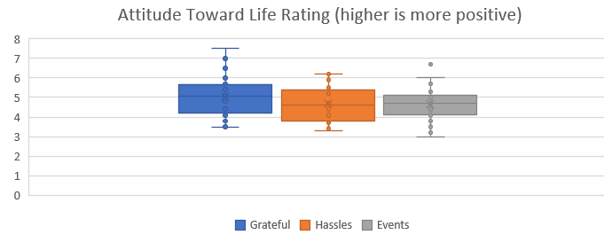
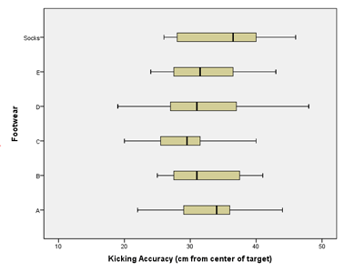

#### Optional Videos for this Lesson {.tabset .tabset-pills}

##### Part 1

<iframe id="kaltura_player_1650548752" src="https://cdnapisec.kaltura.com/p/1157612/sp/115761200/embedIframeJs/uiconf_id/47306393/partner_id/1157612?iframeembed=true&playerId=kaltura_player_1650548752&entry_id=1_ldn2k946" width="480" height="270" allowfullscreen webkitallowfullscreen mozAllowFullScreen allow="autoplay *; fullscreen *; encrypted-media *" frameborder="0"></iframe>

##### Part 2

<iframe id="kaltura_player_1650549027" src="https://cdnapisec.kaltura.com/p/1157612/sp/115761200/embedIframeJs/uiconf_id/47306393/partner_id/1157612?iframeembed=true&playerId=kaltura_player_1650549027&entry_id=1_k4kug0et" width="480" height="270" allowfullscreen webkitallowfullscreen mozAllowFullScreen allow="autoplay *; fullscreen *; encrypted-media *" frameborder="0"></iframe>

##### Part 3

<iframe id="kaltura_player_1650549638" src="https://cdnapisec.kaltura.com/p/1157612/sp/115761200/embedIframeJs/uiconf_id/47306393/partner_id/1157612?iframeembed=true&playerId=kaltura_player_1650549638&entry_id=1_qgxjqlhr" width="480" height="270" allowfullscreen webkitallowfullscreen mozAllowFullScreen allow="autoplay *; fullscreen *; encrypted-media *" frameborder="0"></iframe>

##### Part 4

<iframe id="kaltura_player_1650550135" src="https://cdnapisec.kaltura.com/p/1157612/sp/115761200/embedIframeJs/uiconf_id/47306393/partner_id/1157612?iframeembed=true&playerId=kaltura_player_1650550135&entry_id=1_z2kiyz51" width="480" height="270" allowfullscreen webkitallowfullscreen mozAllowFullScreen allow="autoplay *; fullscreen *; encrypted-media *" frameborder="0"></iframe>

####

## Lesson Outcomes

By the end of this lesson, you should be able to do the following for a hypothesis test for several means (ANOVA):

* State the null and alternative hypothesis. 
* Calculate the test-statistic, degrees of freedom and p-value of the hypothesis test.
* Assess the statistical significance by comparing the p-value to the $\alpha$-level.
* Check the requirements for the hypothesis test.
* Show the appropriate connections between the numerical and graphical summaries that support the hypothesis test. 
* Draw a correct conclusion for the hypothesis test. 

 

## The Effects of Gratitude

 
<table>
<tbody>
<tr class="odd">
<td>

</td>
<td>
$~ ~$
</td>
<td>
President Gordon B. Hinckley said, &quot;My plea is that we stop seeking out the storms and enjoy more fully the sunlight. I am suggesting that as we go through life, we 'accentuate the positive.' I am asking that we look a little deeper for the good, that we still our voices of insult and sarcasm, that we more generously compliment and endorse virtue and effort&quot; (*Standing for Something*, 2000, p.101).
</td>
</tr>
<tr class="even">
<td></td>
<td></td>
<td></td>
</tr>
</tbody>
</table>

<!-- {| style="border: 1px solid lightblue;" -->
<!-- |- valign="top" -->
<!-- |   -->
<!-- | $~ ~$ -->
<!-- | President Gordon B. Hinckley said, "My plea is that we stop seeking out the storms and enjoy more fully the sunlight. I am suggesting that as we go through life, we 'accentuate the positive.' I am asking that we look a little deeper for the good, that we still our voices of insult and sarcasm, that we more generously compliment and endorse virtue and effort" (*Standing for Something*, 2000, p.101). -->
<!-- |- -->
<!-- |} -->

**Summarize the relevant background information**

Robert Emmons and Michael McCullough investigated the effects of gratitude on people's perception of life as a whole<!--<cite>Emmons03</cite>-->.  In a study of $n=192$ undergraduates, the people were randomly assigned to one of three groups.

- Group 1 (Gratitude): The participants in this group were asked to record five things each week for which they were grateful or thankful.
- Group 2 (Hassles): The volunteers in this group recorded five irritants that had occurred to them in the previous week.
- Group 3 (Events): The people in the events group recorded five things that occurred in the past week that had an impact on them.

In addition to the weekly record of the five things they recorded their level of satisfaction with life in general.  (Higher values are more favorable.)  Reports were collected for nine weeks, and the overall level of satisfaction with life as a whole was recorded for each individual.
The researchers wanted to determine if there was a difference in the perception of life as a whole between the subjects assigned to each of the three groups.  Stated differently, they wanted to determine if expressing gratitude affects a person's view of life in general.

Here is an excerpt of data representing the results of this study:

Higher values indicate a greater level of satisfaction with life as a whole.

How might we analyze these data?  One possible method would be to conduct separate t-tests for all the possible pairs of groups in the study.  If we did this, we would need to conduct a separate t-test to compare groups 1 & 2, 1 & 3 and 2 & 3.  If the probability of committing a Type I error is $\alpha = .05$ on each of these tests, then the probability that we would commit a Type I error on at least one of the tests is much greater than 0.05.  We need a hypothesis test that we can use to compare all the groups at once.  The procedure that allows us to do this is called Analysis of Variance (ANOVA).

<!--
!!!!!!!!!!!!!!!!!!!!!!!!! BEGIN MISSION MEMORIES !!!!!!!!!!!!!!!!!!!!!!!!!!!!!!

## Mission Memories

District meetings are gatherings of approximately 6-12 missionaries who serve in a relatively small area. In some missions, the missionaries conclude each district meeting by individually shaking each other's hands.  If there are 6 missionaries present at a district meeting, how many handshakes will be given at the conclusion?

You might want to use the following diagram to help you determine this number.  Each circle represents a missionary.  Draw line connecting each dot with the others.  The lines represent handshakes.  How many handshakes are there if there are 6 missionaries at a district meeting?

Now, think about the missionaries as means and the handshakes as hypothesis tests to determine if those means were equal.  However, each of these tests carry a probability of committing a type I error. If the tests were independent, the probability of committing at least one type I error in 15 tests (the number of tests required to look at all possible pairs of 6 means) is $1-(1-0.05)^{15}=0.5367$.  In other words, if there are six groups and you do all possible pairwise tests to look for differences in the means with $\alpha=0.05$, there is a probability of over 50% that you will have at least one type one error.  This is unacceptable!

What is the solution?  Conduct only one test: an analysis of variance (ANOVA).

!!!!!!!!!!!!!!!!!!!!!!!!! END MISSION MEMORIES !!!!!!!!!!!!!!!!!!!!!!!!!!!!!!
-->
## Analysis of Variance (ANOVA)

ANOVA is a test for equality of several means. It allows us to compare the means for several groups--in one hypothesis test.  It might sound intimidating, but ANOVA is simply a way to analyze several means at once.  It is based on a comparison of the spread of the data within each of the groups compared to the spread of the means of the groups.  

In an ANOVA test, the null hypothesis is typically expressed in words:
$$H_0: \text{All the means are equal.}$$
The alternative hypothesis is given as:
$$H_a: \text{One or more of the means differs from the others.}$$

If the means differ from each other in comparison to the variability in each group, then we conclude that the means are not all equal.  If the means do not differ by much (when compared to the spread of the data in each group) then we do not reject the hypothesis that all the means are equal.

We will use the level of significance, $\alpha$, and the $P$-value just as we have in the other hypothesis tests.

### $F$-distribution

The test statistic in ANOVA follows an $F$-distribution.  This is the first time we have encountered this distribution.  In previous tests, we have used the test statistics $z$ and $t$.  For the ANOVA test, we use the $F$-statistic.

Here is a brief summary of the characteristics of the $F$-distribution:

- It is right skewed.
- The values of $F$ are never negative.
- The $P$-value for the ANOVA test is the area in the *right tail*.  We will never divide the area in the tail.

### Requirements of ANOVA

There are two requirements of ANOVA that must be checked:

- The data are normally distributed in each group.

    We can check this by creating a histogram for each group (separately).  Unless one (or more) of the group's histograms provide strong evidence to the contrary, it is reasonable to conclude that the data are sufficiently normal to proceed with the analysis. We can take this approach because ANOVA is robust to violations of requirements. In other words, results from ANOVA tests are reasonably good even if there are mild to moderate violations of the requirements. 

<!-- **[[Lesson 3: Describing_Quantitative_Data:_Shape,_Center_%26_Spread#Variance|variances]]** 
I don't know how to reference specific header in other lesson-->

- The variances are equal for each group.

    This requirement is checked by examining the variances.  The rule we will use is: *if the largest variance is less than or equal to four times the smallest variance, then we will conclude that the variances are equal.*

If done by hand, the calculations for one simple ANOVA problem can easily require an hour of hard work.  We will use software to do these calculations quickly and accurately.

 

The variance is the square of the standard deviation.  The sample variance is denoted by the symbol $s^2$.

 
 

### How to Conduct an ANOVA Test

<!-- To access this content, scroll to the bottom of the editing page and click on the link "Software:(Excel or SPSS)-(PageName)" -->
<!-- {{Software_Filter | PageName=TestANOVA }}-->

Excel Instructions

To conduct a test for several means (ANOVA) in Excel, do the following: 

Open the file [Math 221 Statistics Toolbox](./Data/Math221StatisticsToolbox.xltx) and do the following:

- Click on the tab labeled "ANOVA"
- Paste the data from each group into their own column
    + Paste the data from the first group in the appropriate part of Column A
    + Paste the data for the second group in the designated part of Column B
    + Continue to copy and paste each group in the appropriate columns

The following points will help you interpret the output.

- The "Numerical Summary of the Data" (Step 3) section of the output gives the sample size, mean and standard deviation for each of the groups in your sample.

- In the ANOVA table, you will find the test statistic ($F$), the $P$-value (Sig.), and the degrees of freedom (df) for the $F$ statistic.  Note that there are two numbers specifying the degrees of freedom.  These are given as the between groups and within groups df, respectively.  Do not worry about the total degrees of freedom.  This number is the sum of the other two.
    + The test statistic, $F$, is given in cell T9
    + The degrees of freedom are presented in cells R9 and R10
    + The $P$-value is reported in cell U9

To check your requirements, do the following:

- To determine if the data are normally distributed, we will look at a histogram plot for each group separately.
    + While still on the ANOVA tab, scroll down. Under the boxplots you should see a histogram. In a large, yellow highlighted box located in the upper-right corner of the plot, you can type the group number of the sample you would like to see a histogram for (see the picture below). Make sure that you evaluate each sample's data. They **all** must look *approximately normal* to meet the requirement.
  
  
  
- To determine if the population variances are equal, we will use a very simple check:
  + If the largest variance is at least four times as big as the smallest variance, we will conclude that the population variances are not equal.  (Remember, the variance is the square of the standard deviation.)
    + If the largest variance is *not* four times as big as the smallest variance, we will conclude that the population variances are close enough that we can assume the variances are all equal.
    + To help you check this assumption the smallest and largest sample variance are displayed in a table spanning cells Y4 to AA6.

 

 

## Worked Example: Gratitude

We will conduct a hypothesis test to determine if the mean responses of the individuals in the three groups differ.

**State the null and alternative hypotheses and the level of significance**
$$
\begin{align}
H_0: & ~ \textrm{All the means are equal} \\
H_a: & ~ \textrm{At least one of the means differs}
\end{align}
$$

We will use the $\alpha = 0.05$ level of significance.

**Describe the data collection procedures**

The students were randomly assigned to one of the three treatments.  They wrote in a weekly journal, according to their group assignment.  At the end of the semester, they completed a questionnaire that asked about their attitude toward life.  The responses on the survey were coded into a number, where higher numbers represent a more positive outlook.

**Give the relevant summary statistics**

<!-- To access this content, scroll to the bottom of the editing page and click on the link "Software:(Excel or SPSS)-(PageName)" -->
<!-- {{Software_Filter | PageName=GratitudeANOVA }} -->

Excel Instructions

Follow these instructions to apply the ANOVA procedure using Excel:

Data representative of the values reported by Emmons and McCullough are given in the file [Gratitude.xlsx](./Data/Gratitude.xlsx).  The data is divided up into three columns which represent Grateful, Hassels, and Events.  

The summary statistics can be obtained using the [Math 221 Statistics Toolbox](./Data/Math221StatisticsToolbox.xltx).  Paste the three columns of data into the appropriate areas of column A, B, and C.  The summary statistics will appear in the table to the right labeled "Numerical Summary of the Data".

 

 

The summary statistics are presented in the following table:

+--------------+---------------------------+-----------------------+----------------+
| Group        | N                         | Mean                  | Std.           |
|              |                           |                       | Deviation      |
+==============+===========================+=======================+================+
| **Grateful** | 64                        | 5.050                 | 0.9443         |
+--------------+---------------------------+-----------------------+----------------+
| **Hassles**  | 63                        | 4.675                 | 0.8320         |
+--------------+---------------------------+-----------------------+----------------+
| **Events**   | 65                        | 4.660                 | 0.8483         |
+--------------+---------------------------+-----------------------+----------------+
|              |                           |                       |                |
+--------------+---------------------------+-----------------------+----------------+

<!-- 
 -->
<!-- {| class="basic" style="text-align:center" -->
<!-- |- valign="bottom" -->
<!-- !Group    || N  || Mean  || Std.   Deviation  -->
<!-- |- -->
<!-- | **Grateful** || 64 || 5.050 || 0.9443  -->
<!-- |- -->
<!-- | **Hassles**  || 63 || 4.675 || 0.8320  -->
<!-- |- -->
<!-- | **Events**   || $~$ $~$ $~$ 65$~$ $~$ $~$  || $~$ $~$ 4.660 $~$ $~$ || $~$ 0.8483 $~$  -->
<!-- |- -->
<!-- |} -->
<!-- 
 -->

Please do not blindly cut-and-paste computer output. It can include a lot of information that we do not use.  Identify the relevant parts and only report those pieces of information.

**Make an appropriate graph to illustrate the data**

This graph is from the Math221 Statistics Toolbox, but a title and proper labels have been added so that the chart can be understood without additional text to explain it.

**Verify the requirements have been met**

A histogram for each of the three sample groups is created (not shown). The data from the Grateful group is slightly skewed right. However, the skew is small enough that we should still be able to get reasonable results. The distributions for the other two groups do not exhibit distinctly non-normal shapes. Therefore, we have not violated the assumption of normally distributed sample data. 

The largest variance (0.8917 from the Grateful group) is not four times the smallest (0.6922 from the Hassles group), so we conclude that the variances are equal for the three groups.

We conclude that the requirements are satisfied and it is appropriate to use ANOVA.

**Give the test statistic and its value**

This can be found in the output.  Our test statistic, $F$, is:
$$F = 4.075$$

**State the degrees of freedom**

There are 2 and 189 degrees of freedom.  

The order in which these are stated is important.  For an F-test, it is not the same to have 2 and 189 degrees of freedom as it is to have 189 and 2 degrees of freedom.

**Mark the test statistic and $P$-value on a graph of the sampling distribution**

**Find the $P$-value and compare it to the level of significance**

$$P\textrm{-value}=0.019 < 0.05 = \alpha$$

**State your decision**

Since $P$-value$=0.019 < 0.05 = \alpha$, we reject the null hypothesis.

**Present your conclusion in an English sentence, relating the result to the context of the problem**

There is sufficient evidence to suggest that at least one of the three groups has a mean level of satisfaction with life that differs from the others.  In short, the mean level of satisfaction with life in general is not the same for all three groups.

If we take a closer look, we see that the Hassles and Events groups had means that were fairly close together.  However, the Grateful group appears to have a significantly higher mean level of satisfaction than the other two groups.

## Worked Example: Soccer Shoes

**Summarize the relevant background information**

Nike, a company that makes sporting goods including shoes, funded a study to compare five soccer shoe designs. <!--<cite>Hennig09,Hennig10</cite>-->  The objective of the research was to determine if there is a difference in the mean accuracy soccer players achieve using different Nike shoe designs.

**State the null and alternative hypotheses and the level of significance**
$$
\begin{align}
H_0: & \textrm{All the means are equal} \\
H_a: & \textrm{At least one of the means differs}
\end{align}
$$

We will use the $\alpha = 0.10$ level of significance.

**Describe the data collection procedures**

As part of the research, they asked trained soccer players to kick a ball at a target.  The target was placed 115 cm above the ground and at a distance of 10 m from the players. Using electronic equipment, the researchers recorded the distance from the center of the target to the point where the ball hit.  The objective of the research was to assess if footwear could affect the accuracy of a soccer player.  

The subjects wore five different soccer shoes and for one treatment they kicked the ball in stocking feet.  Due to the proprietary nature of the data, the shoes are only labeled "A," "B," "C," "D," and "E" in the article.
Data representing the results of this study are given in the file [SoccerShoes.xlsx](./Data/SoccerShoes.xlsx).

Use the [SoccerShoes.xlsx](./Data/SoccerShoes.xlsx) data to answer the following questions.

  

Answer the following questions:

1. **Give the relevant summary statistics**

<a href="javascript:showhide('Q1')">Show/Hide Solution</a>

  Group   N    Mean    Std. Deviation
  ------- ---- ------- ----------------
  A       20   33.10   5.230
  B       20   32.70   5.430
  C       20   29.45   5.216
  D       20   32.00   7.291
  E       20   32.20   5.569
  Socks   20   35.25   6.382

<!-- {| class="basic" style="text-align:center"  -->
<!-- |- -->
<!-- ! Group    !! N  !! Mean  !! Std. Deviation  -->
<!-- |- -->
<!-- |A  || 20 || 33.10 || 5.230  -->
<!-- |- -->
<!-- |B  || 20 || 32.70 || 5.430  -->
<!-- |- -->
<!-- |C   || 20 || 29.45 || 5.216  -->
<!-- |- -->
<!-- |D   || 20 || 32.00 || 7.291 -->
<!-- |- -->
<!-- |E   || 20 || 32.20 || 5.569 -->
<!-- |- -->
<!-- |Socks || 20 || 35.25 || 6.382 -->
<!-- |} -->
<!-- 
 -->

 

2. **Make an appropriate graph to illustrate the data**

<a href="javascript:showhide('Q2')">Show/Hide Solution</a>

* Here is a side-by-side boxplot from the SPSS software to illustrate the data for all six groups. For a review of how to make side-by-side boxplots in Excel using stacked data (a.k.a. long format) like this, review [Lesson 13 World Cup Heart Attacks](Lesson10.html){target="_blank"} example. As you paste the data into the Math221 Statistics Toolbox you are unstacking it, or in other words, putting it in wide format.

 

3. Based on what you have seen so far, does it appear that there is a significant difference between the mean accuracy of the kicks using the six types of footwear?

<a href="javascript:showhide('Q3')">Show/Hide Solution</a>

* Just by looking at the boxplots we can see that there is a difference, but we do not know if there is a statistically significant difference between the mean accuracy of the kicks using the six different types of footwear until we perform an hypothesis test for several means.  

 

4. If we conducted independent samples $t$-tests comparing the six groups, how many tests would be conducted if we compared each of the groups against all the others?

<a href="javascript:showhide('Q4')">Show/Hide Solution</a>

* We would need to conduct 15 tests!  We need to use ANOVA.  We should not do the comparisons using several different t-tests.

&nbsp;

 

Answer the following questions:

5. **Verify the requirements have been met**

<a href="javascript:showhide('Q5')">Show/Hide Solution</a>

* Histograms of the data for each of the six groups (separately) may not look very normal; but they do not exhibit strongly skewed data either.   
* The largest variance (53.159) is not four times the smallest (27.207)

 

6. **Give the test statistic and its value**

<a href="javascript:showhide('Q6')">Show/Hide Solution</a>

* $F$ statistic = 2.020

 

7. **State the degrees of freedom**

<a href="javascript:showhide('Q7')">Show/Hide Solution</a>

* There are 5 and 114 degrees of freedom

 

8. **Mark the test statistic and $P$-value on a graph of the sampling distribution**

<a href="javascript:showhide('Q8')">Show/Hide Solution</a>

 

9. **Find the $P$-value and compare it to the level of significance**

<a href="javascript:showhide('Q9')">Show/Hide Solution</a>

* $P\text{-value} =0.08094 < 0.1 = \alpha$

 

10. **State your decision**

<a href="javascript:showhide('Q10')">Show/Hide Solution</a>

* Since $P$-value$=0.08094 < 0.1 = \alpha$ we reject the null hypothesis.

&nbsp;

 

Answer the following questions:

11. **Present your conclusion in an English sentence, relating the result to the context of the problem**

<a href="javascript:showhide('Q11')">Show/Hide Solution</a>

* There is sufficient evidence to suggest that there is a difference in the mean accuracy of the kicks for the various types of footwear.  

&nbsp;

 

## Summary

Remember...

- **ANOVA** is used to compare the means for several groups. The hypotheses for the test are always:
$$
\begin{align}
H_0: & ~ \textrm{All the means are equal} \\
H_a: & ~ \textrm{At least one of the means differs}
\end{align}
$$

- For ANOVA testing we use an **$F$-distribution**, which is right-skewed. The $P$-value of an ANOVA test is always the area to the right of the $F$-statistic.

- We can conduct ANOVA testing when the following three requirements are satisfied:
    1. The data come from a simple random sample.
    2. The data are normally distributed within each group.
        - This is considered met unless one or more of the groups has a *strongly* skewed distribution.
    3. The variance is constant.
        - This is satisfied when the largest variance is not more than four times the smallest variance.
 

 

## Navigation

| **Previous Reading** | **This Reading** | **Next Reading** |
| :------------------: | :--------------: | :--------------: |
| [Lesson 13:   Inference for Two Means: Independent Samples](Lesson13.html) | Lesson 14:   Inference for Several Means (ANOVA) | [Lesson 15:   Review for Exam 2](Lesson15.html) |

