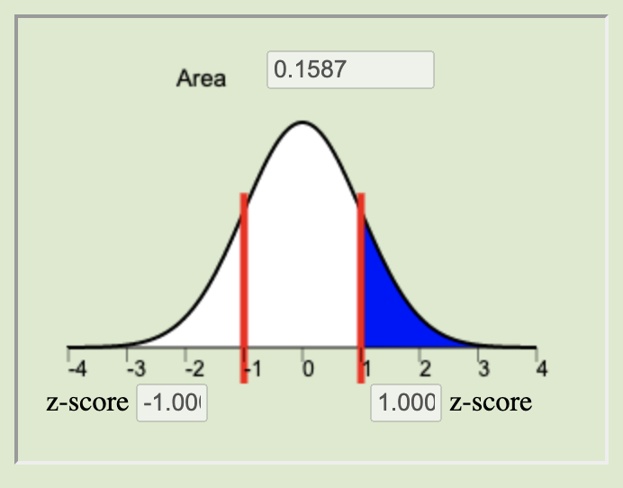
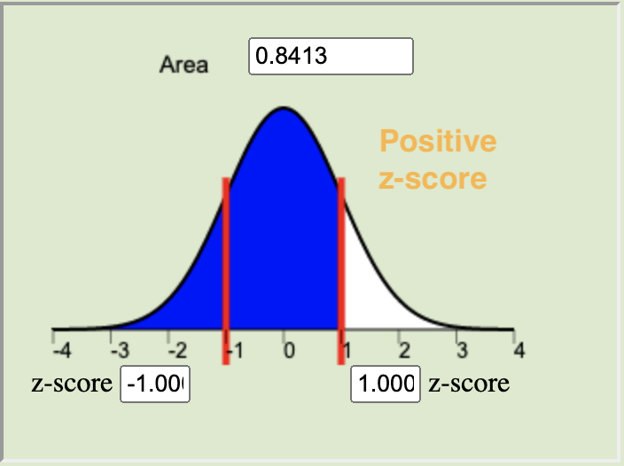
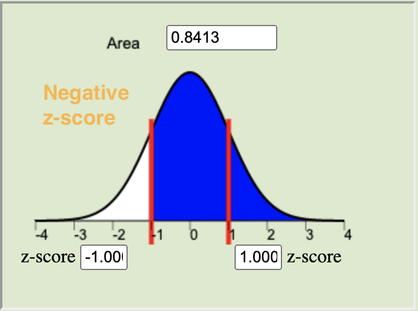
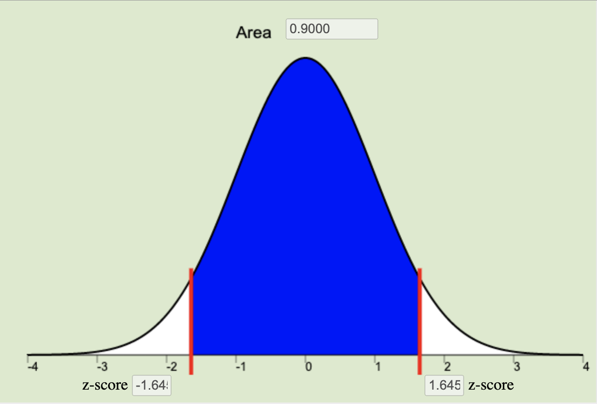
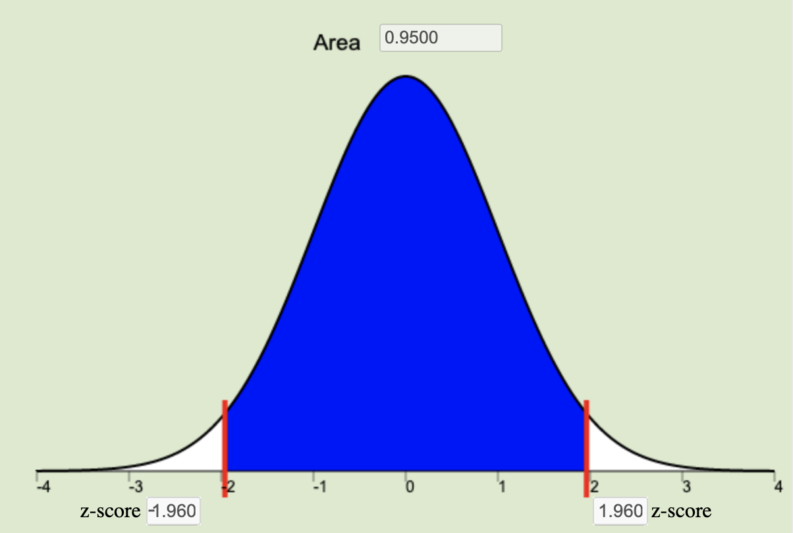
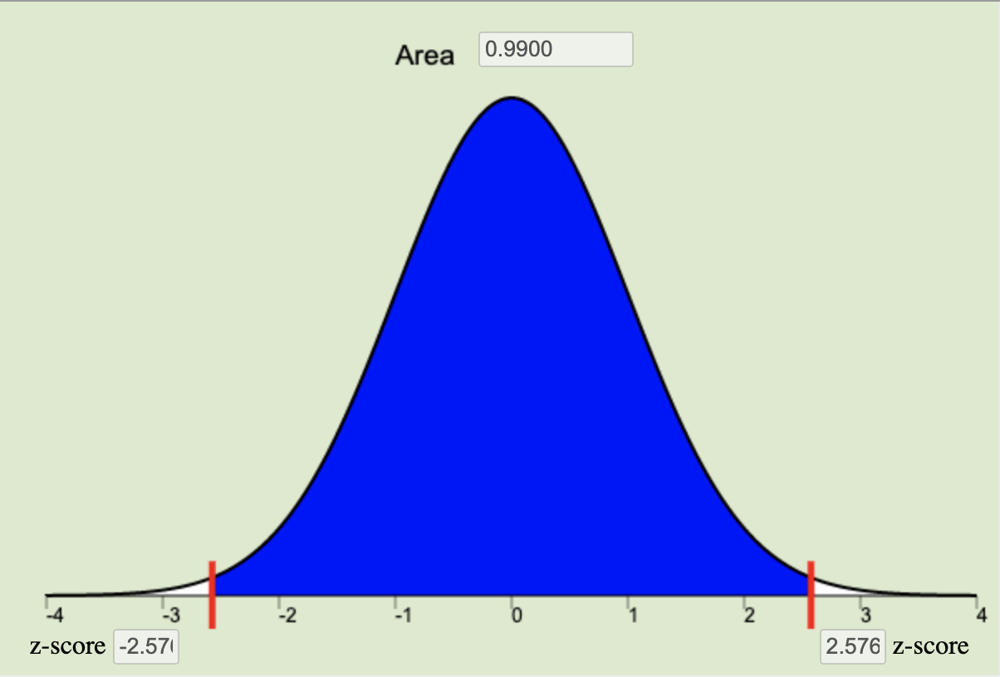

Unit 2 introduced you to hypothesis testing and confidence intervals as well as five inferential methods in statistics. Review the Lesson Outcomes and Lesson Summaries from each lesson to prepare for the Unit 2 Exam. For any outcomes where you need further review, return to the corresponding lesson and study those topics in more depth.

## Lesson 9 {.tabset .tabset-pills}

### Outcomes

1. Recognize when a one mean (sigma known) hypothesis test is appropriate
2. Define a P-value (one-sided and two-sided)
3. Perform a hypothesis test for a single mean with σ known using the following steps:
    a. State the null and alternative hypotheses
    b. Calculate the test-statistic by hand
    c. Determine the P-value using the normal distribution
    d. Assess statistical significance in order to state the appropriate conclusion for the hypothesis test
    e. Check the requirements for the hypothesis test
4. Interpret Type I and II errors in the context of a hypothesis test
5. Explain the meaning of the level of significance ($\alpha$)

### Summary

Remember...

1. A one mean (sigma known) hypothesis test is appropriate for testing a hypothesized value of the mean of a population for quantitative data where $\sigma$, the population standard deviation, can reasonably be assumed to be known exactly.

2. A $P$-value gives the probability of observing a test statistic at least as extreme as the one observed, assuming the null hypothesis is true.

3. The steps to perform a hypothesis test for one mean when sigma is known are:

    a. First, state the hypotheses. The **null hypothesis ($H_0$)** is the foundational assumption about a population and represents the status quo that we assume to be true. It is a statement of equality ($=$). The **alternative hypothesis ($H_a$)** is a different assumption about a population and is a statement of inequality ($<$, $>$, or $\ne$). The alternative hypothesis is believed to be true only in the case that sufficient evidence is presented. 
    
    b. The test statistic for the one mean (sigma known) hypothesis test is given by the equation 
    $$
     z = \frac{\bar{x} - \mu}{\frac{\sigma}{\sqrt{n}}}
    $$
    
    c. The $P$-value is calculated by finding the area under the normal distribution curve that is more extreme (farther away from the mean) than the z-score. The alternative hypothesis tells us whether we look at both tails or only one. The possible scenarios are depicted below.
    

    <table id="fancytable">
    <tr>
      <th>
      Left-tailed  
      $H_a: \mu < 0$
      </th><th>
      Two-tailed   
      $H_a: \mu \neq 0$
      </th><th>
      Right-tailed 
      $H_a: \mu > 0$
      </th>
    </tr><tr>
      <td>
        
      </td><td>
              
      </td><td>
              
      </td>
    </tr>
    </table><table id="fancytable">
    <tr>
      <th>
      Left-tailed  
      $H_a: \mu < 0$
      </th><th style="width:33%">
      </th><th>
      Right-tailed 
      $H_a: \mu > 0$
      </th>
    </tr><tr>
      <td>
        
      </td><td>
      </td><td>
              
      </td>
    </tr>
    </table>
    

    
    d. The **level of significance ($\alpha$)** controls the probability of committing a Type I Error. It is the standard for determining whether or not the null hypothesis should be rejected. Typical values for $\alpha$ are $0.05$, $0.10$, and $0.01$. If the $P$-value is less than $\alpha$ we reject the null and have sufficient evidence to believe the alternative hypothesis is true. If the $P$-value is greater than $\alpha$ we fail to reject the null and have insufficient evidence to believe the alternative hypothesis is true.
    
    e. The results of a one mean (sigma known) test are meaningful when (1) the sample of data can be considered to be representative of the population and (2) the sampling distribution of the sample mean can be considered to be normal. Recall from [Lesson 6](Lesson06.html) that the sampling distribution of the sample mean can be considered normal whenever the population data is normal or when the sample size is sufficiently large, i.e., $n\ge 30$.

4. A **Type I error** is committed when we reject a null hypothesis that is, in reality, true. A **Type II error** is committed when we fail to reject a null hypothesis that is, in reality, false. 

5. The level of significance, $\alpha$, gives the probability of committing a Type I error. The probability of a Type II Error is called $\beta$, but $\beta$ is not discussed in this course. However, the probabilities of a Type I Error ($\alpha$) and a Type II Error ($\beta$) are inversely related, in other words, as one increases the other is decreased.

## Lesson 10 {.tabset .tabset-pills}

### Outcomes

1. Recognize when a one mean (sigma known) confidence interval is appropriate
2. Calculate the sample size required to achieve a specified margin of error and level of confidence
3. Explain the meaning of a level of confidence
4. Create a confidence interval for a single mean with σ known using the following steps:
    a. Find the point estimate
    b. Calculate the margin of error for the given level of confidence
    c. Calculate a confidence interval from the point estimate and the margin of error
    d. Interpret the confidence interval
    e. Check the requirements for the confidence interval
5. Explain how the margin of error is affected by the sample size and level of confidence

### Summary

Remember...

1. A confidence interval for the true mean $\mu$ can be created whenever there is one sample of quantitative data and the population standard deviation $\sigma$ is known.

2. To calculate the sample size required to achieve a specified margin of error, given a chosen level of confidence, we use the equation    
$$
n = \left(\frac{z^*\sigma}{m}\right)^2 \quad
$$
    where $m$ is the desired margin of error (measured in the same units of measurement as the data), and $z^*$ (see the next bullet point for details about $z^*$) is the critical value for the given level of confidence.

3. The *confidence level* is a choice that we make of either 90%, 95%, or 99% that determines how often we would expect our confidence intervals to capture the true population parameter, $\mu$. The confidence level is a central region on the normal applet equal to $1-\alpha$. This central region represents the specified proportion (0.9, 0.95, or 0.99) of the distribution all possible sample means that are contained within a specified distance of $\mu$.  This distance from $\mu$ is called $z^*$, or *the critical value*. This $z^*$ is the z-score that bounds the central area corresponding to our chosen level of confidence on the normal distribution.

<table id="fancytable">
    <tr>
      <th>
      90% Confidence Level  
      $z^* = 1.645$
      </th><th>
      95% Confidence Level 
      $z^* = 1.960$
      </th><th>
      99% Confidence Level 
      $z^* = 2.576$
      </th>
    </tr><tr>
      <td>
        
      </td><td>
        
      </td><td>
        
      </td>
    </tr>
    </table>

 

4. To create a confidence interval for a single mean with $\sigma$ known we use the equation:
$$
  \underbrace{\bar{x}}_\stackrel{\text{Point}}{\text{Estimate}} \pm \underbrace{z^* \frac{\sigma}{\sqrt{n}}}_\text{Margin of Error}
$$
    a. To use this equation, we first calculate the point estimate of $\mu$, which is $\bar{x}$, the sample mean.
    
    b. We then calculate the margin of error using the $z^*$ corresponding to our chosen level of significance (usually 95%, in which case $z^* = 1.960$), the known value of $\sigma$, and the square root of the sample size $n$.
    
    c. The lower-bound of the confidence interval is obtained by $\bar{x} - z^*\sigma/\sqrt{n}$ and the upper-bound of the confidence interval is obtained by $\bar{x} + z^*\sigma/\sqrt{n}$.
    
    d. We then claim we are 95% confident that the true mean $\mu$ lives inside the region specified between the lower-bound and the upper-bound on the number line. Using this approach, we expect to be correct in our conclusions 95% of the time. But keep in mind there is no "chance" or "probability" that we are correct as our resulting interval has either captured the true mean or it has not.
    
    e. To ensure the confidence interval is meaningful and appropriate for a set of data, we need to ensure that (1) our sample was representative of the population, and (2) the distribution of $\bar{x}$ can be considered normal by either the virtue of the data being normal itself, or the sample size being sufficiently large to invoke the Central Limit Theorem.

5. The **margin of error** gives an estimate of the variability of responses. As shown by its equation, $\displaystyle{m=z^*\frac{\sigma}{\sqrt{n}}}$, there are two values directly under our control ($z^*$ and $n$) which impact the size of the margin of error. The larger the value of $z^*$, the greater our confidence level, and the larger the margin of error becomes. The larger the sample size $n$, the smaller the margin of error will become. A smaller margin of error gives greater insight about the true value of $\mu$.

 

## Lesson 11 {.tabset .tabset-pills}

### Outcomes

1. Recognize when a one mean (sigma unknown) inferential procedure is appropriate
2. Create numerical and graphical summaries of the data
3. Perform a hypothesis test for one mean (sigma unknown) using the following steps:
    a. State the null and alternative hypotheses
    b. Calculate the test-statistic, degrees of freedom and P-value using software
    c. Assess statistical significance in order to state the appropriate conclusion for the hypothesis test
    d. Check the requirements for the hypothesis test
4. Create a confidence interval for one mean (sigma unknown) using the following steps:
    a. Calculate a confidence interval for a given level of confidence using software
    b. Interpret the confidence interval
    c. Check the requirements of the confidence interval
5. State the properties of the Student’s t-distribution

### Summary

Remember...

1. In practice we rarely know the true standard deviation $\sigma$. Thus, when we have one sample of quantitative data without knowledge of $\sigma$ we will use a one sample t inferential procedure for $\mu$. 

2. Appropriate ways of *Describing the Data* for one sample of quantitative data where $\sigma$ is unknown include making either a histogram or boxplot of the sample data, along with calculating the sample mean $\bar{x}$, the sample standard deviation $s$, and the sample size $n$.

3. To perform a hypothesis test for one mean (sigma unknown) use the following steps:
    a. State the null and alternative hypothesis in the form of $H_0: \mu = \text{some number}$ and $H_a: \mu \ne \text{some number}$. A one-sided alternative ($<$ or $>$) can be used in place of the two-sided $\ne$ when appropriate. 
    b. The **student's t-distribution** gives us a new test statistic, $t$, that measures how far the sample mean has landed from our hypothesized value of $\mu$ using the sample standard deviation ($s$) and the sample size $n$ by the equation
$$
t = \frac {\bar x - \mu} {s / \sqrt{n}}
$$
    The degrees of freedom corresponding to this test statistic are $df = n-1$, and the $P$-value is obtained by shading the appropriate tails (as specified in the alternative hypothesis) of the $t$-distribution with $n-1$ degrees of freedom. 
    c. The results of the test are based on how the $P$-value compares to the significance level $\alpha$. As before, if the $P$-value is less than $\alpha$, the null hypothesis is rejected and there is sufficient evidence to believe the alternative hypothesis is true. If the $P$-value is greater than $\alpha$, the null hypothesis is not rejected and there is insufficient evidence to believe the alternative hypothesis is true.
    d. In order for the results of the one sample t test to be considered valid, it must be the case that (1) the sample is representative of the population and (2) the distribution of $\bar{x}$ can be considered to be normally distributed.
    
4. To create a confidence interval for one mean (sigma unknown) we 
    a. Use software to evaluate the following expression in order to obtain the lower-bound and upper-bound of the confidence interval.
$$
  \underbrace{\bar{x}}_\stackrel{\text{Point}}{\text{Estimate}} \pm \underbrace{t^* \frac{s}{\sqrt{n}}}_\text{Margin of Error}
$$
    b. Interpret the confidence interval by stating that we are 95% (or 90% or 99%) confident that the true mean $\mu$ is contained in the confidence interval. We expect to be correct 95% (or 90% or 99%) of the time when using such a confidence interval to make claims about the true value of $\mu$.
    c. In order for the confidence interval to be considered valid, it must be the case that (1) the sample is representative of the population and (2) the distribution of $\bar{x}$ can be considered to be normally distributed.

5. The $t$-distribution is similar to a normal distribution in that it is bell-shaped and symmetrical, but the exact shape of the $t$-distribution depends on the **degrees of freedom ($df = n-1$)**. As the degrees of freedom grow larger, the $t$-distribution becomes more and more normal in shape.

 

## Lesson 12 {.tabset .tabset-pills}

### Outcomes

1. Recognize when a mean of differences (two dependent samples) inferential procedure is appropriate
2. Create numerical and graphical summaries of the data
3. Perform a hypothesis test for the mean of differences (two dependent samples) using the following steps:
    a. State the null and alternative hypotheses
    b. Calculate the test-statistic, degrees of freedom and P-value of the test using software
    c. Assess statistical significance in order to state the appropriate conclusion for the hypothesis test
    d. Check the requirements for the hypothesis test
4. Create a confidence interval for the mean of differences (two dependent samples) using the following steps:
    a. Calculate a confidence interval using software
    b. Interpret the confidence interval
    c. Check the requirements of the confidence interval

### Summary

Remember...

1. The key characteristic of **dependent samples** (or **matched pairs**) is that knowing which subjects will be in group 1 determines which subjects will be in group 2. Examples include pre and post testing situations where the same subjects are measured twice, or matched pair situations with married couples, identical twins, or other situations where subjects from one group are carefully matched with subjects from another group. 

2. Appropriate ways of *Describing the Data* for dependent samples is with either a histogram or boxplot of the computed differences (of each pair of values), and computing the sample size $n$, the sample mean of the differences $\bar{d}$, and the sample standard deviation of the differences $s_d$. 

3. To perform a hypothesis test for the true mean of the differences (two dependent samples) use the following steps:
    a. State the null and alternative hypotheses in the form $H_0: \mu_d = 0$ and $H_a: \mu_d \neq 0$. Use the one-sided alternatives of $\mu_d < 0$ or $\mu_d > 0$ when appropriate.
    b. Before describing the data or making inference, we first compute the differences $d$ using the equation **differences = Data 1 values - Data 2 values**. Then the test statistic is found using the equation 
    $$
      t = \frac{\bar{d} - \mu_d}{\frac{s_d}{\sqrt{n}}}
    $$
   The degrees of freedom of this test statistic are $df=n-1$. The $P$-value is obtained by shading the appropriate tails of the $t$-distribution with $n-1$ degrees of freedom. The Math 221 Statistics Toolbox will provide each of these values.
   c. The $P$-value is compared to the significance level in the usual way to determine if the null hypothesis should be rejected ($P$-value $< \alpha$) and sufficient evidence obtained to believe the alternative hypothesis is true. 
   d. The results of the hypothesis test are considered valid if (1) the sample differences are representative of the population and (2) the mean of the sample differences $\bar{d}$ can be considered to be normal. (This last assumption is true if the differences themselves appear to be normal, or if the sample size is large enough to invoke the Central Limit Theorem.)
   
4. To create a confidence interval for the true mean of the differences (two dependent samples) use the following steps:
    a. Use the Math 221 Statistics Toolbox to compute the lower and upper bounds of the confidence interval with the equation
    $$
     \underbrace{\bar{d}}_\stackrel{\text{Point}}{\text{Estimate}} \pm \underbrace{t^* \frac{s_d}{\sqrt{n}}}_\text{Margin of Error}
    $$
    b. We are then 95% confident that the true mean of the differences is some value within the resulting interval. If the confidence interval contains zero, then it is possible that $\mu_d = 0$ and we claim there is no overall mean difference, i.e., no change on average in the subjects. If both the lower-bound and the upper-bound are positive, then we are confident the **Data~1** group of values is tending to be larger than the **Data~2** values by anywhere from the lower-bound to the upper-bound in value. Conversely, if both bounds are negative, we are confident that the **Data~1** group of values is tending to be smaller than the **Data~2** values by anywhere from the upper-bound to the lower-bound in value.
    c. The confidence interval is considered valid so long as (1) the sample differences are representative of the population and (2) the mean of the sample differences $\bar{d}$ can be considered to be normal. (This last assumption is true if the differences themselves appear to be normal, or if the sample size is large enough to invoke the Central Limit Theorem.)

 

## Lesson 13 {.tabset .tabset-pills}

### Outcomes

1. Recognize when the difference of means (two independent samples) inferential procedure is appropriate
2. Create numerical and graphical summaries of the data
3. Perform a hypothesis test for the difference of means (two independent samples) using the following steps:
    a. State the null and alternative hypotheses
    b. Calculate the test-statistic, degrees of freedom and P-value of the test using software
    c. Assess statistical significance in order to state the appropriate conclusion for the hypothesis test
    d. Check the requirements for the hypothesis test
4. Create a confidence interval for the difference of means (two independent samples) using the following steps:
    a. Calculate a confidence interval using software
    b. Interpret the confidence interval
    c. Check the requirements of the confidence interval

### Summary

Remember...

- In contrast to dependent samples, two samples are independent if knowing which subjects are in group 1 tells you nothing about which subjects will be in group 2. With **independent samples**, there is no pairing between the groups.

- When conducting inference using independent samples we use $\bar x_1$, $s_1$, and $n_1$ for the mean, standard deviation, and sample size, respectively, of group 1. We use the symbols $\bar x_2$, $s_2$, and $n_2$ for group 2.

- When working with independent samples it is important to graphically illustrate each sample separately. Combining the groups to create a single graph is not appropriate.

- When conducting hypothesis tests using independent samples, the null hypothesis is always $\mu_1=\mu_2$, indicating that there is no difference between the two populations. The alternative hypothesis can be left-tailed ($<$), right-tailed($>$), or two-tailed($\ne$).

- Whenever zero is contained in the confidence interval of the difference of the true means we conclude that there is no significant difference between the two populations.
 

## Lesson 14 {.tabset .tabset-pills}

### Outcomes

1. Recognize when an Analysis of Variance (ANOVA) inferential procedure is appropriate
2. Create numerical and graphical summaries of the data
3. Perform a hypothesis test for ANOVA using the following steps:
    a. State the null and alternative hypotheses
    b. Calculate the test-statistic, degrees of freedom and P-value of the test using software
    c. Assess statistical significance in order to state the appropriate conclusion for the hypothesis test
    d. Check the requirements for the hypothesis test
4. State the properties of the F distribution

### Summary

Remember...

- **ANOVA** is used to compare the means for several groups. The hypotheses for the test are always:
$$
\begin{align}
H_0: & ~ \textrm{All the means are equal} \\
H_a: & ~ \textrm{At least one of the means differs}
\end{align}
$$

- For ANOVA testing we use an **$F$-distribution**, which is right-skewed. The $P$-value of an ANOVA test is always the area to the right of the $F$-statistic.

- We can conduct ANOVA testing when the following three requirements are satisfied:
    1. The data come from a simple random sample.
    2. The data are normally distributed within each group.
        - This is considered met unless one or more of the groups has a *strongly* skewed distribution.
    3. The variance is constant.
        - This is satisfied when the largest variance is not more than four times the smallest variance.
 

## Navigation

| **Previous Reading** | **This Reading** | **Next Reading** |
| :------------------: | :--------------: | :--------------: |
| [Lesson 14:   Inference for Several Means (ANOVA)](Lesson14.html) | Lesson 15:   Review for Exam 2 | [Lesson 16:   Describing Categorical Data: Proportions; Sampling Distribution of a Sample Proportion](Lesson16.html) |

