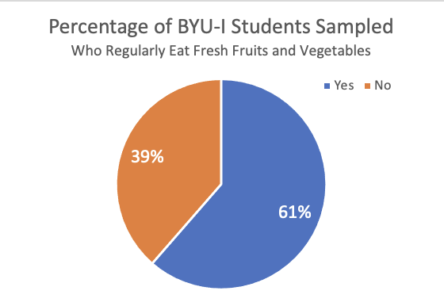
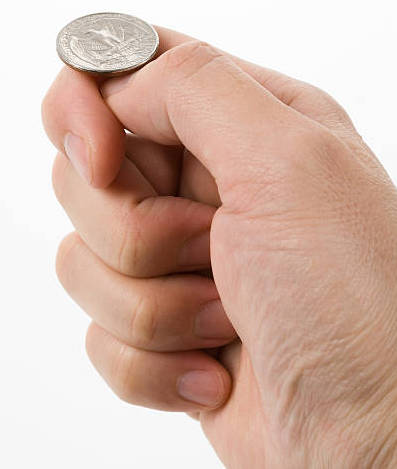

<script type="text/javascript">
 function showhide(id) {
    var e = document.getElementById(id);
    e.style.display = (e.style.display == 'block') ? 'none' : 'block';
 }
</script>

<div style="width:50%;float:right;">

#### Optional Videos for this Lesson {.tabset .tabset-pills}

##### Part 1

<iframe id="kaltura_player_1653754340" src="https://cdnapisec.kaltura.com/p/1157612/sp/115761200/embedIframeJs/uiconf_id/47306393/partner_id/1157612?iframeembed=true&playerId=kaltura_player_1653754340&entry_id=1_w6yz2m52" width="480" height="270" allowfullscreen webkitallowfullscreen mozAllowFullScreen allow="autoplay *; fullscreen *; encrypted-media *" frameborder="0"></iframe>

##### Part 2

<iframe id="kaltura_player_1653755130" src="https://cdnapisec.kaltura.com/p/1157612/sp/115761200/embedIframeJs/uiconf_id/47306393/partner_id/1157612?iframeembed=true&playerId=kaltura_player_1653755130&entry_id=1_mgsznxh9" width="480" height="270" allowfullscreen webkitallowfullscreen mozAllowFullScreen allow="autoplay *; fullscreen *; encrypted-media *" frameborder="0"></iframe>

##### Part 3

<iframe id="kaltura_player_1653755542" src="https://cdnapisec.kaltura.com/p/1157612/sp/115761200/embedIframeJs/uiconf_id/47306393/partner_id/1157612?iframeembed=true&playerId=kaltura_player_1653755542&entry_id=1_48qt6o40" width="480" height="270" allowfullscreen webkitallowfullscreen mozAllowFullScreen allow="autoplay *; fullscreen *; encrypted-media *" frameborder="0"></iframe>

##### Part 4

<iframe id="kaltura_player_1653755908" src="https://cdnapisec.kaltura.com/p/1157612/sp/115761200/embedIframeJs/uiconf_id/47306393/partner_id/1157612?iframeembed=true&playerId=kaltura_player_1653755908&entry_id=1_f87rwi1f" width="480" height="270" allowfullscreen webkitallowfullscreen mozAllowFullScreen allow="autoplay *; fullscreen *; encrypted-media *" frameborder="0"></iframe>

##### Part 5

<iframe id="kaltura_player_1653756144" src="https://cdnapisec.kaltura.com/p/1157612/sp/115761200/embedIframeJs/uiconf_id/47306393/partner_id/1157612?iframeembed=true&playerId=kaltura_player_1653756144&entry_id=1_7kfq09he" width="480" height="270" allowfullscreen webkitallowfullscreen mozAllowFullScreen allow="autoplay *; fullscreen *; encrypted-media *" frameborder="0"></iframe>

</div><div style="clear:both;"></div>

## Lesson Outcomes

By the end of this lesson, you should be able to:

- Calculate and interpret a sample proportion.
- Summarize categorical data with a bar or pie chart.
- Determine the mean, standard deviation and shape of a distribution of sample proportions.
- Calculate probabilities using a distribution of sample proportions.

<br>


## Case Study: Eating Habits of College Students

<div style="float:right;padding:10px;">

</div>


Chances are that as a college student you have probably thought to yourself, "It takes too much time to prepare healthy food." In fact, the American College Health Association estimates that only 6% of college students across the U.S. are eating the recommended "five or more servings of fruits and vegetables" daily.[^1] In an effort to better understand the barriers that were keeping college students from eating healthy, a team of researchers from the Department of Psychology at BYU-Idaho undertook a study.[^2] 

<br/>


The team of researchers obtained a convenience sample of $n=517$ college students from General Psychology courses over three different semesters. <a href="javascript:showhide('articledetails')"><span style="font-size:8pt;">Click to Show/Hide More Sampling Details</span></a>

<div id="articledetails" style="display:none;padding-left:30px;padding-right:30px;">
As reported in their article, "Participation in this study was a required experiential component of the course, but students’ grades were based on participation rather than performance and alternate assignments were available." Further, use of the data for research purposes was approved by the university’s Institutional Review Board.
</div>

The survey contained many questions for the students to answer and found some fantastic conclusions about what keeps students from eating healthy. (If you are interested, [click here](https://byuiscroll.org/psychology-students-did-the-research-for-you/) to read an news article highlighting their findings.) One important question on the survey asked  each student whether or not they (the student) ate fresh fruits and vegetables as part of their daily diet. They were allowed to answer with either of

* Yes
* No

Unfortunately, not all students out of the 517 that were surveyed answered the question. We will summarize the results of the answers below as we also present details on how to describe categorical data.


## Numerical and Graphical Summaries of Categorical Data

To describe categorical data, we need a different approach than what we used for quantitative data. Instead of discussing means (like $\mu$ or $\bar{x}$) we will work with proportions. A proportion is a number between 0 and 1 that measures the relative size of a part of something to the whole of that thing. In the current eating habits study, the researchers are interested in knowing the proportion of students who experience barriers to healthy eating. This proportion probably isn't 0 (which would imply no students experience barriers to healthy eating) and probably isn't 1 (which would imply all students experience barriers to healthy eating) but is likely somewhere in between.

<div class="myemphasis">
**Proportions**: A number between 0 and 1 that measures the size of a part to the whole.

The **sample proportion** is a sample statistic. It is written as $\hat{p}$. It is computed by taking the number of "successes" in the data, called $x$, and dividing by the total number of individuals in the sample, $n$ (the sample size).

$$
\text{Sample Proportion:} \quad \hat{p} = \frac{x}{n}
$$

The theoretical **true proportion** for a population is written as just $p$. It is a population parameter. To compute the *true proportion* we must know the total size of the population (or total possible outcomes) $N$, as well as the number of possible *successes* $X$. We rarely know $p$. But we can usually hypothesize a reasonable value for $p$ using a null hypothesis.

$$
 \text{True Proportion:} \quad p = \frac{X}{N} \quad \text{(Usually unknown)}
$$
</div>

Let's take a quick glance at the data for one of the questions from the eating habits study.

| Student | Do you regularly eat fresh fruits and vegetables? | 
|:--------|:-------------------------------------------------:|
| 1  | (No Answer) |
| 2  | (No Answer) |
| 3  | (No Answer) |
| 4  |  Yes |
| 5  |  No  |
| 6  |  No  |
| $\vdots$ | $\vdots$ |
| 515 | Yes |
| 516 | No |
| 517 | No |

Notice that in this data, some students chose not to answer this question, i.e., "No Answer". Other students answered "Yes" and other students answered "No". Our first step to computing the **proportion** of students who answered "Yes" (what we will call successes in this case) is to count up two numbers.

* First, we count how many students said "Yes". This turns out to give $x = 245$.
* Second, we count how many students answered the question. This gives our sample size as $n = 399$.
* Third, we divide to get

$$
 \hat{p\ } = \frac{x}{n} = \frac{245}{399} \approx 0.614
$$

This shows that 61.4% of students in our sample (who answered this question) claim to regularly eat fresh fruits and vegetables as part of their daily diet. That implies that 38.6% (1 - 0.614 = 0.386) of students in our sample who answered the question, which is a little more than 1 out of every 3 students, *are not* regularly eating fresh fruits and vegetables as part of their daily diet. 


### Pie charts

Pie charts are a popular way to display categorical data.  These are used extensively in practice.  Typically, pie charts are used when you want to represent the observations as part of a whole, where each slice (sector) of the pie chart represents a proportion or percentage of the whole.

<div class="SoftwareHeading">Excel Instructions</div>
<div class="Summary">

**To make a pie chart in Excel:**

- Open a blank file in Excel.   
- Create a counts table after counting up how many times each response occurred in the data by inputting the category labels in one column and the counts in another column, like this: 

| Eat Fresh Fruits and Vegetables |  Count |
|---------------------------------|--------|
| Yes      |  245    |
| No       |  154    |

- Make sure the categorical column and the count column are next to each other with the count column on the right. Then, highlight the entire table.
- Click on the Insert tab, then click on the Pie chart button.
- Please choose the basic 2D pie.

After adding a title to the plot, and some optional data labels, the pie chart will look like this:



<br>
</div>
<br>


### Bar charts

Bar charts are another a powerful way to quickly display categorical data.  They provide a bar for each category in the data, and the height of the bar shows the number of observations from the sample that landed in that particular category.

We can represent the various answers of the students concerning whether or not they "regularly eat fresh fruits and vegetables" with a bar chart. 

<div class="SoftwareHeading">Excel Instructions</div>
<div class="Summary">

**To make a bar chart in Excel:**

- Create a counts table after counting up how many times each response occurred in the data by inputting the category labels in one column and the counts in another column, like this: 

| Eat Fresh Fruits and Vegetables |  Count |
|---------------------------------|--------|
| Yes      |  245    |
| No       |  154    |

- Highlight both the categorical column and the count column.
- Click on the Insert tab and then click on column chart button.
- Again, please choose the simple 2D column chart.


After editing the title of the plot, and adding optional data labels, your bar chart will look like this:


<br>

</div>

<br>

The above chart shows that the 118 students that did not respond to this question represent a substantial portion of the total students surveyed. That could be leading to some bias in the results because we don't know if the "NA" responses would land in the "Yes" or "No" group. But, if we consider just those that answered the question, it seems that many students (61.4% of those that answered the question) are doing a great job eating fresh fruits and vegetables as part of their diet.

## Sampling Distribution of the Sample Proportion

### Example: Tossing a Coin

<div style="float:right;padding:10px;">

</div>

If you were asked the question, "What is the probability of flipping a head with a fair coin?" you would likely correctly answer by stating that there is a 50% chance of getting a head. You know this because there are $N=2$ possibilities (a head on one side and a tail on the other) and only one side, $X=1$, can give a head. That gives the true proportion of heads to be $p=X/N=1/2 = 0.5$. However, if you have ever flipped a coin several times and recorded your results, you would know that you don't usually get exactly 50% heads. 

To demonstrate, we actually flipped a coin $n=25$ times and recorded our results. We got $x=12$ heads. That comes out to a sample proportion of $\hat{p} = x/n = 12/25 = 0.48$. While not exactly 50%, it is fairly close. We can represent the results in a simple bar chart.

```{r, echo=FALSE}
mytable <- c(`Heads`=12, `Tails`=13)
barplot(mytable, 
        col=c("skyblue","gray"), 
        ylab="Number of Flips",
        main="My Coin Flip Results")
```


Now it's your turn.

<div style="clear:both;"></div>

<div class="QuestionsHeading">Answer the following questions:</div>
<div class="Questions">
1. Toss a coin $n=25$ times.  Keep track of the number of heads you observe in your $n=25$ flips. What is your sample proportion for the number of heads you flipped? 

<a href="javascript:showhide('Q1')"><span style="font-size:8pt;">Show/Hide Solution</span></a>
<div id="Q1" style="display:none;">
* All answers will vary in this question. When we tossed the coin 25 times, we got 12 heads. 

This gives our proportion of heads as $\hat{p} = 12/25 = 0.48$. Your proportion will likely be different, but it would be *very*, *very* unlikely for you to get 0/25 or 25/25 heads.

</div>
<br>

2. What does a bar chart showing your results of heads and tails look like?

<a href="javascript:showhide('Q2')"><span style="font-size:8pt;">Show/Hide Solution</span></a>
<div id="Q2" style="display:none;">

To create a bar chart of our heads and tails counts, use the instructions from above: [Excel Instructions for Making a Bar Chart](#bar-charts)

</div>
&nbsp;
</div>
<br>

If you just completed the two questions above, you likely got a different answer than what we got for the proportion of heads in your $n=25$ flips. (Although it is somewhat likely, 13.3% chance, that you would have also gotten 12/25 heads.) So why is it that if the true proportion is $p=0.5$, we all can get different answers for $\hat{p}$ when we each flip a coin $n=25$ times? As you likely already know, the reason that answers for $\hat{p}$ can vary from $p$ is because the coin flips are random. This is the very idea behind a *random sample* of data. In fact, this means that we should expect the sample proportion $\hat{p}$ to vary randomly from the true proportion $p$ anytime we take a sample of data. The only way to really know $p$ for sure would be to take a census and survey the entire population! That is typically too much work. And fortunately, thanks to statistical theory about the *sampling distribution of the sample proportion*, we can actually quantify how far away from the true proportion our sample proportion will be, say 95% of the time. Let's see how this work.

### Creating a Sampling Distribution

A true sampling distribution of a sample proportion is obtained by plotting the results from *all possible* samples from a population of size $n$. It isn't reasonable to try to create such a distribution in its entirety, but we can look at a quick example using the data file [CoinTossHeads.xlsx](./Data/CoinTossHeads.xlsx). This data file contains data representing a collection of 900 students' results, where each student tossed a coin $n=25$ times and calculated their proportion of heads. These 900 different sample proportions $\hat{p}$ represent 900 different samples (of $n=25$ coin flips in each sample) from the population of all coin flip possibilities. The goal of the sampling distribution of the sample proportion is to consider the set of all possible sample proportions that could be obtained when getting a sample from a population, and where those sample proportions would land, i.e., how they would be distributed.

The following histogram shows the distribution of the sample proportions $\hat{p}$ for each of the 900 students that participated in the coin flip experiment. It turns out that there were 134 students in the sample of $n=900$ that also flipped 12/25 heads like we did. However, there were also 137 students that flipped 13/25 heads. But notice that very few students (only 5) got as few as 5/25 heads and very few students (only 7) got as many as 19/25 heads. And no one (out of all 900 students that participated) got more than 19 heads (19/25 = 0.76) or fewer than 5 heads (5/25 = 0.2).

```{r, echo=FALSE}
library(readxl)
CoinTossHeads <- read_excel("./Data/CoinTossHeads.xlsx")

hist(CoinTossHeads$ProportionHeads,
     col="wheat3",
     main="Resulting Sample Proportions from 900 Students \n Each Student Flipped a Coin 25 Times",
     ylab="Number of Students who Got the Given Proportion",
     xlab="Resulting Sample Proportion",
     breaks=seq(0.02,1,0.04),
     xlim=c(0,1), xaxt='n')
axis(1, at=seq(0,1,.1))
curve(dnorm(x, 0.5, 0.1)*35, add=TRUE, n=1000)
```

<div class="QuestionsHeading">Answer the following questions:</div>
<div class="Questions">

3. Find the spot on the horizontal axis of the histogram indicating the proportion of heads ($\widehat{p}$) that *you* observed in Question 1.  Based on your visual observation, would you say your proportion of heads is unusual or typical?

<a href="javascript:showhide('Q3')"><span style="font-size:8pt;">Show/Hide Solution</span></a>
<div id="Q3" style="display:none;">
* Answers will vary.  This depends on your proportion of heads.  If the observed value is far to the right or left, then you would say that it was unusual.  Most students will observe values in the middle of the distribution, which are more typical.
</div>
<br>

4. Visually, estimate the mean and standard deviation of the observed sample proportions shown in the histogram. Please write your answer to this question before continuing.

<a href="javascript:showhide('Q4')"><span style="font-size:8pt;">Show/Hide Solution</span></a>
<div id="Q4" style="display:none;">
* We estimate the mean of the sample proportions at 0.5 and the standard deviation of all of these sample proportions at 0.1. Almost all the sample proportions are found between .2 and .8, which represents the mean plus or minus three standard deviations of the mean.  Your answers may vary.
</div>
<br>

5. The proportion of heads that you will observe in $n=25$ tosses of a fair coin, $\widehat p$, is a random variable.  The true theoretical mean for this random variable is $p=0.5$.  Explain why this value would make sense.

<a href="javascript:showhide('Q5')"><span style="font-size:8pt;">Show/Hide Solution</span></a>
<div id="Q5" style="display:none;">
* Since getting a "heads" is just as likely as getting a "tails", you should end up with half your flips landing as "tails". The theoretical proportion of $p=0.5$ is logical.
</div>
<br>

</div>

<br/>

### Mean and Standard Deviation of the Sample Proportion

<div class="myemphasis">
The symbol $\mu_{\hat{p}}$ represents the mean of the distribution of all possible sample proportions, and this mean is equal to $p$, the true proportion.

$$
\underbrace{\mu_\widehat{p}}_{\textrm{Mean of } \widehat{p}} = p
$$
The symbol $\sigma_{\hat{p}}$ represents the standard deviation of all possible sample proportions, and is equal to $\sqrt{p\cdot(1-p)/n}$.

$$
\underbrace{\sigma_\widehat{p}}_{\textrm{Standard Deviation of}~\widehat p} = \sqrt{\frac{p \cdot (1-p)}{n}}
$$
</div>

Both of the above results are visible in the previous histogram that was drawn of the 900 different sample proportions obtained from 900 different students who each flipped a coin 25 times and recorded the proportion of heads they flipped. The value of $\mu_{\hat{p}}$ being equal to $p$ tells us that the many possible sample proportions we could obtain from our sample are centered around the true proportion $p$. The value of $\sigma_{\hat{p}}$ tells us how far away from $p$ our particular sample proportion $\hat{p}$ may have landed. (Remember the idea that 95% of all possible values are within 1.96 standard deviations of the true mean?)

<div class="QuestionsHeading">Answer the following questions:</div>
<div class="Questions">

6. What is the mean and standard deviation of the sample proportion $\hat{p}$ when sampling $n=25$ coin flips?

<a href="javascript:showhide('Q6')"><span style="font-size:8pt;">Show/Hide Solution</span></a>
<div id="Q6" style="display:none;">
The mean of all possible sample proportions is $p$ according to the statements made above. For a coin, the true proportion of heads is $p=0.5$. So, the mean of the sample proportion $\hat{p}$ when sampling $n=25$ coin flips is also 0.5.

$$
 \mu_{\hat{p}} = 0.5
$$


The true theoretical standard deviation of $\widehat p$ in this case is $\sigma_{\widehat{p}} = 0.1$.  This can be obtained using the formula

$$
\displaystyle{\text{Standard deviation of}~\widehat{p} = \sigma_{\widehat{p}} = \sqrt{ \frac{p(1-p)}{n} } }
$$

where $p$ is the true population proportion, which is also the mean of the distribution of $\widehat{p}$, which is 0.5 for this coin flip scenario.


$$
\text{Standard deviation of}~\widehat{p} = \sqrt{ \frac{p(1-p)}{n} } = \sqrt{ \frac{0.5(1-0.5)}{25} } = 0.1
$$

</div>
<br>

7. In [Lesson 5](Lesson05.html) the $z$-score for an observed data value was shown to be computed using the formula:

$$
\displaystyle { z = \frac{\textrm{value} - \textrm{mean}}{\textrm{standard deviation}} }
$$

Use the mean and standard deviation you came up with in your answer to Question 6 (above), to find the $z$-score corresponding to *your* sample proportion.

<a href="javascript:showhide('Q7')"><span style="font-size:8pt;">Show/Hide Solution</span></a>

<div id="Q7" style="display:none;">
<center>
$$
\displaystyle { z = \frac{\text{_____} - 0.5}{0.1} = \text{_____} }
$$
</center>
</div>
<br>

8. Based on the $z$-score you computed in question 7, is your observed proportion considered unusual?

<a href="javascript:showhide('Q8')"><span style="font-size:8pt;">Show/Hide Solution</span></a>
<div id="Q8" style="display:none;">
* Answers will vary.  $z$-scores between -2 and 2 are not unusual.  If your $z$-score is less than -2 or greater than 2, then it is considered unusual.
</div>
&nbsp;
</div>

<br>
<br>
<div class="message Tip">You may want to refresh your memory on our definition of "unusual events" in the [Normal Distributions](Lesson05.html){target="_blank"} lesson</div>
<br>
<br>

### Central Limit Theorem for the Sample Proportion

If the sample size is large, the sample proportion, $\widehat p$, will be approximately normally distributed.  This is a direct consequence of the Central Limit Theorem.

#### How Large is Large Enough?

We can apply the Central Limit Theorem to a sample proportion (and conclude that $\widehat p$ follows a normal distribution) if both of the following conditions are satisfied:

- $np \ge 10$
- $n(1-p) \ge 10$

It is important to check both conditions.  If one of them is not satisfied, we cannot conclude that $\widehat p$ follows a normal distribution. Observe that the effect of these two conditions is that if $p$ is very close to 0 or 1, then $\widehat{p}$ isn't close to normal unless $n$ is very large.


Answer the following questions.  Consider exercise 1, in which you tossed a coin $n=25$ times and recorded the proportion of heads.

<div class="QuestionsHeading">Answer the following questions:</div>
<div class="Questions">
9. What is the true proportion of heads that would be expected to occur if a coin was tossed many, many times?  (This is the mean, $p$.)

<a href="javascript:showhide('Q9')"><span style="font-size:8pt;">Show/Hide Solution</span></a>
<div id="Q9" style="display:none;">
* If we tossed a coin many, many times, we would expect to see 0.5 as the proportion of heads. We can convince ourselvses of this by thinking about the mean of the sample proportion $\mu_\widehat{p}$, which is given by $\mu_{\widehat p} = p$, and $p$ was shown earlier to be 0.5.
</div>
<br>

10. Use the equation for the standard deviation (given above) to verify that the true population standard deviation for the proportion of heads that will occur when a coin is tossed $n=25$ times is 0.1.

<a href="javascript:showhide('Q10')"><span style="font-size:8pt;">Show/Hide Solution</span></a>
<div id="Q10" style="display:none;">
* The standard deviation of the sample proportion ($\sigma_\widehat{p}$) is given by $\displaystyle { \sigma_{ \widehat p } = \sqrt{\frac{0.5 \cdot (0.5)}{25}} = \sqrt{\frac{.25}{25}} = \sqrt{.01} =.1}$
</div>
&nbsp;
</div
<br>
<br>

### Probability Calculations for a Sample Proportion

<br>
<div class="message Note">**Remember:**  We can use the Normal Probability Applet to find probabilities associated with any normally distributed random variable with known mean and standard deviation.</div>
<br>
<br>

If the sample size is sufficiently large, we can use the Normal Probability Applet to make probability calculations for proportions, just as we did for means.  First, we need to find the $z$-score.  This can be done with the equation:

$$
z = \frac{\textrm{value} - \textrm{mean}}{\textrm{standard deviation}}
= \frac{\widehat p - p}{\sqrt{\frac{p \cdot (1-p)}{n}}}
$$

Then, we can enter this $z$-score in the Normal Probability Applet to find the area more extreme than the $z$-score.

#### Worked Example

If a coin is tossed $n=25$ times, and heads is observed 17 times, the sample proportion of heads is
$\displaystyle{\widehat p = \frac{x}{n} = \frac{17}{25} = 0.68}$
The proportion of heads tossed by the first student in the file [CoinTossHeads.xlsx](./Data/CoinTossHeads.xlsx) is $\widehat p = 0.68$.
We will find the probability that a sample proportion will exceed 0.68.

First, we compute the $z$-score corresponding to $\widehat p = 0.68$.  We can use the mean and standard deviation, which were given in questions 9 and 10, or simply substitute the values of $p=0.5$ and $n=25$ in the equation for the $z$-score.

$$
z = \frac{\textrm{value} - \textrm{mean}}{\textrm{standard deviation}}
= \frac{\widehat p - p}{\sqrt{\frac{p \cdot (1-p)}{n}}}
= \frac{0.68 - 0.5}{\sqrt{\frac{0.5 (1-0.5)}{25}}}
= \frac{0.18}{0.1}
= 1.800
$$

Next, we enter the $z$-score (1.800) in the Normal Probability Applet and shade the area to the right of this value.


The area to the right of $z=1.800$ is $0.0359$.

<div class="QuestionsHeading">Answer the following questions:</div>
<div class="Questions">
11. The second student with data listed in the file [CoinTossHeads.xlsx](./Data/CoinTossHeads.xlsx) had $\widehat p = 0.44$, or 44% of their coin tosses resulted in heads.  Find the $z$-score corresponding to this value.

<a href="javascript:showhide('Q11')"><span style="font-size:8pt;">Show/Hide Solution</span></a>
<div id="Q11" style="display:none;">
* $z$-score = $-0.60$
</div>
<br>

12. Use the $z$-score you computed in question 11 to find the probability that the proportion of successes, $\widehat p$, will be greater than 0.44 if a coin is tossed $n=25$ times.  In other words, find $P(\widehat p > 0.44)$.

<a href="javascript:showhide('Q12')"><span style="font-size:8pt;">Show/Hide Solution</span></a>
<div id="Q12" style="display:none;">
* $P(\widehat p > 0.44)= 0.7257$
</div>
<br>

13. For $n=25$ coin tosses, find the probability that $P(0.44 < \widehat p < 0.68)$.

<a href="javascript:showhide('Q13')"><span style="font-size:8pt;">Show/Hide Solution</span></a>
<div id="Q13" style="display:none;">
* $0.7257 - 0.0359 = 0.6898$
</div>
&nbsp;
</div>
<br>


#### Example: Political Elections

Consider the following question:

"If the true proportion of people who support a particular political candidate is $p=0.48$, and if $n=1041$ people are surveyed, what is the probability that the results of the survey will suggest that the candidate will win the election?"

To address this question, we first note that the survey will suggest that the candidate will win if more than 50% of the people surveyed favor the candidate. So, we need to find the following probability: $P(\widehat p > 0.5)$.  First we find the $z$ score:

$$
z = \frac{\widehat p - p}{\sqrt{\frac{p(1-p)}{n}}} = \frac{0.5-0.48}{\sqrt{\frac{0.48(1-0.48)}{1041}}} = 1.292
$$

Now, we look up this value using the Normal Probability Applet and find the area to the right. Using the Normal Probability Applet, we find that $P(\widehat p > 0.5)=0.0982$.  So, even though this candidate is actually behind in the popular vote, there is a chance of 0.0982 that they will appear to be winning!

This calculation was done in the same way we have done normal calculations in the past.  The only difference is that instead of using $\bar x$ and its mean and standard deviation, we used $\widehat p$ and its mean and standard deviation.  Otherwise, they are the same.

<br>

## Summary

<div class="SummaryHeading">Remember...</div>
<div class="Summary">

- **Pie charts** are used when you want to represent the observations as part of a whole, where each slice (sector) of the pie chart represents a proportion or percentage of the whole.

- **Bar charts** present the same information as pie charts and are used when our data represent counts. 

- $\widehat p$ is a point estimator for true proportion $p$. $\displaystyle{\widehat p = \frac{x}{n}}$

- The sampling distribution of $\widehat p$ has a mean of $\mu_{\widehat{p}} = p$ and a standard deviation of $\sigma_{\widehat{p}} = \displaystyle{\sqrt{\frac{p\cdot(1-p)}{n}}}$

- If $np \ge 10$ and $n(1-p) \ge 10$, you can conduct **probability calculations** using the Normal Probability Applet.
$$
\displaystyle {z = \frac{\textrm{value} - \textrm{mean}}{\textrm{standard deviation}}
= \frac{\widehat p - p}{\sqrt{\frac{p \cdot (1-p)}{n}}}}
$$
<br>
</div>
<br>

## Navigation

<center>
| **Previous Reading** | **This Reading** | **Next Reading** |
| :------------------: | :--------------: | :--------------: |
| [Lesson 15: <br> Review for Exam 2](Lesson15.html) | Lesson 16: <br> Describing Categorical Data: Proportions; <br> Sampling Distribution of a Sample Proportion | [Lesson 17: <br> Inference for One Proportion](Lesson17.html) |
</center>


[^1]: American College Health Association (2014). American College Health Association-National College Health Assessment II: Undergraduate students reference group executive summary spring 2014. Hanover, MD: American College Health Association.

[^2]: Robert R. Wright, Jack Shuai, Yovanny Maldonado, and Caleb Nelson, all originally from the Department of Psychology at BYU-Idaho, published their study results under the title "The CENTS Program" which is currently under review.
