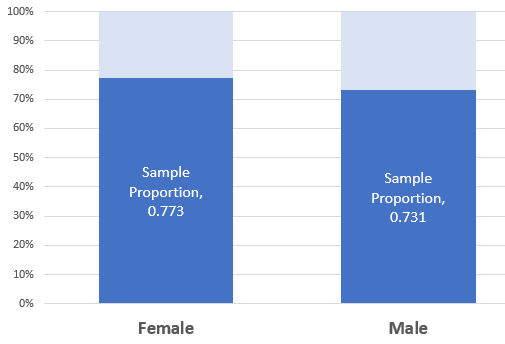
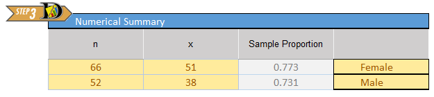
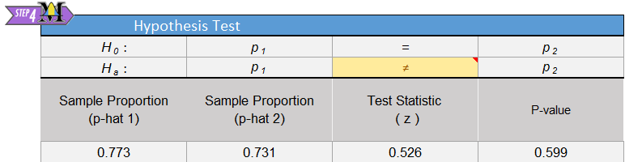
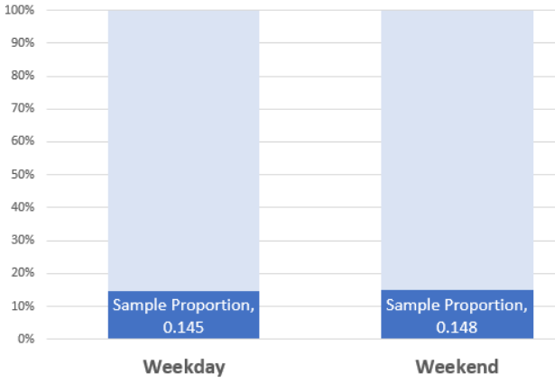

 

**Optional Lesson Video**

<iframe width="90%" align="right" src="https://www.youtube.com/embed/videoseries?list=PLaZryQtbPQC-_0HG1XNei5qVvNogVs95k" frameborder="1" allow="autoplay; encrypted-media" allowfullscreen></iframe>

## Lesson Outcomes

<a href="javascript:showhide('oc')">Show/Hide Outcomes</a>

By the end of this lesson, you should be able to do the following.

**Regarding Confidence Intervals for a comparison of two proportions: **

* Calculate and interpret a confidence interval for a comparison of two proportions given a confidence level.
* Identify a point estimate and margin of error for the confidence interval.
* Show the appropriate connections between the numerical and graphical summaries that support the confidence interval. 
* Check the requirements for the confidence interval.

**Regarding Hypothesis Testing for a comparison of two proportions:**

* State the null and alternative hypothesis for the chosen test. 
* Calculate the test-statistic and p-value of the hypothesis test.
* Assess the statistical significance by comparing the p-value to the α-level.
* Check the requirements for the hypothesis test.
* Show the appropriate connections between the numerical and graphical summaries that support the hypothesis test. 
* Draw a correct conclusion for the hypothesis test.

 

## Hypothesis Tests

### Another Taste of PTC

The ability to taste the chemical Phenylthiocarbamide (PTC) is hereditary.  Some people can taste it, while others cannot.
Even though the ability to taste PTC was observed in all age, race, and sex groups, this does not address the issue about whether men or women are more likely to be able taste PTC.

Further exploration of the PTC data allows us to investigate if there is a difference in the proportion of men and women who can taste PTC. The following contingency table summarizes Elise Johnson's results<!--<cite>Johnson06</cite>-->:
 
  Can Taste PTC?   Female   Male   Total
  ---------------- -------- ------ -------
  No               15       14     29
  Yes              51       38     89
  Total            66       52     118
                                   

  : **Gender Data Table**

<!-- {| class="basic" style="text-align:center" -->
<!-- |+ **Gender Data Table** -->
<!-- |- -->
<!-- ! Can Taste PTC? || Female || Male || Total -->
<!-- |- -->
<!-- !  No -->
<!-- | 15 || 14 || 29 -->
<!-- |- -->
<!-- ! Yes -->
<!-- || 51 || 38 || 89 -->
<!-- |- -->
<!-- ! Total -->
<!-- | 66 || 52 || 118 -->
<!-- |- -->
<!-- |} -->

These data are available in the file [PTCTasting](./Data/PTCtasting.xlsx).  Note the way the data are organized in the file.  One column gives the gender, another column indicates if the individual can taste PTC, and a third column gives counts for each group.

Researchers want to know if the ability to taste PTC is a sex-linked trait. This can be summarized in the following research question: Is there a difference in the proportion of men and the proportion of women who can taste PTC?  The hypothesis is that there is no difference in the the true proportion of men who can taste PTC compared to the true proportion of women who can taste PTC.

A sample of 66 females and 52 males were provided with PTC strips and asked to indicate if they could taste the chemical or not.  (This research was approved by the BYU-Idaho Institutional Review Board.)

When working with categorical data, it is natural to summarize the data by computing proportions. If someone has the ability to taste PTC, we will call this a success.  The sample proportion is defined as the number of successes observed divided by the total number of observations.  For the females, the proportion of the sample who could taste the PTC was:
$$
\hat p_1 = \frac{x_1}{n_1} = \frac{51}{66}
$$
This is approximately 77.3% of the people who were surveyed.  For the males, the proportion who could taste PTC was:
$$
\hat p_2 = \frac{x_2}{n_2} = \frac{38}{52}
$$
This works out to be about 73.1%.

When working with data for two proportions, graphically displaying the data can help us compare each proportion. Pie charts and bar charts are essential tools for describing our data. The Math221 Statistics Toolbox automatically creates a side-by-side 100% stacked bar chart when you input the data into the "Two Proportions" tab. 

Click on the link at right if you would like to learn how to create a side-by-side 100% stacked bar chart on your own in Excel.
<a href="javascript:showhide('ins')">Show/Hide Instructions</a>

<!-- To access this content, scroll to the bottom of the editing page and click on the link "Software:(Excel or SPSS)-(PageName)" -->
<!-- {{Software_Filter | PageName=SideBySidePieCharts}} -->

Excel Instructions

**To create 100% Stacked Bar Charts in Excel, do the following:**

For this example we will continue to use the PTCTasting data set. 

- First, re-arrange the summary of the data so that it looks like the table above, but without a row and column for total.
- Highlight the counts and the row and column headings. Now click on the "Insert" tab and select the 3rd option under the "2D Column" heading. 

 
- Your graph would look like the image below. You can further customize it by adding data labels, titles, changing colors, etc.

 

 

 

The null and alternative hypotheses for a test of equality of two proportions is:
$$
\begin{array}{rl}
H_0: & p_1 = p_2 \\
H_a: & p_1 \ne p_2 \\
\end{array}
$$

If the null hypothesis is true, then the proportion of females who can taste PTC is the same as the proportion of males who can taste PTC.

The test statistic is a $z$, and is given by:
$$
z = \frac{ \left( \hat p_1 - \hat p_2 \right) - \left( p_1 - p_2 \right) }{ \sqrt{\hat p \left( 1-\hat p \right) \left( \frac{1}{n_1} + \frac{1}{n_2} \right) } }
$$
where
$$
\begin{array}{lll}
n_1= \text{sample size for group 1:} 	& n_1 = 66 	& \text{(number of females)} \\
n_2= \text{sample size for group 2:}	& n_2 = 52	& \text{(number of males)} \\
\hat p_1= \text{sample proportion for group 1:} & \hat p_1 = \frac{x_1}{n_1} = \frac{51}{66} & \text{(proportion of females who can taste PTC)}\\
\hat p_2= \text{sample proportion for group 2:} ~ & \hat p_2 = \frac{x_2}{n_2} = \frac{38}{52} & \text{(proportion of males who can taste PTC)}\\
\hat p= \text{overall sample proportion:} 	& \hat p = \frac{x_1+x_2}{n_1+n_2} = \frac{89}{118} & \text{(overall proportion who can taste PTC)}\\
\end{array}
$$

Substituting these values into the equation for the test statistic, $z$, we get:
$$
\begin{align}
z & = \frac{ \left( \hat p_1 - \hat p_2 \right) - \left( p_1 - p_2 \right) }{ \sqrt{\hat p \left( 1-\hat p \right) \left( \frac{1}{n_1} + \frac{1}{n_2} \right) } }
\\
& = \frac{ \left( \hat p_1 - \hat p_2 \right) - \left( 0 \right) }{ \sqrt{\hat p \left( 1-\hat p \right) \left( \frac{1}{n_1} + \frac{1}{n_2} \right) } } \\
& ~ ~ ~ ~ ~ \textrm{In the null hypothesis, we assumed that} ~ p_1=p_2. \\
& ~ ~ ~ ~ ~ \textrm{Or after subtracting,} ~ p_1-p_2=0 \\
& ~ ~ ~ ~ ~ \textrm{So, we substituted} ~ 0 ~ \textrm{for} ~ p_1-p_2 ~ \text{in the previous step.} \\
& = \frac{ \left( \frac{51}{66} - \frac{38}{52} \right) - (0) }{ \sqrt{\frac{89}{118} \left( 1-\frac{89}{118} \right) \left( \frac{1}{66} + \frac{1}{52} \right) } } \\
& = 0.526 \\
\end{align}
$$

The test statistic is $z=0.526$. Under the null hypothesis, this follows a standard normal distribution.  So, we can use the Normal Probability applet to compute the $P$-value. We are conducting a two-sided test, so we will shade both tails in the applet.

Since $P\textrm{-value} = 0.599 > 0.05 = \alpha$, we fail to reject the null hypothesis.  In English we say, there is insufficient evidence to suggest that the true proportion of males who can taste PTC is different from the true proportion of females who can taste PTC.

Men and women appear to be able to taste PTC in equal proportions.  There is not enough evidence to say that one gender is able to taste PTC more than the other.
It appears that the ability to taste PTC is not a sex-linked trait.

### Using Excel to perform these calculations

<!-- {{Content:Excel/SPSS-Two Proportion HT}} -->

Just like we did for one proportion, we will use the [Math 221 Statistics Toolbox](./Data/Math221StatisticsToolbox.xltx) to perform hypothesis tests for two proportions. 

Click on the link at right for instructions on using this spreadsheet to perform hypothesis testing.
<a href="javascript:showhide('ins')">Show/Hide Instructions</a>

For this example we will consider the "PTC" data above.

- **Step 1**: Open the Excel file Math221 Statistics Toolbox and click on the "Two Proportions" tab at the bottom of the spreadsheet. Find the group of cells labeled "Numerical Summary". Here we will input the values of $x_1$, $n_1$, $x_2$, and $n_2$ from the PTC tasting data above.

- The yellow boxes indicate the input spaces. These are the only cells into which you will enter data.

- **Confidence Interval**: Next, we indicate our desired level of confidence for our confidence interval. Down and to the right of where we entered in our counts is a block of cells labeled "Confidence Interval". There is a yellow cell there, I12, where we can choose a confidence level. By default the cell contains the value 95%. The confidence interval bounds are shown as well as the sample proportion, $\hat{p}$ and the margin of error.

 

- **Hypothesis Test**: To conduct a hypothesis test we must define our null and alternative hypotheses. To the right of the "Numerical Summary" cells is a block of cells labeled "Hypothesis Test". The null hypothesis is always the same and does not need to be updated. For the alternative hypothesis we can change the yellow cell, K6, to select the type of alternative hypothesis we wish to test, i.e. "Greater Than", "Less Than", or "Not Equal To."

The results of the hypothesis test are given immediately below where we define the hypotheses:

 

- Compare the z-score and $P$-value with the one you calculated by hand. They're the same!
 

 

### Mortality Rates and Day of Admission: Aortic Aneurysms

Some people have claimed that mortality (death) rates are higher for patients admitted to a hospital on a weekend compared to patients admitted on a weekday.  Researchers Chaim Bell and Donald Redelmeier analyzed
admission data from hospital emergency rooms in Ontario, Canada <!--<cite>Bell01</cite>-->.

The aorta is a major artery that takes oxygen-rich blood from the heart to the entire body.  In some patients, this artery can swell like a balloon and burst.  If this occurs in the abdomen, the technical term for the event is a ruptured abdominal aortic aneurysm.  Although this condition is treatable, it requires immediate action, or the patient will die rapidly.

The problem is that the quality of care in an emergency care facility may differ at different times of the week.  Doctors Bell and Redelmeier hypothesized that the probability that a patient with an aortic aneurysm will die is greater if they are admitted to a hospital on a weekend compared to a weekday.

**Hypothesis:**
The proportion of patients with a ruptured abdominal aortic aneurysm who will die is greater on the weekends than on weekdays.

To test this claim, the researchers accessed medical records for several patients admitted to the emergency department of the hospitals in Ontario, Canada.  They recorded the number of patients admitted with an aortic aneurysm on weekdays compared to weekends.

Data representative of their results are given below <!--<cite>Bell01</cite>-->.

  Outcome     Weekday Admission   Weekend Admission
  ----------- ------------------- -------------------
  Died (x)    $x_1 = 1476$        $x_2 = 553$
  Survived    $2669$              $756$
  Total (n)   $n_1 = 4145$        $n_2 = 1309$
                                  

  : **Aortic Aneurysm Outcomes**

<!-- {| class="basic" style="text-align:center" -->
<!-- |+ **Aortic Aneurysm Outcomes** -->
<!-- |- -->
<!-- ! Outcome || Weekday Admission ||  Weekend Admission -->
<!-- |- -->
<!-- ! Died (x) -->
<!-- | align="right" | $x_1 = 1476$ -->
<!-- | align="right" | $x_2 = 553$ -->
<!-- |- -->
<!-- ! Survived -->
<!-- | align="right" | $2669$ -->
<!-- | align="right" | $756$ -->
<!-- |- -->
<!-- ! Total (n) -->
<!-- | align="right" | $n_1 = 4145$ -->
<!-- | align="right" | $n_2 = 1309$ -->
<!-- |- -->
<!-- |} -->

Answer the following questions:

1. Use the data above to find the estimated proportion of patients admitted with an aortic aneurysm on a weekday who will die, $\hat p_1$.

<a href="javascript:showhide('Q1')">Show/Hide Solution</a>

$\hat p_1 = 0.3561$

 

2. Use the data to compute the estimated proportion of the patients admitted on a weekend that will die, $\hat p_2$.

<a href="javascript:showhide('Q2')">Show/Hide Solution</a>

$\hat p_2 = 0.4225$

 

3. What do you notice about $\hat p_1$ and $\hat p_2$?

<a href="javascript:showhide('Q3')">Show/Hide Solution</a>

$\hat p_2~>~\hat p_1$ 

 

4. Without doing any more calculations, do you think that there is a significant increase in the death rates of patients admitted on a weekend compared to those admitted on a weekday? Justify your answer.

<a href="javascript:showhide('Q4')">Show/Hide Solution</a>

- It appears that those admitted on a weekend have a greater death rate than those who are admitted on a weekday, but we do not know if it is a statistically significant difference until we do a hypothesis test.

&nbsp;

 

 

<!-- #### Side-by-side Bar Charts -->

<!-- If the data are considered counts, then a side-by-side bar chart is usually the preferred plot. -->

<!-- <!-- To access this content, scroll to the bottom of the editing page and click on the link "Software:(Excel or SPSS)-(PageName)" --> -->
<!-- <!-- {{Software_Filter | PageName=SideBySideBarCharts }} --> -->

<!-- 
Excel Instructions
 -->
<!-- 
 -->
<!-- **To create side-by-side bar charts in Excel, do the following:** -->

<!-- - First, make sure the data are organized so that the first column gives the outcome (died or survived), the next column indicates the day of admittance (weekday or weekend) and the last column shows the counts. -->
<!-- - Then highlight the all three columns but just for the "Weekday" data.   -->
<!-- - Now click on the "Insert" tab and then the "Chart" button, and select "column".  Please select the most basic 2D column chart. -->
<!-- - Next you can repeat the process above but highlighting the "Weekend" data for all three columns.   -->
<!-- - To keep the two pie charts straight, you can add a title. If "Chart Title" is already displayed on the graph, simply double-click it to type in a new title. If you need to add a title, click on the "Design" tab under Chart Tools.  Next click on "Add Chart Element" and choose "Chart Title" from the list of options. Select "Above Chart" as the location of the title.    -->
<!-- - You can now type in the Titles, "Aortic Aneurysm Outcomes Weekday Admittance" and "Aortic Aneurysm Outcomes Weekend Admittance" or something similar. -->
<!--   -->
<!-- 
 -->
<!--   -->

 

$p_1$ is the true proportion of deaths in group 1, the weekday group.  $p_2$ is the true proportion of deaths in the weekend group.

 
 

We now conduct a formal hypothesis test to determine if the mortality (death) rate is greater on a weekend compared to a weekday.  First, we state the null and alternative hypotheses:
$$
\begin{align}
H_0: &  p_1 = p_2 \\
H_a: &  p_1 < p_2
\end{align}
$$
where group 1 represents the patients admitted on a weekday and group 2 represents patients admitted on a weekend.  Note that if $p_1 < p_2$, then the risk of death is greater in group 2 than in group 1. We will use the 0.05 level of significance.

#### Checking Requirements for the Hypothesis Test

 

When you check the requirements for this procedure, you are actually checking that you have at least 10 successes and 10 failures in both Group 1 and Group 2. All four conditions must be true in order to conduct the test.

 
 

If the sample size is large in both groups, then we can use the normal distribution to compute the $P$-value.  To check if the sample size is large enough, we need to check the following requirements:
$$
\begin{array}{rrr}
n_1 \cdot \hat p_1 \ge 10                 && n_2 \cdot \hat p_2 \ge 10 \\
n_1 \cdot \left(1-\hat p_1\right) \ge 10  && n_2 \cdot \left(1-\hat p_2\right) \ge 10
\end{array}
$$
If these requirements are satisfied, the $z$-statistic can be used to compute to assess whether the true population proportions are equal or if the risk of death is greater on weekends.

Note that the requirements are all satisfied:
$$
\begin{array}{rr}
n_1 \cdot \hat p_1  = 4145 \cdot 0.3561 = 1476 \ge 10  			& n_2 \cdot \hat p_2  = 1309 \cdot 0.4225 = 553 \ge 10  \\
n_1 \cdot \left(1-\hat p_1\right) = 4145 \cdot 0.6439 = 2669 \ge 10  	& n_2 \cdot \left(1-\hat p_2\right) = 1309 \cdot 0.5775 = 756 \ge 10
\end{array}
$$

**Reminder:** $~ x_1 = 1476,~x_2 =553$, $n_1=4145,~n_2 = 1309$, $\hat p_1 = \frac{x_1}{n_1},~\hat p_2 = \frac{x_2}{n_2}$,
and $\hat p = \frac{x_1+x_2}{n_1+n_2}$.

The test statistic can be computed by following these steps:

- First, find the combined proportion of "successes."  This is computed as:
$$
\hat p = \frac{x_1+x_2}{n_1+n_2} = \frac{1476+553}{4145+1309} = \frac{2029}{5454}
$$
- Next, enter the appropriate values into the equation for the $z$-score.
$$
\begin{array}{rcll}
z &=& \frac{ \left( \hat p_1 - \hat p_2 \right) - \left( p_1 - p_2 \right) }{ \sqrt{\hat p \left( 1-\hat p \right) \left( \frac{1}{n_1} + \frac{1}{n_2} \right) } } \\
&=& \frac{ \left( \hat p_1 - \hat p_2 \right) - \left( 0 \right) }{ \sqrt{\hat p \left( 1-\hat p \right) \left( \frac{1}{n_1} + \frac{1}{n_2} \right) } } & \text{We assumed } p_1=p_2. \\
&=& \frac{ \left( \hat p_1 - \hat p_2 \right) }{ \sqrt{\hat p \left( 1-\hat p \right) \left( \frac{1}{n_1} + \frac{1}{n_2} \right) } } \\
&=& \frac{ \left( \frac{1476}{4145} - \frac{553}{1309} \right) }{ \sqrt{\frac{2029}{5454} \left( 1-\frac{2029}{5454} \right) \left( \frac{1}{4145} + \frac{1}{1309} \right) } } \\
&=& -4.331
\end{array}
$$

(Make sure you can get this value using your calculator.)

- **Remember...**

The alternative hypothesis determines which area in the tails of the $z$-distribution will be shaded as you calculated the $P$-value.

If the alternative hypothesis is $\ldots$

- $p_1 \ne p_2$, shade both tails.

- $p_1 < p_2$, shade the left tail.

- $p_1 > p_2$, shade the right tail.
 

 

This $z$-score can be substituted into the Normal Probability applet to find the $P$-value.  Since the alternative hypothesis is that $p_1 < p_2$, we consider only the area to the left of $z=-4.331$.  The applet gives this area (our $P$-value) as $7.42 \times 10^{-6} = 0.00000742$.

Note that $P$-value$= 0.00000742 < 0.05 = \alpha$, so we reject the null hypothesis.

There is sufficient evidence to suggest that the true proportion of patients who die from an aortic aneurysm is greater on the weekends than on the weekdays.  It appears that there are substantial differences in the quality of care available to patients on the weekends compared to patients on weekdays.

### Mortality Rates and Day of Admission: Heart Attacks

Heart attacks are a leading cause of death in many areas of the world.
The study by Doctors Bell and Redelmeier included an analysis of the risk of dying of a heart attack, after admission to a hospital.  The researchers reported the following death rates, depending on whether the heart attack occurred on a weekday or a weekend <!--<cite>Bell01</cite>-->.

  Outcome     Weekday Admission   Weekend Admission
  ----------- ------------------- -------------------
  Died (x)    17,113              6,289
  Survived    100,596             36,222
  Total (n)   117,709             42,511
                                  

  : **Heart Attack Outcomes**

<!-- {| class="basic" style="text-align:center" -->
<!-- |+ **Heart Attack Outcomes** -->
<!-- ! Outcome  !! Weekday Admission !! Weekend Admission -->
<!-- |- -->
<!-- !Died (x) -->
<!-- | 17,113 || 6,289 -->
<!-- |- -->
<!-- !Survived -->
<!-- | 100,596 || 36,222 -->
<!-- |- -->
<!-- !Total (n) -->
<!-- | 117,709 || 42,511 -->
<!-- |- -->
<!-- |} -->

In this section, you will conduct a hypothesis test to determine if the proportion of patients who die of a heart attack is greater on weekends than on weekdays. Use the 0.05 level of significance.

Answer the following questions:

5. Summarize the relevant background information

<a href="javascript:showhide('Q5')">Show/Hide Solution</a>

- This was a study conducted by Doctors Bell and Redelmeier in which they analyzed the death rates depending on which day (weekday or weekend) the heart attack occurred and when the patients were admitted into the hospital.

 

6.  Describe the data collection process.

<a href="javascript:showhide('Q6')">Show/Hide Solution</a>

- The researchers collected data on patients admitted to hospitals for heart attacks and whether or not they died.  Separate data was kept for weekday hospital admissions and weekend hospital admissions.

 

7. The value of $\hat p_1$, the sample proportion of patients who died of a heart attack on a weekday, is $\hat p_1 = \frac{17113}{117709} = 0.14538$.  Find the value of $\hat p_2$.

<a href="javascript:showhide('Q7')">Show/Hide Solution</a>

$\displaystyle{\hat p_2 = \frac{6289}{42511}=0.14794}$

 

8. Create a chart illustrating the data.

<a href="javascript:showhide('Q8')">Show/Hide Solution</a>

 

9. Based on your answers to questions 7 and 8, does it appear that the risk of dying is greater if a heart attack occurs on a weekend than on a weekday?

<a href="javascript:showhide('Q9')">Show/Hide Solution</a>

- The sample proportions, $\hat p_1$ and $\hat p_2$ are very close.  Visually, there does not appear to be a difference.

 

10. If the proportion of patients who die of a heart attack is greater on weekends than on weekdays, which of the following would best describe the relationship?
- A. $p_1 = p_2$
- B. $p_1 > p_2$
- C. $p_1 < p_2$
- D. $p_1 \ne p_2$

<a href="javascript:showhide('Q10')">Show/Hide Solution</a>

- $p_1 < p_2$ is correct.  Note that group 1 is the weekday group and group 2 is the weekend group.

 

11. Replace the circles ($\bigcirc$) in the following null and alternative hypotheses with two of the following symbols: $=><\ne$.

$$
\begin{array}{rl}
H_0: &  p_1 \bigcirc p_2 \\
H_a: &  p_1 \bigcirc p_2
\end{array}
$$

<a href="javascript:showhide('Q11')">Show/Hide Solution</a>

$$
\begin{array}{rl}
H_0: &  p_1 = p_2 \\
H_a: &  p_1 < p_2
\end{array}
$$

 

12. What are the requirements for this test?

<a href="javascript:showhide('Q12')">Show/Hide Solution</a>

$$
\begin{array}{rrr}
n_1 \cdot \hat p_1 \ge 10 && n_2 \cdot \hat p_2 \ge 10 \\
n_1 \cdot \left(1-\hat p_1\right) \ge 10 && n_2 \cdot \left(1-\hat p_2\right) \ge 10
\end{array}
$$

 

13. Are the requirements for this hypothesis test satisfied?  Justify your answer.

<a href="javascript:showhide('Q13')">Show/Hide Solution</a>

$$
\begin{array}{rrr}
n_1 \cdot \hat p_1 = 17113 \ge 10 && n_2 \cdot \hat p_2 = 6289 \ge 10 \\
n_1 \cdot \left(1-\hat p_1\right) = 100596 \ge 10 && n_2 \cdot \left(1-\hat p_2\right) = 36222 \ge 10
\end{array}
$$

- Yes, all of the calculated quantities from the previous question are at least 10.

 

14. Write the equation for the test statistic, $z$.

<a href="javascript:showhide('Q14')">Show/Hide Solution</a>

$$
z = \frac{ \left( \hat p_1 - \hat p_2 \right) - \left( p_1 - p_2 \right) }{ \sqrt{\hat p \left( 1-\hat p \right) \left( \frac{1}{n_1} + \frac{1}{n_2} \right) }}
$$

 

15. Compute the value of the test statistic.

<a href="javascript:showhide('Q15')">Show/Hide Solution</a>

$z=-1.278$

 

16. Present a sketch of the sampling distribution, showing the test statistic and the $P$-value.

<a href="javascript:showhide('Q16')">Show/Hide Solution</a>

 

17. Find the $P$-value.

<a href="javascript:showhide('Q17')">Show/Hide Solution</a>

$P\textrm{-value} = 0.1006$

 

18. Compare the $P$-value to the level of significance.  Which is smaller?  Will you reject, or fail to reject, the null hypothesis?

<a href="javascript:showhide('Q18')">Show/Hide Solution</a>

$P\textrm{-value} = 0.1006 > 0.05 = \alpha$

 

19. What is your decision?

<a href="javascript:showhide('Q19')">Show/Hide Solution</a>

- Since the $P$-value is greater than $\alpha$, we fail to reject the null hypothesis.

 

20. Fill in the blanks in the following sentence:

- There is $\text{____________}$ evidence to suggest that the true proportion of patients who die of a heart attack is $\text{__________}$ on weekends than on weekdays.*

<a href="javascript:showhide('Q20')">Show/Hide Solution</a>

- There is **insufficient** evidence to suggest that the true proportion of patients who die of a heart attack is **greater** on weekends than on weekdays.

 

21. If you were to have a heart attack, would you be more concerned if it occurred on a weekend than on a weekday?

<a href="javascript:showhide('Q21')">Show/Hide Solution</a>

- No, the evidence suggests that the probability of dying of a heart attack is not greater on the weekends.

&nbsp;

 

 

## Confidence Intervals: Managing Fox Populations

During the mid 1800's, European foxes were introduced to the Australian mainland.  These predators have been responsible for the reduction or extinction of several species of native wildlife. <!--(Coates08)--> 

 

The Royal Botanic Gardens Cranbourne is a 914 acre (370 ha) conservation reserve outside Melbourne, Australia.  Predation by foxes has been an ongoing problem in the gardens.  To reduce the risk to native species, a systematic program of killing foxes was implemented.

One way to monitor the presence of foxes is to look for fox tracks in specific sandy areas, called sand-pads.  Before beginning a systematic effort to reduce the fox population, ecologists observed fox tracks in the sand-pads 576 out of the 950 times the sand-pads were observed.  After eliminating some of the foxes, the ecologists observed fox tracks in the sand-pads 268 times out of the 1359 times they checked the sand-pads <!--<cite>Coates08</cite>-->.  The ecologists want to know if there is a difference in the proportion of times fox tracks are observed before versus after the intervention to reduce the fox population.

One way to compare two proportions is to make a confidence interval for the difference in the proportions.

The equation for the confidence interval for the difference of two proportions may look a little daunting at first, but with some practice, it is not too difficult.

Before we compute the confidence interval, we first organize our data and calculate some statistics that will be useful later.  We divide the data into two groups: before foxes were targeted (Group 1) and after (Group 2). For each group, let $x_1$ and $x_2$ represent the number of times fox prints were observed in the sand-pads before and after the ecologists began systematically eliminating the foxes, respectively.  Similarly, Let $n_1$ and $n_2$ be the number of times the ecologists checked the sand-pads in the before and after periods, respectively.

**Fox Tracks Data**

| &nbsp; | Before Intervention | After Intervention | Combined Data |
|--------|---------------------|--------------------|---------------|
| **Fox Tracks Observed** |  $x_1 = 576$		| $x_2 = 268$   | $x_1 + x_2 = 576 + 268 = 844$ |
| **Total Observations** | $n_1 = 950$		| $n_2 = 1359$  		| $n_1 + n_2 = 950 + 1359 = 2309$ |

Similar to what we did in the lesson for [Lesson 17: Inference for One Proportion](Lesson17.html), we compute $\hat p$ for each group.

For group 1:
$$
\hat p_1 = \frac{x_1}{n_1} = \frac{576}{950}
$$

For group 2:
$$
\hat p_2 = \frac{x_2}{n_2} = \frac{268}{1359}
$$

An equation of the confidence interval for the difference between two proportions is computed by combining all the information above:
$$
\left(
\left( \hat p_1 -\hat p_2 \right)
- z^*
\sqrt{
\frac{\hat p_1 \left( 1 - \hat p_1 \right)}{n_1}
+
\frac{\hat p_2 \left( 1 - \hat p_2 \right)}{n_2}
}
,
~
\left( \hat p_1 -\hat p_2 \right)
+ z^*
\sqrt{
\frac{\hat p_1 \left( 1 - \hat p_1 \right)}{n_1}
+
\frac{\hat p_2 \left( 1 - \hat p_2 \right)}{n_2}
}
\right)
$$

If you need to review how to find the value of $z^*$ for other confidence levels, see page [Lesson 10: Inference for One Mean: Sigma Known (Confidence Interval)](Lesson10.html#a-little-more-precision).

The lower bound for a 95% confidence interval for the difference of the proportions of times fox prints are observed in the sand-pads is:

$$
\displaystyle{
\left( \hat p_1 -\hat p_2 \right)
- z^*
\sqrt{
\frac{\hat p_1 \left( 1 - \hat p_1 \right)}{n_1}
+
\frac{\hat p_2 \left( 1 - \hat p_2 \right)}{n_2}
}
}
$$

$$
\displaystyle{
=
\left( \frac{576}{950} - \frac{268}{1359} \right)
- 1.96
\sqrt{
\frac{\frac{576}{950} \left( 1 - \frac{576}{950} \right)}{950}
+
\frac{\frac{268}{1359} \left( 1 - \frac{268}{1359} \right)}{1359}
}
}
$$

$$
\displaystyle{
=
0.372
}
$$

and the upper bound is:

$$
\displaystyle{
\left( \hat p_1 -\hat p_2 \right)
+ z^*
\sqrt{
\frac{\hat p_1 \left( 1 - \hat p_1 \right)}{n_1}
+
\frac{\hat p_2 \left( 1 - \hat p_2 \right)}{n_2}
}
}
$$

$$
\displaystyle{
=
\left( \frac{576}{950} - \frac{268}{1359} \right)
+ 1.96
\sqrt{
\frac{\frac{576}{950} \left( 1 - \frac{576}{950} \right)}{950}
+
\frac{\frac{268}{1359} \left( 1 - \frac{268}{1359} \right)}{1359}
}
}
$$

$$
\displaystyle{
=
0.447
}
$$

Make sure you can compute these confidence intervals before reading on.

So, the 95% confidence interval for the difference in the proportions is:

$$
(0.372, 0.447)
$$

If we switch the way we label group 1 and group 2, then our confidence interval would have the opposite signs: $(-0.447, -0.372)$.

To interpret this confidence interval, we say, "We are 95% confident that the true *difference* in the proportions of times fox prints will appear in the sand-pads is between 0.372 and 0.447."

Notice that zero is not in this confidence interval, so zero is not a plausible value for $p_1 - p_2$.  Based on this result, it is reasonable to conclude that the proportion of times foxes are observed in the sand-pads is not the same before and after the effort to reduce their population.  It seems that the work to reduce the number of foxes is having an effect on their presence in the reserve.

As you may have guessed, the [Math 221 Statistics Toolbox](./Data/Math221StatisticsToolbox.xltx) can be used to calculate confidence intervals for the difference of two proportions.

### Checking Requirements for a Confidence Interval

The requirements for computing a confidence interval for two proportions are the same as the requirements for doing a hypothesis test.

$$
\begin{array}{rrr}
n_1 \cdot \hat p_1 \ge 10                 && n_2 \cdot \hat p_2 \ge 10 \\
n_1 \cdot \left(1-\hat p_1\right) \ge 10  && n_2 \cdot \left(1-\hat p_2\right) \ge 10
\end{array}
$$

In this example, all of the requirements are satisfied:

$$
\begin{array}{rr}
n_1 \cdot \hat p_1  = 950 \cdot 0.606 = 576 \ge 10  			& n_2 \cdot \hat p_2  = 1359 \cdot 0.197 = 268 \ge 10  \\
n_1 \cdot \left(1-\hat p_1\right) = 950 \cdot (1-0.606) = 374 \ge 10  	& n_2 \cdot \left(1-\hat p_2\right) = 1359 \cdot (1-0.197) = 1091 \ge 10
\end{array}
$$

Answer the following questions:

22. What is the value of $z^*$ for a 93% confidence interval?

<a href="javascript:showhide('Q22')">Show/Hide Solution</a>

$z^* = 1.8119$

 

23. Find the 93% confidence interval for the difference in the proprotions of the times fox prints are observed in the sand-pads before and after the effort to reduce the fox population.

<a href="javascript:showhide('Q23')">Show/Hide Solution</a>

$(0.374, 0.444)$

 

 

## Summary

Remember...

- When conducting hypothesis tests using two proportions, the null hypothesis is always $p_1=p_2$, indicating that there is no difference between the two proportions. The alternative hypothesis can be left-tailed ($<$), right-tailed($>$), or two-tailed($\ne$).

- For a hypothesis test and confidence interval of two proportions, we use the following symbols:
$$
\begin{array}{lcl}
\text{Sample proportion for group 1:} & \hat p_1 = \displaystyle{\frac{x_1}{n_1}} \\
\text{Sample proportion for group 2:} & \hat p_2 = \displaystyle{\frac{x_2}{n_2}}
\end{array}
$$

- For a hypothesis test only, we use the following symbols:

$$
\begin{array}{lcl}
\text{Overall sample proportion:} & \hat p = \displaystyle{\frac{x_1+x_2}{n_1+n_2}}
\end{array}
$$

- Whenever zero is contained in the confidence interval of the difference of the true proportions we conclude that there is no significant difference between the two proportions.

- You will use the Excel spreadsheet [Math 221 Statistics Toolbox](./Data/Math221StatisticsToolbox.xltx) to perform hypothesis testing and calculate confidence intervals for problems involving two proportions.
 

 

## Navigation

| **Previous Reading** | **This Reading** | **Next Reading** |
| :------------------: | :--------------: | :--------------: |
| [Lesson 17:   Inference for One Proportion](Lesson17.html) | Lesson 18:   Inference for Two Proportion | [Lesson 19:   Inference for Independence of Categorical Data](Lesson19.html) |

