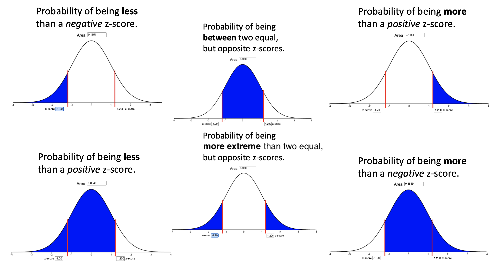

This is not designed to be a comprehensive review.  There may be items on the exam that are not covered in this review.  Similarly, there may be items in this review that are not tested on this exam.  You are strongly encouraged to review the readings, homework exercises, and other activities from Units 1-3 as you prepare for the exam. In particular, you should go over the [Review for Exam 1](Lesson08.html){target="_blank"} and the [Review for Exam 2](Lesson15.html){target="_blank"}. 

## Lesson 16 {.tabset .tabset-pills}

### Outcomes

By the end of this lesson, you should be able to:

1. Calculate a sample proportion
2. Interpret a sample proportion
3. Summarize categorical data with graphical summaries
4. Identify when a sample proportion will follow a normal distribution
5. Determine the mean of the sampling distribution of the sample proportion for a given parent population
6. Determine the standard deviation of the sampling distribution of the sample proportion for a given parent population
7. Calculate the z-score for a sample proportion, given the population proportion and sample size
8. Calculate probabilities of a sample proportion using the normal distribution.

### Summary

Remember...

1. The sample proportion $\hat{p}$ is computed by dividing the number of successes ($x$) found in a sample by the sample size ($n$),
$$
\text{Sample Proportion} \quad \widehat{p} = \frac{x}{n}
$$

2. The sample proportion $\widehat{p}$ is interpreted as the probability of a success occurring in the sample. It is a point estimate of the true proportion, $p$.

3. Two graphical summaries are typically used to show sample proportions.
    - **Pie charts** are used when you want to represent the observations as part of a whole, where each slice (sector) of the pie chart represents a proportion or percentage of the whole.
    - **Bar charts** are used when representing counts of how many times each category has been observed in the data. 

4. The sampling distribution of the sample proportion can be considered to be normally distributed when both $np \ge 10$ and $n(1-p) \ge 10$. The value of $np$ gives the expected number of successes for our sample, while the value of $n(1-p)$ gives the expected number of failures for our sample.

5. The mean of the sampling distribution of the sample proportion is $\mu_{\widehat{p}} = p$. In other words, sample proportions are centered around the true proportion.

6. The standard deviation of the sampling distribution of the sample proportion is given by $\sigma_{\widehat{p}} = \displaystyle{\sqrt{\frac{p\cdot(1-p)}{n}}}$. This quantifies how far sample proportions spread away from the true proportion.

7. If $np \ge 10$ and $n(1-p) \ge 10$, **probability calculations** using the Normal Probability Applet can be computed using the equation
$$
\displaystyle {z = \frac{\textrm{value} - \textrm{mean}}{\textrm{standard deviation}}
= \frac{\widehat p - p}{\sqrt{\frac{p \cdot (1-p)}{n}}}}
$$

8. To convert a z-score into a probability, we enter the z-score into the Normal Probability Applet and shade in the typical way.

 

 

## Lesson 17 {.tabset .tabset-pills}

### Outcomes

By the end of this lesson you should be able to do the following.

1. Recognize when a one proportion inferential procedure is appropriate
2. Create numerical and graphical summaries of the data
3. Perform a hypothesis test for one proportion using the following steps:
    a. State the null and alternative hypotheses
    b. Calculate the test-statistic and P-value of the test using software
    c. Assess statistical significance in order to state the appropriate conclusion for the hypothesis test
    d. Check the requirements for the hypothesis test
4. Create a confidence interval for one proportion using the following steps:
    a. Calculate a confidence interval using software
    b. Interpret the confidence interval 
    c. Check the requirements of the confidence interval
5. Calculate the sample size required to achieve a specified margin of error and level of confidence

### Summary

Remember...

1. Use the [Math 221 Statistics Toolbox](./Data/Math221StatisticsToolbox.xlsx) to perform hypothesis testing and calculate confidence intervals for problems involving one proportion. One proportion situations arise whenever there is a single sample of categorical data consisting of just *successes* and *failures*. This is like heads and tails on a coin, or yes/no type questions, or various other situations where there are only two possible categories.

2. Numerical Summaries for a one proportion analysis include the sample size $n$, number of successes $x$, and sample proportion $\widehat{p}$. Graphical Summaries consist of either a bar chart or pie chart, with either one being acceptable.

3. To perform a hypothesis test for one proportion use the following steps:
    a. State the null hypothesis in the form of $H_0: p = 0.#$ where $0.#$ is some value between 0 and 1, and the alternative hypothesis is of the form $H_a: p \ne 0.#$, $H_a: p > 0.#$ or $H_a: p < 0.#$.
    b. 

- The **estimator** of $p$ is $\widehat p$. $\displaystyle{ \widehat p = \frac {x}{n}}$ and is used for both confidence intervals and hypothesis testing.

- The requirements for a confidence interval are $n \widehat p \ge 10$ and $n(1-\widehat p) \ge 10$. The requirements for hypothesis tests involving one proportion are $np\ge10$ and $n(1-p)\ge10$.

- We can determine the sample size we need to obtain a desired margin of error using the formula $\displaystyle{ n=\left(\frac{z^*}{m}\right)^2 p^*(1-p^*)}$ where $p^*$ is a **prior estimate** of $p$. If no prior estimate is available, the formula $\displaystyle{ \left(\frac{z^*}{2m}\right)^2}$ is used.
 

 

## Lesson 18 {.tabset .tabset-pills}

### Outcomes

By the end of this lesson, you should be able to do the following.

1. Recognize when a difference of two proportions inferential procedure is appropriate
2. Create numerical and graphical summaries of the data
3. Perform a hypothesis test for the difference of two proportions using the following steps:
    a. State the null and alternative hypotheses
    b. Calculate the test-statistic and P-value of the test using software
    c. Assess statistical significance in order to state the appropriate conclusion for the hypothesis test
    d. Check the requirements for the hypothesis test
4. Create a confidence interval for the difference of two proportions using the following steps:
    a. Calculate a confidence interval using software
    b. Interpret the confidence interval
    c. Check the requirements of the confidence interval

### Summary

Remember...

- When conducting hypothesis tests using two proportions, the null hypothesis is always $p_1=p_2$, indicating that there is no difference between the two proportions. The alternative hypothesis can be left-tailed ($<$), right-tailed($>$), or two-tailed($\ne$).

- For a hypothesis test and confidence interval of two proportions, we use the following symbols:
$$
\begin{array}{lcl}
\text{Sample proportion for group 1:} & \hat p_1 = \displaystyle{\frac{x_1}{n_1}} \\
\text{Sample proportion for group 2:} & \hat p_2 = \displaystyle{\frac{x_2}{n_2}}
\end{array}
$$

- For a hypothesis test only, we use the following symbols:

$$
\begin{array}{lcl}
\text{Overall sample proportion:} & \hat p = \displaystyle{\frac{x_1+x_2}{n_1+n_2}}
\end{array}
$$

- Whenever zero is contained in the confidence interval of the difference of the true proportions we conclude that there is no significant difference between the two proportions.

- You will use the Excel spreadsheet [Math 221 Statistics Toolbox](./Data/Math221StatisticsToolbox.xlsx) to perform hypothesis testing and calculate confidence intervals for problems involving two proportions.
 

 

## Navigation

| **Previous Reading** | **This Reading** | **Next Reading** |
| :------------------: | :--------------: | :--------------: |
| [Lesson 19:   Inference for Independence of Categorical Data](Lesson19.html) | Lesson 20:   Review for Exam 3 | [Lesson 21:   Describing Bivariate Data: Scatterplots, Correlation, & Covariance](Lesson21.html) |

