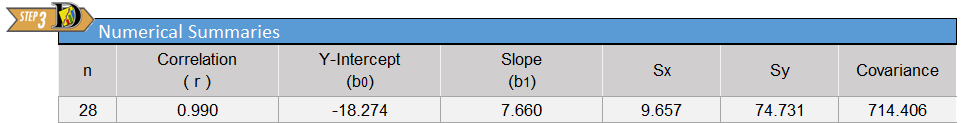
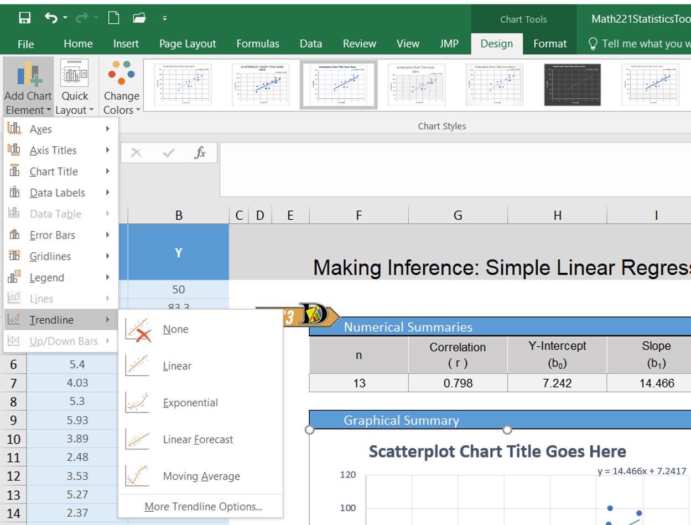
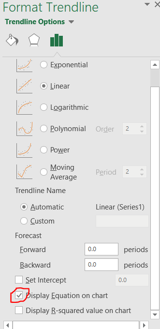
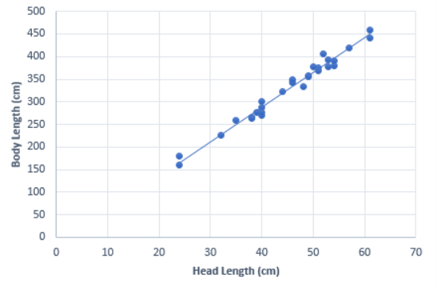

 

**Optional Lesson Video**

<iframe width="90%" align="right" src="https://www.youtube.com/embed/zlX2v7F0hhY?list=PLaZryQtbPQC-cf5OWjLW7bqFjhgmQAApJ" frameborder="1" allow="autoplay; encrypted-media" allowfullscreen></iframe>

## Lesson Outcomes

<a href="javascript:showhide('oc')">Show/Hide Outcomes</a>

By the end of this lesson, you should be able to:

- Identify the explanatory and response variable in a study.
- Calculate the slope and intercept of a regression model.
- Interpret the slope of the regression model.
- Make predictions using a regression model.

 

## Introduction to Regression

Simple linear regression is a method used to fit a line to data.  This provides a powerful tool to model bivariate data (i.e., data involving two variables.)  Regression allows us to write a linear equation that models the relationship between the **independent variable** ($X$) and the **dependent variable** ($Y$) which we can use to predict the value of $Y$ for any given variable $X$.  For the crocodile data, the independent variable is the head length and we will use this to predict the dependent variable, the body length.  Sometimes the independent variable is also called the **explanatory variable**, and the dependent variable is also called the **response variable**.

We will be using linear equations throughout this lesson.  Click on the link below if you would like to review lines and linear equations.

<!-- BEGIN REVIEW OF LINES  ***********************************************  -->
<a href="javascript:showhide('re')">Click Here for a Review of Linear Equations</a>

**Linear Equations**

A **linear equation** is the technical term for any equation that describes a line.  Two important characteristics of a line are its slope and its Y-intercept.  

The **Y-intercept** is the value at which the line crosses the Y-axis.  Stated differently, the Y-intercept is the value of $Y$ that corresponds to $X = 0$.  Given the equation of a line, you can find the Y-intercept by substituting $X = 0$ and solving for $Y$.

The **slope** of a line is a measure of how steep the line is.  It is sometimes described as *rise* over *run*.  If the slope is positive, then the values of $Y$ increase as the values of $X$ increase.  When the slope is expressed as a fraction, the numerator tells how much the points on the line change vertically as you move to the right the distance indicated by the denominator.  If the slope is negative, the values of $Y$ decrease as $X$ increases.  If the slope of a line is $\frac{2}{3}$, then the value of $Y$ will increase by 2 units if $X$ increases by three units.  For a line with slope $-5 \left( = \frac{-5}{1}\right)$, the value of $Y$ will *decrease* by 5 units if $X$ increases by one unit.

To describe a line, we need two pieces of information.   If we know the slope and the Y-intercept, these two values uniquely determine the line.  In this course, we will focus the **slope-intercept form** of a line.  The equation of a line in slope-intercept form is often written as:
$$Y = m X + b$$
where $Y$ is the dependent variable, $X$ is the independent variable, $m$ is the slope of the line, and $b$ is the Y-intercept.

Answer the following questions:

A. If the equation of a line is $Y = 3 X - 2$, where does it cross the Y-axis?

<a href="javascript:showhide('A')">Show/Hide Solution</a>

- At $-2$

 

B. If the equation of a line is $Y = 3 X - 2$, what happens to the value of $Y$ as $X$ increases?

<a href="javascript:showhide('B')">Show/Hide Solution</a>

- The value of $Y$ increases by 3 as $X$ increases by 1.  

&nbsp;

 

 
<!-- END REVIEW OF LINES ***********************************************  -->

In statistics, we may use different notation than you encountered in your algebra classes.  We use different symbols to denote the slope and Y-intercept than you may have seen before.  In your algebra class, you may have written the equation of a line as $Y = mX + b$, where $m$ is the slope and $b$ is the Y-intercept.  We represent the Y-intercept with the symbol $b_0$ and the slope with the symbol $b_1$.  In addition, we often write the Y-intercept as the first part of this equation.

<!--
Notice that this is the equation of a straight line. You might have written linear equations in the form $Y=mX+b$ in your algebra classes.  Notice that our equation has the same form.  The slope is given by $b_1$ and the $Y$-intercept is given by $b_0$.
-->
This leads to the following representation of the linear equation:
$$\widehat Y = b_0 + b_1 X$$
We use the symbol $\widehat Y$ to indicate a predicted value for $Y$. The value $b_0$ is the Y-intercept and $b_1$ is the slope.  Compare this notation to traditional slope-intercept form.

You may wonder why we would use this form (rather than traditional slope-intercept form) to express the equation.  Click on the link below for a brief explanation.

<!-- START EXPLANATION OF FORM ***********************************************  -->
<a href="javascript:showhide('ex')">Click Here for an Explanation</a>

  In this course we will relate one independent variable to one dependent variable.  In many cases, we will want to predict the value of $Y$, based on the value of $X$.  This is done using simple linear regression.  
  If there are several independent variables that influence the value of the dependent variable, we call it multiple regression.  A multiple regression equation with two independent variables, $X_1$ and $X_2$, could be written as:
$$Y = b_0 + b_1 X_1 + b_2 X_2$$
  If there were four independent variables, we would have the regression equation
$$Y = b_0 + b_1 X_1 + b_2 X_2 + b_3 X_3 + b_4 X_4$$
  Notice that the Y-intercept is the first term in this sum, and we can simply add more terms as needed.  The reason we write the Y-intercept first is that it allows us to easily add more terms to the model without having to rewrite or reorder any of the existing terms.
  In this course, you will not be conducting multiple regression analyses, but it is good for you to be aware that these procedures exist.  Multiple regression is used in many business forecasting models.

Answer the following questions:

A. For the linear regression equation, $Y = 1.2 - 3.4 X$, what is the slope?

<a href="javascript:showhide('a2')">Show/Hide Solution</a>

- slope = $-3.4$

 

B. For the linear regression equation, $Y = 1.2 - 3.4 X$, what is the Y-intercept?

<a href="javascript:showhide('b2')">Show/Hide Solution</a>

- y-intercept = $1.2$

 

C. If a line crosses the Y-axis at $-3$ and has a slope of $\frac{5}{2}$, how would you write the equation of this line in slope-intercept form?

<a href="javascript:showhide('c2')">Show/Hide Solution</a>

$Y = -3 + \frac{5}{2}X$

&nbsp;

 
 
<!-- END EXPLANATION OF FORM ***********************************************  -->

## Video Example: SuperCroc

A partial skeleton of an enormous extinct crocodilian was found in the Sahara Desert.  With a skull that is about six feet long, this massive creature was a fierce hunter.  Unfortunately, the skeleton is incomplete.  Almost none of the bones for the legs and tail were recovered.  How big was this massive creature?

To answer this question, paleontologist Paul Sereno teamed up with modern crocodile expert Brady Barr.  Their work is demonstrated in the National Geographic video *SuperCroc*.  Using linear regression, these researchers are able to estimate the size of SuperCroc almost 110 million years later simply by knowing the size of its skull. Before continuing, please follow this link to watch a 15 minute clip of this video.

 

This video is an hour and a half long. **YOU DO NOT NEED TO WATCH THE ENTIRE VIDEO**. Please watch only the last fifteen minutes, beginning at 1:19:00

 
 

<iframe id="kaltura_player_1578605835" src="https://cdnapisec.kaltura.com/p/1157612/sp/115761200/embedIframeJs/uiconf_id/41351812/partner_id/1157612?iframeembed=true&playerId=kaltura_player_1578605835&entry_id=0_kh1juzmd" width="800" height="450" allowfullscreen webkitallowfullscreen mozAllowFullScreen allow="autoplay *; fullscreen *; encrypted-media *" frameborder="0"></iframe>

## Estuarine Crocodiles

We will use Sereno and Barr's measurements on the lengths of Estuarine, or saltwater, Crocodiles' heads to estimate the length of their bodies.  Their measurements are given in the file [EstuarineCrocodiles(Modified).xlsx](./Data/Estuarine_Crocodile_(Modified).xlsx).  In the previous reading assignment, we created a scatterplot for these data.  We saw that there is a strong positive linear relationship between these two measurements.  In this lesson, we will fit a line to the data.  This line can be used to predict the length of a crocodile with a known head length.  In particular, we will use this line to estimate the length of SuperCroc.

## Regression Equation

We can use simple linear regression to develop an equation relating the head length of an estuarine crocodile to its body length.  Let $Y$ be the body length (in cm) and $X$ be the head length (in cm).

If we can assume that there is a linear relationship between the head length and the body length, then we can express this symbolically as:
$$
\widehat Y = b_0 + b_1 X
$$
where $\widehat Y$ represents the predicted body length of an estuarine crocodile with a head length of $X$. The numbers $b_0$ and $b_1$ are called the estimated "regression coefficients".  "Coefficient" is a fancy term that simply means a number, especially a number that is multiplied by a variable such as $X$.  We will use software to calculate the regression coefficients.

<!-- To access this content, scroll to the bottom of the editing page and click on the link "Software:(Excel or SPSS)-(PageName)" -->
<!-- {{Software_Filter | PageName=RegressionCoeffs }} -->

Excel Instructions

**To find the estimated regression coefficients ($b_0$ and $b_1$) in Excel, do the following:**

- Open the [Math 221 Statistics Toolbox](./Data/Math221StatisticsToolbox.xltx) file.
- Click on the "Linear Regression" tab.
- Paste your data for the explanatory variable (x) in the first column.  For this example, this is the head lengths.
- The data for the response variable (y) is pasted in the second column.  This is the variable you want to predict based upon the value of (x).  Our response variable is the body length of the crocodiles.
- The Y-intercept and slope coefficient are given in the Numerical Summary table.
 

 

## Interpreting the Regression Output

The output from the commands given above will include a table similar to the one shown here:

The regression coefficients are given in the columns labeled "Y-intercept ($b_0$)" and "Slope ($b_1$)".  The y-intercept gives the constant term (or the term that is not multiplied by $x$) which is the value of $b_0$. In this case, $b_0=-18.274$.  The "Slope" entry of the table gives the value that is to be multiplied by $X$; this is the slope of the regression equation.  In our model, $X$ represents the head length, in centimeters. The slope in our regression equation is $b_1=7.660$.  Putting all this together, we get the equation:

$$
\widehat Y = -18.274 + 7.660 X
$$

We put the "hat" on $Y$ to represent that this is an estimate of the value of $Y$.  The symbol $\widehat Y$ is read, "$Y$-hat".  We can also express this equation in the following way:
$$
\widehat{BodyLength} = -18.274 + 7.660 \cdot HeadLength
$$

The slope of the regression equation is 7.660.  This means that for each one-unit increase in $X$, we expect a corresponding increase in average of $Y$ of 7.660 units.  For every additional centimeter of head length, we expect that the mean body length to increase by 7.660 cm.

The $Y$-intercept is $-18.274$.  How should we interpret this value?  If there was an estuarine crocodile with a head length of $X=0$ cm, our equation predicts that its body length would be approximately negative 20 cm, or ($-20$) cm.  This is silly.  If it does not make sense to interpret the $Y$-intercept, we simply state that it is not interpretable.  The $Y$-intercept is included in the regression equation, even though it may not be interpretable.  It must be included to make the predictions more reasonable.

## Predictions

An 87 cm skull from a juvenile sarcosuchus was discovered.  We want to estimate the body length of this crocodilian using the regression equation we calculated for the estuarine crocodiles.  

To predict the body length, we can substitute $x=87$ into the regression equation:
$$
\widehat Y = -18.274 + 7.660 X = -18.274 + 7.660 (87) = 648.146
$$

Even though we can do this with a calculator, it is a little tedious and is subject to rounding errors.  There is a simpler, easier, and better way.

<!-- To access this content, scroll to the bottom of the editing page and click on the link "Software:(Excel or SPSS)-(PageName)" -->
<!-- {{Software_Filter | PageName=RegressionPredictions }} -->

Excel Instructions

**To use Excel to predict the value of $Y$ for any specified value of $X$, do the following:**

- Enter the explanatory (x) and response (y) variables in the first two columns of the Linear Regression spreadsheet.
- Find cell J18, which is labeled as "x" in the "Predicted Value" table to the right of the scatter plot.
- In cell J18, enter the value of x for which you wish to predict y.  For this example, enter 87 for x, which is the skull length of the juvenile sarcosuchus.
- The predicted value is given in the cell labeled "predicted."
 

- Notice that the point representing your predicted value shows up on the scatterplot in orange.

<!-- [http://www.byuimath.com/statisticswiki/images/0/01/LinearRegressionPredictedValue.png Click for details.] -->

 

Notice that our result using software does not exactly match the results we got by hand.  Using software we estimate the body length of the juvenile sarcosuchus to be: 648.155 cm.  These results differ slightly.  The "by hand" answer was derived using less precision than is available using software.  It is better to use the software to make these predictions.

Note that if a juvinile sarcosuchus has a head length of 87 cm, then the regression equation predicts the body length to be 648.155 cm.

Stop and think about this for a minute.  This juvenile sarcosuchus is estimated to be over six and a half meters long!  That is over 21 feet!  Imagine how big it might have been if it reached maturity!

Answer the following question:

1. The fossil of the mature specimen of sarcosuchus had a head length of 160 cm. Using the linear regression equation, how long would we predict the body would be?

<a href="javascript:showhide('Q1')">Show/Hide Solution</a>

- 1207 cm (12m or about 39 feet!)

&nbsp;

 

## Drawing the Regression Line on a Scatterplot

<!-- To access this content, scroll to the bottom of the editing page and click on the link "Software:(Excel or SPSS)-(PageName)" -->
<!-- {{Software_Filter | PageName=DrawingRegressionLine }} -->

Excel Instructions

**To draw the regression line on a scatterplot in Excel:**

The Math221 Statistics Toolbox has a line automatically drawn on the scatter plot it provides. However, to draw a line on your own in Excel, after creating the scatter plot you would follow these steps:

- Select the scatterplot by clicking anywhere on the plot
Right-click on one of the data points illustrated in your scatterplot.
- From the Design ribbon, click the "Add Chart Element" button, and select Trendline from the resulting dropdown menu

- Another menu should display. In that menu select Linear
- To display the equation of the line, you can select "More Trendline  Options" instead of Linear. In this resulting menu there is a box you can check for Display Equation on Chart.

 

 

The following plot shows the regression line on the scatterplot.

<!--
The equation of this line is $\widehat Y = b_0 + b_1 X$.  This is the equation obtained by following the directions given above.
-->

## Manatees and Powerboats

Manatees are curious, peaceful sea creatures that like to sun themselves just below the ocean's surface.  Some environmentalists have claimed that manatees are being killed by powerboat propellers.  The data set [Manatees.xlsx](./Data/Manatees.xlsx) gives the number of Florida powerboat registrations (in thousands) and the number of manatees killed by powerboats for the years 1977-2006. <!--<cite>Manatees06,Manatees-ManateeData,Manatees-PowerboatData</cite>-->

Is there a relationship between the number of powerboats registered in Florida and the number of manatees killed there by powerboats each year?  If the powerboats are killing the manatees, then we would expect to see a relationship between the number of powerboats and the number of manatees killed by powerboats.  As the number of powerboats increases, we would expect to observe a corresponding increase in manatee deaths due to powerboats.

We can use simple linear regression to model the relationship between the powerboat registrations and the manatee deaths.  In the next lesson, we will be able to conduct a hypothesis test to determine if this relationship is statistically significant.

Before conducting a regression analysis, it is important that you first create a scatterplot and visually examine the data.  If the cloud of data in your scatterplot shows a curvilinear pattern, it is not appropriate to conduct simple linear regression.  Procedures exist for handling curvilinear relationships.  If you have a situation in your profession that involves a curvilinear relationship, you can consult a statistician or else a textbook on Linear Regression such as Kuntner, et. al., *Applied Linear Regression Models*.

<!-- COMMENT  COMMENT  COMMENT  COMMENT  COMMENT  COMMENT  COMMENT   -->
<!-- COMMENT  COMMENT  COMMENT  COMMENT  COMMENT  COMMENT  COMMENT   -->
<!-- COMMENT  COMMENT  COMMENT  COMMENT  COMMENT  COMMENT  COMMENT   -->
In other words, simple linear regression is not appropriate when the graph shows a "curvilinear" shape (suggesting a nonlinear relationship).  We apply simple linear regression when the two variables show a "linear" shape.  If the data look like a random scattering of points, we would conclude that there is no linear relationship in the data.

+---------------+----------------------------------------+--------------------------------------------+-----------------------------------------+
| Graph         | |  |  |
+===============+========================================+============================================+=========================================+
| **Type**      | Linear Pattern                         | Apparent Random Scatter                    | Nonlinear Pattern                       |
+---------------+----------------------------------------+--------------------------------------------+-----------------------------------------+
|**Description**| "Hot Dog" Shape                        | "Hamburger" Shape                          | "Banana" Shape                          |
+---------------+----------------------------------------+--------------------------------------------+-----------------------------------------+
|**Decision**   | Conduct regression analysis            | Linear regression is not appropriate       | Linear regression is not appropriate    |
|               | to determine if there is a             |                                            |                                         |
|               | significant linear relationship        |                                            |                                         |
+---------------+----------------------------------------+--------------------------------------------+-----------------------------------------+

<!-- {| class="basic" style="text-align:center" width="80%" -->
<!-- ! Graph -->
<!-- | [[File:Scatter-HotDog.png"> -->
<!-- |- -->
<!-- ! Type -->
<!-- |Linear Pattern  || Apparent Random Scatter || Nonlinear Pattern  -->
<!-- |- -->
<!-- ! Description -->
<!-- |"Hot Dog" Shape  || "Hamburger" Shape || "Banana" Shape  -->
<!-- |- -->
<!-- ! Decision -->
<!-- | Conduct regression analysis   to determine if there is a   significant linear relationship -->
<!-- | Linear regression is not appropriate -->
<!-- | Linear regression is not appropriate  -->
<!-- |} -->
<!-- COMMENT  COMMENT  COMMENT  COMMENT  COMMENT  COMMENT  COMMENT   -->
<!-- COMMENT  COMMENT  COMMENT  COMMENT  COMMENT  COMMENT  COMMENT   -->
<!-- COMMENT  COMMENT  COMMENT  COMMENT  COMMENT  COMMENT  COMMENT   -->

### Regression Equation

We can use simple linear regression to develop an equation relating the number of powerboats to the number of manatees killed.  Consider a model where $Y$ is the number of manatees killed and $X$ is the number of powerboats registered (in thousands).

If we can assume that as the number of powerboat registrations increase, the increase in the number of manatees killed will be proportional, then we can write our model in the following way:
$$
\widehat Y = b_0 + b_1 X
$$
where $\widehat Y$ is the predicted number of manatees killed in a year in which the number of powerboat registrations (in thousands) is given by $X$.

Notice that this is the equation of a straight line. You might have written linear equations in the form $Y=mX+b$ in your algebra classes.  Notice that our equation has the same form.  The slope is given by $b_1$ and the $Y$-intercept is given by $b_0$.

### Interpreting the Regression Output

The output from the commands given above will include a table similar to the one shown here:

The Y-intercept term is not multiplied by anything except 1.  This is the value of $b_0$: $b_0=-42.542$.  The value of the slope is to be multiplied by $X$; this is the slope of the regression equation.  In our model, $X$ represents the number of powerboat registrations in Florida, in thousands.  The slope for our regression equation is $b_1=0.129$.  We get the equation:
$$
\widehat Y = -42.542 + 0.129 X
$$

We can also write the linear regression equation in the following way:
$$
\widehat{Manatees} = -42.542 + 0.129 \cdot Powerboats
$$

The slope of the regression equation is 0.129.  This means that for each one-unit increase in $X$, we expect a corresponding increase in $Y$ of 0.129 units.  Remember that the number of powerboats registered ($X$) was given in thousands.  So, a one-unit increase in $X$ implies an increase of a thousand powerboats.  So, for every thousand additional powerboats registered in Florida, we expect that an additional 0.129 manatees will be killed.  In other words, if there are 100 thousand additional powerboat registrations, we would expect to see about $0.129 \cdot 100 = 12.9$  additional manatee deaths.

The Y-intercept is $-42.542$.  How should we interpret this value?  If there were $X=0$ thousand powerboat registrations, we would expect that approximately negative 43 ($-43$) manatees would be killed by powerboats.  This is absurd.  If it does not make sense to interpret the $Y$-intercept, we simply state that it is not interpretable.  The $Y$-intercept is included in the regression equation, even though it may not be interpretable.  It must be included to make the predictions more reasonable.

The Y-intercept is not always negative or uninterpretable.  In some cases, the Y-intercept is the most important number in the equation.

### Predictions

If we want to predict the number of manatees that will be killed if, say, 850 thousand powerboats are registered, then we enter $X=850$ into the software and compute the predicted value.

Note that if there are 850 thousand powerboats registered, then the regression equation suggests that there will be an estimated 67.246 manatees killed.  Of course, we cannot kill a fraction of a manatee.  However, when making predictions, it is appropriate to leave the prediction as a decimal.  This is a predicted value, and it does not actually have to be attainable.

### Drawing the Regression Line on a Scatterplot

The following plot shows the regression line on the scatterplot.

You will observe that the points are not as tightly clustered around the regression line for the manatee data, compared to the crocodile data.  Why do you think this would happen?

 

## Introduction to Multiple Regression

Sometimes it is necessary to use more than one predictor (independent) variable to predict the value of a response (dependent) variable.  For example, if we want to predict the stopping distance for a car on dry roads, we might want to use ($i$) the initial speed of the car, ($ii$) the weight of the car, and ($iii$) the amount of tread on the tires to predict the distance required to stop the car.

Although it is fairly straightforward to create a model and get the estimated multiple regression equation, the interpretation of the results can be a little tricky.  If you need to conduct multiple regression (that is, regression with several predictor variables) you may want to study the topic in depth or hire a statistician.
<!--
Most statistical packages (including SPSS) will easily handle multiple regression analyses.  Unfortunately, in many cases Excel provides incorrect results for multiple regression.  Microsoft seems to have been aware of the issues for decades, but the problem has not been corrected.  Using Excel to conduct multiple regression analyses is strongly discouraged.
-->

 

## What's in a Name?

When we want to refer to simple linear regression, there are a variety of names that could be used: simple linear regression, ordinary least-squares regression, linear regression, regression, or (most ostentatiously) simple ordinary linear least squares regression.

If we need to distinguish between simple linear regression and multiple regression, the key will be whether we use the word "multiple."  If we are discussing regression, and the word "multiple" is not used, then assume we are talking about simple least squares regression.
<!--

## Historical Notes
### Why is error called error?
### Why is regression called regression?

TextGoesHere

-->

 

## Summary

Remember...

- In statistics, we write the **linear regression equation** as $\widehat Y=b_0+b_1X$ where $b_0$ is the **Y-intercept** of the line and $b_1$ is the **slope** of the line. The values of $b_0$ and $b_1$ are calculated using software.

- Linear regression allows us to predict values of $Y$ for a given $X$. This is done by first calculating the coefficients $b_0$ and $b_1$ and then plugging in the desired value of $X$ and solving for $Y$.

- The **independent (or explanatory) variable ($X$)** is the variable which is *not* affected by what happens to the other variable. The **dependent (or response) variable ($Y$)** is the variable which *is* affected by what happens to the other variable. For example, in the correlation between number of powerboats and number of manatee deaths, the number of deaths is affected by the number of powerboats in the water, but not the other way around. So, we would assign $X$ to represent the number of powerboats and $Y$ to represent the number of manatee deaths.
 

 

## Navigation

| **Previous Reading** | **This Reading** | **Next Reading** |
| :------------------: | :--------------: | :--------------: |
| [Lesson 21:   Describing Bivariate Data: Scatterplots, Correlation, & Covariance](Lesson21.html) | Lesson 22:    Simple Linear Regression | [Lesson 23:   Inference for Bivariate Data)](Lesson23.html) |

