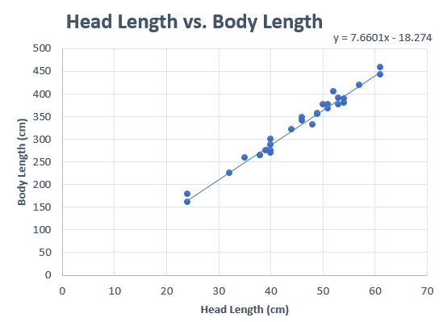
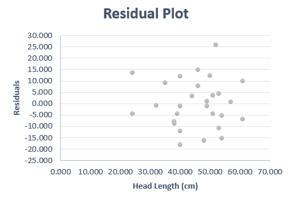

#### Optional Videos for this Lesson {.tabset .tabset-pills}

##### Part 1

<iframe id="kaltura_player_1657035963" src="https://cdnapisec.kaltura.com/p/1157612/sp/115761200/embedIframeJs/uiconf_id/42438262/partner_id/1157612?iframeembed=true&playerId=kaltura_player_1657035963&entry_id=1_2ejy5b0k" width="480" height="270" allowfullscreen webkitallowfullscreen mozAllowFullScreen allow="autoplay *; fullscreen *; encrypted-media *" frameborder="0"></iframe>

##### Part 2

<iframe id="kaltura_player_1657036689" src="https://cdnapisec.kaltura.com/p/1157612/sp/115761200/embedIframeJs/uiconf_id/42438262/partner_id/1157612?iframeembed=true&playerId=kaltura_player_1657036689&entry_id=1_36bz6qtv" width="480" height="270" allowfullscreen webkitallowfullscreen mozAllowFullScreen allow="autoplay *; fullscreen *; encrypted-media *" frameborder="0"></iframe>

##### Part 3

<iframe id="kaltura_player_1657037756" src="https://cdnapisec.kaltura.com/p/1157612/sp/115761200/embedIframeJs/uiconf_id/42438262/partner_id/1157612?iframeembed=true&playerId=kaltura_player_1657037756&entry_id=1_gi0es9iw" width="480" height="270" allowfullscreen webkitallowfullscreen mozAllowFullScreen allow="autoplay *; fullscreen *; encrypted-media *" frameborder="0"></iframe>

##### Part 4

<iframe id="kaltura_player_1657038095" src="https://cdnapisec.kaltura.com/p/1157612/sp/115761200/embedIframeJs/uiconf_id/42438262/partner_id/1157612?iframeembed=true&playerId=kaltura_player_1657038095&entry_id=1_90q9qt82" width="480" height="270" allowfullscreen webkitallowfullscreen mozAllowFullScreen allow="autoplay *; fullscreen *; encrypted-media *" frameborder="0"></iframe>

##### Part 5

<iframe id="kaltura_player_1657039270" src="https://cdnapisec.kaltura.com/p/1157612/sp/115761200/embedIframeJs/uiconf_id/42438262/partner_id/1157612?iframeembed=true&playerId=kaltura_player_1657039270&entry_id=1_v4140z66" width="480" height="270" allowfullscreen webkitallowfullscreen mozAllowFullScreen allow="autoplay *; fullscreen *; encrypted-media *" frameborder="0"></iframe>

## Lesson Outcomes

By the end of this lesson, you should be able to:

- Confidence Intervals for the slope of the regression line: 
    + Calculate and interpret a confidence interval for the slope of the regression line given a confidence level.
    + Identify a point estimate and margin of error for the confidence interval.
    + Show the appropriate connections between the numerical and graphical summaries that support the confidence interval. 
    + Check the requirements for the confidence interval.
- Hypothesis Testing for the slope of the regression line:
    + State the null and alternative hypothesis. 
    + Calculate the test-statistic, degrees of freedom and p-value of the hypothesis test.
    + Assess the statistical significance by comparing the p-value to the α-level.
    + Check the requirements for the hypothesis test.
    + Show the appropriate connections between the numerical and graphical summaries that support the hypothesis test. 
    + Draw a correct conclusion for the hypothesis test.

 

## Theory of Simple Linear Regression

When we compute an estimated regression equation, we assume that there is some true equation that describes the relationship between the $X$-variable and the mean value of $Y$.  This equation is unknown to us. In particular, we don't know what the coefficients are in this equation. In the estimated regression equation, we used $b_0$ and $b_1$ to represent the $Y$-intercept and slope, respectively.  These two coefficients are estimates of the unknown regression coefficients in the true equation.  We will use the Greek letter $\beta$ (pronounced "beta") to denote these true unknown coefficients.

The true regression line is written as:
$$
\textrm{Expected value of }~Y = \beta_0 + \beta_1 X
$$
where $\beta_0$ and $\beta_1$ are parameters.  These are unknown constants representing the true values for the population.

We know that $Y$ will not fall exactly on this line.  There will be some randomness in the observed values of $Y$.  So, we add a term, called the *error term*, to this equation.  This is a random variable, and we denote it by the Greek letter $\epsilon$ (pronounced "epsilon".)  The true regression equation is:
$$
Y = \beta_0 + \beta_1 X + \epsilon
$$
where $\beta_0$ and $\beta_1$ are parameters, and $\epsilon$ is a (normal) random variable.

## Checking Requirements of Simple Linear Regression

In order to do hypothesis tests and confidence intervals using a regression line, we need to be sure that certain conditions are satisfied.  There are five requirements for a linear regression model:

  1.  There is a linear relationship between $X$ and $Y$.
  2.  The error term ($\epsilon$) is normally distributed.
  3.  The variance of the error terms is constant for all values of $X$.
  4.  The $X$'s are fixed and measured without error.  (In other words, the $X$'s can be considered as known constants.)
  5.  The observations are independent.

These must be satisfied in order to conduct a hypothesis test or create confidence intervals involving regression lines.

We will illustrate the process of checking requirements using the estuarine crocodile data.

### Scatterplot

To check requirement 1, we do two things.  The first is to make a scatterplot and to visually check to see if there is a linear relationship between $X$ and $Y$.  This has been referred to as a "hot dog" shape in the data.

We want to make sure that there is no distinct curvature or other nonlinear characteristics.  This is simply a visual check of the data.

Consider the scatterplot of the estuarine crocodile data [EstuarineCrocodile(Modified).xlsx](./Data/Estuarine_Crocodile_(Modified).xlsx):

Notice how the data follow a linear shape.  This data set shows a particularly strong linear relationship.  In many cases, the data will show more spread than is illustrated here.

### Residuals

The *residual* for an observation is defined as the difference between the observed value of $Y$ and the value that would have been predicted by the regression line.  As an equation, this is expressed as:
$$
Residual = Y - \hat Y = Y - (b_0 + b_1 X)
$$

It is tedious to calculate the residuals by hand, but software can be used to find the residuals.

<!-- To access this content, scroll to the bottom of the editing page and click on the link "Software:(Excel or SPSS)-(PageName)" -->
<!-- {{Software_Filter | PageName=CalculateResiduals }} -->

Excel Instructions

**To find the residuals in Excel, do the following:**

- Open [Math 221 Statistics Toolbox](./Data/Math221StatisticsToolbox.xltx) and click on the "Linear Regression" tab
- Copy and Paste the dependent (or response) variable into the "Y" column (Column B).  The dependent variable (or response variable) is the thing you are trying to predict.  Often it is the more difficult/expensive variable to measure.
- Copy and paste the independent (or explanatory) variable into the "X" column (Column A).
- Your residuals will then be calculated in column Y of the Excel Spreadsheet.
 

 

### Residual Plot

The residual is calculated for each data point, so you have one residual for every observation in the data set.  It is hard to use so many numbers to make decisions.  How do you comprehend so much information at once? To help us understand the information in the residuals, we make what is called a *residual plot*. A residual plot is a scatterplot where the $X$-axis shows the independent variable ($X$) and the $Y$-axis presents the residuals for each value of $X$.

<!-- To access this content, scroll to the bottom of the editing page and click on the link "Software:(Excel or SPSS)-(PageName)" -->
<!-- {{Software_Filter | PageName=ResidualPlot }} -->

Excel Instructions

**To make a residual plot in Excel do the following:**

- Once the explanatory and response variables are entered into the correct columns in the [Math 221 Statistics Toolbox](./Data/Math221StatisticsToolbox.xltx) spreadsheet, you are given a scatter plot of residuals starting in cell S4, to the right of the hypothesis testing section.  

- To create a residual plot on your own, you can highlight columns X and Y, then click on the Insert Ribbon, and then click on "Scatter" (or the icon that looks like a scatter plot).  You want the first choice (Scatter with only markers), so select the first scatter plot choice.
 

 

The following image shows the residual plot for the estuarine crocodile data.

This residual plot shows random scatter. There is no obvious pattern in the data.  If linear regression is appropriate, then the residual plot will show no patterns and will consist of random scatter. If there is a pattern in the residuals, it suggests that linear regression is not appropriate.  

There are several patterns that could arise in a residual plot:

- **Curvature**  If the residual plot shows curvature, that suggests that the data are not linearly related.
- **Megaphone**  A megaphone shape occurs when points tend to be close together on one side of the graph and farther apart on the other side of the graph.  If there is a megaphone shape apparent in the residuals, it suggests that the variance of the error terms is not constant for all values of $X$.  It suggests that there is a difference in the spread of the residuals depending on the value of $X$.
- **Outliers**  If there are outliers in the residual plot, that suggests that the error terms are not normally distributed.  This should also be apparent in the scatterplot or histogram of the residuals.

### Histogram of the Residuals

Once the residuals have been calculated in Excel, we can assess if they are normally distributed using a histogram.  If the shape of the histogram of residuals does not show a distinct departure from a normal shape, we conclude the requirement of normal residuals has been met.Don't forget that you may need to try out various histograms with different number of bins to get a feel for the shape of the distribution of residuals.

The histogram of the residuals using 7 bins does not show a distinct or extreme departure from a normal shape.  We do not have evidence of nonnormality in the residuals.  We conclude that the residuals are normally distributed. In more advanced classes you will use a tool called a Q-Q plot to assess whether residuals are normally distributed.

### Requirements Summary

The following table describes how to check each of the requirements above.

<table>
<thead>
<tr class="header">
<th></th>
<th>
Requirement
</th>
<th>
How to Check
</th>
<th>
What you hope to see
</th>
</tr>
</thead>
<tbody>
<tr class="odd">
<td>
1.
</td>
<td>
Linear Relationship
</td>
<td>
Scatterplot
</td>
<td>
"Hot dog" shape
</td>
</tr>
<tr class="even">
<td></td>
<td></td>
<td>
Residual Plot
</td>
<td>
No pattern in the residuals
</td>
</tr>
<tr class="odd">
<td>
2.
</td>
<td>
Normal Error Term
</td>
<td>
Histogram of the Residuals
</td>
<td>
A shape that is approximately normal
</td>
</tr>
<tr class="even">
<td>
3.
</td>
<td>
Constant Variance
</td>
<td>
Residual Plot
</td>
<td>
No megaphone shape in the residuals
</td>
</tr>
<tr class="odd">
<td>
4.
</td>
<td>
$X$'s are Known 
Constants
</td>
<td>
Cannot be checked directly
</td>
<td>
$X$'s should be measured 
accurately and precisely
</td>
</tr>
<tr class="even">
<td>
5.
</td>
<td>
Observations are 
Independent
</td>
<td>
Cannot be checked directly
</td>
<td>
Knowing the value of one of the $Y$'s 
tells you nothing about any other points
</td>
</tr>
<tr class="odd">
<td></td>
<td></td>
<td></td>
<td></td>
</tr>
</tbody>
</table>

<!-- {| class="basic" style="text-align:left" -->
<!-- ! !! Requirement                      !! How to Check      !! What you hope to see -->
<!-- |- -->
<!-- |1. || Linear Relationship           || Scatterplot || "Hot dog" shape   -->
<!-- |- -->
<!-- | ||            || Residual Plot|| No pattern in the residuals  -->
<!-- |- -->
<!-- |2. || Normal Error Term             || Q-Q Plot of the Residuals  || Points in the Q-Q plot are close to the line  -->
<!-- |- -->
<!-- |3.  || Constant Variance             || Residual Plot              || No megaphone shape in the residuals  -->
<!-- |- -->
<!-- |4.  || $X$'s are Known   Constants|| Cannot be checked directly || $X$'s should be measured   accurately and precisely  -->
<!-- |- -->
<!-- |5.  || Observations are   Independent|| Cannot be checked directly || Knowing the value of one of the $Y$'s   tells you nothing about any other points  -->
<!-- |- -->
<!-- |} -->

If these requirements are met, then it is reasonable to assume that the use of regression with the data is appropriate.

## Hypothesis Test for Regression Coefficients

### Estuarine Crocodiles

We want to know if there is a linear relationship between $X$ and $Y$.  To test for this, we need to determine if the slope is different from zero.  If the slope is zero, then that suggests that there is no linear relationship between the two variables.  If the slope is not zero, that suggests that there is a linear relationship between the two variables.

The regression output will include all the calculations you need to conduct a hypothesis test for the regression slope:
 

In this course, we will test if the true slope is different from zero.  If the slope equals zero, then the regression line reduces from:
$$Y = \beta_0 + \beta_1 X + \epsilon$$

to:
$$Y = \beta_0 + \epsilon$$

In other words, the independent variable $X$ does not affect the value of the dependent variable $Y$.

The null and alternative hypotheses for this test are:
$$
\begin{array}{ll}
H_0: & \beta_1  =  0\\
H_a: & \beta_1 \ne 0\\
\end{array}
$$

We will assume the $0.05$ level of significance.

The relevant summary statistics include the sample size and the estimated regression equation ($\hat Y = b_0 + b_1 X$).  For the estuarine crocodile data, we get:
$$
\begin{array}{c}
n=28 \\
\hat Y = -18.274 + 7.660 X \\
\end{array}
$$

The test statistic follows a $t$-distribution. We are conducting a test for the slope.  The information related to the slope is given in the second row of the "Coefficients" table, which is labeled "Head Length (cm)".  Looking across the second row, we find the value of $t$ is given as 35.588.
$$
t=35.588
$$

This is a tremendously large value for t.  This indicates that there is a lot of evidence against the null hypothesis.

<!-- The degrees of freedom are given in the ANOVA table in the "Residual" row under the "df" column:

 -->

Remember, the $t$ distribution has one number describing its degrees of freedom. The degrees of freedom for this test is not shown on the Excel sheet, but is easy to calculate by hand. Because we used the dataset to estimate two population parameters (a slope and a y-intercept) we have used two degrees of freedom. There are 28 observations in our dataset.  The degrees of freedom equals $28-2 = 26$ for the estuarine crocodile data.
$$
df= 28-2 = 26
$$

With a test statistic of $t=35.588$, we get a very small $P$-value, "0.000" as shown in cell Q9.  

<!-- To access this content, scroll to the bottom of the editing page and click on the link "Software:(Excel or SPSS)-(PageName)" -->
<!-- {{Software_Filter | PageName=EstuarineCrocodilePvalue }} -->

<!--

Excel Instructions

Note that in the output for Excel, the $P$-value is given in scientific notation.  Also note that there are two values under $P$-value.  One is for the slope and the other is for the y-intercept.  In this class we will always be looking at the slope, which is the bottom or the "Predictors".  So, our $P$-value for this test is written as:

$$
P\textrm{-value} = 0.0000000000000000000000107211   
$$

or as

$$
1.07211E^-23
$$

Assuming $\alpha=0.05$, then $P\textrm{-value} = 1.07211E^-23 < 0.05 = \alpha$.
 

 
-->

Assuming $\alpha=0.05$, we reject the null hypothesis since the $P$-value is less than the level of significance.  There is sufficient evidence to suggest that there is a linear relationship between the head length and the body length of estuarine crocodiles.

It was appropriate to conduct this analysis, since the requirements of simple linear regression were satisfied.

### Manatees

Here is an excerpt from the output for the [Manatees.xlsx](./Data/Manatees.xlsx) data set:  <!--<cite>Manatees06</cite>-->

The null and alternative hypotheses for this test are:
$$
\begin{array}{ll}
H_0: & \beta_1  =  0\\
H_a: & \beta_1 \ne 0\\
\end{array}
$$

The relevant summary statistics include the sample size and the estimated regression equation ($\hat Y = b_0 + b_1 X$).
$$
\begin{array}{c}
n=35 \\
\hat Y = -42.542 + 0.129 X \\
\end{array}
$$

The test statistic follows a $t$-distribution.

Remember, we are conducting a test for the slope, so the information we need is given in the block of output labeled "Hypothesis Test of the Regression Slope".  We find the value of $t$ is given as 15.491.
$$
t=15.491
$$

Think about this result.  Is this a large or a small value for $t$?  What does this say about the conclusion to our test?

Remember, the $t$ has one number describing its degrees of freedom.  For this test, the degrees of freedom $35-2 = 33$. We subtract two from the total number of observations because we estimated a 2 population parameters for the line: a y-intercept and a slope.  
$$
df=33
$$

With a test statistic of $t=15.491$ and $33$ degrees of freedom, we get a very small $P$-value. The value is so small that when we round to just three decimal places, the $P$-value appears to be zero.

<!-- To access this content, scroll to the bottom of the editing page and click on the link "Software:(Excel or SPSS)-(PageName)" -->
<!-- {{Software_Filter | PageName=ManateePvalue }} -->

<!--

Excel Instructions

Note that in the output for Excel, the $P$-value is given in scientific notation.  Also note that there are two values under $P$-value.  One is for the slope and the other is for the y-intercept.  In this class we will always be looking at the slope, which is the bottom or the "Predictors".  So, our $P$-value for this test is written as:

$$
P\textrm{-value} = 0.000000000000000000105954   
$$

or as

$$
1.05954E^-19
$$

Assuming $\alpha=0.05$, then $P\textrm{-value} = 1.05954E^-19 < 0.05 = \alpha$.
 

 
-->
Assuming $\alpha=0.05$, our decision rule is to reject the null hypothesis, since the $P$-value is less than the level of significance.  There is sufficient evidence to suggest that there is a linear relationship between the number of powerboats registered in Florida and the number of manatees killed by powerboats.
This conclusion fits our intuition. If there are more boats on the water, it seems plausible that this will affect the number of manatees killed. If any statistical conclusion is counterintuitive, you should always be very wary!

 

## Confidence Intervals for Regression Coefficients

### Manatees

We are often interested in the range of plausible values for the true regression coefficients.  We can create a confidence interval for the slope and the $Y$-intercept in Excel.  

<!-- To access this content, scroll to the bottom of the editing page and click on the link "Software:(Excel or SPSS)-(PageName)" -->
<!-- {{Software_Filter | PageName=ManateeCIforRegressionCoefficients }} -->

Excel Instructions

**To find the residuals in Excel, do the following:**

- Open [Math 221 Statistics Toolbox](./Data/Math221StatisticsToolbox.xltx) and click on the "Linear Regression" tab
- Copy and Paste the dependent (or response) variable into the "Y" column (Column B).  The dependent variable is also known as the response variable.  It is the thing you are trying to predict.  Often it is the more difficult/expensive variable to measure.
- Copy and paste the independent (or explanatory) variable into the "X" column (Column A).
- You can change the confidence level in cell N12.    
- The confidence interval for the slope is found in cells P15 and Q15.  

 

 

In this case, the 95% confidence interval for the true slope of the regression line relating the number of thousand powerboats registered in Florida to the number of manatees killed is $(0.112, 0.146)$.  Remember the slope is the amount that $Y$ is expected to change if $X$ changes by one unit.  Also, recall that $X$ is given in terms of thousands of powerboats registered.  If an additional one thousand powerboats are registered (one unit increase in $X$,) we are 95% confident that the number of manatees killed will increase between 0.112 and 0.146.  Or in other words, if 100 thousand additional powerboats are registered in Florida, we expect 11.2 to 14.6 manatees will be killed.

Though the Math221 Excel toolbox does not compute a 95% confidence interval for the $Y$-intercept, many softwares do. The 95% confidence interval for the $Y$-intercept is $(-55.460, -29.623)$.  We are 95% confident that the expected number of manatees that will be killed if there are zero powerboats registered in Florida is between $-55.5$ and $-29.6$.  This is illogical.  There cannot be a negative number of manatees killed.  The $Y$-intercept is not interpretable.

Sometimes the $Y$-intercept makes sense in the context of the problem, but in many cases it is just used to get the best fit for the regression equation.

### Estuarine Crocodiles

We can compute a 95% confidence interval for the estuarine crocodile data in a similar manner.  
  

Answer the following questions:

1. Find a 95% confidence interval for the slope of the regression line relating the head lengths and body lengths of estuarine crocodiles.

<a href="javascript:showhide('Q1')">Show/Hide Solution</a>

$$
(7.218,~8.103)
$$

 

2. Interpret the confidence interval you created in the previous problem.

<a href="javascript:showhide('Q2')">Show/Hide Solution</a>

- We are 95% confident that the true slope of the regression line relating the head length and the body length of estuarine crocodiles is between 7.218 and 8.103.  So, we are 95% confident that if the length of the head increases by 1 cm, then the mean increase in the body length is expected to be between 7.218 and 8.103.

&nbsp;

 

## Summary

Remember...

- The unknown **true linear regression line** is $Y=\beta_0+\beta_1X$ where $\beta_0$ is the true y-intercept of the line and $\beta_1$ is the true slope of the line.

- A **residual** is the difference between the observed value of $Y$ for a given $X$ and the predicted value of $Y$ on the regression line for the same $X$. It can be expressed as:
$$
Residual = Y - \hat Y = Y - (b_0 + b_1 X)
$$

- To check all the requirements for bivariate inference you will need to create a **scatterplot** of $X$ and $Y$, a **residual plot**, and a **histogram of the residuals**. 

- We conduct a hypothesis test on bivariate data to know if there is a linear relationship between the two variables. To determine this, we test the slope ($\beta_1$) on whether or not it equals zero. The appropriate hypotheses for this test are:
$$
\begin{array}{1cl}
H_0: & \beta_1=0 \\
H_a: & \beta_1\ne0
\end{array}
$$

- For bivariate inference we use software to calculate the sample coefficients, residuals, test statistic, $P$-value, and confidence intervals of the true linear regression coefficients.
 

 

## Navigation

| **Previous Reading** | **This Reading** | **Next Reading** |
| :------------------: | :--------------: | :--------------: |
| [Lesson 22:   Simple Linear Regression](Lesson22.html) | Lesson 23:   Inference for Bivariate Data| [Lesson 24:   Review for Exam 4](Lesson24.html) |

