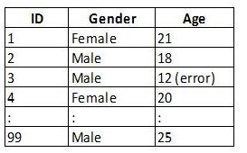

The following questions are intended to help you judge your preparation for the final exam. Carefully work through the problems. 

   
**Some of these questions are repeated on the preparation quiz for this lesson.**

This is not designed to be a comprehensive review.  There may be items on the exam that are not covered in this review.  Similarly, there may be items in this review that are not tested on this exam.  You are strongly encouraged to review the readings, homework exercises, and other activities from Units 1-4 as you prepare for the exam. In particular, you should go over the [Review for Exam 1](Lesson08.html){target="_blank"}, the [Review for Exam 2](Lesson15.html){target="_blank"}, and the [Review for Exam 3](Lesson20.html){target="_blank"}. 

<!-- Use the [[Index]] to review definitions of important terms. 
Index Needs to be built-->

## Lesson Outcomes 

<a href="javascript:showhide('oc')">Show/Hide Outcomes</a>

The expectation on the exam is the following outcomes. You should be able to do:

- All of the Outcomes from Lesson 08 (Unit 1), Lesson 15 (Unit 2), and Lesson 20 (Unit 3)
- Create a scatterplot of bivariate data.
- Interpret the overall pattern in a scatter plot to assess linearity and direction.
- Calculate the correlation coefficient.
- Interpret the correlation coefficient, $r$, as a measure of strength and direction of a linear relationship between two variables.
- Identify the explanatory and response variable in a study.
- Calculate the slope and intercept of a regression model.
- Interpret the slope of the regression model.
- Make predictions using a regression model
- Confidence Intervals for the slope of the regression line: 
    + Calculate and interpret a confidence interval for the slope of the regression line given a confidence level.
    + Identify a point estimate and margin of error for the confidence interval.
    + Show the appropriate connections between the numerical and graphical summaries that support the confidence interval. 
    + Check the requirements for the confidence interval.
- Hypothesis Testing for the slope of the regression line:
    + State the null and alternative hypothesis. 
    + Calculate the test-statistic, degrees of freedom and p-value of the hypothesis test.
    + Assess the statistical significance by comparing the p-value to the $\alpha$-level.
    + Check the requirements for the hypothesis test.
    + Show the appropriate connections between the numerical and graphical summaries that support the hypothesis test. 
    + Draw a correct conclusion for the hypothesis test.

 

## Lesson Summaries

Click on the link below for a review of the summaries from each lesson.

<a href="javascript:showhide('su')">Show/Hide Summaries</a>

**Here are the summaries for each lesson in unit 4. Reviewing these key points from each lesson will help you in your preparation for the exam.**

Lesson 21 Recap

- Creating **scatterplots** of bivariate data allows us to visualize the data by helping us understand its **shape** (linear or nonlinear), **direction** (positive, negative, or neither), and **strength** (strong, moderate, or weak). 

- The **correlation coefficient ($r$)** is a number between $-1$ and $1$ that tells us the direction and strength of the linear association between two variables. A positive $r$ corresponds to a **positive association** while a negative $r$ corresponds to a **negative association**. A value of $r$ closer to $-1$ or $1$ indicates a stronger association than a value of $r$ closer to zero.

- The **covariance** is a measure of how two variables vary together. The formula for the covariance is $s_{xy}=r \cdot s_x \cdot s_y$.
 

 

Lesson 22 Recap

- In statistics, we write the **linear regression equation** as $\hat Y=b_0+b_1X$ where $b_0$ is the **Y-intercept** of the line and $b_1$ is the **slope** of the line. The values of $b_0$ and $b_1$ are calculated using software.

- Linear regression allows us to predict values of $Y$ for a given $X$. This is done by first calculating the coefficients $b_0$ and $b_1$ and then plugging in the desired value of $X$ and solving for $Y$. 

- The **independent (or explanatory) variable ($X$)** is the variable which is *not* affected by what happens to the other variable. The **dependent (or response) variable ($Y$)** is the variable which *is* affected by what happens to the other variable. For example, in the correlation between number of powerboats and number of manatee deaths, the number of deaths is affected by the number of powerboats in the water, but not the other way around. So, we would assign $X$ to represent the number of powerboats and $Y$ to represent the number of manatee deaths.
 

 

Lesson 23 Recap

- The unknown **true linear regression line** is $Y=\beta_0+\beta_1X$ where $\beta_0$ is the true y-intercept of the line and $\beta_1$ is the true slope of the line.

- A **residual** is the difference between the observed value of $Y$ for a given $X$ and the predicted value of $Y$ on the regression line for the same $X$. It can be expressed as:
$$
Residual = Y - \hat Y = Y - (b_0 + b_1 X)
$$

- To check all the requirements for bivariate inference you will need to create a **scatterplot** of $X$ and $Y$, a **residual plot**, and a **Q-Q plot of the residuals**. 

- We conduct a hypothesis test on bivariate data to know if there is a linear relationship between the two variables. To determine this, we test the slope ($\beta_1$) on whether or not it equals zero. The appropriate hypotheses for this test are:
$$
\begin{array}{1cl}
H_0: & \beta_1=0 \\
H_a: & \beta_1\ne0
\end{array}
$$

- For bivariate inference we use software to calculate the sample coefficients, residuals, test statistic, $P$-value, and confidence intervals of the true linear regression coefficients.
 

 

 

<!--
Future questions:

5. Weight gain during pregnancy of the mother is an important indicator of infant health. A simple random sample of pregnant women on Egypt, Kenya, and Mexico was used to determine if weight gain during pregnancy differed in these three countries. Which hypothesis test would be most appropriate for this analysis?

8. O’Hare International Airport in Chicago has a reputation for having a large proportion of its flights being late. You design a study to see if this reputation is deserved. You find that the average on-time rate for all international airports in the US is 70%. You collect data and determine the on-time rate for O’Hare. You decide to construct a confidence interval to compare O’Hare’s on-time rate to the national average. Which confidence interval would be most appropriate for this study?
-->

## Review Questions

1. Which of the following variables is/are quantitative? (Mark all that apply)

    a. The number of people in a randomly selected classroom on campus
    b. The 3 most common brands of car found in the US
    c. The telephone number of a randomly selected business in town

 

2. Students in an Introductory Statistics class at BYU-Idaho were studying prices of cold cereal at grocery stores in Rexburg. To get a sample of cold cereal prices, they went to Albertson's and rolled a die to decide which box from the left of the top shelf they would start on. They then recorded every 6th cereal after the first, moving from left to right down the shelves, recording the name, size, and price of each cereal in their sample. Is this study an experiment or an observational study, and why?

    a. An experiment, because the students had control over which sampling method they used
    b. An experiment, because the students had control over which cereals would be selected for the study
    c. An observational study, because the students had no control over the price of the individual cereals
    d. An observational study, because the students had no control over which cereals were selected

 

For a Math 221 project, one group of students studied the ages of students on the BYU-Idaho campus. They collected data from a random sample of $n = 100$ students. The sample mean was 21.2 and the sample standard deviation was 2.61. An excerpt of their data is given below.
  

  
3. The group notices an error in their data. The age of one of the males (ID=3) was entered incorrectly. He is actually 21 years old. When the error is corrected, what will happen to the sample median?

    a. The median will increase.
    b. The median will decrease.
    c. The median will stay the same.
    d. It is not possible to determine this without the full data set.

 

4. The time to complete a standardized exam in the BYU-Idaho Testing Center is approximately normal with a mean of 70 minutes and a standard deviation of 10 minutes. Using the 68-95-99.7 rule, approximately what percentage of students will complete the exam in under fifty minutes? Give your answer accurate to one decimal place. 

5. The scores on the LSAT are approximately normal with mean of 150.7 and standard deviation of 10.2. (Source: www.lsat.org.) Queenís School of Business in Kingston, Ontario requires a minimum LSAT score of 157 for admission. Find the 35th percentile of the LSAT scores. Give your answer accurate to one decimal place. Use the applet. (Example: 124.7)

6. A team of dermatological researchers were studying skin cancer among 60-70 year old American men. Suppose you were a part of the research team and take a sample of $n=70$ men from this age group and calculate the mean number of skin cancer spots in the sample. Also suppose that it is known that the distribution of the number of cancer spots is right-skewed.
 
    What would be the shape of the distribution of sample means?
    
    How would the answer change, if at all, if the sample size for this study was $n=2$ instead? 

 
    

Tanker trucks are designed to carry huge quantities of gasoline from refineries to filling stations. A factory that manufactures the tank of the trucks claims to manufacture tanks with a capacity of 8550 gallons of gasoline. The actual capacity of the tanks is normally distributed with mean $\mu = 8544 ~\text{gallons}$ and standard deviation $\sigma = 12 ~\text{gallons}$.  Use this information to answer the next two questions.

 

7. A simple random sample of $n=20$ tanks will be selected. Find the z-score corresponding to a sample mean capacity for 20 tanks of 8544. Round your answer to three decimal places. (Example: 0.398)

 

8. A simple random sample of $n=50$ tanks will be selected. What is the probability that the mean capacity for these 50 tanks will be greater than 8540 gallons? Round your answer to three decimal places. (Example: 0.398) 

 

9. Which one of the following best describes the notion of "the significance level of a hypothesis test?"

    a. The probability of a type I error
    b. The probability of a type II error
    c. The probability of rejecting $H_0$, whether it's true or not
    d. The probability of obtaining a test statistic at least as extreme as the one you calculated, assuming the null hypothesis is true

 

10. The heights of young adult females in the United States are said to have a population standard deviation of $\sigma = 2.6 ~\text{inches}$. A sample was taken of $n = 85$ young adult females at BYU-I and the mean computed to be $\bar x = 65.4 ~\text{inches}$.Which of the following explanations describes the correct way to interpret the 95% confidence interval for this problem? (There may be more than one correct answer)

    a. There is a 95% chance that the true mean height of adult females in the United States is in our confidence interval.
    b. We are 95% confident that the true mean height of adult females in the United States is somewhere in our confidence interval.
    c. Approximately 95% of all 95% confidence intervals that could be computed from the population of all adult females in the United States will contain the true mean height.
    d. 95% of all of the heights of female adults in the US are in our confidence interval.
    e. 95% of the heights of female adults in our sample are in our confidence interval.
    
    
 

11. Marine biologists have been studying the effects of acidification of the oceans on weights of male baluga whales in the Arctic Ocean. One of the studies involves a random sample of 16 baluga whales. The researchers want to create a 95% confidence interval to estimate the true mean weight of male baluga whales. Their data follow a normal distribution. The population standard deviation of weights of male baluga whales is $\sigma = 125 ~\text{kg}$, and the researchers feel comfortable using this standard deviation for their confidence interval.Are the requirements for the use of a confidence interval met? Explain.

    a. Yes. The distribution of sample means is normal because the data are normal.
    b. Yes. The distribution of sample means is normal because the sample size is large.
    c. No. The distribution of sample means is not normal because the sample size is small.
    d. No. The fact that the data are normal does not imply that the distribution of sample means is normal.

 

12. An investor with a stock portfolio worth several hundred thousand dollars sued his broker and brokerage firm because he felt that lack of diversification in his portfolio led to poor performance for many years in a row.  In an effort to avoid close public scrutiny, the firm agreed to settle the conflict by an arbitration panel.  The arbitration panel compared a sample of 39 months of the investor's returns with the average of the Standard & Poor's 500-stock index for the same period in order to determine whether there was a substantial difference. The S&P has a known population mean return of 0.95.  Suppose that you are a member of this arbitration panel.  Conduct a hypothesis test to determine if the investor's portfolio performed significantly worse than the performance of the S&P 500.  Use a level of significance of $\alpha=0.05$. Open the data file Rates of Return.  What is the $P$-value for this test? Give your answer accurate to three decimal places. (Example: 0.034)

 

13. A financial economist is studying married couples in which both spouses work. He wants to compare the mean income earned by husbands with the mean income earned by their wives. Should he use independent sampling or dependent sampling, and why?

    a. Independent sampling. The two spouses are separate people with different jobs, so the husband's income doesn't depend on his wife's income.
    b. Independent sampling. How he selects the husband is independent of how he selects the wife.
    c. Dependent sampling. The husband's income depends to some degree on his wife's income.
    d. Dependent sampling. He needs to select couples for his sample, so whether a particular wife is included depends on whether her husband is included.

 

Pressures of supply and demand act directly on the prices of airline tickets. As the seats available on the plane begin to fill, airlines raise the price. If seats on a flight do not sell well, an airline may discount the tickets or even cancel the flight. Allie Henrich, a BYU-Idaho student, wanted to determine if there is a difference in the price of tickets listed 90 days before a flight compared with 14 days before the same flight. For her study she compared the prices of one-way flights from London's Heathrow Airport to various destinations in Europe. Using Travelocity.com, she recorded the lowest published fares for 90 nonstop midweek flights 90 days in advance and then found the lowest published price for the same destination again 14 days in advance. The prices (in US dollars) are given in the file DirectFlightCosts. Notice that for some destinations, flights were not available. Use this information to answer the next two questions.

 

14. What is the $P$-value for this test? Round your answer to 3 decimal places. (Example: 0.045)

 

15. Based on the results of the test, can you say that there is a difference in the cost of airline tickets purchased 90 days in advance compared with 14 days in advance? Use a level of significance of $\alpha=0.05$.

    a. Yes, because the $P$-value was greater than the level of significance.
    b. Yes, because the $P$-value was lower than the level of significance.
    c. No, because the $P$-value was greater than the level of significance.
    d. No, because the $P$-value was lower than the level of significance.

 

16. A real estate company wants to evaluate two of their home appraisers for consistency in preparation for their annual state certification. It is important that different appraisers be able to give similar estimates for homes and other properties. The company selects a random sample of 10 homes in different neighborhoods around the city and independently asks each appraiser for an estimate of the home value. After they receive the estimates for each home, the company subtracts the value given by the first appraiser from the value given by the second appraiser. They create a Q-Q plot of the differences and see that the points in the plot roughly form a straight line. Are the requirements for using the desired confidence interval satisfied? Explain.

    a. Yes. The distribution of mean differences is normal because the sample size is large.
    b. Yes. The distribution of mean differences is normal because the data have been determined to be normal.
    c. No. The distribution of mean differences is not normal because the sample size is not large enough.
    d. Not necessarily, because the company needs to check that the values given by each appraiser are normal, not that the differences are normal.
    
 

17. Now suppose the company of the previous item wants to use a hypothesis test to determine whether the estimates given by the two appraisers are different. Which of the following would be the most appropriate pair of hypotheses for such a test?

    a. $H_0:~\mu_1 = \mu_2$ &nbsp;&nbsp; $H_a:~\mu_1 \ne \mu_2$
    b. $H_0:~\mu_1 \ne \mu_2$ &nbsp;&nbsp; $H_a:~\mu_1 = \mu_2$
    c. $H_0:~\mu_d = 0$ &nbsp;&nbsp; $H_a:~\mu_d \ne 0$
    d. $H_0:~\mu_d \ne 0$ &nbsp;&nbsp; $H_a:~\mu_d = 0$

 

18. Suppose you create a 95% confidence interval for a mean, and get (-2.346, 8.775). You've been told to report this by saying, "We are 95% confident that the true mean is between -2.346 and 8.775." Exactly what does this mean?

    a. There is a 95% chance that the true mean is between -2.346 and 8.775.
    b. 95% of all 95% confidence intervals actually contain the true mean.
    c. 95% of the data are between -2.346 and 8.775.
    d. 95% of the sample means are between -2.346 and 8.775.

 

19. If $p=4/5$, what is the smallest value of $n$ that satisfies the requirements for a normally distributed $\hat p$?

 

20. Your little brother has a a career batting average of 0.233.  You want to determine the probability that he will have a batting average of over 0.250 next season when he will be up to bat 40 times. Are the conditions met so that the sample proportion $\hat p$ will be approximately normal?

    a. Yes. There is a large sample ($n>30$) so the sample proportion must be normal.
    b. Yes. $40\times0.250\ge10$ so the conditions are satisfied.
    c. No. $\hat p$ can only be normal if the sample data are normally distributed.
    d. No. $40\times0.233<10$ so the conditions are not satisfied.
    
 

21. A geneticist takes a simple random sample of $n = 140$ gamete (sex) cells from the testes of a dog to determine the proportion which contain the chromosomes for development into a male. Assume the (unknown) true proportion of dog gametes that contain the male chromosome is 46%. The geneticist conducts her sample and calculates $\hat p = 0.512$. Which of the following is the most correct interpretation of this statistic?

    a. There is a 51.2% chance that a randomly selected gamete cell will have the male chromosome.
    b. 51.2% of the eggs fertilized with these gametes will produce female puppies.
    c. 51.2% of all the gametes in the dog's testes have the male chromosome.
    d. 51.2% of the gametes in the sample have the male chromosome.
    
 

22. Researchers published a study in which they considered the incidence among the elderly of various mental health conditions such as dementia, bi-polar disorder, obsessive compulsive disorder, delirium, and Alzheimer's disease. In the U.S., 45% of adults over 65 suffer from one or more of the conditions considered in the study. Calculate the probability that fewer than 320 out of the $n = 750$ adults over 65 in the study suffer from one or more of the conditions under consideration.  Give your answer accurate to three decimal places in decimal form. (Example: 0.398)
  
 

23. Suppose you're testing $H_0:~p = 0.62$ against $H_a:~p \ne 0.62$ and you have calculated the test statistic to be $z = 1.334$. The area to the right of $z = 1.334$ (under the standard normal density curve) is 0.091. Which one of the following is the $P$-value of your hypothesis test?

    a. 0.046
    b. 0.091
    c. 0.182
    d. 0.909
    
 

24. Suppose you are dog breeder and you want to use a confidence interval to estimate the true mean fertility levels of pure bred cocker spaniels. It is known that the distribution of fertility levels of cocker spaniels is normal. How many measurements must you have in order to be sure the sampling distribution of $\bar x$ is normal?

    a. $n \ge 30$
    b. $n \ge 10$
    c. $n \ge 5$
    d. $np \ge 10$ and $n(1 - p) \ge 10$
    e. $np \ge 5$ and $n(1 - p) \ge 5$
    f. Any n will do.
    
 

25. An study is planned to compare the proportion of men who dislike anchovies with the proportion of women who dislike anchovies. The study seeks to determine if the proportions of men and women who dislike anchovies are different. A sample of 41 men was taken and the $\hat p$ estimate for the true proportion of men who dislike anchovies was determined to be 0.67. A sample of 56 women was also taken and the $\hat p$ estimate for the true proportion of women who dislike anchovies was determined to be 0.84. Are the requirements satisfied to perform this hypothesis test? Why?

    a. Yes, because the sample sizes of both groups are greater than 5.
    b. Yes, because in both cases $n \hat p > 10$
    c. Yes, because we know that the populations are normally distributed.
    d. No, because the sample size for the women is too small.

 

26. A study was conducted to measure the effectiveness of a diet program that claims to help manage weight. Subjects were randomly selected to participate. Before beginning the program, each participant was given a score based on his or her fitness level. After six months of following the diet, each participant received another score. The study wanted to test whether there was a difference between before and after scores. What is the correct alternative hypothesis for this analysis?

    a. $\mu \ne 0$
    b. $\mu_d \ne 0$
    c. $\mu_1 \ne \mu_2$
    d. $p_1 \ne p_2$

 

27. Weight Watchers wanted to predict how much weight a client would lose if they followed a prescribed exercise program in addition to their diet program. Volunteers were randomly divided into two groups, one group dieted but didn't exercise, and the other group dieted and followed the exercise program. For the exercise group, they used linear regression with percent compliance with the exercise program as the explanatory variable and pounds lost in three months as the response variable. One of the clients was told that his residual was 5.5 pounds. What does this mean?

    a. His predicted weight loss was 5.5 pounds higher than his actual weight loss.
    b. His actual weight loss was 5.5 pounds higher than his predicted weight loss.
    c. His actual weight loss was 5.5 pounds higher than it would have been if he didn't exercise.
    d. His predicted weight loss was 5.5 pounds higher than it would have been if he didn't exercise.

 

28. For the study in the previous question, the $b_1$ of the regression line was 5 pounds. Interpret this statistic.

    a. The average weight loss of all participants was 5 pounds.
    b. On average, the exercise participants lost 5 pounds more than non-exercisers.
    c. As percent compliance goes up by 1 percent, the average weight lost in three months increases by 5 pounds.
    d. Not enough information is given to answer this question.

 

29. When creating a scatter plot, a residuals plot, and a QQ plot, which of the five assumptions about linear regression are being checked? Check all that apply.

    a. The X values are measured without error.
    b. The residuals are Normally distributed.
    c. The observations are independent.
    d. There is a linear relationship between X and Y.
    e. The variance of the error term is constant for all values of X.

 

Pressures of supply and demand act directly on the prices of airline tickets. As the seats available on the plane begin to fill, airlines raise the price. If seats on a flight do not sell well, an airline may discount the tickets or even cancel the flight. Allie Henrich, a BYU-Idaho student, WANTED TO PREDICT THE PRICE OF TICKETS 14 DAYS BEFORE A FLIGHT BASED ON THE PRICE OF TICKETS LISTED 90 DAYS BEFORE THE SAME FLIGHT. For her study she compared the prices of one-way flights from London's Heathrow Airport to various destinations in Europe. Using Travelocity.com, she recorded the lowest published fares for 90 nonstop midweek flights 90 days in advance and then found the lowest published price for the same destination again 14 days in advance. The prices (in US dollars) are given in the file DirectFlightCosts. Notice that for some destinations, flights were not available. Use this information to answer questions 3 through 37.

 

30. Compute the sample correlation coefficient of the 14-Days-before-flight ticket prices compared with the 90-Days-before-flight ticket prices. Give your answer accurate to three decimals.

 

31. Create a scatterplot using these two variables. Using this scatterplot and referring to the correlation coefficient above, select the answer that best describes the data illustrated in the scatterplot.

    a. Linear with a fairly strong negative association
    b. Linear with a fairly strong positive association
    c. Linear with a strong negative association
    d. Nonlinear

 

32. Fill in the missing variables in the equation of the linear regression line used to predict the price of tickets 14 days before a flight based on the price of tickets listed 90 days before the same flight.

 

33. Predict the price of tickets listed 14 days before a flight based on the same flight costing $200, 90 days before a flight. Give your answer accurate to 1 decimal place.

 

34. Give a 95% confidence interval for the slope of the regression line obtained when 90-Days-before-flight ticket prices are used to predict 14-Days-before-flight ticket prices. (Round your answers to three decimal places, Example: 23.445)

 

35. Choose the correct null and alternative hypotheses for this analysis.

    a. $H_0:~b_0 = 0$ &nbsp;&nbsp; $H_a:~b_0 \ne 0$
    b. $H_0:~b_1 = 0$ &nbsp;&nbsp; $H_a:~b_1 \ne 0$
    c. $H_0:~\beta_0 = 0$ &nbsp;&nbsp; $H_a:~\beta_0 \ne 0$
    d. $H_0:~\beta_1 = 0$ &nbsp;&nbsp; $H_a:~\beta_1 \ne 0$

 

36. Give the value of the test statistic and the $P$-value. (Round your answers to three decimal places, Example: 0.567)

 

37. What decision do you make based on the $P$-value and the level of significance ($\alpha$), and, thus,  what do you conclude?

    a. Fail to reject the null. There is sufficient evidence to suggest that the slope of the true linear regression line does not equal zero. We conclude that there is not a linear relationship between 14-day ticket prices and 90-day ticket prices.
    b. Fail to reject the null. There is insufficient evidence to suggest that the slope of the true linear regression line does not equal zero. We conclude that there is not a linear relationship between 14-day ticket prices and 90-day ticket prices.
    c. Reject the null. There is sufficient evidence to suggest that the slope of the true linear regression line does not equal zero. We conclude that there is a linear relationship between 14-day ticket prices and 90-day ticket prices.
    d. Reject the null. There is insufficient evidence to suggest that that the the slope of the true linear regression line does not equal zero. We conclude that there is a linear relationship between 14-day ticket prices and 90-day ticket prices.

 

- Deciding which procedure to use: Here is a list of procedures we have studied so far this semester. For the next set of questions identify the one procedure that is most appropriate to the given situation. You may use a procedure once, more than once, or not at all.  

    a. One mean (sigma known)
    b. One mean (sigma unknown)
    c. Mean of the differences (paired samples)
    d. Difference of the means (independent samples)
    e. Several means (ANOVA)
    f. One proportion
    g. Difference of two proportions
    h. Chi-Squared test of independence
    i. Slope of the regression line

 

38. In the United States, mothers who live in poverty generally have babies with lower birthweight than those who do not live in poverty. The mean birthweight for babies born in the U.S. to mothers living in poverty is approximately 2800 grams. The CDC carries out a study to test the effectiveness of a new prenatal care program in reducing the number of low birthweight babies born. For the study, 30 mothers, all of whom live in poverty, participate in the program and birthweight data is recorded. Which hypothesis test would be most appropriate for this study? 

 

39. Engineers at an oil refinery find out how easily gasoline evaporates by measuring its vapor pressure. As they make gasoline, they need to determine whether its vapor pressure is high enough. The standard deviation of the vapor pressure of the gasoline made by the refinery is always 0.03 (pounds per square inch). Which hypothesis test would be most appropriate for this task? 

 

40. An attorney wants to know whether the percentage of Wal-Mart employees in Nevada who are over 45 years old is more than 30%. Which procedure would be most appropriate in this situation?

 

41. A marriage counselor conducted a study of couples, categorizing each of the couples as "communicative" or "non-communicative". Among other things, the counselor wanted to see whether the percentage of communicative couples whose marriage ended in separation or divorce was the same as the percentage of non-communicative couples whose marriage ended in separation or divorce. Which hypothesis test would be most appropriate for this study? 

 

42. A business marketing firm specializes in radio advertising. They hope to show there is a linear relationship between sales and the amount of money a client invests in radio advertising. Which procedure in the list above would be most appropriate for addressing this question? 

 
 

## Navigation

| **Previous Reading** | **This Reading** |
| :------------------: | :--------------: |
| [Lesson 23:   Inference for Bivariate Data](Lesson23.html) | Lesson 24:   Review for Exam 4 |

