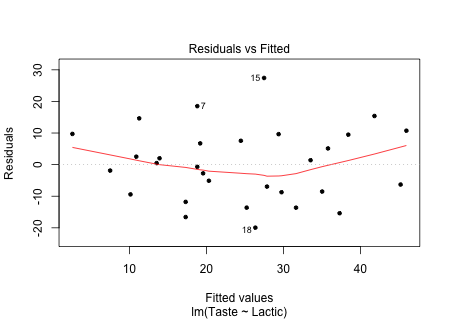
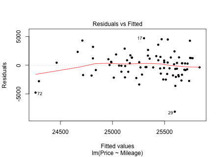

```{r,results='asis',echo=FALSE}
if(params$key==TRUE){
  if(params$plinks==TRUE) cat("* [Word Document](",paste(params$keyname,"docx",sep="."),")\n")
  if(params$plinks==TRUE) cat("* [PDF Document](",paste(params$keyname,"pdf",sep="."),")\n")
  cat("<!--")
  cat("\n")
} 
if(params$key!=TRUE){
  if(params$plinks==TRUE) cat("* [Word Document](",paste(params$docname,"docx",sep="."),")\n")
  if(params$plinks==TRUE) cat("* [PDF Document](",paste(params$docname,"pdf",sep="."),")\n")
  cat("\n")
}
```

```{r,include=FALSE}
library(ggplot2)
library(ggthemes)
library(pander)
library(mosaic)
panderOptions('keep.line.breaks',TRUE)
source("../scripts/ggQQline.R")
source("../scripts/normTail.R")
source("../scripts/221_Interactive_Functions.R")
```

**Instructions:  You are encouraged to collaborate with other students on the homework, but it is important that you do your own work.  Before working with someone else on the assignment, you should attempt each problem on your own.**

1.	Give the estimated linear regression equation and the true linear regression equation. What are 3 differences between these two equations?

2.	What are the requirements to check when doing linear regression, how do you check for them, and how can you tell that the requirements are met?

```{r,include=FALSE}
Cheese = read.csv(file = "https://raw.githubusercontent.com/byuistats/data/master/DASL-Cheese/DASL-Cheese.csv",header = TRUE,stringsAsFactors = FALSE)

n1 = nrow(Cheese)

results1 = lm(Taste~Lactic,Cheese)

#QQplot with Linear model and residuals for question 3a. 
png(filename = "../images/L23_Homework_Q3a_Sketch.png",width = 450,height=320)
par(mfrow = c(1:2))
plot(Taste~Lactic, data = Cheese,pch = 20, xlab = "",ylab = "")
abline(results1)
plot(results1, which = 1,pch = 20)
dev.off()

##Residuals plot for question 3b.
png(filename = "../images/L23_Homework_Q3b_Sketch.png",width = 450,height=320)
plot(results1, which = 1,pch = 20)
dev.off()

##QQplot of the residuals for question 3c. 
png(filename = "../images/L23_Homework_Q3c_Sketch.png",width = 450,height=320)
plot(results1, which = 2,pch = 20)
dev.off()

r1 = cor(Taste~Lactic, data = Cheese)
yint1 = results1$coefficients[[1]]
slope1 = results1$coefficients[[2]]
x1 = 2.11
estimatedValue1 = yint1 + slope1 * x1

confLevel1 = 95
alpha1 = 1 - (confLevel1/100)

LB1 = confint(results1,'Lactic',level = confLevel1/100)[1]
UB1 = confint(results1,'Lactic',level = confLevel1/100)[2]

t1 = summary(results1)[[4]][6]
p1 = summary(results1)[[4]][8]
```


As cheese ages, various chemical processes take place that determine the taste of the final product. Concentrations of various chemicals were measured in `r n1` samples of mature cheddar cheese, and a subjective measure of taste was recorded for each sample. Higher values of Taste indicate a more desirable product. The variable Lactic gives the concentration of lactic acid in each sample. We want to know if there is a statistically significant linear relationship between the concentration of lactic acid in the cheese and the quality of the taste.  We want to predict quality of taste given its concentration of lactic acid. Open the data file [DASL-Cheese](http://statistics.byuimath.com/index.php?title=Data). Use this information to answer questions 3 through 12.

3.	Check the requirements for simple linear regression with the variables Lactic and Taste. Complete the remainder of the problems even if the requirements are not all met.

    a. Create and attach the graphs that are appropriate to check for the requirement of a linear relationship.  Based on the graphs, what do you conclude?

    b. Create and attach a graph that is appropriate to check for the requirement of constant variance.  Based on the graph, what do you conclude?

    c. Create and attach a graph that is appropriate to check for the requirement of a normal error term.  Based on the graph, what do you conclude?

4.	 Compute the sample correlation coefficient ($r$).

5.	Find the equation of the linear regression line used to predict the quality of taste of a cheese sample given its concentration of lactic acid.

6.	Use software to predict the quality of taste of a cheese sample that has a concentration level of `r x1` of lactic acid.

7.	Find and interpret a `r confLevel1`% confidence interval for the slope of the regression line obtained when Lactic is used to predict Taste. 

Conduct a hypothesis test using this information to see if there is a statistically significant linear relationship between the concentration of lactic acid in the cheese and the quality of the taste.  Use a level of significance of $\alpha = `r alpha1`$.

8.	State the correct null and alternative hypotheses.

9.	Give the test statistic and its value.

10.	Calculate the P-value based on the test statistic.

11.	What decision do you make based on the P-value and the level of significance ($\alpha$)? 

12.	State your conclusion in an English sentence.

```{r,include=FALSE}
Toyota = read.csv(file = "https://raw.githubusercontent.com/byuistats/data/master/ToyotaPrius2005/ToyotaPrius2005.csv",header = TRUE,stringsAsFactors = FALSE)

results2 = lm(Price~Mileage,Toyota)

#QQplot with Linear model and residuals for question 13a. 
png(filename = "../images/L23_Homework_Q13a_Sketch.png",width = 450,height=320)
par(mfrow = c(1:2))
plot(Price~Mileage,Toyota,pch = 20, xlab = "",ylab = "")
abline(results2)
plot(results2, which = 1,pch = 20)
dev.off()

##Residuals plot for question 13b.
png(filename = "../images/L23_Homework_Q13b_Sketch.png",width = 450,height=320)
plot(results2, which = 1,pch = 20)
dev.off()

##QQplot of the residuals for question 13c. 
png(filename = "../images/L23_Homework_Q13c_Sketch.png",width = 450,height=320)
plot(results2, which = 2,pch = 20)
dev.off()

yint2 = results2$coefficients[[1]]
slope2 = results2$coefficients[[2]]
x2 = 100000
estimatedValue2 = yint2 + (slope2 * x2)

confLevel2 = 90
alpha2 = .05

LB2 = confint(results2,'Mileage',level = confLevel2/100)[1]
UB2 = confint(results2,'Mileage',level = confLevel2/100)[2]

t2 = summary(results2)[[4]][6]
p2 = summary(results2)[[4]][8]
```


Data was collected from a sample of used 2005 Toyota Prius, including the advertised price, the mileage, and a description of each car.  You want to determine if there is a statistically significant linear relationship between the mileage of a used Prius and its price.  You want to predict price based off of mileage. Open the data set [ToyotaPrius2005](http://statistics.byuimath.com/index.php?title=Data). Use this information to answer questions 13 through 21. 

13.	Check the requirements for simple linear regression with the variables Mileage and Price. Complete the remainder of the problems even if the requirements are not all met.

    a. Create and attach the graphs that are appropriate to check for the requirement of a linear relationship.  Based on the graphs, what do you conclude?

    b. Create and attach a graph that is appropriate to check for the requirement of constant variance.  Based on the graph, what do you conclude?

    c. Create and attach a graph that is appropriate to check for the requirement of a normal error term.  Based on the graph, what do you conclude?
 
14.	Find the equation of the linear regression line used to predict the listing price of a used Prius given its mileage.

15.	Use software to predict the listing price of a used Prius with `r formatC(x2,big.mark=",",format = "fg")` miles.

16.	Find and interpret a `r confLevel2`% confidence interval for the slope of the regression line obtained when Mileage is used to predict Price. 

Conduct a hypothesis test using this information to see if there is a statistically significant linear relationship between the mileage of a used Prius and its price.  Use a level of significance of $\alpha = `r alpha2`$.

17.	State the correct null and alternative hypotheses.

18.	Give the test statistic and its value.

19.	Calculate the P-value based on the test statistic.
 
20.	What decision do you make based on the P-value and the level of significance ($\alpha$)? 

21.	State your conclusion in an English sentence.

```{r,include=FALSE}
Lead = read.csv(file = "https://raw.githubusercontent.com/byuistats/data/master/LeadExposureAndBehavior/LeadExposureAndBehavior.csv",header = TRUE,stringsAsFactors = FALSE)

results3 = lm(BRS~Lead,data = Lead)

r3 = cor(y=Lead$BRS,x=Lead$Lead)
yint3 = results3$coefficients[[1]]
slope3 = results3$coefficients[[2]]
x3 = .75
estimatedValue3 = yint3 + slope3 * x3

confLevel3 = 95
alpha3 = 1 - (confLevel3/100)

LB3 = confint(results3,'Lead',level = confLevel3/100)[1]
UB3 = confint(results3,'Lead',level = confLevel3/100)[2]

t3 = summary(results3)[[4]][6]
p3 = summary(results3)[[4]][8]

multChoice = 4.5
```


Research was conducted to understand whether exposure to lead in children between the ages of 1 and 3 years old affected their behavior. Researchers measured the blood lead level of each child in $\mu_{mol/L}$. Researchers also assessed the behavior of each child using the Behavior Rating Scale (BRS). Higher scores indicate fewer behavioral problems. Imagine you are part of this research study. You want to determine if there is a statistically significant relationship between lead exposure (Lead) and children's behavior (BRS). Researchers want to predict BRS rating given blood lead level. Open the data file [LeadExposureandBehavior](http://statistics.byuimath.com/index.php?title=Data). Use this information to answer questions 22 through 31.

22.	Compute the sample correlation coefficient ($r$).

23.	Find the equation of the linear regression line used to predict the BRS rating of a child given his or her blood lead level.

24.	Use software to predict the BRS rating of a child given a blood lead level of `r x3` $\mu_{mol/L}$.

25.	Find and interpret a `r confLevel3`% confidence interval for the slope of the regression line obtained when Lead is used to predict BRS. 

Conduct a hypothesis test using this information to see if there is a statistically significant linear relationship between lead exposure (Lead) and children's behavior (BRS).  Use a level of significance of $\alpha = `r alpha3`$.

26.	State the correct null and alternative hypotheses.

27.	Give the test statistic and its value.

28.	Calculate the P-value based on the test statistic.
 
29.	What decision do you make based on the P-value and the level of significance ($\alpha$)? 

30.	State your conclusion in an English sentence.

31.	A scatterplot is made to test correlation between two variables. When residuals were calculated, one residual had a value of `r multChoice`. What does this mean?

    a. There is a strong positive correlation between the two variables

    b. There is a weak positive correlation between the two variables

    c. The predicted 'Y' value was `r multChoice` units higher than the actual 'Y' value

    d. The actual 'Y' value was `r multChoice` units higher than the predicted 'Y' value
    
    
```{r,include=FALSE}
if(params$key==TRUE){
#solutions
  
  Solution01 = data.frame(Part="-",Solution = "Estimated linear regression equation: \\\n $$\\hat{Y} = b_0 + b_1X$$ \\\n \\\n True linear regression equation: \\\n $$Y = \\beta_0 + \\beta_1X + \\epsilon$$")
  
  Solution02 = data.frame(Part = "-",Solution = "See the [wiki](http://statistics.byuimath.com/index.php?title=Lesson_23:_Inference_for_Bivariate_Data#Checking_Requirements_of_Simple_Linear_Regression) for a review of this important concept.")
  
  Solution03 = data.frame(Part = LETTERS[1:3],Solution = c(" \\\n The appropriate graphs to check for a linear relationship are a scatterplot and a
residual plot. The scatterplot seems to show a linear relationship and there is no pattern in the residual plot, so we can conclude that there is a linear relationship in the data.",
                                                           " \\\n The appropriate graph to check for constant variance is a residual plot. There is no pattern in the residual plot, so we can conclude that there is a constant variance in the data.",
" \\\n The appropriate graph to check for a normal error term is a Q-Q plot of the residuals. The points in the plot are close to the line, so we can conclude that
there is a normal error term in the data."))
  
  Solution04 = data.frame(Part = "-",Solution = paste("$r = ",round(r1,3),"$",sep = ""))
  
  Solution05 = data.frame(Part = "-",Solution = paste("$\\hat{Y} = ",round(yint1,3)," + ",round(slope1,3),"X$",sep = ""))
  
  Solution06 = data.frame(Part = "-",Solution = paste("$Y = ",round(estimatedValue1,3),"$",sep = ""))
  
  Solution07 = data.frame(Part = "-",Solution = paste("(",round(LB1,3),", ",round(UB1,3),") We are ",confLevel1,"% confident that the slope of the true true linear regression line of Lactic with Taste is between ",round(LB1,3)," and ",round(UB1,3),".",sep = ""))
  
  Solution08 = data.frame(Part = "-",Solution = "$H_0: \\beta_1 = 0$ \\\n $H_a: \\beta_1 \\neq 0$")
  
  Solution09 = data.frame(Part = "-",Solution = paste("$t = ",round(t1,3),"$",sep = ""))
  
  Solution10 = data.frame(Part = "-",Solution = paste("$\\text{P-value} = ",formatC(p1,format = 'fg'),"$",sep = ""))
  
  Solution11 = data.frame(Part = "-",Solution = failOrNot(p1,alpha1))
  
  Solution12 = data.frame(Part = "-",Solution = paste("There is ",sufficientOrNot(failOrNot(p1,alpha1))," evidence to suggest that the slope of the true linear regression line does not equal zero. We conclude that there is a linear relationship between the concentration of lactic acid in cheese and the quality of its taste."))
  
  Solution13 = data.frame(Part = LETTERS[1:3],Solution = c(" \\\n The appropriate graphs to check for a linear relationship are a scatterplot and a
residual plot. The scatterplot does not seem to show a significant linear relationship, so we cannot conclude that there is a linear relationship in the data.",
" \\\n The appropriate graph to check for constant variance is a residual plot. There is no pattern in the residual plot, so we can conclude that there is a constant variance in the data.",
" \\\n The appropriate graph to check for a normal error term is a Q-Q plot of the residuals. The points in the plot are close to the line, so we can conclude that
there is a normal error term in the data."))
  
  Solution14 = data.frame(Part = "-",Solution = paste("$\\hat{Y} = ",formatC(yint2,digits = 3,big.mark = ',',format = 'f')," + ",round(slope2,3),"X$",sep = ""))
  
  Solution15 = data.frame(Part = "-",Solution = paste("$Y = ",formatC(estimatedValue2,digits = 3,big.mark = ',',format = 'f'),"$",sep = ""))
  
  Solution16 = data.frame(Part = "-",Solution = paste("(",round(LB2,3),", ",round(UB2,3),") We are ",confLevel2,"% confident that the slope of the true true linear regression line of Lactic with Taste is between ",round(LB2,3)," and ",round(UB2,3),".",sep = ""))
  
  Solution17 = data.frame(Part = "-",Solution = "$H_0: \\beta_1 = 0$ \\\n $H_a: \\beta_1 \\neq 0$")
  
  Solution18 = data.frame(Part = "-",Solution = paste("$t = ",round(t2,3),"$",sep = ""))
  
  Solution19 = data.frame(Part = "-",Solution = paste("$\\text{P-value} = ",formatC(p2,digits = 3,format = 'f'),"$",sep = ""))
  
  Solution20 = data.frame(Part = "-",Solution = failOrNot(p2,alpha2))
  
  Solution21 = data.frame(Part = "-",Solution = paste("There is ",sufficientOrNot(failOrNot(p2,alpha2))," evidence to suggest that the slope of the true linear regression line does not equal zero. We conclude that there is not a linear relationship between the mileage of a Prius listed for sale and its price."))
  
  Solution22 = data.frame(Part = "-",Solution = paste("$r = ",round(r3,3),"$",sep = ""))
  
  Solution23 = data.frame(Part = "-",Solution = paste("$\\hat{Y} = ",round(yint3,3)," + ",round(slope3,3),"X$",sep = ""))
  
  Solution24 = data.frame(Part = "-",Solution = paste("$Y = ",formatC(estimatedValue3,digits = 3,big.mark = ',',format = 'f'),"$",sep = ""))
  
  Solution25 = data.frame(Part = "-",Solution = paste("(",round(LB3,3),", ",round(UB3,3),") We are ",confLevel3,"% confident that the slope of the true true linear regression line of Lead with BRS is between ",round(LB3,3)," and ",round(UB3,3),".",sep = ""))
  
  Solution26 = data.frame(Part = "-",Solution = "$H_0: \\beta_1 = 0$ \\\n $H_a: \\beta_1 \\neq 0$")
  
  Solution27 = data.frame(Part = "-",Solution = paste("$t = ",round(t3,3),"$",sep = ""))
  
  Solution28 = data.frame(Part = "-",Solution = paste("$\\text{P-value} = ",formatC(p3,digits = 3,format = 'f'),"$",sep = ""))
  
  Solution29 = data.frame(Part = "-",Solution = failOrNot(p3,alpha3))
  
  Solution30 = data.frame(Part = "-",Solution = paste("There is ",sufficientOrNot(failOrNot(p3,alpha3))," evidence to suggest that the slope of the true linear regression line does not equal zero. We conclude that there is not a linear relationship between a child's level of lead exposure and his or her behavioral rating."))
  
  Solution31 = data.frame(Part = "-",Solution = paste("d. The actual `Y` value was ",multChoice," units higher than the predicted `Y` value"))
  
} # end params == TRUE.  We use this so it doesn't have to run for non answer key path.
```


```{r,echo=FALSE,results='asis'}
if(params$key==TRUE){
  cat("-->")
   cat("\n\n## Solutions\n\n")
      cat("\n\n **Please note that the steps show rounded numbers, but that the final answers to the problems are calculated without rounding.**")
}
```


```{r,echo=FALSE,results='asis'}
if(params$key==TRUE){

    all_solutions = sort(ls(pattern="Solution"))
    key_list = NULL
    for (i in 1:length(all_solutions)){
      temp = get(all_solutions[i])
      temp$Solution = as.character(temp$Solution)
      key_list = rbind(key_list,data.frame(Problem=i,temp))
    }
    
      pander(key_list,split.cell = 80, split.table = Inf,justify = c( 'center', 'left',"left"))
} # end params == TRUE.  We use this so it doesn't have to run for non answer key path.

```

