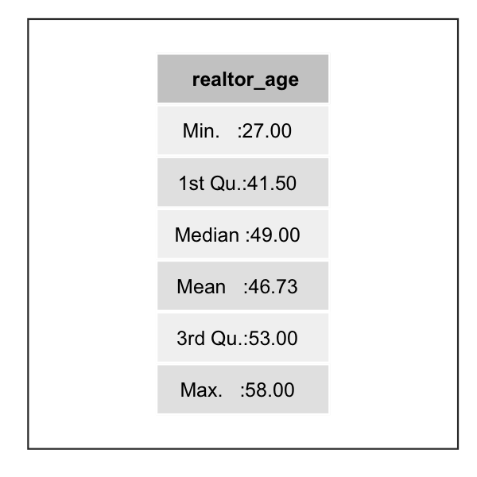
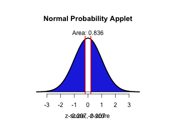

```{r,results='asis',echo=FALSE}
if(params$key==TRUE){
  if(params$plinks==TRUE) cat("* [Word Document](",paste(params$keyname,"docx",sep="."),")\n")
  if(params$plinks==TRUE) cat("* [PDF Document](",paste(params$keyname,"pdf",sep="."),")\n")
  cat("<!--")
  cat("\n")
} 
if(params$key!=TRUE){
  if(params$plinks==TRUE) cat("* [Word Document](",paste(params$docname,"docx",sep="."),")\n")
  if(params$plinks==TRUE) cat("* [PDF Document](",paste(params$docname,"pdf",sep="."),")\n")
  cat("\n")
}
```

**Directions: Please fill in Part I as you study the Reading Assignment. Once you finish the reading, complete the questions on Part II. You may use your notes, the key, and the help videos. Be sure to take this completed assignment to your group meeting where you can ask and help answer questions on this assignment.**

## Problems
```{r,include=FALSE}
source("../scripts/ggQQline.R")
source("../scripts/normTail.R")
source("../scripts/221_Interactive_Functions.R")
#https://github.com/rstudio/rmarkdown/issues/313#issuecomment-63334513
library(ggplot2)
library(ggthemes)
library(gridExtra)
library(grid)
library(PerformanceAnalytics) # for textplot function
library(pander)
panderOptions('keep.line.breaks', TRUE)
```

**Part I:**  Use the information in the reading assignment to complete these questions.

1.  Which hypothesis between the null and alternative hypothesis is the hypothesis of 'no effect' or 'no difference' or 'status quo' or is assumed to be true?

2.  Does $H_a$ below represent a one-sided or two-sided alternative hypothesis? 

$$  H_o: \mu=0 $$
$$  H_a: \mu>0 $$
  
3.  Fill in the matrix below with the correct responses


4.  Define the level of significance in a hypothesis test? With which Greek letter is it denoted?


5.  Write down the formula for computing the test statistic for the hypothesis test for a single mean when sigma is known.


6.  Define the P-value.  How is it used in a hypothesis test?


7.  If the null hypothesis is rejected in a hypothesis test, what is concluded about the alternative hypothesis?


8.  Think of a couple of examples where you have seen hypothesis testing in real life (open-ended).


**Part II**  

```{r,echo=FALSE}
mean1 = 529
alpha1 = 0.01
down = TRUE
test1 = c("less","more","either")[2]
```


9.  The Graduate Management Admission Test (GMAT) is used as an admission criterion in many masters of business administration (MBA) programs. The scores on the GMAT in the past have a mean score of `r mean1`.  The BYU professor feels now that the score has improved within the last couple of years.

    a. Determine the null and alternative hypotheses
   
   
    b.  Suppose you got evidence that the null hypothesis should be rejected.  However, in reality the mean score of students taking the exam is still `r mean1`.  Was a Type I or Type II error committed?  

    c.  If the analysis was done at $\alpha$ = `r alpha1` level, what is the probability of committing a Type I Error?
    

    d.  If we wanted to `r updown(down)` the probability of making a Type II error, would we need to increase or decrease the level of significance?

```{r,include=FALSE}
realtor_age = c(27,	49,	56,	45,	49,
35,	55,	50,	46,	48, 38,	58,	51,	56,	38)

mean2 = 47
sd2 = 5
n2 = 15
alpha2 = 0.05
test2 = c("less","more","either")[3]

zScore2 = zScore(mean(realtor_age),mean2,sd2,n2)
p_value2 = pValue(zScore2, test2) 
```

10.  A study by the National Association of Realtors reported in 2004 that second-home sales accounted for more than a third of residential real estate transactions.  According to the report, the average age of a person buying a second home as an investment rental property was `r mean2` years.  Assuming the national standard deviation was `r sd2`, a real estate agent wants to determine if the average age of those buying investment property in his area is `r typeTest(test2)` than the national average.  He randomly selects `r n2` of his clients who purchased an investment property and obtains the values --
```{r ,results='asis',echo=FALSE}
cat(paste(paste(realtor_age,collapse=","),".",sep=""))

```

a. Design the Study.  What is the population from which the realtor obtains his data.  How did he sample this population? What is the research question?
   
b. Collect the data.  Name at least one way the realtor could have randomly selected his sample.
    
c. Describe the data.  Graph the data on a histogram.  Sketch the histogram below or cut and paste your electronic copy.  In a short paragraph describe the data by using at least five descriptive statistics.

d. Make inference:
   
    i. Check the requirements.  Since there are only `r n2` pieces of data, what will you need to check?
   
    ii. State the null and alternative hypothesis.  (Is this a one or two-tailed test?)
   
    iii. Let $\alpha=  `r alpha2`$
   
    iv. Compute the test statistic. What is the formula to be used?  (Recall our test statistic will be a z-score.)  After writing down the general formula, input the numbers you will use.  Show this work.  Finally, use Excel or a calculator to compute your test statistics.
   
    v. Compute the P-value.  First, sketch a standard normal curve; graph your test statistic along the horizontal axis.  Shade the appropriate under the curve.  Use the Normal Applet to compute the area under the curve.  This area is the P-value.
   
    vi. Compare the P-value to the level of significance (the $\alpha$-level).  Do we reject the null hypothesis or fail to reject the null?
   
    vii. State your conclusions in terms of the alternative hypothesis
   
e. Take Action: What action,if any, do you suggest the realtor to take based on your statistical conclusions?

```{r,include=FALSE,warning=FALSE,message=FALSE}
if(params$key==TRUE){

### Problem 2c of Part II data summary and visualization
pII2c_table = summary(data.frame(realtor_age))
pII2c_histogram = qplot(x=realtor_age,bins=6,colour=I("black"))+theme_few(5)+labs(x="Age of Buyer",y="Count")
ggsave(pII2c_histogram,file="../images/problem_2cII_histogram.png",width=3,height=1.25)

### one way to print to image
#png(filename="../../images/problem_2cII_summary.png",units="in",width=4,height=2,res=72)
#textplot(pII2c_table)
#dev.off()
mytheme <- gridExtra::ttheme_default(
    core = list(fg_params=list(cex = 0.5)),
    colhead = list(fg_params=list(cex = 0.5)),
    rowhead = list(fg_params=list(cex = 0.5)))


pII_table = qplot(1:10, 1:10, geom = "blank") + theme_bw() +
theme(line = element_blank(),text = element_blank()) +
annotation_custom(grob = tableGrob(pII2c_table,theme=mytheme,rows=NULL),  ### PII2c_table is the main thing to change
  xmin = -Inf, xmax = Inf, ymin = -Inf, ymax = Inf)
ggsave(pII_table,filename="../images/problem_2cII_summary.png",width=2,height=2)

### II-2di  ## quantile quantile plot for normality
rd = data.frame(y=realtor_age)
QQp = ggplot(data=rd)+stat_qq(aes(sample=y))+theme_few(4)+coord_flip()
QQp = QQp + geom_smooth(data=ggplot_build(QQp)$data[[1]],aes(x=x,y=y),method="lm",se=FALSE)

ggsave(plot=QQp,filename="../images/problem_2d_qqplot.png",width=2.25,height=1.25)
}

png(filename = "../images/L09_Prep_QdV_normalDistributionApplet.png",width = 350,height=260)
normTail(U=round(zScore2*-1,3),L=round(zScore2,3),lwd=2.5,df=700000)
dev.off()
```
   

```{r,echo=FALSE ,results='asis'}
if(params$key==TRUE){
#solutions

    Solution01 = data.frame(Part="-",Solution="Null hypothesis")
    
    Solution02 = data.frame(Part="-",Solution="One Side")
    
    Solution03 = data.frame(Part="-",Solution="")
    
    Solution04 = data.frame(Part="-",Solution="The level of significance is a number to determine if the P-value is small enough to reject the null hypothesis.  It is denoted with the Greek letter alpha ($\\alpha$).  It is the probability of making a Type I Error.")
    
    Solution05 = data.frame(Part="-",Solution="$z=\\frac{\\bar{x}-\\mu}{\\sigma / \\sqrt{n}}$")
    
    Solution06 = data.frame(Part="-",Solution="P-value is the probability that you will observe the sample test statistic you did or one more extreme assuming the null hypothesis is true.")
    
    Solution07 = data.frame(Part="-",Solution="We have sufficient evidence to conclude the alternative hypothesis is true.")
    
    Solution08 = data.frame(Part="-",Solution="Answers may vary")
    
    Solution09 = data.frame(Part=LETTERS[1:4],Solution=c(paste("$H_o: \\mu =$ ", mean1, "\\\n","$H_a: \\mu ",symbolTest(test1),"$ ",mean1, sep = ""),
                                    "A Type I error was committed.",
                                    "There was about a 1 in 100 or 1% chance that there would be a Type 1 Error.",
                                    "Increase the level of significance."))
    
    Solution10 = data.frame(Part=c("Design the study","Collect the data","Describe the data","Make Inference-I","Make -Inference II","Make Inference- III","Make Inference-IV","Make Inference-V","Make Inference-VI","Make Inference-VII","Take Action"),Solution=c("The researcher collects data from the population of second home buyers.  It says that he randomly selects his sample from his own clients.  His research question is,'Is the average age of the people buying a second investment property in my area different than the national average?'",
                                                                                                             "(Answers may vary)",
                                                                                                             " \\\n ",
                                                                                                             "",
                                                                                                             paste("$H_o: \\mu =$ ", mean2, " years old", "\\\n", "$H_a: \\mu \\neq$ ",mean2, " years old",sep = ""),
                                                                                                             paste("$\\alpha=$ ", alpha2, sep = ""),
                                                                                                             paste("$\\frac{\\bar{x}-\\mu}{\\sigma / \\sqrt{n}}$; z=", round(zScore2,3), sep = ""),
                                                                                                             paste("P-value = ",round(p_value2,3), "\\\n", ""),
                                                                                                             paste("P-value is > level of significance ; ",round(p_value2,3), " > ", alpha2, " so we ", failOrNot(p_value2,alpha2), sep = ""),
                                                                                                             paste("We have ",sufficientOrNot(failOrNot(p_value2,alpha2))," evidence to conclude that the mean age of people buying a second home is different in this area, than that of the national average of ",mean2,"."),
                                                                                                             "(Answers may vary)  One could would suggest that the realtor keeps targeting that population of middle aged people as second home buyers."))

} # end params == TRUE.  We use this so it doesn't have to run for non answer key path.

```    
    
    


```{r,echo=FALSE,results='asis'}
if(params$key==TRUE) cat("-->")
  if(params$key==TRUE) cat("\n\n## Solutions\n\n---")
      if(params$key==TRUE) cat("\n\n")
```


```{r,echo=FALSE,results='asis'}
if(params$key==TRUE){

    all_solutions = sort(ls(pattern="Solution"))
    key_list = NULL
    for (i in 1:length(all_solutions)){
      temp = get(all_solutions[i])
      temp$Solution = as.character(temp$Solution)
      key_list = rbind(key_list,data.frame(Problem=i,temp))
    }
    
      pander(key_list,split.cell = 80, split.table = Inf,justify = c( 'center', 'left',"left"))
} # end params == TRUE.  We use this so it doesn't have to run for non answer key path.

```


