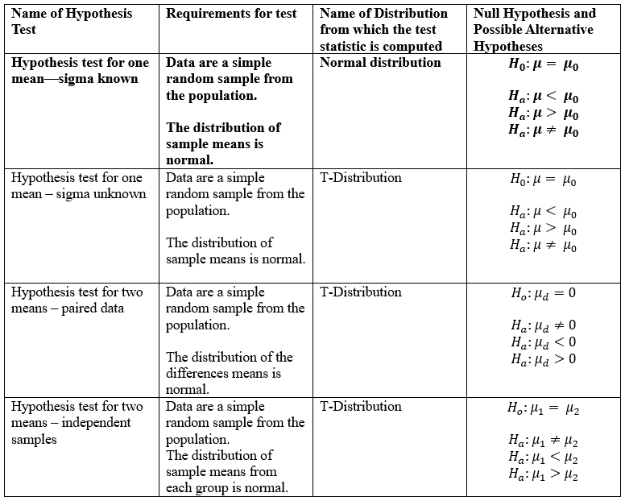
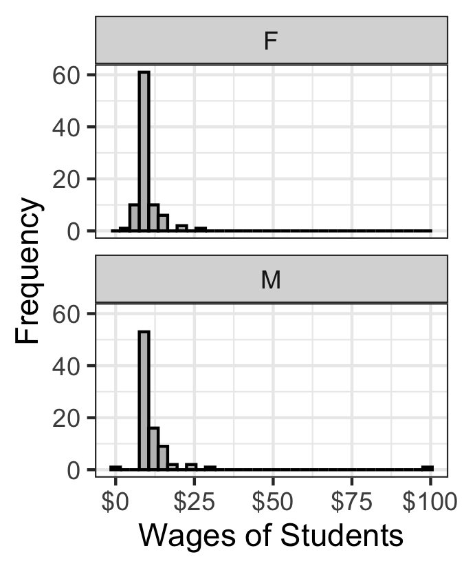

```{r,results='asis',echo=FALSE}
if(params$key==TRUE){
  if(params$plinks==TRUE) cat("* [Word Document](",paste(params$keyname,"docx",sep="."),")\n")
  if(params$plinks==TRUE) cat("* [PDF Document](",paste(params$keyname,"pdf",sep="."),")\n")
  cat("<!--")
  cat("\n")
} 
if(params$key!=TRUE){
  if(params$plinks==TRUE) cat("* [Word Document](",paste(params$docname,"docx",sep="."),")\n")
  if(params$plinks==TRUE) cat("* [PDF Document](",paste(params$docname,"pdf",sep="."),")\n")
  cat("\n")
}
```

**Directions: Please fill in Part I as you study the Reading Assignment. Once you finish the reading, complete the questions on Part II. You may use your notes, the key, and the help videos. Be sure to take this completed assignment to your group meeting where you can ask and help answer questions on this assignment.**

## Problems

```{r,echo=FALSE}
library(ggplot2)
library(ggthemes)
library(pander)
panderOptions('keep.line.breaks', TRUE)
source("../scripts/221_Interactive_Functions.R")
```

**Part I:**  Use the information in the reading assignment to complete these questions.
   
1. What is the difference between matched pair data and independent samples?
    
2. Complete a chart. In the left hand column fill in the names of the four quantitative hypothesis tests we have completed thus far in Unit II. (The first row is shown for you.) 
    
|Hypothesis Test|Requirements|Name of Distribution|Null and Alternative Hypotheses|
|---------------|------------|--------------------|-------------------------------|
|One Mean-sigma known|Data are a simple random sample from the population. The distribution of sample means is normal|Normal distribution|$$H_0:\mu = \mu_0$$ $$H_a:\mu < \mu_0$$ $$H_a:\mu > \mu_0$$ $$H_a:\mu \neq \mu_0$$|

**Part II:**  

```{r,echo=FALSE}
ClassSurvey = read.csv(file = "https://raw.githubusercontent.com/byuistats/data/master/ClassSurvey/ClassSurvey.csv",header = TRUE, stringsAsFactors = FALSE) #pulling the data for the ClassSurvey dataset

SurveyM = subset(ClassSurvey, Gender=="M") #creating a data set with only men
Mean1M = mean(na.omit(SurveyM$Wage))
sd1M = sd(na.omit(SurveyM$Wage))
n1M = sum(!is.na(SurveyM$Wage))

SurveyF = subset(ClassSurvey, Gender=="F") #creating a data set with only females
Mean1F = mean(na.omit(SurveyF$Wage))
sd1F = sd(na.omit(SurveyF$Wage))
n1F = sum(!is.na(SurveyF$Wage))

confLevel1 = 95
alpha1 = 1-(95/100)

resultsSurvey = t.test(SurveyM$Wage,SurveyF$Wage,paired=FALSE,mu=0,alternative="two.sided",conf.level = confLevel1/100)

```


Independent Samples - One of the professors in the BYU-Idaho Math Department collected data from BYU-Idaho students to compare the mean wages of BYU-Idaho male students to BYU-Idaho female students.  The students from his classes completed a survey which he then used to analyze if there is difference in these wages. (Use the Class Survey Data to complete this problem: [Class Survey Data for SPSS](http://emp.byui.edu/johnsonc/data/ClassSurvey.sav), [Class Survey Data for Excel](http://emp.byui.edu/johnsonc/data/ClassSurvey.xlsx) )

3.	Design the Study:

    a.	What is the research question?

    b.	State the null and alternative hypothesis.


4.	Collect the Data:

    a.	Describe the data collection procedures.

5.	Describe the Data:

    a.	In a short paragraph use summary statistics to describe the data. After the paragraph insert an appropriate and well labeled graph to illustrate the data.  

6.	Make Inferences:

    a. What type of hypothesis test is appropriate?

    b. Are the requirements met for this test?  Explain.

    c. Compute the test statistic.

    d. State the degrees of Freedom.

    e. Compute the P-value and compare it to the alpha level.

    f. Make a decision.  Do you reject the null hypothesis or fail to reject it?

    g. Present your conclusions in the form of an English statement.

    h. Rather than testing a hypothesis, now say you just wanted to estimate the difference between female and male wages at the `r confLevel1`% confidence level. create a confidence interval to estimate this difference.

    i. Now interpret the confidence interval you built above.

7. Take Action - In a short paragraph describe the action you feel should be taken based on the statistical results above.
   
```{r,include=FALSE}
Question05_Histogram = 
  ggplot(ClassSurvey,aes(x=Wage)) +
  geom_histogram(binwidth = 3,fill="grey",colour="black") +
  facet_wrap(~Gender,nrow = 2) +
  labs(x="Wages of Students",y="Frequency") +
  scale_x_continuous(labels = scales::dollar) + 
  theme_bw()

ggsave(Question05_Histogram,filename = "../images/L13_Prep_Histogram.png",width = 2.25,height = 2.75)
```


```{r, include=FALSE}
#solutions
if(params$key==TRUE){

    Solution01 =  data.frame(Part="-",Solution="There is no pairing between the two groups.  Group 1 does not determine Group 2.")
    
    Solution02 = data.frame(Part="-",Solution="")
    
    Solution03 = data.frame(Part=LETTERS[1:2],Solution=c("Is there a difference between the mean wages of BYU-Idaho male students and female students?",
                                                         "$H_o: \\mu_1 = \\mu_2$ \\\n $H_a: \\mu_1 \\neq \\mu_2$"))
    
    Solution04 = data.frame(Part="-",Solution="Students from one of the Math Department professor's classes took a survey which asked how much they make as an hourly wage.")
    
    Solution05 = data.frame(Part="-",Solution=paste("-Males: $\\bar{x} =",round(Mean1M,3),"$, $s=",round(sd1M,3),"$, $n=",round(n1M,3),"$ \\\n- Females: $\\bar{x}=",round(Mean1F,3),"$, $s=",round(sd1F,3),"$, $n=",round(n1F,3),"$ \\\n - You should also include two histograms here, one for the men and one for the women. \\\n ",sep = ""))
    
    Solution06 = data.frame(Part=LETTERS[1:9], Solution=c("Independent Samples Hypothesis test",
                                                          "-The sample size is large for each sample so we can assume normality. \\\n- It was not a simple random sample.",
                                                          paste("$t= \\pm ",round(resultsSurvey$statistic,3),"$",sep = ""),
                                                          paste("$df = ",round(resultsSurvey$parameter,3),"$",sep = ""),
                                                          paste("$\\text{P-value} = ",round(resultsSurvey$p.value,3),"$, $\\alpha = ",alpha1,"$, $\\text{p-value} > \\alpha$",sep = ""),
                                                          failOrNot(resultsSurvey$p.value,alpha1),
                                                          paste("We have ",sufficientOrNot(failOrNot(resultsSurvey$p.value,alpha1))," evidence to say that there is a difference between wages of male and female BYU-Idaho students.",sep = ""),
                                                          paste("(",round(resultsSurvey$conf.int[1],3),", ", round(resultsSurvey$conf.int[2],3),") or (",round(resultsSurvey$conf.int[2]*-1,3),", ", round(resultsSurvey$conf.int[1]*-1,3),")",sep = ""),
                                                          paste("-We are ",confLevel1,"% confident that the true difference in mean wages between women and men at BYU-Idaho is somewhere between $",round(resultsSurvey$conf.int[1],2) ," and $",round(resultsSurvey$conf.int[2],2),", or $",round(resultsSurvey$conf.int[2]*-1,2)," and $",round(resultsSurvey$conf.int[1]*-1,2),". \\\n- We can also see that there is ",sufficientOrNot(failOrNot(resultsSurvey$p.value,alpha1))," evidence using the confidence interval method because zero is included in our confidence interval.",sep = "")))  
    
    Solution07 = data.frame(Part="",Solution="Answers may vary")
    
} # end params == TRUE.  We use this so it doesn't have to run for non answer key path.
```    
    

```{r,echo=FALSE,results='asis'}
if(params$key==TRUE) cat("-->")
  if(params$key==TRUE) cat("\n\n## Solutions\n\n---")
      if(params$key==TRUE) cat("\n\n")
```


```{r,echo=FALSE,results='asis'}
if(params$key==TRUE){

    all_solutions = sort(ls(pattern="Solution"))
    key_list = NULL
    for (i in 1:length(all_solutions)){
      temp = get(all_solutions[i])
      temp$Solution = as.character(temp$Solution)
      key_list = rbind(key_list,data.frame(Problem=i,temp))
    }
    
      pander(key_list,split.cell = 80, split.table = Inf,justify = c( 'center', 'left',"left"))
} # end params == TRUE.  We use this so it doesn't have to run for non answer key path.

```