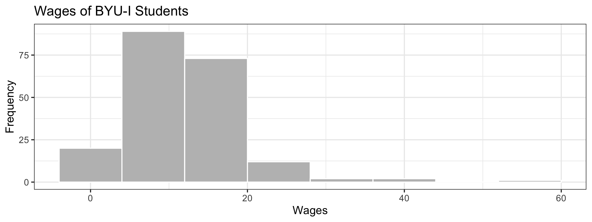
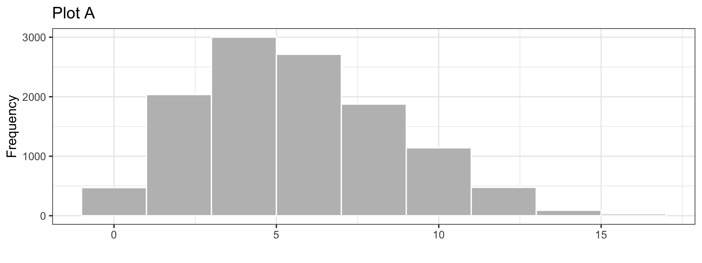
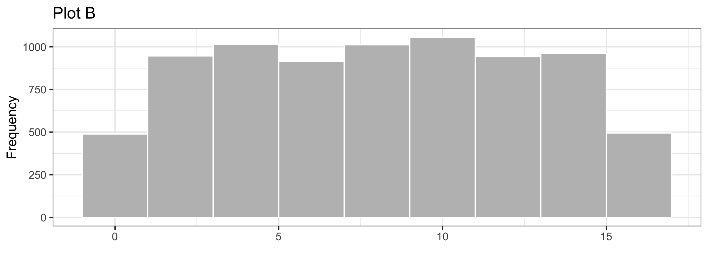
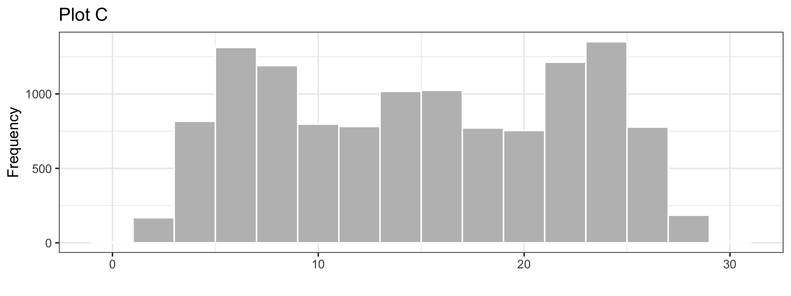
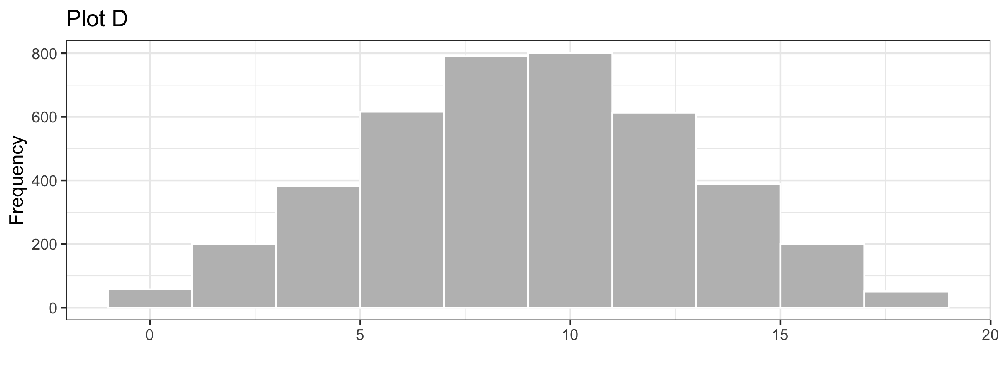
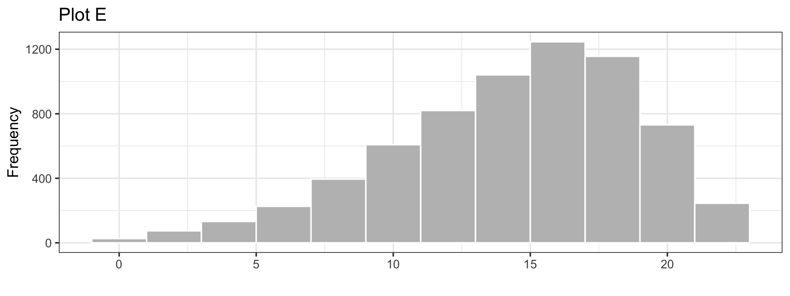

```{r,results='asis',echo=FALSE}
if(params$key==TRUE){
  if(params$plinks==TRUE) cat("* [Word Document](",paste(params$keyname,"docx",sep="."),")\n")
  if(params$plinks==TRUE) cat("* [PDF Document](",paste(params$keyname,"pdf",sep="."),")\n")
  cat("<!--")
  cat("\n")
} 
if(params$key!=TRUE){
  if(params$plinks==TRUE) cat("* [Word Document](",paste(params$docname,"docx",sep="."),")\n")
  if(params$plinks==TRUE) cat("* [PDF Document](",paste(params$docname,"pdf",sep="."),")\n")
  cat("\n")
}
```
```{r,include=FALSE}
library(ggplot2)
library(ggthemes)
library(pander)
library(mosaic)
panderOptions('keep.line.breaks',TRUE)
source("../scripts/ggQQline.R")
source("../scripts/normTail.R")
source("../scripts/221_Interactive_Functions.R")
```
**Instructions:  You are encouraged to collaborate with other students on the homework, but it is important that you do your own work.  Before working with someone else on the assignment, you should attempt each problem on your own.**  
  
On rare occasions, a medical procedure is performed on the wrong body part of a patient's body or on the wrong patient. These are called wrong-site and wrong-patient mistakes. Such errors occur hundreds of times each year across the United States. The medical community is trying to eliminate these errors but have had difficulty reducing their frequency. In a small percentage of these cases, the patient files a lawsuit against the hospital. Philip Stahel et al. conducted a study on these mistakes and the lawsuits that follow. The data in the file `WrongSiteWrongPatient` which can be found on the Math 221 [Data page](https://byuistats.github.io/BYUI_M221_Book/Data) represent the amount (in US dollars) hospitals have been required to pay in wrong-site and wrong-patient lawsuits. Some of the values equal zero, indicating that the hospital won the legal battle.  Use this information to answer questions 1 through 3.
```{r, echo=FALSE, results='asis',warning=FALSE,fig.height=3,fig.width=8}
WrongSiteWrongPatient <- read.csv(file="https://raw.githubusercontent.com/byuistats/data/master/WrongSiteWrongPatient/WrongSiteWrongPatient.csv",stringsAsFactors =FALSE)
```
1.  What is the shape of the distribution of wrong-patient lawsuit costs?
    a.  Right Skewed
    b.  Symmetric
    c.  Left Skewed
    d.  Bell Shaped
   
```{r,include=FALSE}
Mean1 = mean(WrongSiteWrongPatient$Wrong.Patient,na.rm=T) # the data is stored funny and the second column has a bunch of NAs that are not needed.
Median1 = median(WrongSiteWrongPatient$Wrong.Patient,na.rm=T)
SD1 = sd(WrongSiteWrongPatient$Wrong.Patient,na.rm=T)
```
2.  Find the mean amount hospitals had to pay in wrong-patient lawsuits. Round your answer to the nearest whole dollar. 
 
3.  Find the median amount hospitals had to pay in wrong-patient lawsuits. 
 
Use the following information to answer Questions 4 and 5.  The graph below illustrates typical student hourly wages for BYU-Idaho.
```{r,echo=FALSE, results='asis',warning=FALSE, include=FALSE}
A <- runif(77, min = 0, max = 9)
B <- runif(100, min = 9, max = 17)
C <- runif(16, min = 17, max = 26)
D <- runif(3, min = 26, max = 35)
E <- runif(2, min = 35, max = 43)
F <- 57
problem8_9 <- data.frame(wages=c(A,B,C,D,E,F))
outp = ggplot(problem8_9, aes(x=wages)) + 
  geom_histogram(fill="grey", binwidth = 8,colour="white") + 
  theme_bw() + 
  labs(x = "Wages", y = "Frequency") +
  ggtitle("Wages of BYU-I Students")
ggsave("../images/L03_wages.png", outp, width = 8, height = 3)
```

4.  Approximately, how many students are in this survey?
 
5.  How would you describe the shape of the distribution of wages?
 
6.  Match each graph below to the description of its shape.
Uniform =  
Bell-shaped =  
Right-skewed =  
Left-skewed =  
Symmetric, but not bell-shaped or uniform = 
```{r, echo=FALSE, results='asis',warning=FALSE, cache.vars = TRUE}
AA <- runif(990, min = 0, max = 2)
AB <- runif(3000, min = 2, max = 4)
AC <- runif(3100, min = 4, max = 6)
AD <- runif(2300, min = 6, max = 8)
AE <- runif(1450, min = 8, max = 10)
AF <- runif(800, min = 10, max = 12)
AG <- runif(150, min = 12, max = 14)
AH <- runif(50, min = 14, max = 16)
histA <- data.frame(dataA=c(AA,AB,AC,AD,AE,AF,AG,AH))
pa <- ggplot(histA, aes(x=dataA)) +
  geom_histogram(fill="grey", binwidth = 2,colour="white") +
  theme_bw() + 
  labs(x = "", y = "Frequency") + 
  ggtitle("Plot A")
BA <- runif(950, min = 0, max = 2)
BB <- runif(1000, min = 2, max = 4)
BC <- runif(950, min = 4, max = 6)
BD <- runif(975, min = 6, max = 8)
BE <- runif(1025, min = 8, max = 10)
BF <- runif(1005, min = 10, max = 12)
BG <- runif(925, min = 12, max = 14)
BH <- runif(1000, min = 14, max = 16)
histB <- data.frame(dataB=c(BA,BB,BC,BD,BE,BF,BG,BH))
pb <- ggplot(histB, aes(x=dataB)) +
  geom_histogram(fill="grey", binwidth = 2,colour="white") + 
  theme_bw() + 
  labs(x = "", y = "Frequency") + 
  ggtitle("Plot B")
CA <- runif(15, min = 0, max = 2)
CB <- runif(350, min = 2, max = 4)
CC <- runif(1200, min = 4, max = 6)
CD <- runif(1500, min = 6, max = 8)
CE <- runif(900, min = 8, max = 10)
CF <- runif(650, min = 10, max = 12)
CG <- runif(920, min = 12, max = 14)
CH <- runif(1100, min = 14, max = 16)
CI <- runif(920, min = 16, max = 18)
CJ <- runif(650, min = 18, max = 20)
CK <- runif(900, min = 20, max = 22)
CL <- runif(1500, min = 22, max = 24)
CM <- runif(1200, min = 24, max = 26)
CN <- runif(350, min = 26, max = 28)
CO <- runif(15, min = 28, max = 30)
histC <- data.frame(dataC=c(CA,CB,CC,CD,CE,CF,CG,CH,CI,CJ,CK,CL,CM,CN,CO))
pc <- ggplot(histC, aes(x=dataC)) + 
  geom_histogram(fill="grey", binwidth = 2,colour="white") + 
  theme_bw() + 
  labs(x = "", y = "Frequency") + 
  ggtitle("Plot C")
DA <- runif(100, min = 0, max = 2)
DB <- runif(300, min = 2, max = 4)
DC <- runif(500, min = 4, max = 6)
DD <- runif(700, min = 6, max = 8)
DE <- runif(900, min = 8, max = 10)
DF <- runif(700, min = 10, max = 12)
DG <- runif(500, min = 12, max = 14)
DH <- runif(300, min = 14, max = 16)
DI <- runif(100, min = 16, max = 18)
histD <- data.frame(dataD=c(DA,DB,DC,DD,DE,DF,DG,DH,DI))
pd <- ggplot(histD, aes(x=dataD)) + 
  geom_histogram(fill="grey", binwidth = 2,colour="white") + 
  theme_bw() + 
  labs(x = "", y = "Frequency") + 
  ggtitle("Plot D")
EA <- runif(50, min = 0, max = 2)
EB <- runif(100, min = 2, max = 4)
EC <- runif(150, min = 4, max = 6)
ED <- runif(300, min = 6, max = 8)
EE <- runif(500, min = 8, max = 10)
EF <- runif(700, min = 10, max = 12)
EG <- runif(1000, min = 12, max = 14)
EH <- runif(1100, min = 14, max = 16)
EI <- runif(1300, min = 16, max = 18)
EJ <- runif(1000, min = 18, max = 20)
EK <- runif(500, min = 20, max = 22)
histE <- data.frame(dataE=c(EA,EB,EC,ED,EE,EF,EG,EH,EI,EJ,EK))
pe <- ggplot(histE, aes(x=dataE)) + 
  geom_histogram(fill="grey", binwidth = 2,colour="white") +
  theme_bw() + 
  labs(x = "", y = "Frequency") +
  ggtitle("Plot E")
ggsave("../images/L03_pa.png", pa, width = 8, height = 3)
ggsave("../images/L03_pb.png", pb, width = 8, height = 3)
ggsave("../images/L03_pc.png", pc, width = 8, height = 3)
ggsave("../images/L03_pd.png", pd, width = 8, height = 3)
ggsave("../images/L03_pe.png", pe, width = 8, height = 3)
```





7.  A reporter creates a histogram of baseball player salaries and finds that the distribution of salaries is right-skewed. Which measure of center would be greater, the mean or the median? 
```{r,include=FALSE}
if(params$key==TRUE){
#solutions
    Solution01 = data.frame(Part="-",Solution="a. Right Skewed")
    
    Solution02 = data.frame(Part="-",Solution=paste("$",formatC(Mean1,big.mark=",",format="f",digits=0),sep=""))
    
    Solution03 = data.frame(Part="-",Solution=paste("$",formatC(Median1,big.mark = ",",format = "fg"),sep = ""))
    
    Solution04 = data.frame(Part="-",Solution="This is just a rough estimate, but somewhere between 190 and 200")
    
    Solution05 = data.frame(Part="-",Solution="Right-skewed")
    
    Solution06= data.frame(Part=c(LETTERS[1:5]), 
                            
        Solution=c("Uniform = b",
           "Bell-shaped = d",
           "Right-skewed = a",
           "Left-skewed = e",
           "Symmetric, but not bell-shaped or uniform = c"))
    
    Solution07 = data.frame(Part="-",Solution="The mean")
    
} # end params == TRUE.  We use this so it doesn't have to run for non answer key path.    
```
```{r,echo=FALSE,results='asis'}
if(params$key==TRUE){
  cat("")
  cat("-->")
   cat("\n\n## Solutions\n\n")
      cat("\n\n **Please note that the steps show rounded numbers, but that the final answers to the problems are calculated without rounding.**")
}
```
```{r,echo=FALSE,results='asis'}
if(params$key==TRUE){
    all_solutions = sort(ls(pattern="Solution"))
    key_list = NULL
    for (i in 1:length(all_solutions)){
      temp = get(all_solutions[i])
      temp$Solution = as.character(temp$Solution)
      key_list = rbind(key_list,data.frame(Problem=i,temp))
    }
    
      pander(key_list,split.cell = 80, split.table = Inf,justify = c( 'center', 'left',"left"))
} # end params == TRUE.  We use this so it doesn't have to run for non answer key path.
```
