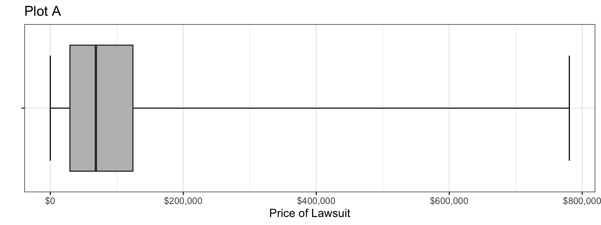
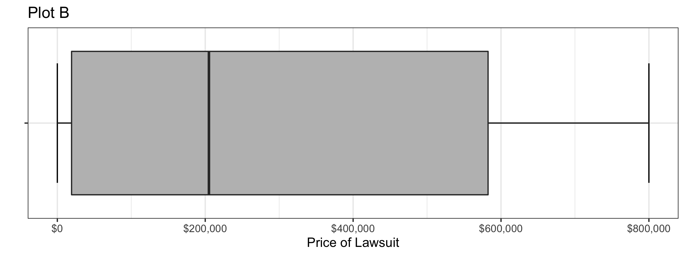
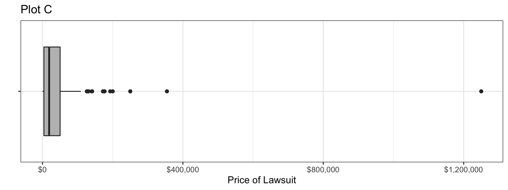
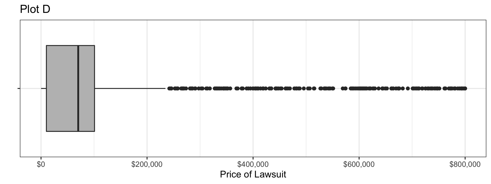
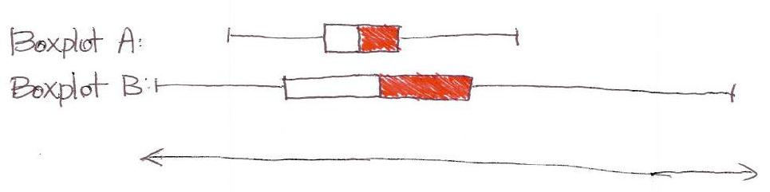
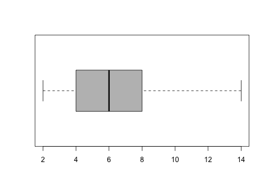

```{r,results='asis',echo=FALSE}
if(params$key==TRUE){
  if(params$plinks==TRUE) cat("* [Word Document](",paste(params$keyname,"docx",sep="."),")\n")
  if(params$plinks==TRUE) cat("* [PDF Document](",paste(params$keyname,"pdf",sep="."),")\n")
  cat("<!--")
  cat("\n")
} 
if(params$key!=TRUE){
  if(params$plinks==TRUE) cat("* [Word Document](",paste(params$docname,"docx",sep="."),")\n")
  if(params$plinks==TRUE) cat("* [PDF Document](",paste(params$docname,"pdf",sep="."),")\n")
  cat("\n")
}
```

```{r,include=FALSE}
library(ggplot2)
library(ggthemes)
library(pander)
library(mosaic)
library(readxl)
panderOptions('keep.line.breaks',TRUE)
source("../scripts/ggQQline.R")
source("../scripts/normTail.R")
source("../scripts/221_Interactive_Functions.R")
```

**Instructions:  You are encouraged to collaborate with other students on the homework, but it is important that you do your own work.  Before working with someone else on the assignment, you should attempt each problem on your own.**  
  
1.	Please explain the term "standard deviation" and how is it a measure of spread in your own words.  


On rare occasions, a medical procedure is performed on the wrong body part of a patient's body or on the wrong patient. These are called wrong-site and wrong-patient mistakes. Such errors occur hundreds of times each year across the United States. The medical community is trying to eliminate these errors but have had difficulty reducing their frequency. In a small percentage of these cases, the patient files a lawsuit against the hospital. Philip Stahel et al. conducted a study on these mistakes and the lawsuits that follow. The data in the file `WrongSiteWrongPatient` which can be found on the Math 221 [data page](http://statistics.byuimath.com/index.php?title=Data) represent the amount (in US dollars) hospitals have been required to pay in wrong-site and wrong-patient lawsuits. Some of the values equal zero, indicating that the hospital won the legal battle.  Use this information to answer questions 2 through 3.

```{r, echo=FALSE, results='asis',warning=FALSE,fig.height=3,fig.width=8}
set.seed(1)
f <- function(x) {
  r <- quantile(x, probs = c(0.00, 0.25, 0.5, 0.75, 1))
  names(r) <- c("ymin", "lower", "middle", "upper", "ymax")
  r
}

WrongSiteWrongPatient <- read.csv(file="https://raw.githubusercontent.com/byuistats/data/master/WrongSiteWrongPatient/WrongSiteWrongPatient.csv",stringsAsFactors =FALSE)

plta <- ggplot(WrongSiteWrongPatient, aes(x="",y=Wrong.Site)) + 
  stat_boxplot(geom="errorbar",coef=10)+
  stat_summary(fill="grey",fun.data=f,geom="boxplot") + 
  theme_bw() + 
  labs(x="",y="Price of Lawsuit",title = "Plot A")+
  scale_y_continuous(labels=scales::dollar) + coord_flip() 

ggsave("../images/L04_plta.png", plta, width = 8, height = 3)
```

```{r, echo=FALSE, results='asis',fig.height=3,fig.width=8}
plot_b <- data.frame(a=c(0, 15000, 16000, 19000,20000,150000,200000,210000,220000,230000,700000,750000,775000,800000),b=c(0,1,2,3,4,5,6,7,8,9,10,11,12,13))

pltb <- ggplot(data=plot_b, aes(x="", y=a)) + 
  stat_boxplot(geom="errorbar",coef=10)+
  stat_summary(fill="grey",fun.data=f,geom="boxplot") + 
  theme_bw() + 
  labs(x="",y="Price of Lawsuit",title="Plot B")+
  scale_y_continuous(labels=scales::dollar) + coord_flip()

ggsave("../images/L04_pltb.png", pltb, width = 8, height = 3)
```

```{r, echo=FALSE, results='asis',warning=FALSE,fig.height=3,fig.width=8}

pltc <- ggplot(WrongSiteWrongPatient, aes(x="",y=Wrong.Patient)) + 
  geom_boxplot(fill="grey") + 
  theme_bw() + labs(x="",y="Price of Lawsuit") +     
  coord_flip()+scale_y_continuous(labels=scales::dollar) + 
  ggtitle("Plot C")

ggsave("../images/L04_pltc.png", pltc, width = 8, height = 3)
```

```{r, echo=FALSE, results='asis',warning=FALSE,fig.height=3,fig.width=8}
a <- runif(250, min = 0, max = 10000)
b <- runif(250, min = 10000, max = 70000)
c <- runif(250, min = 70000, max = 100000)
d <- runif(250, min = 100000, max = 800000)
e <- 800000
plot_d <- data.frame(col1 = c(a,b,c,d,e))

pltd <- ggplot(plot_d, aes(x="",y=col1)) + 
  geom_boxplot(fill="grey") +
  theme_bw() +
  labs(x="",y="Price of Lawsuit",title="Plot D")+
  scale_y_continuous(labels=scales::dollar) +
  coord_flip()

ggsave("../images/L04_pltd.png", pltd, width = 8, height = 3)
```







2.	Which of the following boxplots above illustrates the wrong-patient lawsuit data? 
   
```{r,include=FALSE}

WrongSiteWrongPatient <- read_excel("../excel_data_original/WrongSiteWrongPatient.xlsx")

Mean1 = mean(WrongSiteWrongPatient$Wrong.Patient,na.rm=T) # the data is stored funny and the second column has a bunch of NAs that are not needed.

Median1 = median(WrongSiteWrongPatient$Wrong.Patient,na.rm=T)

SD1 = sd(WrongSiteWrongPatient$Wrong.Patient,na.rm=T)

```

3.	Find the standard deviation of the amount paid in wrong-patient lawsuits. Round your answer to the nearest whole dollar. 
 
4.	The boxplots for two different data sets are given below.  Which of these boxplots has a greater percentage of data in the area that is highlighted in red?

    a.	Boxplot A
    b.	Boxplot B
    c.	The percentage of data is the same for both.
    d.	There is not enough information to answer this question.  We need the original data to make this determination.
    


The number of hours students spent studying for an exam were recorded. The data are represented by the boxplot below. Use this boxplot to answer Questions 5 through 8.

```{r, echo=FALSE, results='asis',warning=FALSE,fig.height=4,fig.width=8}
Studying = data.frame(hours = c(2,3,4,4,5,6,6,7,8,8,9,10,14), student = c("1","1","1","1","1","1","1","1","1","1","1","1","1"))
```

```{r,echo=FALSE, results='asis',warning=FALSE,fig.height=4,}
#image <- boxplot(Studying$hours, col = "grey", horizontal = TRUE)
```



5.	Find Q1 for the study time data summarized in the boxplot above. 
 
6.	One of the observations represented in the boxplot above is a suspected outlier. How long did that student spend studying? 
 
7.	The lowest 25% of hours spent on an exam are approximately between what two numbers? 
 
8.	What is the mean of the data illustrated in the boxplot? 

A scientist tested for the presence of many hazardous elements for nuclear reactors. He considered the concentration of Plutonium-238. Plutonium-238 is a radioactive waste generated by a nuclear reactor. He wants there to be as little Plutonium-238 in the tank as possible.

The data below give the concentration of Plutonium-238 in nanocuries per liter (nCi/L) in his sample.

```{r, include=FALSE, message=FALSE,cache.vars=TRUE}

concentration = c(9.4,70.7,7.8,4.6,50.2)

Mean2 = round(mean(concentration),1)

DevFromMean2 = round(4.6 - mean(concentration),1)

SquareDev2 = round((70.7 - mean(concentration))^2,1)

Var2 = round(var(concentration),1)

SD2 = round(sd(concentration),1)
```
Complete the following table and answer questions 9 through 13 below.

|Concentration Level (nCi/L|Deviation from the Mean|Squared Deviations|
|--------------------------|-----------------------|------------------|
|$x$|$(x - \bar{x})$|$(x-\bar{x})^2$|
|9.4|||
|70.7||"B"|
|7.8|||
|4.6|"A"||
|50.2|||

9.	What is the mean of the concentration levels? 
 
10.	What is the value of the number that goes in the position marked with an "A" in the table above? 
 
11.	What is the value of the number that goes in the position marked with a "B" in the table above? 
 
12.	What is the sample variance of these concentration levels? 
 
13.	What is the sample standard deviation of these concentration levels? 
14.	Which of the following sets of numbers has the largest standard deviation? (No calculations are required.)

    a.	{7, 8, 9, 10}
    b.	{10, 10, 10, 10}
    c.	{0, 0, 10, 10}
    d.	{0, 1, 2, 3}

For a Math 221 project, one group of students studied the ages of students on the BYU-Idaho campus. They collected data from a random sample of n = 100 students. The sample mean was 21.2 and the sample standard deviation was 2.61. An excerpt of their data is given below.

```{r, echo=FALSE, results='asis'}
pander(data.frame(ID=c(1,2,3,4,":",99), Gender=c("Female","Male","Male","Female",":","Male"), Age=c(21,18,"12 (error)",20,":",25)))
```
  
The group notices an error in their data. The age of one of the males (ID=3) was entered incorrectly. He is actually 21 years old. 
  
15.	When the error is corrected, what will happen to the sample standard deviation?

    a.	The standard deviation will increase.
    b.	The standard deviation will decrease.
    c.	The standard deviation will stay the same.
    d.	It is not possible to determine this without the full data set.

```{r,include=FALSE}
if(params$key==TRUE){
#solutions
  
    Solution01 =  data.frame(Part="-",Solution="The standard deviation is a measure of how spread out the data are. A larger standard deviation indicates that data are more spread out and less consistent than data that have a smaller standard deviation.")
    
    Solution02 = data.frame(Part="-",Solution="Box Plot C")
    
    Solution03 = data.frame(Part="-",Solution= "$105,986.70")
    
    #Solution03 = data.frame(Part="-",Solution=paste("$",formatC(SD1,big.mark = ",",format = "fg"),sep = ""))

    Solution04 = data.frame(Part="-",Solution="c. The percentage of data is the same for both.")
    
    Solution05 = data.frame(Part="-",Solution="4 hours")
    
    Solution06 = data.frame(Part="-",Solution="14 hours")
    
    Solution07 = data.frame(Part="-",Solution="2 and 4 hours")
    
    Solution08 = data.frame(Part="-",Solution="There is not enough information to answer this question. We need the original data to
make this determination.")
    
    Solution09 = data.frame(Part="-",Solution=paste("$",Mean2," \\text{ nCi/L}$",sep = ""))
    
    Solution10 = data.frame(Part="-",Solution=paste("$",DevFromMean2," \\text{ nCi/L}$",sep = ""))
    
    Solution11 = data.frame(Part="-",Solution=paste("$",SquareDev2," \\text{ nCi/L}$",sep = ""))
    
    Solution12 = data.frame(Part="-",Solution=paste("$",Var2, " (\\text{ nCi/L})^2$",sep = ""))

    Solution13 = data.frame(Part="-",Solution=paste("$",SD2," \\text{ nCi/L}$",sep = ""))
    
    Solution14 = data.frame(Part="-",Solution="c. {0, 0, 10, 10}")
    
    Solution15 = data.frame(Part="-",Solution="b. The standard deviation will decrease.")
    
} # end params == TRUE.  We use this so it doesn't have to run for non answer key path.    
```


```{r,echo=FALSE,results='asis'}
if(params$key==TRUE){
  cat("-->")
   cat("\n\n## Solutions\n\n")
      cat("\n\n **Please note that the steps show rounded numbers, but that the final answers to the problems are calculated without rounding.**")
}
```


```{r,echo=FALSE,results='asis'}
if(params$key==TRUE){

    all_solutions = sort(ls(pattern="Solution"))
    key_list = NULL
    for (i in 1:length(all_solutions)){
      temp = get(all_solutions[i])
      temp$Solution = as.character(temp$Solution)
      key_list = rbind(key_list,data.frame(Problem=i,temp))
    }
    
      pander(key_list,split.cell = 80, split.table = Inf,justify = c( 'center', 'left',"left"))
} # end params == TRUE.  We use this so it doesn't have to run for non answer key path.

```

