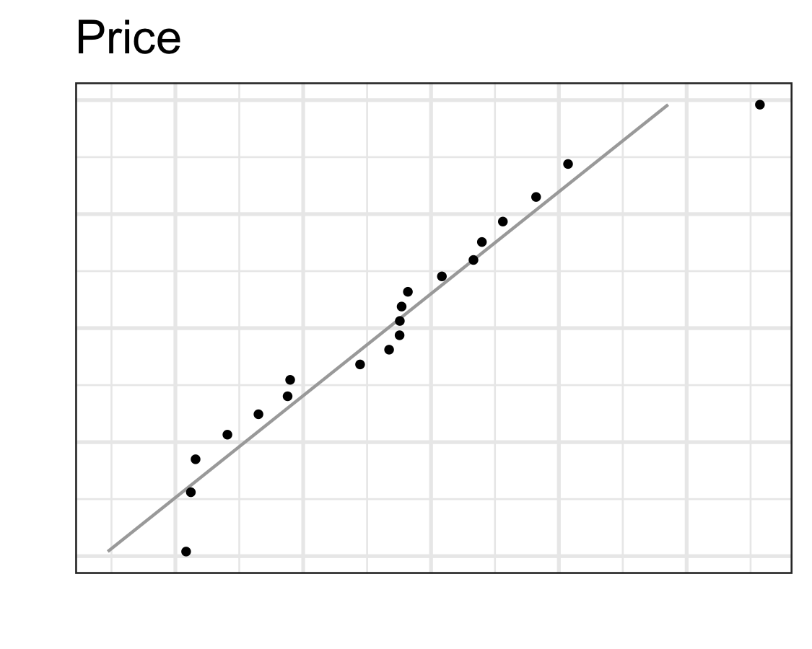
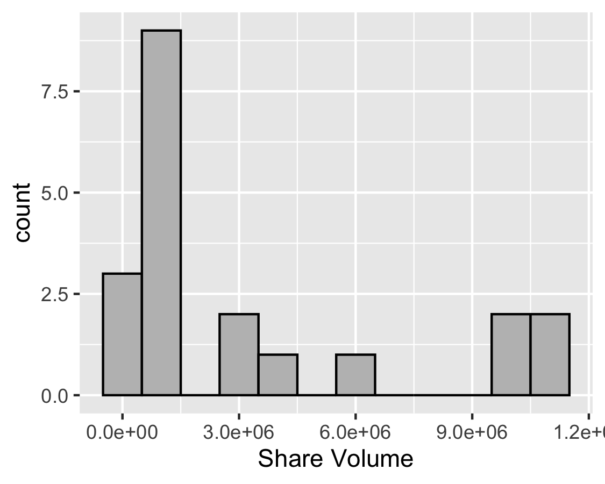

```{r,results='asis',echo=FALSE}
if(params$key==TRUE){
  if(params$plinks==TRUE) cat("* [Word Document](",paste(params$keyname,"docx",sep="."),")\n")
  if(params$plinks==TRUE) cat("* [PDF Document](",paste(params$keyname,"pdf",sep="."),")\n")
  cat("<!--")
  cat("\n")
} 
if(params$key!=TRUE){
  if(params$plinks==TRUE) cat("* [Word Document](",paste(params$docname,"docx",sep="."),")\n")
  if(params$plinks==TRUE) cat("* [PDF Document](",paste(params$docname,"pdf",sep="."),")\n")
  cat("\n")
}
```

```{r,include=FALSE}
library(ggplot2)
library(ggthemes)
library(pander)
library(reshape2)
panderOptions('keep.line.breaks',TRUE)
source("../scripts/ggQQline.R")
source("../scripts/normTail.R")
source("../scripts/221_Interactive_Functions.R")
```

**Instructions:  You are encouraged to collaborate with other students on the homework, but it is important that you do your own work.  Before working with someone else on the assignment, you should attempt each problem on your own.** 

1.	Based on the following histogram, how would you classify the distribution of the data?
   
    a.  We can conclude that the data are normal.
    b.	We can conclude that the data are not normal.
    
```{r, echo=FALSE,cache.vars=TRUE}
set.seed(15)
y <- rchisq(500, df = 3)
## Q-Q plot for Chi^2 data against true theoretical distribution:
hist(y,  main = "Histogram of data for Normality Check", col="darkgray")
```


2.	Based on the following histogram, how would you classify the distribution of the data?
  
    a.  We can conclude that the data are normal.
    b.	We can conclude that the data are not normal. 

```{r, echo=FALSE,cache.vars=TRUE}
y <- rnorm(500)
## Q-Q plot for Chi^2 data against true theoretical distribution:
hist(y,  main = "Histogram for Normality Check")

``` 

```{r, include=FALSE}
#Making the two histograms in order to show them in the answer key. So students can see that Volume is distinctly abnormal. 

NASDAQ = read.csv(file = "https://raw.githubusercontent.com/byuistats/data/master/NASDAQ-PriceAndVolume/NASDAQ-PriceAndVolume.csv",header = TRUE,stringsAsFactors = FALSE)
###Histogram for Price
hist_price = ggplot(data = NASDAQ, aes(x=Price..US..)) + 
  geom_histogram(binwidth = 8, fill="gray", color="black") 

ggsave(hist_price,filename = "../images/L5_Homework_Q03_QQPlot_Price.png",width = 3.75,height = 3.00)

###Histogram for Share Volume
hist_share = ggplot(data = NASDAQ, aes(x=Share.Volume)) + 
  geom_histogram(binwidth=1000000, fill="gray", color="black")  

ggsave(hist_share,filename = "../images/L5_Homework_Q03_QQPlot_Volume.png",width = 3.75,height = 3.00)

```


The data set [NASDAQ Price and Volume](../../Data/NASDAQ-PriceAndVolume.xlsx) summarizes information on select companies that are traded on NASDAQ.  The table gives the symbol for the company, the company's name, the price of their stock and the number of shares that have been traded (the volume).  Use this information to answer question 3.

3.	Which of the following statements is most correct?

    a.	Out of the two variables Price and Share Volume, the price shows a more distinct non-normal trend.
    b.	Out of the two variables Price and Share Volume, the volume shows a more distinct non-normal trend.
    c.	Both variables are clearly normal.  

4.	Under normal circumstances, a density curve can drop below the X-axis.

    a.	True
    b.	False   

5.	A normal density curve is symmetric

    a.	True
    b.	False  

6.	A density curve:

    a.	Always has a total area under it equal to one
    b.	Can cross the horizontal axis up to two times
    c.	Both a and b
    d.	Neither a nor b  

7.	If the z-score for an observed data value is negative, then which of the following must be true?

    a.	The observed value is less than zero.
    b.	The observed value is less than the mean.
    c.	The observed value is left of 13.5% of the data.
    d.	The observed value is less than the standard deviation.  

8.	According to the 68-95-99.7 rule for normal distributions, about 

    a.	68% of all data values fall within two standard deviations of the mean.
    b.	86% of all data values fall within two standard deviations of the mean.
    c.	95% of all data values fall within two standard deviations of the mean.
    d.	99.7% of all data values fall within two standard deviations of the mean. 
    
```{r,include=FALSE}
mean1 = 70
sd1 = 10
x1 = 60 
z1 = (x1 - mean1)/sd1
percent1 = pnorm(z1, lower.tail = T) * 100
```


9.	The time to complete a standardized exam in the BYU-Idaho Testing Center is approximately normal with a mean of `r mean1` minutes and a standard deviation of `r sd1` minutes. Using the 68-95-99.7 rule, approximately what percentage of students will complete the exam in less than one hour?  (Give your answer as a percent.) _________% 

10. According to the histogram plot below, the data are ... (finish the sentence) 

```{r,echo=FALSE, results='asis',warning=FALSE,message=FALSE}
Dentist = read.csv(file = "https://raw.githubusercontent.com/byuistats/data/master/DentistOfficeBills/DentistOfficeBills.csv",header = T,stringsAsFactors = F)
Melt.Dentist = melt(Dentist)

ggplot(data = Melt.Dentist, aes(x=value)) +
  geom_histogram(fill="blue",color="black",binwidth=50) +
  labs("Bill Amount")

#ggsave(QQPlot_Q10,filename = "../../images/L5_Homework_Q10_QQPlot.png",width = 3.75,height = 3.00)

```

```{r,include=FALSE}
mean2 = 74.45
sd2 = 4.41
x2 = 60.56
z2 = (x2 - mean2)/sd2
```

11.	An observation was drawn from a normally distributed population with mean `r mean2` and standard deviation `r sd2`.  If the observed value is `r x2`, find the z-score.  Give your answer accurate to 3 decimal places. z = _________    

```{r,include=FALSE}
z3 = 2.9
```

12.	Shoe sizes for men in the United States are known to follow a normal distribution. If you calculated the z-score of a man's shoe size and found the z-score to be `r z3`, what would you conclude about his shoe size?  

    a.	The man has an unusually small shoe size.
    b.	The man has a normal shoe size.
    c.	The man's shoe size is `r z3` sizes larger than the mean. 
    d.	The man has an unusually large shoe size.  
    
```{r,include=FALSE}
max4SAT = 800
mean4SAT = 500
sd4SAT = 100
x4Eleanor = 680
z4Eleanor = (x4Eleanor - mean4SAT)/sd4SAT

max4ACT = 36
mean4ACT = 18
sd4ACT = 6
x4Gerald = 27
z4Gerald = (x4Gerald - mean4ACT)/sd4ACT
```


The SAT and the ACT are both aptitude tests designed to measure students' readiness for college.  They are different tests with separate scoring systems, but they measure the same abilities.  The highest score possible on the SAT Mathematics section is `r max4SAT`.  The distribution of SAT scores is normal with mean `r mean4SAT` and standard deviation `r sd4SAT`.  The highest score possible on the ACT Mathematics section is `r max4ACT`.  ACT scores are normally distributed with mean `r mean4ACT` and standard deviation `r sd4ACT`.  Use this information to answer questions 13 and 14.  
   
13.	Eleanor scores `r x4Eleanor` on the Mathematics part of the SAT.  Gerald takes the ACT Mathematics test and scores `r x4Gerald`.  Calculate the z-scores for each student.    

  Eleanor's z-score: __________ Gerald's z-score: ___________    

14.	Assuming that both tests measure the same kind of ability, who did better in the Mathematics section? Explain your answer.  

```{r,include=FALSE}
LabelWeight5 = 87.75
mean5 = 90
sd5 = 0.75

betweenLow = mean5 - 2 * sd5
betweenHigh = mean5 + 2 * sd5

z5_q16 = (LabelWeight5 - mean5)/sd5
proportion5_q16 = pnorm(z5_q16, lower.tail = T)

x5_q17 = 91.3
prob5_q17 = pnorm(((x5_q17 - mean5)/sd5),lower.tail = FALSE)

percentile5_q18 = 66
z5_q18 = qnorm(percentile5_q18/100,lower.tail = TRUE)
x5_q18 = z5_q18 * sd5 + mean5
```

The label on the ChocoLux candy bar states that it has a net weight of `r LabelWeight5` grams.  Due to the natural variability in the manufacturing process, the chocolate bars do not all weigh exactly `r LabelWeight5` grams.  In fact, the distribution of weights is approximately normal with a mean of `r mean5` grams and a standard deviation of `r sd5` grams. Use this information to answer questions 15 through 19.  

15.	Complete this sentence.  About 95% of the ChocoLux candy bars will be between.

    a.	89.25 and 90.75 grams.
    b.	`r betweenLow` and `r betweenHigh` grams.
    c.	87.75 and 92.25 grams.
    d.	87 and 93 grams.  

16.	What proportion of the bars actually weigh less than `r LabelWeight5` grams?  In other words, what proportion of the customers is getting less candy than they should? Give your answer accurate to 3 decimal places. (Use the applet) _________ 

17.	What is the probability that the weight of a randomly selected candy bar will be greater than `r x5_q17` grams? Give your answer accurate to 3 decimal places. [(Use the applet)](http://byuimath.com/apps/normprob.html) _________  

18.	What is the `r percentile5_q18`th percentile of weights of ChocoLux bars?  Give your answer accurate to 3 decimal places. _________  

19.	What does it mean that the weight of a ChocoLux candy bar is at the `r percentile5_q18`th percentile?  

```{r,include=FALSE}
if(params$key==TRUE){
#solutions
  
    Solution01 = data.frame(Part="-",Solution="b. We can conclude that the data are not normal.")
    
    Solution02 = data.frame(Part="-",Solution="a. We can conclude that the data are normal.")
    
    Solution03 = data.frame(Part="-",Solution=" \\\n  \\\n b. Out of the two variables Price and Share Volume, the volume shows a more distinct non-normal trend.")
    
    Solution04 = data.frame(Part="-",Solution="b. False")
    
    Solution05 = data.frame(Part="-",Solution="a. True")
    
    Solution06 = data.frame(Part="-",Solution="a. Always has a total area under it equal to one")
    
    Solution07 = data.frame(Part="-",Solution="b. The observed value is less than the mean.")
    
    Solution08 = data.frame(Part="-",Solution="c. 95% of all data values fall within two standard deviations of the mean.")
    
    Solution09 = data.frame(Part="-",Solution=paste(round(percent1),"%",sep = ""))
    
    Solution10 = data.frame(Part = "-",Solution = "d. does not follow a normal distribution.")
      
    Solution11 = data.frame(Part="-",Solution=paste("$z = ",round(z2,3),"$",sep = ""))
    
    Solution12 = data.frame(Part="-",Solution="d. The man has an unusually large shoe size.")
    
    Solution13 = data.frame(Part="-",Solution=paste("Eleanor's z-score: ",round(z4Eleanor,1)," \\\n Gerald's z-score: ",round(z4Gerald,1),sep = ""))
    
    Solution14 = data.frame(Part="-",Solution="Eleanor has the higher score based on the higher z-score which factors in the mean and standard deviation when computing the scores. Eleanor's score has a higher percentile than Gerald's score.")
    
    Solution15 = data.frame(Part="-",Solution=paste("b. ",round(betweenLow,1)," and ",round(betweenHigh,1)," grams.",sep = ""))
    
    Solution16 = data.frame(Part="-",Solution=round(proportion5_q16,3))
    
    Solution17 = data.frame(Part="-",Solution=round(prob5_q17,3))
    
    Solution18 = data.frame(Part="-",Solution=round(x5_q18,3))
    
    Solution19 = data.frame(Part="-",Solution=paste("The candy bar is heavier than ",percentile5_q18,"% of all other candy bars and lighter than ",100 - percentile5_q18,"% of all candy bars.",sep = ""))
    
} # end params == TRUE.  We use this so it doesn't have to run for non answer key path.
```


```{r,echo=FALSE,results='asis'}
if(params$key==TRUE){
  cat("-->")
   cat("\n\n## Solutions\n\n---")
      cat("\n\n **Please note that the steps show rounded numbers, but that the final answers to the problems are calculated without rounding.**")
}
```


```{r,echo=FALSE,results='asis'}
if(params$key==TRUE){

    all_solutions = sort(ls(pattern="Solution"))
    key_list = NULL
    for (i in 1:length(all_solutions)){
      temp = get(all_solutions[i])
      temp$Solution = as.character(temp$Solution)
      key_list = rbind(key_list,data.frame(Problem=i,temp))
    }
    
      pander(key_list,split.cell = 80, split.table = Inf,justify = c( 'center', 'left',"left"))
} # end params == TRUE.  We use this so it doesn't have to run for non answer key path.

```

