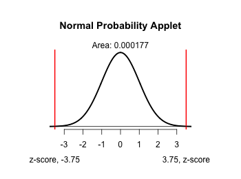
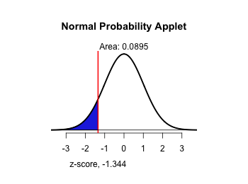

```{r,results='asis',echo=FALSE}
if(params$key==TRUE){
  if(params$plinks==TRUE) cat("* [Word Document](",paste(params$keyname,"docx",sep="."),")\n")
  if(params$plinks==TRUE) cat("* [PDF Document](",paste(params$keyname,"pdf",sep="."),")\n")
  cat("<!--")
  cat("\n")
} 
if(params$key!=TRUE){
  if(params$plinks==TRUE) cat("* [Word Document](",paste(params$docname,"docx",sep="."),")\n")
  if(params$plinks==TRUE) cat("* [PDF Document](",paste(params$docname,"pdf",sep="."),")\n")
  cat("\n")
}
```

**Instructions:  You are encouraged to collaborate with other students on the homework, but it is important that you do your own work.  Before working with someone else on the assignment, you should attempt each problem on your own.**  

## Problems

```{r,echo=FALSE}
library(ggplot2)
library(ggthemes)
library(pander)
panderOptions('keep.line.breaks',TRUE)
options(stringsAsFactors = FALSE) 
source("../scripts/ggQQline.R")
source("../scripts/normTail.R")
source("../scripts/221_Interactive_Functions.R")
```

1.	In your own words, explain what a P-value is.

2.	When a hypothesis test is conducted, which hypothesis is assumed to be true?

```{r,echo=FALSE}
mean1 = 69.5
test1 = c("less","more","either")[1]
```


Wikipedia asserts that the mean height of males in the United States is `r mean1` inches. Based on your experience, you suspect that the true mean height of males is `r typeTest(test1,alt=TRUE)` this value. Use this information to answer questions 3 through 5. 

3.	State the null and alternative hypotheses that you would use to test your claim.

4.	Is this a one-sided (i.e. one-tailed) test or a two-sided (i.e. two-tailed) test?  Explain your answer.

5.	Suppose the sample data you collected had a mean height greater than the null hypothesis and indicates that the null hypothesis should be rejected when in fact the null hypothesis should not be rejected.  Was a Type I or Type II error committed?  Why? 

```{r,echo=FALSE}
mean2 = 98.4
alpha2 = 0.01
test2 = c("less","more","either")[2]
```

According the Statistical Abstract of the United States, the mean consumption of fruits per person in 2003 was `r mean2` pounds.  A dietician believes people are becoming more health conscious and that fruit consumption has increased since then.  Use this information to answer questions 6 through 10.

6.	Determine the null and alternative hypotheses

7.	Is this a one-sided (i.e. one-tailed) test or a two-sided (i.e. two-tailed) test?  Explain your answer.

8.	What would be considered a Type II error in this example?

9.	If we tested this hypothesis at $\alpha$ = `r alpha2` level, what is the probability of committing a Type I Error? Explain your answer.

10.	If we wanted to `r p10="decrease"; p10` the probability of making a Type I error, would we need to increase or decrease the level of significance?  Explain your answer.

```{r,echo=FALSE,warning=FALSE,message=FALSE,results='hide'}
n3 = 100
mean3 = 40.0
sd3 = 1.6
alpha3 = 0.05
sampleMean3 = 39.4
test3 = c("less","more","either")[3]

zScore3 = zScore(sampleMean3,mean3,sd3,n3) 
p_value3 = pnorm(zScore3,lower.tail = TRUE) * 2

png(filename = "../images/L09_Homework_Q14_normalDistributionApplet.png",width = 350,height=260)
normTail(U=round(zScore3*-1,3),L=round(zScore3,3),lwd=2.5,df=700000)
dev.off()
```

A simple random sample of `r n3` two-month-old babies is obtained, and the mean head circumference is found to be `r sampleMean3` cm.  Assuming that the population standard deviation is known to be `r sd3` cm, use $\alpha$ = `r alpha3` level of significance to test the claim that the mean head circumference of all two-month-old babies is `r typeTest(test3,alt=TRUE)` `r mean3` cm. Use this information to answer questions 11 through 16.

11.	State the null and alternative hypotheses.

12.	Compute the sample test statistic for this analysis.

13.	Determine the P-value based on the sample test statistic. 

14.	Label the sample test statistic and shade the P-value on a sampling distribution curve.    
   
**Note: You can either sketch the distribution curve and scan in your document or use the snipping tool to paste a picture of the distribution curve here.  [Click here](http://statistics.byuimath.com/index.php?title=Help:Snipping_Tool) for instructions on how to use the snipping tool.**

15.	What decision do you make based on the P-value and the level of significance ($\alpha$)? 

16.	State your conclusion in an English sentence.

```{r,echo=FALSE,results='hide'}
mean4 = 135
n4 = 50
sampleMean4 = 133.1
sd4 = 10
alpha4 = 0.05
test4 = c("less","more","either")[1]

zScore4 = zScore(sampleMean4,mean4,sd4,n4) 
p_value4 = pnorm(zScore4,lower.tail = TRUE)
png(filename = "../images/L09_Homework_Q20_normalDistributionApplet.png",width = 350,height=260)
normTail(L=round(zScore4,3),lwd=2.5,df=700000)
dev.off()
```

Because of the increased demand for corn for food, animal feed and ethanol, The USDA is trying to determine if corn production is keeping up with demand.  They have determined that a yield of at least `r mean4` bushels per acre will be necessary to meet the demands for the coming year.  If the yield is less than `r mean4` bushels per acre, then the USDA will need to recommend an approach to ration corn for the next year.

The mean yield of corn in the United States is about `r mean4` bushels per acre. A survey of `r n4` farmers this year gives a sample mean yield of `r sampleMean4` bushels per acre. We want to know whether this is good evidence that the national mean this year is `r typeTest(test4,alt=FALSE)` `r mean4` bushels per acre. Assume that the farmers surveyed are an SRS from the population of all commercial corn growers and that the standard deviation of the yield in this population is $\sigma$ = `r sd4` bushels per acre.  Test this claim at $\alpha$ = `r alpha4` level of significance. Use this information to answer questions 17 through 23.

17.	State the null and alternative hypothesis.

18.	Compute the sample test statistic for this analysis.

19.	Determine the P-value based on the sample test statistic.  

20.	Label the sample test statistic and shade the P-value on a sampling distribution curve.

21.	What decision do you make based on the P-value and the level of significance ($\alpha$)? 

22.	State your conclusion in an English sentence.

23.	If you were overseeing this study for the USDA, what action would you recommend based on these results?

```{r,echo=FALSE ,results='asis',warning=FALSE}
if(params$key==TRUE){
options(scipen=5)

    Solution01 =  data.frame(Part="-",Solution="It is the probability that you get a result as extreme, or more extreme, than the one you saw in your sample, if the null hypothesis is really true.")
    
    Solution02 =  data.frame(Part="-",Solution="The null hypothesis ($H_o$)")
    
    Solution03 =  data.frame(Part="-",Solution=paste("$H_0: \\mu =",mean1," \\text{inches}$ \\\n $H_a: \\mu ",symbolTest(test1), mean1, "\\text{inches}$", sep = ""))
    
    Solution04 =  data.frame(Part="-",Solution="One-sided test")
    
    Solution05 =  data.frame(Part="-",Solution="Type I error")
    
    Solution06 =  data.frame(Part="-",Solution=paste("$H_0: \\mu =",mean2," \\text{pounds}$ \\\n $H_a: \\mu ",symbolTest(test2), mean2, "\\text{pounds}$", sep = ""))
    
    Solution07 =  data.frame(Part="-",Solution="One-sided test")
    
    Solution08 =  data.frame(Part="-",Solution="A Type II error would be failing to reject the null hypothesis when it isn't true. In this example that would be concluding that fruit consumption hasn't increased when, in reality, it has.")
    
    Solution09 =  data.frame(Part="-",Solution=paste("The probability of committing a Type I Error is $\\alpha$ = ",alpha2,sep=""))
    
    Solution10 =  data.frame(Part="-",Solution=paste(p10, " the level of significance",sep=""))# the use of typeTest() is a bit of a hack here.
    
    Solution11 =  data.frame(Part="-",Solution=paste("$H_0: \\mu =",mean3," \\text{cm}$ \\\n $H_a: \\mu ",symbolTest(test3), mean3, "\\text{cm}$", sep = ""))
 
    Solution12 =  data.frame(Part="-",Solution=paste("z = ",round(zScore3,3),sep = ""))
    
    Solution13 =  data.frame(Part="-",Solution=paste("P-value = ",format(signif(p_value3,2),scientific = FALSE), sep=""))
    
    Solution14 =  data.frame(Part="-",Solution="")
    
    Solution15 =  data.frame(Part="-",Solution=paste(failOrNot(p_value3,alpha3),sep = ""))
    
    Solution16 =  data.frame(Part="-",Solution=paste("There is ",sufficientOrNot(failOrNot(p_value3,alpha3))," evidence to conclude that the mean head circumference of all two-month-old babies is different than ", mean3, " cm.", sep = ""))
    
    Solution17 =  data.frame(Part=c("$H_0:$","$H_a:$"),
                    Solution=c(paste("$\\mu =$ ", mean4, " bushels per acre",sep = ""),
                              paste("$\\mu ",symbolTest(test4),"$ ", mean4, " bushels per acre", sep = "")))
    
    Solution18 =  data.frame(Part="-",Solution=paste("z = ",round(zScore4,3),sep = ""))
    
    Solution19 =  data.frame(Part="-",Solution=paste("P-value = ",round(p_value4,3), sep=""))
    
    Solution20 =  data.frame(Part="-",Solution=paste(" \\\n ",sep=""))
    
    Solution21 =  data.frame(Part="-",Solution=paste(failOrNot(p_value4,alpha4),sep = ""))
    
    Solution22 =  data.frame(Part="-",Solution=paste("There is ",sufficientOrNot(failOrNot(p_value4,alpha4))," evidence to conclude that the mean yield of corn is less than ", mean4, " bushels per acre.",sep = ""))
    
    Solution23 =  data.frame(Part="-",Solution=paste("The evidence does not indicate that the production is less than ", mean4, " bushels per acre. However, it is worth keeping a close eye on the production over the next few years.",sep = ""))
    
options(stringsAsFactors = TRUE)
} # end params == TRUE.  We use this so it doesn't have to run for non answer key path.

```

```{r,echo=FALSE,results='asis'}
if(params$key==TRUE) cat("-->")
  if(params$key==TRUE) cat("\n\n## Solutions\n\n---")
      if(params$key==TRUE) cat("\n\n")
```


```{r,echo=FALSE,results='asis'}
if(params$key==TRUE){

    all_solutions = sort(ls(pattern="Solution"))
    key_list = NULL
    for (i in 1:length(all_solutions)){
      temp = get(all_solutions[i])
      temp$Solution = as.character(temp$Solution)
      key_list = rbind(key_list,data.frame(Problem=i,temp))
    }
    
      pander(key_list,split.cell = 80, split.table = Inf,justify = c( 'center', 'left',"left"))

} # end params == TRUE.  We use this so it doesn't have to run for non answer key path.
    
```


