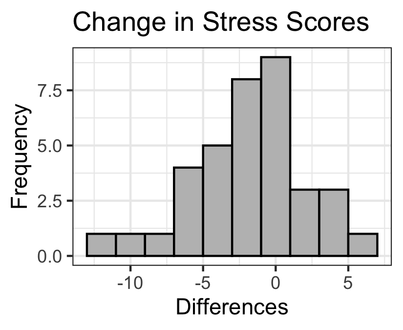
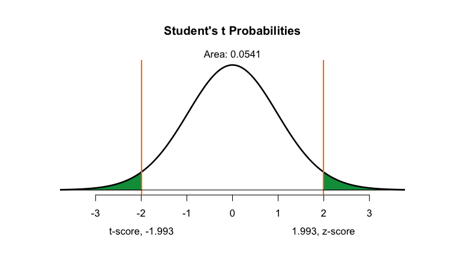
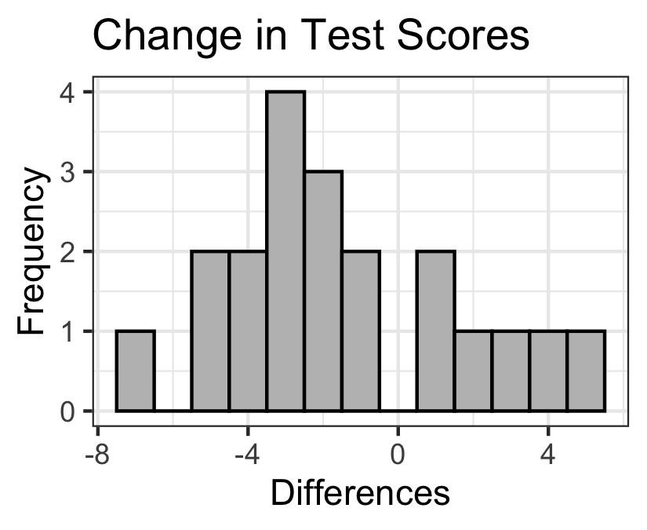
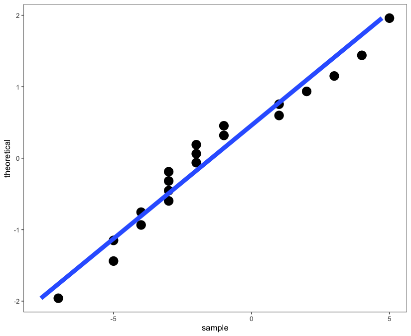

```{r,results='asis',echo=FALSE}
if(params$key==TRUE){
  if(params$plinks==TRUE) cat("* [Word Document](",paste(params$keyname,"docx",sep="."),")\n")
  if(params$plinks==TRUE) cat("* [PDF Document](",paste(params$keyname,"pdf",sep="."),")\n")
  cat("<!--")
  cat("\n")
} 
if(params$key!=TRUE){
  if(params$plinks==TRUE) cat("* [Word Document](",paste(params$docname,"docx",sep="."),")\n")
  if(params$plinks==TRUE) cat("* [PDF Document](",paste(params$docname,"pdf",sep="."),")\n")
  cat("\n")
}
```

**Instructions:  You are encouraged to collaborate with other students on the homework, but it is important that you do your own work.  Before working with someone else on the assignment, you should attempt each problem on your own.**

## Problems

```{r,echo=FALSE}
library(ggplot2)
library(ggthemes)
library(pander)
panderOptions('keep.line.breaks', TRUE)

source("../scripts/normTail.R") # normTail(L=-2,U=2)
source("../scripts/221_Interactive_Functions.R")
```


1. In your own words, explain the difference between conducting a hypothesis test with one mean, sigma unknown and conducting a hypothesis test with matched pairs.

```{r,echo=FALSE}
#creating the dataset that we will be using to answer these questions
fire = data.frame(flint = c(354,366,100,287,266,124), battery = c(151,269,205,407,205,235))
colnames(fire) = c("Flint.and.Steel","Battery.and.Steel.Wool")
row.names(fire) = c("Adam","Dallin","Juan","Logan","Pang","Terrence")
fire$difference = fire[,2] - fire[,1]

confLevel1 = 95
alpha1 = 1-(confLevel1/100)
meanD1 = mean(fire$difference)

results_Q03 = t.test(fire$Flint.and.Steel,fire$Battery.and.Steel.Wool,paired=TRUE,mu=0,alternative="two.sided",conf.level=confLevel1/100)

LB_Q03 = results_Q03$conf.int[1]
UB_Q03 = results_Q03$conf.int[2]
```


In the Boy Scouts of America, boys are taught several methods for starting fires without using matches. These methods include striking flint and steel and touching a battery to steel wool. A scoutmaster wanted to know if there was a difference between the mean amounts of time required to start a fire using these two methods. He asked six randomly selected boys in the scout troop to make two fires each, using only one of the methods for each fire. The scoutmaster recorded the time (in seconds) required for each boy to start a fire using these two methods. The data are given below. (Assume that the times required to start a fire by these methods are normally distributed.) 

```{r, echo = FALSE, results='asis'}
pander(fire[,1:2])

```

Use this information to answer questions 2 through 4.

2. Explain why this is an example of paired data.

3. Create and interpret a `r confLevel1`% confidence interval for the mean difference in the amount of time required by the two methods.

4. Does there appear to be a difference in the mean time required to start a fire by these two methods? Justify your answer.

```{r,echo=FALSE}
confLevel2 = 95
alpha2= 1-(confLevel2/100)

Z = read.csv(file = "https://raw.githubusercontent.com/byuistats/data/master/ZungSim/ZungSim.csv",stringsAsFactors = FALSE, header = TRUE) #pulling data file ZungSim
ZungSim = na.omit(Z) #getting rid of the rows where there is a missing value. Now there are only matched pairs. 
ZungSim$Difference = ZungSim[,2] - ZungSim[,1]

n2 = nrow(ZungSim)
df2 = n2-1

meanD2 = mean(ZungSim$Difference)
sdD2 = sd(ZungSim$Difference)

results_Zung = t.test(ZungSim$After,ZungSim$Before,paired=TRUE,mu=0,alternative="two.sided",conf.level=confLevel2/100)

LB_Q05 = results_Zung$conf.int[1]
UB_Q05 = results_Zung$conf.int[2]

tscore_Q11 = results_Zung$statistic
pvalue_q13_q14 = results_Zung$p.value
```


The Zung Self-Rating Anxiety Scale (SAS) was developed by William W. K. Zung, a psychiatrist from Duke University, to quantify and compare anxiety levels (Wikipedia).  Many stress-relief courses use this scale to measure the change in participants' anxiety from before the course to after.  You want to determine if a particular course is effective at changing stress levels before you consider participating. *Define the differences as the individual's Zung SAS score after the course minus their score before the course*.  Open the data file [ZungSim](https://byuistats.github.io/BYUI_M221_Book/Data/ZungSim.xlsx). Use this information to answer questions 5 through 16.

5. Create and interpret a `r confLevel2`% confidence interval of the true mean difference of the before and after stress levels.

6. Does the confidence interval contain 0? If so, what does that tell us?

You also want to conduct a hypothesis test to get a better understanding of the effectiveness of this course and test to see if there is a difference. Use a level of significance of $\alpha = `r alpha2`$.

7.	State the null and alternative hypotheses.

8.	Make an appropriate graph of the data.

9.	Verify that the requirements to conduct a hypothesis test are met.

10.	Give relevant summary statistics (mean, standard deviation, sample size).

11.	Report the sample test statistic. Give its degrees of freedom.

12.	Sketch the sampling distribution using the [t-distribution applet](http://byuimath.com/apps/normprobwitht.html), showing the test statistic and shading the P-value.
  
13.	State the P-value.

14.	Give the decision rule for this test.

15.	Present your conclusion in an English sentence relating the results to the original context.

16.	If you did problems #4 through #15 correctly, you would have gotten the same conclusions between the confidence interval and the hypothesis test.  Why do you suppose that the conclusions are the same?

```{r,echo=FALSE}
MLA = read.csv(file = "https://raw.githubusercontent.com/byuistats/data/master/MLA_Data/MLA_Data.csv",header = TRUE, stringsAsFactors = FALSE)#pulling MLA data
MLA$Difference = MLA[,3] - MLA[,2]

n3 = nrow(MLA)
df3 = n3-1

meanD3 = mean(MLA$Difference)
sdD3 = sd(MLA$Difference)

confLevel3 = 95
alpha3 = 1 - (95/100)

test3 = "less"

results_MLA = t.test(MLA$Week.Later,MLA$Course.End,paired=TRUE,mu=0,alternative="less",conf.level=confLevel3/100)

tscore_Q21 = results_MLA$statistic
pvalue_q22_q23 = results_MLA$p.value
```


A study was conducted to test retention in language learning. `r n3` psychologists were randomly selected from around the country to participate in the study. At the end of an intensive three day Spanish course the subjects completed the MLA listening test. One week later they were given the same test. Suppose that you are a researcher conducting this study. Conduct a hypothesis test to determine if there was a significant `r typeTest(test3)` between test scores from the end of the course to one week after the course.  Open the data file [MLA_Data](https://byuistats.github.io/BYUI_M221_Book/Data/MLA_Data.xls) Data.  *Define the differences as the Week Later minus Course End*. Use a level of significance of $\alpha =  `r alpha3`$. Use this information to answer questions 17 through 24.


17.	State the null and alternative hypotheses.

18.	Make an appropriate graph of the data.

19.	Verify that the requirements to conduct a hypothesis test are met.

20.	Give relevant summary statistics (mean, standard deviation, sample size).

21.	Report the sample test statistic. Give its degrees of freedom.
 
22.	State the P-value. Also examine the t-distribution area using the [t-distribution applet](http://byuimath.com/apps/normprobwitht.html).

23. Give the decision rule for this test.

24. Present your conclusion in an English sentence relating the results to the original context.

```{r,include=FALSE}
Question_08_histogram = ggplot(data = ZungSim,aes(x=Difference)) +
                          geom_histogram(fill = "grey", binwidth = 2, colour = "black") + 
                          labs(x = "Differences",y = "Frequency") + 
                          ggtitle("Change in Stress Scores") + 
                          theme_bw()
ggsave(Question_08_histogram,file="../images/L12_Homework_Q08_histogram.png",width = 2.75,height = 2.25)

Question18_histogram = ggplot(data = MLA,aes(x=Difference)) + 
                          geom_histogram(fill = "grey",binwidth = 1,colour = "black") +
                          labs(x = "Differences",y = "Frequency") + 
                          ggtitle("Change in Test Scores") + 
                          theme_bw()
ggsave(Question18_histogram,filename = "../images/L12_Homework_Q18_histogram.png",width = 2.75,height = 2.25)

Question19_QQPlot = ggplot(MLA, aes(Difference)) + 
  geom_histogram(fill="gray",color="darkgray", bins=10)+
  labs(x="Age",y="")+
  theme(axis.text=element_blank(),axis.ticks=element_blank())+
  theme_bw()

ggsave(Question19_QQPlot,filename = "../images/L12_Homework_Q19_QQp.png",width = 2.75,height = 2.25)

png(file="../images/tdistribution_L12_Q12.png",width=7.75,height=4.25,units="in",res=100)
results_Zung = t.test(ZungSim$After,ZungSim$Before,paired=TRUE,mu=0,alternative="two.sided",conf.level=confLevel2/100)
tscore_Q11 = results_Zung$statistic
tscore = round(tscore_Q11,3)
tuse = sort(c(tscore,-tscore))
normTail(L=tuse[1],U=tuse[2],df=df2)
dev.off()


```


```{r, include=FALSE}
if(params$key==TRUE){

    Solution01 = data.frame(Part="-",Solution="The difference between these tests is that when using paired data we are testing the mean of the *difference* of the paired data, not the individual datasets.")
    
    Solution02 = data.frame(Part="-",Solution="This is an example of paired data because knowing the subject of the first experiment (the flint and steel) determines the subject of the second experiment (the battery and steel wool).")
    
    Solution03 = data.frame(Part="-",Solution=paste("There are two possible correct solutions, depending on the order of subtraction: (",round(LB_Q03,3),",",round(UB_Q03,3),") or (", round(UB_Q03,3)*-1,",",round(LB_Q03,3)*-1,"). We are ",confLevel1,"% confident that the true mean difference in time is between ", round(LB_Q03,3)," and ", round(UB_Q03,3),"  (or, if you subtracted the opposite way, ",round(UB_Q03,3)*-1," and ",round(LB_Q03,3)*-1,").",sep = ""))
    
    Solution04 = data.frame(Part="-",Solution="There is inconclusive evidence that there is a difference between these methods since zero is contained in the confidence interval.")
    
    Solution05 = data.frame(Part="-",Solution=paste("(",round(LB_Q05,3),",",round(UB_Q05,3),") We are ", confLevel2,"% confident that the true mean difference of the before and after stress levels is between ",round(LB_Q05,3)," and ",round(UB_Q05,3),".",sep = ""))
    
    Solution06 = data.frame(Part="-",Solution="Yes. Since the confidence interval contains 0, it is plausible that the true mean
difference is 0, meaning that the class could have no effect on stress levels. There is inconclusive evidence that there is a difference.")
    
    Solution07 = data.frame(Part="-",Solution="$H_o:\\mu_d = 0$ \\\n $H_a: \\mu_d \\neq 0$")
    
    Solution08 = data.frame(Part="-",Solution=" \\\n Note: This histogram should be of the differences, not the individual data sets.")
    
    Solution09 = data.frame(Part="-",Solution=paste("a. We assume that the data were collected using a simple random sample (SRS) \\\nb. We have a large sample (n = ",n2,"), so we can conclude that the distribution of sample mean is normal.",sep = ""))
    
    Solution10 = data.frame(Part="-",Solution=paste("-$\\bar{d} = ",round(meanD2,3),"$ \\\n- $s_d = ",round(sdD2,3),"$ \\\n- $n = ",n2,"$",sep = ""))
    
    Solution11 = data.frame(Part="-",Solution=paste("$t = ",round(tscore_Q11,3),"$ $df = ",df2,"$",sep = ""))
    
    Solution12 = data.frame(Part="-",Solution= "")
    
    Solution13 = data.frame(Part="-",Solution=paste("$p = ",round(pvalue_q13_q14,3),"$",sep=""))
    
    Solution14 = data.frame(Part="-",Solution=paste("$p = ",round(pvalue_q13_q14,3)," > ",alpha2," = \\alpha$, ",failOrNot(pvalue_q13_q14,alpha2),".",sep = ""))
    
    Solution15 = data.frame(Part="-",Solution=paste("There is ",sufficientOrNot(failOrNot(pvalue_q13_q14,alpha2))," evidence to suggest that the mean Zung SAS scores changed as a result of this course"))
    
    Solution16 = data.frame(Part="-",Solution=paste("The conclusions are the same when we do a ",confLevel2,"% confidence interval and a two-sided hypothesis test with a level of significance = ",alpha2,".",sep = ""))
    
    Solution17 = data.frame(Part="-",Solution="$$H_o: \\mu_d = 0$$ $$H_a: \\mu_d < 0$$")
    
    Solution18 = data.frame(Part="-",Solution=" \\\n Note: This histogram should be of the differences, not the individual data sets.")
    
    Solution19 = data.frame(Part="-",Solution="a. We are told that the data were collected using a simple random sample (SRS) \\\n b. We have a small sample (n = 20), so we need to create a Q-Q plot to be sure the distribution of sample means is normal: \\\n  \\\n The data appear to be normal")
    
    Solution20 = data.frame(Part="-",Solution=paste("-$\\bar{d} = ",round(meanD3,3),"$ \\\n- $s_d = ",round(sdD3,3),"$ \\\n- $n = ",n3,"$",sep = ""))
    
    Solution21 = data.frame(Part="-",Solution=paste("$t = ",round(tscore_Q21,3),"$ $df = ",df3,"$",sep = ""))
    
    Solution22 = data.frame(Part="-",Solution=paste("$p = ",round(pvalue_q22_q23,3),"$",sep=""))
    
    Solution23 = data.frame(Part="-",Solution=paste("$p = ",round(pvalue_q22_q23,3)," < ",alpha2," = \\alpha$, ",failOrNot(pvalue_q22_q23,alpha3),".",sep = ""))
    
    Solution24 = data.frame(Part="-",Solution=paste("There is ",sufficientOrNot(failOrNot(pvalue_q22_q23,alpha3))," evidence to suggest that there is a decrease in retention immediately following language learning instruction and one week after language learning instruction."))

} # end params == TRUE.  We use this so it doesn't have to run for non answer key path.
```

```{r,echo=FALSE,results='asis'}
if(params$key==TRUE) cat("-->")
  if(params$key==TRUE) cat("\n\n## Solutions\n\n---")
      if(params$key==TRUE) cat("\n\n")
```


```{r,echo=FALSE,results='asis'}
if(params$key==TRUE){

    all_solutions = sort(ls(pattern="Solution"))
    key_list = NULL
    for (i in 1:length(all_solutions)){
      temp = get(all_solutions[i])
      temp$Solution = as.character(temp$Solution)
      key_list = rbind(key_list,data.frame(Problem=i,temp))
    }
    
      pander(key_list,split.cell = 80, split.table = Inf,justify = c( 'center', 'left',"left"))
} # end params == TRUE.  We use this so it doesn't have to run for non answer key path.    
```


