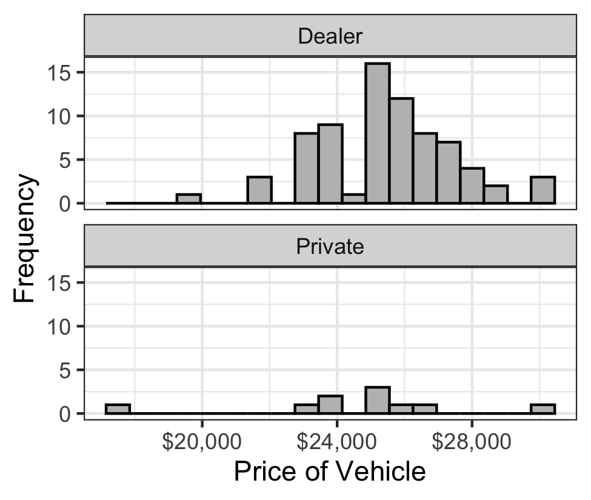
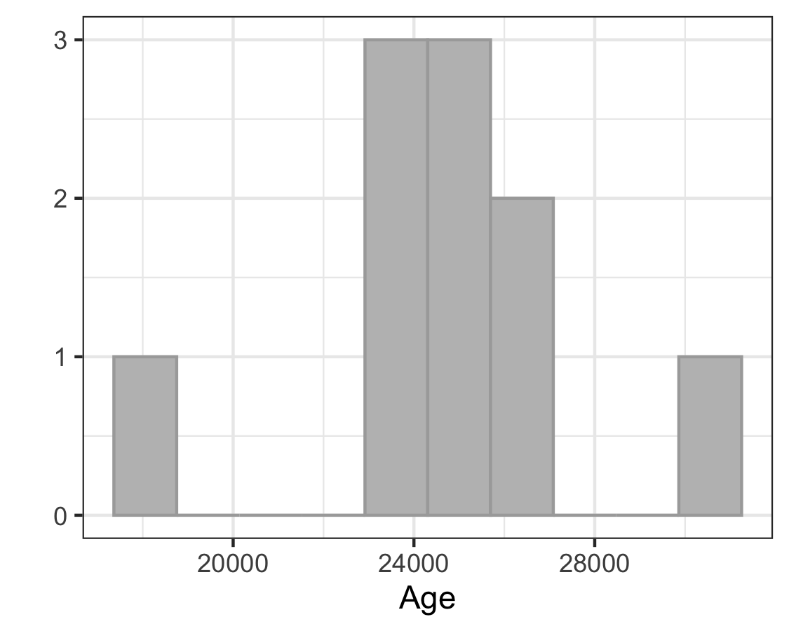
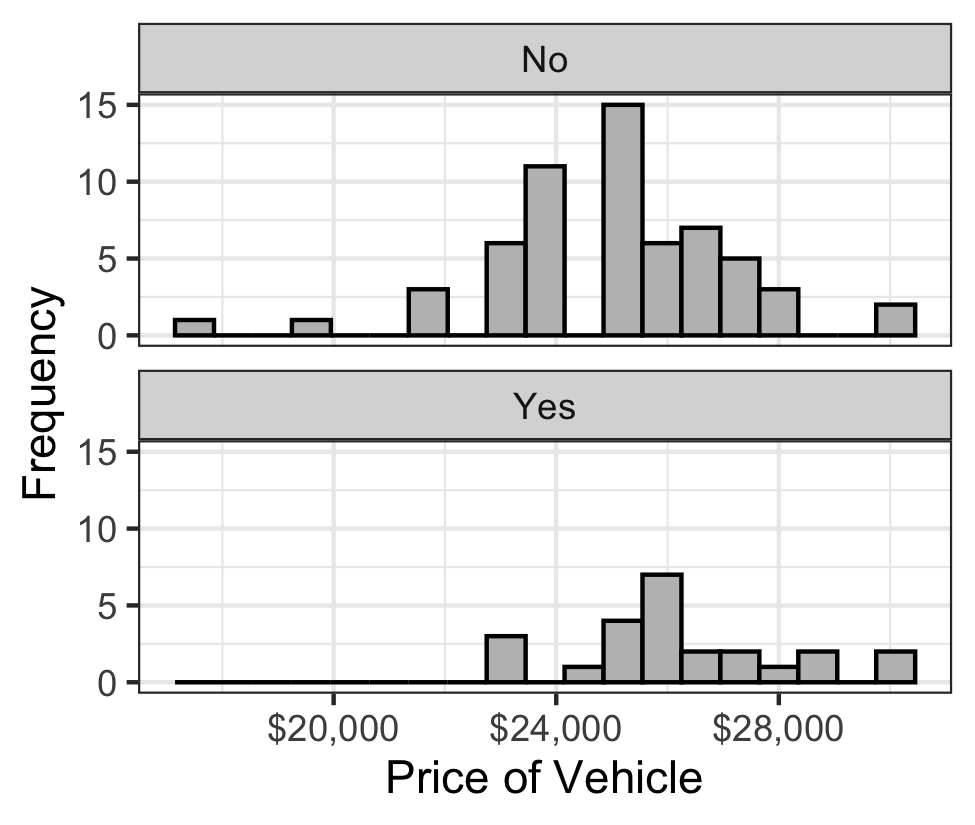
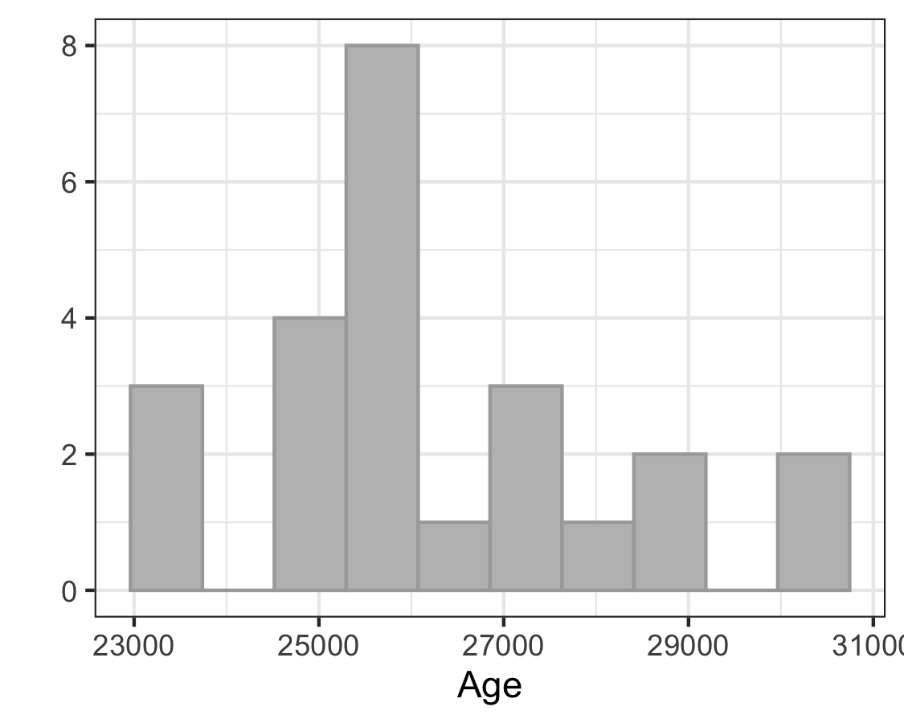

```{r,results='asis',echo=FALSE}
if(params$key==TRUE){
  if(params$plinks==TRUE) cat("* [Word Document](",paste(params$keyname,"docx",sep="."),")\n")
  if(params$plinks==TRUE) cat("* [PDF Document](",paste(params$keyname,"pdf",sep="."),")\n")
  cat("<!--")
  cat("\n")
} 
if(params$key!=TRUE){
  if(params$plinks==TRUE) cat("* [Word Document](",paste(params$docname,"docx",sep="."),")\n")
  if(params$plinks==TRUE) cat("* [PDF Document](",paste(params$docname,"pdf",sep="."),")\n")
  cat("\n")
}
```

**Instructions:  You are encouraged to collaborate with other students on the homework, but it is important that you do your own work.  Before working with someone else on the assignment, you should attempt each problem on your own.**

```{r,echo=FALSE}
library(ggplot2)
library(ggthemes)
library(pander)
panderOptions('keep.line.breaks', TRUE)
source("../scripts/ggQQline.R")
source("../scripts/221_Interactive_Functions.R")
```

1. In your own words, explain the difference between dependent and independent samples.


Researcher Neil Melancon studied the effect of including a company's URL (web page location) in a printed advertisement. He randomly assigned participants to one of two groups: a treatment group and a control group. He showed each participant an ad for Levi's (a clothing manufacturer). The ad shown to subjects in the treatment group included the URL of the Levi's company. The ad shown to subjects in the control group did not include the URL. Subjects rated their desire to purchase a Levi's brand product on a scale of 1 to 5, where 5 indicates the greatest desire. Use this information to answer the following question.

2. Which hypothesis test in the list above would be most appropriate for this study?


    a. Independent sampling. How the researchers select the participants for the treatment group is independent of how they select the participants for the control group.
    
    b. Independent sampling. Those in the treatment group don't know who are in the control group, so they must have been chosen independently of one another.
    
    c. Dependent sampling. Participants for each group are drawn from the same population, meaning their answers will be distributed the same.
    
    d. Dependent sampling. Who is chosen to participate in the treatment group depends on who is chosen to participate in the control group.
    
```{r,echo=FALSE}
ToyotaPrius = read.csv(file = "https://raw.githubusercontent.com/byuistats/data/master/ToyotaPrius2005/ToyotaPrius2005.csv",stringsAsFactors = FALSE,header = TRUE)

toyotaD = subset(ToyotaPrius, TypeOfSeller=="Dealer") #Created a subset of the Dealers
mean1D = mean(toyotaD$Price)
sd1D = sd(toyotaD$Price)
n1D = nrow(toyotaD)

toyotaP = subset(ToyotaPrius, TypeOfSeller=="Private") #Created a subset of private sellers

mean1P = mean(toyotaP$Price)
sd1P = sd(toyotaP$Price)
n1P = nrow(toyotaP)

confLevel1 = 95
alpha1 = 1-(confLevel1/100)

results1_D_v_P = t.test(toyotaD$Price,toyotaP$Price,paired=FALSE,mu = 0, alternative = "two.sided",conf.level = confLevel1/100)

LB1 = results1_D_v_P$conf.int[1]
UB1 = results1_D_v_P$conf.int[2]
stat1 = results1_D_v_P$statistic
df1 = results1_D_v_P$parameter
p1 = results1_D_v_P$p.value

```


The data set [ToyotaPrius2005](http://statistics.byuimath.com/index.php?title=Data) gives the advertised selling prices for a random sample of used 2005 Toyota Prius cars that were listed for sale on cars.com.  You want to determine which variables affect the listing prices of cars. Two of the factors that you will explore are the type of seller listing the car and whether or not the car is certified. Use this information to answer questions 3 through 20.

The first variable you will look at is the type of seller who is listing the car.  The two types of sellers are "Dealer" and "Private".  You will create a confidence interval for the difference in the mean listing price between dealers and private sellers.

3. Make an appropriate graph comparing the listing prices of cars sold by a dealer versus cars sold by a private seller.

4. Based on your graph in Question 3, does there appear to be a difference in the mean listing prices of cars sold by a dealer compared to cars sold by a private seller? 

5. Are the requirements for creating a confidence interval satisfied?

6. Create and interpret a `r confLevel1`% confidence interval for the difference in the mean listing price of cars that are sold by a dealer versus cars that are sold by a private seller. Report your confidence interval to the nearest dollar amount.

7. Does the confidence interval you computed in Question 6 contain the value zero? If so, what does this suggest about the mean prices of cars that are listed for sale by a dealer versus those listed for sale by a private individual?

```{r,echo=FALSE}
ToyotaYes = subset(ToyotaPrius, IsCertified=="Yes") #creating new dataset where all are certified

mean2Yes = mean(ToyotaYes$Price)
sd2Yes = sd(ToyotaYes$Price)
n2Yes = nrow(ToyotaYes)

ToyotaNo = subset(ToyotaPrius, IsCertified=="No") #creating new dataset where all are not certified

mean2No = mean(ToyotaNo$Price)
sd2No = sd(ToyotaNo$Price)
n2No = nrow(ToyotaNo)

confLevel2 = 95
alpha2 = 1 - (confLevel2/100)

results2_Y_v_N_conf = t.test(ToyotaNo$Price,ToyotaYes$Price,paired=FALSE,mu=0,alternative="two.sided",conf.level=confLevel2/100)

LB2 = results2_Y_v_N_conf$conf.int[1]
UB2 = results2_Y_v_N_conf$conf.int[2]

results2_Y_v_N_hyp = t.test(ToyotaYes$Price,ToyotaNo$Price,paired=FALSE,mu=0,alternative="greater",conf.level=confLevel2/100)

stat2 = results2_Y_v_N_hyp$statistic
df2 = results2_Y_v_N_hyp$parameter
p2 = results2_Y_v_N_hyp$p.value
```


The next variable you will look at is whether or not the car is certified.  The variable "IsCertified" contains the value "Yes" if the seller has inspected the car and offers an extended warranty and "No" otherwise. You will create a confidence interval for the difference in the mean listing prices between certified and non-certified cars.

8. Make an appropriate graph comparing the listing prices of cars that are certified compared to cars that are not certified.

9. Based on your graph in Question 8, does there appear to be a difference in the mean listing prices of certified and non-certified cars? 

10.	Are the requirements for creating a confidence interval satisfied?

11.	Create and interpret a `r confLevel2`% confidence interval for the difference in the mean listing price of cars that are certified compared to cars that are not certified.

12.	Does the confidence interval you computed in Question 11 contain the value zero? If so, what does this suggest about the mean prices of cars that are certified versus those that are not certified?

You suspect that cars that are certified have a higher mean listing price than non-certified cars. You will conduct a hypothesis test to see if this is the case. Use a level of significance of $\alpha = `r alpha2`$.

13.	State the null and alternative hypotheses.

14.	Make an appropriate graph of the data.

15.	Verify that the requirements to conduct a hypothesis test are met.

16.	Give relevant summary statistics (mean, standard deviation, sample size).

17.	Report the test statistic. Give its degrees of freedom.
 
18.	State the P-value.  

19.	Give the decision rule for this test.

20.	Present your conclusion in an English sentence relating the results to the original context.

```{r,echo=FALSE}
PatientSatisfaction = read.csv(file="https://raw.githubusercontent.com/byuistats/data/master/PatientSatisfaction-DoctorVsNurse-Stacked/PatientSatisfaction-DoctorVsNurse-Stacked.csv",stringsAsFactors = FALSE,header = TRUE)

confLevel3 = 95
alpha3 = 1-(95/100)
n3 = nrow(PatientSatisfaction)

results3_D_v_N = t.test(Satisfaction~Group,data=PatientSatisfaction,paired=FALSE,mu=0,alternative = "two.sided",conf.level = confLevel3/100)

LB3 = results3_D_v_N$conf.int[1]
UB3 = results3_D_v_N$conf.int[2]
stat3 = results3_D_v_N$statistic
df3 = results3_D_v_N$parameter
p3 = results3_D_v_N$p.value

```


`r n3` patients who did not have a regular health care provider and who had an acute medical condition were randomly assigned to either a nurse practitioner or a physician. The patients were given an examination at the beginning of the study and again six months later. The researchers wanted to know if there was a difference in the level of satisfaction of the patients who were treated by a nurse practitioner compared to those treated by a doctor.  The data set [PatientSatisfactionDoctorVsNurse-Stacked](http://statistics.byuimath.com/index.php?title=Data) gives data representative of the satisfaction ratings reported by the patients. The satisfaction scores are based on a series of questions using a 5-point scale, where 5 is the most positive response. Conduct a hypothesis test to determine if there is a difference in the mean level of satisfaction for the patients in the two groups. Use a level of significance of $\alpha = `r alpha3`$. Use this information to answer questions 21 through 25.

21.	State the null and alternative hypotheses.

22.	Report the test statistic. Give its degrees of freedom.

23.	State the P-value.  

24.	Give the decision rule for this test.

25.	Present your conclusion in an English sentence relating the results to the original context.

```{r,echo=FALSE}
#Histogram to compare distribution of prices of dealerships and private individuals
Question03_Histogram = 
  ggplot(ToyotaPrius,aes(x=Price)) +
  geom_histogram(binwidth = 700,fill="grey",colour="black") +
  facet_wrap(~TypeOfSeller,nrow = 2) +
  labs(x="Price of Vehicle",y="Frequency") +
  scale_x_continuous(labels = scales::dollar) + 
  theme_bw()

ggsave(Question03_Histogram,filename = "../images/L13_Homework_Q03_Histogram.png",width = 3.25,height = 2.75)

#QQ-plot to check for normalitiy of distribution of prices from private sellers
## we don't need to create this new data set
            #price = data.frame(y=toyotaP$Price)
# we can put the toyotaP data in.
QQp = ggplot(data = toyotaP) + 
  stat_qq(aes(sample=Price),size=.05) 

Question05_QQPlot = ggQQline(QQp,size=.85)+
  theme_bw(13)+
  coord_flip()+
  labs(x="",y="")+
  theme(axis.text=element_blank(),axis.ticks=element_blank())

ggsave(Question05_QQPlot,filename = "../images/L13_Homework_Q05_QQp.png",width = 3.75,height = 3.00)

#histogram to compare distributions of certified and non-certified vehicles

Question08_14_Histogram = 
  ggplot(ToyotaPrius,aes(x=Price)) +
  geom_histogram(binwidth = 700,fill="grey",colour="black") +
  facet_wrap(~IsCertified,nrow = 2) +
  labs(x="Price of Vehicle",y="Frequency") +
  scale_x_continuous(labels = scales::dollar) + 
  theme_bw()

ggsave(Question08_14_Histogram,filename = "../images/L13_Homework_Q08_Q14_Histogram.png",width = 3.25,height = 2.75)

#QQPlot to check for normality of prices of certified vehicals. 
QQp_price = ggplot(data = ToyotaYes) +  stat_qq(aes(sample=Price))

Question10_QQPlot = ggQQline(QQp_price,size=.85)+
  theme_bw(13)+
  coord_flip()+
  labs(x="",y="")+
  theme(axis.text=element_blank(),axis.ticks=element_blank())

ggsave(Question10_QQPlot,filename = "../images/L13_Homework_Q10_QQp.png",width = 3.75,height = 3)
```

```{r, include=FALSE}
if(params$key==TRUE){

    Solution01 = data.frame(Part="-",Solution="Samples are dependent (or represent paired data) if knowing which subjects will be in the first group determines which will be in the second group. If knowing which subjects are in the first group gives you no information about the second group, we say the samples are independent.")
    
    Solution02 = data.frame(Part="-",Solution="a")
    
    Solution03 = data.frame(Part="-",Solution="")
    
    Solution04 = data.frame(Part="-",Solution="The two histograms look different, but the means look fairly close.")
    
    Solution05 = data.frame(Part="-",Solution=paste("a. We are told that the data was collected using a SRS \\\nb. The sample size for dealers is large, so we can assume that it is normally distributed. The sample size for private sellers is small, with a sample of n = ",n1P,". A Q-Q Plot will help us know if the data are normally distributed. \\\n  \\\n These data are clearly not normally distributed and n = ",n1P," is a very small sample size. Therefore, we have not met the requirements. However, we will proceed with caution and realize that our confidence interval and p-value are not accurate and the conclusions are more suspect than they would be if we had met the requirements."))
    
    Solution06 = data.frame(Part="-",Solution=paste("(",round(LB1,0),", ", round(UB1,0),") We are ",confLevel1,"% confident that the true difference of the mean car prices between dealers and private sellers is between ",round(LB1,0), " and ",round(UB1,0),".  \\\n \\\n Please note, if you put the two groups in the reverse order, you will have a confidence interval with the opposite signs (",round(UB1 * -1,0),", ", round(LB1 * -1,0),"). Either answer is acceptable.",sep = ""))
    
    Solution07 = data.frame(Part="-",Solution="Yes. Since the confidence interval contains 0, it is plausible that the true difference of the means is 0, meaning that the mean car prices are the same for dealers as for private sellers. There is inconclusive evidence that there is a difference.")
    
    Solution08 = data.frame(Part="-",Solution="")
    
    Solution09 = data.frame(Part="-",Solution="Answers will vary")
    
    Solution10 = data.frame(Part="-",Solution=paste("a. We are told that the data was collected using a SRS. \\\n b. The sample size for non-certified cars is large, so we can assume that it is normally distributed. With a sample size of n = ",n2Yes," for certified cars, it is likely large enough to assume a normal distribution, but a Q-Q Plot will help us know more confidently. \\\n  \\\n These data are approximately not normal."))
    
    Solution11 = data.frame(Part="-",Solution=paste("(",round(LB2,3),", ", round(UB2,3),") We are ",confLevel2,"% confident that the true difference of the mean car prices between dealers and private sellers is between ",round(LB2,3)," and ",round(UB2,3),". \\\n \\\n Please note that if you put the two groups in the reverse order, you will have a confidence interval with the opposite signs (",round(UB2 * -1,3),",", round(LB2 * -1,3),"). Either answer is acceptable.",sep = ""))
    
    Solution12 = data.frame(Part="-",Solution="No. Since the confidence interval does not contain 0, it is plausible that the mean car prices are different for certified cars than from non-certified cars.")
    
    Solution13 = data.frame(Part="-",Solution="$H_o: \\mu_1 = \\mu_2$ \\\n $H_a: \\mu_1 > \\mu_2$")
    
    Solution14 = data.frame(Part="-",Solution="")
    
    Solution15 = data.frame(Part="-",Solution="These requirements are the same as the ones used when we created the confidence interval in question 10.")
    
    Solution16 = data.frame(Part="-",Solution=paste("$\\bar{x}_1 = ",round(mean2Yes,3),"$ \\\n $s_1 = ",round(sd2Yes,3),"$ \\\n $n_1 = ",n2Yes,"$ \\\n \\\n $\\bar{x}_2 = ",round(mean2No,3),"$ \\\n $s_2= ",round(sd2No,3),"$ \\\n $n_1 = ",n2No,"$",sep = ""))
    
    Solution17 = data.frame(Part="-",Solution=paste("$t=",round(stat2,3),"$ \\\n $df=",round(df2,3),"$",sep = ""))
    
    Solution18 = data.frame(Part="-",Solution=paste("$\\text{p-value} = ",round(p2,3),"$",sep = ""))
    
    Solution19 = data.frame(Part="-",Solution=paste("$\\text{p-value} = ",round(p2,3)," < ", alpha2," = \\alpha$ \\\n  ",failOrNot(p2,alpha2),".",sep = ""))
    
    Solution20 = data.frame(Part="-",Solution=paste("There is ",sufficientOrNot(failOrNot(p2,alpha2))," evidence to suggest that the price of certified cars is greater than the price of non-certified cars."))
    
    Solution21 = data.frame(Part="-",Solution="$H_o: \\mu_1 = \\mu_2$ \\\n $H_a: \\mu_1 \\neq \\mu_2$")
    
    Solution22 = data.frame(Part="-",Solution=paste("$t=",round(stat3,3),"$ (or, if you assigned the groups differently, $t=",round(stat3 *-1,3),"$) \\\n $df=",round(df3,3),"$",sep = ""))
    
    Solution23 = data.frame(Part="-",Solution=paste("$\\text{p-value} = ",round(p3,3),"$",sep=""))
    
    Solution24 = data.frame(Part="-",Solution=paste("$\\text{p-value} = ",round(p3,3)," > ", alpha3," = \\alpha$ \\\n , ",failOrNot(p3,alpha3),".",sep = ""))
    
    Solution25 = data.frame(Part="-",Solution=paste("There is ",sufficientOrNot(failOrNot(p3,alpha3))," evidence to suggest that there is a difference in patient satisfaction between doctors and nurse practitioners."))
    
} # end params == TRUE.  We use this so it doesn't have to run for non answer key path.
```


```{r,echo=FALSE,results='asis'}
if(params$key==TRUE) cat("-->")
  if(params$key==TRUE)    cat("\n\n## Solutions\n\n")
      if(params$key==TRUE) cat("\n\n")
```


```{r,echo=FALSE,results='asis'}
if(params$key==TRUE){

    all_solutions = sort(ls(pattern="Solution"))
    key_list = NULL
    for (i in 1:length(all_solutions)){
      temp = get(all_solutions[i])
      temp$Solution = as.character(temp$Solution)
      key_list = rbind(key_list,data.frame(Problem=i,temp))
    }
    
      pander(key_list,split.cell = 80, split.table = Inf,justify = c( 'center', 'left',"left"))

} # end params == TRUE.  We use this so it doesn't have to run for non answer key path.
    
```