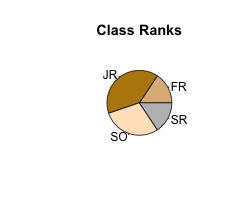
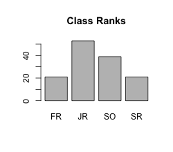
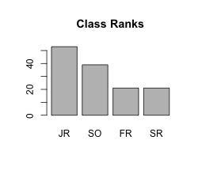

```{r,results='asis',echo=FALSE}
if(params$key==TRUE){
  if(params$plinks==TRUE) cat("* [Word Document](",paste(params$keyname,"docx",sep="."),")\n")
  if(params$plinks==TRUE) cat("* [PDF Document](",paste(params$keyname,"pdf",sep="."),")\n")
  cat("<!--")
  cat("\n")
} 
if(params$key!=TRUE){
  if(params$plinks==TRUE) cat("* [Word Document](",paste(params$docname,"docx",sep="."),")\n")
  if(params$plinks==TRUE) cat("* [PDF Document](",paste(params$docname,"pdf",sep="."),")\n")
  cat("\n")
}
```


```{r,echo=FALSE,warning=FALSE,message=FALSE}
library(ggplot2)
library(ggthemes)
library(pander)
panderOptions('keep.line.breaks',TRUE)
source("../scripts/ggQQline.R")
source("../scripts/221_Interactive_Functions.R")
```

**Instructions:  You are encouraged to collaborate with other students on the homework, but it is important that you do your own work.  Before working with someone else on the assignment, you should attempt each problem on your own.**

1. In your own words, explain the difference between a pie chart and a histogram.

```{r,echo=FALSE}
SurveyData = read.csv(file = "https://raw.githubusercontent.com/byuistats/data/master/SurveyData/SurveyData.csv",stringsAsFactors = FALSE, header = TRUE)

rankTable = table(SurveyData$Class.Rank) #use this for pie chart
rankTableSort = sort(rankTable,decreasing = TRUE) # use this for pareto chart
rankColors = c("burlywood","darkgoldenrod","bisque","gray")

truePfrac1 = "$p=\\frac{1}{10}$"
trueP1 = .10
n1 = 10/min(trueP1,1-trueP1)

```


Demographic data of Brother Johnson's statistics students were collected at the beginning of one semester. Open the data file [Class Survey Data](https://byuistats.github.io/BYUI_M221_Book/Data/ClassSurvey.xlsx). Use this information to answer questions 2 through 4.

2. Make and attach a pie chart showing the class rank of all Brother Johnson's students.

3. Make and attach a bar chart of the class rank of all students in Brother Johnson's Class. 

4. Make and attach a Pareto chart of the class rank of all students in Brother Johnson's Class. 

5. Under what conditions will the sample proportion $\hat{p}$ be approximately normal?

6. If `r truePfrac1`, what is the smallest value of n that satisfies the requirements?

```{r,echo=FALSE}
trueP2 = 52.8
truePdec2 = trueP2/100
n2 = 1000

phat2 = 50
phat2dec = phat2/100

Ncondition2_1 = n2 * truePdec2
Ncondition2_2 = n2 * (1 - truePdec2)

reqMet2 = ConditionsMetPropHyp(Ncondition2_1,Ncondition2_2)

sd2 = sdProportion(truePdec2,n2)
z2 = zProportion(phat2dec,truePdec2,n2)
p2 = pnorm(z2,lower.tail = TRUE)
```


Political candidates frequently conduct polls to assess what proportion of likely voters support them. Of course, until the ballots are counted, no one knows what the true proportion of voters who will support a given candidate is. Suppose you are campaigning for a particular candidate for the Senate.  Campaign headquarters decided to conduct a poll of `r n2` likely voters a few days before the election.  At that time, it is unknown to you, but your candidate will win with $p = `r trueP2`$% of the vote. This is the true value that will not be known until Election Day. Use this information to answer questions 7 through 10.

7. Verify that $\hat{p}$ will be approximately normally distributed.

8. Describe the sampling distribution of the sample proportion, $\hat{p}$ which will be observed in the poll. Be sure to state the distribution, the mean, and the standard deviation. 
9. You want to know the probability that the poll results will show that your candidate will get less than `r phat2`% of the vote. What z-score will be used?

10. What is the probability that the poll results will show that your candidate will get less than `r phat2`% of the vote?

```{r,echo=FALSE}
n3 = 4040
x3 = 2048

truePdec3 = .50

phat3_1 = x3/n3
phat3_2 = 1 -phat3_1

Ncondition3_1 = n3 * truePdec3
Ncondition3_2 = n3 * (1 - truePdec3)

reqMet3 = ConditionsMetPropHyp(Ncondition3_1,Ncondition3_2)

sd3 = sdProportion(truePdec3,n3)

#The historical files have incorrect answers for these as well. Again, I double checked 3 ways.
z3_1 = zProportion(phat3_1,truePdec3,n3)
z3_2 = zProportion(phat3_2,truePdec3,n3)
p3 = pnorm(z3_1,lower.tail = FALSE) + pnorm(z3_2, lower.tail = TRUE)
```


A coin that was assumed fair was tossed 4,040 times and observed heads on 2,048 tosses.  Use this information to answer questions 11 through 13.

11. Verify that $\hat{p}$ will be approximately normally distributed.

12. Describe the sampling distribution of the sample proportion $\hat{p}$. Be sure to state the distribution, the mean, and the standard deviation. 

13. Assuming the coin is fair, what is the probability that $\hat{p}$ will be less than `r round(phat3_2,3)` or greater than `r round(phat3_1,3)`?  (Note that $\hat{p}$ = `r x3`/`r n3` = `r round(phat3_1,3)` and 1 - $\hat{p}$ = `r round(phat3_2,3)`). 
  
```{r,include=FALSE}
#pie chart for question 2
png(filename = "../images/L16_Home_Q02_pie.png",width = 250,height=220)
pie_q02 = pie(rankTable,col = rankColors,main = "Class Ranks")
dev.off()

#Bar chart for question 3
png(filename = "../images/L16_Home_Q03_bar.png",width = 250,height=220)
bar_q03 = barplot(rankTable,main = "Class Ranks")
dev.off()

#pareto chart for question 4

png(filename = "../images/L16_Home_Q04_pareto.png",width = 250,height=220)
bar_q03 = barplot(rankTableSort, main = "Class Ranks")
dev.off()
```

  
```{r,include=FALSE}
if(params$key==TRUE){

  Solution01 = data.frame(Part = "-",Solution="A pie chart is used for categorical data. Each slice represents a part of a whole. A histogram, on the other hand, is used for quantitative data. It is a visual representation of the spread of a set of data.")
  
  Solution02 = data.frame(Part = "-",Solution = "")
  
  Solution03 = data.frame(Part = "-",Solution = "")
  
  Solution04 = data.frame(Part = "-",Solution = "")
  
  Solution05 = data.frame(Part = "-",Solution = "The sample proportion $\\hat{p}$ will be approximately normal when $n$ is large. How do we know if $n$ is large? We will conclude that $n$ is large when $np \\geq 10$ and $n(1 - p) \\geq 10$")
  
  Solution06 = data.frame(Part = "-",Solution = paste("n = ",n1,sep = ""))
  
  Solution07 = data.frame(Part = "-",Solution = paste("The sample proportion $\\hat{p}$ will be approximately normal when: \\\n
$np \\geq 10$ and $n(1 - p) \\geq 10$ \\\n
$",n2,"(",truePdec2,") = ",Ncondition2_1," \\geq 10$ and $",n2,"(1-",truePdec2,") = ",Ncondition2_2," \\geq 10$ \\\n ",reqMet2,sep = ""))
  
  Solution08 = data.frame(Part = "-",Solution = paste("The sampling distribution of $\\hat{p}$ is approximately normal with mean $p = ",truePdec2,"$ and $\\text{standard deviation of } ",round(sd2,3),"$.",sep=""))
  
  Solution09 = data.frame(Part = "-",Solution = paste("$z = ",round(z2,3),"$",sep = ""))
  
  Solution10 = data.frame(Part = "-", Solution = paste("$P(Z=",round(z2,3),") = ",round(p2,3),"$",sep=""))
  
  Solution11 = data.frame(Part = "-",Solution = paste("The sample proportion $\\hat{p}$ will be approximately normal when: \\\n
$np \\geq 10$ and $n(1 - p) \\geq 10$ \\\n
$",n3,"(",truePdec3,") = ",Ncondition3_1," \\geq 10$ and $",n3,"(1-",truePdec3,") = ",Ncondition3_2," \\geq 10$ \\\n ",reqMet3,sep = ""))
  
  Solution12 = data.frame(Part = "-",Solution = paste("The sampling distribution of $\\hat{p}$ is approximately normal with mean $p = ",truePdec3,"$ and $\\text{standard deviation of } ",round(sd3,3),"$.",sep=""))
  
  Solution13 = data.frame(Part = "-",Solution = paste("$P(Z=",round(z3_1,3)," \\text{ or } Z=",round(z3_2,3),") = ",round(p3,3),"$",sep=""))
  
} # end params == TRUE.  We use this so it doesn't have to run for non answer key path.
```


```{r,echo=FALSE,results='asis'}
if(params$key==TRUE){
  cat("-->")
   cat("\n\n## Solutions\n\n")
      cat("\n\n **Please note that the steps show rounded numbers, but that the final answers to the problems are calculated without rounding.**")
}
```


```{r,echo=FALSE,results='asis'}
if(params$key==TRUE){

    all_solutions = sort(ls(pattern="Solution"))
    key_list = NULL
    for (i in 1:length(all_solutions)){
      temp = get(all_solutions[i])
      temp$Solution = as.character(temp$Solution)
      key_list = rbind(key_list,data.frame(Problem=i,temp))
    }
    
      pander(key_list,split.cell = 80, split.table = Inf,justify = c( 'center', 'left',"left"))

} # end params == TRUE.  We use this so it doesn't have to run for non answer key path.
    
```