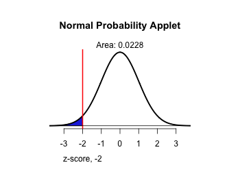
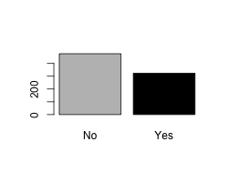

```{r,results='asis',echo=FALSE}
if(params$key==TRUE){
  if(params$plinks==TRUE) cat("* [Word Document](",paste(params$keyname,"docx",sep="."),")\n")
  if(params$plinks==TRUE) cat("* [PDF Document](",paste(params$keyname,"pdf",sep="."),")\n")
  cat("<!--")
  cat("\n")
} 
if(params$key!=TRUE){
  if(params$plinks==TRUE) cat("* [Word Document](",paste(params$docname,"docx",sep="."),")\n")
  if(params$plinks==TRUE) cat("* [PDF Document](",paste(params$docname,"pdf",sep="."),")\n")
  cat("\n")
}
```


```{r,include=FALSE}
library(ggplot2)
library(ggthemes)
library(pander)
panderOptions('keep.line.breaks',TRUE)
source("../scripts/ggQQline.R")
source("../scripts/normTail.R")
source("../scripts/221_Interactive_Functions.R")
```

**Instructions:  You are encouraged to collaborate with other students on the homework, but it is important that you do your own work.  Before working with someone else on the assignment, you should attempt each problem on your own.**

```{r,include=FALSE}
p1 = 20
p1dec = p1/100
n1 = 100
x1 = 12
phat1 = x1/n1

con1_1conf = n1 * phat1
con1_2conf = n1 * (1 - phat1)

reqMet1conf = ConditionsMetPropConf(con1_1conf,con1_2conf)

confLevel1_q3 = 90
zStar1 = zStar(confLevel1_q3)
  
LB1 = phat1 - marginErrorProp(zStar1,phat1,n1)
UB1 = phat1 + marginErrorProp(zStar1,phat1,n1)

con1_1hyp = n1 * p1dec
con1_2hyp = n1 * (1-p1dec)

reqMet1hyp = ConditionsMetPropHyp(con1_1hyp,con1_2hyp)

confLevel1 = 95
alpha1 = 1 - (confLevel1/100)

zScore1 = zProportion(phat1,p1dec,n1)
pValue1 = pnorm(zScore1,lower.tail = TRUE)

png(filename = "../images/L17_Homework_Q09_normalDistributionApplet.png",width = 350,height=260)
normTail(L=round(zScore1,3),lwd=2.5,df=700000)
dev.off()


```


Suppose there is a large can of mixed nuts available for purchase at the store.  The label states that `r p1`% of the nuts are peanuts.  You purchase the can and pull out a sample of $n = `r n1`$ nuts and count $x = `r x1`$ peanuts. Use this information to answer questions 1 through 11.

1. Are the requirements met to construct a `r confLevel1`% confidence interval for the true proportion of peanuts in the can?

2. Find $\hat{p}$, the point estimate of the proportion of peanuts in the can.

3. Construct and interpret a `r confLevel1_q3`% confidence interval for the true proportion of peanuts in the can.

You suspect that the true proportion of peanuts in the can is less than `r p1`%. Conduct a hypothesis test to test your theory. Use a level of significance of $\alpha = `r alpha1`$.

4. Are the requirements met to conduct a hypothesis test? 

5. Find $\hat{p}$, the point estimate of the proportion of peanuts in the can.

6. State the correct null and alternative hypotheses.

7. Give the test statistic and its value.

8. Calculate the P-value based on the test statistic.

9. Label the test statistic and shade the P-value on a sampling distribution curve. **Note: You can either sketch the distribution curve and scan in your document or use the snipping tool to paste a picture of the distribution curve here.  Click [here](http://statistics.byuimath.com/index.php?title=Help:Snipping_Tool) for instructions on how to use the snipping tool.**

10. What decision do you make based on the P-value and the level of significance ($\alpha$)? 
11. State your conclusion in an English sentence.

```{r,include=FALSE}
options(scipen=15)
n2 = 185067
x2 = 4399
phat2 = x2/n2

confLevel2 = 95
zStar2 = zStar(confLevel2)

LB2 = phat2 - marginErrorProp(zStar2,phat2,n2)
UB2 = phat2 + marginErrorProp(zStar2,phat2,n2)
```


As of 1 Nov 2009, there have been `r formatC(n2,big.mark=",",format="fg")` confirmed cases of the Swine Flu (H1N1) in the Americas. Out of these patients, a total of `r x2` have died from the disease.

12. Construct and interpret a `r confLevel2`% confidence interval for the true proportion of people who contract this disease that will die.

```{r,include=FALSE}
n3 = 442
x3 = 262
phat3 = x3/n3

confLevel3 = 95
zStar3 = zStar(confLevel3)

LB3 = phat3 - marginErrorProp(zStar3,phat3,n3)
UB3 = phat3 + marginErrorProp(zStar3,phat3,n3)
```

Avian Influenza A (H5N1), commonly called the bird flu, is a very deadly strain related to the H1N1 virus.  As of 22 September 2009, there have been `r n3` laboratory-confirmed cases of this virus in humans world-wide. Of these, `r x3` have resulted in death.

13. Construct and interpret a `r confLevel3`% confidence interval for the true proportion of people who would die if infected with this disease. 

14. Compare the results from questions 12 and 13. Which of these viruses is more deadly? Justify your answer.

```{r,include=FALSE}
marginErrorDesired = 4
MDesiredDec = marginErrorDesired/100
confLevel4 = 90
zStar4 = zStar(confLevel4)

necessarySample_q15 = ceiling(necessarySamplePropPrior(zStar4,MDesiredDec))

priorP = 73
priorPdec = priorP / 100

necessarySample_q16 = ceiling(necessarySamplePropPrior(zStar4,MDesiredDec,priorPdec))
```


The BYU-Idaho Health Center is planning a study to determine the proportion of BYU-Idaho students who cover their mouth and nose when they sneeze or cough. Use this information to answer questions 15 and 16.

15. Assume that no prior information is known. How many people would you have to survey to obtain a margin of error of `r marginErrorDesired`% with `r confLevel4`% confidence?

16. Suppose for the same question that there had been a prior study done. That study found that `r priorP`% of those surveyed did cover their mouth and nose. Use the estimate $p^*=`r priorPdec`$ to determine the number of people would you have to survey to obtain a margin of error of `r marginErrorDesired`% with `r confLevel4`% confidence?

```{r,include=FALSE}
p5 = 43
p5dec = p5/100
n5 = 800
x5 = 324
phat5 = x5/n5

confLevel5 = 95
alpha5 = 1- (confLevel5/100)

con5_1hyp = n5 * p5dec
con5_2hyp = n5 * (1-p5dec)

reqMet5hyp = ConditionsMetPropHyp(con5_1hyp,con5_2hyp)

zScore5 = zProportion(phat5,p5dec,n5)
pValue5 = pnorm(zScore5,lower.tail = TRUE) * 2
```


First Data Corp. records indicate that in 2005 `r p5`% of adult email users received a "phishing" email. A phishing email replicates an authentic site for the purpose of stealing personal information such as account numbers and passwords.  Suppose a random sample of `r n5` adults is surveyed on whether they received any phishing emails in 2012 and `r x5` respond that they did.  Conduct a hypothesis test to see if this indicates that the true proportion of adults who received phishing emails in 2012 was different than `r p5`%. Use a level of significance of $\alpha = `r alpha5`$.  Use this information to answer questions 17 through 24.

17. Illustrate the phishing email data using a pie chart and a bar chart.  For a refresher on how to do this, see [Bro. Cromar's video](https://www.youtube.com/watch?v=L__aMSnhIqw&list=PLaZryQtbPQC_gGbFY32myRpvpw_kuPUuB&index=3) for SPSS or [this document](http://statistics.byuimath.com/images/4/43/Pie_Charts_and_Bar_Charts.docx) for Excel.

18. Are the requirements met to conduct a hypothesis test? 

19. Find $\hat{p}$, the traditional estimator of the true proportion of adults who received phishing emails.

20. State the correct null and alternative hypotheses.

21. Give the test statistic and its value.

22. Calculate the P-value based on the test statistic.

23. What decision do you make based on the P-value and the level of significance ($\alpha$)? 
24. State your conclusion in an English sentence.

```{r,include=FALSE}
#this will make the pie chart for question 17
phishing = c(x5,n5-x5)
lbls = c("yes","no")
colors = c("grey","black")
png(filename = "../images/L17_Home_Q17_pie.png",width = 200,height=200)
pie(phishing, labels = lbls,col = colors)
dev.off()

#this will make the bar chart in question 17
yes = x5
no = n5 - x5
phishing = data.frame(Were.Cheated = c(1:n5))
phishing[1:yes,] = "Yes"
phishing[yes+1:no,] = "No"

png(filename = "../images/L17_Home_Q17_bar.png",width = 250,height=200)
barplot(table(phishing),col = colors)
dev.off()
```


```{r,echo=FALSE}
if(params$key==TRUE){

Solution01 = data.frame(Part = "-",Solution = paste("$n \\hat{p} \\geq 10$ \\\n $n(1 - \\hat{p}) \\geq 10$ \\\n $",n1,"(",phat1,") = ",con1_1conf," \\geq 10$ \\\n $",n1,"(1 - ",phat1,") = ",con1_2conf," \\geq 10$ \\\n",reqMet1conf,sep = ""))

Solution02 = data.frame(Part = "-",Solution = paste("$\\hat{p} = ",round(phat1,3),"$",sep = ""))

Solution03 = data.frame(Part = "-",Solution = paste("(",round(LB1,3),", ",round(UB1,3),") We are ",confLevel1_q3,"% confident that the true proportion of peanuts in the can is between ",round(LB1,3) * 100,"% and ",round(UB1,3) * 100,"%.",sep = ""))

Solution04 = data.frame(Part = "-",Solution = paste("$n p \\geq 10$ \\\n $n(1 - p) \\geq 10$ \\\n $",n1,"(",p1dec,") = ",con1_1hyp," \\geq 10$ \\\n $",n1,"(1 - ",p1dec,") = ",con1_2hyp," \\geq 10$ \\\n",reqMet1hyp,sep = ""))

Solution05 = data.frame(Part = "-",Solution = paste("$\\hat{p} = ",round(phat1,3),"$",sep = ""))

Solution06 = data.frame(Part = "-",Solution = paste("$H_0: p = ",p1dec,"$ \\\n $H_a: p < ",p1dec,"$",sep = ""))

Solution07 = data.frame(Part = "-",Solution = paste("$z = ",round(zScore1,3),"$",sep = ""))

Solution08 = data.frame(Part = "-",Solution = paste("$P-value = ",round(pValue1,4),"$",sep = ""))

Solution09 = data.frame(Part = "-",Solution = "")

Solution10 = data.frame(Part = "-",Solution = paste(failOrNot(pValue1,alpha1)))

Solution11 = data.frame(Part = "-",Solution = paste("There is ",sufficientOrNot(failOrNot(pValue1,alpha1))," to suggest that the proportion of peanuts in the can is less than ",p1,"%.",sep = ""))

Solution12 = data.frame(Part = "-",Solution = paste("(",round(LB2,3),", ",round(UB2,3),") We are ",confLevel2,"% confident that the true proportion of the population who die after contracting H1N1 is between ",round(LB2,3) * 100,"% and ",round(UB2,3) * 100,"%.",sep = ""))

Solution13 = data.frame(Part = "-",Solution = paste("(",round(LB3,3),", ",round(UB3,3),") We are ",confLevel3,"% confident that the true proportion of the population who die after contracting H5N1 is between ",round(LB3,3) * 100,"% and ",round(UB3,3) * 100,"%.",sep = ""))

Solution14 = data.frame(Part = "-",Solution = "The bird flu (H5N1) is by far more deadly! More than half of those who contract the bird flu will die, compared to only 2 to 3% of those who are infected with the swine flu. Fortunately for us, the bird flu is currently onlypassed to humans through contact with infected birds. Epidemiologists are concerned about a global pandemic of this disease, which would almost surely happen if the virus mutates to allow human-to-human transmission.")

Solution15 = data.frame(Part ="-",Solution = paste("$n = ",necessarySample_q15," \\text{ people}$"))

Solution16 = data.frame(Part ="-",Solution = paste("$n = ",necessarySample_q16," \\text{ people}$"))

Solution17 = data.frame(Part="-",Solution = " ")

Solution18 = data.frame(Part = "-",Solution = paste("$n p \\geq 10$ \\\n $n(1 - p) \\geq 10$ \\\n $",n5,"(",p5dec,") = ",con5_1hyp," \\geq 10$ \\\n $",n5,"(1 - ",p5dec,") = ",con5_2hyp," \\geq 10$ \\\n",reqMet5hyp,sep = ""))

Solution19 = data.frame(Part = "-",Solution = paste("$\\hat{p} = ",round(phat5,3),"$",sep = ""))

Solution20 = data.frame(Part = "-",Solution = paste("$H_0: p = ",p5dec,"$ \\\n $H_a: p \\neq ",p5dec,"$",sep = ""))

Solution21 = data.frame(Part = "-",Solution = paste("$z = ",round(zScore5,3),"$",sep = ""))

Solution22 = data.frame(Part = "-",Solution = paste("$P-value = ",round(pValue5,4),"$",sep = ""))

Solution23 = data.frame(Part = "-",Solution = paste(failOrNot(pValue5,alpha5)))

Solution24 = data.frame(Part = "-",Solution = paste("There is ",sufficientOrNot(failOrNot(pValue5,alpha5))," to suggest that the proportion of adults who received a phishing email in 2012 is different than ",p5,"%.",sep = ""))

} # end params == TRUE.  We use this so it doesn't have to run for non answer key path.
```


```{r,echo=FALSE,results='asis'}
if(params$key==TRUE){
  cat("-->")
   cat("\n\n## Solutions\n\n")
      cat("\n\n **Please note that the steps show rounded numbers, but that the final answers to the problems are calculated without rounding.**")
}
```


```{r,echo=FALSE,results='asis'}
if(params$key==TRUE){

    all_solutions = sort(ls(pattern="Solution"))
    key_list = NULL
    for (i in 1:length(all_solutions)){
      temp = get(all_solutions[i])
      temp$Solution = as.character(temp$Solution)
      key_list = rbind(key_list,data.frame(Problem=i,temp))
    }
    
      pander(key_list,split.cell = 80, split.table = Inf,justify = c( 'center', 'left',"left"))

} # end params == TRUE.  We use this so it doesn't have to run for non answer key path.
    
```


