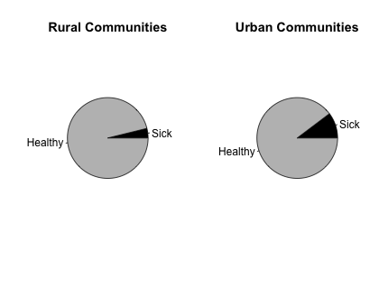
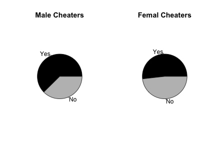
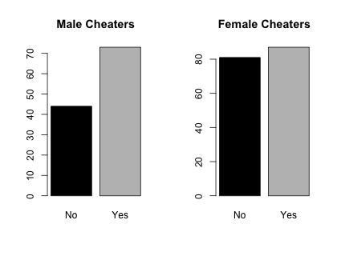
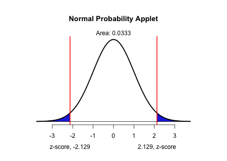

```{r,results='asis',echo=FALSE}
if(params$key==TRUE){
  if(params$plinks==TRUE) cat("* [Word Document](",paste(params$keyname,"docx",sep="."),")\n")
  if(params$plinks==TRUE) cat("* [PDF Document](",paste(params$keyname,"pdf",sep="."),")\n")
  cat("<!--")
  cat("\n")
} 
if(params$key!=TRUE){
  if(params$plinks==TRUE) cat("* [Word Document](",paste(params$docname,"docx",sep="."),")\n")
  if(params$plinks==TRUE) cat("* [PDF Document](",paste(params$docname,"pdf",sep="."),")\n")
  cat("\n")
}
```

```{r,include=FALSE,warning=FALSE,message=FALSE}
library(ggplot2)
library(ggthemes)
library(pander)
panderOptions('keep.line.breaks',TRUE)
source("../scripts/ggQQline.R")
source("../scripts/normTail.R")
source("../scripts/221_Interactive_Functions.R")
```

**Instructions:  You are encouraged to collaborate with other students on the homework, but it is important that you do your own work.  Before working with someone else on the assignment, you should attempt each problem on your own.**

```{r, include=FALSE}
n1rural = 261
x1rural = 10
phat1rural = x1rural/n1rural

n1city = 1614
x1city = 166
phat1city = x1city/n1city

confLevel1 = 95
alpha1 = 1 - (confLevel1/100)
zStar1 = zStar(confLevel1)

condition1_1rural = n1rural * phat1rural
condition1_2rural = n1rural * (1-phat1rural)

condition1_1city = n1city * phat1city
condition1_2city = n1city * (1 - phat1city)

LB1 = confIntTwoProp(phat1rural,phat1city,n1rural,n1city,zStar1)[[1]]
UB1 = confIntTwoProp(phat1rural,phat1city,n1rural,n1city,zStar1)[[2]]

reqMet1 = ConditionsMetPropConf(min(c(condition1_1rural,condition1_2rural)),min(c(condition1_1city,condition1_2city)))

#reqMet1 = ConditionsMetTwoProp(condition1_1rural,condition1_2rural,condition1_1city,condition1_2city)

```


A study was conducted in Austria to determine if the likelihood that a child will have hay fever (seasonal allergies) is different for children living in rural communities compared to children who live in a city. The researchers surveyed `r n1rural` children who lived in rural communities and found that `r x1rural` suffered from hay fever. Among the `r n1city` children who lived in the city, `r x1city` reported that they had hay fever. Use this information to answer questions 1 through 4.

1. Create side-by-side pie charts to illustrate this data.  


2. Verify that the requirements are met to create a confidence interval.


3. Construct and interpret a `r confLevel1`% confidence interval for the difference in the proportions of city children with hay fever and rural children with hay fever.

4. Is zero contained in the confidence interval? What does this mean?

```{r,include=FALSE}
n2G1 = 200000
x2G1 = 33
phat2G1 = x2G1/n2G1

n2G2 = 200000
x2G2 = 115
phat2G2 = x2G2/n2G2

n2Total = n2G1 + n2G2

confLevel2 = 95
alpha2 = 1 - (confLevel2/100)
zStar2 = zStar(confLevel1)

condition2_1G1 = n2G1 * phat2G1
condition2_2G1 = n2G1 * (1 - phat2G1)

condition2_1G2 = n2G2 * phat2G2
condition2_2G2 = n2G2 * (1 - phat2G2)

reqMet2 = ConditionsMetPropConf(min(c(condition2_1G1,condition2_2G1)),min(c(condition2_1G2,condition2_2G2)))
#reqMet2 = ConditionsMetTwoProp(condition2_1G1,condition2_2G1,condition2_1G2,condition2_2G2)

LB2 = confIntTwoProp(phat2G1,phat2G2,n2G1,n2G2,zStar2)[[1]]
UB2 = confIntTwoProp(phat2G1,phat2G2,n2G1,n2G2,zStar2)[[2]]
```


On April 12, 1955, Dr. Jonas Salk released the results of clinical trials for his vaccine to prevent polio.  In these clinical trials, `r formatC(n2Total,big.mark=",",format="fg")` children were randomly divided into two groups.  The subjects in Group 1 were given the vaccine, while the subjects in Group 2 were given the placebo.  Of the `r formatC(n2G1,big.mark=",",format="fg")` children in Group 1 (the vaccine group), `r x2G1` children developed polio.  Of the `r formatC(n2G2,big.mark=",",format="fg")` children in Group 2 (the placebo group), `r x2G2` children developed polio. Use this information to answer questions 5 and 6. 

5. Verify that the requirements are met to create a confidence interval.


6. Construct and interpret a `r confLevel2`% confidence interval for the difference in the proportions of children who received the vaccine and contracted polio and children who received the placebo and contracted polio.  Please round your answers to five decimal places.  

```{r,include=FALSE}
n3Men = 117
x3Men = 73
phat3Men = x3Men/n3Men

n3Women = 168
x3Women = 87
phat3Women = x3Women/n3Women

phat3 = (x3Men + x3Women)/(n3Men + n3Women)

confLevel3 = 95
alpha3 = 1 - (confLevel3/100)

condition3_1Men = n3Men * phat3Men
condition3_2Men = n3Men * (1 - phat3Men)

condition3_1Women = n3Women * phat3Women
condition3_2Women = n3Women * (1 - phat3Women)

reqMet3 = ConditionsMetPropConf(min(c(condition3_1Men,condition3_2Men)),min(c(condition3_1Women,condition3_2Women)))
#reqMet3 = ConditionsMetTwoProp(condition3_1Men,condition3_2Men,condition3_1Women,condition3_2Women)

zScore3 = zTwoProp(phat3,phat3Men,phat3Women,n3Men,n3Women)
pValue3 = pnorm(zScore3, lower.tail = FALSE)

pValue3_q16 = pValue3 * 2
```


Historically, studies have shown that men are more likely to cheat in school than women. A study was conducted at four public universities to determine the accuracy of this claim. In an anonymous survey, a group of students was asked if they had ever cheated in college. Among the men, `r x3Men` out of `r n3Men` reported that they had cheated at least once in college. Among the women, `r x3Women` out of `r n3Women` females reported that they had cheated at least once. Use this information to test the hypothesis that men are more likely to cheat in college than women. Use a level of significance of $\alpha=`r alpha3`$.  For this hypothesis test, let group 1 represent men and group 2 represent women. Use this information to answer questions 7 through 15.

7. Create a bar chart or pie chart to illustrate this data. 

8. Verify that the requirements are met to perform a hypothesis test. 

9. State the null and alternative hypotheses.

10. Give the value of $\hat{p}_1$ $\hat{p}_2$.
 
11. Give the test statistic and its value.

12. Calculate the P-value based on the test statistic.

13. Label the test statistic and shade the P-value on a sampling distribution curve.

14. What decision do you make based on the P-value and the level of significance ($\alpha$)? 

15. State your conclusion in an English sentence.

16. How would your answer change if the hypothesis test was a 2-sided test?

```{r,include=FALSE}
x4Clarinex = 50
n4Clarinex = 1655
phat4Clarinex = x4Clarinex/n4Clarinex

x4Placebo = 31
n4Placebo = 1652
phat4Placebo = x4Placebo/n4Placebo

phat4 = (x4Clarinex + x4Placebo)/(n4Clarinex+n4Placebo)

confLevel4 = 95
alpha4 = 1 - (confLevel4/100)

condition4_1Clarinex = n4Clarinex * phat4Clarinex
condition4_2Clarinex = n4Clarinex * (1 - phat4Clarinex)

condition4_1Placebo = n4Placebo * phat4Placebo
condition4_2Placebo = n4Placebo * (1 - phat4Placebo)

zScore4 = zTwoProp(phat4,phat4Clarinex,phat4Placebo,n4Clarinex,n4Placebo)
pValue4 = pnorm(zScore4, lower.tail = FALSE)*2
```


In clinical trials of the allergy medicine Clarinex, it was reported that `r x4Clarinex` out of `r n4Clarinex` individuals in the Clarinex group and `r x4Placebo` out of `r n4Placebo` individuals in the placebo group experienced dry mouth as a side effect of their respective treatments.  Is there a difference in the proportions of those who had dry mouth between the two groups?  Use a level of significance of $\alpha = `r alpha4`$. For this hypothesis test, let group 1 represent the subjects on Clarinex and group 2 represent the subjects on placebo. Use this information to answer questions 16 through 23.

17. Verify that the requirements are met to perform a hypothesis test. 

18. State the null and alternative hypotheses.

19. Give the value of $\hat{p}_1$ $\hat{p}_2$.

20. Give the test statistic and its value.

21. Calculate the P-value based on the test statistic.

22. Label the test statistic and shade the P-value on a sampling distribution curve.

23. What decision do you make based on the P-value and the level of significance ($\alpha$)? 

24. State your conclusion in an English sentence.

```{r,include=FALSE}

#This is the side by side pie chart for Question 1
hayfeverRural = c(x1rural,n1rural-x1rural)
lblsRural = c("Sick","Healthy")
hayfeverCity = c(x1city,n1city-x1city)
lbls = c("Sick","Healthy")
colors = c("black","grey")

png(filename = "../images/L18_homework_Q1_pie.png",width = 420,height = 320)
par(mfrow = c(1,2))
pie(hayfeverRural, labels = lbls,col = colors,main="Rural Communities")
pie(hayfeverCity, labels = lbls,col = colors,main="Urban Communities")
dev.off()
#----------------------------------------------------------
#These are the bar charts for question 7
cheaterMen = x3Men
notCheaterMen = n3Men - x3Men

cheaterWomen = x3Women
notCheaterWomen = n3Women - x3Women

cheaterM = data.frame(Cheat = c(1:n3Men))
cheaterM[1:cheaterMen,] = "Yes"
cheaterM[cheaterMen+1:notCheaterMen,]= "No"

cheaterW = data.frame(Cheat = c(1:n3Women))
cheaterW[1:cheaterWomen,] = "Yes"
cheaterW[cheaterWomen+1:notCheaterWomen,]= "No"

png(filename = "../images/L18_homework_Q7_bar.png",width = 420,height=320)
par(mfrow = c(1,2))
barplot(table(cheaterM),col = colors,main = "Male Cheaters")
barplot(table(cheaterW),col = colors,main = "Female Cheaters")
dev.off()
#--------------------------------------------------------------
#Pie charts in question 7 
CheatersMen = c(x3Men,n3Men-x3Men)
CheatersWomen = c(x3Women,n3Women-x3Women)
lbls = c("Yes","No")
colors = c("black","grey")

png(filename = "../images/L18_homework_Q7_pie.png",width = 420,height = 320)
par(mfrow = c(1,2))
pie(CheatersMen, labels = lbls,col = colors,main="Male Cheaters")
pie(CheatersWomen, labels = lbls,col = colors,main="Femal Cheaters")
dev.off()
#-------------------------------------------------------------
#Norm dist for question 13
png(filename = "../images/L18_Homework_Q13_normalDistributionApplet.png",width = 450,height=320)
normTail(U=round(zScore3,3),lwd=2.5,df=700000)
dev.off()
#-------------------------------------------------------------
#Norm dist for question 22
png(filename = "../images/L18_Homework_Q22_normalDistributionApplet.png",width = 450,height=320)
normTail(L=round(zScore4 * -1,3),U=round(zScore4,3),lwd=2.5,df=700000)
dev.off()
```


```{r,include=FALSE}
if(params$key==TRUE){
#solutions
options(scipen = 999)
  
Solution01 = data.frame(Part = "-",Solution = "")

Solution02 = data.frame(Part = "-",Solution = paste("$n_1 \\times \\hat{p}_1 \\geq 10 \\text{ and } n_1 \\times (1 - \\hat{p}_1) \\geq 10$ \\\n $",n1rural,"\\times(",round(phat1rural,3),") = ",condition1_1rural," \\geq 10 \\text{ and } ",n1rural,"\\times(1 - ",round(phat1rural,3),") = ",condition1_2rural,"\\geq 10$ \\\n \\\n $n_2 \\times \\hat{p}_2 \\geq 10 \\text{ and } n_2 \\times (1 - \\hat{p}_2) \\geq 10$ \\\n $",n1city,"\\times(",round(phat1city,3),") = ",condition1_1city," \\geq 10 \\text{ and } ",n1city,"\\times(1 - ",round(phat1city,3),") = ",condition1_2city,"\\geq 10$ \\\n \\\n",reqMet1,sep = ""))
  
Solution03 = data.frame(Part="-",Solution = paste("(",round(LB1,3),", ",round(UB1,3),") We are ",confLevel1,"% confident that the true difference of the proportions of city children with hay fever and rural children with hay fever is between ",round(LB1,3)," and ",round(UB1,3),". \\\n \\\n If you swapped the definition of groups 1 and 2, then you would get the same values with opposite signs: (",round(UB1,3) * -1,", ",round(LB1,3) * -1,"). This is also correct."))

Solution04 = data.frame(Part = "-",Solution = "No. This means that it is plausible that the likelihood of a child contracting hay fever is different in the city than in rural areas.")

Solution05 = data.frame(Part = "-",Solution = paste("$n_1 \\times \\hat{p}_1 \\geq 10 \\text{ and } n_1 \\times (1 - \\hat{p}_1) \\geq 10$ \\\n
$",formatC(n2G1,big.mark=",",format="fg"),"\\times(",round(phat2G1,4),") = ",condition2_1G1," \\geq 10 \\text{ and } ",formatC(n2G1,big.mark=",",format="fg"),"\\times(1 - ",round(phat2G1,4),") = ",formatC(condition2_2G1,big.mark=",",format="fg"),"\\geq 10$ \\\n \\\n $n_2 \\times \\hat{p}_2 \\geq 10 \\text{ and } n_2 \\times (1 - \\hat{p}_2) \\geq 10$ \\\n $",formatC(n2G2,big.mark=",",format="fg"),"\\times(",round(phat2G2,4),") = ",condition2_1G2," \\geq 10 \\text{ and } ",formatC(n2G2,big.mark=",",format="fg"),"\\times(1 - ",round(phat2G2,4),") = ",formatC(condition2_2G2,big.mark=",",format="fg"),"\\geq 10$ \\\n \\\n",reqMet2,sep = ""))

Solution06 = data.frame(Part="-",Solution = paste("(",round(LB2,5),", ",round(UB2,5),") We are ",confLevel2,"% confident that the true difference of the proportions of vaccinated children who developed polio and non-vaccinated children who developed polio is",round(LB2,5)," and ",round(UB2,5),". \\\n \\\n If you swapped the definition of groups 1 and 2, then you would get the same values with opposite signs: (",round(UB2,5) * -1,", ",round(LB2,5) * -1,"). This is also correct."))

Solution07 = data.frame(Part="-",Solution = " \\\n \\\n ")

Solution08 = data.frame(Part = "-",Solution = paste("$n_1 \\times \\hat{p}_1 \\geq 10 \\text{ and } n_1 \\times (1 - \\hat{p}_1) \\geq 10$ \\\n
$",n3Men,"\\times(",round(phat3Men,3),") = ",condition3_1Men," \\geq 10 \\text{ and } ",n3Men,"\\times(1 - ",round(phat3Men,3),") = ",condition3_2Men,"\\geq 10$ \\\n \\\n $n_2 \\times \\hat{p}_2 \\geq 10 \\text{ and } n_2 \\times (1 - \\hat{p}_2) \\geq 10$ \\\n $",n3Women,"\\times(",round(phat3Women,3),") = ",condition3_1Women," \\geq 10 \\text{ and } ",n3Women,"\\times(1 - ",round(phat3Women,3),") = ",condition3_2Women,"\\geq 10$ \\\n \\\n",reqMet3,sep = ""))

Solution09 = data.frame(Part = "-",Solution = "$H_0: p_1 = p_2$ \\\n $H_a: p_1 > p_2$")

Solution10 = data.frame(Part = "-",Solution = paste("$\\hat{p_1} = ",round(phat3Men,3),"$ \\\n $\\hat{p_2} = ",round(phat3Women,3),"$",sep = ""))

Solution11 = data.frame(Part = "-",Solution = paste("$z = ",round(zScore3,3),"$",sep = ""))

Solution12 = data.frame(Part = "-",Solution = paste("$\\text{p-value} = ",round(pValue3,3),"$",sep = ""))

Solution13 = data.frame(Part = "-",Solution = "")

Solution14 = data.frame(Part = "-",Solution = failOrNot(pValue3,alpha3))

Solution15 = data.frame(Part = "-",Solution = paste("There is ",sufficientOrNot(failOrNot(pValue3,alpha3))," evidence to suggest that the proportion of men who cheat in college is greater than the proportion of women who cheat in college."))

Solution16 = data.frame(Part = "-",Solution =paste("The p-value would double and be equal to ",round(pValue3,3)*2,". This p-value is not significant and we would fail to reject the null hypothesis. With a two sided test we would not have sufficient evidence to conclude that there is a difference between the proportion of women and men who cheat in college."))

Solution17 = data.frame(Part = "-",Solution = paste("$n_1 \\times \\hat{p}_1 \\geq 10 \\text{ and } n_1 \\times (1 - \\hat{p}_1) \\geq 10$ \\\n
$",n4Clarinex,"\\times(",round(phat4Clarinex,3),") = ",condition4_1Clarinex," \\geq 10 \\text{ and } ",n4Clarinex,"\\times(1 - ",round(phat4Clarinex,3),") = ",condition4_2Clarinex,"\\geq 10$ \\\n \\\n $n_2 \\times \\hat{p}_2 \\geq 10 \\text{ and } n_2 \\times (1 - \\hat{p}_2) \\geq 10$ \\\n $",n4Placebo,"\\times(",round(phat4Placebo,3),") = ",condition4_1Placebo," \\geq 10 \\text{ and } ",n4Placebo,"\\times(1 - ",round(phat4Placebo,3),") = ",condition4_2Placebo,"\\geq 10$ \\\n \\\n",reqMet3,sep = ""))

Solution18 = data.frame(Part = "-",Solution = "$H_0: p_1 = p_2$ \\\n $H_a: p_1 \\neq p_2$")

Solution19 = data.frame(Part = "-",Solution = paste("$\\hat{p_1} = ",round(phat4Clarinex,3),"$ \\\n $\\hat{p_2} = ",round(phat4Placebo,3),"$",sep = ""))

Solution20 = data.frame(Part = "-",Solution = paste("$z = ",round(zScore4,3),"$",sep = ""))

Solution21 = data.frame(Part = "-",Solution = paste("$\\text{p-value} = ",round(pValue4,3),"$",sep = ""))

Solution22 = data.frame(Part = "-",Solution = "")

Solution23 = data.frame(Part = "-",Solution = failOrNot(pValue4,alpha4))

Solution24 = data.frame(Part = "-",Solution = paste("There is ",sufficientOrNot(failOrNot(pValue4,alpha4))," evidence to suggestthat the proportion of Clarinex subjects with dry mouth is different than the proportion of placebo subjects with dry mouth."))

} # end params == TRUE.  We use this so it doesn't have to run for non answer key path.
```


```{r,echo=FALSE,results='asis'}
if(params$key==TRUE){
  cat("-->")
   cat("\n\n## Solutions\n\n")
      cat("\n\n **Please note that the steps show rounded numbers, but that the final answers to the problems are calculated without rounding.**")
}
```


```{r,echo=FALSE,results='asis'}
if(params$key==TRUE){

    all_solutions = sort(ls(pattern="Solution"))
    key_list = NULL
    for (i in 1:length(all_solutions)){
      temp = get(all_solutions[i])
      temp$Solution = as.character(temp$Solution)
      key_list = rbind(key_list,data.frame(Problem=i,temp))
    }
    
      pander(key_list,split.cell = 80, split.table = Inf,justify = c( 'center', 'left',"left"))
} # end params == TRUE.  We use this so it doesn't have to run for non answer key path.

```


