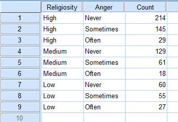
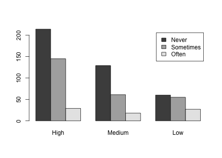
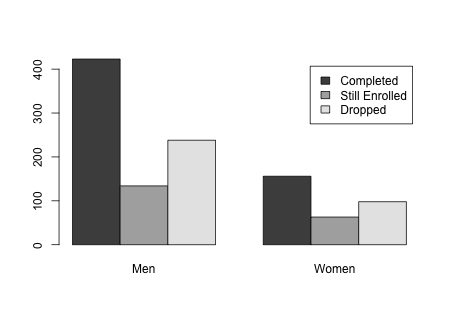

```{r,results='asis',echo=FALSE}
if(params$key==TRUE){
  if(params$plinks==TRUE) cat("* [Word Document](",paste(params$keyname,"docx",sep="."),")\n")
  if(params$plinks==TRUE) cat("* [PDF Document](",paste(params$keyname,"pdf",sep="."),")\n")
  cat("<!--")
  cat("\n")
} 
if(params$key!=TRUE){
  if(params$plinks==TRUE) cat("* [Word Document](",paste(params$docname,"docx",sep="."),")\n")
  if(params$plinks==TRUE) cat("* [PDF Document](",paste(params$docname,"pdf",sep="."),")\n")
  cat("\n")
}
```

###L19: Homework Assignment

```{r,echo=FALSE,message=FALSE,warning=FALSE}
library(ggplot2)
library(ggthemes)
library(pander)
panderOptions('keep.line.breaks',TRUE)
source("../scripts/ggQQline.R")
source("../scripts/normTail.R")
source("../scripts/221_Interactive_Functions.R")
```


**Instructions:  You are encouraged to collaborate with other students on the homework, but it is important that you do your own work.  Before working with someone else on the assignment, you should attempt each problem on your own.**

```{r,include=FALSE}
NeverHigh = 214
NeverMedium = 129
NeverLow = 60

SometimesHigh = 145
SometimesMedium = 61
SometimesLow = 55

OftenHigh = 29
OftenMedium = 18
OftenLow = 27

#I use a matrix here because it works better in the chisq.test
AngerM = cbind(High = c(NeverHigh,SometimesHigh,OftenHigh), Medium = c(NeverMedium,SometimesMedium,OftenMedium), Low = c(NeverLow,SometimesLow,OftenLow))
row.names(AngerM) = c("Never","Sometimes","Often")

results1 = chisq.test(AngerM,correct = FALSE)
reqMet1 = reqMetChi(results1$expected)
chi1 = results1$statistic
df1 = results1$parameter
p1 = results1$p.value

alpha1 = .05
```


A study conducted among college students looked at the influence of religiosity on positive and negative outcomes associated with stress. The analyses are based on 742 college students at a large school in the United States.  The students completed a cross-sectional survey.  The following problem is based on the some of the data collected from the study. One of the questions on the study asked, "In the last month, how often have you been angered because of things that happened outside of your control?"  Using the data below, determine if frequency of anger in the last month is shaped by levels of religiosity. Use a level of significance of $\alpha = `r alpha1`$.


*In the last month, how often have you been angered because of something that happened outside of your control?*

```{r, echo=FALSE, results='asis'}
#this is a data frame because it looks better than a matrix when it is converted into a chart. 
Anger = data.frame(Anger_Frequency=c("Never","Sometimes","Often"),
                  High=c(NeverHigh,SometimesHigh,OftenHigh),
                  Medium=c(NeverMedium,SometimesMedium,OftenMedium),
                  Low=c(NeverLow,SometimesLow,OftenLow))

colnames(Anger) = c("Anger Frequency","High","Medium","Low")

pander(Anger)
```

**Note for 221B and 221C students** - You will need to input your data into SPSS as follows. Make sure to go to "Variable View" (found at the bottom of the screen) and change the width of the Religiosity variable to 6 and the Anger variable to 9 so that all of the letters for each category will be displayed.

```{r,include=FALSE}
AngerSPSS = cbind(b = c(1:9),Religiosity = c("High","High","High","Medium","Medium","Medium","Low","Low","Low"), Anger = c("Never","Sometimes","Often","Never","Sometimes","Often","Never","Sometimes","Often"), Count = c(NeverHigh,SometimesHigh,OftenHigh,NeverMedium,SometimesMedium,OftenMedium,NeverLow,SometimesLow,OftenLow))
colnames(AngerSPSS) = c("","Religiosity","Anger","Count")


pander(AngerSPSS)

```




Use this information to answer questions 1 through 7.

1. Verify that the requirements are satisfied to conduct a $\chi^2$ test for independence.

2. Create a clustered bar to illustrate this data. 

3. State the appropriate null and alternative hypotheses.

4. Calculate the test statistic and give its degrees of freedom ($df$).

5. Calculate the P-value based on the test statistic.

6. What decision do you make based on the P-value and the level of significance ($\alpha$)? 

7. State your conclusion in an English sentence.

```{r,include=FALSE}
GoingBP = 86
GoingSP = 41
GoingPSP = 36
GoingNPG = 18

NotGoingBP = 64
NotGoingSP = 59
NotGoingPSP = 44
NotGoingNPG = 32

College = cbind(Both_Parents=c(GoingBP,NotGoingBP),Single_Parent=c(GoingSP,NotGoingSP),Parent_and_Step_Parent=c(GoingPSP,NotGoingPSP),Nonparental_Guardian=c(GoingNPG,NotGoingNPG))
colnames(College) = c("Both Parents","Single Parent","Parent and Step Parent","Nonparental Guardian")
rownames(College) = c("Going to College","Not Going to College")

results2 = chisq.test(College,correct = FALSE)
reqMet2 = reqMetChi(results2$expected)
chi2 = results2$statistic
df2 = results2$parameter
p2 = results2$p.value

alpha2 = .05
```


A sociologist wanted to discover whether family structure and whether or not girls attend college are related.  She randomly selected 380 18-year-old female students about to graduate from high school and asked each to disclose her family structure and if she was planning on attending college.  Use the data below to determine if there is a connection between family structure and whether or not girls attend college. Use a level of significance of $\alpha = `r alpha2`$.

```{r, echo=FALSE}
pander(College,split.cells = c(30,7,7,10,10))
```

**Note for 221B and 221C students** - Be sure to input your data into SPSS following the example given in the first problem.

Use this information to answer questions 8 through 14.

8. Verify that the requirements are satisfied to conduct a $\chi^2$ test for independence.

9. Create a clustered bar to illustrate this data. 

10. State the appropriate null and alternative hypotheses.

11. Calculate the test statistic and give its degrees of freedom ($df$).

12. Calculate the P-value based on the test statistic.
 
13. What decision do you make based on the P-value and the level of significance ($\alpha$)? 

14. State your conclusion in an English sentence.

```{r,include=FALSE}
MenComplete = 423
MenStill = 134
MenDropped = 238

WomenComplete = 156
WomenStill = 63
WomenDropped = 98
  
StatusM = cbind(Men = c(MenComplete,MenStill,MenDropped), Women = c(WomenComplete,WomenStill,WomenDropped))
rownames(StatusM) = c("Completed","Still Enrolled", "Dropped")

results3 = chisq.test(StatusM,correct = FALSE)
reqMet3 = reqMetChi(results3$exected)
chi3 = results3$statistic
df3 = results3$parameter
p3 = results3$p.value

alpha3 = .05
```


A major university wanted to know if there are gender differences in the progress of students in their doctoral programs. They ran a study that classified 1024 students who entered PhD programs in a given year by their status six years later. The categories used were: completed the degree, still enrolled, and dropped out.  Use the data below to determine whether a student's gender is related to his or her status as a PhD student. Use a level of significance of $\alpha = `r alpha3`$.

```{r,echo=FALSE,results='asis'}
Status = data.frame(Status=c("Completed","Still Enrolled", "Dropped"),Men=c(423,134,238),Women=c(156,63,98))

pander(Status)
```

Use this information to answer questions 15 through 21.

15. Verify that the requirements are satisfied to conduct a $\chi^2$ test for independence.

16.	Create a clustered bar to illustrate this data. 

17.	State the appropriate null and alternative hypotheses.

18.	Calculate the test statistic and give its degrees of freedom ($df$).

19. Calculate the P-value based on the test statistic.
 
20. What decision do you make based on the P-value and the level of significance ($\alpha$)? 

21. State your conclusion in an English sentence.

```{r,include=FALSE}
#To make the barchart in question 2 
png(filename = "../images/L19_Homework_Q2_AngerBarChart.png",width = 450,height=320)
barplot(AngerM,beside = TRUE,legend.text = TRUE)
dev.off()
#------------------------------------------------------
#Barplot for question 9
png(filename = "../images/L19_Homework_Q9_CollegeBarChart.png",width = 450,height=320)
barplot(AngerM,beside = TRUE,legend.text = TRUE)
dev.off()
#------------------------------------------------------
#Barplot for question 16
png(filename = "../images/L19_Homework_Q16_StatusBarChart.png",width = 450,height=320)
barplot(StatusM,beside = TRUE,legend.text = TRUE)
dev.off()
#----------------------------------------------------
```


```{r,include=FALSE}
if(params$key==TRUE){
options(scipen = 999)
#solutions
  
  Solution01 = data.frame(Part = "-",Solution = reqMet1)
  
  Solution02 = data.frame(Part = "-",Solution = "")
  
  Solution03 = data.frame(Part = "-",Solution = "$H_0: \\text{Religiosity and frequency of anger are independent}$ \\\n $H_a: \\text{Religiosity and frequency of anger are not independent}$")
  
  Solution04 = data.frame(Part = "-",Solution = paste("$\\chi^2 = ",round(chi1,3),"$ \\\n $df = ",df1,"$",sep = ""))
  
  Solution05 = data.frame(Part = "-",Solution = paste("$\\text{P-value} = ",round(p1,4),"$",sep = ""))
  
  Solution06 = data.frame(Part = "-",Solution = failOrNot(p1,alpha1))
  
  Solution07 = data.frame(Part = "-",Solution = paste("There is ",sufficientOrNot(failOrNot(p1,alpha1))," evidence to suggest that religiosity and frequency of anger at something beyond one's control are not independent."))
  
  Solution08 = data.frame(Part = "-",Solution = reqMet2)
  
  Solution09 = data.frame(Part = "-",Solution = "")
  
  Solution10 = data.frame(Part = "-",Solution = "$H_0: \\text{Family structure and whether a girl goes to college are independent}$ \\\n $H_a: \\text{Family structure and whether a girl goes to college are not independent}$")
  
  Solution11 = data.frame(Part = "-",Solution = paste("$\\chi^2 = ",round(chi2,3),"$ \\\n $df = ",df2,"$",sep = ""))
  
  Solution12 = data.frame(Part = "-",Solution = paste("$\\text{P-value} = ",round(p2,3),"$",sep = ""))
  
  Solution13 = data.frame(Part = "-",Solution = failOrNot(p2,alpha2))
  
  Solution14 = data.frame(Part = "-",Solution = paste("There is ",sufficientOrNot(failOrNot(p2,alpha2))," evidence to suggest that family structure and whether a girl goes to college are not independent",sep = ""))

  Solution15 = data.frame(Part = "-",Solution = reqMet3)
  
  Solution16 = data.frame(Part = "-",Solution = "")
  
  Solution17 = data.frame(Part = "-",Solution = "$H_0: \\text{Gender and PhD status are independent}$ \\\n $H_a: \\text{Gender and PhD status are not independent.}$")
  
  Solution18 = data.frame(Part = "-",Solution = paste("$\\chi^2 = ",round(chi3,3),"$ \\\n $df = ",df3,"$",sep = ""))
  
  Solution19 = data.frame(Part = "-",Solution = paste("$\\text{P-value} = ",round(p3,3),"$",sep = ""))
  
  Solution20 = data.frame(Part = "-",Solution = failOrNot(p3,alpha3))
  
  Solution21 = data.frame(Part = "-",Solution = paste("There is ",sufficientOrNot(failOrNot(p3,alpha3))," evidence to conclude that a student's gender and status in a PhD program are not independent."))
} # end params == TRUE.  We use this so it doesn't have to run for non answer key path.
```


```{r,echo=FALSE,results='asis'}
if(params$key==TRUE){
  cat("-->")
   cat("\n\n## Solutions\n\n")
      cat("\n\n **Please note that the steps show rounded numbers, but that the final answers to the problems are calculated without rounding.**")
}
```


```{r,echo=FALSE,results='asis'}
if(params$key==TRUE){

    all_solutions = sort(ls(pattern="Solution"))
    key_list = NULL
    for (i in 1:length(all_solutions)){
      temp = get(all_solutions[i])
      temp$Solution = as.character(temp$Solution)
      key_list = rbind(key_list,data.frame(Problem=i,temp))
    }
    
      pander(key_list,split.cell = 80, split.table = Inf,justify = c( 'center', 'left',"left"))
} # end params == TRUE.  We use this so it doesn't have to run for non answer key path.

```

