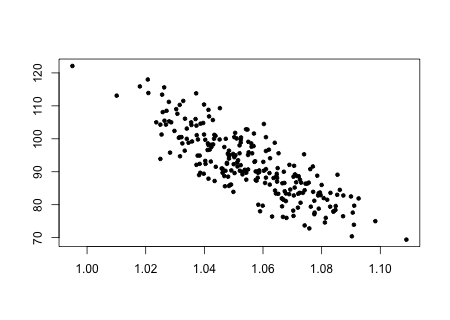
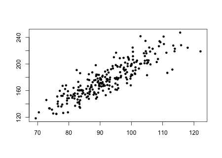
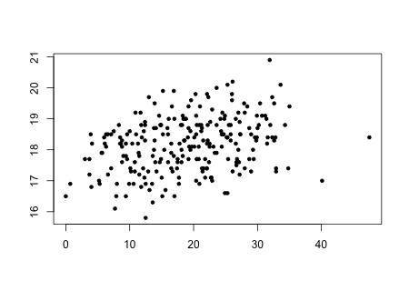
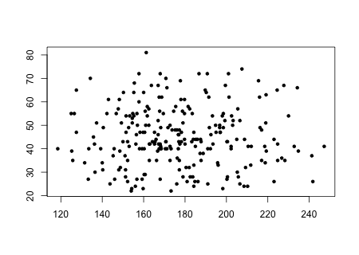
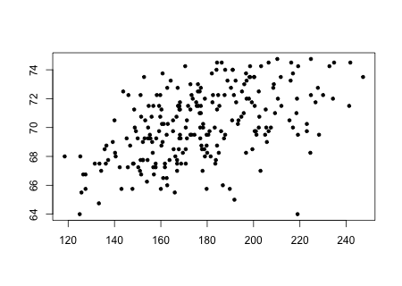
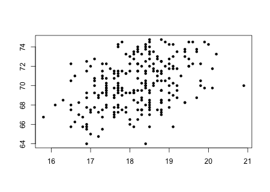
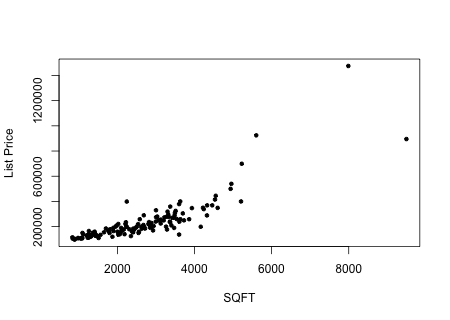
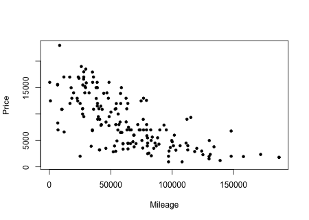

```{r,results='asis',echo=FALSE}
if(params$key==TRUE){
  if(params$plinks==TRUE) cat("* [Word Document](",paste(params$keyname,"docx",sep="."),")\n")
  if(params$plinks==TRUE) cat("* [PDF Document](",paste(params$keyname,"pdf",sep="."),")\n")
  cat("<!--")
  cat("\n")
} 
if(params$key!=TRUE){
  if(params$plinks==TRUE) cat("* [Word Document](",paste(params$docname,"docx",sep="."),")\n")
  if(params$plinks==TRUE) cat("* [PDF Document](",paste(params$docname,"pdf",sep="."),")\n")
  cat("\n")
}
```

```{r,include=FALSE}
library(ggplot2)
library(ggthemes)
library(pander)
library(mosaic)
panderOptions('keep.line.breaks',TRUE)
source("../scripts/ggQQline.R")
source("../scripts/normTail.R")
source("../scripts/221_Interactive_Functions.R")
```

**Instructions:  You are encouraged to collaborate with other students on the homework, but it is important that you do your own work.  Before working with someone else on the assignment, you should attempt each problem on your own.**

```{r,include=FALSE}
#Going to make all the charts for these next 6 questions here.

body = read.csv(file = "https://raw.githubusercontent.com/byuistats/data/master/BodyMeasurementsCorrected/BodyMeasurementsCorrected.csv",header = TRUE,stringsAsFactors = FALSE)

NoOutliersBody = subset(body, Weight < 250 & Height <75)

png(filename = "../images/L21_Homework_Q1_Sketch.png",width = 450,height=320)
plot(Abdomen~Density, data = NoOutliersBody,pch = 20, xlab = "",ylab = "")
dev.off()

png(filename = "../images/L21_Homework_Q2_Sketch.png",width = 450,height=320)
plot(Weight~Abdomen, data = NoOutliersBody,pch = 20, xlab = "",ylab = "")
dev.off()

png(filename = "../images/L21_Homework_Q3_Sketch.png",width = 450,height=320)
plot(Wrist~BodyFat, data = NoOutliersBody,pch = 20, xlab = "",ylab = "")
dev.off()

png(filename = "../images/L21_Homework_Q4_Sketch.png",width = 450,height=320)
plot(Age~Weight, data = NoOutliersBody,pch = 20, xlab = "",ylab = "")
dev.off()

png(filename = "../images/L21_Homework_Q5_Sketch.png",width = 450,height=320)
plot(Height~Weight, data = NoOutliersBody,pch = 20, xlab = "",ylab = "")
dev.off()

png(filename = "../images/L21_Homework_Q6_Sketch.png",width = 450,height=320)
plot(Height~Wrist, data = NoOutliersBody,pch = 20, xlab = "",ylab = "")
dev.off()
```


For each of the following scatterplots, describe the data by its form (linear or nonlinear), its direction (positive, negative, or neither), and its strength (weak, moderate, or strong). Answers may vary. 

1. 

2. 

3. 

4. 

5. 

6. 

7. Which of the following best describes the relationship between two variables, if their correlation coefficient is $r = -0.997$?
	
    a. There is a strong positive linear relationship between the variables.
    
    b. There is a weak negative linear relationship between the variables.
    
    c. There is a strong negative linear relationship between the variables.
    
    d. There is virtually no linear relationship between the variables.
    
    e. This cannot be determined from the information given.
    
```{r,include=FALSE}
Madison = read.csv(file = "https://raw.githubusercontent.com/byuistats/data/master/MadisonCountyRealEstate/MadisonCountyRealEstate.csv", header = TRUE, stringsAsFactors = FALSE)

png(filename = "../images/L21_Homework_Q8_Sketch.png",width = 450,height=320)
plot(ListPrice~SQFT, data = Madison,pch = 20, xlab = "SQFT",ylab = "List Price")
dev.off()

r1 = round(cor(ListPrice~SQFT,data = Madison),3)
Covar1 = round(cov(ListPrice~SQFT,data = Madison),3) #this is wrong in the historical files. Checked two places. 

```


Data was collected on homes for sale in Madison County as of January 2011.  Information on the listings such as price, size of the home, and style were recorded. Open the data file [MadisonCountyRealEstate](http://statistics.byuimath.com/index.php?title=Data). Use this data to answer questions 8 through 12. 

8. Create and attach a scatterplot of the price of homes (ListPrice) compared with square footage (SQFT).


9. Describe the data displayed on the scatterplot. Does it appear linear or nonlinear? Does it have a positive or negative association, or neither? Does the association appear weak, moderate, or strong?


10. Compute the sample correlation coefficient (*r*). 


11. Compare your description of the scatterplot from question 9 with the value of *r* that has been computed. Was your description correct or incorrect? What was clarified by seeing the correlation coefficient?


12. Compute the sample covariance ($s_{xy}$) of this data.

```{r,include=FALSE}
Saturn = read.csv(file = "https://raw.githubusercontent.com/byuistats/data/master/LASaturnWinter06/LASaturnWinter06.csv",header = TRUE,stringsAsFactors = FALSE)

png(filename = "../images/L21_Homework_Q13_Sketch.png",width = 450,height=320)
plot(Price~Mileage, data = Saturn,pch = 20, xlab = "Mileage",ylab = "Price")
dev.off()

SaturnNoNA = na.omit(Saturn)
r2 = round(cor(y=SaturnNoNA$Price,x=SaturnNoNA$Mileage),3)

#Because there are NA values in Mileage, I have to calculate the covariance in more steps.
Covar2 = cov(y=SaturnNoNA$Price,x=SaturnNoNA$Mileage)
```


The website www.cars.com contains listings for automobiles. A sample of Saturn vehicles listed for sale in the Los Angeles area was collected from cars.com and saved as the data file [LASaturnWinter06](http://statistics.byuimath.com/index.php?title=Data). Among the variables given in the data set are the asking price (Price) and the number of miles shown on the odometer (Mileage) of each car. Use this data to answer questions 13 through 17.

13. Create and attach a scatterplot of the Price compared with Mileage.


14. Describe the data displayed on the scatterplot. Does it appear linear or nonlinear? Does it have a positive or negative association, or neither? Does the association appear weak, moderate, or strong?


15. Compute the sample correlation coefficient (*r*). 


16. Compare your description of the scatterplot from question 14 with the value of *r* that has been computed. Was your description correct or incorrect? What was clarified by seeing the correlation coefficient?


17. Compute the sample covariance ($s_{xy}$) of this data.


```{r,include=FALSE}
if(params$key==TRUE){
options(scipen = 999)
#solutions
  
  Solution01 = data.frame(Part = "-",Solution = "Linear, moderate negative association.")
  
  Solution02 = data.frame(Part = "-",Solution = "Linear, strong positive association.")
  
  Solution03 = data.frame(Part = "-",Solution = "Linear, moderate positive association.")
  
  Solution04 = data.frame(Part = "-",Solution = "Nonlinear.")
  
  Solution05 = data.frame(Part = "-",Solution = "Linear, moderate positive association.")
  
  Solution06 = data.frame(Part = "-",Solution = "Linear, weak positive association.")

  Solution07 = data.frame(Part = "-",Solution = "c. There is a strong negative linear relationship between the variables.")
  
  Solution08 = data.frame(Part = "-",Solution = "")
  
  Solution09 = data.frame(Part = "-",Solution = "Answers will vary. One plausible answer is that it does appear to be linear, with a strong positive association. You may also see slight curve to the data.")
  
  Solution10 = data.frame(Part = "-",Solution = paste("$r = ",r1,"$",sep = ""))
  
  Solution11 = data.frame(Part = "-",Solution = paste("If in answer to question 9 you said that the data appear to show a strong positive association that is supported by $r = ",r1,"$ because it is a positive number and it is close to 1.",sep = ""))
  
  Solution12 = data.frame(Part = "-",Solution = paste("$S_{}xy = ",formatC(Covar1,big.mark = ",",format = "fg"),"$",sep = ""))
  
  Solution13 = data.frame(Part = "-",Solution = "")
  
  Solution14 = data.frame(Part = "-",Solution = "Answers will vary. One plausible answer is that it does appear to be linear, with a moderate negative association.")
  
  Solution15 = data.frame(Part = "-",Solution = paste("$r = ",r2,"$",sep = ""))
  
  Solution16 = data.frame(Part = "-",Solution = paste("If in answer to question 14 you said that the data appear to show a moderate negative association that is supported by $r = ",r2,"$ because it is a negative number and it is right in between 0 and -1.",sep = ""))
  
  Solution17 = data.frame(Part = "-",Solution = paste("$S_{}xy = ",formatC(Covar2,big.mark = ",",format = "fg"),"$",sep = ""))
  
} # end params == TRUE.  We use this so it doesn't have to run for non answer key path.
```


```{r,echo=FALSE,results='asis'}
if(params$key==TRUE){
  cat("-->")
   cat("\n\n## Solutions\n\n")
      cat("\n\n **Please note that the steps show rounded numbers, but that the final answers to the problems are calculated without rounding.**")
}
```


```{r,echo=FALSE,results='asis'}
if(params$key==TRUE){

    all_solutions = sort(ls(pattern="Solution"))
    key_list = NULL
    for (i in 1:length(all_solutions)){
      temp = get(all_solutions[i])
      temp$Solution = as.character(temp$Solution)
      key_list = rbind(key_list,data.frame(Problem=i,temp))
    }
    
      pander(key_list,split.cell = 80, split.table = Inf,justify = c( 'center', 'left',"left"))
} # end params == TRUE.  We use this so it doesn't have to run for non answer key path.

```


