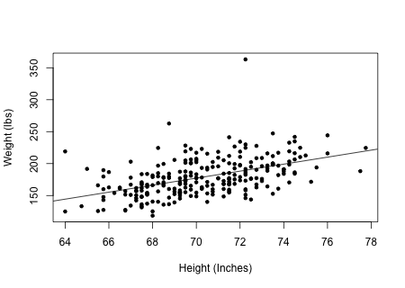
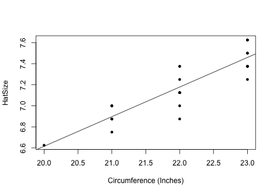

```{r,results='asis',echo=FALSE}
if(params$key==TRUE){
  if(params$plinks==TRUE) cat("* [Word Document](",paste(params$keyname,"docx",sep="."),")\n")
  if(params$plinks==TRUE) cat("* [PDF Document](",paste(params$keyname,"pdf",sep="."),")\n")
  cat("<!--")
  cat("\n")
} 
if(params$key!=TRUE){
  if(params$plinks==TRUE) cat("* [Word Document](",paste(params$docname,"docx",sep="."),")\n")
  if(params$plinks==TRUE) cat("* [PDF Document](",paste(params$docname,"pdf",sep="."),")\n")
  cat("\n")
}
```

```{r,include=FALSE}
library(ggplot2)
library(ggthemes)
library(pander)
library(mosaic)
panderOptions('keep.line.breaks',TRUE)
source("../scripts/ggQQline.R")
source("../scripts/normTail.R")
source("../scripts/221_Interactive_Functions.R")
```

**Instructions:  You are encouraged to collaborate with other students on the homework, but it is important that you do your own work.  Before working with someone else on the assignment, you should attempt each problem on your own.**

```{r,include=FALSE}
ExampleIntercept1 = 5.4
ExampleSlope1 = .5
x1 = 16
predictedValue1 = ExampleIntercept1 + ExampleSlope1 * x1
```
 
1. Given the linear regression equation, $Y=`r ExampleIntercept1` + `r ExampleSlope1`X$, what is the Y-intercept? 

2. Given the linear regression equation, $Y=`r ExampleIntercept1` + `r ExampleSlope1`X$, what is the slope? 

3. Given the linear regression equation, $Y=`r ExampleIntercept1` + `r ExampleSlope1`X$, what is the predicted value of $Y$ when $X=`r x1`$?

```{r,include=FALSE}
Body = read.csv("https://raw.githubusercontent.com/byuistats/data/master/BodyMeasurementsCorrected/BodyMeasurementsCorrected.csv",header = TRUE,stringsAsFactors = FALSE)

n2 = nrow(Body)

results2 = lm(Weight~Height, data = Body)
  
png(filename = "../images/L22_Homework_Q5_Sketch.png",width = 450,height=320)
plot(Weight~Height, data = Body,pch = 20, xlab = "Height (Inches)",ylab = "Weight (lbs)")
abline(results2)
dev.off()

yint2 = results2$coefficients[1]
slope2 = results2$coefficients[2]
predictedValue2 = 76

estimatedValue2Software = yint2 + slope2 * predictedValue2
estimatedValue2Calculator = round(yint2,3) + round(slope2,3) * predictedValue2
```


Researchers studying healthy body composition recorded various measurements of `r n2` male subjects. Height, weight, age, and other measurements were collected on each subject. Open the data file [BodyMeasurementsCorrected](https://byuistats.github.io/BYUI_M221_Book/Data/BodyMeasurementsCorrected.xlsx). For this exercise we will look at the height of the subjects compared with the weight.  Researchers want to predict the weight of a man given his height. Use this information to answer questions 4 through 8.

4. If we consider the relationship between the height and weight of these men, which variable should go on the X-axis? The Y-axis? Justify your answer.

5. Create and attach a scatterplot of these two variables. Include the linear regression line on your plot.

6. Find the equation of the linear regression line used to predict the weight of a man given his height.

7. Interpret the slope and intercept of the regression line, if appropriate. If it is not appropriate to make an interpretation, explain why not.

8. Predict the weight of a man who is `r predictedValue2` inches tall in two ways: using the equation for the regression line and a calculator AND using the software.

```{r,include=FALSE}
Hats = read.csv("https://raw.githubusercontent.com/byuistats/data/master/JSE-hats_(Modified)/JSE-hats_(Modified).csv",header = TRUE,stringsAsFactors = FALSE)

results3 = lm(HatSize~Circumference, data = Hats)
  
png(filename = "../images/L22_Homework_Q9_Sketch.png",width = 450,height=320)
plot(HatSize~Circumference, data = Hats,pch = 20, xlab = "Circumference (Inches)",ylab = "HatSize")
abline(results3)
dev.off()

yint3 = results3$coefficients[1]
slope3 = results3$coefficients[2]
predictedValue3 = 24

estimatedValue3Software = yint3 + slope3 * predictedValue3
estimatedValue3Calculator = round(yint3,3) + round(slope3,3) * predictedValue3
```

A company in South Dakota manufactures hard hats used in the mining industry.  They record measurements on all the hats they produce for quality control and planning purposes. The measurements they collect include hat size, circumference of the hat, and lengths of the major and minor axes.  Meaning, the company wants to predict size of hat given the circumference. Open the data file [JSE-Hats (Modified)](https://byuistats.github.io/BYUI_M221_Book/Data/JSE-hats_(Modified).xlsx).  Use this information to answer questions 9 through 12. 

9. Create and attach a scatterplot of these two variables. Include the linear regression line on your plot.


10. Find the equation of the linear regression line used to predict the size of a hat given a circumference.

11. Interpret the slope and intercept of the regression line, if appropriate. If it is not appropriate to make an interpretation, explain why not.


12. Predict the size of a hat with a circumference of 24 inches in two ways: using the equation for the regression line and a calculator AND using the software.

```{r,include=FALSE}
Croc = read.csv("https://raw.githubusercontent.com/byuistats/data/master/Estuarine_Crocodile_(Modified)/Estuarine_Crocodile_(Modified).csv",header = TRUE,stringsAsFactors = FALSE)

n4 = nrow(Croc)

results4 = lm(BodyLength~HeadLength, data = Croc)
  
png(filename = "../images/L22_Homework_Q13_Sketch.png",width = 450,height=320)
plot(BodyLength~HeadLength, data = Croc,pch = 20, xlab = "Head Length (cm)",ylab = "Body Length")
abline(results4)
dev.off()

r4 = cor(BodyLength~HeadLength, data = Croc)
Covar4 =cov(BodyLength~HeadLength, data = Croc) #the Answer key give the covariance for SPSS and Excel, but I don't know how to get the SPSS answer. This gives the excel answer. 
yint4 = results4$coefficients[1]
slope4 = results4$coefficients[2]
predictedValue4 = 55

estimatedValue4Software = yint4 + slope4 * predictedValue4
estimatedValue4Calculator = round(yint4,3) + round(slope4,3) * predictedValue4
```

Data were collected on estuarine, or saltwater, crocodiles. Researchers measured the head length and body length of `r n4` crocodiles and were interested to know if there is a linear relationship between crocodile head length and body length. Researchers want to predict body length based on head length. Open the data file [EstuarineCrocodiles(Modified)](https://byuistats.github.io/BYUI_M221_Book/Data/Estuarine_Crocodile_(Modified).xlsx). Use this information to answer questions 13 through 19.

13. Create and attach a scatterplot of the head length compared with body length. Include the linear regression line on your plot.


14. Compute the sample correlation coefficient ($r$). 


15. Describe the data displayed on the scatterplot. Does it appear linear or nonlinear? Does it have a positive or negative association, or neither? Does the association appear weak, moderate, or strong?


16. Find the equation of the linear regression line used to predict the body length of an estuarine crocodile given its head length.


17. Interpret the slope and intercept of the regression line, if appropriate. If it is not appropriate to make an interpretation, explain why not.

18. Predict the body length of an estuarine crocodile that has a head length of `r predictedValue4` cm in two ways: using the equation for the regression line and a calculator AND using the software.

```{r,include=FALSE}
if(params$key==TRUE){
options(scipen = 999)
#solutions
  
  Solution01 = data.frame(Part = "-",Solution = paste("$\\text{Y-Intercept} = ",ExampleIntercept1,"$",sep = ""))
  
  Solution02 = data.frame(Part = "-",Solution = paste("$\\text{Slope} = ",ExampleSlope1,"$",sep = ""))
  
  Solution03 = data.frame(Part = "-",Solution = paste("$Y = ",predictedValue1,"$",sep = ""))
  
  Solution04 = data.frame(Part = "-",Solution = "Height should go on the X-axis, and weight should be on the Y-axis. Height is easier to measure, and can be used to predict weight. We often think of height as influencing weight, but we do not typically think of weight as influencing height.")
  
  Solution05 = data.frame(Part = "-",Solution = "")
  
  Solution06 = data.frame(Part = "-",Solution = paste("$Y = ",round(yint2,3)," + ",round(slope2,3),"X$",sep = ""))
  
  Solution07 = data.frame(Part = "-",Solution = paste("Slope: If an individual man's height was increased by one inch, we expect that
his weight would increase by ",round(slope2,3)," pounds. \\\n \\\n Y-Intercept: The Y -intercept is not interpretable. First of all, it is not possible to have a man whose height is zero. Secondly, it does not make sense for the weight to be negative.",sep = ""))
  
  Solution08 = data.frame(Part = "-",Solution = paste("$\\text{Calculator: } Y = ",round(estimatedValue2Calculator,3),"$ \\\n $\\text{Software: } Y = ",round(estimatedValue2Software,3),"$",sep = ""))
  
  Solution09 = data.frame(Part = "-",Solution = "")
  
  Solution10 = data.frame(Part = "-",Solution = paste("$Y = ",round(yint3,3)," + ",round(slope3,3),"X$",sep = ""))
  
  Solution11 = data.frame(Part = "-",Solution = paste("The slope is ",round(slope3,3),", so for every inch increased in head circumference the hat size is increased by ",round(slope3,3)," sizes. \\\n \\\n The y-intercept is ",round(yint3,3),", but it is not really interpretable because a person's head circumference can never reach zero.",sep = ""))
  
  Solution12 = data.frame(Part = "-",Solution = paste("$\\text{Calculator: } Y = ",round(estimatedValue3Calculator,3),"$ \\\n $\\text{Software: } Y = ",round(estimatedValue3Software,3),"$",sep = ""))
  
  Solution13 = data.frame(Part = "-",Solution = "")
  
  Solution14 = data.frame(Part = "-",Solution = paste("$r = ",round(r4,3),"$",sep = ""))
  
  Solution15 = data.frame(Part = "-",Solution = "Answers will vary, but it appears to have a linear relationship with a strong positive association.")
  

  Solution16 = data.frame(Part = "-",Solution = paste("$Y = ",round(yint4,3)," + ",round(slope4,3),"X$",sep = ""))
  
  Solution17 = data.frame(Part = "-",Solution = paste("The slope is ",round(slope4,3),", so for every centimeter increased in head length the body length is increased by ",round(slope4,3)," centimeters. \\\n \\\n The Y -intercept is not interpretable. First of all, it is not possible to have a head length of zero centimeters. Secondly, it does not make sense for a length to be negative.",sep = ""))
  
  Solution18 = data.frame(Part = "-",Solution = paste("$\\text{Calculator: } Y = ",round(estimatedValue4Calculator,3),"$ \\\n $\\text{Software: } Y = ",round(estimatedValue4Software,3),"$",sep = ""))
  
} # end params == TRUE.  We use this so it doesn't have to run for non answer key path.
```


```{r,echo=FALSE,results='asis'}
if(params$key==TRUE){
  cat("-->")
   cat("\n\n## Solutions\n\n")
      cat("\n\n **Please note that the steps show rounded numbers, but that the final answers to the problems are calculated without rounding.**")
}
```


```{r,echo=FALSE,results='asis'}
if(params$key==TRUE){

    all_solutions = sort(ls(pattern="Solution"))
    key_list = NULL
    for (i in 1:length(all_solutions)){
      temp = get(all_solutions[i])
      temp$Solution = as.character(temp$Solution)
      key_list = rbind(key_list,data.frame(Problem=i,temp))
    }
    
      pander(key_list,split.cell = 80, split.table = Inf,justify = c( 'center', 'left',"left"))
} # end params == TRUE.  We use this so it doesn't have to run for non answer key path.

```


