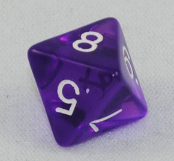

```{r,results='asis',echo=FALSE}
if(params$key==TRUE){
  if(params$plinks==TRUE) cat("* [Word Document](",paste(params$keyname,"docx",sep="."),")\n")
  if(params$plinks==TRUE) cat("* [PDF Document](",paste(params$keyname,"pdf",sep="."),")\n")
  cat("<!--")
  cat("\n")
} 
if(params$key!=TRUE){
  if(params$plinks==TRUE) cat("* [Word Document](",paste(params$docname,"docx",sep="."),")\n")
  if(params$plinks==TRUE) cat("* [PDF Document](",paste(params$docname,"pdf",sep="."),")\n")
  cat("\n")
}
```

**Directions: Please fill in Part I as you study the Reading Assignment. Once you finish the reading, complete the questions on Part II. You may use your notes, the key, and the help videos. Be sure to take this completed assignment to your group meeting where you can ask and help answer questions on this assignment.**

```{r,include=FALSE}
library(ggplot2)
library(ggthemes)
library(pander)
library(mosaic)
panderOptions('keep.line.breaks',TRUE)
source("../scripts/ggQQline.R")
source("../scripts/normTail.R")
source("../scripts/221_Interactive_Functions.R")
```

## Problems

**Part I:**  Use the information in the reading assignment to complete these questions.

1. What notation is used to denote the probability of an event occurring?

2. Please state and describe the three rules of probability.

3. What does it mean to be random?

4. What does the phrase Discrete Random Variable mean?

**Part II:**  You will fill this part out during your Group Preparation session.


<!-- http://www.gmdice.com/media/catalog/product/cache/1/image/9df78eab33525d08d6e5fb8d27136e95/c/h/cheap-dice-purple-transparent-d8.jpg -->

```{r,include=FALSE}
pip5 = 5
pip6 = 5
pipMax = 8
```


5. An eight sided die has eight possible outcomes for each roll. (1, 2, 3, 4, 5, 6, 7, or 8).  Calculate the probability of rolling a number greater than `r pip5`. 

6. Calculate the probability of not getting a number greater than `r pip6`.  

```{r,include=FALSE}
if(params$key==TRUE){
#solutions

  Solution01 = data.frame(Part="-",Solution="P(x)")

  Solution02 = data.frame(Part = "-", Solution = "1. A probability is a number between 0 and 1.\\\n \\\n 2. If you list all the outcomes of a probability experiment the probability that one of these outcomes will occur is 1.  In other words, the sum of the probabilities in any probability is 1. \\\n \\\n 3. The probability that an outcome will not occur is 1 minus the probability that it will occur.")
  
  Solution03 = data.frame(Part="-",Solution="When something is random, it follows a long term pattern, but we usually do not know the outcome of the next experiment.")
  
  Solution04 = data.frame(Part="-",Solution="A discrete random variable is something that varies following a specific pattern or distribution over the long run.  They are discrete if they can be listed.")
  
  Solution05 = data.frame(Part = "-",Solution=paste("P(Roll Greater Than ",pip5,") = ",pipMax-pip5,"/",pipMax," or ",round((pipMax - pip5)/pipMax,3),sep = ""))
  
  Solution06 = data.frame(Part = "-",Solution=paste("P(Not a Roll Greater Than ",pip6,")  = ",pip6,"/",pipMax," or ",round(pip6/pipMax,3),sep = ""))
  
} # end params == TRUE.  We use this so it doesn't have to run for non answer key path. 
```


```{r,echo=FALSE,results='asis'}
if(params$key==TRUE){
  cat("-->")
   cat("\n\n## Solutions\n\n")
      cat("\n\n **Please note that the steps show rounded numbers, but that the final answers to the problems are calculated without rounding.**")
}
```


```{r,echo=FALSE,results='asis'}
if(params$key==TRUE){

    all_solutions = sort(ls(pattern="Solution"))
    key_list = NULL
    for (i in 1:length(all_solutions)){
      temp = get(all_solutions[i])
      temp$Solution = as.character(temp$Solution)
      key_list = rbind(key_list,data.frame(Problem=i,temp))
    }
    
      pander(key_list,split.cell = 80, split.table = Inf,justify = c( 'center', 'left',"left"))
} # end params == TRUE.  We use this so it doesn't have to run for non answer key path.

```

