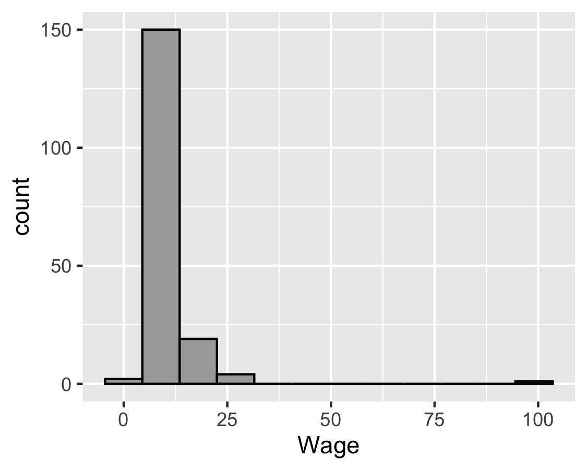
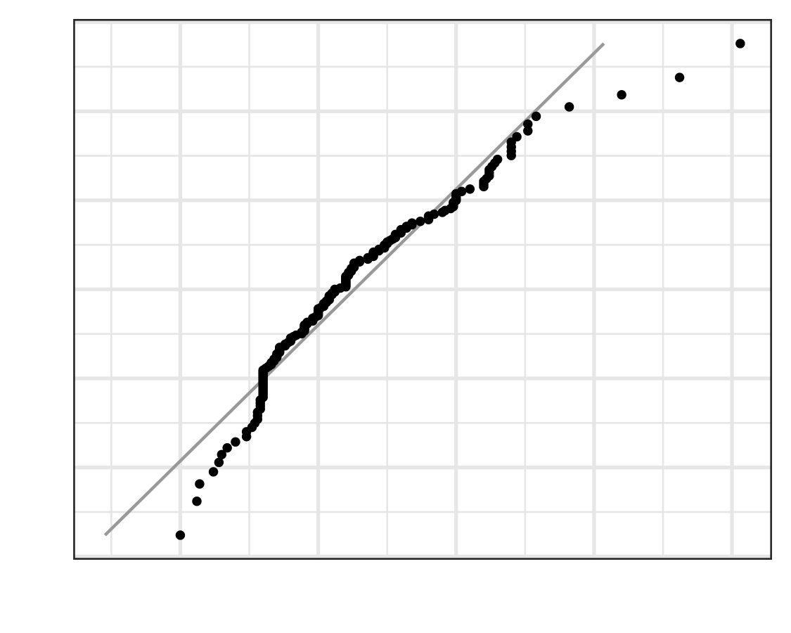
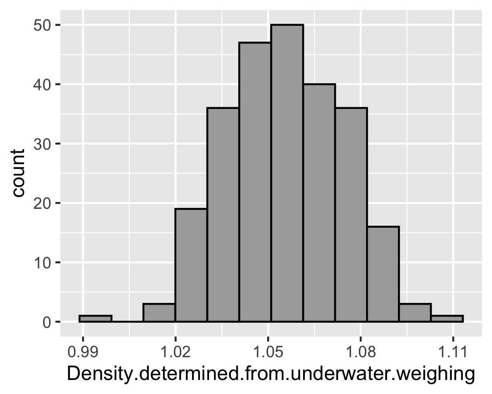
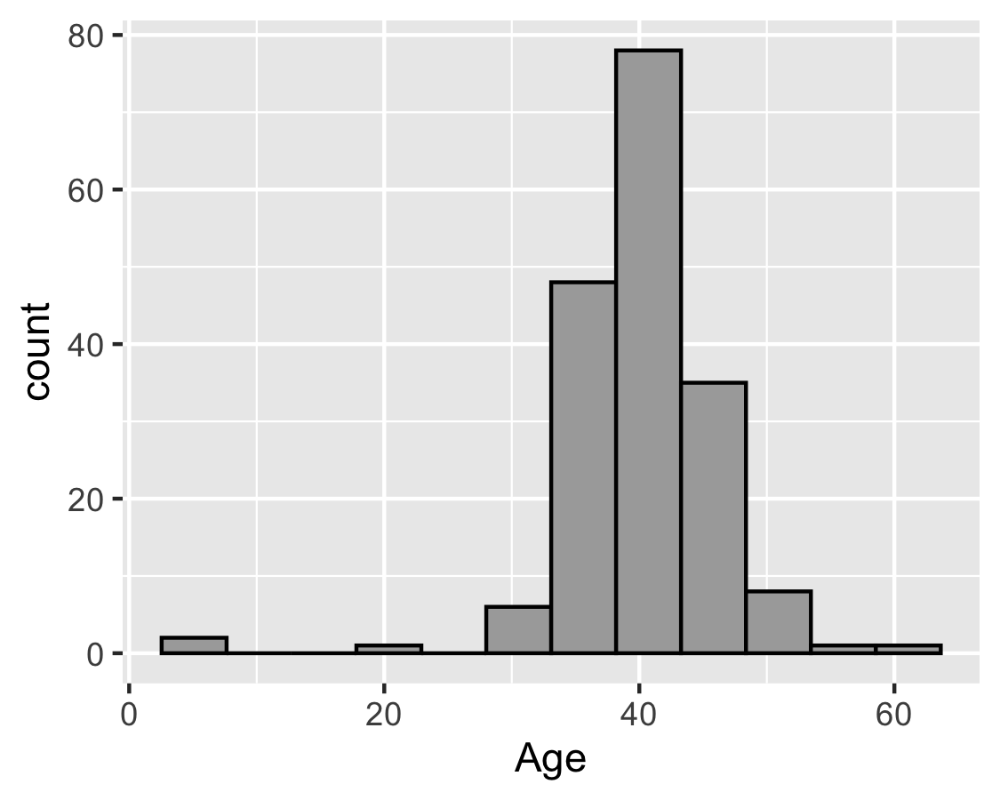
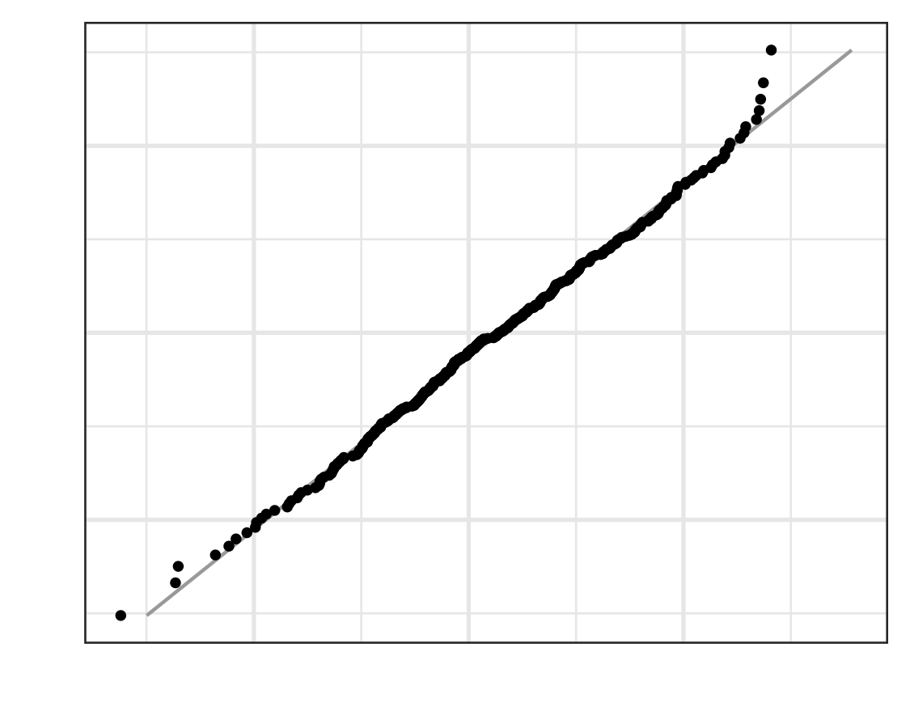

```{r,results='asis',echo=FALSE}
if(params$key==TRUE){
  if(params$plinks==TRUE) cat("* [Word Document](",paste(params$keyname,"docx",sep="."),")\n")
  if(params$plinks==TRUE) cat("* [PDF Document](",paste(params$keyname,"pdf",sep="."),")\n")
  cat("<!--")
  cat("\n")
} 
if(params$key!=TRUE){
  if(params$plinks==TRUE) cat("* [Word Document](",paste(params$docname,"docx",sep="."),")\n")
  if(params$plinks==TRUE) cat("* [PDF Document](",paste(params$docname,"pdf",sep="."),")\n")
  cat("\n")
}
```

**Directions: Please fill in Part I as you study the Reading Assignment. Once you finish the reading, complete the questions on Part II. You may use your notes, the key, and the help videos. Be sure to take this completed assignment to your group meeting where you can ask and help answer questions on this assignment.**

```{r,include=FALSE}
library(ggplot2)
library(ggthemes)
library(pander)
library(mosaic)
library(gridExtra)
panderOptions('keep.line.breaks',TRUE)
source("../scripts/ggQQline.R")
source("../scripts/normTail.R")
source("../scripts/221_Interactive_Functions.R")
```


## Problems

**Part I:**  Use the information in the reading assignment to complete these questions.

```{r,include=FALSE}
trueMean = .261
trueSD = .034

x1A = .190
zA = (x1A - trueMean)/trueSD
x1B = .225
zB = (x1B - trueMean)/trueSD
x1C = .325
zC = (x1C - trueMean)/trueSD
x1D = .335
zD = (x1D - trueMean)/trueSD

x2 = .335
probx2 = pnorm(((x2 - trueMean)/trueSD),lower.tail = FALSE)
```

   
1.	Classify each of the following batting averages as either "unusual" or "not unusual." Use the z-score to make this determination.
	
    a. `r x1A`

	  b. `r x1B`

	  c. `r x1C`

	  d. `r x1D`

2. Find the probability that a randomly selected professional baseball player will have a batting average that is greater than `r x2`. 

3. Provide a brief description of a Normal Density Curve. Describe the shape and the properties. 

4. In the following z-score formula, $z = \frac{x-\mu}{\sigma}$ please state what each symbol stands for.

5. In no less than three sentences, please define and describe the 68-95-99.7% rule.

**Part II:**  

```{r,include=FALSE}
MeanGRE = 150.8
SDGRE = 8.8
x6_b = 165
z6_b = (x6_b - MeanGRE)/SDGRE
probx6_b = pnorm(z6_b,lower.tail = FALSE)

percentile6_c = 10
Z6_c = qnorm(percentile6_c/100,lower.tail = TRUE)
X6_d = Z6_c * SDGRE + MeanGRE

MeanHyd = 1800
SDHyd = 600
x7_b = 2500
z7_b = (x7_b - MeanHyd)/SDHyd
probAbovex7_b = pnorm(z7_b,lower.tail = FALSE)
probBelowx7_b = pnorm(z7_b,lower.tail = TRUE)

x7_d = 1500
z7_d = (x7_d - MeanHyd)/SDHyd
probBelowx7_d = pnorm(z7_d,lower.tail = TRUE)
probBetween = probBelowx7_b - probBelowx7_d

quartile7_f = 3
z7_f = qnorm(.75,lower.tail = TRUE)
x7_f = round(z7_f,3) * SDHyd + MeanHyd

```


||GRE Scores|Speed of Hydrogen|
|------------------|--------------|--------|
|Mean|`r MeanGRE`|`r MeanHyd`|
|Standard Deviation|`r SDGRE`|`r SDHyd`|

6. The mean of all quantitative scores on the GRE is `r MeanGRE` with a standard deviation of `r SDGRE`.

    a. Scores on the quantitative portion of the GRE are approximately normally distributed with mean $\mu$ = ________ and standard deviation $\sigma$ = ________.  

    b. What proportion of the people who take the quantitative portion of the GRE will score above `r x6_b`?

    c. If a student's score is the $`r percentile6_c`^{th}$ percentile, what would their corresponding z-score be?

    d. What is the quantitative GRE score for a student who scores at the $`r percentile6_c`^{th}$ percentile?

7. The mean speed of hydrogen at room temperature is `r MeanHyd` m/s with a standard deviation of `r SDHyd` m/s. 

    a. At room temperature the mean speed of hydrogen (H<sub>2</sub>) particles is approximately normal with a population mean of $\mu$ = ________ meters per second (m/s) and a standard deviation of 
$\sigma$ = ________ m/s.  

    b. What is the probability that a randomly selected particle has a speed over `r x7_b` m/s?

    c. What is the probability that a randomly selected particle has a speed that is less than `r x7_b` m/s?

    d. What is the probability that a randomly selected particle has a speed that is less than `r x7_d` m/s? 

    e. What is the probability that a randomly selected particle has a speed that is between `r x7_d` and `r x7_b` m/s? 

    f. What is the $`r quartile7_f`^{rd}$ quartile of the speeds of hydrogen at room temperature?

8. Determine whether the data represented in these histograms are normally distributed or not. Record your answer for each graph.  Justify your answer.

```{r,echo=FALSE,warning=FALSE,results='asis'}
#This dataset will provide all our abnormal histograms.
NotNormal = read.csv("https://raw.githubusercontent.com/byuistats/data/master/ClassSurvey/ClassSurvey.csv",header = TRUE,stringsAsFactors = FALSE)  

#Plot A-------------------------------------------------------------
hist_wage = ggplot(data = NotNormal, aes(x=Wage)) + 
  geom_histogram(fill="darkgray",col="black",bins = 12)

ggsave(hist_wage,filename = "../images/L5_Prep_PartII_Q8_PlotA.png",width = 3.75,height = 3.00)

#Plot B--------------------------------------------------------------
QQPlot_Q08_B = ggplot(data = NotNormal, aes(x=Credits)) + 
  geom_histogram(fill="darkgray",col="black",bins = 12)

ggsave(QQPlot_Q08_B,filename = "../images/L5_Prep_PartII_Q8_PlotB.png",width = 3.75,height = 3.00)

#Plot C--------------------------------------------------------------
QQPlot_Q08_E = ggplot(data = NotNormal, aes(x=Age)) + 
  geom_histogram(fill="darkgray",col="black",bins = 12)

ggsave(QQPlot_Q08_E,filename = "../images/L5_Prep_PartII_Q8_PlotE.png",width = 3.75,height = 3.00)

#The following dataset will provide us with our normal qqplots
Normal = read.csv("https://raw.githubusercontent.com/byuistats/data/master/BodyMeasurements/BodyMeasurements.csv",header = TRUE,stringsAsFactors = FALSE)

#Plot C------------------------------------------------------------
QQPlot_Q08_C = ggplot(data = Normal, aes(x=Density.determined.from.underwater.weighing)) + 
  geom_histogram(fill="darkgray",col="black",bins = 12)

ggsave(QQPlot_Q08_C,filename = "../images/L5_Prep_PartII_Q8_PlotC.png",width = 3.75,height = 3.00)

#Plot D-------------------------------------------------------------
QQPlot_Q08_D = ggplot(data = Normal, aes(x=X.Wrist.circumference..cm.)) + 
  geom_histogram(fill="darkgray",col="black",bins = 12)

ggsave(QQPlot_Q08_D,filename = "../images/L5_Prep_PartII_Q8_PlotD.png",width = 3.75,height = 3.00)

#Plot F------------------------------------------------------------
VeryNormal = data.frame(x = rnorm(400,2,5))
QQPlot_Q08_F = ggplot(data = VeryNormal, aes(x=x)) + 
  geom_histogram(fill="darkgray",col="black",bins = 12)

ggsave(QQPlot_Q08_F,filename = "../images/L5_Prep_PartII_Q8_PlotF.png",width = 3.75,height = 3.00)
```


Plot A.    
     

Plot B.    


Plot C.    
    

Plot D.    


Plot E.    


Plot F.    



```{r,include=FALSE}
if(params$key==TRUE){
#solutions

  Solution01 = data.frame(Part=LETTERS[1:4],Solution=c(paste(x1A,"- ",zUsual(zA)," ($z= ",round(zA,3),"$)",sep = ""),
                                                       paste(x1B,"-  ",zUsual(zB)," ($z = ",round(zB,3),"$)",sep = ""),
                                                       paste(x1C,"-  ",zUsual(zC)," ($z = ",round(zC,3),"$)",sep = ""),
                                                       paste(x1D,"-  ",zUsual(zD)," ($z = ",round(zD,3),"$)",sep = "")))
  
  Solution02 = data.frame(Part="-",Solution=paste("The probability that a randomly selected professional baseball player will have a batting average that is greater than ",x2," is ",round(probx2,3),".",sep = ""))
  
  Solution03 = data.frame(Part="-",Solution="The Normal Density curve is symmetric and has a bell shape.  It is determined by its mean and standard deviation.")
  
  Solution04 = data.frame(Part="-",Solution="z: tells how many standard deviations away from the mean a certain observation lies. \\\n x: an observed data point. \\\n $\\mu$: mean of the population. \\\n $\\sigma$: standard deviation of the population.")
  
  Solution05 = data.frame(Part="-",Solution="For any bell-shaped distribution, 68% of the data will lie within 1 standard deviation of the mean, 95% of the data will lie within 2 standard deviations of the mean, and 99.7% of the data will lie within 3 standard deviations of the mean. This is called the 68-95-99.7% Rule for Bell-shaped Distributions. Needs to be at least three sentences.")
  
  Solution06 = data.frame(Part=LETTERS[1:4],Solution=c(paste("$\\mu=",MeanGRE,"$ \\\n $\\sigma=",SDGRE,"$",sep = ""),
                                                       paste("$P(X > ",x6_b,") = P(z > ",round(z6_b,4),") = ",round(probx6_b,4),"$",sep = ""),
                                                       paste("$z = ",round(Z6_c,4),"$; this is ",zUsual(Z6_c),". See question 1.",sep = ""),
                                                       paste("GRE score = ",round(X6_d,1),", which rounds to ",round(X6_d),".",sep = "")))

  Solution07 = data.frame(Part=LETTERS[1:6],Solution=c(paste("$\\mu = ",MeanHyd,"$ \\\n $\\sigma = ",SDHyd,"$",sep = ""),
                                                       paste("$P(X > ",x7_b,") = P(z > ",round(z7_b,4),") = ",round(probAbovex7_b,4),"$",sep = ""),
                                                       paste("$P(X < ",x7_b,") = P(z < ",round(z7_b,4),") = ",round(probBelowx7_b,4),"$ \\\n This answer is easier to get by subtracting the answer to part (a) from 1.",sep = ""),
                                                       paste("$P(X < ",x7_d,") = P(z < ",round(z7_d,4),") = ",round(probBelowx7_d,4),"$",sep = ""),
                                                       paste("$P( ",x7_d," < X < ",x7_b," )  = ",round(probBetween,4),"$",sep = ""),
                                                       paste("$",quartile7_f,"^{rd}$ quartile of the speeds of hydrogen = ",round(x7_f,1)," $\\frac{m}{s}$",sep = "")))
    
  Solution08 = data.frame(Part=LETTERS[1:6],Solution=c("Not normal","Not Normal","Normal","Normal","Not Normal","Normal"))
  
} # end params == TRUE.  We use this so it doesn't have to run for non answer key path. 
```


```{r,echo=FALSE,results='asis'}
if(params$key==TRUE){
  cat("-->")
   cat("\n\n## Solutions\n\n")
      cat("\n\n **Please note that the steps show rounded numbers, but that the final answers to the problems are calculated without rounding.**")
}
```


```{r,echo=FALSE,results='asis'}
if(params$key==TRUE){

    all_solutions = sort(ls(pattern="Solution"))
    key_list = NULL
    for (i in 1:length(all_solutions)){
      temp = get(all_solutions[i])
      temp$Solution = as.character(temp$Solution)
      key_list = rbind(key_list,data.frame(Problem=i,temp))
    }
    
      pander(key_list,split.cell = 80, split.table = Inf,justify = c( 'center', 'left',"left"))
} # end params == TRUE.  We use this so it doesn't have to run for non answer key path.

```

