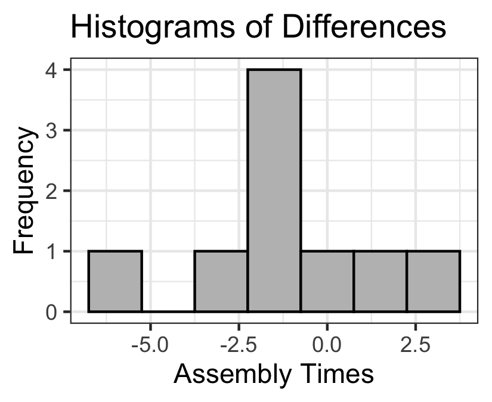
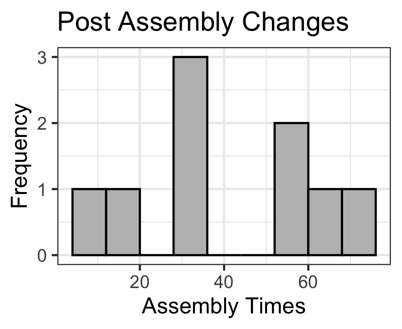
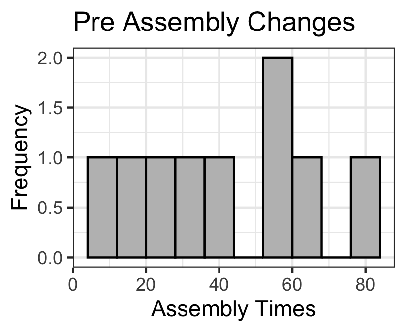

```{r,results='asis',echo=FALSE}
if(params$key==TRUE){
  if(params$plinks==TRUE) cat("* [Word Document](",paste(params$keyname,"docx",sep="."),")\n")
  if(params$plinks==TRUE) cat("* [PDF Document](",paste(params$keyname,"pdf",sep="."),")\n")
  cat("<!--")
  cat("\n")
} 
if(params$key!=TRUE){
  if(params$plinks==TRUE) cat("* [Word Document](",paste(params$docname,"docx",sep="."),")\n")
  if(params$plinks==TRUE) cat("* [PDF Document](",paste(params$docname,"pdf",sep="."),")\n")
  cat("\n")
}
```

**Directions: Please fill in Part I as you study the Reading Assignment. Once you finish the reading, complete the questions on Part II. You may use your notes, the key, and the help videos. Be sure to take this completed assignment to your group meeting where you can ask and help answer questions on this assignment.**

## Problems

```{r,echo=FALSE}
library(ggplot2)
library(ggthemes)
library(pander)
library(gridExtra)
library(grid)
library(PerformanceAnalytics)
panderOptions('keep.line.breaks',TRUE)
source("../scripts/ggQQline.R")
source("../scripts/normTail.R")
source("../scripts/221_Interactive_Functions.R")
```


**Part I:**  Use the information in the reading assignment to complete these questions. 

1.	What does it mean to have Matched Pair data?

2.	What are the differences in the hypothesis tests between a One Sample t ($\sigma$ unknown) and Matched Pairs t (open-ended)?
 

**Part II :**  

```{r,echo=FALSE}
FactoryAssemblyTimes = read.csv(file="https://raw.githubusercontent.com/byuistats/data/master/FactoryAssemblyTimes-sim/FactoryAssemblyTimes-sim.csv",stringsAsFactors = FALSE,header = TRUE)

FactoryAssemblyTimes$Difference = FactoryAssemblyTimes[,2] - FactoryAssemblyTimes[,1] #adds another column for the differences in the data set

trueMean1 = 0
mean1_diff = mean(FactoryAssemblyTimes$Difference)
sd1_diff = sd(FactoryAssemblyTimes$Difference)

n1 = nrow(FactoryAssemblyTimes)
df1 = n1 - 1

alpha1 = 0.05
confLevel1 = (1 - alpha1) * 100

test1 = "either"

results_Q06 = t.test(FactoryAssemblyTimes$Pre.Assembly.Change,FactoryAssemblyTimes$Post.Assembly.Change,paired = TRUE,mu=0,alternative = "two.sided",conf.level = confLevel1/100)
```


Matched Paired t Procedure - A manager at a factory feels that the amount of time that his workers spend doing their part in the assembly line is too long. He measures the amount of time (in minutes) `r n1` of his workers take to complete 100 products.  After implementing the new procedure, he again measures the amount of time (in minutes) the same `r n1` workers take to complete 100 products, and obtains the following data:  He wants to know if the mean assembly time is `r typeTest(test1)` and used the level of significance of $\alpha$ = `r alpha1`.  (Use Data link on I-Learn [FactoryAssemblyTimes-sim](https://byuistats.github.io/BYUI_M221_Book/Data/FactoryAssemblyTimes-sim.xlsx))

3.	Design the Study:
    
    a. What is the research question?

    b. State the null and alternative hypothesis.

4.	Collect the Data:

    Describe the data collection procedures.

5.	Describe the Data:

    In a short paragraph use summary statistics to describe the data. After the paragraph insert an appropriate and well labeled graph to illustrate the data.  

6. Make Inferences:

    a. What type of hypothesis test is appropriate?

    b. What are the requirements for this test?

    c. Compute the differences between the two times and determine if the requirements are met for this test. Explain your answer.

    d. Continue with the test regardless of what you found in part "c." Compute the test statistic.

    e. State the degrees of Freedom.

    f. Compute the P-value to the alpha level. Sketch the t-distribution using the t-distribution applet. 
  
    g. Make a decision.Do you reject the null hypothesis or fail to reject it?

    h. Present your conclusions in the form of an English statement.

    i. Rather than testing a hypothesis, now say you just wanted to estimate the mean difference between wait times at the `r confLevel1`% level. What would you do? Be sure to calculate the margin of error. Do it and paste your results below.


7. Take Action

    In a short paragraph describe the action you feel should be taken based on the statistical results above.


```{r,echo=FALSE , include=FALSE}
### Problem 2c of Part II data summary and visualization

#histogram for Part II question 3

Question05_pre_histogram = ggplot(FactoryAssemblyTimes, 
                                  aes(x=Pre.Assembly.Change)) +
                                  geom_histogram(fill = "grey", binwidth = 8,colour = "black") + 
                                  labs(x = "Assembly Times", y = "Frequency") +
                                  ggtitle("Pre Assembly Changes")+
                                  theme_bw()

ggsave(Question05_pre_histogram,file="../images/L12_Prep_PartII_Q5_pre_histogram.png",width=2.75,height=2.25)

Question05_post_histogram = ggplot(FactoryAssemblyTimes,
                                   aes(x=Post.Assembly.Change))+
                                   geom_histogram(fill = "grey", binwidth = 8,colour = "black") +
                                   labs(x = "Assembly Times", y = "Frequency") + 
                                   ggtitle("Post Assembly Changes") +
                                   theme_bw()

ggsave(Question05_post_histogram,file="../images/L12_Prep_PartII_Q5_post_histogram.png",width=2.75,height=2.25)

Question05_diff_histogram = ggplot(FactoryAssemblyTimes,
                                   aes(x=Difference))+
                                   geom_histogram(fill = "grey", binwidth = 1.5,colour = "black") +
                                   labs(x = "Assembly Times", y = "Frequency") + 
                                   ggtitle("Histograms of Differences") +
                                   theme_bw()
ggsave(Question05_diff_histogram,file="../images/L12_Prep_PartII_Q5_diff_histogram.png",width=2.75,height=2.25)

diff = data.frame(y=FactoryAssemblyTimes$Difference)

QQp = ggplot(data = diff) + 
  stat_qq(aes(sample=y)) + 
  theme_few(4) + 
  coord_flip() 

L12_Q06_QQp = QQp + 
  geom_smooth(data = ggplot_build(QQp)$data[[1]],
              aes(x=x,y=y),
              method = "lm",
              se=FALSE) + labs(x="",y="")

ggsave(plot=L12_Q06_QQp,filename="../images/L12_Q06_QQp.png",width=2.75,height=2.25)

```
   

```{r, include=FALSE}
if(params$key==TRUE){

#solutions

    Solution01 =  data.frame(Part="-",Solution="Usually matched pairs are data taken from one population where a pair of observations is drawn on the same individuals selected for the sample, such as a pre-test and post-test.")
    
    Solution02 = data.frame(Part="-",Solution="open ended")
    
    Solution03 = data.frame(Part=LETTERS[1:2],Solution=c("After implementing the new loading/unloading procedure, is the mean wait time different than the wait time before?",paste("$H_o:\\mu_d =$ ", trueMean1, "\\\n", "$H_a:\\mu_d\\neq$ ", trueMean1, sep = "")))
    
    Solution04 = data.frame(Part="-",Solution=paste("The researcher collected assembly times (in minutes) from ", n1," factory workers before the change. Then he collected the assembly times for those same ", n1, " workers after the change in procedure had been implemented.", sep = ""))
    
    Solution05 = data.frame(Part="-",Solution=paste("The paragraph should include: \\\n- $\\bar{d}=\\pm$ ", abs(round(mean1_diff,3)),"(depending on difference taken) \\\n- $s_d =$", round(sd1_diff,3)," \\\n- $n=$ ", n1," \\\n- One histogram of the differences and one histogram for each of the original data sets with clear lables. \\\n  \\\n  \\\n "))
          
    Solution06 = data.frame(Part=LETTERS[1:9],Solution=c(paste("A ", tailTest(test1)," paired-sample t-test for means is the appropriate hypothesis test to perform.", sep = ""),
                                                         "That the sample mean of the differences comes from a normal distribution and we assume a simple random sample of the population.",     
                                                         "We assume a simple random sample of the population. $n < 30$ so we would need to look back at the histogram to determine normality of the data. \\\n  \\\n The differences may not by normally distributed, it is hard to tell with such a small sample size. We will continue with our assumption of normality.",
                                                         paste("$t=", round(results_Q06$statistic,3), "$ or $t=", -1 * round(results_Q06$statistic,3),"$", sep = ""),
                                                         paste("$df=", df1, "$",sep = ""),
                                                         paste("$\\text{P-value}=", round(results_Q06$p.value,3),"\\text{ P-value}>\\alpha$",sep = ""),
                                                         paste("$\\text{P-value} > \\alpha$, therefore we ", failOrNot(results_Q06$p.value,alpha1)," the null hypothesis.", sep = ""),
                                                         paste("We have ", sufficientOrNot(failOrNot(results_Q06$p.value,alpha1))," evidence to say that the time to make 100 products is any different after the implementation of the new assembly procedure.",sep = ""),
                                                         paste("We would create a ",confLevel1,"% confidence interval using the t-distribution. (",round(results_Q06$conf.int,4)[1],",", round(results_Q06$conf.int,4)[2],")  or (",round(results_Q06$conf.int,4)[2] * -1,",",round(results_Q06$conf.int,4)[1] * -1,") depending on difference calculated",sep = "")))
    
    Solution07 = data.frame(Part="-",Solution="You should describe how they need to find another way to reduce the time, because this particular plan did not make a statistically significant difference.")
    
} # end params == TRUE.  We use this so it doesn't have to run for non answer key path.
    
```    
    
    
```{r,echo=FALSE,results='asis'}
if(params$key==TRUE) cat("-->")
  if(params$key==TRUE) cat("\n\n## Solutions\n\n---")
      if(params$key==TRUE) cat("\n\n")
```


```{r,echo=FALSE,results='asis'}
if(params$key==TRUE){

    all_solutions = sort(ls(pattern="Solution"))
    key_list = NULL
    for (i in 1:length(all_solutions)){
      temp = get(all_solutions[i])
      temp$Solution = as.character(temp$Solution)
      key_list = rbind(key_list,data.frame(Problem=i,temp))
    }
    
      pander(key_list,split.cell = 80, split.table = Inf,justify = c( 'center', 'left',"left"))
} # end params == TRUE.  We use this so it doesn't have to run for non answer key path.

```