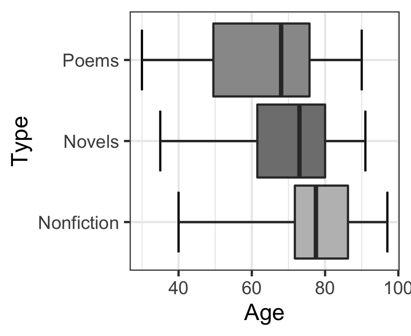
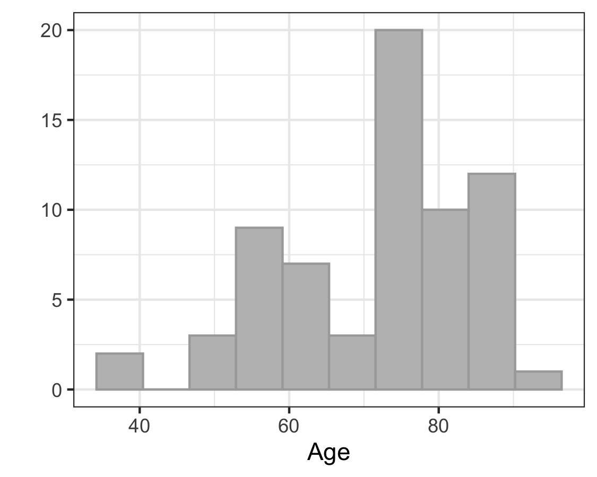
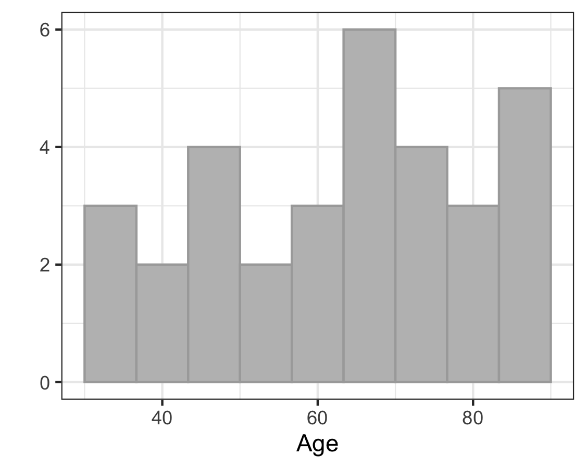
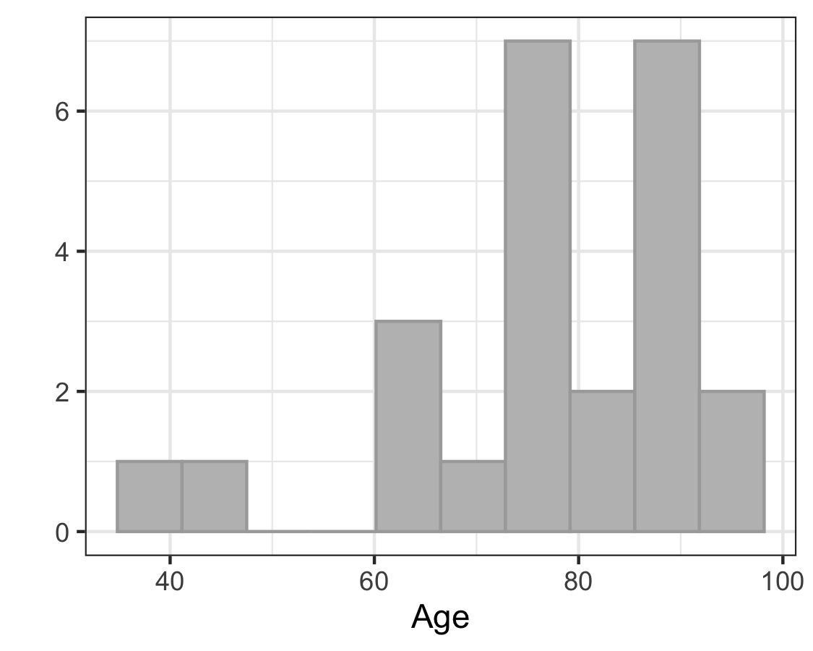

```{r,results='asis',echo=FALSE}
if(params$key==TRUE){
  if(params$plinks==TRUE) cat("* [Word Document](",paste(params$keyname,"docx",sep="."),")\n")
  if(params$plinks==TRUE) cat("* [PDF Document](",paste(params$keyname,"pdf",sep="."),")\n")
  cat("<!--")
  cat("\n")
} 
if(params$key!=TRUE){
  if(params$plinks==TRUE) cat("* [Word Document](",paste(params$docname,"docx",sep="."),")\n")
  if(params$plinks==TRUE) cat("* [PDF Document](",paste(params$docname,"pdf",sep="."),")\n")
  cat("\n")
}
```

**Directions: Please fill in Part I as you study the Reading Assignment. Once you finish the reading, complete the questions on Part II. You may use your notes, the key, and the help videos. Be sure to take this completed assignment to your group meeting where you can ask and help answer questions on this assignment.**

## Problems

```{r,echo=FALSE}
library(ggplot2)
library(ggthemes)
library(pander)
panderOptions('keep.line.breaks',TRUE)
source("../scripts/ggQQline.R")
source("../scripts/221_Interactive_Functions.R")
```

**Part I:**  Use the information in the reading assignment to complete these questions.
   
1. What are the null and alternative hypotheses for ANOVA?

2. For one of the assumptions for ANOVA, what is the rule for examining the variance of each of the samples?

3. What are the differences between the test of hypothesis for ANOVA and the other tests of hypothesis that we have covered to this point of the class (open-ended)?
 

**Part II:**  

```{r, echo=FALSE}
WomanPoet = read.csv(file = "https://raw.githubusercontent.com/byuistats/data/master/womenpoet/womenpoet.csv", header = TRUE, stringsAsFactors = FALSE)

Novel = subset(WomanPoet, Type=="Novels")
n1Novel = nrow(Novel)
mean1Novel = mean(Novel$Age)
sd1Novel = sd(Novel$Age)

Poem = subset(WomanPoet, Type=="Poems")
n1Poem = nrow(Poem)
mean1Poem = mean(Poem$Age)
sd1Poem = sd(Poem$Age)

Nonfiction = subset(WomanPoet, Type=="Nonfiction")
n1Nonfiction = nrow(Nonfiction)
mean1Nonfiction = mean(Nonfiction$Age)
sd1Nonfiction = sd(Nonfiction$Age)

confLevel1 = 95
alpha1 = 1-(confLevel1/100)

results1 = aov(Age ~ Type, data = WomanPoet)
fStat1 = summary(results1)[[1]][1,4]
dfFirst1 = summary(results1)[[1]][1,1]
dfSecond1 = summary(results1)[[1]][2,1]
pValue1 = summary(results1)[[1]][1,5]

```

ANOVA--According to William Butler Yeats, "She is the Gaelic muse, for she gives inspiration to those she persecutes. The Gaelic poets die young, for she is restless, and will not let them remain long on earth." One study designed to investigate this issue examined the age of death for writers from different cultures and genders.  Three categories of writers examined were novelists, poets, and nonfiction writers. The ages at death for female writers in these categories from North America are given in the [womenpoet.xls](https://byuistats.github.io/BYUI_M221_Book/Data/womenpoet.xls) data.  Determine if the mean age at death is different for any of the categories of writers.  Use $\alpha = `r alpha1`$ as a level of significance.

1. **Design the Study:**

    a. What is the research question?

    b. State the null and alternative hypothesis.

2. **Collect the Data**:

    a. Describe the data collection procedures.

3. **Describe the Data**:

    a. In a short paragraph use summary statistics to describe the data.  After the paragraph insert an appropriate and well labeled graph to illustrate the data.  

4. **Make Inferences:**

    a. What type of hypothesis test is appropriate?

    b. What are the requirements for this test?

    c. Are the requirements met for this test?  Explain (this will require plots and simple calculations).

    d. Compute the test statistic.

    e. State the degrees of Freedom.

    f. Compute the P-value and compare it to the alpha level.

    g. Make a decision.  Do you reject the null hypothesis or fail to reject it?

    h. Present your conclusions in the form of an English statement.


5. **Take Action:**  With further study we find the poets die earlier than the novelist and non-fiction writers.  What significance can you conclude from this?  

```{r, echo=FALSE}
#Boxplots and qqplots

#To make the boxplot for question 6
Boxplot_Q06 = ggplot(WomanPoet, aes(x = Type, y = Age)) + 
              stat_boxplot(geom="errorbar",coef=10) +
              stat_summary(fill=c("grey","grey50","grey60"),fun.data=f,geom="boxplot") +
              theme_bw() + 
              coord_flip()

ggsave(Boxplot_Q06,filename = "../images/L14_Prep_Q06_Boxplot.png",width = 2.75,height = 2.25)  
#---------------------------------------
#To make the Histograms for the novelists in question 7

QQPlot_Q07_novel = ggplot(data = Novel, aes(x=Age)) + 
  geom_histogram(fill="gray",color="darkgray", bins=10)+
  labs(x="Age",y="")+
  theme(axis.text=element_blank(),axis.ticks=element_blank())+
  theme_bw()
ggsave(QQPlot_Q07_novel,filename = "../images/L14_Prep_Q07_QQ_Novel.png",width = 3.75,height = 3.00)
#---------------------------------------
#Makes the Histogram for the poets in question 7

QQPlot_Q07_poem = ggplot(data = Poem, aes(x=Age)) + 
  geom_histogram(fill="gray",color="darkgray", bins=10)+
  labs(x="Age",y="")+
  theme(axis.text=element_blank(),axis.ticks=element_blank())+
  theme_bw()

ggsave(QQPlot_Q07_poem,filename = "../images/L14_Prep_Q07_QQ_poem.png",width = 3.75,height = 3.00)
#---------------------------------------
#Makes the Histogram for the non fiction writers in question 7

QQPlot_Q07_nonfiction = ggplot(data = Nonfiction, aes(x=Age)) + 
  geom_histogram(fill="gray",color="darkgray", bins=10)+
  labs(x="Age",y="")+
  theme(axis.text=element_blank(),axis.ticks=element_blank())+
  theme_bw()
ggsave(QQPlot_Q07_nonfiction,filename = "../images/L14_Prep_Q07_QQ_nonfiction.png",width = 3.75,height = 3.00)

#----------------------------------------------------
#Makes the table for the answer key, haven't been able to put this into the answer key
resultTable_Q06 = data.frame(Type = c("Novelist","Poet","Nonfiction"),
                             N = c(n1Novel,n1Poem,n1Nonfiction),
                             Mean = c(mean1Novel,mean1Poem,mean1Nonfiction),
                             SD = c(sd1Novel,sd1Poem,sd1Nonfiction))
resultTable_Q06 = pander(resultTable_Q06)
```


```{r, include=FALSE}
if(params$key==TRUE){
#solutions

    Solution01 =  data.frame(Part="-",Solution="$H_o: \\text{All the means are equal}$ \\\n $H_a: \\text{One or more of the means differs from the others}$")
    
    Solution02 = data.frame(Part="-",Solution="The rule is if the largest variance is not four times the smallest variance, then we will conclude that the variances are equal.")
    
    Solution03 = data.frame(Part="-",Solution="Answers may vary, but should include that we are now dealing with more than 2 means.")
    
    Solution04 = data.frame(Part=LETTERS[1:2],Solution=c("Is the mean age at death different from any of the three categories of writers (novelists, poets, and nonfictions writers).",
                                  "$H_o: \\text{All the means are equal}$ \\\n $H_a: \\text{One or more of the means differs from the others}$"))
    
    Solution05 = data.frame(Part="-",Solution="We do not know exactly how the data was collected, we only know that they looked at the ages at death for female writers in North America.")
    
    Solution06 = data.frame(Part="-",Solution=paste("Students should have a paragraph that includes the following summary statistics. \\\n **Novelist:** $n = ",n1Novel,"$, $\\bar{x} = ",round(mean1Novel,3),"$, $s = ",round(sd1Novel,3),"$ \\\n **Poets:** $n = ",n1Poem,"$, $\\bar{x} = ",round(mean1Poem,3),"$, $s = ",round(sd1Poem,3),"$ \\\n **Nonfiction:** $n = ",n1Nonfiction,"$, $\\bar{x} = ",round(mean1Nonfiction,3),"$, $s = ",round(sd1Nonfiction,3),"$ \\\n They should also include boxplots for each sample as their graphs. \\\n ",sep = "")) 
    
    Solution07 = data.frame(Part=LETTERS[1:7],Solution=c("ANOVA test of several means.",
                                                         "The data are normally distributed for each group:  Note that the requirement is not that the sample means are normal, but that the data themselves are normal; so, the large sample size in groups 1 and 2 do not allow us to assume that the normality assumption is met. This means you need to do a qq-plot for each of the groups. The qq-plots show that the groups are not perfectly normal, but they are probably close enough to proceed with ANOVA. \\\n  \\\n  \\\n  \\\n The variances for each group are equal: 299.186 is not four times 170.354 so we assume that the variances are equal.",
                                                         paste("$\\text{F statistic}=",round(fStat1,3),"$",sep = ""),
                                                         paste("$df=",dfFirst1,", ",dfSecond1,"$",sep = ""),
                                                         paste("$\\text{P-value} =", round(pValue1,3),"<",alpha1,"$",sep = ""),
                                                         paste("We ",failOrNot(pValue1,alpha1),sep=""),
                                                         paste("We have ",sufficientOrNot(failOrNot(pValue1,alpha1))," evidence to say that at least one of the mean ages of death of writers is different from the rest of the mean death ages for the other categories of writers.")))
    
    Solution08 = data.frame(Part="",Solution="Answers may vary")
    
} # end params == TRUE.  We use this so it doesn't have to run for non answer key path. 
```    
    

```{r,echo=FALSE,results='asis'}
if(params$key==TRUE) cat("-->")
  if(params$key==TRUE) cat("\n\n## Solutions\n\n---")
      if(params$key==TRUE) cat("\n\n")
```


```{r,echo=FALSE,results='asis'}
if(params$key==TRUE){

    all_solutions = sort(ls(pattern="Solution"))
    key_list = NULL
    for (i in 1:length(all_solutions)){
      temp = get(all_solutions[i])
      temp$Solution = as.character(temp$Solution)
      key_list = rbind(key_list,data.frame(Problem=i,temp))
    }
    
      pander(key_list,split.cell = 80, split.table = Inf,justify = c( 'center', 'left',"left"))
} # end params == TRUE.  We use this so it doesn't have to run for non answer key path.

```


