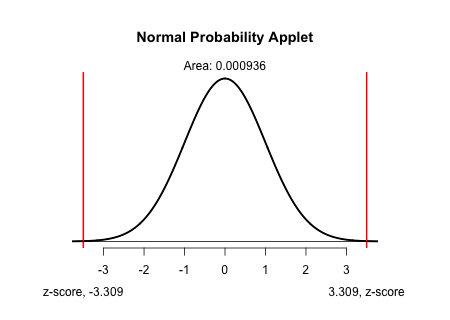

```{r,results='asis',echo=FALSE}
if(params$key==TRUE){
  if(params$plinks==TRUE) cat("* [Word Document](",paste(params$keyname,"docx",sep="."),")\n")
  if(params$plinks==TRUE) cat("* [PDF Document](",paste(params$keyname,"pdf",sep="."),")\n")
  cat("<!--")
  cat("\n")
} 
if(params$key!=TRUE){
  if(params$plinks==TRUE) cat("* [Word Document](",paste(params$docname,"docx",sep="."),")\n")
  if(params$plinks==TRUE) cat("* [PDF Document](",paste(params$docname,"pdf",sep="."),")\n")
  cat("\n")
}
```

**Directions: Please fill in Part I as you study the Reading Assignment. Once you finish the reading, complete the questions on Part II. You may use your notes, the key, and the help videos. Be sure to take this completed assignment to your group meeting where you can ask and help answer questions on this assignment.**

## Problems

```{r,echo=FALSE,warning=FALSE,message=FALSE}
library(ggplot2)
library(ggthemes)
library(pander)
panderOptions('keep.line.breaks',TRUE)
source("../scripts/ggQQline.R")
source("../scripts/normTail.R")
source("../scripts/221_Interactive_Functions.R")
```

**Part I:**  Use the information in the reading assignment to complete these questions.  

1.	What is the null hypothesis for the significance test comparing two population proportions?

2.	What is the formula for a test statistic for testing two population proportions?  Explain what each variable stands for in your formula.

3. What is the confidence interval for comparing two proportions?  Explain what each variable stands for in your formula.

**Part II:  You will complete Part II with your group at Group Preparation**

*Use the following data summary to answer questions 4-6*

```{r,include=FALSE}
n1Women = 296
n1Men = 251

x1Women = 63
x1Men = 27


phat1Women = x1Women/n1Women
phat1Men = x1Men/n1Men
phat1 = (x1Men+x1Women)/(n1Men+n1Women)

condition1_1Women = n1Women * phat1Women
condition1_1Men = n1Men * phat1Men

condition1_2Women = n1Women * (1 - phat1Women)
condition1_2Men = n1Men * (1 - phat1Men)

zScore1 = zTwoProp(phat1,phat1Women,phat1Men,n1Women,n1Men)
pValue1 = pnorm(zScore1, lower.tail = FALSE) * 2 

confLevel1 = 95
alpha1 = 1-(confLevel1/100)
zStar1 = zStar(confLevel1)

LB1 = confIntTwoProp(phat1Women,phat1Men,n1Women,n1Men,zStar1)[[1]]
UB1 = confIntTwoProp(phat1Women,phat1Men,n1Women,n1Men,zStar1)[[2]]
```


```{r, echo=FALSE, results='asis'}
dataSummary = data.frame(Population= c("Women","Men"), `Sample Size`=c(n1Women,n1Men), X=c(x1Women,x1Men),check.names = FALSE)
pander(dataSummary)
```   

4. There was a recent survey taken on whether consumers are "label users" who pay attention to label details when buying clothes.  Are men and women equally likely to be label users?  Determine if the proportion of men who use labels are different than the proportion women who use labels with a level of significance of $\alpha = `r alpha1`$.

    a. Check the Requirements
    
    b. State the null and alternative hypotheses 

    c. Compute the Test Statistic

    d. Compute the P-value

    e. Shade your P-value on the normal distribution curve with the Test statistic labeled.

    f. What decision do you make about the null hypothesis?

    g. State your conclusions in "layman's terms".

5. Construct a `r confLevel1`% confidence interval for the difference of the two proportions in #4.  

6. Interpret the confidence interval you constructed in #5.

```{r,include=FALSE}
#norm dist for question 4e

png(filename = "../images/L18_Prep_Q04e_normalDistributionApplet.png",width = 450,height=320)
normTail(L=round(zScore1*-1,3),U=round(zScore1,3),lwd=2.5,df = 700000)
dev.off()
```


```{r, include=FALSE}
if(params$key==TRUE){
#solutions
  
Solution01 = data.frame(Part="-",Solution="$H_0:p_1 = p_2$")

Solution02 = data.frame(Part="-",Solution="$z = \\frac{(\\hat{p}_1-\\hat{p}_2)-(p_1-p_2)}{\\sqrt{\\hat{p}(1-\\hat{p})(\\frac{1}{n_1}+\\frac{1}{n_2})}}$ \\\n $\\hat{p}_1 = \\text{Sample proportion for group 1}$ \\\n $\\hat{p}_2 = \\text{Sample proportion for group 2}$ \\\n $\\hat{p} = \\text{Overall sample proportion}$ \\\n $n_1 = \\text{Sample size for group 1}$ \\\n $n_2 = \\text{Sample size for group 2}$")
  
Solution03 = data.frame(Part="-",Solution="$(\\hat{p}_1 - \\hat{p}_2) \\pm z^* \\sqrt{\\frac{\\hat{p}_1(1 - \\hat{p}_1)}{n_1} + \\frac{\\hat{p}_2(1 - \\hat{p}_2)}{n_2}}$ \\\n $\\hat{p}_1 = \\text{Sample proportion for group 1}$ \\\n $\\hat{p}_2 = \\text{Sample proportion for group 2}$ \\\n $n_1 = \\text{Sample size for group 1}$ \\\n $n_2 = \\text{Sample size for group 2}$ \\\n $z^* = \\text{z value for a confidence interval}$")

Solution04 = data.frame(Part = LETTERS[1:7],Solution= c(paste("$",n1Women,"*",round(phat1Women,3),"=",round(condition1_1Women,3)," >10$ \\\n $",n1Men,"*",round(phat1Men,3),"=",round(condition1_1Men,3),">10$ \\\n $",n1Women,"(1-",round(phat1Women,3),")=",round(condition1_2Women,3),">10$ \\\n $",n1Men,"(1-",round(phat1Men,3),")=",round(condition1_2Men,3),">10$",sep = ""),
                                                        paste("$H_0:p_1 = p_2$ \\\n $H_0:p_1 \\neq p_2$",sep = ""),
                                                        paste("$z = ",round(zScore1,3),"$",sep = ""),
                                                        paste("$\\text{P-value} = ",round(pValue1,3),"$",sep = ""),
                                                        " \\\n Students should include a sketch of normal distribution curve with both to the left and right of the two z-scores shaded.",
                                                        failOrNot(pValue1,alpha1),
                                                        paste("We have ",sufficientOrNot(failOrNot(pValue1,alpha1))," evidence to say that there is a difference in the proportions of men who use labels and women who use labels.")))

Solution05 = data.frame(Part = "-",Solution = paste("(",round(LB1,3),", ",round(UB1,3),")",sep = ""))

Solution06 = data.frame(Part = "-",Solution = paste("We are ",confLevel1,"% confident that the true difference in the proportions of men being label users and women being label users is between ",round(LB1,3)," and ",round(UB1,3),".",sep = ""))

} # end params == TRUE.  We use this so it doesn't have to run for non answer key path. 
```


```{r,echo=FALSE,results='asis'}
if(params$key==TRUE){
  cat("-->")
   cat("\n\n## Solutions\n\n")
      cat("\n\n **Please note that the steps show rounded numbers, but that the final answers to the problems are calculated without rounding.**")
}
```


```{r,echo=FALSE,results='asis'}
if(params$key==TRUE){

    all_solutions = sort(ls(pattern="Solution"))
    key_list = NULL
    for (i in 1:length(all_solutions)){
      temp = get(all_solutions[i])
      temp$Solution = as.character(temp$Solution)
      key_list = rbind(key_list,data.frame(Problem=i,temp))
    }
    
      pander(key_list,split.cell = 80, split.table = Inf,justify = c( 'center', 'left',"left"))
} # end params == TRUE.  We use this so it doesn't have to run for non answer key path.

```


