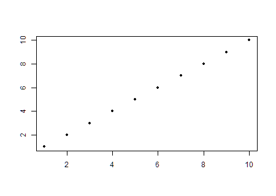

```{r,results='asis',echo=FALSE}
if(params$key==TRUE){
  if(params$plinks==TRUE) cat("* [Word Document](",paste(params$keyname,"docx",sep="."),")\n")
  if(params$plinks==TRUE) cat("* [PDF Document](",paste(params$keyname,"pdf",sep="."),")\n")
  cat("<!--")
  cat("\n")
} 
if(params$key!=TRUE){
  if(params$plinks==TRUE) cat("* [Word Document](",paste(params$docname,"docx",sep="."),")\n")
  if(params$plinks==TRUE) cat("* [PDF Document](",paste(params$docname,"pdf",sep="."),")\n")
  cat("\n")
}
```

**Directions: Please fill in Part I as you study the Reading Assignment. Once you finish the reading, complete the questions on Part II. You may use your notes, the key, and the help videos. Be sure to take this completed assignment to your group meeting where you can ask and help answer questions on this assignment.**

```{r,include=FALSE}
library(ggplot2)
library(ggthemes)
library(pander)
library(mosaic)
panderOptions('keep.line.breaks',TRUE)
source("../scripts/ggQQline.R")
source("../scripts/normTail.R")
source("../scripts/221_Interactive_Functions.R")
```


## Problems

**Part I:**  Use the information in the reading assignment to complete these questions.

1. Describe the role of the correlation coefficient.  What does it measure?  What are its bounds?

2. Sketch a graph of 10 (x,y) coordinates on an x-y plane where the data have a strong linear positive correlation.

```{r,include=FALSE}
Crocodiles = read.csv(file = "https://raw.githubusercontent.com/byuistats/data/master/GharialCrocodiles/GharialCrocodiles.csv",header = TRUE, stringsAsFactors = FALSE)

r1 = round(cor(HeadLength~BodyLength, data = Crocodiles),3)
Covar1 = round(cov(HeadLength~BodyLength, data = Crocodiles),3) #This is wrong in the historical file. Checked two places. 
```


**Part II:**  To answer the following questions, use the [Gharial Crocodiles Data.](https://byuistats.github.io/BYUI_M221_Book/Data/GharialCrocodiles.xlsx)

3. The Correlation Coefficient between Head Length and Body Length of the Gharial Crocodiles is:
	
4. Does this correlation show a strong, moderate, or weak relationship between Head Lenght and Body Length of the Gharial Crocodiles?

5. Create a scatter plot representing the relationship between Head Length and Body Length of the Gharial Crocodiles.  Paste your scatter plot below:

6. Discuss the relationship you see in the scatter plot between the two sets of bivariate data for the Gharial Crocodile.

```{r,include = FALSE}
png(filename = "../../images/L21_Prep_Q2_Sketch.png",width = 450,height=320)
plot(1:10,pch = 20, xlab = "",ylab = "")
dev.off()

png(filename = "../images/L21_Prep_Q5_Sketch.png",width = 450,height=320)
plot(BodyLength~HeadLength, data = Crocodiles,pch = 20, xlab = "",ylab = "")
dev.off()
```


```{r,include=FALSE}
if(params$key==TRUE){
#solutions
  
  Solution01 = data.frame(Part = "-",Solution = "The correlation coefficient is used to measure the direction and strength of the linear association between two variables.  The direction can either be positive, negative, or neither, and the strength can be described as weak, moderate, or strong.  It is always between -1 and 1 inclusive.")
  
  Solution02 = data.frame(Part = "-",Solution = "Students should have a graph sketched \\\n ")
  
  Solution03 = data.frame(Part = "-",Solution = paste("$r = ",r1,"$",sep = ""))
  
  Solution04 = data.frame(Part = "-",Solution = "This appears to be a strong positive correlation in looking at the graph and the value of the correlation, as the dots all fit very tightly to the line.")
  
  Solution05 = data.frame(Part = "-",Solution = "")
  
  Solution06 = data.frame(Part = "-",Solution = "There is a strong positive linear relationship between the head length and body length of the Gharial Crocodile.")
  
} # end params == TRUE.  We use this so it doesn't have to run for non answer key path. 
```


```{r,echo=FALSE,results='asis'}
if(params$key==TRUE){
  cat("-->")
   cat("\n\n## Solutions\n\n")
      cat("\n\n **Please note that the steps show rounded numbers, but that the final answers to the problems are calculated without rounding.**")
}
```


```{r,echo=FALSE,results='asis'}
if(params$key==TRUE){

    all_solutions = sort(ls(pattern="Solution"))
    key_list = NULL
    for (i in 1:length(all_solutions)){
      temp = get(all_solutions[i])
      temp$Solution = as.character(temp$Solution)
      key_list = rbind(key_list,data.frame(Problem=i,temp))
    }
    
      pander(key_list,split.cell = 80, split.table = Inf,justify = c( 'center', 'left',"left"))
} # end params == TRUE.  We use this so it doesn't have to run for non answer key path.

```
	

