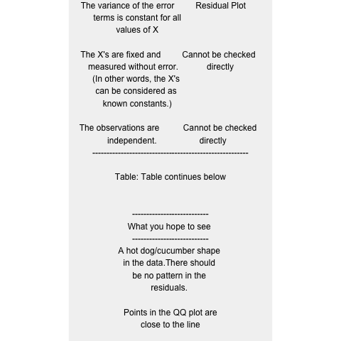
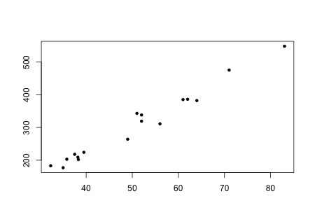
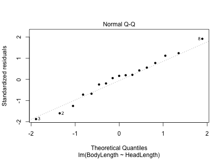

```{r,results='asis',echo=FALSE}
if(params$key==TRUE){
  if(params$plinks==TRUE) cat("* [Word Document](",paste(params$keyname,"docx",sep="."),")\n")
  if(params$plinks==TRUE) cat("* [PDF Document](",paste(params$keyname,"pdf",sep="."),")\n")
  cat("<!--")
  cat("\n")
} 
if(params$key!=TRUE){
  if(params$plinks==TRUE) cat("* [Word Document](",paste(params$docname,"docx",sep="."),")\n")
  if(params$plinks==TRUE) cat("* [PDF Document](",paste(params$docname,"pdf",sep="."),")\n")
  cat("\n")
}
```

**Directions: Please fill in Part I as you study the Reading Assignment. Once you finish the reading, complete the questions on Part II. You may use your notes, the key, and the help videos. Be sure to take this completed assignment to your group meeting where you can ask and help answer questions on this assignment.**

```{r,include=FALSE}
library(ggplot2)
library(ggthemes)
library(pander)
library(mosaic)
library(gridExtra)
panderOptions('keep.line.breaks',TRUE)
source("../scripts/ggQQline.R")
source("../scripts/normTail.R")
source("../scripts/221_Interactive_Functions.R")
```

## Problems

**Part I:**  Use the information in the reading assignment to complete these questions.

```{r,include=FALSE}
Assumptions = data.frame(A = c("There is a linear relationship between X and Y","The error term is normally distributed","The variance of the error terms is constant for all values of X","The X's are fixed and measured without error. (In other words, the X's can be considered as known constants.)","The observations are independent."),H =c("Make a scatterplot and check visually for a linear relationship.  Then make a residual plot as well.","QQ plot of the residuals","Residual Plot","Cannot be checked directly","Cannot be checked directly"), W = c("A hot dog/cucumber shape in the data.There should be no pattern in the residuals.","Points in the QQ plot are close to the line","No megaphone shape in the residuals","X's should be measured accurately and precisely.","Knowing the value of one of the Y's tells you nothing about any other points."))
colnames(Assumptions) = c("Assumption","How you Check","What you hope to see")


AssumptionsPan = pander(Assumptions,split.cells = c(25,25,25))
png(filename = "../images/L23_Prep_AssumptionsChart.png")
tt <- ttheme_default(colhead=list(fg_params = list(parse=TRUE)))
grid.table(AssumptionsPan,theme=tt)
dev.off()
```


1. What are the five assumptions to check in order to do inference for simple linear regression?  How do we check for them?  Answer these questions by filling in the following chart:

2. In the formula: $Y= \beta_0+ \beta_1 X + \epsilon$  state which each symbol stands for.

```{r,include=FALSE}
Croc = read.csv("https://raw.githubusercontent.com/byuistats/data/master/GharialCrocodiles/GharialCrocodiles.csv",header = TRUE,stringsAsFactors = FALSE)

#Scatterplot for question 1a.
png(filename = "../images/L23_Prep_Q3a_Sketch.png",width = 450,height=320)
plot(BodyLength~HeadLength, data = Croc,pch = 20, xlab = "",ylab = "")
dev.off()

#QQplot for question 1b.
png(filename = "../images/L23_Prep_Q3b_qq.png",width = 450,height=320)
results = lm(BodyLength~HeadLength, data = Croc)
plot(results,which = 2,pch = 20) 
dev.off()

png(filename = "../images/L23_Prep_Q3c_error.png",width = 450,height=320)
plot(results,which = 1,pch = 20)
dev.off()

confInt = 95
alpha = 1 - (confInt/100)

t = summary(results)[[4]][6]
p = summary(results)[[4]][8]

#These are the same as the SPSS results. I don't know how to get the excel results. 
LB = confint(results,'HeadLength',level = confInt/100)[1]
UB = confint(results,'HeadLength',level = confInt/100)[2]
```

 
**Part II:**  To answer the following questions, use the [Gharial Crocodiles Data](http://statistics.byuimath.com/index.php?title=Data) in the Wiki under the data link in Course Resources.

3. Check the five assumptions for conducting a linear regression on the data.  List the five assumptions below and explain how you checked the assumption.  Include charts/graphs where appropriate.  

4. Test if there is a linear relationship between Head Length and Body Length.  Let $\alpha = `r alpha`$  

    a. State the null and alternative hypotheses.
    
    b. Let alpha = `r alpha`

    c. State the test static and value of test statistic

    d. Based on the P-value, do you reject or fail to reject the null.

    e. State your conclusion.

5. Create a `r confInt`% confidence interval for the true slope of the regression line relating Head Length and Body Length.

```{r,include=FALSE}
if(params$key==TRUE){
#solutions
options(scipen = 999)
  
  Solution01 = data.frame(Part = "-",Solution = "")
  
  Solution02 = data.frame(Part = "-",Solution = "$\\beta_0$ is the parameter y-intercept for the population \\\n $\\beta_1$ is the parameter slope for the population. \\\n $\\epsilon$ is the error term--a normal random variable.")
  
  Solution03 = data.frame(Part = LETTERS[1:5],Solution = c("There is a linear relationship between X and Y. - Yes points on the scatter plot are close together and in a 'hotdog' shape. \\\n ",
                                                           "The error term $\\epsilon$ is normally distributed - Yes. Made a QQ plot of the residuals and the points are close to linear. \\\n ",
                                                           "The variance of the error terms is constant for all values of X - Yes there is no megaphone shape in the residual scatter plot. \\\n ",
                                                           "X's are fixed and measured without error. (In other words, the X's can be considered as known constants.) We will assume that X's have been measured accurately and precisely.",
                                                           "The observations are independent. - We will assume that the Y's are independent."))
  
  Solution04 = data.frame(Part = LETTERS[1:5],Solution = c("$H_0: \\beta_1 = 0$ \\\n $H_a: \\beta_2 \\neq 0$",
                                                           paste("$\\text{Let alpha} = ",alpha,"$",sep = ""),
                                                           paste("It is a t-test statistic \\\n $t = ",round(t,3),"$",sep = ""),
                                                           paste("$\\text{P-value} = ",round(p,15)," < ",alpha,"$ \\\n Therefore we ",failOrNot(p,alpha),".",sep = ""),
                                                           paste("We have ",sufficientOrNot(failOrNot(p,alpha))," evidence to suggest that there is a linear relationship between the head length and the body length of the Gharial crocodiles.",sep = "")))
  
  Solution05 = data.frame(Part = "-",Solution = paste("The ",confInt,"% confidence interval for the true slope of the regression line is (",round(LB,3),", ",round(UB,3),")",sep = ""))
  
} # end params == TRUE.  We use this so it doesn't have to run for non answer key path. 
```


```{r,echo=FALSE,results='asis'}
if(params$key==TRUE){
  cat("-->")
   cat("\n\n## Solutions\n\n")
      cat("\n\n **Please note that the steps show rounded numbers, but that the final answers to the problems are calculated without rounding.**")
}
```


```{r,echo=FALSE,results='asis'}
if(params$key==TRUE){

    all_solutions = sort(ls(pattern="Solution"))
    key_list = NULL
    for (i in 1:length(all_solutions)){
      temp = get(all_solutions[i])
      temp$Solution = as.character(temp$Solution)
      key_list = rbind(key_list,data.frame(Problem=i,temp))
    }
    
      pander(key_list,split.cell = 80, split.table = Inf,justify = c( 'center', 'left',"left"))
} # end params == TRUE.  We use this so it doesn't have to run for non answer key path.

```


